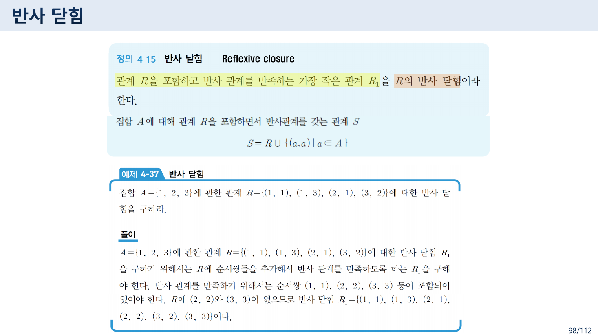
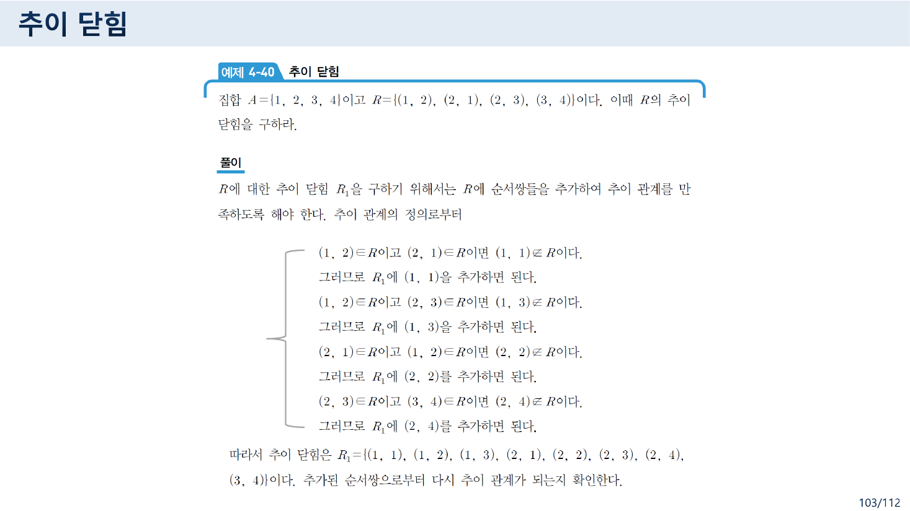
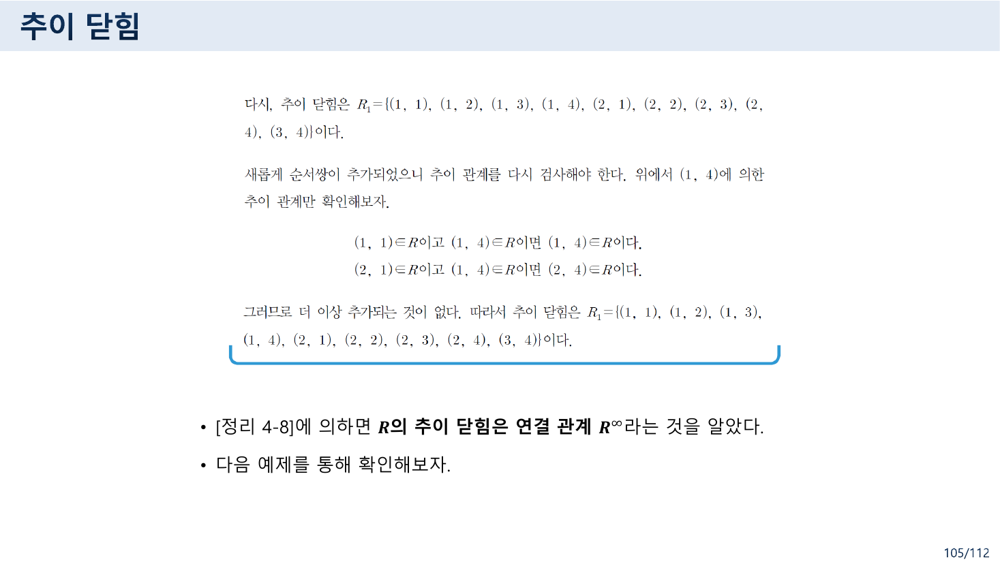
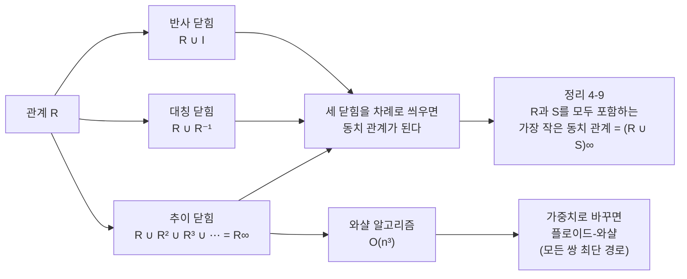
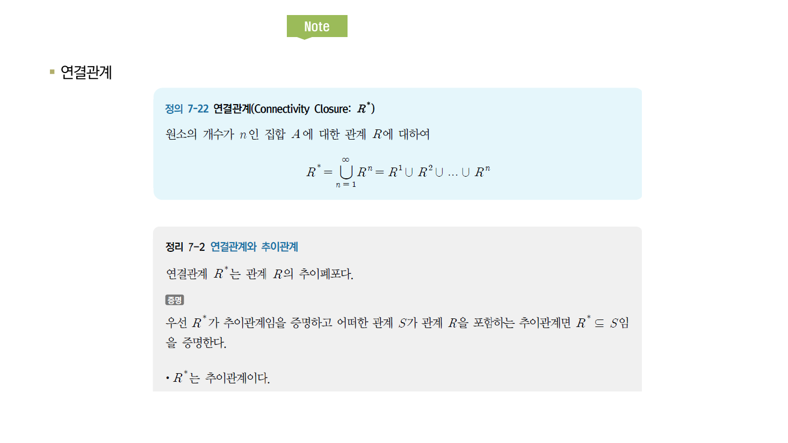
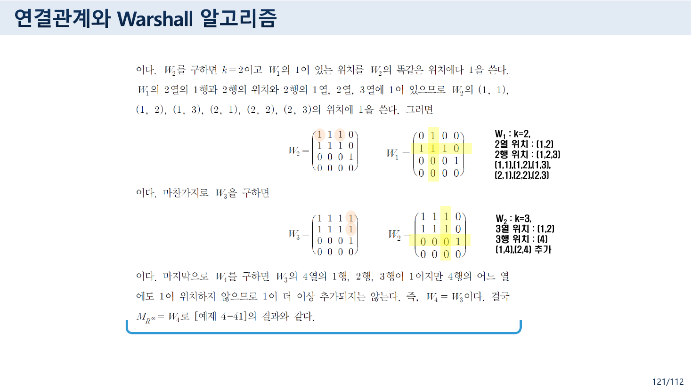
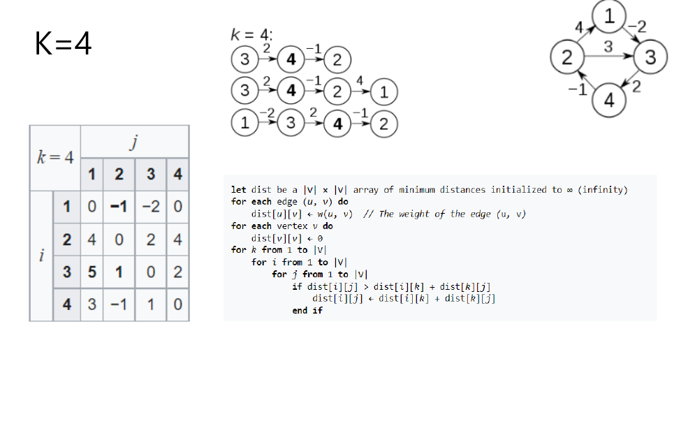
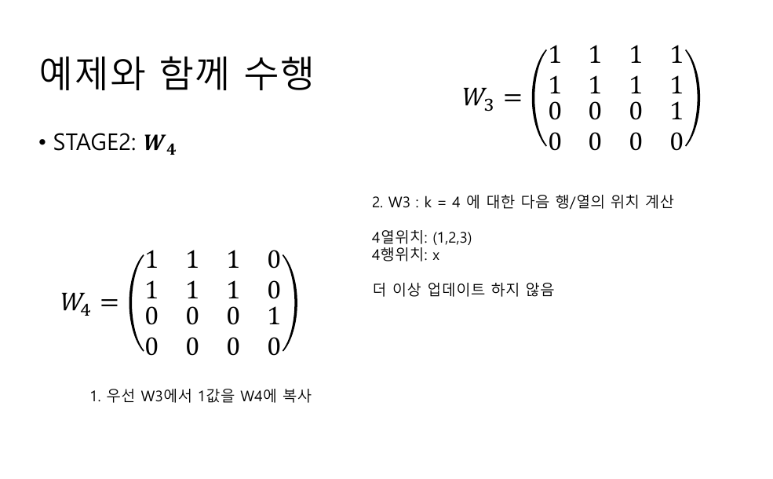
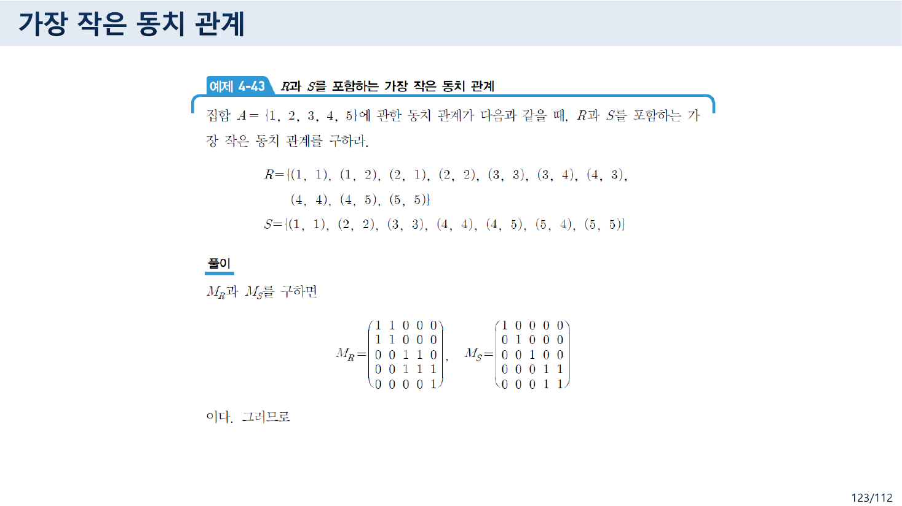

> [!abstract] 이 묶음이 실제로 하는 말
> [08번 노트](./08.%20%EA%B2%BD%EB%A1%9C%EB%8A%94%20%EA%B3%B1%ED%95%98%EA%B3%A0%20%EC%84%B1%EC%A7%88%EC%9D%80%20%EB%94%B0%EC%A7%84%EB%8B%A4%20%E2%80%94%20%E3%80%8C%EB%AA%A8%EB%93%A0%E3%80%8D%EC%9D%B4%EB%9D%BC%20%EC%8D%A8%EC%95%BC%20%ED%95%A0%20%EC%9E%90%EB%A6%AC%EC%9D%98%20%E3%80%8C%EC%96%B4%EB%96%A4%E3%80%8D.md)의 4.4절이 던진 질문은 **판정**이었다 — *이 관계는 추이적인가?* 4.6절은 같은 세 성질을 가지고 **다른 질문**을 던진다. *추이적이 아니라면, 얼마나 보태야 추이적이 되는가?*
>
> 답이 「닫힘(closure)」이다. 그리고 세 닫힘이 **난이도가 전혀 다르다.**
>
> | 닫힘 | 무엇을 보태나 | 몇 번에 끝나나 |
> | --- | --- | --- |
> | 반사 닫힘 | $R \cup \{(a,a) \mid a \in A\}$ | **한 번** |
> | 대칭 닫힘 | $R \cup R^{-1}$ | **한 번** |
> | 추이 닫힘 | $R \cup R^2 \cup R^3 \cup \cdots$ | **모를 일** |
>
> 앞의 둘은 공식 하나로 끝난다. 무엇을 보태야 하는지 보기만 하면 알 수 있고, 보탠 것이 새 부족을 만들지 않기 때문이다. **추이 닫힘만 다르다.** 103~104쪽의 예제 4-40이 그것을 실물로 보여 준다 — 한 바퀴 돌며 부족한 쌍을 다 채웠더니 **그 채운 쌍들이 또 새 부족을 만든다.**
>
> 그 되풀이를 어떻게 끝내는가에 대한 답이 105쪽 정리 4-8(추이 닫힘 = 연결 관계 $R^\infty$)과 119쪽 **와샬 알고리즘**이다. 그리고 부록은 같은 삼중 반복문에서 $\vee$·$\wedge$를 $\min$·$+$로 바꾸면 **플로이드-와샬**이 된다는 것을 보인다.
>
> 그 길목에 원본 오류가 셋 있다. **119쪽의 인쇄된 「열」·「행」 라벨은 교수가 붉은 펜으로 덧써 고쳐 놓았고**, 부록 11번 슬라이드의 $W_4$는 복사 단계가 갱신되지 않았으며, **123쪽 예제 4-43은 동치 관계가 아닌 관계를 동치 관계라고 부른다.**

---

## 1. 세 개의 닫힘 — 둘은 쉽고 하나는 어렵다

97쪽이 이 절을 앞 과목으로 연결한다.

> 이미 1장에서, 산술 연산에 대한 닫힘부터 집합에서의 닫힘 성질들을 설명했다.

자연수가 덧셈에 닫혀 있다는 그 「닫힘」과 같은 말이다. **연산의 결과가 밖으로 나가지 않는 상태.** 관계에서는 "성질이 요구하는 순서쌍이 밖에 남아 있지 않은 상태"가 된다.



98쪽 정의 4-15가 **최소성**을 정의의 핵심에 둔다.

> 관계 $R$을 포함하고 반사 관계를 만족하는 **가장 작은 관계** $R_1$을 $R$의 **반사 닫힘**이라 한다.
> $$S = R \cup \{(a, a) \mid a \in A\}$$

"가장 작은"이 없으면 $A \times A$ 전체도 답이 되어 버린다. **최소성이 닫힘을 유일하게 만든다.**

예제 4-37에서 $A = \{1,2,3\}$, $R = \{(1,1),(1,3),(2,1),(3,2)\}$의 반사 닫힘은 $(2,2)$와 $(3,3)$만 더한 것이다. 행렬로는 **주대각을 전부 1로 칠하는 일**이고, 그래프로는 **모든 정점에 고리를 하나씩 그리는 일**이다. 99쪽의 Note 슬라이드가 그 그림을 직접 보여 준다.

100~101쪽의 대칭 닫힘도 마찬가지로 한 번에 끝난다. 예제 4-39에서 같은 $R$의 대칭 닫힘은

$$R_1 = R \cup R^{-1} = \{(1,1),(1,2),(1,3),(2,1),(2,3),(3,1),(3,2)\}$$

행렬로는 $M_R \vee (M_R)^T$다. **[09번 노트](./09.%20%EA%B0%99%EC%9D%80%20%EC%97%B0%EC%82%B0%EC%9D%B4%20%EB%91%90%20%EC%9D%B4%EB%A6%84%EC%9C%BC%EB%A1%9C%20%EB%B6%88%EB%A6%B0%EB%8B%A4%20%E2%80%94%20R%E2%88%98S%EC%99%80%20S%E2%88%98R.md)에서 본 전치 하나면 된다.**

왜 이 둘은 한 번에 끝나는가. **보탠 쌍이 새 의무를 만들지 않기 때문**이다. $(a,a)$를 보태도 반사성이 더 요구하는 것은 없고, $(b,a)$를 보태도 대칭성이 더 요구하는 것은 $(a,b)$뿐인데 그건 이미 있다.

---

## 2. 추이 닫힘 — 채우면 또 생긴다



103쪽의 예제 4-40이 그 차이를 실물로 드러낸다. $A = \{1,2,3,4\}$, $R = \{(1,2),(2,1),(2,3),(3,4)\}$.

**첫 바퀴** — 추이성이 요구하는데 없는 쌍을 찾는다.

| $aRb$ | $bRc$ | 필요한 $(a,c)$ | 있나 |
| --- | --- | --- | --- |
| $(1,2)$ | $(2,1)$ | $(1,1)$ | 없음 → 추가 |
| $(1,2)$ | $(2,3)$ | $(1,3)$ | 없음 → 추가 |
| $(2,1)$ | $(1,2)$ | $(2,2)$ | 없음 → 추가 |
| $(2,3)$ | $(3,4)$ | $(2,4)$ | 없음 → 추가 |

$$R_1 = \{(1,1),(1,2),(1,3),(2,1),(2,2),(2,3),(2,4),(3,4)\}$$

103쪽 마지막 줄이 그냥 지나가지 않는다.

> 추가된 순서쌍으로부터 **다시 추이 관계가 되는지 확인한다.**

**둘째 바퀴** — 104쪽이 열일곱 줄을 더 확인하고, 그중 두 줄에 초록 체크 표시를 찍는다.

> $(1, 2) \in R$이고 $(2, 4) \in R$이면 $(1, 4) \notin R$이다. 그러므로 $R_1$에 $(1, 4)$를 추가하면 된다. ✔
> $(1, 3) \in R$이고 $(3, 4) \in R$이면 $(1, 4) \notin R$이다. 그러므로 $R_1$에 $(1, 4)$를 추가하면 된다. ✔

**첫 바퀴에서 추가한 $(2,4)$와 $(1,3)$이 각각 새로운 부족 $(1,4)$를 만들어 냈다.** 이것이 추이 닫힘이 어려운 이유 전부다.

$$R^{+} = \{(1,1),(1,2),(1,3),(1,4),(2,1),(2,2),(2,3),(2,4),(3,4)\}$$

아홉 쌍으로 끝난다. 그런데 **끝났다는 것을 어떻게 아는가?** 셋째 바퀴를 돌려 아무것도 추가되지 않는 것을 확인하는 수밖에 없다. 이 종료 조건이 105쪽의 정리로 정리된다.



> [정리 4-8]에 의하면 $R$의 추이 닫힘은 **연결 관계 $R^\infty$**라는 것을 알았다.

$R^\infty = R \cup R^2 \cup R^3 \cup \cdots$였고(08번 노트), 09번 노트에서 본 대로 거듭제곱은 유한 번에 주기로 갇힌다. **"닫힐 때까지 되풀이한다"가 "$|A|$번 곱한다"로 바뀐 것**이 정리 4-8의 값어치다. 114쪽의 예제 7-22가 그 값을 명시한다 — *"집합 $A$의 기수는 $|A| = 4$이므로, 거듭제곱을 네 번하여 연결관계를 만든다."*

### 세 닫힘의 관계



### 111~113쪽 — 같은 답을 두 방법으로

111쪽의 예제 4-41이 예제 4-40의 관계에 대해 **연결 관계를 두 가지로** 구한다.

- **방법 1 — 유향 그래프.** 각 정점에서 갈 수 있는 곳을 눈으로 따라간다. *"1에서 시작하여 1, 2, 3, 4로의 경로들을 구할 수 있다"* 식으로 아홉 쌍을 얻는다.
- **방법 2 — 관계 행렬.** $(M_R)^2, (M_R)^3, (M_R)^4, (M_R)^5$를 부울곱으로 구한 뒤 전부 합친다.

113쪽이 방법 2에서 **주기**를 발견한다.

$$(M_R)^{\infty}_\odot = \begin{cases} M_R, & n = 1 \\ (M_R)^2_\odot, & n \text{이 짝수} \\ (M_R)^3_\odot, & n \text{이 홀수} \end{cases}$$

따라서 $M_{R^\infty} = M_R \vee (M_R)^2 \vee (M_R)^3$이면 충분하다. 두 방법의 답이 같다.

$$R^\infty = \{(1,1),(1,2),(1,3),(1,4),(2,1),(2,2),(2,3),(2,4),(3,4)\}$$

> [!caution] 원본 불일치 — 41쪽의 $R^{*}$와 109쪽의 $R^{*}$가 서로 다르다
> 
>
> 41쪽의 정의 4-7(3)은 이렇게 적었다.
>
> > 집합 $A$에 관한 관계 $R$에 대해 **도달 관계 $R^{*}$**를 정의하면, $x = y$ 혹은 $x R^\infty y$이다.
>
> 109쪽의 정의 7-22(한빛아카데미 교재 인용)는 이렇게 적는다.
>
> > **연결관계(Connectivity Closure: $R^{*}$)** $\quad R^{*} = \bigcup_{n=1}^{\infty} R^n = R^1 \cup R^2 \cup \cdots \cup R^n$
>
> 109쪽의 $R^{*}$는 **41쪽의 $R^\infty$**와 같은 것이고, 41쪽의 $R^{*}$($= R^\infty \cup I$)와는 다르다. $R$이 반사적이 아니면 두 관계는 실제로 달라진다. 예제 4-41의 $R$이 그렇다 — $(4,4)$는 $R^\infty$에 없지만 41쪽 정의의 $R^{*}$에는 있다.
>
> 같은 파일에서 **같은 기호가 두 개의 관계**를 가리키고, 115쪽은 그 $R^{*}$를 쓰면서 「추이폐포」라고 부른다. 09번 노트에서 본 $\circ$의 방향 충돌과 정확히 같은 구조다 — **교재 인용 슬라이드와 본 강의 슬라이드가 다른 표기 관행을 쓴다.**
>
> 109쪽 정의 7-22에는 표기 결함이 하나 더 있다. $\bigcup_{n=1}^{\infty} R^n$의 $n$은 합집합의 **속박 변수**인데, 바로 뒤의 $\cdots \cup R^n$에서 같은 $n$을 **상한**으로 다시 쓴다. 실제로 뜻하는 바는 $\bigcup_{k=1}^{|A|} R^k$이다.

---

## 3. 와샬 알고리즘 — 그리고 붉은 펜

118쪽이 문제를 정리한다.

> 연결 관계를 구하는 방법
>
> 1) 유향 그래프를 이용하는 방법 : **복잡해지면 완전하게 구하는 것이 어려움**
> 2) 관계 행렬을 이용하는 방법 : **무한번 반복 계산해야 한다는 문제점**
>
> ❖ 1)과 2)의 문제점을 해결하는 방법이 **Warshall 법칙**

2)의 진단이 정확하지는 않다 — 113쪽이 이미 주기를 찾아 유한 번으로 줄였다. 그러나 **부울곱을 $|A|$번 하면 $O(n^4)$**이고, 와샬은 그것을 $O(n^3)$으로 줄인다. 실질적인 개선은 거기 있다.


119쪽의 알고리즘 4-1이 절차를 세 단계로 적는다.

> 와샬 알고리즘을 이용해서 $W_{k-1}$에서 $W_k$를 구하는 과정을 $k = 1$부터 $k = n$까지 반복적으로 계산한다.
>
> - **단계 1** : $W_{k-1}$의 1을 $W_k$로 모두 옮겨 쓴다.
> - **단계 2** : 성분이 1인 $W_{k-1}$의 $k$**열**의 위치$(p_1, p_2, \cdots)$와 성분이 1인 $W_{k-1}$의 $k$**행**의 위치$(q_1, q_2, \cdots)$를 나열한다.
> - **단계 3** : $W_k$의 $(p_i, q_i)$의 위치에 1을 쓴다(모든 $i$, $j$의 조합에 대해서).

인쇄된 이 세 줄을 그대로 따라가면 걸린다. 그래서 강의 중에 손이 한 번 들어갔다.

> [!caution] 원본 오류 — 119쪽: 교수가 붉은 펜으로 라벨을 고쳐 놓았다
> 슬라이드의 인쇄된 문장 위에 **붉은 글씨 두 개가 덧씌워져 있다.** `k열의 위치` 위에는 **「행위치」**, `k행의 위치` 위에는 **「열위치」**라고 손으로 적혀 있다.
>
> 왜 고쳐야 했는가. 와샬의 갱신 규칙은
>
> $$W_k[i][j] = W_{k-1}[i][j] \ \vee\ \bigl(W_{k-1}[i][k] \wedge W_{k-1}[k][j]\bigr)$$
>
> 이다. 여기서 필요한 것은 **$k$열을 훑어서 얻은 행 번호 $i$들**과 **$k$행을 훑어서 얻은 열 번호 $j$들**이다. 인쇄된 문장은 *"$k$열의 위치$(p_1, \cdots)$"*라 써서 $p$가 무엇의 번호인지를 말하지 않는데, 실제로 $p$는 **행 번호**다. 교수의 붉은 「행위치」가 바로 그것을 보충한다.
>
> 그리고 **단계 3의 첨자는 실제로 틀렸다.** $(p_i, q_i)$라 적었으나 $p$와 $q$의 개수가 다를 수 있으므로 같은 첨자로 짝지을 수 없다. 괄호 안의 *"(모든 $i$, $j$의 조합에 대해서)"*가 그 뜻을 구제하지만, 식 자체는 $(p_i,\, q_j)$여야 한다.
>
> 이 과목에서 행·열을 말로 설명하다 어긋난 자리가 이번이 세 번째다 — 「수학적 모델과 논리」 26쪽의 우선순위표([02번 노트](./02.%20%ED%95%9C%20%ED%8C%8C%EC%9D%BC%EC%97%90%20%EC%B1%85%20%EB%91%90%20%EA%B6%8C%20%E2%80%94%20%EC%9D%98%EB%AF%B8%EB%A1%9C%20%EA%B0%80%EB%A5%B4%EC%B9%98%EB%8A%94%20%EB%85%BC%EB%A6%AC%EC%99%80%20%ED%8C%8C%EC%8B%B1%EC%9C%BC%EB%A1%9C%20%EA%B0%80%EB%A5%B4%EC%B9%98%EB%8A%94%20%EB%85%BC%EB%A6%AC.md)), 이 자료 33쪽의 관계 행렬 서술([07번 노트](./07.%20%EA%B4%80%EA%B3%84%EB%8A%94%20%EC%9B%90%EC%86%8C%EB%A5%BC%20%EB%B2%84%EB%A6%B4%20%EC%88%98%20%EC%9E%88%EB%8B%A4%20%E2%80%94%204%EC%AA%BD%EC%9D%98%20%EC%A0%95%EC%9D%98%EC%99%80%2032%EC%AA%BD%EC%9D%98%20%EA%B7%B8%EB%A6%BC%20%EC%82%AC%EC%9D%B4.md)), 그리고 여기. **다른 점은 여기서만 교수가 직접 고쳤다는 것이다.** 강의 중에 학생들이 걸려 넘어졌다는 흔적으로 읽힌다.

### 단계별로 돌려 보기



120~121쪽의 예제 4-42가 예제 4-41의 같은 행렬에 와샬을 적용한다. 각 단계에 교수가 오른쪽에 메모를 달아 두었다 — *"$W_0$ : $k=1$, 1열 위치 : (2), 1행 위치 : (2), $(2,2) \to 1$"*.

```html preview h=700px
<div id="wsh" style="font-family:system-ui,-apple-system,'Segoe UI',sans-serif;color:var(--foreground);padding:18px">
  <div style="font-size:13px;font-weight:600;margin-bottom:4px">예제 4-41 / 4-42 · 부록 — 와샬 알고리즘 단계별 실행</div>
  <div style="font-size:12px;opacity:.75;margin-bottom:14px">
    R = {(1,2), (2,1), (2,3), (3,4)} · k를 1부터 4까지 올리며 W<sub>k</sub>를 만든다.
    가로띠는 <b>k행</b>(→ 열 번호 q), 세로띠는 <b>k열</b>(→ 행 번호 p)이다.
  </div>
  <div style="display:flex;gap:10px;align-items:center;flex-wrap:wrap;margin-bottom:16px">
    <button id="w-prev" class="wb">◀ 이전</button>
    <div id="w-k" style="font-size:15px;font-weight:700;min-width:70px;text-align:center"></div>
    <button id="w-next" class="wb">다음 ▶</button>
    <button id="w-reset" class="wb">처음으로</button>
  </div>
  <div style="display:flex;gap:32px;flex-wrap:wrap;align-items:flex-start">
    <div>
      <div style="font-size:12px;font-weight:600;margin-bottom:6px">W<sub><span id="w-lab"></span></sub></div>
      <table id="w-mat"></table>
    </div>
    <div style="flex:1;min-width:280px">
      <div id="w-exp" style="font-size:12.5px;line-height:1.9"></div>
    </div>
  </div>
  <div id="w-final" style="margin-top:16px;font-size:12.5px;line-height:1.8;padding:11px 13px;border:1px solid var(--border);border-radius:8px;background:var(--card)"></div>
  <style>
    #wsh .wb{background:var(--card);color:var(--foreground);border:1px solid var(--border);
      border-radius:7px;padding:6px 12px;font-size:12px;cursor:pointer;font-family:inherit}
    #wsh .wb:hover{border-color:var(--chart-1)}
    #wsh table{border-collapse:collapse;font-family:ui-monospace,monospace;font-size:13px}
    #wsh td,#wsh th{border:1px solid var(--border);width:38px;height:34px;text-align:center}
    #wsh th{opacity:.7;font-weight:600}
    #wsh td{background:var(--card)}
    #wsh td.one{background:var(--chart-1);color:var(--card);font-weight:700}
    #wsh td.band{box-shadow:inset 0 0 0 2px var(--chart-3)}
    #wsh td.new{background:var(--chart-5);color:var(--card);font-weight:700}
  </style>
</div>
<script>
(function(){
  var root=document.getElementById('wsh');
  var W0=[[0,1,0,0],[1,0,1,0],[0,0,0,1],[0,0,0,0]];
  var steps=[]; // {W, k, ps, qs, added}
  (function build(){
    var W=W0.map(function(r){return r.slice();});
    steps.push({W:W.map(function(r){return r.slice();}),k:0,ps:[],qs:[],added:[]});
    for(var k=0;k<4;k++){
      var ps=[],qs=[],added=[];
      for(var i=0;i<4;i++) if(W[i][k]) ps.push(i);
      for(var j=0;j<4;j++) if(W[k][j]) qs.push(j);
      var N=W.map(function(r){return r.slice();});
      ps.forEach(function(i){ qs.forEach(function(j){
        if(!N[i][j]){ N[i][j]=1; added.push([i,j]); }
      });});
      W=N;
      steps.push({W:W.map(function(r){return r.slice();}),k:k+1,ps:ps,qs:qs,added:added});
    }
  })();
  var s=0;
  function draw(){
    var st=steps[s], k=st.k;
    var prev = s>0 ? steps[s-1] : null;
    var h='<tr><th></th><th>1</th><th>2</th><th>3</th><th>4</th></tr>';
    for(var i=0;i<4;i++){
      h+='<tr><th>'+(i+1)+'</th>';
      for(var j=0;j<4;j++){
        var cls=st.W[i][j]?'one':'';
        if(k>0 && (i===k-1 || j===k-1)) cls+=' band';
        if(st.added.some(function(a){return a[0]===i&&a[1]===j;})) cls='new';
        h+='<td class="'+cls+'">'+st.W[i][j]+'</td>';
      }
      h+='</tr>';
    }
    root.querySelector('#w-mat').innerHTML=h;
    root.querySelector('#w-lab').textContent=k;
    root.querySelector('#w-k').textContent = k===0? '초기값' : 'k = '+k;
    var e;
    if(k===0){
      e='<b>W₀ = M<sub>R</sub></b><br>관계 행렬을 그대로 시작값으로 둔다.<br>'+
        '<span style="opacity:.75">4×4 행렬이므로 W₄까지 구하면 끝난다.</span>';
    } else {
      var ps=prev.ps.length? st.ps.map(function(x){return x+1;}).join(', ') : '';
      e='<b>단계 1</b> — W<sub>'+(k-1)+'</sub>의 1을 그대로 옮긴다.<br><br>'+
        '<b>단계 2</b> — W<sub>'+(k-1)+'</sub>에서<br>'+
        '&nbsp;&nbsp;· <b>'+k+'열</b>에서 1인 <b>행</b> 번호 p = ('+(st.ps.map(function(x){return x+1;}).join(', ')||'없음')+')<br>'+
        '&nbsp;&nbsp;· <b>'+k+'행</b>에서 1인 <b>열</b> 번호 q = ('+(st.qs.map(function(x){return x+1;}).join(', ')||'없음')+')<br>'+
        '<span style="opacity:.7;font-size:11.5px">— 119쪽에 교수가 붉은 펜으로 「행위치」·「열위치」라 덧쓴 자리가 여기다.</span><br><br>'+
        '<b>단계 3</b> — 모든 (p, q) 조합에 1을 쓴다.<br>'+
        (st.added.length
          ? '&nbsp;&nbsp;새로 1이 된 자리: <b>'+st.added.map(function(a){return '('+(a[0]+1)+','+(a[1]+1)+')';}).join(', ')+'</b>'
          : '&nbsp;&nbsp;<span style="opacity:.75">새로 추가되는 자리가 없다 — W<sub>'+k+'</sub> = W<sub>'+(k-1)+'</sub></span>');
    }
    root.querySelector('#w-exp').innerHTML=e;
    if(s===steps.length-1){
      var pr=[];
      for(i=0;i<4;i++)for(j=0;j<4;j++) if(st.W[i][j]) pr.push('('+(i+1)+','+(j+1)+')');
      root.querySelector('#w-final').innerHTML=
        '<b>R<sup>∞</sup></b> = {'+pr.join(', ')+'} &nbsp;<span style="opacity:.65">('+pr.length+'쌍)</span><br>'+
        '<span style="opacity:.8">111~113쪽이 유향 그래프와 부울곱으로 각각 구한 답과 정확히 같다. 부울곱은 네 번의 행렬 곱(O(n⁴))이 필요했지만 와샬은 삼중 반복문 한 번(O(n³))이다.</span>';
    } else {
      root.querySelector('#w-final').innerHTML='<span style="opacity:.7">k = 4까지 진행하면 연결 관계 R<sup>∞</sup>가 완성된다.</span>';
    }
  }
  root.querySelector('#w-prev').onclick=function(){ if(s>0){s--;draw();} };
  root.querySelector('#w-next').onclick=function(){ if(s<steps.length-1){s++;draw();} };
  root.querySelector('#w-reset').onclick=function(){ s=0;draw(); };
  draw();
})();
</script>
```

$k=1$에서는 $(2,2)$ 하나만 추가되고, $k=2$에서 여섯 자리가 한꺼번에 채워지며, $k=3$에서 $(1,4)$와 $(2,4)$가 붙고, $k=4$에서는 **4행이 전부 0이라 아무것도 추가되지 않는다.** 121쪽이 그 이유를 정확히 적는다 — *"$W_3$의 4열의 1행, 2행, 3행이 1이지만 **4행의 어느 열에도 1이 위치하지 않으므로** 1이 더 이상 추가되지는 않는다."*

---

## 4. 부록 — 같은 반복문에 다른 연산을 넣으면

`Appendix 1 Floyd Warshall Algorithm.pdf`는 20장짜리 별도 슬라이드인데, **앞 절반이 예제 4-41과 완전히 같은 행렬**로 와샬을 다시 돈다. 두 자료가 같은 예제를 공유한다는 사실이 부록의 목적을 말해 준다 — **익숙한 와샬에서 한 걸음만 옮겨 플로이드-와샬로 가기.**

5번 슬라이드가 그 다리를 놓는다.

> 우선, Warshall 알고리즘부터
> • **관계행렬일때 사용되며**, 연결관계가 있는지를 체크하기 위해 사용됨 — 즉 행렬의 값이 0과 1로만 표현될때임
> • 지속적인 부울곱(Boolean product)보다 계산이 용이함

그리고 12번 슬라이드가 코드를 준다.

```python
def warshall(a):
    assert (len(row) == len(a) for row in a)
    n = len(a)
    for k in range(n):
        for i in range(n):
            for j in range(n):
                a[i][j] = a[i][j] or (a[i][k] and a[k][j])
    return a
```

13번 슬라이드의 플로이드-와샬 의사코드는 **같은 삼중 반복문에서 `or`를 `min`으로, `and`를 `+`로** 바꾼 것이다.

```text
for k from 1 to |V|
  for i from 1 to |V|
    for j from 1 to |V|
      if dist[i][j] > dist[i][k] + dist[k][j]
        dist[i][j] ← dist[i][k] + dist[k][j]
```

$(\vee, \wedge)$가 $(\min, +)$로 바뀌었을 뿐인데 **"갈 수 있는가"가 "얼마나 싸게 갈 수 있는가"로 바뀐다.** 반복문의 뼈대는 한 글자도 달라지지 않는다.



### 두 알고리즘을 나란히 돌려 보기

부록이 쓰는 가중치 그래프는 정점 네 개에 간선 다섯 개다 — $1 \to 3\ (-2)$, $2 \to 1\ (4)$, $2 \to 3\ (3)$, $3 \to 4\ (2)$, $4 \to 2\ (-1)$. **음수 가중치가 둘 있다.**

```html preview h=700px
<div id="fw" style="font-family:system-ui,-apple-system,'Segoe UI',sans-serif;color:var(--foreground);padding:18px">
  <div style="font-size:13px;font-weight:600;margin-bottom:4px">부록 — 같은 삼중 반복문, 다른 연산</div>
  <div style="font-size:12px;opacity:.75;margin-bottom:14px">
    간선: 1→3 (−2), 2→1 (4), 2→3 (3), 3→4 (2), 4→2 (−1) · k를 올리며 두 표가 어떻게 달라지는지 본다.
  </div>
  <div style="display:flex;gap:10px;align-items:center;flex-wrap:wrap;margin-bottom:16px">
    <button id="f-prev" class="fb">◀</button>
    <div id="f-k" style="font-size:15px;font-weight:700;min-width:70px;text-align:center"></div>
    <button id="f-next" class="fb">▶</button>
  </div>
  <div style="display:flex;gap:34px;flex-wrap:wrap;align-items:flex-start">
    <div>
      <div style="font-size:12px;font-weight:600;margin-bottom:6px">와샬 — ∨ 와 ∧ &nbsp;<span style="font-weight:400;opacity:.7">갈 수 있는가</span></div>
      <table id="f-w"></table>
    </div>
    <div>
      <div style="font-size:12px;font-weight:600;margin-bottom:6px">플로이드-와샬 — min 과 + &nbsp;<span style="font-weight:400;opacity:.7">얼마나 싸게 가는가</span></div>
      <table id="f-d"></table>
    </div>
  </div>
  <div id="f-note" style="margin-top:16px;font-size:12.5px;line-height:1.8;padding:11px 13px;border:1px solid var(--border);border-radius:8px;background:var(--card)"></div>
  <style>
    #fw .fb{background:var(--card);color:var(--foreground);border:1px solid var(--border);
      border-radius:7px;padding:6px 13px;font-size:12px;cursor:pointer;font-family:inherit}
    #fw .fb:hover{border-color:var(--chart-1)}
    #fw table{border-collapse:collapse;font-family:ui-monospace,monospace;font-size:12.5px}
    #fw td,#fw th{border:1px solid var(--border);width:44px;height:32px;text-align:center}
    #fw th{opacity:.7;font-weight:600}
    #fw td{background:var(--card)}
    #fw td.one{background:var(--chart-1);color:var(--card);font-weight:700}
    #fw td.chg{background:var(--chart-5);color:var(--card);font-weight:700}
    #fw td.band{box-shadow:inset 0 0 0 2px var(--chart-3)}
  </style>
</div>
<script>
(function(){
  var root=document.getElementById('fw');
  var INF=Infinity;
  var E=[[0,2,-2],[1,0,4],[1,2,3],[2,3,2],[3,1,-1]];
  function init(){
    var W=[],D=[];
    for(var i=0;i<4;i++){ W.push([0,0,0,0]); D.push([INF,INF,INF,INF]); D[i][i]=0; }
    E.forEach(function(e){ W[e[0]][e[1]]=1; D[e[0]][e[1]]=Math.min(D[e[0]][e[1]],e[2]); });
    return {W:W,D:D};
  }
  var hist=[];
  (function(){
    var st=init();
    hist.push({W:st.W.map(function(r){return r.slice();}),D:st.D.map(function(r){return r.slice();}),k:0,chg:[]});
    for(var k=0;k<4;k++){
      var chg=[];
      for(var i=0;i<4;i++)for(var j=0;j<4;j++){
        var nw = st.W[i][j] || (st.W[i][k] && st.W[k][j]);
        var nd = Math.min(st.D[i][j], st.D[i][k]+st.D[k][j]);
        if(nd!==st.D[i][j]||nw!==st.W[i][j]) chg.push(i+','+j);
        st.W[i][j]=nw?1:0; st.D[i][j]=nd;
      }
      hist.push({W:st.W.map(function(r){return r.slice();}),D:st.D.map(function(r){return r.slice();}),k:k+1,chg:chg});
    }
  })();
  var s=0;
  function tbl(el,M,bool,k,chg){
    var h='<tr><th></th><th>1</th><th>2</th><th>3</th><th>4</th></tr>';
    for(var i=0;i<4;i++){
      h+='<tr><th>'+(i+1)+'</th>';
      for(var j=0;j<4;j++){
        var v=M[i][j];
        var txt = bool? v : (v===INF?'∞':v);
        var cls='';
        if(bool && v) cls='one';
        if(chg.indexOf(i+','+j)>=0) cls='chg';
        if(k>0 && (i===k-1||j===k-1) && cls==='') cls='band';
        h+='<td class="'+cls+'">'+txt+'</td>';
      }
      h+='</tr>';
    }
    el.innerHTML=h;
  }
  function draw(){
    var st=hist[s];
    tbl(root.querySelector('#f-w'),st.W,true,st.k,st.chg);
    tbl(root.querySelector('#f-d'),st.D,false,st.k,st.chg);
    root.querySelector('#f-k').textContent = st.k===0? '초기값' : 'k = '+st.k;
    root.querySelector('#f-note').innerHTML = st.k===0
      ? '두 표 모두 간선을 그대로 옮긴 것이다. 왼쪽은 있으면 1, 오른쪽은 가중치. 오른쪽 주대각은 0으로 둔다(제자리에 머무는 비용).'
      : '경유지 <b>'+st.k+'</b>번을 허용했을 때 바뀐 칸이 붉게 표시된다. '+
        (st.k===4
         ? '<br><b>최종 결과</b> — 1에서 2까지 −1, 3에서 1까지 5. 두 표가 같은 자리에서 같은 시점에 채워진다. <span style="opacity:.8">부록 18번 슬라이드의 표와 한 칸씩 대조해 일치를 확인했다.</span>'
         : '<br><span style="opacity:.8">왼쪽은 0이 1이 되는 일만 일어나고, 오른쪽은 값이 작아지는 일이 일어난다. 바뀌는 자리는 같다.</span>');
  }
  root.querySelector('#f-prev').onclick=function(){ if(s>0){s--;draw();} };
  root.querySelector('#f-next').onclick=function(){ if(s<hist.length-1){s++;draw();} };
  draw();
})();
</script>
```

두 표가 **같은 자리에서 같은 시점에** 바뀐다. 왼쪽이 $0 \to 1$이 되는 순간 오른쪽은 $\infty \to$ 유한값이 되고, 그 뒤로는 왼쪽은 더 바뀌지 않는데 오른쪽만 값이 깎인다. **도달 가능성은 단조롭게 늘기만 하고, 거리는 계속 줄 수 있다** — 이것이 $\vee$와 $\min$의 차이 전부다.

부록의 마지막 슬라이드가 성능을 적는다.

> • 시간복잡도 $\lvert V^3 \rvert$
> • **병렬처리가 가능하기 때문에** 유용하게 사용됨 — OpenMP 혹은 GPU 연산 가능
> • **All Pairs Shortest Paths (APSP)**라고 대신 이야기함

표기 $\lvert V^3 \rvert$은 $O(\lvert V \rvert^3)$이어야 한다(절댓값 기호 안에 지수가 들어갔다). 그리고 「병렬처리가 가능하다」는 한 줄이 중요하다 — 가장 안쪽 두 반복문($i$, $j$)은 서로 독립이므로 $k$ 한 단계 안에서 $n^2$개의 갱신을 동시에 할 수 있다.

> [!caution] 원본 오류 — 부록 11번 슬라이드: $W_4$의 「복사」 단계가 갱신되지 않았다
> 
>
> 슬라이드 오른쪽 위에 $W_3$이 정확히 적혀 있다.
>
> $$W_3 = \begin{pmatrix} 1&1&1&1 \\ 1&1&1&1 \\ 0&0&0&1 \\ 0&0&0&0 \end{pmatrix}$$
>
> 그리고 왼쪽 아래에 *"1. 우선 $W_3$에서 1값을 $W_4$에 복사"*라고 적고 이 행렬을 보인다.
>
> $$W_4 \;\overset{\text{원본}}{=}\; \begin{pmatrix} 1&1&1&\mathbf{0} \\ 1&1&1&\mathbf{0} \\ 0&0&0&1 \\ 0&0&0&0 \end{pmatrix}$$
>
> **4열의 1행·2행이 0이다.** $W_3$을 복사했다면 그 자리는 1이어야 한다. 지금 적힌 값은 **두 슬라이드 앞의 $W_2$**(정확히는 $W_1$을 복사한 시점의 중간값)에 해당한다. 앞선 세 단계(7·9·10번 슬라이드)에서는 복사 단계의 행렬이 모두 맞게 갱신되었으므로, 마지막 한 장에서만 이전 장의 그림을 재사용하다 고치지 못한 것으로 보인다.
>
> 오른쪽의 설명 문구는 정확하다 — *"4열위치: (1,2,3) / 4행위치: x / 더 이상 업데이트 하지 않음."* $W_3$의 4열은 1행·2행·3행이 1이고 4행은 전부 0이므로 조합이 만들어지지 않는다. **글은 맞고 그림이 틀렸다** — 46쪽에서 본 것과 같은 종류의 전사 오류다(08번 노트).

이 부록에는 번호 붙이기에서도 어긋난 자리가 하나 더 있다.

> [!note] 부록의 단계 번호가 한 칸씩 밀렸다
> 6번 슬라이드의 정의는 `STAGE0`(크기 정하기) · `STAGE1`(복사) · `STAGE2`(행·열 위치 나열) · `STAGE3`(1 쓰기) 네 단계다. 그런데 7번 이후의 실행 슬라이드는 *"**STAGE1**: 4×4 이기 때문에 $W_4$까지 계산함"*(= 정의의 STAGE0), *"**STAGE2**: $W_1$"*(= 정의의 STAGE1~3 전부)로 붙인다. **정의와 실행에서 같은 이름이 다른 단계를 가리킨다.**

---

## 5. 가장 작은 동치 관계 — 그리고 동치 관계가 아닌 예제

122쪽의 정리 4-9가 이 장의 마지막 정리다.

> $R$과 $S$를 집합 $A$에 관한 **동치 관계**라 할 때, $R$과 $S$를 둘 다 포함하는 가장 작은 동치 관계는 **연결 관계 $(R \cup S)^\infty$**이다.

합집합만으로는 부족한 이유가 추이성이다. $R$과 $S$가 각각 추이적이어도 $R \cup S$는 추이적이지 않을 수 있다. 반사성과 대칭성은 합집합에서 보존되므로 **추이 닫힘만 한 번 더 씌우면 된다**는 것이 이 정리의 내용이다.



> [!caution] 원본 오류 — 123쪽 예제 4-43: $R$은 동치 관계가 아니다
> 문제는 *"집합 $A = \{1,2,3,4,5\}$에 관한 **동치 관계**가 다음과 같을 때"*로 시작한다.
>
> $$R = \{(1,1),(1,2),(2,1),(2,2),(3,3),(3,4),(4,3),(4,4),\mathbf{(4,5)},(5,5)\}$$
> $$S = \{(1,1),(2,2),(3,3),(4,4),(4,5),(5,4),(5,5)\}$$
>
> $S$는 동치 관계가 맞다 — 반사이고, $(4,5)$와 $(5,4)$가 짝을 이루며, 동치류는 $\{1\},\{2\},\{3\},\{4,5\}$다.
>
> **$R$은 아니다.** $(4,5) \in R$인데 $(5,4) \notin R$이므로 **대칭이 아니고**, $(3,4)$와 $(4,5)$가 있는데 $(3,5)$가 없으므로 **추이도 아니다.** 동치류로 나눠 보면 $\{1,2\}$와 $\{3,4\}$까지는 맞아떨어지지만 $(4,5)$ 하나가 두 블록의 경계를 넘어가 버린다.
>
> 정리 4-9는 **"$R$과 $S$를 동치 관계라 할 때"**를 전제로 하므로, 이 예제는 정리의 전제를 만족하지 않는다. 그런데도 답이 맞게 나온다.
>
> $$(R \cup S)^\infty = \{(1,1),(1,2),(2,1),(2,2),(3,3),(3,4),(3,5),(4,3),(4,4),(4,5),(5,3),(5,4),(5,5)\}$$
>
> 우연이 아니다. $R$에 빠진 $(5,4)$를 **$S$가 가지고 있어서** $R \cup S$가 대칭이 되기 때문이다. 전제가 깨졌는데 결론이 살아남은 자리이므로, 정리를 이해하는 데는 오히려 위험한 예제다. **$R$에서 $(4,5)$를 지우면** 두 관계가 모두 동치 관계가 되고 답도 그대로다.
>
> 124~125쪽의 와샬 실행은 정확하다. $k=1,2,3$에서 아무것도 추가되지 않고 $k=4$에서 $(3,5)$와 $(5,3)$만 붙는다.

같은 122쪽 아래에 **정의 7-23**이 또 있다.

> 동치관계(Equivalence Relation) — 반사관계, 대칭관계, 추이관계가 모두 성립하는 관계

67쪽의 정의 4-11과 **같은 정의**다. 한 파일이 같은 개념을 두 번, 서로 다른 번호로 정의한다. 02번 노트에서 본 「한 파일에 책 두 권」이 번호 체계에서도 그대로 드러나는 자리다 — **4-x는 본 강의의 번호, 7-x는 인용 교재의 번호**이고, 둘이 섞여 있다.

---

## 6. Homework I — 이 장이 실제로 시험하는 것

`Discrete_Mathematics__Homework_I (1).pdf`는 2024년 11월 4일자 4쪽짜리 과제다. **총 18문항, 각 10점, 180점.** 세 개의 시나리오로 되어 있는데, **세 시나리오가 정확히 이 장의 세 축**을 시험한다.

| 시나리오 | 소절 | 문항 | 시험하는 것 |
| --- | --- | :---: | --- |
| **1. 항공 노선** | 1.1 Graph Connectivity | 3 | 강한 연결, 강연결 성분 |
| | 1.2 Shortest Path Using BFS | 2 | 너비우선 탐색 |
| | 1.3 Transitive Closure and Reachability | 2 | **와샬 알고리즘, 도달 가능성** |
| **2. 소셜 미디어 팔로우** | 2.1 Relation Properties | 3 | **대칭·반대칭 판정, 순환** |
| | 2.2 Transitive Follows | 2 | **추이 닫힘을 추천 시스템으로** |
| **3. 사내 이메일** | 3.1 Graph Completeness | 2 | 인접 행렬, 완전 그래프 |
| | 3.2 Reflexive and Symmetric | 2 | **반사·대칭의 실제 의미** |
| | 3.3 Graph Traversal | 2 | 연결성과 장애 복원 |

18문항이 정확히 맞는다. 그리고 1.1과 2.1이 **이 노트가 다룬 내용**, 1.2와 3.3이 **[14번 노트](./14.%20%EC%B5%9C%EB%8B%A8%20%EA%B2%BD%EB%A1%9C%EB%A5%BC%20%EB%91%90%20%EB%B2%88%20%EA%B0%80%EB%A5%B4%EC%B9%9C%EB%8B%A4%20%E2%80%94%20%EA%B0%99%EC%9D%80%20%EC%95%8C%EA%B3%A0%EB%A6%AC%EC%A6%98%2C%20%EB%8B%A4%EB%A5%B8%20%EA%B7%B8%EB%9E%98%ED%94%84%2C%20%EB%8B%A4%EB%A5%B8%20%ED%91%9C.md)의 탐색**, 3.1이 [11번 노트](./11.%20%EA%B7%B8%EB%9E%98%ED%94%84%EC%9D%98%20%EC%A0%95%EC%9D%98%EA%B0%80%20%EC%84%B8%20%EB%B2%88%20%EB%8A%98%EC%96%B4%EB%82%9C%EB%8B%A4%20%E2%80%94%20%EA%B7%B8%EB%A6%AC%EA%B3%A0%20%ED%91%9C%ED%98%84%EC%9D%B4%20%EA%B7%B8%20%EB%8A%98%EC%96%B4%EB%82%A8%EC%9D%84%20%ED%9D%A1%EC%88%98%ED%95%9C%EB%8B%A4.md)의 인접 행렬을 요구한다. **과제 한 장이 관계와 그래프 두 단원을 가로지른다.**

### 1.1 — 다섯 도시의 순환 노선

> The airline's network consists of airports A, B, C, D, and E. There are direct flights as follows:
> A → B, B → C, C → D, D → E, and **E → A**

간선 다섯 개가 **하나의 방향 순환**을 이룬다. 마지막 $E \to A$가 결정적이다. 어느 공항에서든 순환을 따라 계속 가면 모든 공항에 닿으므로 **강하게 연결**되고, 강연결 성분은 **전체 하나**뿐이다. 와샬을 돌리면 $5 \times 5$ 행렬이 **전부 1**이 된다(직접 계산해 확인했다).

$E \to A$ 하나만 지우면 어떻게 되는가. 강연결 성분이 다섯 개(각 정점 하나씩)로 흩어지고, 도달 관계 행렬은 상삼각이 된다. **간선 하나가 전체 구조를 결정한다**는 것을 보이려고 설계된 문제다.

### 2.2 — 추이성을 추천에 쓸 때 생기는 일

> Alice follows Bob, Bob follows Charlie, Charlie follows Alice, Alice also follows Dana.
>
> Using the **transitive property**, determine if it is possible for the system to recommend **Charlie to Alice** as someone she might want to follow.

$\text{Alice} \to \text{Bob} \to \text{Charlie}$이므로 추이성에 따라 $\text{Alice} \to \text{Charlie}$를 추천할 수 있다. 답은 "가능하다"다.

그런데 이 팔로우 그래프에는 **삼각 순환**($A \to B \to C \to A$)이 있다. 추이 닫힘을 끝까지 돌리면 어떻게 되는지 직접 계산해 보면 이렇다.

| 사용자 | 추이 닫힘에서 도달하는 사람 |
| --- | --- |
| Alice | **Alice**, Bob, Charlie, Dana |
| Bob | **Alice, Bob**, Charlie, Dana |
| Charlie | Alice, Bob, **Charlie**, Dana |
| Dana | (없음) |

> [!warning] 문제가 묻지 않은 결론 — 시스템이 Alice에게 Alice를 추천한다
> 순환이 있는 관계의 추이 닫힘은 **순환에 속한 모든 정점에 고리를 만든다.** $\text{Alice} \to \text{Bob} \to \text{Charlie} \to \text{Alice}$이므로 추이성은 $(\text{Alice}, \text{Alice})$를 요구한다.
>
> 즉 **순진하게 추이 닫힘으로 추천을 만들면 자기 자신을 팔로우하라고 권하게 된다.** 실제 시스템이 그러지 않는 이유는 추천 목록에서 이미 팔로우 중인 사람과 **자기 자신을 명시적으로 제외**하기 때문이다. 수학에서는 자연스러운 $(a,a)$가 제품에서는 버그가 된다.
>
> 122쪽 정의 7-23과 이어 보면 더 분명해진다. 이 팔로우 관계의 추이 닫힘에 대칭 닫힘까지 씌우면 $\{$Alice, Bob, Charlie$\}$가 하나의 동치류가 된다. **동치류 = 커뮤니티**라는 것이 소셜 그래프에서 이 장이 실제로 쓰이는 방식이고, 9쪽의 미리보기가 *"공통 성질을 가진 군"*이라 부른 것이 이것이다.

### 3.2 — 반사성이 무엇을 뜻하는지 되묻기

> Each employee has permission to email every other employee, **except for themselves.**
>
> Explain the implications if the system allowed **reflexivity** (i.e., employees could email themselves). Would this affect the completeness of the graph?

인접 행렬은 주대각만 0이고 나머지가 전부 1인 $4 \times 4$ 행렬이다. **비반사 관계**이고, 08번 노트의 56쪽이 말한 대로 *"비반사 관계의 관계 행렬은 주대각 원소가 모두 0"*이다. 반사성을 허용한다는 것은 **이 관계에 반사 닫힘을 씌우는 일**이고, 결과는 주대각까지 1인 행렬 — 즉 고리를 허용한 완전 유향 그래프다.

과제 안내문에도 이 과목의 성격이 드러나는 한 줄이 있다.

> (주의사항) ChatGPT 등의 거대언어모델 사용, 다른 학우에 의한 도움 등은 **가능하지만, 출처를 남기지 않는 경우는 과제점수는 0점 처리함.** 수기형태로 작성된 문서가 아닌 hwp, word 등의 타이핑을 통한 문서 작성은 0점으로 처리함.

**도구를 금지하지 않고 출처를 요구한다.** 그리고 손으로 쓰게 한다.

---

## 다음으로

- **11번 노트** — 관계의 유향 그래프가 그래프 이론으로 독립한다. 인접 행렬은 관계 행렬과 같은 물건이다.
- **14번 노트** — 다익스트라. 플로이드-와샬이 모든 쌍을 구한다면 다익스트라는 한 점에서 출발한다.
- **08번 노트** — 이 노트가 채워 넣는 세 성질의 정의.

---

## 근거 자료

`4 관계 및 함수.pdf` 96~125쪽, `Appendix 1 Floyd Warshall Algorithm.pdf` 전체(20장), `Discrete_Mathematics__Homework_I (1).pdf` 전체(4쪽).

| 자료 · 쪽 | 내용 |
| --- | --- |
| 관계 96~97 | 절 표지 4.6, "1장에서 닫힘 성질들을 설명했다" |
| **관계 98~99** | **정의 4-15 반사 닫힘, 예제 4-37, Note(행렬·그래프로 본 반사폐포)** |
| 관계 100~101 | 정의 4-16 대칭 닫힘, 예제 4-39 |
| 관계 102 | 추이 닫힘 — Transitive closure 개념도 |
| **관계 103~104** | **예제 4-40 — 한 바퀴로 끝나지 않는다, 104쪽의 초록 체크 두 개** |
| **관계 105** | **정리 4-8 — 추이 닫힘은 연결 관계 $R^\infty$** |
| 관계 106~108 | Note 예제 7-21 — $S_1 \to S_2$ 반복 절차와 거듭제곱 판정 |
| **관계 109~110** | **Note 정의 7-22 $R^{*}$, 정리 7-2와 증명 (기호 충돌·속박 변수 결함)** |
| 관계 111~113 | 예제 4-41 — 유향 그래프와 관계 행렬 두 방법, 거듭제곱의 주기 |
| 관계 114~117 | Note 예제 7-22·7-23 — $\lvert A \rvert$번 거듭제곱, 세 폐포를 한꺼번에 |
| 관계 118 | 연결 관계를 구하는 두 방법의 문제점 |
| **관계 119** | **알고리즘 4-1 — 교수가 붉은 펜으로 「행위치」·「열위치」를 덧썼다, 단계 3의 첨자 오류** |
| **관계 120~121** | **예제 4-42 — 와샬 실행, 교수의 단계별 메모** |
| **관계 122** | **정리 4-9 가장 작은 동치 관계, 정의 7-23(정의 4-11과 중복)** |
| **관계 123~125** | **예제 4-43 — 「동치 관계」라 부른 $R$이 대칭도 추이도 아니다 (원본 오류)** |
| 부록1 2~4 | 플로이드-와샬 소개, 인접 행렬, 음수 가중치 |
| 부록1 5~6 | 와샬 알고리즘의 STAGE0~3 정의 |
| 부록1 7~10 | 예제 실행 $W_1 \sim W_3$ (관계 자료의 예제 4-41과 같은 행렬) |
| **부록1 11** | **$W_4$의 복사 단계가 $W_3$이 아니라 이전 값으로 남아 있다 (원본 오류)** |
| 부록1 12~13 | `warshall(a)` 파이썬 코드, 플로이드-와샬 의사코드 |
| **부록1 14~18** | **$k=0 \sim 4$ 단계별 거리표** |
| 부록1 19~20 | 성능($\lvert V^3 \rvert$ 표기), 병렬처리, APSP, 참고문헌 |
| 과제 1~4 | 18문항 — 항공 노선(강연결·BFS·와샬), 소셜 팔로우(대칭·추이), 사내 이메일(완전·반사) |

인터랙티브 두 개의 값은 전부 원본에서 가져왔다. 와샬 실행기는 예제 4-41의 $M_R$을, 플로이드-와샬 비교기는 부록 4번 슬라이드의 인접 행렬을 쓴다. 두 알고리즘을 파이썬으로 독립 실행해 **예제 4-42의 $W_1 \sim W_4$**와 **부록 14~18번 슬라이드의 다섯 개 거리표**를 한 칸씩 대조했고 모두 일치했다. 과제의 추이 닫힘(항공 5-순환, 팔로우 그래프)도 같은 방식으로 계산해 확인했다. 보충한 것은 「자기 자신을 추천하게 된다」는 관찰과 $O(n^4) \to O(n^3)$ 비교이며, 본문에서 보충임을 밝혔다.
