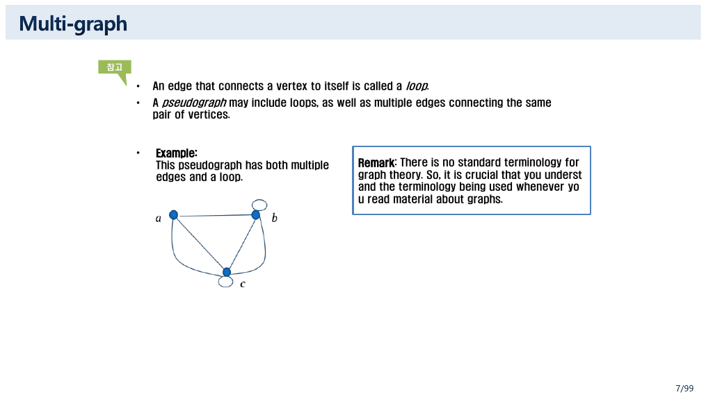
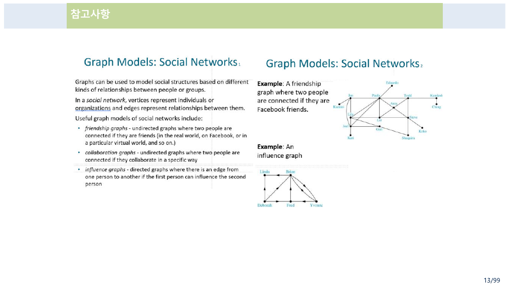
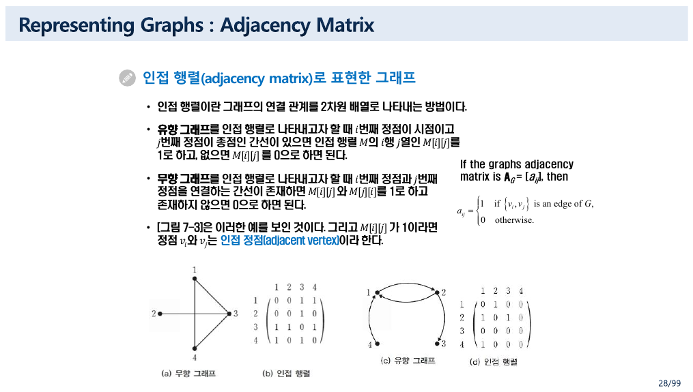
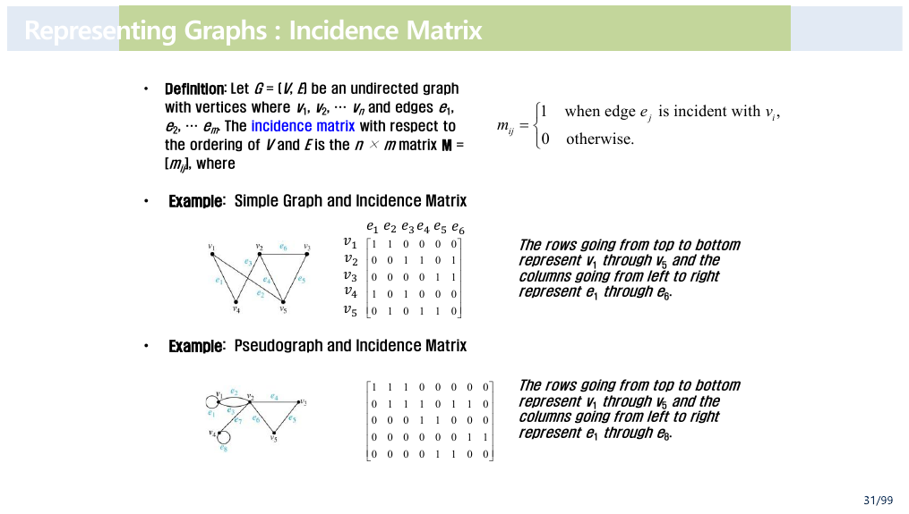
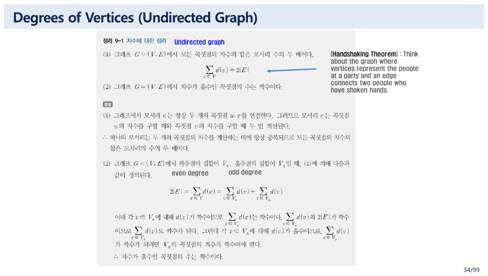
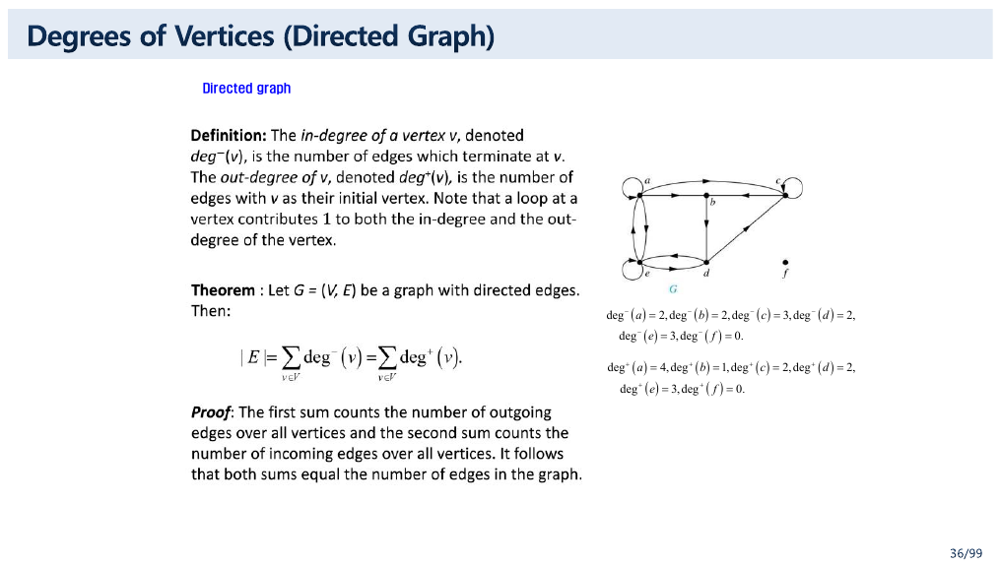
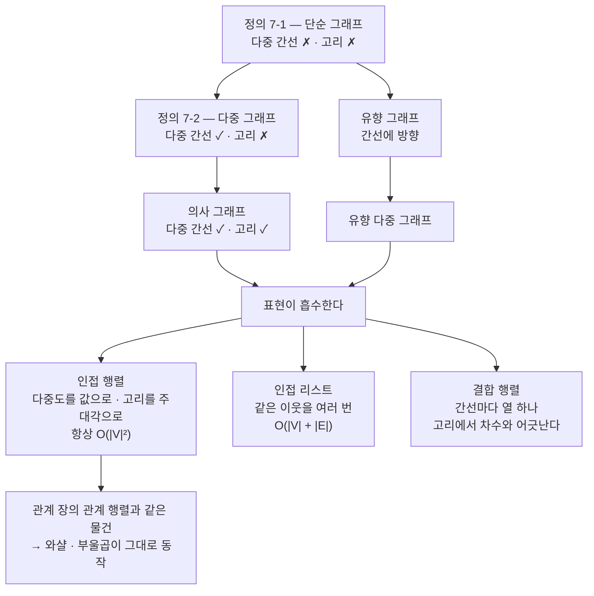

> [!abstract] 이 묶음이 실제로 하는 말
> 이 자료는 그래프를 **네 번** 정의한다.
>
> 1. **정의 7-1** — 정점 집합과 간선 집합. 두 정점 사이에 간선은 하나뿐이고 자기 자신으로 가는 간선은 없다.
> 2. **정의 7-2 다중 그래프** — 두 정점 사이에 간선이 둘 이상 허용된다. 그리고 6쪽이 직접 이렇게 적는다 — *"이는 [정의 7-1]의 그래프 정의에 **어긋난다**."*
> 3. **의사 그래프(pseudograph)** — 고리(loop)까지 허용된다.
> 4. **유향 그래프 / 유향 다중 그래프** — 간선에 방향이 붙는다.
>
> 정의를 넓힐 때마다 앞의 정의를 어기면서 넓힌다. 7쪽이 그 사정을 영어로 고백한다.
>
> > **Remark: There is no standard terminology for graph theory.** So, it is crucial that you understand the terminology being used whenever you read material about graphs.
>
> 이것이 이 단원 전반부의 성격이다. **정의가 고정되지 않으므로, 무엇이 고정되어 있는지는 표현(representation)에서 찾아야 한다.** 24~31쪽의 세 표현 — 인접 리스트·인접 행렬·결합 행렬 — 이 각각 네 단계의 확장을 어떻게 흡수하는지가 이 노트의 뼈대다.
>
> 결론부터 말하면 **인접 행렬이 가장 잘 흡수하고, 결합 행렬이 가장 못 흡수한다.** 고리가 있는 그래프에서 결합 행렬의 행 합은 더 이상 차수가 아니다.

---

## 1. 정의 7-1과, 그 정의를 어기는 그림들

5쪽이 그래프를 정의한다.

> $G$의 정점 $v_1, v_2, \ldots, v_n$을 나타내기 위해 $n$개의 점으로 표시하고, $\{v_i, v_j\}$가 $G$의 한 간선이면 정점 $v_i$와 $v_j$를 선으로 연결한다.

같은 쪽 참고 상자가 범위를 정한다.

> A graph with an infinite vertex set is called an **infinite graph**. A graph with a finite vertex set is called a **finite graph**. **We restrict our attention to finite graphs.**

[05번 노트](./05.%20%EC%A7%91%ED%95%A9%EC%9D%80%20%EC%88%9C%EC%84%9C%EC%99%80%20%EC%A4%91%EB%B3%B5%EC%9D%84%20%EB%B2%84%EB%A6%B0%EB%8B%A4%20%E2%80%94%20%EA%B7%B8%EB%A6%AC%EA%B3%A0%20%EB%B9%84%EC%96%B4%20%EC%9E%88%EB%8A%94%20%EC%B9%B8%20%ED%95%98%EB%82%98.md)에서 다룬 가산·비가산이 여기서 실용적인 제한으로 돌아온다. **무한 그래프는 정의할 수 있지만 다루지 않는다.**

![슬라이드 6 — 다중 그래프. "이는 [정의 7-1]의 그래프 정의에 어긋난다"](../assets/ch05-s006-다중그래프는-정의7-1에-어긋난다.png)

6쪽이 곧바로 정의를 깬다. [그림 7-2]에서 간선 $e_5, e_6, e_7$이 모두 $A$와 $D$를 잇는다.

> • 간선 $e_5, e_6, e_7$은 같은 정점 $A$와 $D$에 있는 간선들이다.
> • **이는 [정의 7-1]의 그래프 정의에 어긋난다.**

그래서 정의 7-2가 필요해진다 — *"$E$의 서로 다른 두 개의 정점 사이에 두 개 이상의 간선이 허용되는 그래프를 **다중 그래프**라 한다."* 영어 설명이 다중도(multiplicity)라는 이름까지 준다 — $u$와 $v$를 잇는 서로 다른 간선이 $m$개면 $\{u,v\}$는 **multiplicity $m$**의 간선이다.



7쪽이 한 걸음 더 간다.

> • An edge that connects a vertex to itself is called a **loop**.
> • A **pseudograph** may include loops, as well as multiple edges connecting the same pair of vertices.

그리고 오른쪽 구석의 Remark가 이 모든 사정을 설명한다 — **그래프 이론에는 표준 용어가 없다.** 어떤 책은 `graph`가 다중 간선을 허용하고, 어떤 책은 `simple graph`만을 `graph`라 부른다. 이 자료는 후자를 택했고, 그래서 확장할 때마다 새 이름이 필요했다.

> [!note] 원본의 번호 체계 균열 — 세 개의 장 번호가 뒤섞인다
> 이 파일은 스스로를 여러 이름으로 부른다.
>
> | 자리 | 표기 |
> | --- | --- |
> | 파일명 | `5 그래프.pdf` |
> | 표지 제목 | **5 트리와 그래프** (그런데 트리는 이 파일에 없다 — 별도 파일 `6 트리.pdf`에 있다) |
> | 목차 | **7**.1 Basic concept of graphs ~ **7**.4 정점의 착색 |
> | 정의·그림 번호 | 정의 **7**-1, 정의 **7**-2, [그림 **7**-2] |
> | 6쪽의 인용 그림 | **[그림 9-1]** — 9장의 그림 번호 |
> | 34쪽의 정리 | **[정리 9-1]** 차수에 대한 정리 |
> | 쪽 번호 | `6/99`, `34/99` — 그런데 실제 슬라이드는 **129장**까지 간다 |
>
> 정의와 그림은 7장을 쓰고, **[그림 9-1]과 [정리 9-1]만 9장을 쓴다.** 서로 다른 교재(혹은 같은 교재의 다른 판)에서 가져온 슬라이드가 번호를 그대로 달고 들어온 것으로 보인다. [02번 노트](./02.%20%ED%95%9C%20%ED%8C%8C%EC%9D%BC%EC%97%90%20%EC%B1%85%20%EB%91%90%20%EA%B6%8C%20%E2%80%94%20%EC%9D%98%EB%AF%B8%EB%A1%9C%20%EA%B0%80%EB%A5%B4%EC%B9%98%EB%8A%94%20%EB%85%BC%EB%A6%AC%EC%99%80%20%ED%8C%8C%EC%8B%B1%EC%9C%BC%EB%A1%9C%20%EA%B0%80%EB%A5%B4%EC%B9%98%EB%8A%94%20%EB%85%BC%EB%A6%AC.md)에서 본 「한 파일에 책 두 권」이 그래프 단원에서도 그대로 반복된다.
>
> 쪽 번호가 `/99`인데 129장까지 가는 것도 앞선 파일들과 같은 패턴이다 — 「집합 및 집합연산」은 `43/42`까지 갔고(05번 노트), 「4 관계 및 함수」는 `125/112`까지 갔다. **슬라이드를 덧붙이면서 총 쪽수 필드를 갱신하지 않는 습관**이 이 과목 전체에 걸쳐 있다.

### 무향과 유향 — 순서를 생각하느냐

9쪽이 둘을 가른다.

> $E_1 = \{v_1, v_2\}$, $E_2 = (v_2, v_1)$라 하면 $\cdots$ 두 개의 정점의 순서를 생각하지 않는다면 $E_1$과 $E_2$는 **같은 간선**이 되고 두 개의 정점의 순서를 생각한다면 $E_1$과 $E_2$는 **다른 간선**이 된다.

기호부터 다르다 — 무향은 **중괄호** $\{v_1, v_2\}$(집합), 유향은 **소괄호** $(v_1, v_2)$(순서쌍). 05번 노트의 결론 — **집합은 순서를 버리고 튜플이 순서를 되사 온다** — 이 그래프의 방향으로 나타난 것이다.

10쪽이 유향 그래프의 두 끝에 이름을 준다 — $(v_1, v_2)$에서 $v_1$은 **시점**(initial point; source), $v_2$는 **종점**(terminal point; target).

여기서 [07번 노트](./07.%20%EA%B4%80%EA%B3%84%EB%8A%94%20%EC%9B%90%EC%86%8C%EB%A5%BC%20%EB%B2%84%EB%A6%B4%20%EC%88%98%20%EC%9E%88%EB%8B%A4%20%E2%80%94%204%EC%AA%BD%EC%9D%98%20%EC%A0%95%EC%9D%98%EC%99%80%2032%EC%AA%BD%EC%9D%98%20%EA%B7%B8%EB%A6%BC%20%EC%82%AC%EC%9D%B4.md)와 정확히 이어진다. 관계 장의 35쪽이 *"관계를 유향 그래프로 표시하기 위해서는 $A$에서 $A$로 가는 관계일 때만 가능하다"*고 했고, 그 유향 그래프가 여기서 독립된 대상이 된다. **유향 그래프 = $A$에 관한 이항 관계**다.



13~15쪽이 응용을 늘어놓는다 — friendship graph(무향), collaboration graph(무향), **influence graph(유향)**, 그리고 web graph, citation network, module dependency graph, precedence graph. 마지막 것이 특히 이 과목답다.

> We can use a directed graph called a **precedence graph** to represent which statements must have already been executed before we execute each statement.

프로그램 명령문 사이의 **선행 제약**이 유향 그래프이고, 순환이 없으면 실행 순서를 정할 수 있다. 이 관찰이 [16번 노트](./16.%20%ED%8A%B8%EB%A6%AC%EB%8A%94%20%ED%8A%B9%EB%B3%84%ED%95%9C%20%EA%B4%80%EA%B3%84%EB%8B%A4%20%E2%80%94%20%EA%B7%B8%EB%9F%B0%EB%8D%B0%20%EC%88%9C%ED%9A%8C%20%EA%B2%B0%EA%B3%BC%EB%8A%94%20%ED%8A%B8%EB%A6%AC%EB%A5%BC%20%EB%90%98%EB%8F%8C%EB%A6%AC%EC%A7%80%20%EB%AA%BB%ED%95%9C%EB%8B%A4.md)의 트리와 파싱으로 이어진다.

---

## 2. 세 가지 표현, 그리고 저마다 다른 흡수 능력

24쪽이 두 가지만 예고한다 — 인접 행렬과 인접 리스트. 그런데 31쪽에서 **결합 행렬**이 하나 더 나온다. 세 표현을 나란히 놓고 성능과 표현력을 비교해 보자.

### 인접 리스트 — 간선 수에 비례한다

25쪽.

> 인접 리스트는 $\lvert V \rvert$개의 연결 리스트에 **실제 간선의 수만큼** 원소가 들어있으므로 전체 $O(\lvert V \rvert + \lvert E \rvert)$의 기억 공간을 사용한다는 장점이 있고, 어떤 정점을 찾을 때 **처음부터 검색해야 하는 단점**을 가지고 있다.

### 인접 행렬 — 정점 수의 제곱



28쪽이 정의한다.

$$a_{ij} = \begin{cases} 1 & \{v_i, v_j\} \text{가 } G \text{의 간선일 때} \\ 0 & \text{그렇지 않을 때} \end{cases}$$

**07번 노트의 관계 행렬과 글자 하나 다르지 않다.** 이름만 바뀌었다. 그래서 [10번 노트](./10.%20%EB%8B%AB%ED%9E%98%EC%9D%80%20%EB%B6%80%EC%A1%B1%ED%95%9C%20%EA%B2%83%EC%9D%84%20%EC%B5%9C%EC%86%8C%EB%A1%9C%20%EC%B1%84%EC%9A%B4%EB%8B%A4%20%E2%80%94%20%EA%B7%B8%EB%A6%AC%EA%B3%A0%20%EB%B6%89%EC%9D%80%20%ED%8E%9C%EC%9C%BC%EB%A1%9C%20%EA%B3%A0%EC%B3%90%20%EC%A0%81%EC%9D%80%20%ED%95%9C%20%EC%A4%84.md)의 와샬 알고리즘이 여기서 그대로 동작한다.

29~30쪽이 성질을 덧붙인다.

- **무향 그래프의 인접 행렬은 대칭 행렬이다.** 관계 장의 언어로 하면 **대칭 관계**다.
- **단순 그래프에는 고리가 없으므로 주대각이 전부 0이다.** 즉 **비반사 관계**다.
- 가중치가 있으면 1 대신 가중치를 넣는다.
- 간선이 많으면 유리하고, 적으면 불리하며, **항상 $O(\lvert V \rvert^2)$**를 쓴다.

무향 단순 그래프 = **비반사 대칭 관계**. [08번 노트](./08.%20%EA%B2%BD%EB%A1%9C%EB%8A%94%20%EA%B3%B1%ED%95%98%EA%B3%A0%20%EC%84%B1%EC%A7%88%EC%9D%80%20%EB%94%B0%EC%A7%84%EB%8B%A4%20%E2%80%94%20%E3%80%8C%EB%AA%A8%EB%93%A0%E3%80%8D%EC%9D%B4%EB%9D%BC%20%EC%8D%A8%EC%95%BC%20%ED%95%A0%20%EC%9E%90%EB%A6%AC%EC%9D%98%20%E3%80%8C%EC%96%B4%EB%96%A4%E3%80%8D.md)의 두 성질이 그래프의 두 관행(화살표 없음, 고리 없음)으로 번역된다.

### 결합 행렬 — 정점 × 간선



31쪽이 세 번째 표현을 준다. 크기가 $n \times m$(정점 수 × 간선 수)이고

$$m_{ij} = \begin{cases} 1 & \text{간선 } e_j \text{가 정점 } v_i \text{에 접해 있을 때} \\ 0 & \text{그렇지 않을 때} \end{cases}$$

**간선에 이름을 주는 유일한 표현**이다. 인접 행렬은 $\{u,v\}$ 자리에 1만 적으므로 간선이 여럿이어도 구분할 수 없지만, 결합 행렬은 $e_5$와 $e_6$을 서로 다른 열로 갖는다. 그래서 **다중 그래프를 가장 자연스럽게 담는다.**

슬라이드의 단순 그래프 예를 확인해 보자.

$$\begin{array}{c|cccccc} & e_1 & e_2 & e_3 & e_4 & e_5 & e_6 \\ \hline v_1 & 1&1&0&0&0&0 \\ v_2 & 0&0&1&1&0&1 \\ v_3 & 0&0&0&0&1&1 \\ v_4 & 1&0&1&0&0&0 \\ v_5 & 0&1&0&1&1&0 \end{array}$$

**각 열의 합이 정확히 2**다 — 간선 하나에 끝점이 둘이니까. 행 합은 $2, 3, 2, 2, 3$이고 이것이 각 정점의 차수다. 합치면 $12 = 2 \times 6$ — 34쪽의 악수 정리가 여기 이미 들어 있다.

### 세 표현을 나란히 — 확장을 얼마나 흡수하는가

```html preview h=740px
<div id="rep" style="font-family:system-ui,-apple-system,'Segoe UI',sans-serif;color:var(--foreground);padding:18px">
  <div style="font-size:13px;font-weight:600;margin-bottom:4px">정의가 넓어질 때 세 표현은 어떻게 되는가</div>
  <div style="font-size:12px;opacity:.75;margin-bottom:14px">
    31쪽의 두 예제를 그대로 쓴다. 아래 버튼으로 그래프의 종류를 바꿔 보라.
  </div>
  <div style="display:flex;gap:8px;flex-wrap:wrap;margin-bottom:16px">
    <button class="rpb" data-g="simple">단순 그래프 (31쪽 위 예제)</button>
    <button class="rpb" data-g="pseudo">의사 그래프 (31쪽 아래 예제)</button>
  </div>
  <div id="rep-body"></div>
  <div id="rep-note" style="margin-top:14px;font-size:12.5px;line-height:1.85;padding:11px 13px;border:1px solid var(--border);border-radius:8px;background:var(--card)"></div>
  <style>
    #rep .rpb{background:var(--card);color:var(--foreground);border:1px solid var(--border);
      border-radius:7px;padding:6px 11px;font-size:12px;cursor:pointer;font-family:inherit}
    #rep .rpb.sel{border-color:var(--chart-1);box-shadow:inset 0 0 0 1px var(--chart-1)}
    #rep table{border-collapse:collapse;font-family:ui-monospace,monospace;font-size:11.5px;margin-top:6px}
    #rep td,#rep th{border:1px solid var(--border);min-width:26px;height:24px;text-align:center;padding:0 3px}
    #rep th{opacity:.7;font-weight:600}
    #rep td{background:var(--card)}
    #rep td.one{background:var(--chart-1);color:var(--card);font-weight:700}
    #rep td.two{background:var(--chart-5);color:var(--card);font-weight:700}
    #rep .box{border:1px solid var(--border);border-radius:9px;padding:12px 14px;background:var(--card);min-width:230px;flex:1}
    #rep .bt{font-size:12px;font-weight:600;margin-bottom:2px}
    #rep .bs{font-size:11px;opacity:.7;margin-bottom:4px}
  </style>
</div>
<script>
(function(){
  var root=document.getElementById('rep');
  var data={
    simple:{
      V:['v1','v2','v3','v4','v5'],
      E:[['e1','v1','v4'],['e2','v1','v5'],['e3','v2','v4'],['e4','v2','v5'],['e5','v3','v5'],['e6','v2','v3']],
      note:'열 합이 모두 2다. 행 합(2, 3, 2, 2, 3)이 곧 차수이고, 그 합 12는 간선 수 6의 두 배다 — 34쪽 악수 정리.'
    },
    pseudo:{
      V:['v1','v2','v3','v4','v5'],
      E:[['e1','v1','v1'],['e2','v1','v2'],['e3','v1','v2'],['e4','v2','v3'],['e5','v3','v5'],['e6','v2','v5'],['e7','v2','v4'],['e8','v4','v4']],
      note:''
    }
  };
  var cur='simple';
  function build(){
    var d=data[cur], V=d.V, E=d.E, n=V.length, m=E.length;
    // 인접 행렬 (다중도 저장)
    var A=[]; for(var i=0;i<n;i++){A.push([]); for(var j=0;j<n;j++) A[i].push(0);}
    E.forEach(function(e){
      var a=V.indexOf(e[1]), b=V.indexOf(e[2]);
      if(a===b){ A[a][b]+=1; } else { A[a][b]+=1; A[b][a]+=1; }
    });
    // 결합 행렬
    var M=[]; for(i=0;i<n;i++){M.push([]); for(j=0;j<m;j++) M[i].push(0);}
    E.forEach(function(e,j){
      var a=V.indexOf(e[1]), b=V.indexOf(e[2]);
      M[a][j]=1; M[b][j]=1;
    });
    // 차수 (고리는 2)
    var deg=V.map(function(_,i){
      var d2=0;
      E.forEach(function(e){
        var a=V.indexOf(e[1]), b=V.indexOf(e[2]);
        if(a===i&&b===i) d2+=2; else if(a===i||b===i) d2+=1;
      });
      return d2;
    });
    var rowsum=M.map(function(r){return r.reduce(function(x,y){return x+y;},0);});
    // 인접 리스트
    var adj=V.map(function(v,i){
      var lst=[];
      E.forEach(function(e){
        var a=V.indexOf(e[1]), b=V.indexOf(e[2]);
        if(a===i) lst.push(V[b]); else if(b===i) lst.push(V[a]);
      });
      return lst;
    });
    function tblA(){
      var h='<tr><th></th>'+V.map(function(v){return '<th>'+v+'</th>';}).join('')+'</tr>';
      for(var i=0;i<n;i++){
        h+='<tr><th>'+V[i]+'</th>';
        for(var j=0;j<n;j++){
          var v=A[i][j];
          h+='<td class="'+(v>1?'two':(v?'one':''))+'">'+v+'</td>';
        }
        h+='</tr>';
      }
      return '<table>'+h+'</table>';
    }
    function tblM(){
      var h='<tr><th></th>'+E.map(function(e){return '<th>'+e[0]+'</th>';}).join('')+'<th style="border-left-width:2px">합</th></tr>';
      for(var i=0;i<n;i++){
        h+='<tr><th>'+V[i]+'</th>';
        for(var j=0;j<m;j++) h+='<td class="'+(M[i][j]?'one':'')+'">'+M[i][j]+'</td>';
        h+='<th style="border-left-width:2px">'+rowsum[i]+'</th></tr>';
      }
      h+='<tr><th>열 합</th>';
      for(j=0;j<m;j++){
        var cs=0; for(i=0;i<n;i++) cs+=M[i][j];
        h+='<th class="'+(cs<2?'':'')+'" style="'+(cs<2?'color:var(--chart-5)':'')+'">'+cs+'</th>';
      }
      h+='<th></th></tr>';
      return '<table>'+h+'</table>';
    }
    var degRow='<table><tr><th>정점</th>'+V.map(function(v){return '<th>'+v+'</th>';}).join('')+'<th>합</th></tr>'+
      '<tr><th>차수</th>'+deg.map(function(d2){return '<td>'+d2+'</td>';}).join('')+'<th>'+deg.reduce(function(a,b){return a+b;},0)+'</th></tr>'+
      '<tr><th>결합행렬 행 합</th>'+rowsum.map(function(r,i){return '<td class="'+(r!==deg[i]?'two':'')+'">'+r+'</td>';}).join('')+'<th>'+rowsum.reduce(function(a,b){return a+b;},0)+'</th></tr></table>';
    var html=
      '<div style="display:flex;gap:14px;flex-wrap:wrap;align-items:flex-start">'+
        '<div class="box"><div class="bt">인접 리스트</div><div class="bs">O(|V| + |E|) — 간선 수에 비례</div>'+
          '<div style="font-family:ui-monospace,monospace;font-size:11.5px;line-height:1.75;margin-top:6px">'+
          V.map(function(v,i){return v+' : ['+adj[i].join(', ')+']';}).join('<br>')+'</div></div>'+
        '<div class="box"><div class="bt">인접 행렬</div><div class="bs">O(|V|²) — 정점 수의 제곱, 항상 같은 크기</div>'+tblA()+'</div>'+
        '<div class="box" style="min-width:330px"><div class="bt">결합 행렬</div><div class="bs">|V| × |E| — 간선마다 열이 하나</div>'+tblM()+'</div>'+
      '</div>'+
      '<div style="margin-top:14px"><div class="bt" style="margin-bottom:2px">차수와 결합 행렬의 행 합</div>'+degRow+'</div>';
    root.querySelector('#rep-body').innerHTML=html;
    var mismatch = deg.some(function(d2,i){return d2!==rowsum[i];});
    root.querySelector('#rep-note').innerHTML = cur==='simple'
      ? d.note
      : '<b>다중 간선</b>은 인접 행렬이 <b>2</b>(붉은 칸)로, 결합 행렬이 <b>서로 다른 두 열</b>(e2, e3)로 흡수한다. 인접 리스트는 같은 이웃을 두 번 적는다.<br>'+
        '<b>고리</b>(e1: v1–v1, e8: v4–v4)에서 갈라진다. 32쪽은 <i>"자기 자신으로 돌아오는 순환을 가지는 경우 그 정점의 차수는 <b>2</b>"</i>라고 정의하는데, '+
        '결합 행렬에서 그 열의 합은 <b>1</b>이고 행 합도 1만 더해진다. '+
        (mismatch? '그래서 붉게 표시된 정점에서 <b>결합 행렬의 행 합이 차수와 어긋난다</b>(합계 14 대 16).':'')+
        '<br><span style="opacity:.75">즉 결합 행렬은 다중 간선은 완벽히 흡수하지만 고리는 흡수하지 못한다. 원본은 이 점을 언급하지 않는다.</span>';
  }
  root.querySelectorAll('.rpb').forEach(function(b){
    b.onclick=function(){cur=b.dataset.g;root.querySelectorAll('.rpb').forEach(function(x){x.classList.toggle('sel',x===b);});build();};
  });
  root.querySelector('.rpb').classList.add('sel');
  build();
})();
</script>
```

> [!note] 보충 — 고리가 있으면 결합 행렬의 행 합은 차수가 아니다
> 32쪽은 무향 그래프에서 *"자신의 정점에서 시작해서 다시 자기 자신으로 돌아오는 순환을 가지는 경우 그 정점의 차수는 **2**이다"*라고 정의한다. 고리 하나가 차수 2를 기여한다는 뜻이다.
>
> 그런데 31쪽 의사 그래프의 결합 행렬에서 고리 $e_1$의 열은 $v_1$ 자리에만 1이 있다 — **열 합이 1**이다. 따라서 행 합을 차수로 읽으면 $v_1$의 차수가 3이 되는데, 32쪽 정의로는 4다. 다섯 정점의 행 합을 모두 더하면 14이고 실제 차수의 합은 16이다.
>
> 이 어긋남은 표현의 결함이 아니라 **관행의 문제**다. 결합 행렬에서 고리를 2로 적는 관행도 있다. 원본은 두 관행 중 하나를 골라 쓰면서 다른 슬라이드의 차수 정의와 맞추어 두지 않았다. 인접 행렬 쪽은 이 문제가 없다 — 30쪽이 *"since there are no loops, each diagonal entry $a_{ii}$ is 0"*이라 적어, 고리가 있으면 주대각이 1이 된다는 규칙이 자동으로 성립한다.

---

## 3. 차수 — 셈이 두 번 겹친다



34쪽의 [정리 9-1]이 이 절의 중심이다.

$$\sum_{v \in V} d(v) = 2 \lvert E \rvert$$

증명이 한 줄이다.

> 그래프에서 모서리 $e$는 항상 두 개의 꼭짓점 $u, v$를 연결한다. 그러므로 모서리 $e$는 꼭짓점 $u$의 차수를 구할 때와 꼭짓점 $v$의 차수를 구할 때 **두 번 계산된다.**

옆에 붙은 영어 상자가 이름의 유래를 준다 — *"Think about the graph where vertices represent the people at a party and an edge connects two people who have shaken hands."* **모든 사람의 악수 횟수를 더하면 악수 건수의 두 배**다.

같은 정리의 (2)가 따름정리다.

> 그래프 $G = (V, E)$에서 차수가 **홀수인 꼭짓점의 수는 짝수**이다.

증명이 짝수·홀수 집합으로 쪼개 진행한다. $2\lvert E \rvert = \sum_{v \in V_e} d(v) + \sum_{v \in V_o} d(v)$에서 좌변과 첫 항이 짝수이므로 둘째 항도 짝수인데, 그 항의 각 성분이 홀수이므로 **성분의 개수가 짝수여야 한다.**

```html preview h=620px
<div id="hs" style="font-family:system-ui,-apple-system,'Segoe UI',sans-serif;color:var(--foreground);padding:18px">
  <div style="font-size:13px;font-weight:600;margin-bottom:4px">악수 정리 — 간선을 넣고 빼며 확인하기</div>
  <div style="font-size:12px;opacity:.75;margin-bottom:14px">
    여섯 정점 사이의 간선을 눌러 켜고 끈다. 차수의 합이 언제나 간선 수의 두 배가 되고, 홀수 차수 정점의 개수가 언제나 짝수가 된다.
  </div>
  <div style="display:flex;gap:8px;flex-wrap:wrap;margin-bottom:14px">
    <button class="hb" data-p="s31">31쪽 예제 (간선 6개)</button>
    <button class="hb" data-p="k4">K₄ (완전 그래프)</button>
    <button class="hb" data-p="none">전부 지우기</button>
  </div>
  <div style="display:flex;gap:28px;flex-wrap:wrap;align-items:flex-start">
    <div><svg id="hs-svg" width="300" height="260" viewBox="0 0 300 260"></svg></div>
    <div style="flex:1;min-width:280px">
      <table id="hs-tbl" style="border-collapse:collapse;font-size:12.5px;font-family:ui-monospace,monospace"></table>
      <div id="hs-sum" style="margin-top:14px;font-size:13px;line-height:1.9"></div>
    </div>
  </div>
  <style>
    #hs .hb{background:var(--card);color:var(--foreground);border:1px solid var(--border);
      border-radius:7px;padding:6px 11px;font-size:12px;cursor:pointer;font-family:inherit}
    #hs .hb:hover{border-color:var(--chart-1)}
    #hs td,#hs th{border:1px solid var(--border);padding:4px 10px;text-align:center}
    #hs th{opacity:.7;font-weight:600}
    #hs .odd{background:var(--chart-5);color:var(--card);font-weight:700}
  </style>
</div>
<script>
(function(){
  var root=document.getElementById('hs');
  var V=[[150,34],[258,96],[258,196],[150,236],[42,196],[42,96]];
  var names=['v1','v2','v3','v4','v5','v6'];
  var on={};
  var presets={
    s31:['0-3','0-4','1-3','1-4','2-4','1-2'],
    k4:['0-1','0-2','0-3','1-2','1-3','2-3'],
    none:[]
  };
  function key(i,j){return Math.min(i,j)+'-'+Math.max(i,j);}
  function draw(){
    var s='';
    for(var i=0;i<6;i++)for(var j=i+1;j<6;j++){
      var k=key(i,j), act=!!on[k];
      s+='<line x1="'+V[i][0]+'" y1="'+V[i][1]+'" x2="'+V[j][0]+'" y2="'+V[j][1]+
         '" stroke="'+(act?'var(--chart-1)':'var(--border)')+'" stroke-width="'+(act?3:1)+
         '" stroke-dasharray="'+(act?'':'3 4')+'" style="cursor:pointer" data-k="'+k+'"></line>';
    }
    V.forEach(function(p,i){
      s+='<circle cx="'+p[0]+'" cy="'+p[1]+'" r="17" fill="var(--card)" stroke="var(--foreground)" stroke-width="1.5"></circle>';
      s+='<text x="'+p[0]+'" y="'+(p[1]+4)+'" text-anchor="middle" font-size="11" fill="var(--foreground)" font-family="ui-monospace,monospace">'+names[i]+'</text>';
    });
    var svg=root.querySelector('#hs-svg');
    svg.innerHTML=s;
    svg.querySelectorAll('line').forEach(function(l){
      l.onclick=function(){ var k=l.dataset.k; if(on[k]) delete on[k]; else on[k]=1; draw(); };
    });
    var deg=[0,0,0,0,0,0], m=0;
    Object.keys(on).forEach(function(k){
      var p=k.split('-'); deg[+p[0]]++; deg[+p[1]]++; m++;
    });
    var h='<tr><th>정점</th>'+names.map(function(n){return '<th>'+n+'</th>';}).join('')+'</tr><tr><th>차수</th>'+
      deg.map(function(d){return '<td class="'+(d%2?'odd':'')+'">'+d+'</td>';}).join('')+'</tr>';
    root.querySelector('#hs-tbl').innerHTML=h;
    var sum=deg.reduce(function(a,b){return a+b;},0);
    var odd=deg.filter(function(d){return d%2;}).length;
    root.querySelector('#hs-sum').innerHTML=
      '간선 수 |E| = <b>'+m+'</b><br>'+
      '차수의 합 Σd(v) = <b>'+sum+'</b> &nbsp;=&nbsp; 2|E| = <b>'+(2*m)+'</b> '+(sum===2*m?'✓':'✗')+'<br>'+
      '차수가 홀수인 정점(붉은 칸) = <b>'+odd+'</b>개 → '+(odd%2===0?'<b>짝수</b> ✓':'<b>홀수</b> ✗')+
      '<br><span style="opacity:.7;font-size:12px">간선을 하나 넣거나 뺄 때마다 두 정점의 차수가 동시에 1씩 바뀌므로, 홀수 차수 정점의 개수는 0 또는 ±2만 변한다.</span>';
  }
  root.querySelectorAll('.hb').forEach(function(b){
    b.onclick=function(){ on={}; presets[b.dataset.p].forEach(function(k){on[k]=1;}); draw(); };
  });
  presets.s31.forEach(function(k){on[k]=1;});
  draw();
})();
</script>
```

간선을 하나 토글할 때마다 **정확히 두 정점의 차수가 1씩 바뀐다.** 그래서 홀수 차수 정점의 개수는 한 번에 $0$ 또는 $\pm 2$만 변하고, 간선이 없는 상태(전부 짝수, 홀수 정점 0개)에서 출발하므로 **언제나 짝수**다. 정리의 귀납적 증명이 조작에서 바로 보인다.

33쪽이 하나를 더 덧붙인다 — *"차수 0인 정점을 **고립(isolated) 정점**이라고 한다."* 07번 노트에서 본, 화살표 그림의 타원 밖에 홀로 찍혀 있던 원소 $7$이 그래프의 언어로는 **고립 정점**이다. 같은 현상에 두 단원이 각각 이름을 붙인 셈이다.



32쪽·36쪽이 유향 그래프로 넘어가며 차수를 둘로 쪼갠다.

- **외차수**(out-degree) $\deg^{+}(v)$ — 정점 $v$가 **시점**인 간선의 개수
- **내차수**(in-degree) $\deg^{-}(v)$ — 정점 $v$가 **종점**인 간선의 개수

36쪽의 예가 값을 준다.

| 정점 | $a$ | $b$ | $c$ | $d$ | $e$ | $f$ | 합 |
| --- | :-: | :-: | :-: | :-: | :-: | :-: | :-: |
| $\deg^{-}$ | 2 | 2 | 3 | 2 | 3 | 0 | **12** |
| $\deg^{+}$ | 4 | 1 | 2 | 2 | 3 | 0 | **12** |

두 합이 **똑같이 12**다. 우연이 아니다 — 간선 하나는 시점 하나와 종점 하나를 정확히 하나씩 가지므로

$$\sum_v \deg^{+}(v) = \sum_v \deg^{-}(v) = \lvert E \rvert$$

무향의 악수 정리($2\lvert E \rvert$)와 달리 유향에서는 **두 배가 아니라 각각 한 배**다. 방향이 생기면서 "두 번 세는 일"이 "두 표에 한 번씩 적는 일"로 바뀌었기 때문이다. $f$는 내차수와 외차수가 모두 0인 **고립 정점**이다.

---

## 4. 정리 — 이 단원이 고정한 것

정의가 흔들리는 동안 고정된 것들을 모으면 이렇다.



**세 표현 중 둘은 그래프의 확장을 완전히 흡수하고, 하나는 고리에서 어긋난다.** 그리고 인접 행렬이 관계 행렬과 같은 물건이기 때문에, 10번 노트에서 만든 와샬 알고리즘과 부울곱이 여기서 한 줄도 고치지 않고 다시 쓰인다.

3쪽의 미리보기가 이 단원이 왜 이렇게 넓게 정의를 펼치는지 설명한다.

> ❖ 한붓그리기로 잘 알려진 **쾨니히스베르크의 다리 건너기 문제** 이후에 그래프 이론은 컴퓨터, 화학, 산업공학, 전자공학, 언어학, 유전학, 사회과학, 경제학 등 많은 분야에 이용되고 있다.
> ❖ 통신 네트워크 전송 문제나 소셜 네트워크의 분석, 논리 회로의 설계 및 분석, 최단 경로 찾기, 시스템의 흐름도나 컴파일러에서의 최적화에 응용된다.

쾨니히스베르크의 다리는 **다중 간선이 있는 그래프**다. 그래프 이론의 출발점 자체가 정의 7-1을 만족하지 않기 때문에, 이 단원은 처음부터 정의를 넓힐 수밖에 없었다.

---

## 다음으로

- **[12번 노트](./12.%20%EA%B0%95%EC%9D%98%20%ED%95%9C%EA%B0%80%EC%9A%B4%EB%8D%B0%20%EB%82%AF%EC%84%A0%20%EC%97%AC%EB%8D%9F%20%EC%9E%A5%20%E2%80%94%20%EC%A7%80%EC%8B%9D%EA%B7%B8%EB%9E%98%ED%94%84%EB%8A%94%20%EC%99%9C%20%EC%97%AC%EA%B8%B0%20%EC%9E%88%EB%8A%94%EA%B0%80.md)** — 이 노트가 건너뛴 슬라이드 16~23. 그래프 정의 한가운데 지식그래프 여덟 장이 끼어 있다.
- **[13번 노트](./13.%20%EA%B7%B8%EB%9E%98%ED%94%84%EC%97%90%20%EC%9D%B4%EB%A6%84%EC%9D%84%20%EB%B6%99%EC%9D%B4%EB%8A%94%20%EC%97%B4%20%EA%B0%80%EC%A7%80%20%EB%B0%A9%EB%B2%95%20%E2%80%94%20%EA%B7%B8%EB%A6%AC%EA%B3%A0%20%ED%95%9C%20%EB%B2%88%EC%94%A9%EB%A7%8C%20%EC%93%B0%EC%9D%B4%EB%8A%94%20%EC%A0%95%EC%9D%98%EB%93%A4.md)** — 완전·정규·이분·동형·오일러·해밀턴. 정의가 또 한 번 폭발한다.
- **07번 노트** — 인접 행렬의 전신인 관계 행렬.

---

## 근거 자료

`5 그래프.pdf` 슬라이드 1~15 및 24~36(PDF 1~8쪽, 12~18쪽). 이 PDF는 한 쪽에 슬라이드 두 장이 인쇄된 유인물 형식이며, 쪽 번호는 슬라이드 번호를 따랐다.

| 슬라이드 | 내용 |
| --- | --- |
| 1~2 | 표지(「5 트리와 그래프」), 목차 7.1~7.4 |
| 3~4 | Preview — 그래프의 정의, 응용 분야, 이 장에서 배우는 내용 |
| 5 | Basic concept of Graphs — 정점·간선, **무한 그래프와 유한 그래프** |
| **6** | **정의 7-2 다중 그래프 — "이는 [정의 7-1]의 그래프 정의에 어긋난다", [그림 9-1]** |
| **7** | **의사 그래프(loop), "There is no standard terminology for graph theory"** |
| 8~10 | 그래프의 종류(무향/유향), 시점·종점 |
| 11 | 유향 다중 그래프, multiplicity |
| **13~15** | **참고사항 — 소셜 네트워크, 협업 그래프, 정보 네트워크, 소프트웨어 설계(precedence graph)** |
| 24 | Representing Graphs — 인접 행렬과 인접 리스트 |
| 25~27 | 연결 리스트 표현, $O(\lvert V \rvert + \lvert E \rvert)$ |
| **28~30** | **인접 행렬의 정의, 대칭성, 주대각 0, $O(\lvert V \rvert^2)$** |
| **31** | **결합 행렬 — 단순 그래프와 의사 그래프 두 예제** |
| 32~33 | 정점의 차수, 내차수·외차수, **고립 정점** |
| **34** | **[정리 9-1] 악수 정리와 증명, 홀수 차수 정점은 짝수 개** |
| 35~**36** | **유향 그래프의 차수 — $\deg^{-}$와 $\deg^{+}$의 합이 각각 12** |

인터랙티브 두 개는 31쪽의 두 예제(단순 그래프 간선 6개, 의사 그래프 간선 8개)를 그대로 쓴다. 결합 행렬의 열 합·행 합, 차수의 합, 악수 정리를 각각 독립 계산해 슬라이드의 행렬과 한 칸씩 대조했다(단순 그래프 $5 \times 6$, 의사 그래프 $5 \times 8$ 모두 일치). 36쪽의 내·외차수도 합이 각각 12임을 확인했다. 보충한 것은 **고리에서 결합 행렬의 행 합이 차수와 어긋난다**는 관찰이며, 본문에서 보충임을 밝혔다.
