> [!abstract] 이 묶음이 실제로 하는 말
> 「5 그래프」의 슬라이드 순서를 그대로 따라가 보면 이상한 자리가 하나 있다.
>
> | 슬라이드 | 내용 |
> | --- | --- |
> | 5~12 | 그래프의 정의, 다중 그래프, 의사 그래프, 무향·유향 |
> | 13~15 | 응용 — 소셜 네트워크, 협업 그래프, 소프트웨어 설계 |
> | **16~23** | **지식그래프 · Data Graphs · 그래프 구조기반 데이터 모델의 다섯 유형** |
> | 24~31 | 인접 리스트, 인접 행렬, 결합 행렬 |
>
> 16~23쪽은 앞의 정의도 뒤의 표현도 아니다. **그래프가 무엇인가**를 묻던 자리에서 갑자기 **그래프에 무엇을 실을 것인가**를 묻는다. 그리고 이 여덟 장이 별도 파일 「7 지식그래프 소개」 24장으로 확장된다.
>
> 그 별도 파일이 이 과목에서 가장 이질적인 자료다. **정의로 시작하지 않고, 정의할 수 없다는 사실로 시작한다.**
>
> - 7쪽의 「초기정의」 — *"A Knowledge Graph is a knowledge base that is a graph."* 지식 베이스이면서 그래프인 것. **순환 정의**에 가깝다.
> - 9쪽의 요약 — *"a **paradigm** rather than a specific class of things."* 사물의 종류가 아니라 하나의 방식이라는 뜻이다.
> - 10쪽의 「두번째 정의」 — 필요충분조건이 아니라 **여덟 개의 성질 목록**이다.
> - 11~13쪽 — 정의 대신 **예와 반례의 목록**으로 경계를 긋는다. `Typical` / `Debatable cases` / `Primarily not`.
>
> 정의 7-1은 *"$\{v_i, v_j\}$가 간선이면"*처럼 **판정 가능한 조건**을 준다. 지식그래프에는 그것이 없다. 그래서 14쪽부터는 **되돌아온다** — 「컴퓨터 과학과 수학에서의 GRAPHS」라는 표지를 지나 정의 1.1부터 1.6까지 수학 그래프를 다시 쌓는다.
>
> **정의되지 않는 것을 다루려면 정의되는 것 위에 올려놓아야 한다.** 이 여덟 장이 강의 한가운데 있는 이유가 그것이다.

---

## 1. 강의 슬라이드 속 여덟 장

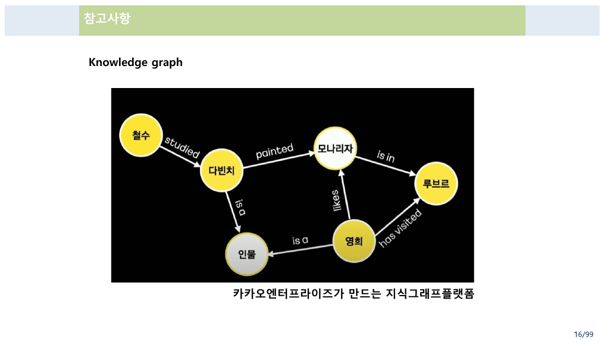

16쪽이 「참고사항」이라는 제목 아래 지식그래프 그림 하나를 놓는다. 철수 —studied→ 다빈치 —painted→ 모나리자 —is in→ 루브르, 그리고 영희 —likes→ 모나리자, —has visited→ 루브르, 다빈치 —is a→ 인물, 영희 —is a→ 인물.

여기서 눈여겨볼 것은 **간선마다 다른 이름이 붙어 있다**는 점이다. [11번 노트](./11.%20%EA%B7%B8%EB%9E%98%ED%94%84%EC%9D%98%20%EC%A0%95%EC%9D%98%EA%B0%80%20%EC%84%B8%20%EB%B2%88%20%EB%8A%98%EC%96%B4%EB%82%9C%EB%8B%A4%20%E2%80%94%20%EA%B7%B8%EB%A6%AC%EA%B3%A0%20%ED%91%9C%ED%98%84%EC%9D%B4%20%EA%B7%B8%20%EB%8A%98%EC%96%B4%EB%82%A8%EC%9D%84%20%ED%9D%A1%EC%88%98%ED%95%9C%EB%8B%A4.md)에서 본 정의 7-1의 그래프에는 간선에 이름이 없다. 있거나 없거나 둘 중 하나다. **간선에 레이블을 붙이는 순간, 인접 행렬의 0/1로는 담을 수 없게 된다.**

17~18쪽이 지식그래프가 왜 유용한지를 여섯 줄로 적는다.

> - 지식그래프의 기초
> - 개체와 관계를 표현하는 **직관적인 추상화**
> - 데이터 추가를 위한 **스키마가 필요없음**
> - 다양한 소스로부터 데이터를 **조립가능한 유연함**
> - **추상적인 길이의 패스** 위에서 질의가 가능
> - 그래프 분석 테크닉을 사용 가능함

다섯째 줄이 이 과목과 직접 이어진다. **「추상적인 길이의 패스 위에서 질의가 가능」** — [08번 노트](./08.%20%EA%B2%BD%EB%A1%9C%EB%8A%94%20%EA%B3%B1%ED%95%98%EA%B3%A0%20%EC%84%B1%EC%A7%88%EC%9D%80%20%EB%94%B0%EC%A7%84%EB%8B%A4%20%E2%80%94%20%E3%80%8C%EB%AA%A8%EB%93%A0%E3%80%8D%EC%9D%B4%EB%9D%BC%20%EC%8D%A8%EC%95%BC%20%ED%95%A0%20%EC%9E%90%EB%A6%AC%EC%9D%98%20%E3%80%8C%EC%96%B4%EB%96%A4%E3%80%8D.md)의 $R^\infty$가 하는 일이 바로 그것이다. 관계형 데이터베이스에서는 조인을 몇 번 할지 미리 정해야 하지만, 그래프에서는 *"길이에 상관없이 닿을 수 있는가"*를 물을 수 있다. 13쪽의 반례 목록이 같은 말을 뒤집어 적는다 — *"traditional RDBMS support connectivity queries only poorly."*

---

## 2. 다섯 가지 데이터 모델 — 이항 관계를 어떻게 늘릴 것인가

19~23쪽이 그래프 구조 기반 데이터 모델 다섯 가지를 나열하고, 같은 사실 하나를 다섯 번 그린다. **「천세진이 이산수학을 가르친다」**를.

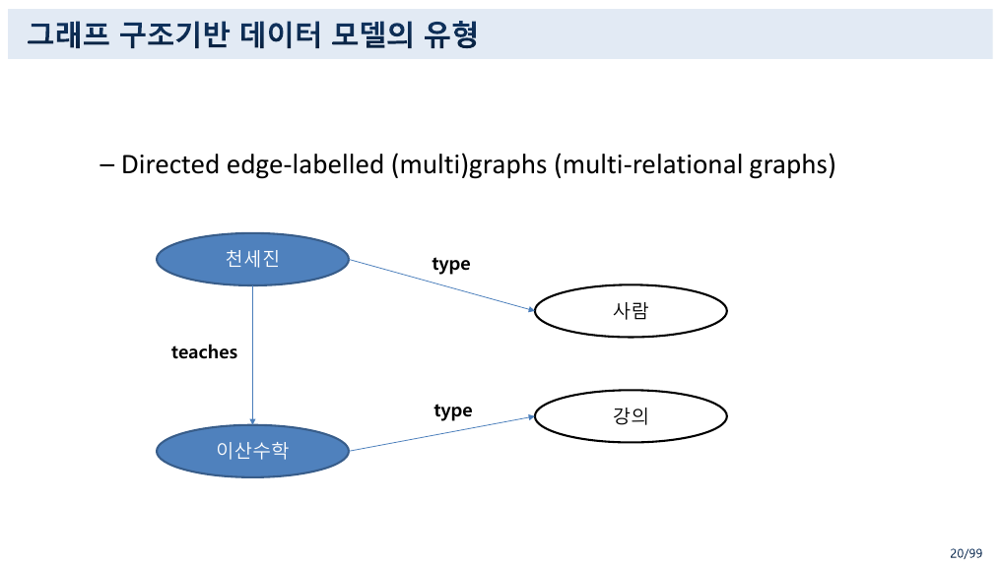

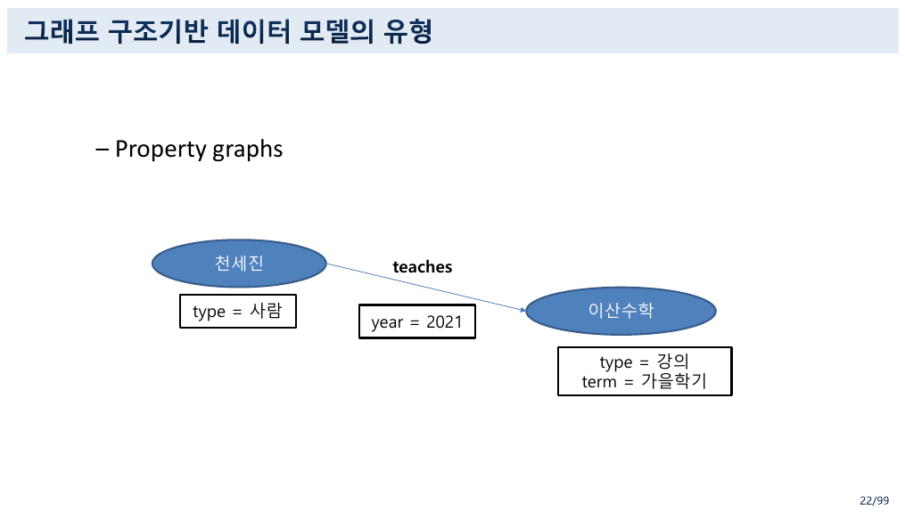

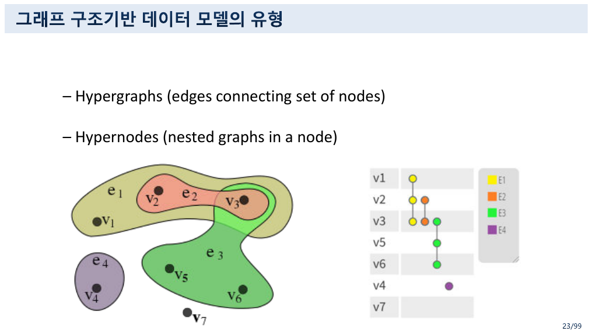

여기서 [07번 노트](./07.%20%EA%B4%80%EA%B3%84%EB%8A%94%20%EC%9B%90%EC%86%8C%EB%A5%BC%20%EB%B2%84%EB%A6%B4%20%EC%88%98%20%EC%9E%88%EB%8B%A4%20%E2%80%94%204%EC%AA%BD%EC%9D%98%20%EC%A0%95%EC%9D%98%EC%99%80%2032%EC%AA%BD%EC%9D%98%20%EA%B7%B8%EB%A6%BC%20%EC%82%AC%EC%9D%B4.md)의 한 줄이 결정적으로 작용한다. 「4 관계 및 함수」 27쪽이 이렇게 못 박았다.

> 이런 관계는 $n$항 관계까지 확장 가능하다. **우리는 이항 관계만을 다루므로** 앞으로 관계라고 하면 이항 관계를 말한다.

그런데 지식그래프의 기본 단위는 **트리플**이다 — (천세진, teaches, 이산수학). 주어·술어·목적어 셋이므로 삼항 관계처럼 보인다. **다섯 가지 데이터 모델은 이 「셋」을 「둘」로 어떻게 접느냐에 대한 다섯 가지 답이다.**

```html preview h=720px
<div id="km" style="font-family:system-ui,-apple-system,'Segoe UI',sans-serif;color:var(--foreground);padding:18px">
  <div style="font-size:13px;font-weight:600;margin-bottom:4px">같은 사실을 다섯 번 그린다 — 19~23쪽의 데이터 모델</div>
  <div style="font-size:12px;opacity:.75;margin-bottom:14px">
    원본이 쓴 예를 그대로 쓴다: 천세진 — teaches → 이산수학. 모델을 고르면 그림과, 그것이 요구하는 이항 관계의 수가 바뀐다.
  </div>
  <div style="display:flex;gap:7px;flex-wrap:wrap;margin-bottom:16px">
    <button class="kb" data-m="0">Directed edge-labelled</button>
    <button class="kb" data-m="1">Heterogeneous</button>
    <button class="kb" data-m="2">Property graph</button>
    <button class="kb" data-m="3">Hypergraph</button>
    <button class="kb" data-m="4">Hypernode</button>
  </div>
  <div style="display:flex;gap:26px;flex-wrap:wrap;align-items:flex-start">
    <svg id="km-svg" width="420" height="250" viewBox="0 0 420 250" style="border:1px solid var(--border);border-radius:9px;background:var(--card)"></svg>
    <div style="flex:1;min-width:280px">
      <div id="km-title" style="font-size:14px;font-weight:700;margin-bottom:6px"></div>
      <div id="km-desc" style="font-size:12.5px;line-height:1.85"></div>
      <div id="km-rel" style="margin-top:12px;font-size:12.5px;line-height:1.8;padding:10px 12px;border:1px solid var(--border);border-radius:8px;background:var(--card)"></div>
    </div>
  </div>
  <style>
    #km .kb{background:var(--card);color:var(--foreground);border:1px solid var(--border);
      border-radius:7px;padding:6px 11px;font-size:12px;cursor:pointer;font-family:inherit}
    #km .kb.sel{border-color:var(--chart-1);box-shadow:inset 0 0 0 1px var(--chart-1)}
  </style>
</div>
<script>
(function(){
  var root=document.getElementById('km');
  function node(x,y,w,h,label,fill,rx){
    return '<rect x="'+x+'" y="'+y+'" width="'+w+'" height="'+h+'" rx="'+(rx||14)+
      '" fill="'+(fill||'var(--chart-1)')+'" opacity="0.9"></rect>'+
      '<text x="'+(x+w/2)+'" y="'+(y+h/2+4)+'" text-anchor="middle" font-size="12" fill="var(--card)" font-weight="600">'+label+'</text>';
  }
  function tag(x,y,label){
    return '<rect x="'+x+'" y="'+y+'" width="'+(label.length*7+16)+'" height="20" rx="4" fill="none" stroke="var(--border)"></rect>'+
      '<text x="'+(x+8)+'" y="'+(y+14)+'" font-size="10.5" fill="var(--foreground)">'+label+'</text>';
  }
  function arrow(x1,y1,x2,y2,label){
    return '<defs><marker id="ah" markerWidth="8" markerHeight="8" refX="7" refY="3" orient="auto">'+
      '<path d="M0,0 L0,6 L7,3 z" fill="var(--foreground)"></path></marker></defs>'+
      '<line x1="'+x1+'" y1="'+y1+'" x2="'+x2+'" y2="'+y2+'" stroke="var(--foreground)" stroke-width="1.4" marker-end="url(#ah)"></line>'+
      (label? '<text x="'+((x1+x2)/2)+'" y="'+((y1+y2)/2-8)+'" text-anchor="middle" font-size="11" font-weight="600" fill="var(--foreground)">'+label+'</text>':'');
  }
  var models=[
    {t:'Directed edge-labelled (multi)graph',
     svg:function(){
       return node(20,40,110,34,'천세진')+node(280,40,110,34,'이산수학')+
              node(150,160,110,34,'사람','var(--chart-3)')+node(280,160,110,34,'강의','var(--chart-3)')+
              arrow(132,57,278,57,'teaches')+arrow(75,76,180,158,'type')+arrow(335,76,335,158,'type');
     },
     d:'간선에 이름을 붙인 유향 다중 그래프. <b>type</b>도 간선이다 — 개체와 분류가 같은 그림 안에 들어간다.<br>원본 20쪽이 이 모델을 <b>multi-relational graph</b>라고도 부른다.',
     rel:'술어 하나가 이항 관계 하나다. <b>teaches</b>와 <b>type</b> 두 개의 관계가 필요하다.<br><span style="opacity:.75">27쪽의 「이항 관계만 다룬다」는 선언이 지켜진다 — 트리플 (a, p, b)를 “관계 R<sub>p</sub> 안의 순서쌍 (a, b)”로 읽으면 된다.</span>'},
    {t:'Heterogeneous graph',
     svg:function(){
       return node(20,90,150,38,'천세진 : 사람')+node(250,90,150,38,'이산수학 : 강의')+
              arrow(172,109,248,109,'teaches');
     },
     d:'정점 자체에 <b>종류(type)</b>가 붙는다. 앞 모델에서 간선으로 그리던 분류가 정점의 라벨로 접혀 들어간다.<br>원본은 <b>heterogeneous information network</b>라고도 적는다.',
     rel:'관계가 <b>teaches</b> 하나로 줄었다. <span style="opacity:.75">분류를 간선에서 정점 라벨로 옮겼기 때문이다 — 그림은 단순해지고, 「어떤 종류가 있는가」를 묻는 질의는 어려워진다.</span>'},
    {t:'Property graph',
     svg:function(){
       return node(20,40,120,34,'천세진')+node(275,40,120,34,'이산수학')+
              arrow(142,57,273,57,'teaches')+
              tag(20,86,'type = 사람')+tag(160,86,'year = 2021')+
              tag(275,86,'type = 강의')+tag(275,112,'term = 가을학기');
     },
     d:'정점에도 <b>간선에도</b> 키-값 속성을 단다. 22쪽의 <code>year = 2021</code>이 간선에 붙은 속성이다.<br>Neo4j 같은 그래프 DB가 쓰는 모델이다.',
     rel:'간선에 속성이 붙는 순간 <b>이항 관계로는 부족해진다.</b> (천세진, 이산수학, 2021)은 삼항이다.<br><span style="opacity:.75">보통은 간선을 정점으로 승격(reification)시켜 다시 이항으로 접는다 — 원본은 그 방법을 말하지 않는다.</span>'},
    {t:'Hypergraph',
     svg:function(){
       return '<ellipse cx="210" cy="120" rx="170" ry="70" fill="var(--chart-3)" opacity="0.22"></ellipse>'+
              '<text x="210" y="40" text-anchor="middle" font-size="12" font-weight="600" fill="var(--foreground)">간선 하나 = teaches(천세진, 이산수학, 2021)</text>'+
              node(55,102,100,34,'천세진')+node(170,102,80,34,'2021','var(--chart-2)')+node(265,102,100,34,'이산수학');
     },
     d:'간선이 <b>정점의 집합</b>을 잇는다. 두 개가 아니라 셋, 넷을 한 번에 묶을 수 있다.<br>원본 23쪽의 정의 그대로 — <i>edges connecting set of nodes</i>.',
     rel:'이항 관계를 포기한다. 간선 하나가 곧 <b>n항 관계의 한 순서쌍</b>이다.<br><span style="opacity:.75">27쪽이 “확장 가능하다”고만 적고 넘어간 n항 관계가 여기서 실물로 나온다.</span>'},
    {t:'Hypernode',
     svg:function(){
       return '<rect x="30" y="40" width="180" height="170" rx="14" fill="none" stroke="var(--chart-1)" stroke-width="2" stroke-dasharray="5 4"></rect>'+
              '<text x="120" y="32" text-anchor="middle" font-size="11.5" font-weight="600" fill="var(--foreground)">천세진 (안에 그래프가 있다)</text>'+
              node(55,70,130,30,'소속: 컴퓨터AI공학부','var(--chart-3)')+
              node(55,115,130,30,'직위: 교수','var(--chart-3)')+
              node(55,160,130,30,'연구: 지식그래프','var(--chart-3)')+
              node(270,110,120,34,'이산수학')+
              arrow(214,127,266,127,'teaches');
     },
     d:'정점 안에 <b>또 하나의 그래프</b>가 들어간다(nested graphs in a node). 개체를 열어 보면 그 안에 구조가 있다.',
     rel:'바깥에서 보면 이항 관계 하나(teaches)지만, 정점을 펼치면 그 안에 또 이항 관계들이 있다.<br><span style="opacity:.75">계층을 만드는 유일한 모델이다 — 그런데 10쪽은 지식그래프가 <b>non-hierarchical</b>이라고 했다.</span>'}
  ];
  var cur=0;
  function draw(){
    root.querySelectorAll('.kb').forEach(function(b,i){b.classList.toggle('sel',i===cur);});
    var m=models[cur];
    root.querySelector('#km-svg').innerHTML=m.svg();
    root.querySelector('#km-title').textContent=m.t;
    root.querySelector('#km-desc').innerHTML=m.d;
    root.querySelector('#km-rel').innerHTML=m.rel;
  }
  root.querySelectorAll('.kb').forEach(function(b,i){b.onclick=function(){cur=i;draw();};});
  draw();
})();
</script>
```

다섯 모델을 관통하는 질문 하나가 있다. **간선에 정보를 얼마나 실을 수 있는가.**

| 모델 | 간선이 나르는 것 | 이항 관계로 접히는가 |
| --- | --- | :---: |
| Directed edge-labelled | 이름 하나 | ✓ 술어마다 관계 하나 |
| Heterogeneous | 이름 하나(분류는 정점으로) | ✓ |
| Property graph | 이름 + 키-값 속성들 | ✗ 간선을 정점으로 승격해야 |
| Hypergraph | 정점 집합 전체 | ✗ 본질적으로 $n$항 |
| Hypernode | 이름 하나(정점 안에 그래프) | 바깥은 ✓, 안은 또 그래프 |

위에서 아래로 갈수록 표현력이 늘고, **11번 노트의 인접 행렬**에서 멀어진다. 0과 1로는 세 번째 줄부터 담을 수 없다.

> [!note] 보충 — hypernode와 「non-hierarchical」이 부딪친다
> 「7 지식그래프 소개」 10쪽은 지식그래프의 성질 중 하나로 **non-hierarchical (more than just a tree-structure)**을 든다. 그런데 「5 그래프」 23쪽의 hypernode는 *"nested graphs in a node"* — **정점 안에 그래프를 넣는 계층 구조**다.
>
> 모순은 아니다. 10쪽이 배제하는 것은 *"트리 구조에 **그치는** 것"*이지 계층 자체가 아니다. 다만 두 슬라이드가 서로 다른 파일에 있고 한쪽은 「non-hierarchical」을 성질로, 다른 한쪽은 중첩을 모델로 제시하므로, 두 자료를 이어 읽는 학생에게는 설명이 필요한 자리다.

---

## 3. 정의할 수 없는 것을 정의하기

### 초기 정의는 순환한다

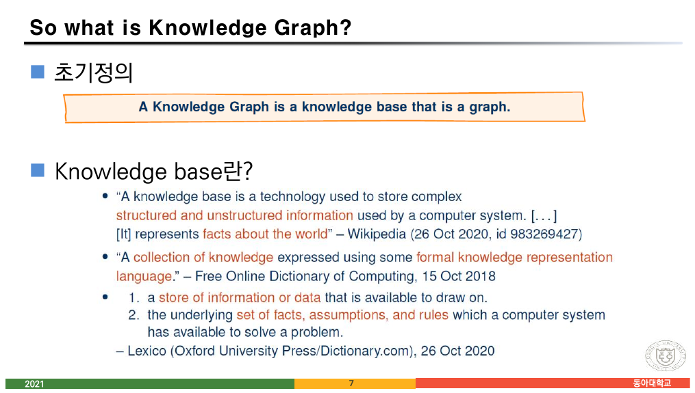

「7 지식그래프 소개」 7쪽이 초기 정의를 상자에 담는다.

> **A Knowledge Graph is a knowledge base that is a graph.**

그러고는 곧바로 *"Knowledge base란?"*을 묻고 세 개의 사전 정의를 나열한다.

> - *"A knowledge base is a technology used to store complex structured and unstructured information used by a computer system. [It] represents **facts about the world**"* — Wikipedia
> - *"A collection of knowledge expressed using some **formal knowledge representation language**."* — Free Online Dictionary of Computing
> - *"1. a store of information or data that is available to draw on. 2. the underlying **set of facts, assumptions, and rules** which a computer system has available to solve a problem."* — Lexico

8쪽이 같은 일을 `graph`에 대해서도 한다 — Wolfram MathWorld, Merriam-Webster, Wikipedia 셋. 그런데 세 정의가 모두 **일상어 수준**이다.

> *"a structure amounting to a **set of objects** in which some pairs of the objects are in some sense **'related'**."* — Wikipedia

「in some sense related」. 11번 노트의 정의 7-1이 *"$\{v_i, v_j\}$가 $G$의 한 간선이면"*이라고 판정 가능한 조건을 준 것과 대비된다. **어느 정의도 「이것이 지식그래프인가」를 판정해 주지 않는다.**

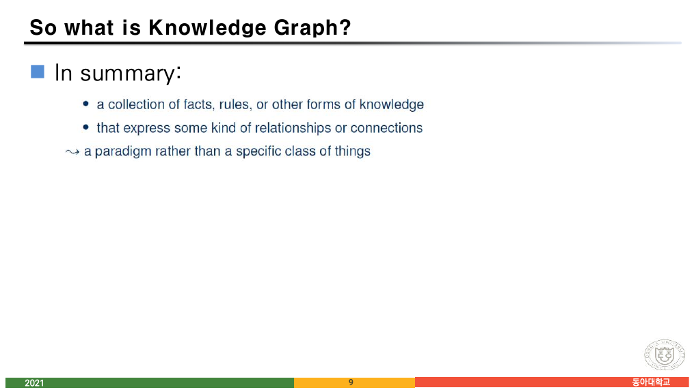

9쪽이 그 사실을 인정한다.

> In summary:
>
> - a collection of facts, rules, or other forms of knowledge
> - that express some kind of relationships or connections
>
> ⟿ **a paradigm rather than a specific class of things**

### 두 번째 정의는 성질 목록이다

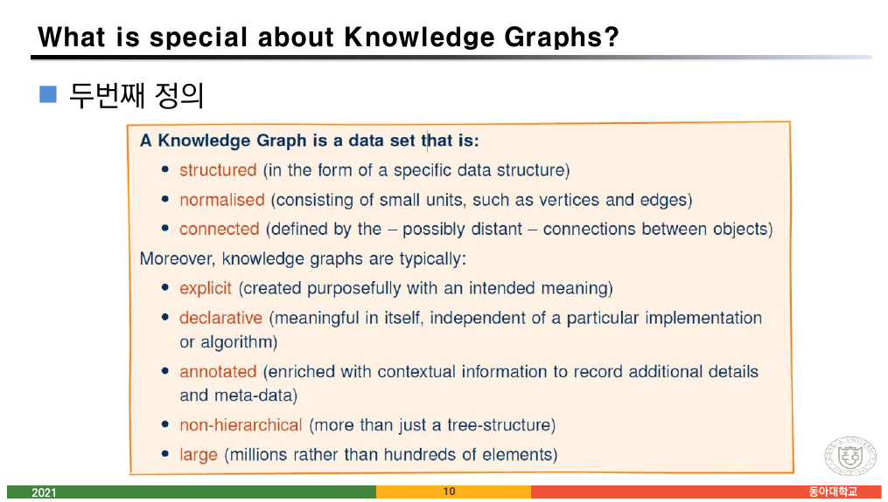

10쪽이 다시 시도한다.

> **A Knowledge Graph is a data set that is:**
>
> - **structured** (in the form of a specific data structure)
> - **normalised** (consisting of small units, such as vertices and edges)
> - **connected** (defined by the — possibly distant — connections between objects)
>
> Moreover, knowledge graphs are typically:
>
> - **explicit** (created purposefully with an intended meaning)
> - **declarative** (meaningful in itself, independent of a particular implementation or algorithm)
> - **annotated** (enriched with contextual information to record additional details and meta-data)
> - **non-hierarchical** (more than just a tree-structure)
> - **large** (millions rather than hundreds of elements)

여덟 개다. 그런데 **앞의 셋과 뒤의 다섯이 문법적으로 다르다.** 앞의 셋은 `is`로 묶여 필수 조건처럼 읽히고, 뒤의 다섯은 `typically`로 묶여 **경향**이다. 즉 **필요조건 세 개와 전형적 성질 다섯 개**를 합친 것이지 정의가 아니다.

세 번째 항목 `connected`의 괄호가 특히 중요하다 — *"defined by the **— possibly distant —** connections between objects."* 이것이 [10번 노트](./10.%20%EB%8B%AB%ED%9E%98%EC%9D%80%20%EB%B6%80%EC%A1%B1%ED%95%9C%20%EA%B2%83%EC%9D%84%20%EC%B5%9C%EC%86%8C%EB%A1%9C%20%EC%B1%84%EC%9A%B4%EB%8B%A4%20%E2%80%94%20%EA%B7%B8%EB%A6%AC%EA%B3%A0%20%EB%B6%89%EC%9D%80%20%ED%8E%9C%EC%9C%BC%EB%A1%9C%20%EA%B3%A0%EC%B3%90%20%EC%A0%81%EC%9D%80%20%ED%95%9C%20%EC%A4%84.md)의 **추이 닫힘**이다. 「멀리 떨어진 연결」을 본다는 것은 $R^\infty$를 본다는 뜻이고, 관계형 DB가 못 하는 일이 그것이다.

### 경계는 예와 반례로 긋는다

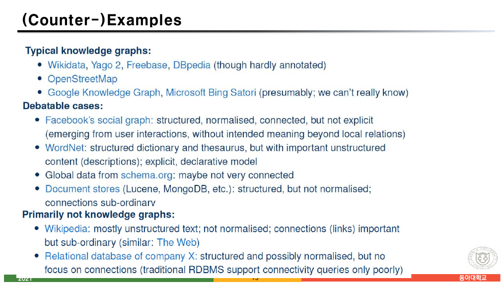

11~13쪽이 세 단계로 목록을 누적한다. 슬라이드마다 한 블록씩 추가되는 **점증 공개** 방식이다.

| 분류 | 사례 | 원본이 단 이유 |
| --- | --- | --- |
| **Typical** | Wikidata, Yago 2, Freebase, DBpedia | (though hardly annotated) |
| | OpenStreetMap | |
| | Google Knowledge Graph, Bing Satori | (presumably; **we can't really know**) |
| **Debatable** | Facebook's social graph | structured, normalised, connected, **but not explicit** |
| | WordNet | structured dictionary, **but important unstructured content** |
| | schema.org의 전역 데이터 | maybe **not very connected** |
| | Document stores (Lucene, MongoDB) | structured, **but not normalised** |
| **Primarily not** | Wikipedia | mostly unstructured text; not normalised |
| | Relational database of company X | structured and normalised, **but no focus on connections** |

**각 사례가 10쪽의 여덟 성질 중 정확히 하나를 어긴다.** 목록이 정의를 대신하는 것이 아니라, **정의의 각 항목이 왜 필요한지를 반례로 보여 주는** 구조다. 이것은 [04번 노트](./04.%20%EC%A6%9D%EB%AA%85%EC%97%90%EC%84%9C%20%EA%B2%80%EC%A6%9D%EC%9C%BC%EB%A1%9C%2C%20%EA%B7%B8%EB%9F%B0%EB%8D%B0%20%EB%8B%A4%EB%A6%AC%EA%B0%80%20%EC%97%86%EB%8B%A4%20%E2%80%94%20%EA%B7%B8%EB%A6%AC%EA%B3%A0%2067%EC%AA%BD%EC%9D%B4%20%EC%A6%9D%EB%AA%85%ED%95%B4%20%EB%B3%B4%EC%9D%B4%EB%8A%94%20%EA%B2%83.md)에서 본 **반례의 쓰임**과 같다 — $\forall$ 문장을 무너뜨리는 데는 하나면 된다.

`Google Knowledge Graph (presumably; we can't really know)`가 이 목록에서 가장 솔직한 줄이다. **비공개 시스템은 판정할 수 없다.** 정의가 있어도 대상에 접근할 수 없으면 분류는 추측이 된다.

```html preview h=640px
<div id="kc" style="font-family:system-ui,-apple-system,'Segoe UI',sans-serif;color:var(--foreground);padding:18px">
  <div style="font-size:13px;font-weight:600;margin-bottom:4px">10쪽의 성질 목록으로 11~13쪽의 사례를 판정해 보기</div>
  <div style="font-size:12px;opacity:.75;margin-bottom:14px">
    사례를 누르면 원본이 든 이유가 여덟 성질 중 어디에 걸리는지 표시된다. 필수 조건 셋 가운데 하나라도 ✗이면 지식그래프가 아니다.
  </div>
  <div style="display:flex;gap:7px;flex-wrap:wrap;margin-bottom:16px" id="kc-btns"></div>
  <div style="display:flex;gap:26px;flex-wrap:wrap;align-items:flex-start">
    <table id="kc-tbl" style="border-collapse:collapse;font-size:12.5px"></table>
    <div style="flex:1;min-width:260px">
      <div id="kc-verdict" style="font-size:13px;line-height:1.9"></div>
    </div>
  </div>
  <style>
    #kc button{background:var(--card);color:var(--foreground);border:1px solid var(--border);
      border-radius:7px;padding:6px 11px;font-size:12px;cursor:pointer;font-family:inherit}
    #kc button.sel{border-color:var(--chart-1);box-shadow:inset 0 0 0 1px var(--chart-1)}
    #kc td,#kc th{border:1px solid var(--border);padding:5px 11px;text-align:left}
    #kc th{opacity:.75;font-weight:600}
    #kc .ok{color:var(--chart-2);font-weight:700}
    #kc .bad{color:var(--chart-5);font-weight:700}
    #kc .dim{opacity:.45}
  </style>
</div>
<script>
(function(){
  var root=document.getElementById('kc');
  var props=[
    ['structured','필수'],['normalised','필수'],['connected','필수'],
    ['explicit','전형'],['declarative','전형'],['annotated','전형'],
    ['non-hierarchical','전형'],['large','전형']
  ];
  // 값: 1 = 만족, 0 = 어긴다, null = 원본이 언급하지 않음
  var cases=[
    {n:'Wikidata · DBpedia', cls:'Typical', v:[1,1,1,1,1,0,1,1],
     why:'원본이 <i>“though hardly annotated”</i>라고 단서를 단다 — <b>annotated</b> 하나만 약하다. 그래도 전형적인 지식그래프로 분류된다(전형 성질은 필수가 아니므로).'},
    {n:'Google KG · Bing Satori', cls:'Typical(추정)', v:[null,null,null,null,null,null,null,null],
     why:'<i>“presumably; we can’t really know”</i> — <b>비공개 시스템이라 판정할 수 없다.</b> 정의가 있어도 대상에 접근하지 못하면 분류는 추측이 된다.'},
    {n:"Facebook's social graph", cls:'Debatable', v:[1,1,1,0,1,null,1,1],
     why:'structured · normalised · connected는 모두 만족한다. 그러나 <b>explicit</b>이 아니다 — <i>“emerging from user interactions, without intended meaning beyond local relations”</i>. 누가 의도해서 만든 의미가 아니라 사용 기록에서 <b>생겨난</b> 구조다.'},
    {n:'WordNet', cls:'Debatable', v:[1,1,1,1,1,null,1,0],
     why:'구조화된 사전이자 시소러스이고 explicit · declarative하다. 다만 뜻풀이(description)라는 <b>비구조 텍스트가 핵심</b>을 차지한다 — structured가 절반만 성립한다.'},
    {n:'schema.org 전역 데이터', cls:'Debatable', v:[1,1,0,1,1,null,1,1],
     why:'<i>“maybe not very connected”</i> — <b>connected</b>가 약하다. 어휘는 공유하지만 개체들이 서로 이어져 있지 않다.'},
    {n:'Document stores (MongoDB 등)', cls:'Debatable', v:[1,0,0,null,null,null,1,1],
     why:'<i>“structured, but not normalised; connections sub-ordinary”</i> — <b>normalised</b>와 <b>connected</b> 둘 다 어긴다. 문서 하나가 큰 덩어리이고 문서 사이 연결이 이차적이다.'},
    {n:'Wikipedia', cls:'Primarily not', v:[0,0,1,1,null,null,1,1],
     why:'<i>“mostly unstructured text; not normalised; connections (links) important but sub-ordinary”</i> — <b>structured와 normalised를 모두 어긴다.</b> 링크는 많지만 본문이 자연어다.'},
    {n:'회사 X의 관계형 DB', cls:'Primarily not', v:[1,1,0,1,1,null,1,null],
     why:'구조화·정규화는 오히려 모범적이다. 그런데 <b>connected</b>가 목적이 아니다 — <i>“traditional RDBMS support connectivity queries only poorly.”</i> 같은 데이터라도 <b>무엇을 물을 수 있는가</b>가 다르다.'}
  ];
  var cur=0;
  function draw(){
    var bs=root.querySelector('#kc-btns');
    bs.innerHTML=cases.map(function(c,i){return '<button class="'+(i===cur?'sel':'')+'" data-i="'+i+'">'+c.n+'</button>';}).join('');
    bs.querySelectorAll('button').forEach(function(b){b.onclick=function(){cur=+b.dataset.i;draw();};});
    var c=cases[cur];
    var h='<tr><th>성질</th><th>구분</th><th>'+c.n+'</th></tr>';
    props.forEach(function(p,i){
      var v=c.v[i];
      var mark = v===1? '<span class="ok">✓</span>' : (v===0? '<span class="bad">✗</span>' : '<span class="dim">—</span>');
      h+='<tr class="'+(p[1]==='필수'?'':'dim')+'"><td>'+p[0]+'</td><td>'+p[1]+'</td><td style="text-align:center">'+mark+'</td></tr>';
    });
    root.querySelector('#kc-tbl').innerHTML=h;
    var req=[c.v[0],c.v[1],c.v[2]];
    var broken=req.filter(function(x){return x===0;}).length;
    var unknown=req.filter(function(x){return x===null;}).length;
    root.querySelector('#kc-verdict').innerHTML=
      '<div style="font-size:14px;font-weight:700;margin-bottom:6px">원본의 분류: '+c.cls+'</div>'+
      '<div style="opacity:.9">'+c.why+'</div>'+
      '<div style="margin-top:12px;padding:10px 12px;border:1px solid var(--border);border-radius:8px;background:var(--card)">'+
      (unknown===3 ? '필수 세 항목을 <b>확인할 수 없다.</b> 원본도 “we can’t really know”라고 적었다.'
        : (broken? '필수 세 항목 중 <b>'+broken+'개</b>를 어긴다.' : '필수 세 항목을 모두 만족한다.'))+
      '</div>';
  }
  draw();
})();
</script>
```

> [!note] 원본의 편집 결함 — 13쪽의 본문이 슬라이드 밖으로 넘친다
> 13쪽은 세 블록(`Typical` / `Debatable` / `Primarily not`)을 모두 담는데, 마지막 줄 *"focus on connections (traditional RDBMS support connectivity queries only poorly)"*가 **슬라이드 아래쪽 색띠와 겹쳐 잘린다.** 점증 공개 방식으로 블록을 쌓다가 마지막 장에서 높이를 넘긴 것이다. 인쇄본에서는 겨우 읽히지만 화면에서는 가려질 수 있다.

---

## 4. 그리고 수학으로 되돌아온다

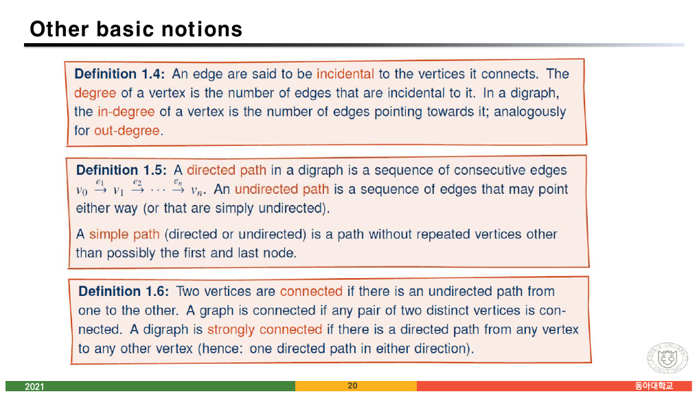

14쪽에 「**컴퓨터 과학과 수학에서의 GRAPHS**」라는 표지가 나오고, 그 뒤로 정의가 **번호를 달고** 돌아온다.

| 정의 | 내용 |
| --- | --- |
| **1.1** | simple undirected graph — 정점 집합 $V$와 간선 집합 $E$, 각 간선은 **두 정점의 집합** |
| **1.2** | simple directed graph (digraph) — $E \subseteq V \times V$, source vertex에서 target vertex로 |
| **1.3** | 세 가지 일반화 — graph with **self-loops**, **multi-graph**, **edge-labelled graph** |
| **1.4** | incidental, **degree**, in-degree, out-degree |
| **1.5** | directed path, undirected path, **simple path** |
| **1.6** | connected, **strongly connected** |

**11쪽까지 흐릿하던 문장이 15쪽부터 판정 가능한 조건으로 바뀐다.** 그리고 이 여섯 정의는 11번 노트의 정의 7-1·7-2·의사 그래프와 **같은 것을 다른 번호로** 말한다.

> [!note] 같은 개념, 다른 정의 — 다중 그래프에 조건이 하나 더 붙는다
> 「5 그래프」 6쪽의 정의 7-2:
>
> > $E$의 **서로 다른 두 개의 정점** 사이에 두 개 이상의 간선이 허용되는 그래프를 다중 그래프라 한다.
>
> 「7 지식그래프 소개」 17쪽의 정의 1.3:
>
> > A **multi-graph** is a graph that may have multiple edges with the same vertices (**in the same direction**).
>
> 두 번째 정의에는 `in the same direction`이 붙어 있다. 유향 그래프에서 $u \to v$와 $v \to u$는 **다중 간선이 아니다**라는 뜻이다. 정의 7-2는 무향을 전제로 하므로 그 조건이 필요 없었다. 같은 이름이 두 파일에서 조금 다른 범위를 갖는다.
>
> 11번 노트에서 인용한 7쪽의 고백 — *"There is no standard terminology for graph theory"* — 이 같은 과목의 두 파일 사이에서 실증된 셈이다.

정의 1.3의 셋째 항목이 앞 절과 이어진다.

> An **edge-labelled graph** is a graph that has an additional labelling function $\lambda : E \to L$ that maps each edge in $E$ to an element from a set of labels $L$.

**레이블 붙이기를 함수로 정의한다.** 간선 집합에서 레이블 집합으로 가는 함수 $\lambda$ — 07번 노트에서 정의한 바로 그 함수다. 16쪽의 카카오 지식그래프 그림이 흐릿하게 보여 준 「간선마다 다른 이름」이 여기서 **$\lambda: E \to L$**이라는 한 줄로 확정된다.

### 마지막 슬라이드가 11번 노트의 질문에 답한다

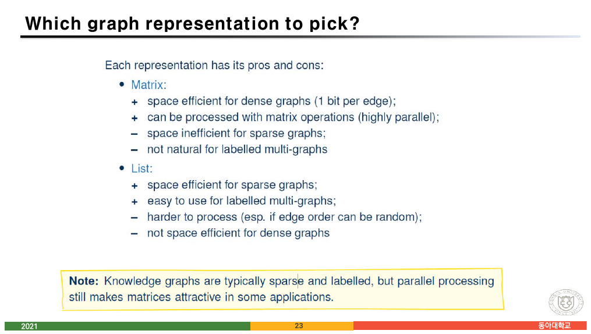

23쪽이 인접 행렬과 인접 리스트를 다시 비교하는데, **기준이 다르다.**

| | 장점 | 단점 |
| --- | --- | --- |
| **Matrix** | dense graph에 공간 효율(간선당 1비트)<br>**행렬 연산으로 처리 가능(highly parallel)** | sparse graph에 비효율<br>**labelled multi-graph에 부자연스럽다** |
| **List** | sparse graph에 공간 효율<br>**labelled multi-graph에 쓰기 쉽다** | 처리가 더 어렵다(간선 순서가 임의일 때)<br>dense graph에 비효율 |

그리고 노란 상자가 결론을 낸다.

> **Note:** Knowledge graphs are typically **sparse and labelled**, but **parallel processing still makes matrices attractive** in some applications.

11번 노트의 25·29쪽은 **간선 수**만으로 두 표현을 비교했다. 여기서는 기준이 둘 늘었다 — **레이블을 담을 수 있는가**, 그리고 **병렬화할 수 있는가**. 두 번째 기준이 10번 노트에서 본 플로이드-와샬 부록의 마지막 줄(*"병렬처리가 가능하기 때문에 유용하게 사용됨 — OpenMP 혹은 GPU 연산 가능"*)과 정확히 같은 말이다.

**행렬은 느슨하고 무겁지만 계산기가 좋아하고, 리스트는 촘촘하고 가볍지만 계산기가 싫어한다.** 지식그래프가 sparse and labelled임에도 행렬이 살아남는 이유가 그것이다.

---

## 5. 정리 — 두 갈래의 정의

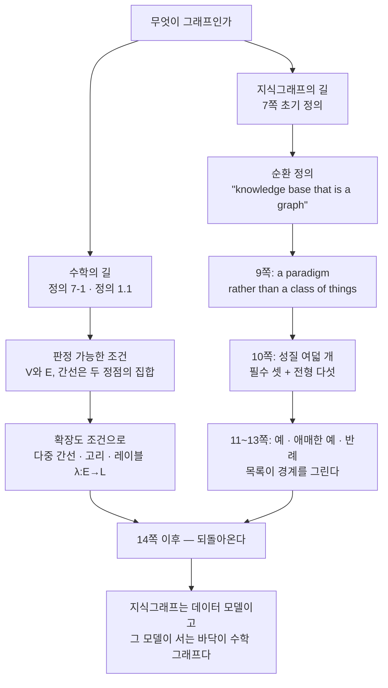

이 자료의 마지막 쪽(24쪽)은 출처만 적는다 — **TU DRESDEN, Markus Krötzsch.** 드레스덴 공대의 지식그래프 강의 자료를 가져온 것이고, 그래서 이 파일만 전부 영어이며 다른 파일들과 문체가 다르다. [02번 노트](./02.%20%ED%95%9C%20%ED%8C%8C%EC%9D%BC%EC%97%90%20%EC%B1%85%20%EB%91%90%20%EA%B6%8C%20%E2%80%94%20%EC%9D%98%EB%AF%B8%EB%A1%9C%20%EA%B0%80%EB%A5%B4%EC%B9%98%EB%8A%94%20%EB%85%BC%EB%A6%AC%EC%99%80%20%ED%8C%8C%EC%8B%B1%EC%9C%BC%EB%A1%9C%20%EA%B0%80%EB%A5%B4%EC%B9%98%EB%8A%94%20%EB%85%BC%EB%A6%AC.md)부터 반복된 「한 파일에 책 두 권」이, 여기서는 **한 과목에 책 세 권**이 된다 — 한국어 교재, 로젠 8판, 그리고 드레스덴.

1쪽이 이 파일의 목표를 두 줄로 적었다.

> ◼ Graph 기반 **지식 표현**에 대한 기본 개념 이해
> ◼ **그래프 데이터 관리 접근법과 Query Language**에 대한 기초 학습

두 번째 줄의 Query Language는 실제로는 다루지 않는다(6쪽에 SPARQL·TinkerPop·Gremlin 로고만 스쳐 간다). 이산수학 강의가 감당할 수 있는 범위를 넘어서는 목표를 적어 둔 셈이고, 남은 것은 **그래프 데이터 모델 다섯 가지**다. 그것만으로도 「이항 관계만 다룬다」는 27쪽의 선언이 실제 시스템에서 어떻게 부딪치는지 보기에는 충분하다.

---

## 다음으로

- **[13번 노트](./13.%20%EA%B7%B8%EB%9E%98%ED%94%84%EC%97%90%20%EC%9D%B4%EB%A6%84%EC%9D%84%20%EB%B6%99%EC%9D%B4%EB%8A%94%20%EC%97%B4%20%EA%B0%80%EC%A7%80%20%EB%B0%A9%EB%B2%95%20%E2%80%94%20%EA%B7%B8%EB%A6%AC%EA%B3%A0%20%ED%95%9C%20%EB%B2%88%EC%94%A9%EB%A7%8C%20%EC%93%B0%EC%9D%B4%EB%8A%94%20%EC%A0%95%EC%9D%98%EB%93%A4.md)** — 강의가 지식그래프를 마치고 돌아간 자리. 완전·정규·이분·동형 그래프.
- **11번 노트** — 이 노트가 끼어들기 전후의 슬라이드들.
- **07번 노트** — 「이항 관계만 다룬다」는 27쪽의 선언과 $n$항 관계.

---

## 근거 자료

`5 그래프.pdf` 슬라이드 16~23(PDF 8~12쪽)과 `7 지식그래프 소개.pdf` 전체(24장, PDF 12쪽).

| 자료 · 슬라이드 | 내용 |
| --- | --- |
| **그래프 16** | **카카오엔터프라이즈 지식그래프 플랫폼 그림 — 간선마다 다른 이름** |
| 그래프 17~18 | Data Graphs — 스키마가 필요 없음, 추상적인 길이의 패스 위에서 질의 |
| 그래프 19 | 그래프 구조기반 데이터 모델의 다섯 유형 |
| **그래프 20~21** | **Directed edge-labelled graph, Heterogeneous graph — 천세진/이산수학 예** |
| **그래프 22** | **Property graph — 간선에 `year = 2021`** |
| **그래프 23** | **Hypergraph와 Hypernode** |
| KG 1~2 | 표지, Goals — 지식 표현과 Query Language |
| KG 3~4 | The Hype(가트너 하이프 사이클), Knowledge Graphs Everywhere |
| KG 5~6 | Google의 원래 Knowledge Graph(2012), Wikidata·Yago·DBpedia·Freebase와 RDF·SPARQL·TinkerPop·Gremlin |
| **KG 7~8** | **초기 정의 "a knowledge base that is a graph", knowledge base와 graph의 사전 정의들** |
| **KG 9** | **"a paradigm rather than a specific class of things"** |
| **KG 10** | **두 번째 정의 — 필수 세 성질 + 전형 다섯 성질** |
| **KG 11~13** | **Typical / Debatable / Primarily not 세 목록 (13쪽은 본문이 색띠에 잘린다)** |
| KG 14 | 표지 — 컴퓨터 과학과 수학에서의 GRAPHS |
| KG 15~17 | 정의 1.1 무향 단순 그래프, 1.2 유향 단순 그래프, **1.3 self-loop·multi-graph·edge-labelled ($\lambda: E \to L$)** |
| **KG 18~20** | **정의 1.4 degree, 1.5 path·simple path, 1.6 connected·strongly connected (누적 공개)** |
| 21~22 | 인접 행렬과 인접 리스트의 Notes |
| **KG 23** | **어느 표현을 고를까 — sparse·labelled vs 병렬 처리** |
| KG 24 | Credits — TU DRESDEN, Markus Krötzsch |

인터랙티브 두 개에 쓴 예(천세진–teaches–이산수학, `type = 사람`, `year = 2021`, `term = 가을학기`)와 사례 목록(Wikidata, Facebook's social graph, WordNet, schema.org, Document stores, Wikipedia, 회사 X의 관계형 DB)은 모두 원본 20~23쪽과 11~13쪽에 적힌 그대로다. 각 사례가 어긋나는 성질은 원본이 괄호 안에 적어 둔 이유를 10쪽의 여덟 항목에 대응시킨 것이며, 대응 자체는 이 노트의 정리다. 보충한 것은 **다섯 모델이 이항 관계로 접히는지에 대한 표**와 hypernode–non-hierarchical의 긴장이며, 본문에서 보충임을 밝혔다.
