> [!abstract] 이 묶음이 실제로 하는 말
> 슬라이드 37부터 65까지 **스물아홉 장에 이름이 열 가지 넘게 쏟아진다** — 개경로·고유 경로·순환·루프·단순 경로·연결·강연결·완전 그래프·순환 그래프·바퀴 그래프·정규 그래프·동형·준동형·부분 그래프·스패닝 그래프·이분 그래프·완전 이분 그래프·희소·밀집·가중치 그래프. 이 중 상당수는 **이 파일에서 한 번씩만 나오고 다시 쓰이지 않는다.**
>
> 그런데 끝에 가면 그 이름들이 왜 필요했는지가 드러난다. 57~65쪽이 **오일러**와 **해밀턴**을 나란히 세우는데, 둘의 차이가 이 묶음 전체의 척추다.
>
> | | 무엇을 한 번씩 지나는가 | 판정 조건 |
> | --- | --- | --- |
> | **오일러 순환** | 모든 **간선** | 연결 그래프에서 **모든 정점의 차수가 짝수** (정리 7-1) |
> | **해밀턴 순환** | 모든 **정점** | **없다** |
>
> 59쪽이 오일러에 대해 *"연결 그래프 $G$가 오일러 그래프가 될 **필요충분조건**은 $G$의 모든 정점이 짝수의 차수를 갖는다는 것"*이라고 한 줄로 끝낸다. 차수만 세면 된다 — [11번 노트](./11.%20%EA%B7%B8%EB%9E%98%ED%94%84%EC%9D%98%20%EC%A0%95%EC%9D%98%EA%B0%80%20%EC%84%B8%20%EB%B2%88%20%EB%8A%98%EC%96%B4%EB%82%9C%EB%8B%A4%20%E2%80%94%20%EA%B7%B8%EB%A6%AC%EA%B3%A0%20%ED%91%9C%ED%98%84%EC%9D%B4%20%EA%B7%B8%20%EB%8A%98%EC%96%B4%EB%82%A8%EC%9D%84%20%ED%9D%A1%EC%88%98%ED%95%9C%EB%8B%A4.md)의 악수 정리면 충분하다.
>
> 해밀턴 쪽에는 그런 정리가 **한 줄도 없다.** 62쪽은 그래프 하나를 주고 *"다음과 같은 경로를 따라서 모든 정점을 지나 다시 시작점으로 올 수 있다"*고 경로를 **직접 보여 주는 것**으로 증명을 대신한다. 그리고 64쪽이 그 대가를 말한다 — 판매원 탐방 문제는 **완전 그래프에서 전체 가중치가 가장 적은 해밀턴 순환을 찾는 문제**다.
>
> **판정식이 있는 문제와 없는 문제.** 앞의 열 가지 이름은 그 대비를 세우기 위한 무대 장치다.

---

## 1. 경로의 네 가지 이름 — 그리고 겹치는 단어 하나

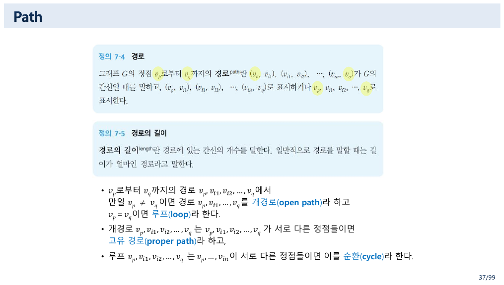

37쪽이 경로를 네 이름으로 쪼갠다.

> - $v_p$로부터 $v_q$까지의 경로에서 만일 $v_p \ne v_q$이면 **개경로(open path)**라 하고 $v_p = v_q$이면 **루프(loop)**라 한다.
> - 개경로가 서로 다른 정점들로만 이루어지면 **고유 경로(proper path)**라 한다.
> - 루프가 서로 다른 정점들로만 이루어지면 이를 **순환(cycle)**이라 한다.

두 축이다 — **출발점과 도착점이 같은가**(개경로 vs 루프), **중간에 같은 정점을 다시 밟는가**(고유/순환 여부).

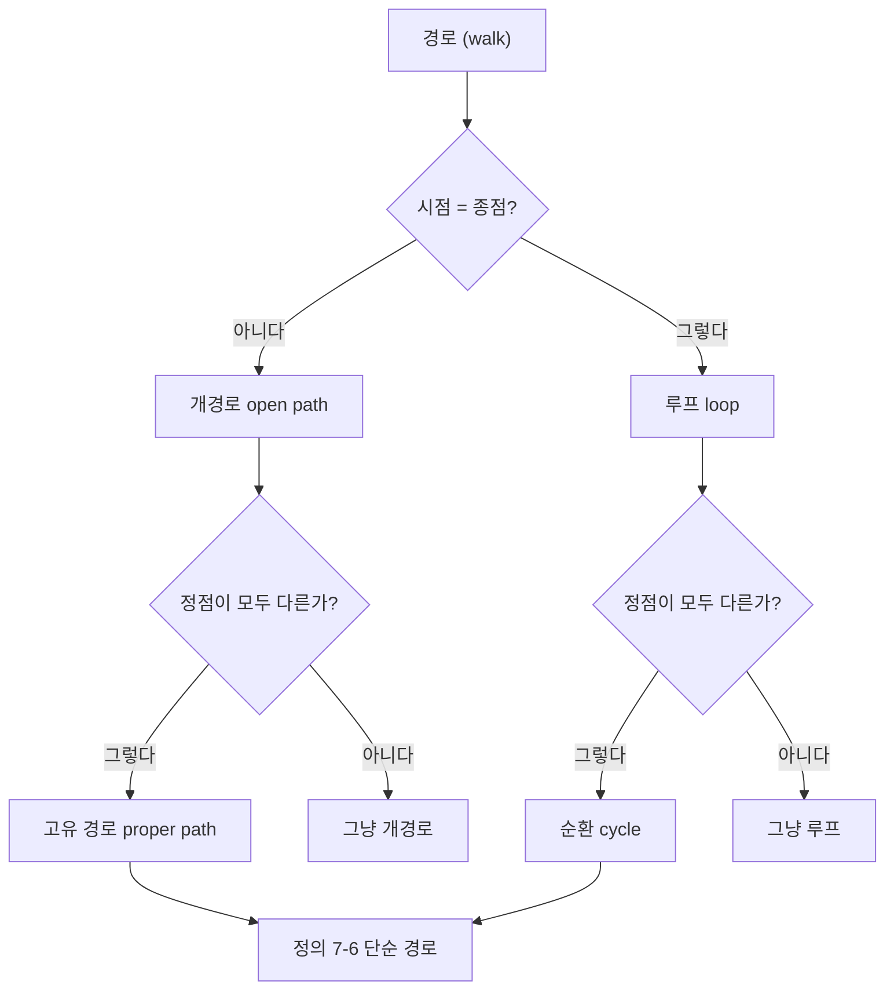

> [!caution] 원본 용어 충돌 — 「루프」가 두 가지를 가리킨다
> 11번 노트에서 본 7쪽의 정의는 이랬다.
>
> > An edge that connects a vertex to itself is called a **loop**.
>
> **간선 하나**를 가리킨다. 그런데 37쪽의 「루프」는 **닫힌 경로 전체**를 가리킨다. $\langle a, b, c, a \rangle$처럼 길이 3짜리도 루프다.
>
> 두 뜻이 같은 파일 안에서 쓰이므로 39쪽의 예문이 곧바로 헷갈린다 — *"$\langle a, c, a, c, a \rangle$와 $\langle a, b, b, c, a \rangle$는 **루프**이지만 순환은 아니다."* 여기서 $\langle a,b,b,c,a \rangle$ 안의 `b, b`는 7쪽 의미의 loop(자기 고리 간선)을 지나는 것이고, 문장 전체가 말하는 「루프」는 37쪽 의미의 닫힌 경로다. **한 문장 안에 두 뜻이 동시에 있다.**
>
> 영어권 교재는 보통 닫힌 경로를 `closed walk`라 부르고 `loop`는 자기 간선에만 쓴다. 7쪽이 인정한 *"There is no standard terminology for graph theory"*가 여기서 실제 혼선을 만든다.

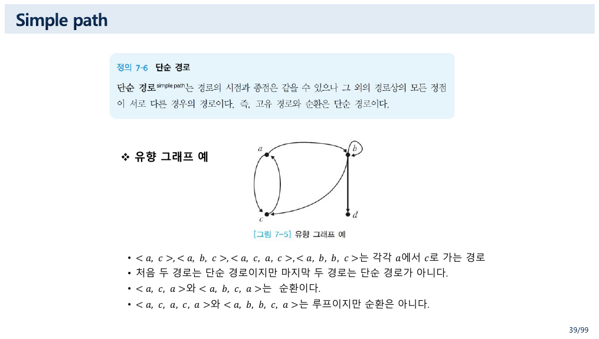

39쪽의 정의 7-6이 넷을 둘로 묶는다.

> **단순 경로**는 경로의 시점과 종점은 같을 수 있으나 그 외의 경로상의 모든 정점이 서로 다른 경우의 경로이다. 즉, **고유 경로와 순환은 단순 경로**이다.

그리고 유향 그래프 하나로 네 경우를 다 보인다.

| 경로 | 단순 경로인가 | 왜 |
| --- | :---: | --- |
| $\langle a, c \rangle$ | ✓ | 정점 둘이 서로 다르다 |
| $\langle a, b, c \rangle$ | ✓ | 정점 셋이 서로 다르다 |
| $\langle a, c, a, c \rangle$ | ✗ | $a$와 $c$를 두 번씩 |
| $\langle a, b, b, c \rangle$ | ✗ | $b$를 두 번 |
| $\langle a, c, a \rangle$ | 순환 | 시점=종점, 중간은 다르다 |
| $\langle a, b, c, a \rangle$ | 순환 | 같음 |
| $\langle a, c, a, c, a \rangle$ | 루프(순환 ✗) | 중간에 $c$가 두 번 |
| $\langle a, b, b, c, a \rangle$ | 루프(순환 ✗) | 중간에 $b$가 두 번 |

40쪽의 예제 7-6이 이 판정을 **지하철 노선도**에 적용한다 — *"수원에서 신창까지의 경로가 단순 경로인지, 순환 혹은 루프인지를 보여라."* 답은 *"경로상의 모든 정점이 다르므로 단순 경로이다. 순환이나 루프는 시점과 종점이 같아야 하므로 순환이나 루프는 아니다."* 노선도가 무향 그래프라는 지적과 함께 나오는데, **환승역이 곧 차수가 3 이상인 정점**이라는 사실을 알아채면 11번 노트의 차수가 실물로 보인다.

41~43쪽이 연결성으로 넘어간다. 특히 **강연결(strongly connected)**의 정의가 [08번 노트](./08.%20%EA%B2%BD%EB%A1%9C%EB%8A%94%20%EA%B3%B1%ED%95%98%EA%B3%A0%20%EC%84%B1%EC%A7%88%EC%9D%80%20%EB%94%B0%EC%A7%84%EB%8B%A4%20%E2%80%94%20%E3%80%8C%EB%AA%A8%EB%93%A0%E3%80%8D%EC%9D%B4%EB%9D%BC%20%EC%8D%A8%EC%95%BC%20%ED%95%A0%20%EC%9E%90%EB%A6%AC%EC%9D%98%20%E3%80%8C%EC%96%B4%EB%96%A4%E3%80%8D.md)의 도달 관계와 같은 말이다.

> A directed graph is called **strongly connected** if there is a path in each direction between each pair of vertices of the graph.
> The **strongly connected components** of an arbitrary directed graph form a **partition** into subgraphs that are themselves strongly connected.

`partition`이라는 단어가 결정적이다. [06번 노트](./06.%20%EC%A7%91%ED%95%A9%EC%9D%98%20%EB%8C%80%EC%88%98%EB%8A%94%20%EB%85%BC%EB%A6%AC%EC%9D%98%20%EB%8C%80%EC%88%98%EB%8B%A4%20%E2%80%94%20%EA%B0%99%EC%9D%80%20%EB%B2%95%EC%B9%99%EC%9D%84%20%EC%84%B8%20%EB%B2%88%20%EC%A6%9D%EB%AA%85%ED%95%98%EA%B8%B0.md)에서 본 분할, 08번 노트에서 본 동치류가 **강연결 성분**이라는 이름으로 돌아온 것이다. "서로 오갈 수 있다"는 관계가 반사·대칭·추이를 모두 만족하는 **동치 관계**이기 때문에 성분들이 분할을 이룬다.

---

## 2. 이름표 열 개 — 무엇이 정해지면 무엇이 따라오는가

44~55쪽이 특별한 그래프들에 이름을 붙인다. 각 이름은 **한 가지 값만 정하면 나머지가 전부 결정되는** 그래프들이다.

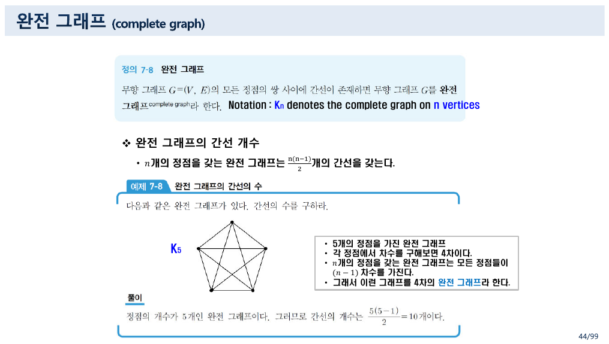

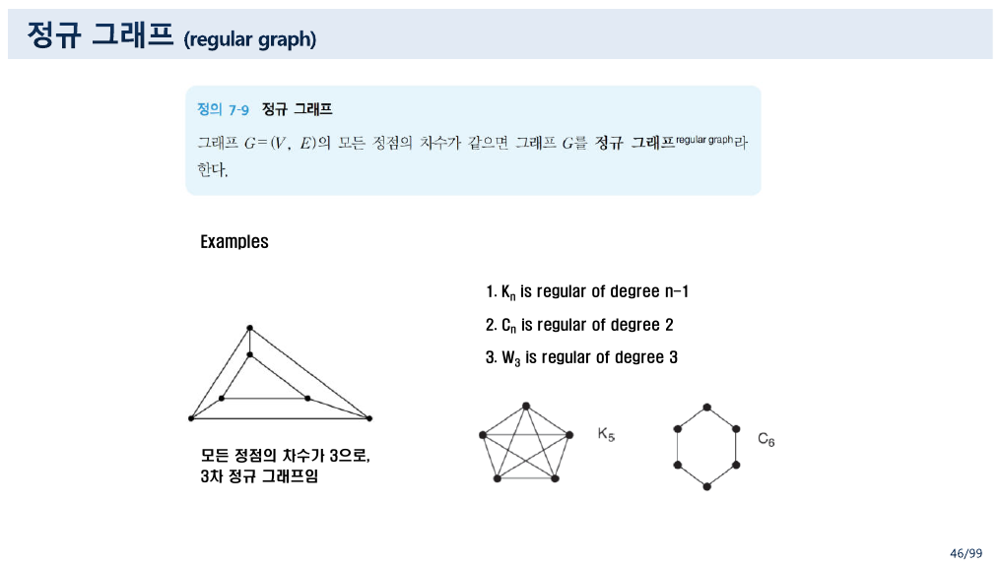

```html preview h=700px
<div id="fam" style="font-family:system-ui,-apple-system,'Segoe UI',sans-serif;color:var(--foreground);padding:18px">
  <div style="font-size:13px;font-weight:600;margin-bottom:4px">44~53쪽의 그래프 가족 — n 하나로 전부 결정된다</div>
  <div style="font-size:12px;opacity:.75;margin-bottom:14px">
    가족을 고르고 슬라이더로 크기를 바꾼다. 정점 수·간선 수·차수가 원본이 적은 공식대로 따라온다.
  </div>
  <div style="display:flex;gap:7px;flex-wrap:wrap;margin-bottom:12px">
    <button class="fmb" data-f="K">완전 그래프 Kₙ</button>
    <button class="fmb" data-f="C">순환 그래프 Cₙ</button>
    <button class="fmb" data-f="W">바퀴 그래프 Wₙ</button>
    <button class="fmb" data-f="B">완전 이분 그래프 K₃,ₙ</button>
  </div>
  <div style="display:flex;gap:12px;align-items:center;margin-bottom:14px">
    <span style="font-size:12px;opacity:.8">n =</span>
    <input id="fam-n" type="range" min="3" max="8" value="5" style="width:190px">
    <span id="fam-nv" style="font-size:14px;font-weight:700;min-width:20px"></span>
  </div>
  <div style="display:flex;gap:26px;flex-wrap:wrap;align-items:flex-start">
    <svg id="fam-svg" width="300" height="270" viewBox="0 0 300 270" style="border:1px solid var(--border);border-radius:9px;background:var(--card)"></svg>
    <div style="flex:1;min-width:280px">
      <div id="fam-title" style="font-size:15px;font-weight:700;margin-bottom:8px"></div>
      <table id="fam-tbl" style="border-collapse:collapse;font-size:12.5px"></table>
      <div id="fam-note" style="margin-top:12px;font-size:12.5px;line-height:1.85"></div>
    </div>
  </div>
  <style>
    #fam .fmb{background:var(--card);color:var(--foreground);border:1px solid var(--border);
      border-radius:7px;padding:6px 11px;font-size:12px;cursor:pointer;font-family:inherit}
    #fam .fmb.sel{border-color:var(--chart-1);box-shadow:inset 0 0 0 1px var(--chart-1)}
    #fam td,#fam th{border:1px solid var(--border);padding:5px 12px;text-align:left}
    #fam th{opacity:.75;font-weight:600}
  </style>
</div>
<script>
(function(){
  var root=document.getElementById('fam');
  var fam='K', n=5;
  function pts(k,cx,cy,r,off){
    var a=[]; for(var i=0;i<k;i++){ var t=(off||-Math.PI/2)+2*Math.PI*i/k; a.push([cx+r*Math.cos(t),cy+r*Math.sin(t)]); }
    return a;
  }
  function render(){
    var V=[],E=[],title='',rows=[],note='';
    if(fam==='K'){
      V=pts(n,150,135,100); for(var i=0;i<n;i++)for(var j=i+1;j<n;j++) E.push([i,j]);
      title='K'+n+' — 완전 그래프';
      rows=[['정점 수',n],['간선 수','n(n−1)/2 = '+(n*(n-1)/2)],['모든 정점의 차수','n−1 = '+(n-1)],['정규 그래프인가','✓ (n−1)차 정규']];
      note='44쪽: <i>“n개의 정점을 갖는 완전 그래프는 n(n−1)/2개의 간선을 갖는다”</i>, <i>“모든 정점들이 (n−1) 차수를 가진다.”</i><br>'+
           '원본이 든 K₅는 간선 10개, 차수 4다 — 그래서 <i>“4차의 완전 그래프”</i>라 부른다.';
    } else if(fam==='C'){
      V=pts(n,150,135,100); for(i=0;i<n;i++) E.push([i,(i+1)%n]);
      title='C'+n+' — 순환 그래프';
      rows=[['정점 수',n],['간선 수',n],['모든 정점의 차수','2'],['정규 그래프인가','✓ 2차 정규']];
      note='45쪽: <i>“edge e<sub>k</sub> joins vertices {v<sub>k</sub>, v<sub>k+1</sub>} where v<sub>k+1</sub> is mod n.”</i><br>'+
           '모든 차수가 2이므로 <b>언제나 오일러 그래프</b>다(59쪽 정리 7-1). 착색 수는 n이 짝수면 2, 홀수면 3이다(95쪽).';
    } else if(fam==='W'){
      var rim=pts(n,150,135,100); V=rim.concat([[150,135]]);
      for(i=0;i<n;i++){ E.push([i,(i+1)%n]); E.push([i,n]); }
      title='W'+n+' — 바퀴 그래프';
      rows=[['정점 수','n+1 = '+(n+1)],['간선 수','2n = '+(2*n)],['테두리 정점의 차수','3'],['중심 정점의 차수','n = '+n],
            ['정규 그래프인가', n===3? '✓ 3차 정규 (W₃ = K₄)' : '✗ 중심만 차수 '+n]];
      note='45쪽: <i>“Wₙ denotes the wheel graph on n+1 vertices.”</i> 순환 그래프에 중심 정점 하나를 더해 모든 정점과 잇는다.<br>'+
           (n===3? '<b>n = 3일 때만 정규 그래프다.</b> 46쪽이 <i>“W₃ is regular of degree 3”</i>이라 적은 이유이고, 이때 W₃는 K₄와 같은 그래프다.'
                 : 'n이 3이 아니면 중심의 차수(<b>'+n+'</b>)와 테두리의 차수(3)가 달라 정규 그래프가 아니다. 슬라이더를 3으로 내려 보라.');
    } else {
      var m=3;
      var left=[],right=[];
      for(i=0;i<m;i++) left.push([80,60+i*75]);
      for(i=0;i<n;i++) right.push([220,50+i*(170/Math.max(1,n-1))]);
      V=left.concat(right);
      for(i=0;i<m;i++)for(var j=0;j<n;j++) E.push([i,m+j]);
      title='K3,'+n+' — 완전 이분 그래프';
      rows=[['정점 수','3 + n = '+(3+n)],['간선 수','3 × n = '+(3*n)],['왼쪽 정점의 차수','n = '+n],['오른쪽 정점의 차수','3'],
            ['정규 그래프인가', n===3? '✓ 3차 정규' : '✗']];
      note='53쪽: <i>“K<sub>m,n</sub>은 m × n의 간선을 가진다.”</i> 같은 쪽 정점끼리는 간선이 없다.<br>'+
           (n===3? '<b>K₃,₃</b> — 91쪽이 이 그래프를 대표적인 <b>비평면 그래프</b>로 든다. 정점 6개, 간선 9개.' :
                   'n을 3으로 맞추면 K₃,₃가 된다 — 평면 그래프 단원의 주인공이다.');
    }
    var s='';
    E.forEach(function(e){
      s+='<line x1="'+V[e[0]][0]+'" y1="'+V[e[0]][1]+'" x2="'+V[e[1]][0]+'" y2="'+V[e[1]][1]+
         '" stroke="var(--chart-1)" stroke-width="1.6" opacity="0.75"></line>';
    });
    V.forEach(function(p,i){
      s+='<circle cx="'+p[0]+'" cy="'+p[1]+'" r="9" fill="var(--card)" stroke="var(--foreground)" stroke-width="1.5"></circle>';
    });
    root.querySelector('#fam-svg').innerHTML=s;
    root.querySelector('#fam-title').textContent=title;
    root.querySelector('#fam-tbl').innerHTML=rows.map(function(r){
      return '<tr><th>'+r[0]+'</th><td>'+r[1]+'</td></tr>';
    }).join('');
    root.querySelector('#fam-note').innerHTML=note;
    root.querySelector('#fam-nv').textContent=n;
  }
  root.querySelectorAll('.fmb').forEach(function(b){
    b.onclick=function(){fam=b.dataset.f;root.querySelectorAll('.fmb').forEach(function(x){x.classList.toggle('sel',x===b);});render();};
  });
  root.querySelector('#fam-n').oninput=function(){n=+this.value;render();};
  root.querySelector('.fmb').classList.add('sel');
  render();
})();
</script>
```

46쪽이 세 가족을 정규 그래프의 언어로 한꺼번에 정리한다.

> 1. $K_n$ is regular of degree $n-1$
> 2. $C_n$ is regular of degree $2$
> 3. $W_3$ is regular of degree $3$

셋째 줄에 $n$이 없다는 점이 중요하다. **바퀴 그래프는 $n = 3$일 때만 정규다** — 중심의 차수가 $n$이고 테두리의 차수가 3이므로 $n = 3$에서만 같아진다. 그리고 그때 $W_3$는 정점 4개에 간선 6개, 모든 차수 3 — **$K_4$와 같은 그래프**다.

### 동형 — 같은 그래프를 다르게 그리기

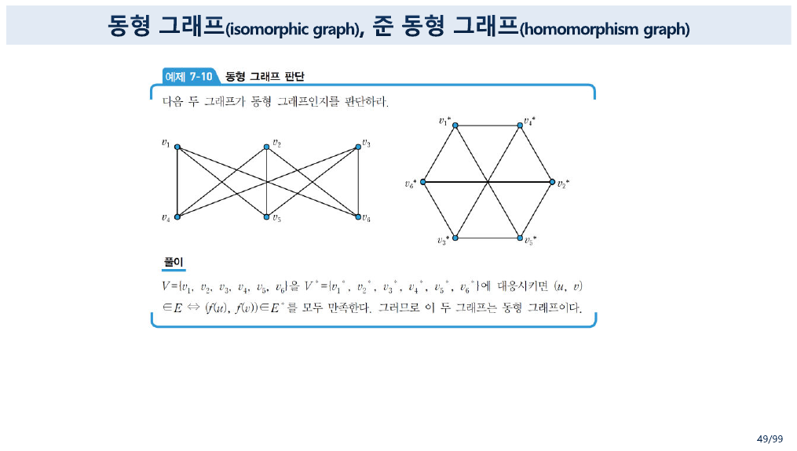

47~49쪽이 **동형(isomorphic)**을 다룬다. 48쪽이 한 단어로 조건을 적는다 — **전단사**.

49쪽의 예제 7-10이 그 뜻을 극적으로 보인다. 왼쪽은 위아래 세 개씩 늘어놓고 선을 교차시킨 그림, 오른쪽은 **육각형에 긴 대각선 세 개**를 그은 그림이다. 전혀 달라 보이는데 답은 동형이다.

> $V = \{v_1, \ldots, v_6\}$을 $V^{*} = \{v_1^{*}, \ldots, v_6^{*}\}$에 대응시키면 $(u,v) \in E \Leftrightarrow (f(u), f(v)) \in E^{*}$를 모두 만족한다.

두 그림 모두 **$K_{3,3}$**이다. 앞의 인터랙티브에서 $K_{3,3}$을 만들어 보면 왼쪽 그림이 나오고, 91쪽은 같은 그래프를 육각형으로 그린다. **그림은 그래프가 아니다 — 그래프는 정점과 간선의 관계이고, 그림은 그중 하나의 배치일 뿐이다.** 이 구분이 다음 묶음의 평면 그래프에서 결정적으로 쓰인다([15번 노트](./15.%20%ED%8F%89%EB%A9%B4%EA%B3%BC%20%EC%83%89%20%E2%80%94%20%EA%B7%B8%EB%A6%B4%20%EC%88%98%20%EC%9E%88%EB%8A%94%EA%B0%80%2C%20%EB%AA%87%20%EA%B0%80%EC%A7%80%20%EC%83%89%EC%9D%B4%EB%A9%B4%20%EB%90%98%EB%8A%94%EA%B0%80.md)).

50쪽이 부분 그래프와 스패닝 그래프를 가른다.

| | 조건 |
| --- | --- |
| 부분 그래프 | $V' \subseteq V$ 이고 $E' \subseteq E$ |
| 진부분 그래프 | 위에 더해 $E' \ne E$ |
| **스패닝 그래프** | $V' = V$ 이고 $E' \subseteq E$ — **정점은 전부, 간선만 골라낸다** |

스패닝 그래프가 [16번 노트](./16.%20%ED%8A%B8%EB%A6%AC%EB%8A%94%20%ED%8A%B9%EB%B3%84%ED%95%9C%20%EA%B4%80%EA%B3%84%EB%8B%A4%20%E2%80%94%20%EA%B7%B8%EB%9F%B0%EB%8D%B0%20%EC%88%9C%ED%9A%8C%20%EA%B2%B0%EA%B3%BC%EB%8A%94%20%ED%8A%B8%EB%A6%AC%EB%A5%BC%20%EB%90%98%EB%8F%8C%EB%A6%AC%EC%A7%80%20%EB%AA%BB%ED%95%9C%EB%8B%A4.md)의 스패닝 트리로 곧장 이어진다.

### 이분 그래프 — 짝짓기의 언어

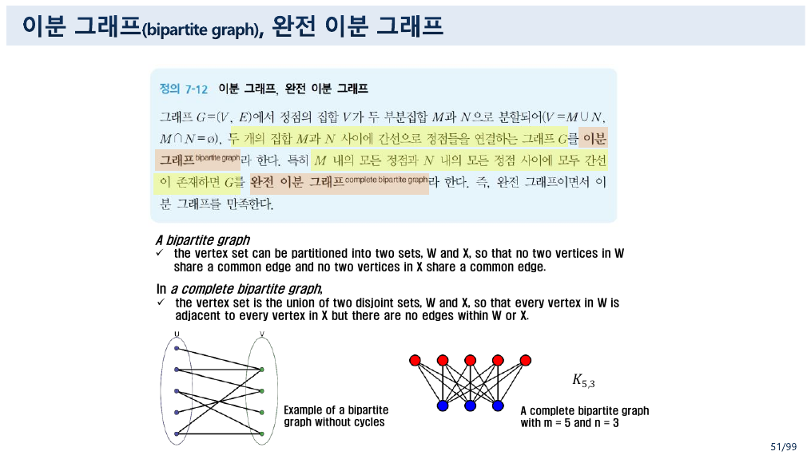

51~53쪽의 이분 그래프가 이 묶음에서 **응용이 가장 뚜렷한 이름**이다. 52쪽이 두 가지를 든다.

> - **Job assignments** — vertices represent the jobs and the employees, edges link employees with those jobs they have been trained to do.
> - **Marriage** — vertices represent the men and the women and edges link a man and a woman if they are an acceptable spouse.

두 집합 사이에만 간선이 있고 같은 집합 안에는 없다는 구조가 **짝짓기(matching)** 문제의 뼈대다. 원본은 매칭 알고리즘까지 가지 않고 정의에서 멈추지만, $K_{3,3}$이 15번 노트의 쿠라토프스키 정리에서 주인공이 되므로 이름은 반드시 필요하다.

54쪽의 희소·밀집은 **간선 수를 최대 간선 수로 나눈 비율**로 정의된다. 55쪽의 가중치 그래프는 *"두 정점 사이의 거리, 시간, 비용을 나타낸다"*로 한 줄이고, [14번 노트](./14.%20%EC%B5%9C%EB%8B%A8%20%EA%B2%BD%EB%A1%9C%EB%A5%BC%20%EB%91%90%20%EB%B2%88%20%EA%B0%80%EB%A5%B4%EC%B9%9C%EB%8B%A4%20%E2%80%94%20%EA%B0%99%EC%9D%80%20%EC%95%8C%EA%B3%A0%EB%A6%AC%EC%A6%98%2C%20%EB%8B%A4%EB%A5%B8%20%EA%B7%B8%EB%9E%98%ED%94%84%2C%20%EB%8B%A4%EB%A5%B8%20%ED%91%9C.md)의 다익스트라에서 본격적으로 쓰인다.

56쪽이 트리를 한 장으로 예고한다 — *"a connected acyclic undirected graph"*, 그리고 **Vertices : $V$, Edges : $V-1$**. 슬라이드 오른쪽 위에 「8장 트리 학습」이라는 메모가 붙어 있다.

---

## 3. 오일러 — 차수만 세면 된다

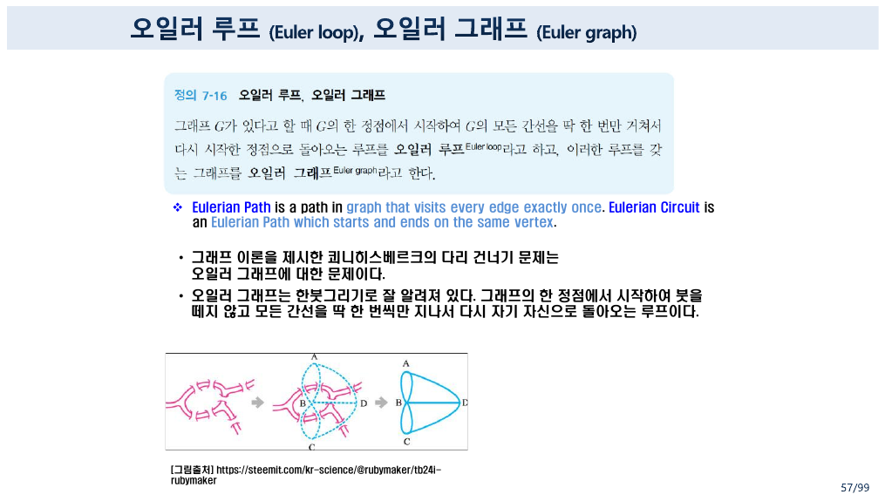

57쪽이 오일러를 정의한다.

> **Eulerian Path** is a path in graph that visits **every edge exactly once**. **Eulerian Circuit** is an Eulerian Path which starts and ends on the same vertex.
> • 그래프 이론을 제시한 **쾨니히스베르크의 다리 건너기 문제**는 오일러 그래프에 대한 문제이다.
> • 오일러 그래프는 **한붓그리기**로 잘 알려져 있다.

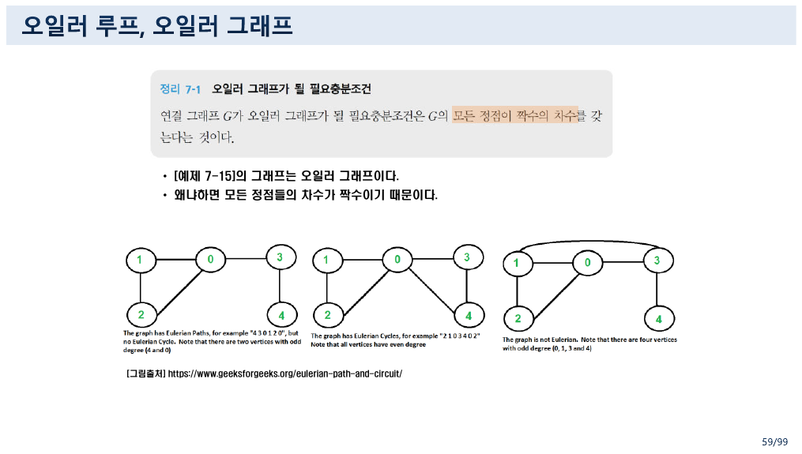

59쪽의 정리 7-1이 판정을 한 줄로 끝낸다.

> 연결 그래프 $G$가 오일러 그래프가 될 **필요충분조건**은 $G$의 **모든 정점이 짝수의 차수**를 갖는다는 것이다.

왜 짝수인가. **정점에 들어간 만큼 나와야 하기 때문**이다. 간선을 한 번씩만 쓰면서 어떤 정점을 지날 때마다 간선 두 개(들어오는 것과 나가는 것)를 소비하므로, 그 정점의 차수는 짝수여야 한다. 시작점과 끝점이 같으면 거기서도 같은 셈이 성립한다.

59쪽이 geeksforgeeks의 세 그림을 나란히 붙여 세 경우를 보인다.

| 그림 | 홀수 차수 정점 | 판정 |
| --- | :---: | --- |
| 첫째 | 2개 (4와 0) | **오일러 경로는 있고 회로는 없다** — 예: `4 3 0 1 2 0` |
| 둘째 | 0개 | **오일러 회로가 있다** — 예: `2 1 0 3 4 0 2` |
| 셋째 | 4개 (0, 1, 3, 4) | **오일러가 아니다** |

홀수 차수 정점이 0개면 회로, 2개면 경로, 4개 이상이면 불가능. **차수를 세는 것만으로 세 경우가 갈린다.**

```html preview h=680px
<div id="eul" style="font-family:system-ui,-apple-system,'Segoe UI',sans-serif;color:var(--foreground);padding:18px">
  <div style="font-size:13px;font-weight:600;margin-bottom:4px">차수만 세면 오일러가 판정된다 — 그런데 해밀턴은?</div>
  <div style="font-size:12px;opacity:.75;margin-bottom:14px">
    62쪽 예제 7-16의 그래프가 기본값이다. 간선을 눌러 켜고 끄며 두 판정이 어떻게 갈리는지 본다.
  </div>
  <div style="display:flex;gap:7px;flex-wrap:wrap;margin-bottom:14px">
    <button class="eb" data-p="ex716">예제 7-16 (해밀턴 ✓ · 오일러 ✗)</button>
    <button class="eb" data-p="cycle">순환 그래프 C₆</button>
    <button class="eb" data-p="kb">쾨니히스베르크 (다중 간선은 단순화)</button>
  </div>
  <div style="display:flex;gap:28px;flex-wrap:wrap;align-items:flex-start">
    <svg id="eul-svg" width="330" height="240" viewBox="0 0 330 240" style="border:1px solid var(--border);border-radius:9px;background:var(--card)"></svg>
    <div style="flex:1;min-width:290px">
      <table id="eul-deg" style="border-collapse:collapse;font-size:12.5px;font-family:ui-monospace,monospace"></table>
      <div id="eul-out" style="margin-top:14px;font-size:12.5px;line-height:1.95"></div>
    </div>
  </div>
  <style>
    #eul .eb{background:var(--card);color:var(--foreground);border:1px solid var(--border);
      border-radius:7px;padding:6px 11px;font-size:12px;cursor:pointer;font-family:inherit}
    #eul .eb:hover{border-color:var(--chart-1)}
    #eul td,#eul th{border:1px solid var(--border);padding:4px 9px;text-align:center}
    #eul th{opacity:.72;font-weight:600}
    #eul .odd{background:var(--chart-5);color:var(--card);font-weight:700}
    #eul .verdict{padding:9px 12px;border:1px solid var(--border);border-radius:8px;background:var(--card);margin-bottom:8px}
  </style>
</div>
<script>
(function(){
  var root=document.getElementById('eul');
  var P=[[40,40],[165,40],[290,40],[40,190],[165,190],[290,190]];
  var N=['a','b','c','d','e','f'];
  var presets={
    ex716:['a-b','b-c','d-e','e-f','a-d','b-e','c-f','b-d','b-f'],
    cycle:['a-b','b-c','c-f','e-f','d-e','a-d'],
    kb:['a-b','b-c','a-d','b-d','b-e','c-e','d-e']
  };
  var on={};
  function key(i,j){return N[Math.min(i,j)]+'-'+N[Math.max(i,j)];}
  function edges(){ return Object.keys(on); }
  function deg(){
    var d=[0,0,0,0,0,0];
    edges().forEach(function(k){ var p=k.split('-'); d[N.indexOf(p[0])]++; d[N.indexOf(p[1])]++; });
    return d;
  }
  function connectedVerts(){
    var d=deg(), used=[];
    for(var i=0;i<6;i++) if(d[i]>0) used.push(i);
    if(!used.length) return {ok:true,used:used};
    var seen={}, st=[used[0]]; seen[used[0]]=1;
    while(st.length){
      var v=st.pop();
      edges().forEach(function(k){
        var p=k.split('-'), a=N.indexOf(p[0]), b=N.indexOf(p[1]);
        var w = a===v? b : (b===v? a : -1);
        if(w>=0 && !seen[w]){ seen[w]=1; st.push(w); }
      });
    }
    return {ok: used.every(function(v){return seen[v];}), used:used};
  }
  function hamilton(){
    // 6개 정점 전부를 도는 해밀턴 순환 탐색 (전수)
    var adj={};
    for(var i=0;i<6;i++) adj[i]=[];
    edges().forEach(function(k){ var p=k.split('-'),a=N.indexOf(p[0]),b=N.indexOf(p[1]); adj[a].push(b); adj[b].push(a); });
    var res=null;
    function go(path,seen){
      if(res) return;
      if(path.length===6){ if(adj[path[5]].indexOf(path[0])>=0) res=path.concat([path[0]]); return; }
      adj[path[path.length-1]].forEach(function(w){
        if(!seen[w]){ seen[w]=1; go(path.concat([w]),seen); seen[w]=0; }
      });
    }
    var seen={0:1}; go([0],seen);
    return res;
  }
  function draw(){
    var s='';
    for(var i=0;i<6;i++)for(var j=i+1;j<6;j++){
      var k=key(i,j), act=!!on[k];
      s+='<line x1="'+P[i][0]+'" y1="'+P[i][1]+'" x2="'+P[j][0]+'" y2="'+P[j][1]+
         '" stroke="'+(act?'var(--chart-1)':'var(--border)')+'" stroke-width="'+(act?3:1)+
         '" stroke-dasharray="'+(act?'':'3 4')+'" style="cursor:pointer" data-k="'+k+'"></line>';
    }
    var d=deg();
    P.forEach(function(p,i){
      s+='<circle cx="'+p[0]+'" cy="'+p[1]+'" r="16" fill="'+(d[i]%2?'var(--chart-5)':'var(--card)')+
         '" stroke="var(--foreground)" stroke-width="1.5"></circle>';
      s+='<text x="'+p[0]+'" y="'+(p[1]+4)+'" text-anchor="middle" font-size="12" fill="'+(d[i]%2?'var(--card)':'var(--foreground)')+
         '" font-family="ui-monospace,monospace">'+N[i]+'</text>';
    });
    var svg=root.querySelector('#eul-svg');
    svg.innerHTML=s;
    svg.querySelectorAll('line').forEach(function(l){
      l.onclick=function(){ var k=l.dataset.k; if(on[k]) delete on[k]; else on[k]=1; draw(); };
    });
    root.querySelector('#eul-deg').innerHTML=
      '<tr><th>정점</th>'+N.map(function(x){return '<th>'+x+'</th>';}).join('')+'</tr>'+
      '<tr><th>차수</th>'+d.map(function(x){return '<td class="'+(x%2?'odd':'')+'">'+x+'</td>';}).join('')+'</tr>';
    var odd=d.filter(function(x){return x%2;}).length;
    var conn=connectedVerts();
    var ham=hamilton();
    var eulTxt;
    if(!edges().length) eulTxt='간선이 없다.';
    else if(!conn.ok) eulTxt='<b>연결되어 있지 않다</b> — 정리 7-1의 전제(연결 그래프)가 깨진다.';
    else if(odd===0) eulTxt='홀수 차수 정점 <b>0개</b> → <b class="okc">오일러 회로가 있다</b> (정리 7-1).';
    else if(odd===2) eulTxt='홀수 차수 정점 <b>2개</b> → 오일러 <b>경로</b>는 있으나 회로는 없다.';
    else eulTxt='홀수 차수 정점 <b>'+odd+'개</b> → <b>오일러 그래프가 아니다.</b>';
    root.querySelector('#eul-out').innerHTML=
      '<div class="verdict"><b>오일러</b> — 차수를 세는 것으로 끝난다<br>'+eulTxt+'</div>'+
      '<div class="verdict"><b>해밀턴</b> — 판정식이 없다. 순환을 <b>찾아봐야</b> 안다<br>'+
        (ham? '찾았다: <b>'+ham.map(function(i){return N[i];}).join(' → ')+'</b><br><span style="opacity:.75">모든 정점을 한 번씩 지나 출발점으로 돌아온다. 6개 정점을 훑는 데 최악의 경우 5! = 120가지를 시도해야 한다.</span>'
             : '여섯 정점을 모두 도는 순환이 <b>없다.</b><br><span style="opacity:.75">없다는 것을 확인하려면 결국 전부 시도해 봐야 한다 — 이것이 판매원 탐방 문제가 어려운 이유다.</span>')+
      '</div>';
  }
  root.querySelectorAll('.eb').forEach(function(b){
    b.onclick=function(){ on={}; presets[b.dataset.p].forEach(function(k){on[k]=1;}); draw(); };
  });
  presets.ex716.forEach(function(k){on[k]=1;});
  draw();
})();
</script>
```

---

## 4. 해밀턴 — 찾아봐야 안다

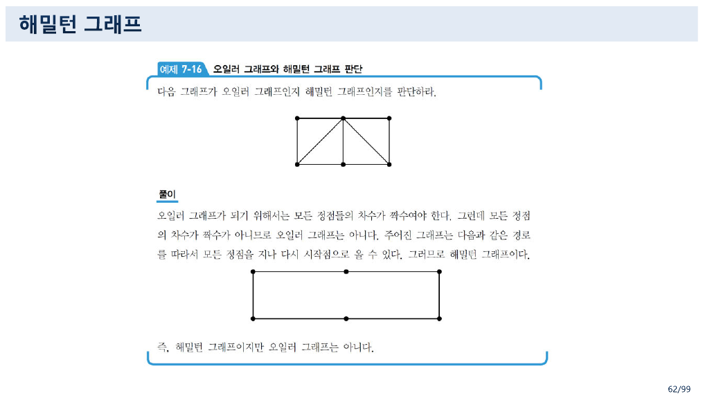

60쪽이 해밀턴을 소개하는데, 한 줄이 문제다.

> [!caution] 원본 오류 — 60쪽: 해밀턴 순환에서 같은 모서리를 여러 번 지날 수는 없다
> 60쪽 본문.
>
> > 오일러 경로, 오일러 순환과는 다르게 해밀턴 경로, 해밀턴 순환은 **같은 모서리를 몇 번을 지나든 상관없이** 꼭짓점들만 한 번씩 지나면 됨
>
> 해밀턴 순환은 $n$개의 정점을 한 번씩 지나 출발점으로 돌아오므로 **간선을 정확히 $n$개 쓴다.** 같은 간선을 두 번 지나려면 그 간선의 양 끝 정점 중 하나를 두 번 밟아야 하는데, 그것은 「꼭짓점을 한 번씩」이라는 조건 자체를 깬다. **같은 모서리를 두 번 지나는 해밀턴 순환은 존재할 수 없다.**
>
> 문장이 뜻하려던 바는 **「모든 모서리를 지날 필요는 없다」**이다. 오일러는 간선을 **빠짐없이** 써야 하고, 해밀턴은 간선을 **골라 쓴다.** 62쪽의 풀이 그림이 그것을 정확히 보여 준다 — 간선 아홉 개짜리 그래프에서 여섯 개만 골라 직사각형 순환을 만든다.

62쪽의 예제 7-16이 두 개념의 독립성을 한 그림으로 증명한다.

> 다음 그래프가 오일러 그래프인지 해밀턴 그래프인지를 판단하라.
> **풀이** — 오일러 그래프가 되기 위해서는 모든 정점들의 차수가 짝수여야 한다. 그런데 모든 정점의 차수가 짝수가 아니므로 오일러 그래프는 아니다. 주어진 그래프는 다음과 같은 경로를 따라서 모든 정점을 지나 다시 시작점으로 올 수 있다. 그러므로 해밀턴 그래프이다.
> 즉, **해밀턴 그래프이지만 오일러 그래프는 아니다.**

위 인터랙티브의 기본값이 이 그래프다. 차수를 세어 보면 $b$가 5, $d \cdot e \cdot f$가 3 — **홀수 차수 정점이 넷**이므로 오일러가 아니다. 그런데 바깥 직사각형을 따라가면 여섯 정점을 모두 한 번씩 지나는 순환이 있다.

**증명 방식 자체가 다르다.** 오일러는 차수를 세어 **계산으로** 부정했고, 해밀턴은 경로를 **제시해서** 긍정했다. 그리고 긍정은 제시로 되지만 **부정은 제시로 되지 않는다** — 없다는 것을 보이려면 모든 가능성을 배제해야 한다.

61쪽이 이름의 유래를 준다.

> 아일랜드의 대학자인 **해밀턴**(W. R. Hamilton, 1805-1865)은 **12면체 모양의 수수께끼** 하나를 제시했다. 각 정점에 도시 이름을 적고, 어떤 도시에서 출발하여 간선들을 따라서 한 도시를 한 번씩만 방문한 후 최초의 출발 도시로 돌아오는 것이다.

12면체는 정점 20개, 간선 30개다. 퍼즐로 팔렸다는 사실 자체가 **해밀턴 순환 찾기가 사람이 즐길 만큼 어렵다**는 증거다. 오일러 회로였다면 퍼즐이 되지 못했을 것이다 — 차수만 세면 끝나니까.

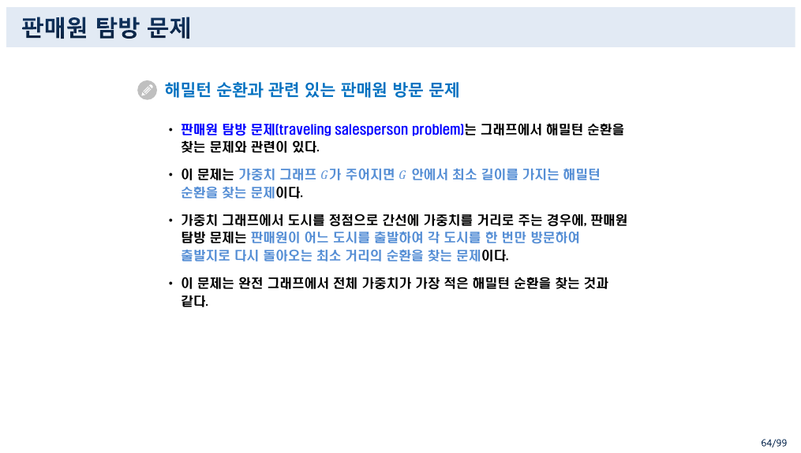

64쪽이 그 어려움을 문제로 정식화한다.

> **판매원 탐방 문제**(traveling salesperson problem)는 그래프에서 해밀턴 순환을 찾는 문제와 관련이 있다.
> 이 문제는 가중치 그래프 $G$가 주어지면 $G$ 안에서 **최소 길이를 가지는 해밀턴 순환**을 찾는 문제이다.
> 이 문제는 **완전 그래프**에서 전체 가중치가 가장 적은 해밀턴 순환을 찾는 것과 같다.

마지막 줄이 왜 44쪽의 완전 그래프가 필요했는지를 회수한다. **완전 그래프에서는 해밀턴 순환이 반드시 존재한다** — 모든 정점이 모든 정점과 이어져 있으니 아무 순서로나 돌면 된다. 그러므로 TSP에서는 **존재 여부가 아니라 최솟값**만 문제가 되고, $K_n$의 해밀턴 순환 개수는 $(n-1)!/2$개다.

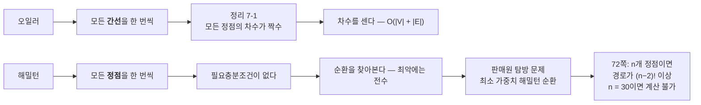

72쪽이 그 계산량을 숫자로 못 박는다 — *"$n$개의 정점들이 있을 때 정점 $a$로부터 정점 $b$로의 경로는 $(n-2)!$ 이상이 존재하므로 만일 $n = 30$일 경우에 경로를 컴퓨터로 계산한다고 하더라도 엄청난 시간을 요구할 것이다."* $(30-2)! = 28!$은 $3 \times 10^{29}$가 넘는다. 그 벽 앞에서 다익스트라가 등장하는 것이 14번 노트의 시작이다.

---

## 5. 열 개의 이름, 네 개의 회수

이 묶음이 붙인 이름 중 나중에 실제로 쓰이는 것은 넷뿐이다.

| 이름 | 어디서 회수되는가 |
| --- | --- |
| **완전 그래프 $K_n$** | 64쪽 TSP, 그리고 $K_5$가 15번 노트의 쿠라토프스키 정리에 |
| **완전 이분 그래프 $K_{3,3}$** | 91쪽의 대표적 비평면 그래프 |
| **순환 그래프 $C_n$** | 95쪽의 착색 수 — 짝수 순환은 2, 홀수 순환은 3 |
| **스패닝 그래프** | 16번 노트의 스패닝 트리 |

나머지 — 준동형 그래프, 희소·밀집 그래프, 바퀴 그래프, 개경로·고유 경로 — 는 **이 파일에서 한 번씩만 나오고 끝난다.** 용어집을 통째로 옮겨 온 흔적이고, 11번 노트에서 본 *"There is no standard terminology"*의 다른 얼굴이다 — **표준이 없으니 여러 책의 이름을 다 실어 둔다.**

---

## 다음으로

- **14번 노트** — 66~82쪽의 DFS·BFS·다익스트라. TSP의 벽을 피해 가는 길.
- **15번 노트** — $K_5$와 $K_{3,3}$이 주인공이 되는 평면 그래프 단원.
- **11번 노트** — 이 노트가 쓰는 차수와 악수 정리.

---

## 근거 자료

`5 그래프.pdf` 슬라이드 37~65(PDF 19~33쪽).

| 슬라이드 | 내용 |
| --- | --- |
| **37~38** | **Path — 개경로·루프·고유 경로·순환 (「루프」가 7쪽의 loop와 충돌)** |
| **39~40** | **정의 7-6 단순 경로와 네 개의 예, 예제 7-6 지하철 노선도** |
| 41~43 | Connect, **Strongly Connected와 강연결 성분(partition)** |
| **44** | **완전 그래프 $K_n$ — $n(n-1)/2$개의 간선, 차수 $n-1$, $K_5$** |
| 45 | 순환 그래프 $C_n$, 바퀴 그래프 $W_n$ |
| **46** | **정규 그래프 — $K_n$은 $(n-1)$차, $C_n$은 2차, $W_3$은 3차** |
| 47~48 | 동형 그래프와 준동형 그래프, 전단사 |
| **49** | **예제 7-10 — 전혀 달라 보이는 두 그림이 동형($K_{3,3}$)** |
| 50 | 정의 7-11 부분 그래프·진부분 그래프·**스패닝 그래프** |
| **51~53** | **이분 그래프와 완전 이분 그래프 $K_{m,n}$, 작업 배정과 결혼 문제** |
| 54~55 | 희소·밀집 그래프의 밀도, 가중치 그래프 |
| 56 | 트리 예고 — connected acyclic, $\lvert E \rvert = \lvert V \rvert - 1$ |
| **57~58** | **오일러 루프·오일러 그래프, 쾨니히스베르크의 다리, 한붓그리기** |
| **59** | **[정리 7-1] 오일러 그래프의 필요충분조건, geeksforgeeks의 세 예** |
| **60** | **해밀턴 소개 (「같은 모서리를 몇 번을 지나든 상관없이」 — 원본 오류)** |
| 61 | 해밀턴의 12면체 수수께끼, [그림 7-7]·[그림 7-8] |
| **62** | **예제 7-16 — 해밀턴 그래프이지만 오일러 그래프는 아니다** |
| 63 | 해밀턴 그래프 추가 예 |
| **64~65** | **판매원 탐방 문제 — 완전 그래프에서 최소 가중치 해밀턴 순환** |

인터랙티브 두 개에 쓴 그래프는 원본 62쪽 예제 7-16의 그래프(정점 6, 간선 9)와 44~53쪽의 공식($K_n$, $C_n$, $W_n$, $K_{m,n}$)이다. 예제 7-16의 차수(2, 5, 2, 3, 3, 3)와 해밀턴 순환(바깥 직사각형)을 파이썬과 자바스크립트로 각각 독립 계산해 슬라이드의 그림·풀이와 대조했고, $K_n$·$K_{m,n}$의 간선 수도 공식과 실제 생성 결과를 맞춰 확인했다. 보충한 것은 **$W_n$이 $n=3$일 때만 정규 그래프**라는 관찰과 $K_n$의 해밀턴 순환 개수 $(n-1)!/2$이며, 본문에서 보충임을 밝혔다.
