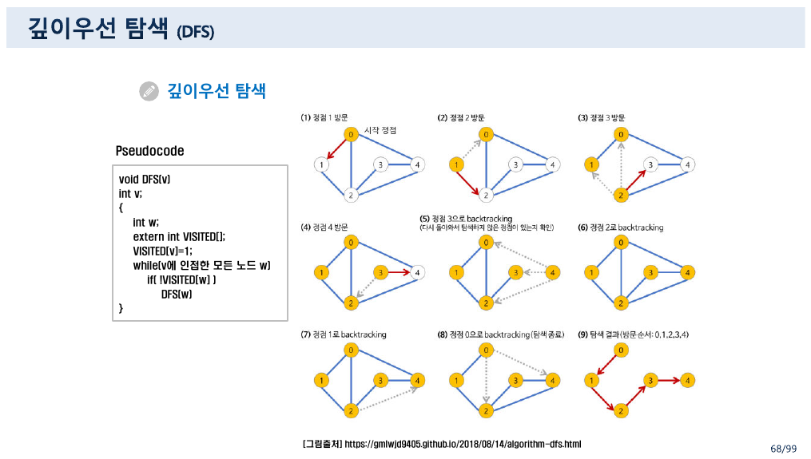
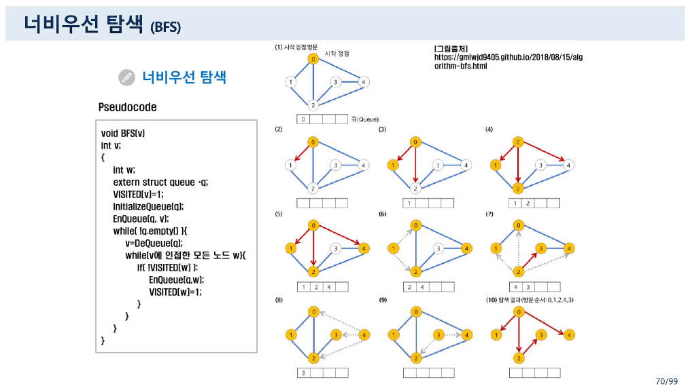
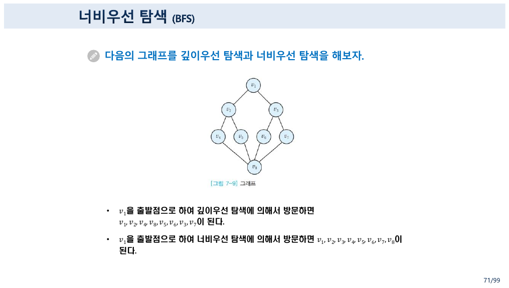
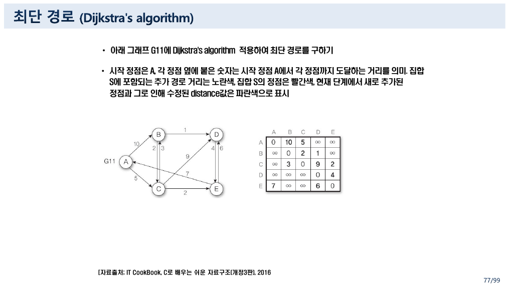
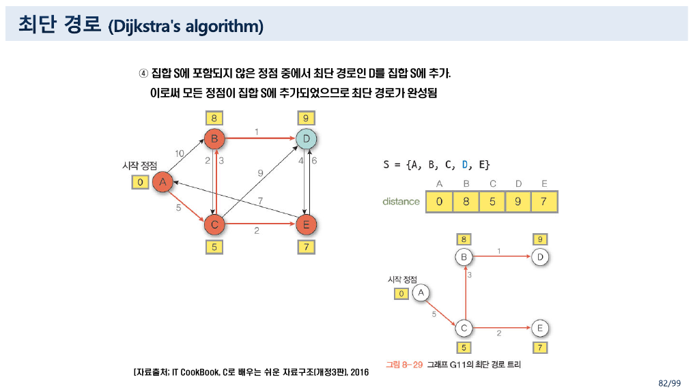
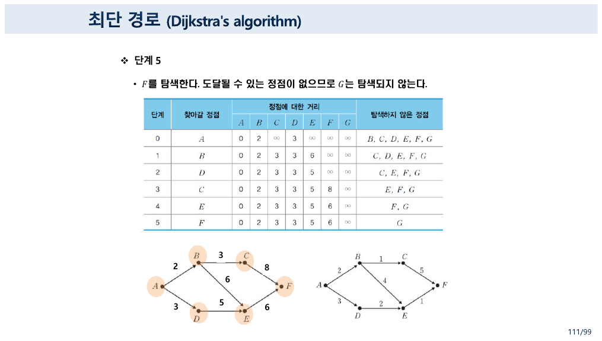
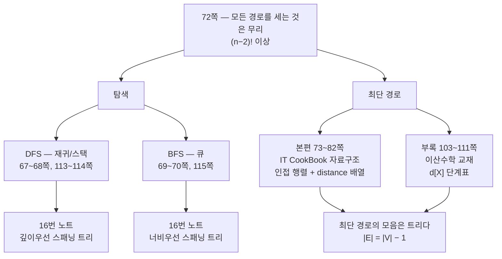

> [!abstract] 이 묶음이 실제로 하는 말
> [13번 노트](./13.%20%EA%B7%B8%EB%9E%98%ED%94%84%EC%97%90%20%EC%9D%B4%EB%A6%84%EC%9D%84%20%EB%B6%99%EC%9D%B4%EB%8A%94%20%EC%97%B4%20%EA%B0%80%EC%A7%80%20%EB%B0%A9%EB%B2%95%20%E2%80%94%20%EA%B7%B8%EB%A6%AC%EA%B3%A0%20%ED%95%9C%20%EB%B2%88%EC%94%A9%EB%A7%8C%20%EC%93%B0%EC%9D%B4%EB%8A%94%20%EC%A0%95%EC%9D%98%EB%93%A4.md)가 판매원 탐방 문제 앞에서 멈췄다. 72쪽이 그 벽의 높이를 적는다.
>
> > $n$개의 정점들이 있을 때 정점 $a$로부터 정점 $b$로의 경로는 **$(n-2)!$ 이상이 존재**하므로 만일 $n = 30$일 경우에 경로를 컴퓨터로 계산한다고 하더라도 엄청난 시간을 요구할 것이다. 그러므로 모든 경우의 경로를 구해서 계산한다는 것은 **무리**이다.
>
> 이 묶음은 그 벽을 두 방향에서 우회한다. **탐색**(DFS·BFS)은 모든 정점을 한 번씩만 방문하고, **다익스트라**는 모든 경로를 세는 대신 거리를 한 번에 하나씩 확정한다.
>
> 그런데 이 파일은 그 두 가지를 **각각 두 번** 가르친다.
>
> | | 본편 (슬라이드 66~82) | 부록 (슬라이드 101~115) |
> | --- | --- | --- |
> | DFS·BFS | 그림 7-9, 정점 8개 · 의사코드 C | geeksforgeeks, 정점 4개 유향 · C++/파이썬 코드 파일명 |
> | 다익스트라 | **IT CookBook 자료구조 교재**, 유향 그래프 G11(정점 5) · **인접 행렬 + `distance` 배열** | **이산수학 교재**, [그림 7-10](정점 7) · **단계별 거리표 $d[X]$** |
>
> 같은 알고리즘인데 **그래프도 다르고 표기도 다르고 표의 모양도 다르다.** 한쪽은 프로그램을 짜려는 사람의 언어(배열·인접 행렬·`weight[u][w]`)이고, 다른 쪽은 정리를 증명하려는 사람의 언어($d[X]$·단계·탐색하지 않은 정점 집합)다.
>
> 그리고 **부록 쪽만 동점 처리를 언급한다** — *"나머지 탐색하지 않은 정점들 중에서 $C$와 $D$가 가장 가깝다. **임의로 $D$를 선택**해서 탐색한다."* 본편에는 그런 문장이 없다.

---

## 1. 탐색 — 모든 정점을 한 번씩

66쪽이 문제를 세운다.

> 무향 그래프 $G = (V, E)$와 $V$에 있는 정점 $v$가 주어져 있을 때, 이 정점 $v$로부터 시작하여 **도달할 수 있는 $G$의 모든 정점을 탐색**하는 것은 매우 중요한 일이다.

「도달할 수 있는」이 [08번 노트](./08.%20%EA%B2%BD%EB%A1%9C%EB%8A%94%20%EA%B3%B1%ED%95%98%EA%B3%A0%20%EC%84%B1%EC%A7%88%EC%9D%80%20%EB%94%B0%EC%A7%84%EB%8B%A4%20%E2%80%94%20%E3%80%8C%EB%AA%A8%EB%93%A0%E3%80%8D%EC%9D%B4%EB%9D%BC%20%EC%8D%A8%EC%95%BC%20%ED%95%A0%20%EC%9E%90%EB%A6%AC%EC%9D%98%20%E3%80%8C%EC%96%B4%EB%96%A4%E3%80%8D.md)의 $R^\infty$다. 차이는 **답을 내는 방식**이다 — [10번 노트](./10.%20%EB%8B%AB%ED%9E%98%EC%9D%80%20%EB%B6%80%EC%A1%B1%ED%95%9C%20%EA%B2%83%EC%9D%84%20%EC%B5%9C%EC%86%8C%EB%A1%9C%20%EC%B1%84%EC%9A%B4%EB%8B%A4%20%E2%80%94%20%EA%B7%B8%EB%A6%AC%EA%B3%A0%20%EB%B6%89%EC%9D%80%20%ED%8E%9C%EC%9C%BC%EB%A1%9C%20%EA%B3%A0%EC%B3%90%20%EC%A0%81%EC%9D%80%20%ED%95%9C%20%EC%A4%84.md)의 와샬은 **모든 쌍**의 도달 가능성을 $O(n^3)$에 구하고, 탐색은 **한 점에서 출발**해 $O(\lvert V \rvert + \lvert E \rvert)$에 끝낸다.



67~68쪽의 깊이우선 탐색은 재귀 네 줄이다.

```c
void DFS(v)
int v;
{
    int w;
    extern int VISITED[];
    VISITED[v]=1;
    while(v에 인접한 모든 노드 w)
        if( !VISITED[w] )
            DFS(w)
}
```



69~70쪽의 너비우선 탐색은 **큐**를 쓴다.

```c
void BFS(v)
{
    VISITED[v]=1;
    InitializeQueue(q);
    EnQueue(q, v);
    while( !q.empty() ){
        v=DeQueue(q);
        while(v에 인접한 모든 노드 w){
            if( !VISITED[w] ):
                EnQueue(q,w);
                VISITED[w]=1;
        }
    }
}
```

두 코드의 차이가 **자료구조 하나**다. DFS는 재귀(= 호출 스택), BFS는 명시적 큐. 스택은 마지막에 넣은 것을 먼저 꺼내므로 **깊이로 파고들고**, 큐는 먼저 넣은 것을 먼저 꺼내므로 **층별로 퍼진다.**

> [!note] 원본 코드의 작은 흠 — 70쪽 BFS
> 안쪽 `if( !VISITED[w] )` 뒤에 **콜론**이 붙어 있고(`if( !VISITED[w] ):`), C의 중괄호와 파이썬의 콜론이 섞여 있다. 또 `EnQueue(q,w); VISITED[w]=1;` 두 줄을 묶는 중괄호가 없어 C로 읽으면 두 번째 줄이 조건 밖으로 나간다. 알고리즘의 뜻은 분명하지만 컴파일되는 코드는 아니다. 이 과목의 의사코드에는 이런 혼용이 자주 있다 — [01/data-structures](../../../01_programming-foundations/data-structures/README.md)의 5주차 자료에서도 `&`(VB 문자열 연산자)와 `break;`가 파이썬 코드에 섞여 있었다.



71쪽이 정점 여덟 개짜리 [그림 7-9]에 둘을 다 적용한다.

> - $v_1$을 출발점으로 하여 **깊이우선 탐색**에 의해서 방문하면 $v_1, v_2, v_4, v_8, v_5, v_6, v_3, v_7$이 된다.
> - $v_1$을 출발점으로 하여 **너비우선 탐색**에 의해서 방문하면 $v_1, v_2, v_3, v_4, v_5, v_6, v_7, v_8$이 된다.

BFS 결과가 **$v_1$부터 $v_8$까지 번호 순**이라는 점이 재미있다. 그림의 번호가 이미 층별로 매겨져 있기 때문이다 — $v_1$이 뿌리, $v_2 \cdot v_3$이 1층, $v_4 \sim v_7$이 2층, $v_8$이 3층.

```html preview h=700px
<div id="tr" style="font-family:system-ui,-apple-system,'Segoe UI',sans-serif;color:var(--foreground);padding:18px">
  <div style="font-size:13px;font-weight:600;margin-bottom:4px">71쪽 [그림 7-9] — 같은 그래프, 두 순서</div>
  <div style="font-size:12px;opacity:.75;margin-bottom:14px">
    v₁에서 출발한다. 한 걸음씩 넘겨 보면 스택과 큐가 왜 다른 순서를 만드는지 보인다.
  </div>
  <div style="display:flex;gap:8px;flex-wrap:wrap;align-items:center;margin-bottom:16px">
    <button class="trb" data-m="dfs">깊이우선 DFS</button>
    <button class="trb" data-m="bfs">너비우선 BFS</button>
    <span style="width:14px"></span>
    <button id="tr-prev" class="trb">◀</button>
    <span id="tr-step" style="font-size:13px;font-weight:700;min-width:70px;text-align:center"></span>
    <button id="tr-next" class="trb">▶</button>
    <button id="tr-play" class="trb">자동</button>
  </div>
  <div style="display:flex;gap:26px;flex-wrap:wrap;align-items:flex-start">
    <svg id="tr-svg" width="330" height="290" viewBox="0 0 330 290" style="border:1px solid var(--border);border-radius:9px;background:var(--card)"></svg>
    <div style="flex:1;min-width:280px">
      <div id="tr-order" style="font-size:13px;line-height:2"></div>
      <div id="tr-ds" style="margin-top:12px;font-size:12.5px;line-height:1.9;padding:10px 12px;border:1px solid var(--border);border-radius:8px;background:var(--card)"></div>
    </div>
  </div>
  <style>
    #tr .trb{background:var(--card);color:var(--foreground);border:1px solid var(--border);
      border-radius:7px;padding:6px 11px;font-size:12px;cursor:pointer;font-family:inherit}
    #tr .trb.sel{border-color:var(--chart-1);box-shadow:inset 0 0 0 1px var(--chart-1)}
    #tr .chip{display:inline-block;border:1px solid var(--border);border-radius:6px;padding:3px 9px;margin:2px;
      font-family:ui-monospace,monospace;font-size:12px;background:var(--card)}
    #tr .chip.done{background:var(--chart-1);color:var(--card);border-color:var(--chart-1);font-weight:700}
  </style>
</div>
<script>
(function(){
  var root=document.getElementById('tr');
  var P={1:[165,30],2:[105,90],3:[225,90],4:[45,150],5:[115,150],6:[215,150],7:[285,150],8:[165,225]};
  var E=[[1,2],[1,3],[2,4],[2,5],[3,6],[3,7],[4,8],[5,8],[6,8],[7,8]];
  var adj={}; for(var i=1;i<=8;i++) adj[i]=[];
  E.forEach(function(e){ adj[e[0]].push(e[1]); adj[e[1]].push(e[0]); });
  for(i=1;i<=8;i++) adj[i].sort(function(a,b){return a-b;});
  function dfs(){
    var seen={}, ord=[], snaps=[];
    (function go(v,stack){
      seen[v]=1; ord.push(v);
      snaps.push({ord:ord.slice(), ds:stack.concat([v]).slice(), cur:v});
      adj[v].forEach(function(w){ if(!seen[w]) go(w,stack.concat([v])); });
    })(1,[]);
    return {ord:ord,snaps:snaps,label:'재귀 호출 스택'};
  }
  function bfs(){
    var seen={1:1}, q=[1], ord=[], snaps=[];
    while(q.length){
      var v=q.shift(); ord.push(v);
      adj[v].forEach(function(w){ if(!seen[w]){ seen[w]=1; q.push(w); } });
      snaps.push({ord:ord.slice(), ds:q.slice(), cur:v});
    }
    return {ord:ord,snaps:snaps,label:'큐'};
  }
  var mode='dfs', run=dfs(), s=0, timer=null;
  function draw(){
    root.querySelectorAll('.trb[data-m]').forEach(function(b){b.classList.toggle('sel',b.dataset.m===mode);});
    var snap=run.snaps[s];
    var visited={}; snap.ord.forEach(function(v){visited[v]=1;});
    var g='';
    E.forEach(function(e){
      g+='<line x1="'+P[e[0]][0]+'" y1="'+P[e[0]][1]+'" x2="'+P[e[1]][0]+'" y2="'+P[e[1]][1]+
         '" stroke="var(--border)" stroke-width="1.6"></line>';
    });
    for(var v=1;v<=8;v++){
      var f = v===snap.cur? 'var(--chart-5)' : (visited[v]? 'var(--chart-1)' : 'var(--card)');
      var c = (v===snap.cur||visited[v])? 'var(--card)' : 'var(--foreground)';
      g+='<circle cx="'+P[v][0]+'" cy="'+P[v][1]+'" r="18" fill="'+f+'" stroke="var(--foreground)" stroke-width="1.5"></circle>';
      g+='<text x="'+P[v][0]+'" y="'+(P[v][1]+4)+'" text-anchor="middle" font-size="12" fill="'+c+'" font-family="ui-monospace,monospace">v'+v+'</text>';
    }
    root.querySelector('#tr-svg').innerHTML=g;
    root.querySelector('#tr-step').textContent=(s+1)+' / '+run.snaps.length;
    var full=run.ord;
    root.querySelector('#tr-order').innerHTML=
      '<b>'+(mode==='dfs'?'깊이우선':'너비우선')+' 방문 순서</b><br>'+
      full.map(function(v,i){ return '<span class="chip'+(i<=s?' done':'')+'">v'+v+'</span>'; }).join('')+
      '<div style="margin-top:8px;opacity:.8;font-size:12px">원본 71쪽이 적은 답: <b>'+
        (mode==='dfs'? 'v1, v2, v4, v8, v5, v6, v3, v7' : 'v1, v2, v3, v4, v5, v6, v7, v8')+'</b></div>';
    root.querySelector('#tr-ds').innerHTML=
      '<b>'+run.label+'</b> : ['+snap.ds.map(function(v){return 'v'+v;}).join(', ')+']<br>'+
      '<span style="opacity:.78">'+(mode==='dfs'
        ? '마지막에 들어간 것부터 되돌아간다 — 그래서 한 갈래를 끝까지 파고든 뒤 backtrack한다.'
        : '먼저 들어간 것부터 꺼낸다 — 그래서 v₁의 이웃을 모두 본 뒤에 그 이웃들의 이웃으로 넘어간다.')+'</span>';
  }
  root.querySelectorAll('.trb[data-m]').forEach(function(b){
    b.onclick=function(){ mode=b.dataset.m; run = mode==='dfs'? dfs() : bfs(); s=0; draw(); };
  });
  root.querySelector('#tr-prev').onclick=function(){ if(s>0){s--;draw();} };
  root.querySelector('#tr-next').onclick=function(){ if(s<run.snaps.length-1){s++;draw();} };
  root.querySelector('#tr-play').onclick=function(){
    if(timer){clearInterval(timer);timer=null;this.textContent='자동';return;}
    this.textContent='멈춤';
    var self=this;
    timer=setInterval(function(){
      if(s<run.snaps.length-1){s++;draw();}
      else {clearInterval(timer);timer=null;self.textContent='자동';}
    },800);
  };
  draw();
})();
</script>
```

두 순서가 정확히 원본 71쪽의 답과 일치한다. **자료구조 하나를 바꾸면 순서가 통째로 바뀐다** — 이것이 [16번 노트](./16.%20%ED%8A%B8%EB%A6%AC%EB%8A%94%20%ED%8A%B9%EB%B3%84%ED%95%9C%20%EA%B4%80%EA%B3%84%EB%8B%A4%20%E2%80%94%20%EA%B7%B8%EB%9F%B0%EB%8D%B0%20%EC%88%9C%ED%9A%8C%20%EA%B2%B0%EA%B3%BC%EB%8A%94%20%ED%8A%B8%EB%A6%AC%EB%A5%BC%20%EB%90%98%EB%8F%8C%EB%A6%AC%EC%A7%80%20%EB%AA%BB%ED%95%9C%EB%8B%A4.md)의 스패닝 트리 두 가지(깊이우선 스패닝 트리와 너비우선 스패닝 트리)가 생기는 이유이기도 하다.

113~115쪽의 부록이 같은 내용을 geeksforgeeks 자료로 다시 한다. 거기서는 **유향 그래프에 자기 고리까지 있는** 예(`0→1, 0→2, 1→2, 2→0, 2→3, 3→3`)를 쓰고, 순환이 있어도 무한 반복에 빠지지 않는 이유를 명시한다.

> The only catch here is, unlike trees, **graphs may contain cycles**, a node may be visited twice. To avoid processing a node more than once, use a boolean **visited array**.

`VISITED[]` 배열 하나가 13번 노트의 순환(cycle)을 무력화한다. 슬라이드는 C++ 코드 파일명(`C07-04-DFS.cpp`)과 파이썬 코드 파일명(`C07-04-DFS.py`)만 적고 내용은 싣지 않는다.

---

## 2. 다익스트라 — 본편의 방식

72쪽이 문제를 세우고 74쪽이 알고리즘의 핵심을 한 문장으로 적는다.

> 시작 정점 $v$에서 정점 $u$까지의 최단 경로 `distance[u]`를 구해 정점 $u$가 집합 $S$에 추가되면 **새로 추가된 정점 $u$에 의해 단축되는 경로가 있는지를 확인**함. 즉, 현재 알고 있는 `distance[w]`를 새로 추가된 정점 $u$를 거쳐서 가는 `distance[u]+weight[u][w]`를 계산한 경로와 비교해 경로가 단축되면 `distance[w]`를 단축된 경로값으로 수정함

**확정과 완화.** 한 정점을 확정하고, 그 정점을 거쳐 가면 더 짧아지는 곳들을 고친다. 10번 노트의 플로이드-와샬이 **경유지 $k$를 바깥 반복문으로** 돌린 것과 대비된다 — 다익스트라는 경유지를 **가까운 순서대로** 하나씩 연다.

75쪽이 자료구조를 못 박는다.

> **가중치 인접 행렬** — 그래프에서 사용한 인접 행렬과 같은 형태의 2차원 배열, 두 정점 사이에 간선이 없으면 **0이 아니라 $\infty$(무한대)값**이 저장되어 있다고 가정.

**0이 아니라 $\infty$**라는 단서가 중요하다. [11번 노트](./11.%20%EA%B7%B8%EB%9E%98%ED%94%84%EC%9D%98%20%EC%A0%95%EC%9D%98%EA%B0%80%20%EC%84%B8%20%EB%B2%88%20%EB%8A%98%EC%96%B4%EB%82%9C%EB%8B%A4%20%E2%80%94%20%EA%B7%B8%EB%A6%AC%EA%B3%A0%20%ED%91%9C%ED%98%84%EC%9D%B4%20%EA%B7%B8%20%EB%8A%98%EC%96%B4%EB%82%A8%EC%9D%84%20%ED%9D%A1%EC%88%98%ED%95%9C%EB%8B%A4.md)의 인접 행렬에서 0은 「간선 없음」이었는데, 가중치가 붙으면 0이 「거리 0」이라는 뜻이 되어 버리기 때문이다. **같은 자리에 같은 기호를 쓰면 뜻이 충돌한다.**



77쪽의 $G_{11}$은 **유향** 가중 그래프다. 인접 행렬이 대칭이 아니라는 점에서 바로 확인된다 — $A \to B$는 10인데 $B \to A$는 $\infty$이고, $C \to B$는 3인데 $B \to C$는 2다.

$$\text{weight} = \begin{array}{c|ccccc} & A & B & C & D & E \\ \hline A & 0 & 10 & 5 & \infty & \infty \\ B & \infty & 0 & 2 & 1 & \infty \\ C & \infty & 3 & 0 & 9 & 2 \\ D & \infty & \infty & \infty & 0 & 4 \\ E & 7 & \infty & \infty & 6 & 0 \end{array}$$

같은 쪽이 색 규칙까지 정해 둔다 — *"집합 $S$에 포함되는 추가 경로 거리는 **노란색**, 집합 $S$의 정점은 **빨간색**, 현재 단계에서 새로 추가된 정점과 그로 인해 수정된 distance값은 **파란색**."*



82쪽의 최종 결과다.

$$S = \{A,\, B,\, C,\, D,\, E\}, \qquad \texttt{distance} = [\,0,\ 8,\ 5,\ 9,\ 7\,]$$

그리고 [그림 8-29]가 **최단 경로 트리**를 그린다 — $A \to C$(5), $C \to B$(3), $B \to D$(1), $C \to E$(2). 네 개의 간선이 다섯 정점을 잇는다. 13번 노트의 56쪽이 적어 둔 $\lvert E \rvert = \lvert V \rvert - 1$이 여기서 확인된다 — **최단 경로의 모음은 트리다.**

### 두 다익스트라를 나란히 돌려 보기

```html preview h=740px
<div id="dij" style="font-family:system-ui,-apple-system,'Segoe UI',sans-serif;color:var(--foreground);padding:18px">
  <div style="font-size:13px;font-weight:600;margin-bottom:4px">같은 알고리즘, 두 자료 — 단계별 실행</div>
  <div style="font-size:12px;opacity:.75;margin-bottom:14px">
    본편(77~82쪽)의 유향 그래프 G11과 부록(104~111쪽)의 [그림 7-10]을 같은 코드로 돌린다. 표의 숫자는 원본 슬라이드와 한 칸씩 대조했다.
  </div>
  <div style="display:flex;gap:8px;flex-wrap:wrap;align-items:center;margin-bottom:16px">
    <button class="db" data-g="g11">본편 — G11 (유향, 정점 5)</button>
    <button class="db" data-g="f710">부록 — 그림 7-10 (정점 7)</button>
    <span style="width:14px"></span>
    <button id="d-prev" class="db">◀</button>
    <span id="d-step" style="font-size:13px;font-weight:700;min-width:64px;text-align:center"></span>
    <button id="d-next" class="db">▶</button>
  </div>
  <div id="d-msg" style="font-size:12.5px;line-height:1.85;margin-bottom:14px;padding:10px 12px;border:1px solid var(--border);border-radius:8px;background:var(--card)"></div>
  <table id="d-tbl" style="border-collapse:collapse;font-size:12.5px;font-family:ui-monospace,monospace"></table>
  <div id="d-final" style="margin-top:14px;font-size:12.5px;line-height:1.85"></div>
  <style>
    #dij .db{background:var(--card);color:var(--foreground);border:1px solid var(--border);
      border-radius:7px;padding:6px 11px;font-size:12px;cursor:pointer;font-family:inherit}
    #dij .db.sel{border-color:var(--chart-1);box-shadow:inset 0 0 0 1px var(--chart-1)}
    #dij td,#dij th{border:1px solid var(--border);padding:5px 11px;text-align:center}
    #dij th{opacity:.72;font-weight:600}
    #dij td.fixed{background:var(--chart-1);color:var(--card);font-weight:700}
    #dij td.upd{background:var(--chart-5);color:var(--card);font-weight:700}
  </style>
</div>
<script>
(function(){
  var root=document.getElementById('dij');
  var INF=Infinity;
  var G={
    g11:{ V:['A','B','C','D','E'],
      W:[[0,10,5,INF,INF],[INF,0,2,1,INF],[INF,3,0,9,2],[INF,INF,INF,0,4],[7,INF,INF,6,0]],
      src:'본편 77쪽 — IT CookBook 자료구조 교재의 유향 가중 그래프',
      ans:'원본 82쪽: distance = [0, 8, 5, 9, 7], S에 들어간 순서 A → C → E → B → D'},
    f710:{ V:['A','B','C','D','E','F','G'],
      W:(function(){
        var n=7,W=[];for(var i=0;i<n;i++){W.push([]);for(var j=0;j<n;j++)W[i].push(i===j?0:INF);}
        function e(a,b,w){W[a][b]=w;W[b][a]=w;}
        e(0,1,2); e(0,3,3); e(1,2,1); e(1,4,4); e(3,4,2); e(2,5,5); e(4,5,1);
        return W;})(),
      src:'부록 104쪽 — 이산수학 교재의 [그림 7-10]. G는 간선이 없는 고립 정점이다',
      ans:'원본 111쪽: d = [0, 2, 3, 3, 5, 6, ∞], 찾아간 순서 A → B → D → C → E → F'}
  };
  var cur='g11', steps=[], s=0;
  function build(){
    var g=G[cur], n=g.V.length;
    var d=g.W[0].slice(), S=[0], done={0:1};
    steps=[{d:d.slice(), S:S.slice(), pick:0, upd:[], note:'초기값 — 시작 정점 A를 S에 넣고, A에서 각 정점까지의 가중치를 distance의 초기값으로 둔다.'}];
    for(var k=1;k<n;k++){
      var best=-1;
      for(var i=0;i<n;i++) if(!done[i] && d[i]<INF && (best<0 || d[i]<d[best])) best=i;
      if(best<0){
        steps.push({d:d.slice(),S:S.slice(),pick:-1,upd:[],note:'남은 정점에 도달할 수 없다 — 거리 ∞. 여기서 멈춘다.'});
        break;
      }
      var tie=[]; for(i=0;i<n;i++) if(!done[i] && d[i]===d[best]) tie.push(g.V[i]);
      done[best]=1; S.push(best);
      var upd=[];
      for(i=0;i<n;i++){
        if(!done[i] && g.W[best][i]<INF && d[best]+g.W[best][i] < d[i]){
          d[i]=d[best]+g.W[best][i]; upd.push(i);
        }
      }
      steps.push({d:d.slice(),S:S.slice(),pick:best,upd:upd,
        note:'집합 S에 포함되지 않은 정점 중 최단 거리인 <b>'+g.V[best]+'</b>('+d[best]+')를 S에 추가한다.'+
             (tie.length>1? ' <span style="color:var(--chart-5)"><b>동점</b>: '+tie.join(', ')+' — 어느 것을 골라도 최종 답은 같다. 부록 108쪽은 이 자리에서 “임의로 D를 선택해서 탐색한다”고 명시한다.</span>':'')+
             (upd.length? '<br>'+g.V[best]+'를 거쳐 단축되는 경로: '+upd.map(function(i){return g.V[i]+' → '+d[i];}).join(', ') : '<br>단축되는 경로가 없다.')});
    }
  }
  function draw(){
    root.querySelectorAll('.db[data-g]').forEach(function(b){b.classList.toggle('sel',b.dataset.g===cur);});
    var g=G[cur], st=steps[s];
    var h='<tr><th>단계</th><th>찾아갈 정점</th>'+g.V.map(function(v){return '<th>'+v+'</th>';}).join('')+'<th>탐색하지 않은 정점</th></tr>';
    for(var k=0;k<=s;k++){
      var t=steps[k];
      var rest=g.V.filter(function(_,i){return t.S.indexOf(i)<0;});
      h+='<tr><th>'+k+'</th><th>'+(t.pick>=0? g.V[t.pick] : '—')+'</th>';
      for(var i=0;i<g.V.length;i++){
        var cls = t.S.indexOf(i)>=0? 'fixed' : (k===s && t.upd.indexOf(i)>=0? 'upd':'');
        h+='<td class="'+cls+'">'+(t.d[i]===INF?'∞':t.d[i])+'</td>';
      }
      h+='<td style="font-family:inherit">'+(rest.join(', ')||'—')+'</td></tr>';
    }
    root.querySelector('#d-tbl').innerHTML=h;
    root.querySelector('#d-step').textContent='단계 '+s;
    root.querySelector('#d-msg').innerHTML='<b>'+g.src+'</b><br>'+st.note;
    root.querySelector('#d-final').innerHTML = s===steps.length-1
      ? '<b>완료.</b> '+g.ans+' — 위 표와 일치한다.'
      : '<span style="opacity:.7">▶ 을 눌러 다음 단계로.</span>';
  }
  root.querySelectorAll('.db[data-g]').forEach(function(b){
    b.onclick=function(){cur=b.dataset.g;build();s=0;draw();};
  });
  root.querySelector('#d-prev').onclick=function(){ if(s>0){s--;draw();} };
  root.querySelector('#d-next').onclick=function(){ if(s<steps.length-1){s++;draw();} };
  build(); draw();
})();
</script>
```

---

## 3. 부록의 방식 — 같은 알고리즘, 다른 문법

![슬라이드 104 — [그림 7-10] 가중치 그래프](../assets/ch05-s104-그림7-10-가중치-그래프.png)

101쪽에 「부록」 표지가 나오고, 102쪽이 **`<교재 내용>`**이라 적는다. 그 뒤 103~111쪽이 다익스트라를 처음부터 다시 가르친다.

첫 문단(103쪽)은 본편 72쪽과 **글자 하나 다르지 않다.** 같은 문장을 두 번 실었다. 그런데 예제부터 완전히 갈라진다.

| | 본편 | 부록 |
| --- | --- | --- |
| 그래프 | $G_{11}$ — 유향, 정점 5 | [그림 7-10] — 정점 7(간선 7개, $G$는 고립) |
| 자료구조 | 가중치 **인접 행렬** + `distance` 배열 | 거리 표기 $d[X]$ + 단계표 |
| 표의 모양 | `distance` 배열 한 줄이 매 단계 갱신 | 단계 · 찾아갈 정점 · 정점별 거리 · **탐색하지 않은 정점** |
| 출처 | IT CookBook, 『C로 배우는 쉬운 자료구조』 | 이산수학 교재 |
| 동점 처리 | 언급 없음 | **"임의로 $D$를 선택해서 탐색한다"** |



부록의 단계표가 본편에 없는 열을 하나 갖는다 — **「탐색하지 않은 정점」**. 매 단계 그 집합이 하나씩 줄어드는 것이 눈에 보이고, 마지막 줄에 $G$ 하나만 남는다.

| 단계 | 찾아갈 정점 | $A$ | $B$ | $C$ | $D$ | $E$ | $F$ | $G$ | 탐색하지 않은 정점 |
| :-: | :-: | :-: | :-: | :-: | :-: | :-: | :-: | :-: | --- |
| 0 | $A$ | 0 | 2 | ∞ | 3 | ∞ | ∞ | ∞ | B, C, D, E, F, G |
| 1 | $B$ | 0 | 2 | 3 | 3 | 6 | ∞ | ∞ | C, D, E, F, G |
| 2 | $D$ | 0 | 2 | 3 | 3 | **5** | ∞ | ∞ | C, E, F, G |
| 3 | $C$ | 0 | 2 | 3 | 3 | 5 | 8 | ∞ | E, F, G |
| 4 | $E$ | 0 | 2 | 3 | 3 | 5 | **6** | ∞ | F, G |
| 5 | $F$ | 0 | 2 | 3 | 3 | 5 | 6 | ∞ | G |

$F$까지의 최단 거리가 **8에서 6으로 내려가는** 자리(단계 3 → 4)가 이 표의 핵심이다. $C$를 거쳐 가면 $3 + 5 = 8$인데, $E$를 거쳐 가면 $5 + 1 = 6$이다. **한 번 적은 값이 최종값이 아니다** — 확정되기 전까지는 계속 깎일 수 있다. 104쪽이 미리 답을 적어 두었다 — *"$A$부터 $F$까지의 최단 경로의 가중치는 **6**이며 정점 $A, D, E, F$로 구성됨."*

그리고 $G$는 끝까지 $\infty$다. 108쪽의 단계 5가 그 사실을 적는다 — *"$F$를 탐색한다. 도달될 수 있는 정점이 없으므로 $G$는 탐색되지 않는다."* [그림 7-10]에서 $G$는 오른쪽 위에 **간선 없는 점 하나**로 찍혀 있다. 11번 노트의 **고립 정점**이 최단 경로 문제에서 어떤 값을 받는지를 보여 주기 위해 일부러 넣은 정점이다.

> [!note] 동점이 생기는 자리 — 부록만 언급한다
> 부록 108쪽(단계 2).
>
> > 나머지 탐색하지 않은 정점들 중에서 **$C$와 $D$가 가장 가깝다.** 임의로 $D$를 선택해서 탐색한다.
>
> 단계 1을 마친 뒤 $d[C] = 3$이고 $d[D] = 3$으로 같다. 알고리즘은 「가장 가까운 정점」을 고르라고만 하므로 둘 중 어느 쪽을 골라도 된다. 그리고 **최종 답은 같다** — 위 인터랙티브에서 확인할 수 있다.
>
> 본편은 $G_{11}$에서 동점이 생기지 않도록 가중치를 잡았기 때문에 이 문제를 만나지 않는다. **두 자료를 다 읽어야 알고리즘의 이 빈틈이 보인다.**

같은 111쪽에 눈을 헷갈리게 하는 자리가 하나 더 있다.

> [!note] 보충 — 111쪽 왼쪽 그림의 숫자는 가중치가 아니다
> 111쪽에는 그래프가 두 개 나란히 있다. 오른쪽(흑백)은 [그림 7-10]의 **가중치**(2, 1, 4, 3, 2, 5, 1)를 적은 원본이고, 왼쪽(주황 강조)의 숫자는 **2, 3, 3, 6, 5, 6, 8**이다.
>
> 이 숫자들은 가중치가 아니라 **각 정점까지의 누적 거리**($d[B] = 2$, $d[C] = 3$, $d[D] = 3$, $d[E] = 5$, $d[F] = 6$, 그리고 중간에 계산되었다가 밀려난 $d[E] = 6$과 $d[F] = 8$)다. 두 그림이 같은 자리에 같은 방식으로 숫자를 달고 있어 나란히 보면 헷갈린다. 왼쪽은 **결과 그림**, 오른쪽은 **입력 그림**이다.

---

## 4. 왜 두 번인가



두 번 가르치는 것이 실수는 아니다. **같은 알고리즘을 두 학문의 언어로 한 번씩 보여 주는 것**에 가깝다.

- **자료구조의 언어** — `weight[u][w]`, `distance[]`, 2차원 배열, 무한대 값을 넣는 초기화 규칙. *짜야 하는 사람*의 관심사다.
- **이산수학의 언어** — $d[X]$, 「탐색하지 않은 정점」 집합, 단계별 표, 동점의 임의 선택. *증명해야 하는 사람*의 관심사다.

[02번 노트](./02.%20%ED%95%9C%20%ED%8C%8C%EC%9D%BC%EC%97%90%20%EC%B1%85%20%EB%91%90%20%EA%B6%8C%20%E2%80%94%20%EC%9D%98%EB%AF%B8%EB%A1%9C%20%EA%B0%80%EB%A5%B4%EC%B9%98%EB%8A%94%20%EB%85%BC%EB%A6%AC%EC%99%80%20%ED%8C%8C%EC%8B%B1%EC%9C%BC%EB%A1%9C%20%EA%B0%80%EB%A5%B4%EC%B9%98%EB%8A%94%20%EB%85%BC%EB%A6%AC.md)부터 이 과목에서 반복된 「한 파일에 책 두 권」이 여기서는 **의도적인 병렬 배치**로 보인다. 다만 그 병렬이 명시되지 않아서, 슬라이드를 순서대로 읽으면 103쪽에서 *"어? 아까 봤는데"* 하게 된다. 102쪽의 `<교재 내용>`이라는 네 글자가 그 안내의 전부다.

72쪽이 덧붙인 한 줄이 이 묶음의 마무리다.

> Dijkstra는 네덜란드 사람으로 이론 물리학자이며 **1972년 ACM으로부터 그 유명한 튜링(Alan Turing) 상**을 수상했다. 튜링 상은 컴퓨터 분야에서의 노벨상이라고 불린다.

$(n-2)!$짜리 문제를 $O(n^2)$으로 끌어내린 일이 튜링상을 받을 만한 일이었다는 뜻이다.

---

## 다음으로

- **[15번 노트](./15.%20%ED%8F%89%EB%A9%B4%EA%B3%BC%20%EC%83%89%20%E2%80%94%20%EA%B7%B8%EB%A6%B4%20%EC%88%98%20%EC%9E%88%EB%8A%94%EA%B0%80%2C%20%EB%AA%87%20%EA%B0%80%EC%A7%80%20%EC%83%89%EC%9D%B4%EB%A9%B4%20%EB%90%98%EB%8A%94%EA%B0%80.md)** — 83~100쪽의 평면 그래프와 정점 착색. 여기서도 알고리즘이 두 번 나온다.
- **16번 노트** — DFS와 BFS가 각각 스패닝 트리를 만든다.
- **10번 노트** — 플로이드-와샬. 모든 쌍을 한꺼번에 구하는 다른 길.

---

## 근거 자료

`5 그래프.pdf` 슬라이드 66~82(PDF 33~41쪽)와 101~115(PDF 51~58쪽).

| 슬라이드 | 내용 |
| --- | --- |
| 66 | 그래프의 탐색 — 도달할 수 있는 모든 정점, DFS와 BFS |
| 67~**68** | **깊이우선 탐색의 설명과 의사코드** |
| 69~**70** | **너비우선 탐색의 설명과 의사코드 (C와 파이썬 문법 혼용)** |
| **71** | **[그림 7-9]에 DFS와 BFS를 적용한 두 순서** |
| 72 | 최단 경로 문제, $(n-2)!$의 벽, 다익스트라와 튜링상 |
| 73~74 | 다익스트라의 아이디어 — 확정과 완화 |
| 75~76 | **가중치 인접 행렬 — 간선이 없으면 0이 아니라 $\infty$** |
| **77** | **그래프 $G_{11}$과 가중치 인접 행렬, 색 규칙** |
| 78~81 | 단계 0~③ — 초기 상태, C·E·B를 차례로 $S$에 추가 |
| **82** | **단계 ④ — distance = [0, 8, 5, 9, 7], [그림 8-29] 최단 경로 트리** |
| 101~102 | 부록 표지, `<교재 내용>` |
| 103 | 최단 경로 — **본편 72쪽과 같은 문장** |
| **104** | **[그림 7-10] 가중치 그래프 — A부터 F까지 최단 거리 6, 고립 정점 G** |
| 105~110 | 단계 0~4 — $d[X]$ 표기, **108쪽 "임의로 D를 선택해서 탐색한다"** |
| **111** | **단계 5의 전체 단계표와 결과 그림 두 개** |
| 112 | DFS/BFS 표지 (geeksforgeeks 출처) |
| 113~115 | DFS·BFS 재설명 — 순환이 있는 유향 그래프, `visited` 배열, C++·파이썬 코드 파일명 |

인터랙티브 두 개는 원본의 그래프를 그대로 쓴다. 탐색기는 71쪽 [그림 7-9]의 간선 열 개를, 다익스트라 비교기는 77쪽 $G_{11}$의 인접 행렬과 104쪽 [그림 7-10]의 간선 일곱 개를 쓴다. 두 알고리즘을 파이썬으로도 독립 실행해 **71쪽의 두 방문 순서**, **82쪽의 distance 배열 [0, 8, 5, 9, 7]과 $S$ 추가 순서 A·C·E·B·D**, **111쪽 단계표의 여섯 줄 전부**를 한 칸씩 대조했고 모두 일치했다. 보충한 것은 111쪽 왼쪽 그림의 숫자가 가중치가 아니라 누적 거리라는 관찰이며, 본문에서 보충임을 밝혔다.
