> [!abstract] 이 묶음이 실제로 하는 말
> 마지막 두 절(7.3 평면 그래프, 7.4 정점의 착색)은 같은 모양의 질문을 두 번 던진다. **어떤 그래프가 조건을 만족하는가, 그리고 최소 얼마면 되는가.**
>
> | | 질문 | 답을 주는 도구 |
> | --- | --- | --- |
> | **7.3 평면** | 교점 없이 그릴 수 있는가 | **오일러 공식 $v - e + f = 2$** → 간선 수의 상한 → $K_5$와 $K_{3,3}$의 비평면성 → **쿠라토프스키 정리** |
> | **7.4 착색** | 몇 가지 색이면 되는가 | 착색 수 $x(G)$ → **웰치-포웰 알고리즘** |
>
> 왼쪽은 **완결된다.** 오일러 공식이 부등식을 낳고, 그 부등식이 $K_{3,3}$을 반증하며, 쿠라토프스키가 1930년에 필요충분조건까지 내놓았다 — *"$K_5$나 $K_{3,3}$의 세분(subdivision)을 부분 그래프로 갖지 않을 때, 그리고 오직 그때만 평면 그래프다."*
>
> 오른쪽은 **완결되지 않는다.** 착색 수를 구하는 판정식이 없고, 웰치-포웰은 **탐욕 알고리즘**이다. 그런데 96쪽이 이렇게 적는다 — *"Welsh Powell algorithm that gives the **minimum colors we need.** This algorithm is also used to **find the chromatic number** of a graph. This is an iterative **greedy** approach."* 같은 문단이 「최소를 준다」와 「탐욕적이다」를 나란히 말한다. **둘은 동시에 참일 수 없다.**
>
> 여기에 90쪽의 계산 하나가 어긋나 있다. 세 예 중 세 번째가 $v = 6,\ e = 9$인데 *"$e > 3(v-2)$"*라고 적혀 있다. $3(6-2) = 12$이므로 $9 > 12$는 거짓이다.
>
> [13번 노트](./13.%20%EA%B7%B8%EB%9E%98%ED%94%84%EC%97%90%20%EC%9D%B4%EB%A6%84%EC%9D%84%20%EB%B6%99%EC%9D%B4%EB%8A%94%20%EC%97%B4%20%EA%B0%80%EC%A7%80%20%EB%B0%A9%EB%B2%95%20%E2%80%94%20%EA%B7%B8%EB%A6%AC%EA%B3%A0%20%ED%95%9C%20%EB%B2%88%EC%94%A9%EB%A7%8C%20%EC%93%B0%EC%9D%B4%EB%8A%94%20%EC%A0%95%EC%9D%98%EB%93%A4.md)에서 붙여 둔 이름 $K_5$·$K_{3,3}$·$C_n$이 전부 여기서 회수된다.

---

## 1. 교점 — 그래프가 아니라 그림의 성질

84쪽이 시작점을 잡는다.

> 평면상에 그래프를 그릴 때, 정점 이외의 점에서 간선을 서로 교차해서 그릴 수 있어야 편리하다. 이때 교차되는 점을 **교점**(cross over)이라 하고 교차되는 간선을 **교선**(cross line)이라고 한다.

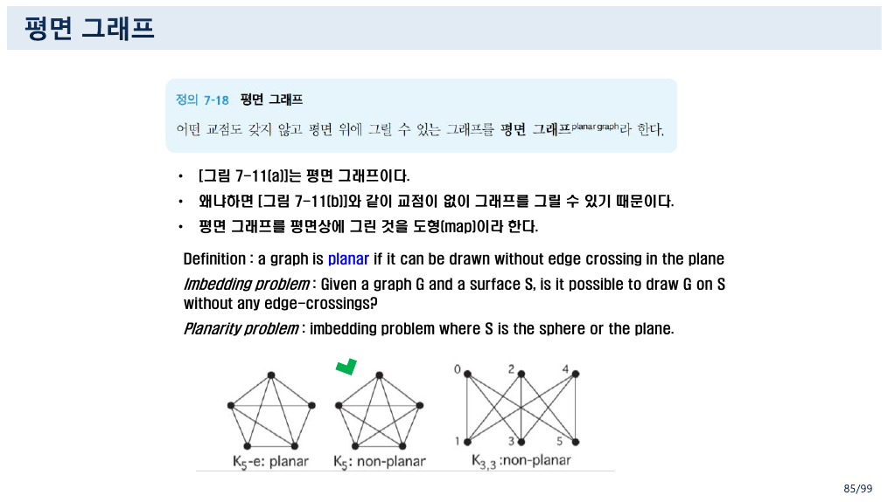

85쪽이 결정적인 구분을 한다.

> - [그림 7-11(a)]는 **평면 그래프**이다.
> - 왜냐하면 [그림 7-11(b)]와 같이 **교점이 없이 그래프를 그릴 수 있기 때문**이다.
> - 평면 그래프를 평면상에 그린 것을 **도형(map)**이라 한다.

**교점이 있느냐 없느냐는 그림의 성질이고, 평면 그래프냐 아니냐는 그래프의 성질이다.** (a)에는 교점이 있지만 (b)처럼 다시 그릴 수 있으므로 평면 그래프다. 13번 노트에서 본 동형 그래프의 교훈 — **그림은 그래프가 아니다** — 이 여기서 정의의 뼈대가 된다.

같은 쪽이 영어로 문제를 일반화한다.

> **Imbedding problem**: Given a graph $G$ and a surface $S$, is it possible to draw $G$ on $S$ without any edge-crossings?
> **Planarity problem**: imbedding problem where $S$ is the **sphere or the plane**.

곡면을 바꾸면 답이 달라진다는 뜻이다. $K_{3,3}$은 평면에는 못 그리지만 **원환면(torus)에는 그릴 수 있다.** 원본은 그 사실까지 가지 않지만, `sphere or the plane`을 한 줄로 묶어 둔 것이 그 가능성을 암시한다.

---

## 2. 오일러 공식 — 면을 세면 간선의 상한이 나온다

87~88쪽이 **다각형 그래프**와 **면(face)**을 정의한다.

> 다각형 그래프 $G$에 의해서 정의되는 영역들을 $G$의 **면(face)**이라 하고, $G$의 모든 면을 포함하고 있는 다각형을 $G$의 **최대 순환(maximal cycle)**이라 한다.

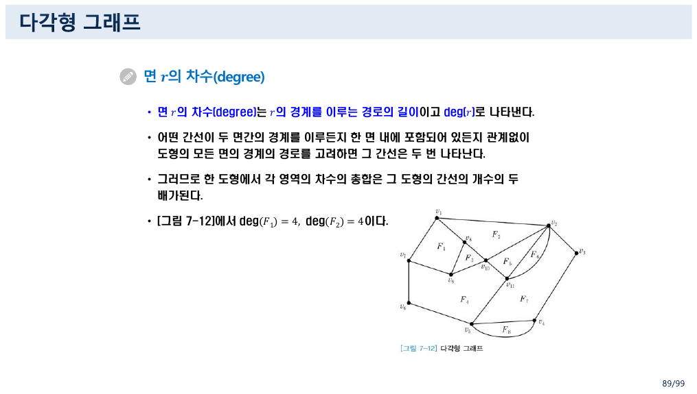

89쪽이 면에도 차수를 준다.

> 면 $r$의 차수는 $r$의 **경계를 이루는 경로의 길이**이고 $\deg(r)$로 나타낸다.
> 어떤 간선이 두 면간의 경계를 이루든지 한 면 내에 포함되어 있든지 관계없이 도형의 모든 면의 경계의 경로를 고려하면 **그 간선은 두 번 나타난다.**
> 그러므로 한 도형에서 각 영역의 **차수의 총합은 그 도형의 간선의 개수의 두 배**가 된다.

$$\sum_{r} \deg(r) = 2\lvert E \rvert$$

[11번 노트](./11.%20%EA%B7%B8%EB%9E%98%ED%94%84%EC%9D%98%20%EC%A0%95%EC%9D%98%EA%B0%80%20%EC%84%B8%20%EB%B2%88%20%EB%8A%98%EC%96%B4%EB%82%9C%EB%8B%A4%20%E2%80%94%20%EA%B7%B8%EB%A6%AC%EA%B3%A0%20%ED%91%9C%ED%98%84%EC%9D%B4%20%EA%B7%B8%20%EB%8A%98%EC%96%B4%EB%82%A8%EC%9D%84%20%ED%9D%A1%EC%88%98%ED%95%9C%EB%8B%A4.md)의 악수 정리와 **글자 하나 다르지 않다.** 정점 대신 면을 세었을 뿐이고, 논증도 같다 — 간선 하나가 두 번 세어진다. 그래서 이 정리에는 「면 버전 악수 정리」라는 이름이 붙기도 한다.

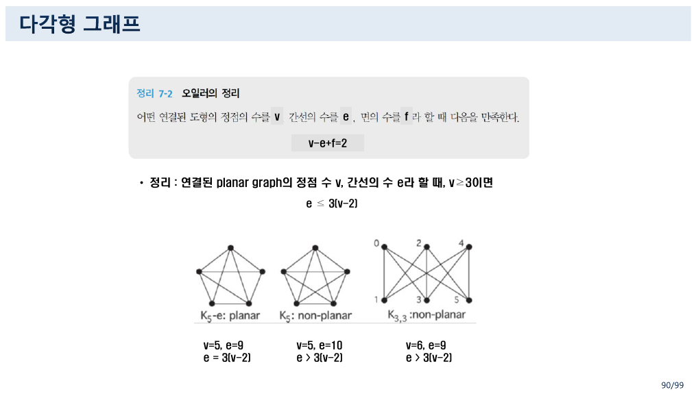

90쪽의 [정리 7-2]가 오일러 공식이다.

$$v - e + f = 2$$

그리고 곧바로 따름정리를 낸다.

> 연결된 planar graph의 정점 수 $v$, 간선의 수 $e$라 할 때, $v \ge 3$이면 $e \le 3(v-2)$

왜 그런가. 각 면의 차수는 최소 3이다(단순 그래프에서 가장 짧은 순환이 삼각형이므로). 그러면 $2e = \sum \deg(r) \ge 3f$이므로 $f \le 2e/3$이고, 이것을 $f = 2 - v + e$에 넣으면

$$2 - v + e \le \frac{2e}{3} \quad\Longrightarrow\quad \frac{e}{3} \le v - 2 \quad\Longrightarrow\quad e \le 3(v-2)$$

**면의 차수 하한이 간선의 개수 상한을 낳는다.** 이 한 줄이 다음 쪽의 비평면성 증명 전체를 떠받친다.

> [!caution] 원본 오류 — 90쪽: 세 번째 예의 부등식이 성립하지 않는다
> 90쪽 아래에 세 그림과 계산이 나란히 있다.
>
> | 그림 | $v$ | $e$ | 원본의 판정 | $3(v-2)$ | 실제 |
> | --- | :-: | :-: | --- | :-: | --- |
> | $K_5 - e$ : planar | 5 | 9 | $e = 3(v-2)$ | 9 | ✓ 맞다 |
> | $K_5$ : non-planar | 5 | 10 | $e > 3(v-2)$ | 9 | ✓ 맞다 ($10 > 9$) |
> | $K_{3,3}$ : non-planar | 6 | 9 | **$e > 3(v-2)$** | **12** | **✗ $9 > 12$은 거짓** |
>
> 셋째 줄이 틀렸다. $K_{3,3}$은 $e \le 3(v-2)$를 **만족하면서도** 비평면 그래프다. 즉 $e \le 3(v-2)$는 **필요조건일 뿐 충분조건이 아니다** — 이 부등식으로는 $K_{3,3}$의 비평면성을 보일 수 없다.
>
> $K_{3,3}$에 맞는 부등식은 따로 있다. $K_{3,3}$은 **이분 그래프**이므로 삼각형이 없고, 따라서 모든 면의 차수가 **3이 아니라 4 이상**이다. 같은 유도를 다시 하면
>
> $$2e \ge 4f \;\Rightarrow\; f \le \frac{e}{2} \;\Rightarrow\; 2 - v + e \le \frac{e}{2} \;\Rightarrow\; e \le 2(v-2) = 8$$
>
> $K_{3,3}$의 간선은 9개이므로 $9 > 8$ — **이제 모순이 나온다.**
>
> 그리고 **바로 다음 쪽인 91쪽이 정확히 그 논증을 한다.**
>
> > $K_{3,3}$이 평면 그래프라면 오일러의 식에 의해 5개의 면을 가져야 한다. $A_1, A_2, A_3$의 정점은 서로 연결하지 않고 $B_1, B_2, B_3$의 정점을 서로 연결되지 않기 때문에 **각 면의 차수가 4 이상**임을 알 수 있다. 따라서 각 면의 차수의 총합이 20 이상이어야 하므로 **10개 이상의 간선**을 가져야 하는데 $K_{3,3}$의 간선을 9개라는 사실과 모순된다.
>
> 91쪽의 논증은 완전히 옳다. 틀린 것은 **90쪽이 그 예를 $3(v-2)$ 부등식 아래에 끼워 넣은 배치**다. 90쪽의 셋째 열은 지우거나 $e \le 2(v-2) = 8$로 고쳐야 한다.

### 직접 세어 보기

```html preview h=700px
<div id="pl" style="font-family:system-ui,-apple-system,'Segoe UI',sans-serif;color:var(--foreground);padding:18px">
  <div style="font-size:13px;font-weight:600;margin-bottom:4px">90~91쪽 — 오일러 공식과 두 개의 상한</div>
  <div style="font-size:12px;opacity:.75;margin-bottom:14px">
    그래프를 고르면 v, e, f와 두 부등식이 함께 계산된다. 삼각형이 있는 그래프에는 e ≤ 3(v−2), 삼각형이 없는(이분) 그래프에는 e ≤ 2(v−2)가 적용된다.
  </div>
  <div style="display:flex;gap:7px;flex-wrap:wrap;margin-bottom:16px" id="pl-btns"></div>
  <div style="display:flex;gap:28px;flex-wrap:wrap;align-items:flex-start">
    <svg id="pl-svg" width="260" height="230" viewBox="0 0 260 230" style="border:1px solid var(--border);border-radius:9px;background:var(--card)"></svg>
    <div style="flex:1;min-width:300px">
      <table id="pl-tbl" style="border-collapse:collapse;font-size:12.5px"></table>
      <div id="pl-note" style="margin-top:13px;font-size:12.5px;line-height:1.9;padding:11px 13px;border:1px solid var(--border);border-radius:8px;background:var(--card)"></div>
    </div>
  </div>
  <style>
    #pl button{background:var(--card);color:var(--foreground);border:1px solid var(--border);
      border-radius:7px;padding:6px 11px;font-size:12px;cursor:pointer;font-family:inherit}
    #pl button.sel{border-color:var(--chart-1);box-shadow:inset 0 0 0 1px var(--chart-1)}
    #pl td,#pl th{border:1px solid var(--border);padding:5px 12px;text-align:left}
    #pl th{opacity:.75;font-weight:600;white-space:nowrap}
    #pl .ok{color:var(--chart-2);font-weight:700}
    #pl .bad{color:var(--chart-5);font-weight:700}
  </style>
</div>
<script>
(function(){
  var root=document.getElementById('pl');
  function ring(k,cx,cy,r){var a=[];for(var i=0;i<k;i++){var t=-Math.PI/2+2*Math.PI*i/k;a.push([cx+r*Math.cos(t),cy+r*Math.sin(t)]);}return a;}
  var cases=[
    {n:'K₅ − e (평면)', V:ring(5,130,115,85), E:(function(){var e=[];for(var i=0;i<5;i++)for(var j=i+1;j<5;j++)e.push([i,j]);e.pop();return e;})(),
     v:5,e:9,f:6,tri:true,planar:true,
     note:'원본이 든 첫째 예. e = 9 = 3(5−2)이므로 상한을 <b>정확히</b> 채운다. 평면에 그리면 면이 f = 2 − 5 + 9 = 6개다.'},
    {n:'K₅ (비평면)', V:ring(5,130,115,85), E:(function(){var e=[];for(var i=0;i<5;i++)for(var j=i+1;j<5;j++)e.push([i,j]);return e;})(),
     v:5,e:10,f:null,tri:true,planar:false,
     note:'간선 하나를 더하면 10 > 9 = 3(v−2)이므로 <b>평면일 수 없다.</b> 부등식 하나로 증명이 끝난다.'},
    {n:'K₃,₃ (비평면)', V:[[45,40],[45,115],[45,190],[215,40],[215,115],[215,190]],
     E:(function(){var e=[];for(var i=0;i<3;i++)for(var j=3;j<6;j++)e.push([i,j]);return e;})(),
     v:6,e:9,f:null,tri:false,planar:false,
     note:'원본 90쪽이 <i>“e &gt; 3(v−2)”</i>라 적은 자리. 3(6−2) = 12이므로 <b>9 &gt; 12는 거짓</b>이고, 이 부등식으로는 아무것도 증명되지 않는다.<br>'+
          '<b>삼각형이 없으므로</b> 면의 차수가 4 이상이고 상한이 e ≤ 2(v−2) = 8로 내려간다. 9 &gt; 8 — 여기서 모순이 나온다. 91쪽이 바로 이 논증을 한다.'},
    {n:'C₆ (평면, 이분)', V:ring(6,130,115,85), E:[[0,1],[1,2],[2,3],[3,4],[4,5],[5,0]],
     v:6,e:6,f:2,tri:false,planar:true,
     note:'삼각형이 없는 평면 그래프. e = 6 ≤ 2(6−2) = 8을 만족한다. 면은 안쪽과 바깥쪽 둘뿐이다(f = 2 − 6 + 6 = 2).'}
  ];
  var cur=0;
  function draw(){
    root.querySelector('#pl-btns').innerHTML=cases.map(function(c,i){
      return '<button class="'+(i===cur?'sel':'')+'" data-i="'+i+'">'+c.n+'</button>';}).join('');
    root.querySelectorAll('#pl-btns button').forEach(function(b){b.onclick=function(){cur=+b.dataset.i;draw();};});
    var c=cases[cur], s='';
    c.E.forEach(function(e){
      s+='<line x1="'+c.V[e[0]][0]+'" y1="'+c.V[e[0]][1]+'" x2="'+c.V[e[1]][0]+'" y2="'+c.V[e[1]][1]+
         '" stroke="var(--chart-1)" stroke-width="1.6" opacity="0.8"></line>';
    });
    c.V.forEach(function(p){ s+='<circle cx="'+p[0]+'" cy="'+p[1]+'" r="8" fill="var(--card)" stroke="var(--foreground)" stroke-width="1.5"></circle>'; });
    root.querySelector('#pl-svg').innerHTML=s;
    var b3=3*(c.v-2), b2=2*(c.v-2);
    var rows=[
      ['정점 수 v', c.v],
      ['간선 수 e', c.e],
      ['면 수 f = 2 − v + e', c.planar? (2-c.v+c.e)+' <span style="opacity:.65">(평면일 때만 뜻이 있다)</span>' : '<span style="opacity:.6">평면이 아니므로 정의되지 않는다</span>'],
      ['삼각형이 있는가', c.tri? '있다' : '<b>없다</b> (이분 그래프)'],
      ['e ≤ 3(v−2) = '+b3, c.e<=b3? '<span class="ok">만족 ('+c.e+' ≤ '+b3+')</span>' : '<span class="bad">위반 ('+c.e+' &gt; '+b3+')</span>'],
      ['e ≤ 2(v−2) = '+b2+' <span style="opacity:.6">(삼각형 없을 때)</span>',
        c.tri? '<span style="opacity:.5">적용 대상 아님</span>' : (c.e<=b2? '<span class="ok">만족 ('+c.e+' ≤ '+b2+')</span>' : '<span class="bad">위반 ('+c.e+' &gt; '+b2+')</span>')],
      ['평면 그래프인가', c.planar? '<span class="ok">✓</span>' : '<span class="bad">✗</span>']
    ];
    root.querySelector('#pl-tbl').innerHTML=rows.map(function(r){return '<tr><th>'+r[0]+'</th><td>'+r[1]+'</td></tr>';}).join('');
    root.querySelector('#pl-note').innerHTML=c.note;
  }
  draw();
})();
</script>
```

$K_{3,3}$ 버튼을 누르면 원본 90쪽의 판정이 왜 성립하지 않는지, 그리고 91쪽의 논증이 왜 필요했는지가 두 줄의 부등식 비교로 드러난다.

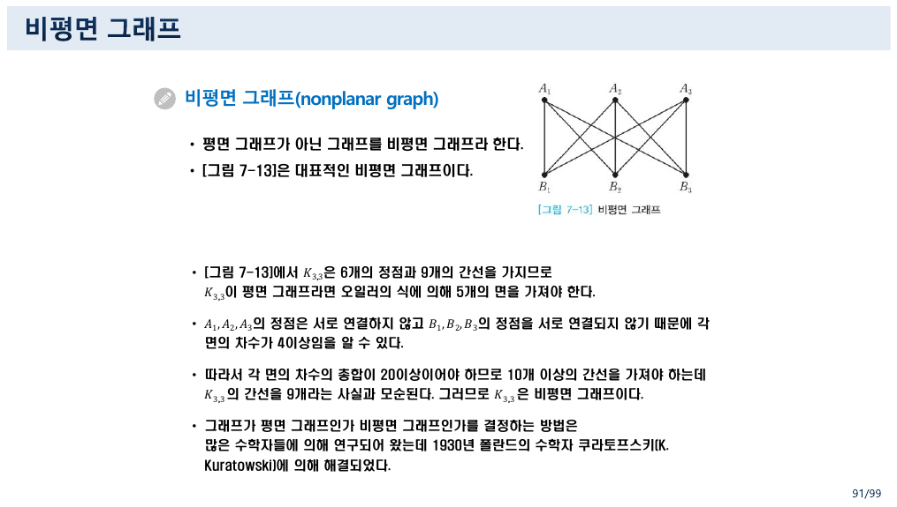

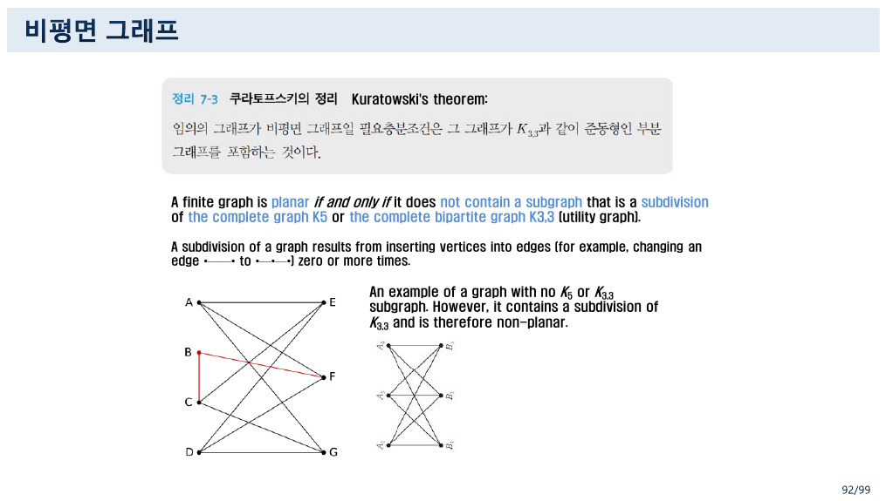

92쪽이 이 절을 닫는다.

> **Kuratowski's theorem:** A finite graph is planar **if and only if** it does not contain a subgraph that is a **subdivision** of the complete graph $K_5$ or the complete bipartite graph $K_{3,3}$ (utility graph).
> A **subdivision** of a graph results from inserting vertices into edges (for example, changing an edge $\bullet\!-\!\!-\!\bullet$ to $\bullet\!-\!\bullet\!-\!\bullet$) zero or more times.

`if and only if` — **필요충분조건**이다. 91쪽이 *"그래프가 평면 그래프인가 비평면 그래프인가를 결정하는 방법은 많은 수학자들에 의해 연구되어 왔는데 1930년 폴란드의 수학자 쿠라토프스키에 의해 **해결되었다**"*고 적는 이유가 그것이다. 그리고 같은 쪽의 그림 설명이 이 정리의 미묘함을 짚는다 — *"An example of a graph with **no $K_5$ or $K_{3,3}$ subgraph.** However, it **contains a subdivision** of $K_{3,3}$ and is therefore non-planar."* **간선 위에 점을 찍어 늘린 것까지 세어야 한다.**

$K_{3,3}$에 붙은 별명 `utility graph`도 뜻이 있다. 집 세 채와 수도·가스·전기 세 시설을 선이 겹치지 않게 잇는 옛 퍼즐이 바로 이 그래프이고, 쿠라토프스키 정리는 **그 퍼즐에 답이 없다**는 것을 증명한다.

---

## 3. 착색 — 판정식이 없는 쪽

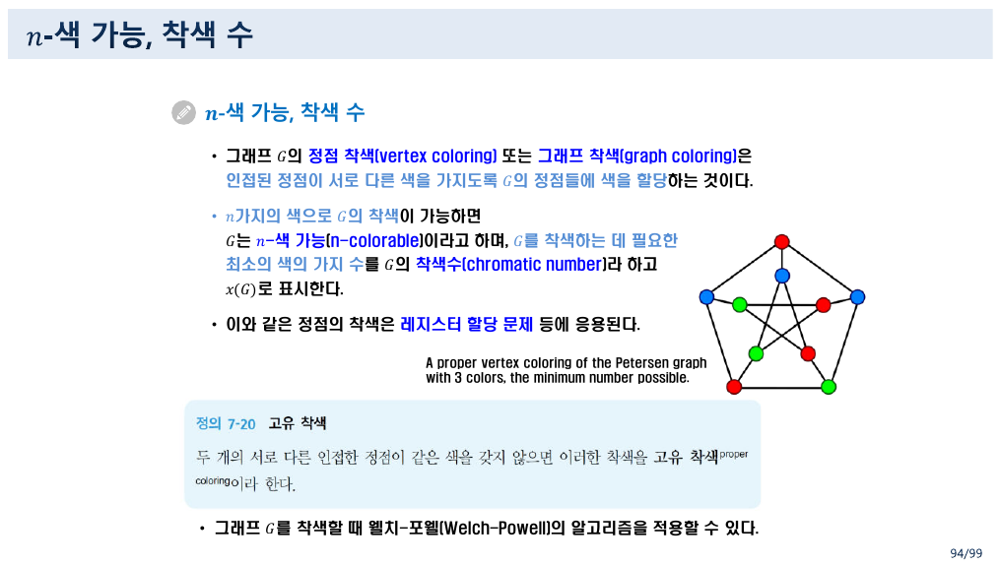

94쪽이 정의한다.

> 그래프 $G$의 **정점 착색**은 **인접된 정점이 서로 다른 색**을 가지도록 $G$의 정점들에 색을 할당하는 것이다.
> $n$가지의 색으로 $G$의 착색이 가능하면 $G$는 $n$-색 가능이라 하며, $G$를 착색하는 데 필요한 **최소의 색의 가지 수**를 $G$의 **착색수**라 하고 $x(G)$로 표시한다.
> 이와 같은 정점의 착색은 **레지스터 할당 문제** 등에 응용된다.

마지막 줄이 이 절을 컴퓨터 과학으로 끌어온다. **동시에 살아 있는 변수 두 개는 같은 레지스터에 둘 수 없으므로**, 변수를 정점으로 하고 「동시에 살아 있음」을 간선으로 하면 레지스터 할당이 정확히 그래프 착색이 된다. 그림은 **페테르센 그래프**를 3색으로 칠한 것이고, 캡션이 `the minimum number possible`이라 적는다.

95쪽이 몇 가지 값을 준다.

$$x(G) = \min\{\,n \in \mathbf{Z}^{+} \mid G \text{가 } n\text{-색 가능}\,\}$$

> - a graph that contains $K_3$ requires **at least 3 colors**
> - For **even cycles**, $x(C_n) = 2$. For **odd cycles**, $x(C_n) = 3$.

$C_n$이 13번 노트에서 붙인 이름 그대로 여기서 쓰인다. 짝수 순환은 두 색을 번갈아 칠하면 끝나지만, 홀수 순환은 한 바퀴를 돌아오면 마지막 정점이 첫 정점과 같은 색이 되어 버려 세 번째 색이 필요하다.

### 웰치-포웰 알고리즘

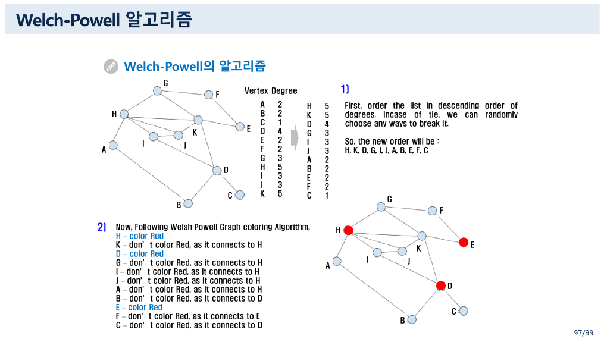

96쪽(영어)과 99~100쪽(한국어)이 같은 절차를 두 번 적는다.

> ① 그래프 $G$의 정점의 차수가 **내림차순**이 되게 배열한다(이 배열은 차수가 같은 정점이 여러 개 있을 수 있으므로 **몇 가지 다른 순서가 존재할 수 있다**).
> ② 배열의 첫 번째 정점은 첫 번째 색으로 착색하고 계속해서 배열의 순서대로 **이미 착색된 정점과 인접하지 않은 정점을 모두 같은 색**으로 착색한다.
> ③ 배열에서 먼저 나타나는 착색되지 않은 정점을 두 번째 색으로 착색하고 $\cdots$
> ④ 계속해서 위의 과정을 그래프의 모든 정점이 착색될 때까지 반복한다.

97~98쪽이 정점 11개짜리 그래프로 실행한다.

| 정점 | A | B | C | D | E | F | G | H | I | J | K |
| --- | :-: | :-: | :-: | :-: | :-: | :-: | :-: | :-: | :-: | :-: | :-: |
| 차수 | 2 | 2 | 1 | 4 | 2 | 2 | 3 | **5** | 3 | 3 | **5** |

내림차순 배열: **H, K, D, G, I, J, A, B, E, F, C**. 그리고 세 번의 패스가 돈다.

| 색 | 칠해지는 정점 | 넘어가는 이유(원본이 적은 그대로) |
| --- | --- | --- |
| **Red** | H, D, E | K·G·I·J·A는 H와, B·C는 D와, F는 E와 인접 |
| **Green** | K, I, A, F, C | G는 K와, J는 I와, B는 A와 인접 |
| **Blue** | G, J, B | 남은 셋 |

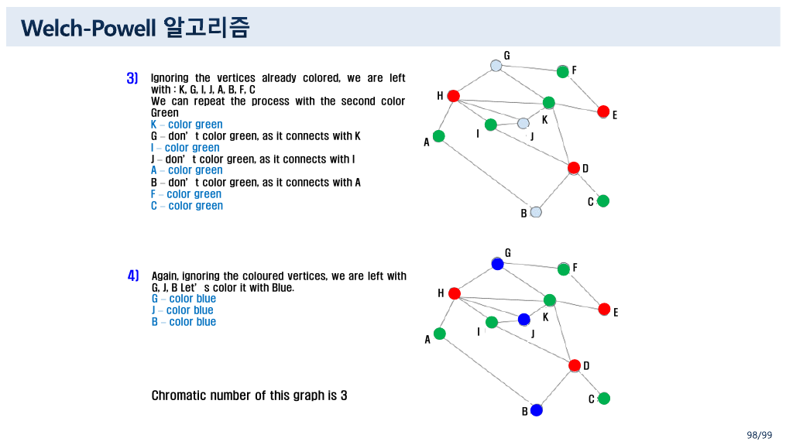

98쪽이 *"Chromatic number of this graph is 3"*이라 맺는다. 이 그래프에서는 **결과가 맞다.** 문제는 일반화다.

---

## 4. 탐욕은 최소를 보장하지 않는다

> [!caution] 원본 오류 — 96쪽: 웰치-포웰은 착색 수를 주지 못한다
> 96쪽 영어 본문.
>
> > **Welsh Powell algorithm that gives the minimum colors we need.** This algorithm is also used to **find the chromatic number** of a graph. **This is an iterative greedy approach.**
>
> 세 문장이 서로 충돌한다. 착색 수를 구하는 문제는 **NP-난해**이고, 탐욕 알고리즘은 그런 문제에서 최적해를 보장하지 못한다. 웰치-포웰은 **좋은 근사(heuristic)**이지 최소 색 수를 주는 절차가 아니다.
>
> 반례를 만들 수 있다. **크라운 그래프**(완전 이분 그래프 $K_{3,3}$에서 완전 매칭을 뺀 것)를 보자.
>
> - 정점 여섯 개: $u_1, u_2, u_3$과 $v_1, v_2, v_3$
> - 간선: $u_i$와 $v_j$를 $i \ne j$일 때만 연결 — 여섯 개
> - **모든 정점의 차수가 2로 똑같다.**
>
> 이 그래프는 이분 그래프이므로 **착색 수가 2**다($u$쪽 전부를 1색, $v$쪽 전부를 2색). 그런데 차수가 전부 같으므로 단계 ①이 허용하는 배열이 여러 가지이고, 그중 $u_1, v_1, u_2, v_2, u_3, v_3$ 순서로 돌리면
>
> | 순서 | $u_1$ | $v_1$ | $u_2$ | $v_2$ | $u_3$ | $v_3$ |
> | --- | :-: | :-: | :-: | :-: | :-: | :-: |
> | 색 | 1 | 1 | 2 | 2 | **3** | **3** |
>
> **세 색을 쓴다.** ($v_1$은 $u_1$과 인접하지 않으므로 같은 색을 받고, 그 때문에 $u_2$가 1색을 못 쓰게 되는 연쇄가 일어난다.) 반면 $u_1, u_2, u_3, v_1, v_2, v_3$ 순서로 돌리면 **두 색**으로 끝난다.
>
> 즉 **같은 알고리즘이 허용하는 두 배열이 서로 다른 답을 준다.** 원본 스스로 ①에서 *"몇 가지 다른 순서가 존재할 수 있다"*고 적어 두었으므로, 그 문장과 *"gives the minimum colors"*가 한 자료 안에서 모순된다.
>
> 정확한 표현은 *"이 알고리즘은 착색 수의 **상계**를 준다"* 정도다. 100쪽의 한국어 절차 설명(①~④)에는 「최소」라는 주장이 없어서 문제가 없다 — **영어 슬라이드 한 장만 과하게 말한다.**

```html preview h=700px
<div id="wp" style="font-family:system-ui,-apple-system,'Segoe UI',sans-serif;color:var(--foreground);padding:18px">
  <div style="font-size:13px;font-weight:600;margin-bottom:4px">웰치-포웰을 두 배열로 돌려 보기 — 답이 갈린다</div>
  <div style="font-size:12px;opacity:.75;margin-bottom:14px">
    크라운 그래프: 모든 정점의 차수가 2이므로 단계 ①이 어느 배열이든 허용한다. 배열 버튼을 바꿔 보라.
  </div>
  <div style="display:flex;gap:7px;flex-wrap:wrap;margin-bottom:14px">
    <button class="wpb" data-o="0">배열 A — u₁ v₁ u₂ v₂ u₃ v₃</button>
    <button class="wpb" data-o="1">배열 B — u₁ u₂ u₃ v₁ v₂ v₃</button>
    <button class="wpb" data-o="2">부록의 예제 그래프 (a~f)</button>
  </div>
  <div style="display:flex;gap:28px;flex-wrap:wrap;align-items:flex-start">
    <svg id="wp-svg" width="280" height="240" viewBox="0 0 280 240" style="border:1px solid var(--border);border-radius:9px;background:var(--card)"></svg>
    <div style="flex:1;min-width:290px">
      <div id="wp-steps" style="font-size:12.5px;line-height:1.95;font-family:ui-monospace,monospace"></div>
      <div id="wp-out" style="margin-top:12px;font-size:12.5px;line-height:1.9;padding:11px 13px;border:1px solid var(--border);border-radius:8px;background:var(--card)"></div>
    </div>
  </div>
  <style>
    #wp .wpb{background:var(--card);color:var(--foreground);border:1px solid var(--border);
      border-radius:7px;padding:6px 11px;font-size:12px;cursor:pointer;font-family:inherit}
    #wp .wpb.sel{border-color:var(--chart-1);box-shadow:inset 0 0 0 1px var(--chart-1)}
  </style>
</div>
<script>
(function(){
  var root=document.getElementById('wp');
  var crown={
    adj:{u1:['v2','v3'],u2:['v1','v3'],u3:['v1','v2'],v1:['u2','u3'],v2:['u1','u3'],v3:['u1','u2']},
    pos:{u1:[60,45],u2:[60,120],u3:[60,195],v1:[220,45],v2:[220,120],v3:[220,195]},
    chi:2, name:'크라운 그래프 (이분 — 착색 수 2)'
  };
  var appx={
    adj:{a:['b','c','d'],b:['a','c','d'],c:['a','b','d','e','f'],d:['a','b','c'],e:['c','f'],f:['c','e']},
    pos:{a:[55,90],b:[70,190],d:[140,35],c:[185,110],e:[175,205],f:[250,160]},
    chi:4, name:'부록 3쪽의 예제 그래프 (착색 수 4)'
  };
  var configs=[
    {g:crown, order:['u1','v1','u2','v2','u3','v3']},
    {g:crown, order:['u1','u2','u3','v1','v2','v3']},
    {g:appx,  order:['c','a','d','e','b','f']}
  ];
  var palette=['var(--chart-1)','var(--chart-2)','var(--chart-3)','var(--chart-5)','var(--chart-4)'];
  var cur=0;
  function draw(){
    root.querySelectorAll('.wpb').forEach(function(b,i){b.classList.toggle('sel',i===cur);});
    var cfg=configs[cur], g=cfg.g, order=cfg.order;
    var cm={}, log=[];
    order.forEach(function(n){
      var used={}; g.adj[n].forEach(function(w){ if(w in cm) used[cm[w]]=1; });
      var c=0; while(used[c]) c++;
      cm[n]=c;
      log.push(n+' → '+(c+1)+'색  <span style="opacity:.6">(이웃이 쓴 색: '+(Object.keys(used).map(function(x){return (+x+1)+'색';}).join(', ')||'없음')+')</span>');
    });
    var used=Math.max.apply(null,Object.keys(cm).map(function(k){return cm[k];}))+1;
    var s='';
    Object.keys(g.adj).forEach(function(n){
      g.adj[n].forEach(function(w){
        if(n<w) s+='<line x1="'+g.pos[n][0]+'" y1="'+g.pos[n][1]+'" x2="'+g.pos[w][0]+'" y2="'+g.pos[w][1]+
          '" stroke="var(--border)" stroke-width="1.8"></line>';
      });
    });
    Object.keys(g.pos).forEach(function(n){
      s+='<circle cx="'+g.pos[n][0]+'" cy="'+g.pos[n][1]+'" r="17" fill="'+palette[cm[n]]+'" stroke="var(--foreground)" stroke-width="1.4"></circle>';
      s+='<text x="'+g.pos[n][0]+'" y="'+(g.pos[n][1]+4)+'" text-anchor="middle" font-size="11.5" fill="var(--card)" font-weight="700" font-family="ui-monospace,monospace">'+n+'</text>';
    });
    root.querySelector('#wp-svg').innerHTML=s;
    root.querySelector('#wp-steps').innerHTML='<b>배열</b> : '+order.join(' → ')+'<br><br>'+log.join('<br>');
    root.querySelector('#wp-out').innerHTML=
      '<b>'+g.name+'</b><br>'+
      '이 배열이 쓴 색 : <b>'+used+'</b>개 &nbsp;/&nbsp; 실제 착색수 x(G) = <b>'+g.chi+'</b><br>'+
      (used>g.chi
        ? '<span style="color:var(--chart-5)"><b>최소보다 많다.</b></span> 단계 ①이 허용하는 배열인데도 최소가 아니다 — 96쪽의 <i>“gives the minimum colors we need”</i>가 성립하지 않는 자리다.'
        : '이 배열에서는 최소와 같다. <span style="opacity:.75">다른 배열을 눌러 보면 같은 그래프에서 답이 갈린다.</span>');
  }
  root.querySelectorAll('.wpb').forEach(function(b,i){b.onclick=function(){cur=i;draw();};});
  draw();
})();
</script>
```

---

## 5. 코드로 옮기기 — 그리고 그림이 코드와 어긋난다

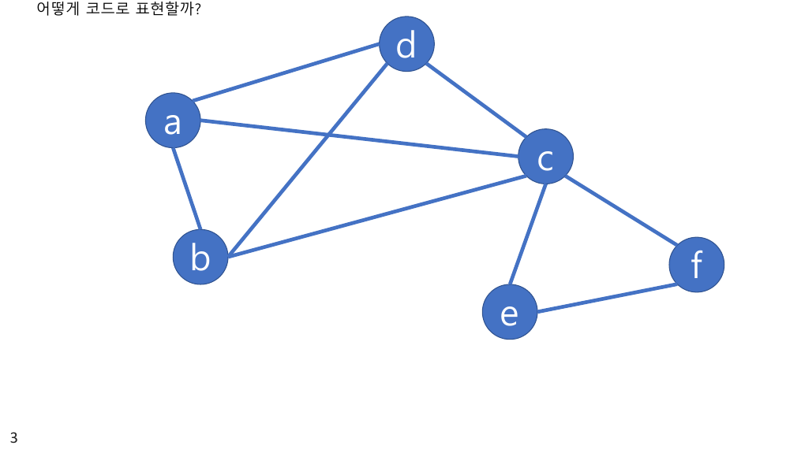

116~129쪽과 별도 파일 `Appendix 2 Welch-Powell Algorithms.pdf`가 **같은 내용**이다(부록 파일이 14장, 강의 파일에 그 14장이 그대로 붙어 있다). 목표는 한 문장이다 — *"어떻게 코드로 표현할까?"*

절차가 네 단계로 나뉜다.

| 단계 | 파이썬 표현 |
| --- | --- |
| 0. 그래프 표현 | `graph = {}` — 노드를 key로, 이웃을 리스트로. `'a' : ['b', 'c', 'd']` |
| 1. 차수로 정렬 | `sorted(data, key=lambda x: func, reverse=True)` |
| 2. 이웃의 색 확인 | `available_colors[color] = False` |
| 3. 칠할 수 있는 첫 색 | `for color, is_colorable in enumerate(available_colors): if is_colorable: ...` |
| 4. 반환 | `return color_map` |

완성 코드가 이렇다.

```python
def color_nodes(graph):
    nodes = sorted(list(graph.keys()), key=lambda x: len(graph[x]), reverse=True)
    color_map = {}

    for node in nodes:
        available_colors = [True] * len(nodes)
        for neighbor in graph[node]:
            if neighbor in color_map:
                color = color_map[neighbor]
                available_colors[color] = False
        for color, is_colorable in enumerate(available_colors):
            if is_colorable:
                color_map[node] = color
                break

    return color_map
```

`len(graph[x])`가 곧 **차수**이고, `available_colors`가 길이 $\lvert V \rvert$인 불리언 배열이다. 색은 많아야 정점 수만큼 필요하므로 이 길이면 충분하다. 마지막 두 슬라이드는 이 코드를 **제너레이터 식**과 `next()`로 줄이는 방향을 주석으로만 가리키고 실제로 고치지는 않는다.

부록의 예제 그래프(3쪽)는 정점 여섯 개에 간선 아홉 개다.

$$a\text{–}b,\ a\text{–}c,\ a\text{–}d,\ b\text{–}c,\ b\text{–}d,\ c\text{–}d,\ c\text{–}e,\ c\text{–}f,\ e\text{–}f$$

$$\deg(a) = \deg(b) = \deg(d) = 3, \quad \deg(c) = 5, \quad \deg(e) = \deg(f) = 2$$

$\{a, b, c, d\}$가 **$K_4$**를 이루므로 착색 수는 4다. 부록 6쪽의 「Iteration」 그림이 1st부터 4th까지 **네 개의 색 패스**를 그리는 것과 맞는다.

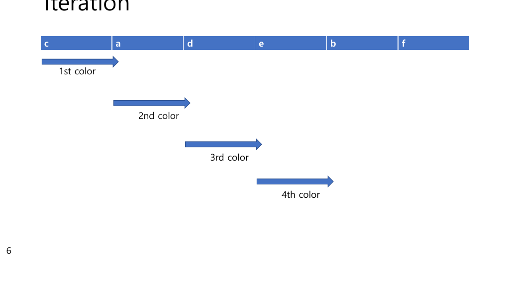

> [!caution] 원본 불일치 — 부록 6쪽의 배열이 내림차순이 아니다
> 6쪽의 띠에 적힌 정점 순서는 **c, a, d, e, b, f**다. 차수를 넣어 보면
>
> $$c(5),\ a(3),\ d(3),\ \mathbf{e(2)},\ \mathbf{b(3)},\ f(2)$$
>
> **$e$(차수 2)가 $b$(차수 3)보다 앞에 있다.** 단계 ①의 *"차수가 내림차순이 되게 배열한다"*를 어긴다.
>
> 게다가 같은 파일 12쪽의 코드는 `sorted(..., key=lambda x: len(graph[x]), reverse=True)`로 **정확히 내림차순 정렬**을 한다. 그 코드를 이 그래프에 돌리면 $c, a, b, d, e, f$(동점 순서는 딕셔너리 순서) 같은 배열이 나오고, **$e$가 $b$보다 앞에 오는 일은 없다.**
>
> 다행히 이 그래프에서는 두 배열 모두 **네 색**으로 끝나므로 결론은 같다(위 인터랙티브에서 확인할 수 있다). 그러나 **알고리즘 설명 슬라이드가 그 알고리즘의 첫 단계를 어긴 예를 싣고 있다.**

---

## 6. 두 절을 나란히 놓으면

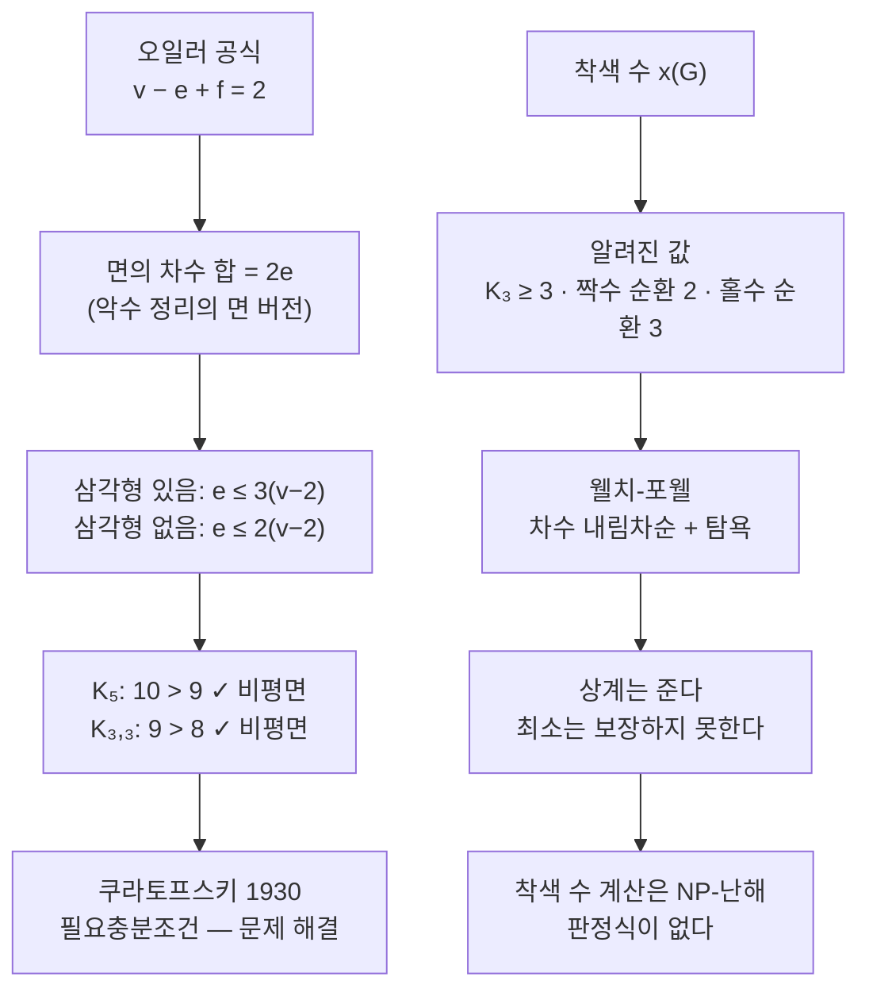

**왼쪽은 1930년에 닫혔고 오른쪽은 아직 열려 있다.** 그 차이가 이 두 절의 서술 방식에도 그대로 나타난다 — 평면 그래프 절은 *"해결되었다"*로 끝나고, 착색 절은 알고리즘 하나와 코드로 끝난다. 13번 노트에서 본 **오일러와 해밀턴의 대비**가 한 단원 뒤에서 다시 한 번, 다른 두 문제로 반복되는 셈이다.

| | 판정식이 있는 쪽 | 없는 쪽 |
| --- | --- | --- |
| 13번 노트 | 오일러 — 차수가 모두 짝수 | 해밀턴 — 없음 |
| 이 노트 | 평면 — 쿠라토프스키 정리 | 착색 — 없음 (NP-난해) |

---

## 다음으로

- **[16번 노트](./16.%20%ED%8A%B8%EB%A6%AC%EB%8A%94%20%ED%8A%B9%EB%B3%84%ED%95%9C%20%EA%B4%80%EA%B3%84%EB%8B%A4%20%E2%80%94%20%EA%B7%B8%EB%9F%B0%EB%8D%B0%20%EC%88%9C%ED%9A%8C%20%EA%B2%B0%EA%B3%BC%EB%8A%94%20%ED%8A%B8%EB%A6%AC%EB%A5%BC%20%EB%90%98%EB%8F%8C%EB%A6%AC%EC%A7%80%20%EB%AA%BB%ED%95%9C%EB%8B%A4.md)** — 트리. 순환이 없는 연결 그래프는 언제나 평면이고, 착색 수는 2다.
- **13번 노트** — $K_5$, $K_{3,3}$, $C_n$이라는 이름이 붙은 자리.
- **11번 노트** — 면의 차수 정리가 그대로 베껴 쓴 악수 정리.

---

## 근거 자료

`5 그래프.pdf` 슬라이드 83~100(PDF 42~50쪽)과 116~129(PDF 58~65쪽), 그리고 `Appendix 2 Welch-Powell Algorithms.pdf` 전체(14장). 뒤의 두 자료는 내용이 같다.

| 슬라이드 | 내용 |
| --- | --- |
| 84 | 교점(cross over)과 교선(cross line) |
| **85** | **평면 그래프의 정의, 도형(map), Imbedding problem · Planarity problem** |
| 86~88 | 평면 그래프의 예, 다각형 그래프, 면(face), 최대 순환 |
| **89** | **면의 차수 — 차수의 총합 = 간선 수의 두 배** |
| **90** | **[정리 7-2] 오일러의 정리 $v-e+f=2$, $e \le 3(v-2)$, 세 예 (셋째 예의 부등식이 성립하지 않음 — 원본 오류)** |
| **91** | **비평면 그래프 $K_5$·$K_{3,3}$, 면의 차수 4 이상을 쓴 정확한 논증** |
| **92** | **쿠라토프스키 정리와 세분(subdivision)** |
| **94** | **$n$-색 가능, 착색 수 $x(G)$, 페테르센 그래프의 3색, 레지스터 할당** |
| 95 | 착색 수의 정의, $K_3$은 3색 이상, 짝수·홀수 순환 |
| **96** | **웰치-포웰 알고리즘 (영어) — "gives the minimum colors we need" (원본 오류)** |
| **97~98** | **정점 11개 그래프의 실행 — 차수 정렬 H·K·D·G·I·J·A·B·E·F·C, 세 색** |
| 99~100 | 웰치-포웰의 한국어 4단계 |
| 116~129 | 코드로 옮기기 — `graph = {}`, `sorted`, `available_colors`, 완성 코드와 최적화 주석 |
| **부록2 3쪽** | **예제 그래프 (정점 6, 간선 9, $\{a,b,c,d\}$가 $K_4$)** |
| **부록2 6쪽** | **Iteration — 배열 c·a·d·e·b·f (내림차순이 아님 — 원본 불일치), 네 번의 색 패스** |
| 부록2 8~14쪽 | 차수 정렬, 이웃 색 확인, 색칠 가능 판정, 반환, 완성 코드 |

인터랙티브 두 개에 쓴 값은 원본에서 왔다. 평면 그래프 계산기는 90쪽의 세 예($K_5 - e$, $K_5$, $K_{3,3}$)와 $C_6$를, 착색 실험기는 부록 3쪽의 그래프와 크라운 그래프를 쓴다. 부록 그래프의 간선 아홉 개는 PDF를 200 dpi로 확대 렌더해 한 변씩 읽었고, 차수·간선 수·착색 수(전수 탐색)와 두 배열의 탐욕 결과를 파이썬으로 독립 계산해 슬라이드의 「4th color」 및 6쪽의 배열과 대조했다. 90쪽의 부등식 세 줄과 91쪽의 $K_{3,3}$ 논증도 손으로 검산했다. 보충한 것은 **삼각형이 없을 때의 상한 $e \le 2(v-2)$**와 **크라운 그래프 반례**이며, 둘 다 본문에서 보충임을 밝혔다.
