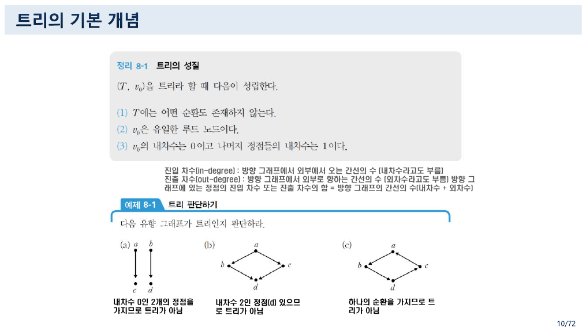
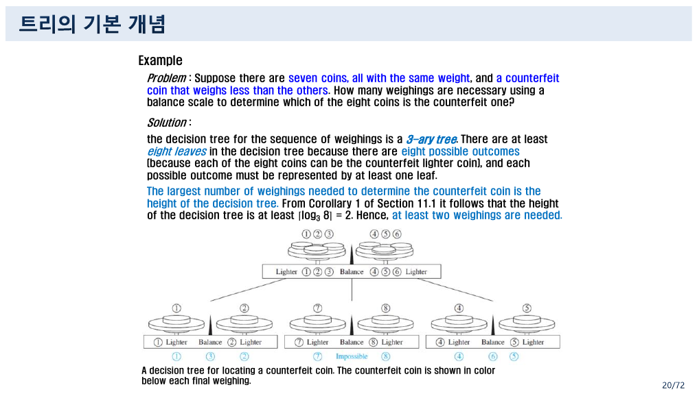
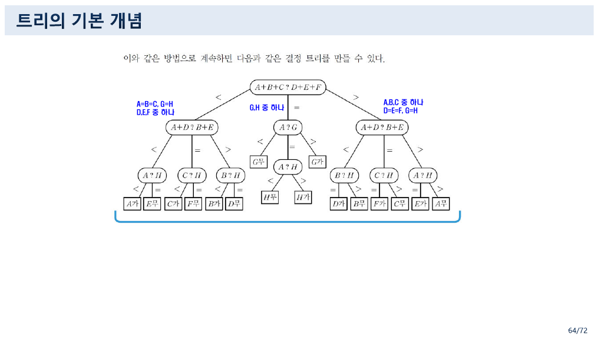
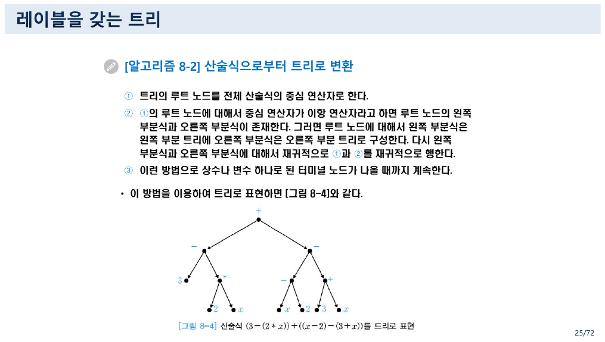
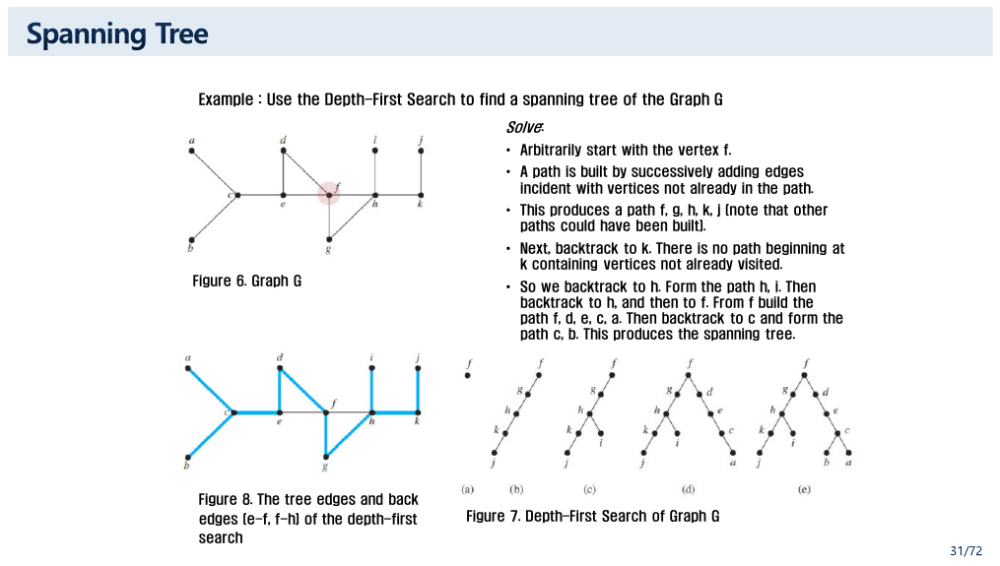
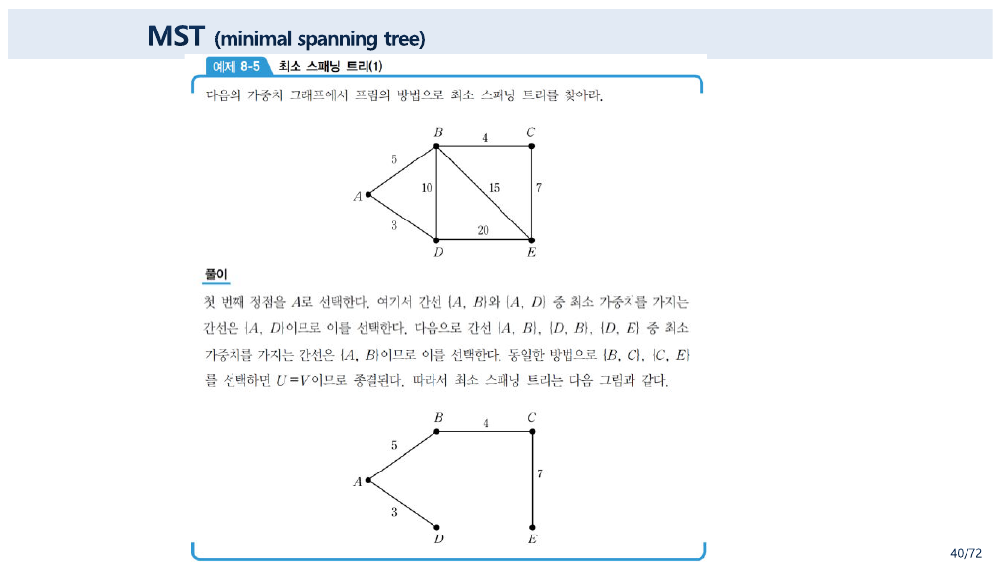
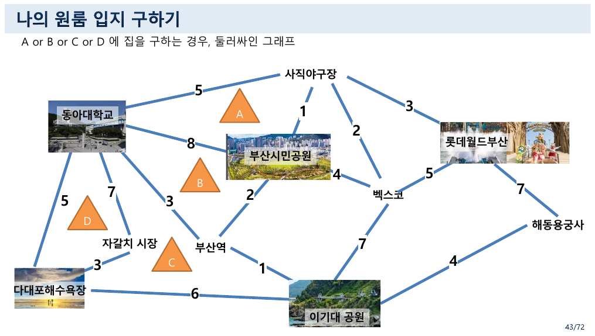
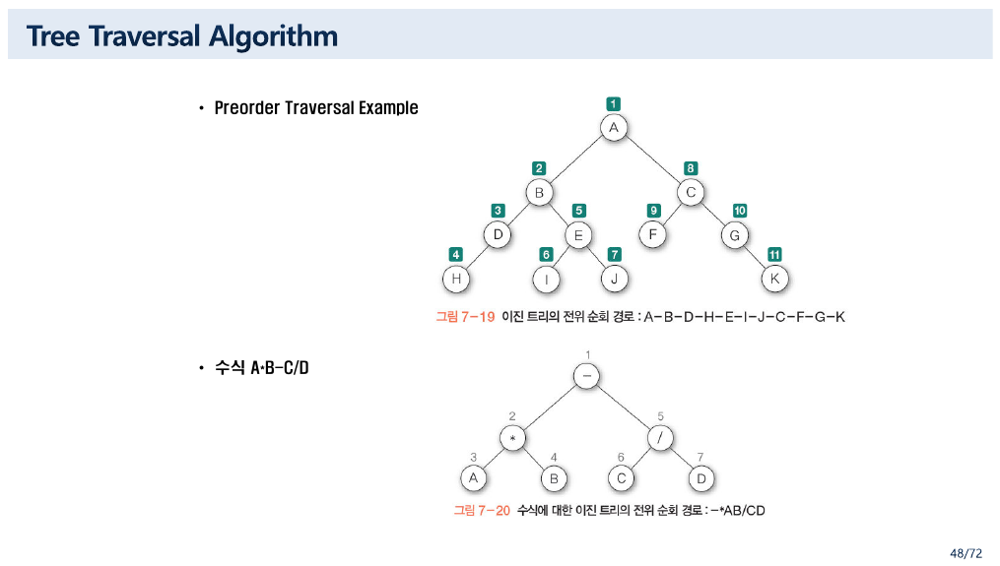
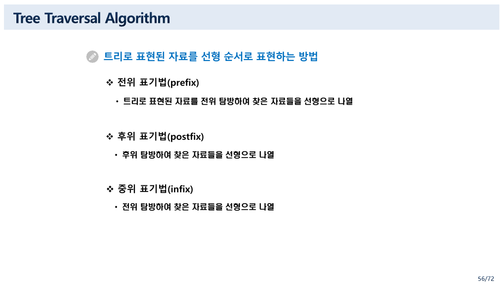
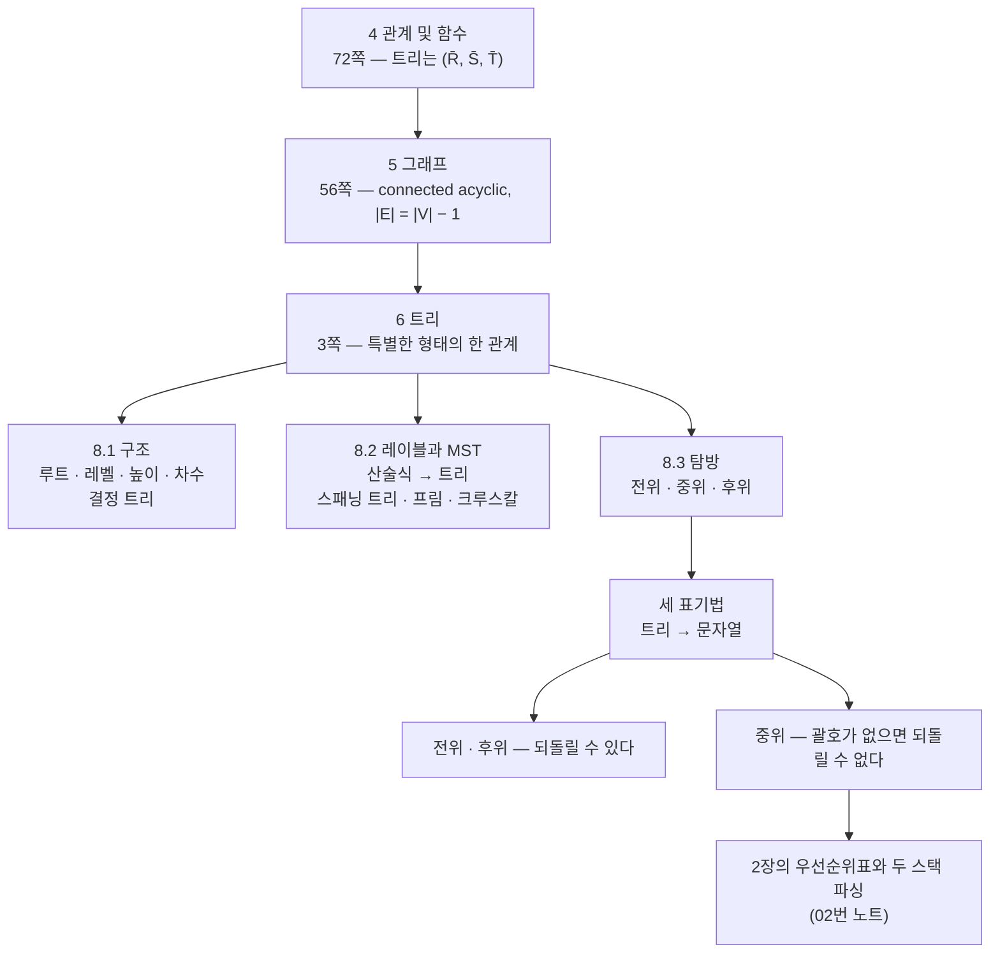

> [!abstract] 이 묶음이 실제로 하는 말
> 3쪽이 트리를 한 줄로 정의한다.
>
> > 트리는 **'특별한 형태의 한 관계(relation)'**라고 간단히 정의할 수 있다.
>
> [08번 노트](./08.%20%EA%B2%BD%EB%A1%9C%EB%8A%94%20%EA%B3%B1%ED%95%98%EA%B3%A0%20%EC%84%B1%EC%A7%88%EC%9D%80%20%EB%94%B0%EC%A7%84%EB%8B%A4%20%E2%80%94%20%E3%80%8C%EB%AA%A8%EB%93%A0%E3%80%8D%EC%9D%B4%EB%9D%BC%20%EC%8D%A8%EC%95%BC%20%ED%95%A0%20%EC%9E%90%EB%A6%AC%EC%9D%98%20%E3%80%8C%EC%96%B4%EB%96%A4%E3%80%8D.md)에서 본 「4 관계 및 함수」 72쪽의 여덟 조합표가 그 「특별한 형태」를 정확히 지목한다 — 트리는 $(\bar R, \bar S, \bar T)$, **반사도 대칭도 추이도 아닌 관계**다. 이 과목이 관계에서 그래프로, 그래프에서 트리로 내려온 길이 여기서 한 바퀴 닫힌다.
>
> 그리고 마지막 절이 반대 방향을 간다. **트리를 다시 한 줄의 문자열로 편다.** 전위·중위·후위 세 순회가 세 표기법을 낳는다.
>
> | 표기법 | [그림 8-8]의 결과 | 트리를 되돌릴 수 있는가 |
> | --- | --- | :---: |
> | 전위(폴란드식) | `＊＋AB－CD` | **✓** |
> | 후위(역폴란드식) | `AB＋CD－＊` | **✓** |
> | **중위** | **`A＋B＊C－D`** | **✗** |
>
> 셋째 줄이 이 노트의 척추다. 원래 트리는 $(A+B) \times (C-D)$인데, 59쪽이 적은 `A＋B＊C－D`를 **보통의 연산자 우선순위로 읽으면** $A + (B \times C) - D$가 된다. $A=1, B=2, C=3, D=4$를 넣으면 앞은 $3 \times (-1) = -3$, 뒤는 $1 + 6 - 4 = 3$이다. **같은 문자열이 다른 트리를 가리킨다.**
>
> 원본이 이 사실을 모르는 것은 아니다. 24쪽이 트리를 만드는 쪽에서는 *"여기서는 **괄호를 이용하여** 연산자 우선순위가 정해져 있을 때"*라고 범위를 제한해 둔다. 괄호가 있어야 문자열에서 트리로 갈 수 있다는 것을 알면서, 트리에서 문자열로 가는 쪽에서는 괄호를 붙이지 않았다.
>
> 그 위에 56쪽의 오기가 하나 더 있다 — **"중위 표기법 · **전위** 탐방하여 찾은 자료들을 선형으로 나열."**

---

## 1. 트리는 관계다 — 세 가지 정의와 세 가지 반례

9쪽이 트리를 세 가지로 정의한다.

> - A tree is a **connected graph without cycles**
> - A tree is a connected graph on $n$ vertices with **$n-1$ edges**
> - A graph is a tree **if and only if** there is a **unique simple path** between any pair of its vertices

셋은 동치다. 그리고 세 번째가 가장 유용하다 — **경로가 유일하다**는 것이 트리를 자료구조로 쓸 수 있게 하는 성질이다. [13번 노트](./13.%20%EA%B7%B8%EB%9E%98%ED%94%84%EC%97%90%20%EC%9D%B4%EB%A6%84%EC%9D%84%20%EB%B6%99%EC%9D%B4%EB%8A%94%20%EC%97%B4%20%EA%B0%80%EC%A7%80%20%EB%B0%A9%EB%B2%95%20%E2%80%94%20%EA%B7%B8%EB%A6%AC%EA%B3%A0%20%ED%95%9C%20%EB%B2%88%EC%94%A9%EB%A7%8C%20%EC%93%B0%EC%9D%B4%EB%8A%94%20%EC%A0%95%EC%9D%98%EB%93%A4.md)에서 「5 그래프」 56쪽이 예고한 $\lvert E \rvert = \lvert V \rvert - 1$이 여기서 정의가 된다.



10쪽이 **트리가 아닌 세 가지**를 나란히 놓는다. 정의를 외우는 것보다 이 세 장이 빠르다.

| 그림 | 원본의 판정 |
| --- | --- |
| 첫째 | **내차수 0인 정점을 2개** 가지므로 트리가 아님 |
| 둘째 | **내차수 2인 정점($d$)**이 있으므로 트리가 아님 |
| 셋째 | **하나의 순환**을 가지므로 트리가 아님 |

세 조건이 각각 **루트의 유일성**, **부모의 유일성**, **순환 없음**에 대응한다. [11번 노트](./11.%20%EA%B7%B8%EB%9E%98%ED%94%84%EC%9D%98%20%EC%A0%95%EC%9D%98%EA%B0%80%20%EC%84%B8%20%EB%B2%88%20%EB%8A%98%EC%96%B4%EB%82%9C%EB%8B%A4%20%E2%80%94%20%EA%B7%B8%EB%A6%AC%EA%B3%A0%20%ED%91%9C%ED%98%84%EC%9D%B4%20%EA%B7%B8%20%EB%8A%98%EC%96%B4%EB%82%A8%EC%9D%84%20%ED%9D%A1%EC%88%98%ED%95%9C%EB%8B%A4.md)의 내차수·외차수가 여기서 **구조를 판정하는 도구**로 쓰인다.

11~16쪽이 용어를 붙인다 — 루트, 부모·자식·형제, 터미널(리프) 노드, 레벨(루트가 0), 높이(최대 레벨), 정점의 차수(자식 수), 트리의 차수(최대 차수), $n$-트리, 완전 $n$-트리, 순서 트리, 포리스트, 부분 트리.

> [!note] 원본 오타 — 19쪽
> 결정 트리 그림에 붙은 설명 중 하나가 **`또는 left node`**다. **`leaf node`**의 오타다. 같은 슬라이드의 다른 라벨은 `처음 분류기준(첫 질문)`으로 정확하다.

---

## 2. 여덟 개의 동전을 두 번 재는가, 세 번 재는가



이 자료는 **같은 「여덟 개의 동전」 문제를 두 번** 낸다. 그리고 답이 다르다.

**20쪽(로젠 계열, 영어).**

> Suppose there are seven coins, all with the same weight, and **a counterfeit coin that weighs less than the others.** How many weighings are necessary using a balance scale to determine which of the eight coins is the counterfeit one?
> $\cdots$ the height of the decision tree is at least $\lceil \log_3 8 \rceil = 2$. Hence, **at least two weighings** are needed.

**62쪽(예제 8-4, 한국어).**

> 8개의 코인은 모두 똑같은 색깔에 똑같은 모양이다. 그 중 1개만 다른 7개와 무게가 다르다. 무게가 같거나 무겁거나 가벼움만을 판정할 수 있는 천칭을 이용하여 단 **3회**만에 8개 중 어느 코인이 정상인 코인보다 **무게가 무거운지 또는 가벼운지**를 알아내는 결정 트리를 만들라.



> [!note] 보충 — 두 답이 다른 이유는 문제가 다르기 때문이다
> 두 슬라이드는 서로를 언급하지 않고, 한 자료 안에서 「8개 동전, 2회」와 「8개 동전, 3회」가 나란히 있다. 모순처럼 보이지만 **문제가 다르다.**
>
> | | 20쪽 (로젠) | 62쪽 (예제 8-4) |
> | --- | --- | --- |
> | 가짜 동전이 | **가볍다고 이미 안다** | 무거운지 가벼운지 **모른다** |
> | 가려내야 할 경우의 수 | 어느 것인가 → **8가지** | 어느 것이고 어느 쪽인가 → **16가지** |
> | 필요한 저울질 | $\lceil \log_3 8 \rceil = 2$ | $\lceil \log_3 16 \rceil = 3$ |
>
> 천칭 한 번은 왼쪽이 무겁다·같다·오른쪽이 무겁다 세 갈래를 주므로 결정 트리가 **3진 트리**이고, 저울질 $h$번으로 가릴 수 있는 경우는 최대 $3^h$가지다. $3^2 = 9 \ge 8$이지만 $3^2 = 9 < 16 \le 27 = 3^3$이다.
>
> 64쪽의 결정 트리를 세어 보면 **잎이 16개**다(`A가`, `A무`, `B가`, `B무`, … 여덟 동전 × 무겁다/가볍다). 트리의 모양이 계산과 정확히 맞는다.
>
> 두 문제가 나란히 있는 것 자체가 좋은 배치다 — **정보를 하나 더 알면 저울질이 한 번 줄어든다**는 것이 한눈에 보인다. 다만 원본이 그 차이를 적어 두지 않아, 슬라이드만 읽으면 어느 쪽이 맞는지 헷갈린다.

18쪽이 결정 트리의 쓰임새를 두 줄로 적는다 — *"알고리즘을 시각적으로 표현하여 의사를 결정하거나 **시간 복잡도를 증명할 때** 사용하는 트리"*, *"가능성 있는 경우의 수를 효과적으로 표현하는 수단."* 비교 정렬의 하한 $\Omega(n \log n)$을 증명하는 도구가 바로 이 결정 트리다.

---

## 3. 산술식을 트리에 넣기 — 그리고 괄호의 역할

24쪽이 이 절의 전제를 명시한다.

> 이때 가장 필요한 요소가 **2장에서 설명한 연산자 우선순위와 결합법칙**이다.
> 여기서는 **괄호를 이용하여 연산자 우선순위가 정해져 있을 때** 이를 트리로 저장하는 방법을 설명한다.

[02번 노트](./02.%20%ED%95%9C%20%ED%8C%8C%EC%9D%BC%EC%97%90%20%EC%B1%85%20%EB%91%90%20%EA%B6%8C%20%E2%80%94%20%EC%9D%98%EB%AF%B8%EB%A1%9C%20%EA%B0%80%EB%A5%B4%EC%B9%98%EB%8A%94%20%EB%85%BC%EB%A6%AC%EC%99%80%20%ED%8C%8C%EC%8B%B1%EC%9C%BC%EB%A1%9C%20%EA%B0%80%EB%A5%B4%EC%B9%98%EB%8A%94%20%EB%85%BC%EB%A6%AC.md)에서 본 「수학적 모델과 논리」 24~31쪽의 두 스택 파싱이 여기서 회수된다. 그 자료가 우선순위표로 괄호를 대체했다면, 이 자료는 **괄호가 이미 있다고 가정하고** 트리로 옮긴다.



24~25쪽의 절차가 **중심 연산자**라는 한 단어에 걸려 있다.

> 산술식에서 **마지막으로 연산이 되는 연산자**(이 식에서는 ＋)를 그 산술식의 **중심 연산자**(central operator)라고 한다.

$$(3－(2 \ast x)) ＋ ((x－2)－(3＋x))$$

이 식의 중심 연산자는 바깥의 `＋`다. **[알고리즘 8-2]**가 그것을 재귀로 만든다.

> ① 트리의 루트 노드를 전체 산술식의 **중심 연산자**로 한다.
> ② 루트 노드의 **왼쪽 부분식은 왼쪽 부분 트리에, 오른쪽 부분식은 오른쪽 부분 트리**로 구성한다. 다시 왼쪽 부분식과 오른쪽 부분식에 대해서 ①과 ②를 **재귀적으로** 행한다.
> ③ 상수나 변수 하나로 된 **터미널 노드가 나올 때까지** 계속한다.

세 줄이 곧 재귀 하강 파서다. 그리고 **괄호가 없으면 ①에서 막힌다** — 어느 연산자가 마지막으로 계산되는지 알 수 없기 때문이다. 그것이 24쪽이 범위를 제한한 이유이고, 5절에서 문제가 되는 지점이다.

---

## 4. 스패닝 트리와 최소 스패닝 트리

27쪽이 스패닝 트리를 13번 노트의 부분 그래프 정의와 잇는다.

> 그래프 $G$ 안에 있는 **모든 정점을 다 포함**하면서 **트리가 되는** 연결 부분 그래프 $\cdots$ 컴퓨터 인터넷 네트워크와 자동차 내비게이션 등에 많이 사용된다.
> 그래프 $G$의 spanning tree는 **유일하지 않고** 구성하는 방법도 다양하지만, 대표적인 방법으로 **너비우선 탐색 방법과 깊이우선 탐색 방법**을 사용해서 구성하는 방법이 있다.



31~32쪽이 [14번 노트](./14.%20%EC%B5%9C%EB%8B%A8%20%EA%B2%BD%EB%A1%9C%EB%A5%BC%20%EB%91%90%20%EB%B2%88%20%EA%B0%80%EB%A5%B4%EC%B9%9C%EB%8B%A4%20%E2%80%94%20%EA%B0%99%EC%9D%80%20%EC%95%8C%EA%B3%A0%EB%A6%AC%EC%A6%98%2C%20%EB%8B%A4%EB%A5%B8%20%EA%B7%B8%EB%9E%98%ED%94%84%2C%20%EB%8B%A4%EB%A5%B8%20%ED%91%9C.md)의 두 탐색을 그대로 쓴다. DFS는 정점 $f$에서 출발해 $f, g, h, k, j$로 파고들었다가 되돌아오고, BFS는 $e$를 뿌리로 삼아 층별로 퍼진다. 31쪽이 **back edge**라는 이름을 하나 더 준다 — DFS 트리에 들어가지 않은 간선($e$–$f$, $f$–$h$)이 그것이다.

**탐색 순서가 곧 트리의 모양**이므로, 14번 노트에서 본 「스택이냐 큐냐」의 차이가 여기서 트리 두 개로 눈에 보인다.

### 프림과 크루스칼

33~34쪽이 최소 스패닝 트리의 두 알고리즘을 소개한다.

> [!caution] 원본 불일치 — 34쪽의 프림 설명이 예제와 어긋난다
> 34쪽.
>
> > ❖ **Prim's algorithm** — 그래프 $G=(V, E)$에서 **최소 가중치를 가지는 간선 $(u,v)$를 선택**하고, 이 간선을 MST에 포함시킨다. 그런 다음 정점 $u$또는 $v$에 연결된 간선 중에서 최소 가중치를 가지는 간선을 선택하여 MST에 포함시킨다.
>
> 프림 알고리즘은 **시작 정점을 정하고** 그 정점에 붙은 간선 중 최소를 고르는 것이다. 34쪽은 **그래프 전체에서 최소 간선**을 먼저 고르라고 적는데, 그것은 크루스칼의 첫 걸음에 가깝다.
>
> 그리고 **40쪽의 예제 8-5는 34쪽대로 하지 않는다.**
>
> > 첫 번째 **정점을 $A$로 선택한다.** 여기서 간선 $(A,B)$와 $(A,D)$ 중 최소 가중치를 가지는 간선은 $(A,D)$이므로 이를 선택한다.
>
> 정점에서 출발하는 정통 프림이다. 41쪽의 예제 8-6도 마찬가지로 *"첫 번째 정점을 $A$로 선택한다"*로 시작하고, 같은 그래프를 **$E$에서 출발했을 때**의 트리도 함께 보여 준다.
>
> 예제 8-5에서 전역 최소 간선이 마침 $A$에 붙은 $(A,D) = 3$이라 결과는 같지만, **설명과 예제가 다른 알고리즘을 적고 있다.**



40쪽의 예제 8-5를 검산해 보자. 정점 $A, B, C, D, E$에 간선 일곱 개.

$$A\text{–}B = 5,\quad A\text{–}D = 3,\quad B\text{–}C = 4,\quad B\text{–}D = 10,\quad B\text{–}E = 15,\quad C\text{–}E = 7,\quad D\text{–}E = 20$$

| 단계 | 고를 수 있는 간선 | 선택 | 누적 |
| :-: | --- | :-: | :-: |
| 1 | $(A,B)=5$, $(A,D)=3$ | $(A,D)$ | 3 |
| 2 | $(A,B)=5$, $(D,B)=10$, $(D,E)=20$ | $(A,B)$ | 8 |
| 3 | $(B,C)=4$, $(B,E)=15$, $(D,E)=20$ | $(B,C)$ | 12 |
| 4 | $(C,E)=7$, $(B,E)=15$, $(D,E)=20$ | $(C,E)$ | **19** |

간선 네 개, 정점 다섯 개 — $\lvert E \rvert = \lvert V \rvert - 1$ ✓. 원본이 그린 결과 트리와 일치한다.

> [!caution] 원본 오류 — 38쪽: 크루스칼 예제에 프림 캡션이 붙어 있다
> 38쪽의 제목은 *"Example: Use **Kruskal's** algorithm to find a minimum spanning tree in the graph"*인데, 그 아래 그림 캡션이 **"Figure 2. A minimum spanning tree produced using **Prim's** algorithm"**이다.
>
> 36쪽(프림 예제)의 캡션을 그대로 복사한 것으로 보인다. 두 알고리즘이 **같은 그래프에서 같은 MST를 내는 일이 흔하기** 때문에 그림 자체는 틀리지 않을 수 있지만, 캡션이 잘못된 알고리즘을 가리킨다.

41~42쪽의 예제 8-6이 더 흥미롭다. 풀이가 **동점을 만날 때마다 선택이 임의임을 명시한다.**

> 최소 가중치를 가지는 간선은 $(A,B)$나 $(C,B)$이다. **먼저 $(C,B)$를 선택하자.**
> $\cdots$ 그러면 $(C,E)$나 $(C,F)$가 가능하므로 **둘 중 아무거나 선택할 수 있다.** **이번에는** $(C,F)$를 선택했다.

그리고 42쪽이 **$A$에서 출발한 트리와 $E$에서 출발한 트리를 나란히** 보여 준다. 두 트리의 모양이 다르다. **가중치의 합은 같고 모양은 다르다** — 27쪽이 *"spanning tree는 유일하지 않고"*라고 적어 둔 것이 최소 스패닝 트리에서도 그대로라는 뜻이다.

### 43쪽 — 부산 지도로 낸 숙제



43쪽이 **답이 없는 문제**를 하나 던진다(44쪽은 비어 있다).

> **나의 원룸 입지 구하기** — A or B or C or D 에 집을 구하는 경우, 둘러싸인 그래프

동아대학교·사직야구장·부산시민공원·롯데월드부산·벡스코·해동용궁사·자갈치 시장·부산역·다대포해수욕장·이기대 공원 **열 곳**을 정점으로, 열일곱 개의 가중치 간선을 그린 실제 지도다. A·B·C·D는 그 위에 삼각형으로 표시된 **후보 거주지**인데, 정점이 아니라 **그래프가 둘러싼 영역** 안에 놓여 있다 — [15번 노트](./15.%20%ED%8F%89%EB%A9%B4%EA%B3%BC%20%EC%83%89%20%E2%80%94%20%EA%B7%B8%EB%A6%B4%20%EC%88%98%20%EC%9E%88%EB%8A%94%EA%B0%80%2C%20%EB%AA%87%20%EA%B0%80%EC%A7%80%20%EC%83%89%EC%9D%B4%EB%A9%B4%20%EB%90%98%EB%8A%94%EA%B0%80.md)의 **면(face)**이다.

```html preview h=740px
<div id="mst" style="font-family:system-ui,-apple-system,'Segoe UI',sans-serif;color:var(--foreground);padding:18px">
  <div style="font-size:13px;font-weight:600;margin-bottom:4px">43쪽 「나의 원룸 입지 구하기」 — 최소 스패닝 트리 구하기</div>
  <div style="font-size:12px;opacity:.75;margin-bottom:14px">
    원본 슬라이드의 열 개 장소와 열일곱 개 간선을 그대로 옮겼다. 두 알고리즘을 한 걸음씩 돌려 본다.
  </div>
  <div style="display:flex;gap:8px;flex-wrap:wrap;align-items:center;margin-bottom:14px">
    <button class="mb" data-a="prim">프림 (동아대학교에서 시작)</button>
    <button class="mb" data-a="prim2">프림 (해동용궁사에서 시작)</button>
    <button class="mb" data-a="kruskal">크루스칼</button>
    <span style="width:12px"></span>
    <button id="m-prev" class="mb">◀</button>
    <span id="m-step" style="font-size:13px;font-weight:700;min-width:62px;text-align:center"></span>
    <button id="m-next" class="mb">▶</button>
    <button id="m-all" class="mb">끝까지</button>
  </div>
  <div style="display:flex;gap:24px;flex-wrap:wrap;align-items:flex-start">
    <svg id="m-svg" width="470" height="330" viewBox="0 0 470 330" style="border:1px solid var(--border);border-radius:9px;background:var(--card)"></svg>
    <div style="flex:1;min-width:250px">
      <div id="m-log" style="font-size:12.5px;line-height:1.85"></div>
      <div id="m-sum" style="margin-top:12px;font-size:12.5px;line-height:1.9;padding:11px 13px;border:1px solid var(--border);border-radius:8px;background:var(--card)"></div>
    </div>
  </div>
  <style>
    #mst .mb{background:var(--card);color:var(--foreground);border:1px solid var(--border);
      border-radius:7px;padding:6px 11px;font-size:12px;cursor:pointer;font-family:inherit}
    #mst .mb.sel{border-color:var(--chart-1);box-shadow:inset 0 0 0 1px var(--chart-1)}
  </style>
</div>
<script>
(function(){
  var root=document.getElementById('mst');
  var P={
    '동아대학교':[55,70],'사직야구장':[230,32],'부산시민공원':[195,120],'롯데월드부산':[395,95],
    '벡스코':[305,155],'해동용궁사':[435,205],'자갈치 시장':[95,215],'부산역':[170,215],
    '다대포해수욕장':[35,265],'이기대 공원':[265,268]
  };
  var E=[['동아대학교','사직야구장',5],['동아대학교','부산시민공원',8],['동아대학교','부산역',3],
    ['동아대학교','자갈치 시장',7],['동아대학교','다대포해수욕장',5],
    ['사직야구장','부산시민공원',1],['사직야구장','벡스코',2],['사직야구장','롯데월드부산',3],
    ['부산시민공원','부산역',2],['부산시민공원','벡스코',4],
    ['롯데월드부산','벡스코',5],['롯데월드부산','해동용궁사',7],
    ['벡스코','이기대 공원',7],['자갈치 시장','다대포해수욕장',3],
    ['부산역','이기대 공원',1],['다대포해수욕장','이기대 공원',6],['이기대 공원','해동용궁사',4]];
  var V=Object.keys(P);
  var algo='prim', steps=[], s=0;
  function key(a,b){return [a,b].sort().join('|');}
  function build(){
    steps=[]; var chosen=[], tot=0;
    if(algo==='kruskal'){
      var par={}; V.forEach(function(v){par[v]=v;});
      function find(x){ while(par[x]!==x){par[x]=par[par[x]];x=par[x];} return x; }
      var sorted=E.slice().sort(function(a,b){return a[2]-b[2];});
      steps.push({sel:[],note:'크루스칼 — 간선을 가중치 오름차순으로 훑는다. 순환을 만들지 않으면 고른다.',tot:0});
      sorted.forEach(function(e){
        var ra=find(e[0]), rb=find(e[1]);
        if(ra!==rb){
          par[ra]=rb; chosen.push(e); tot+=e[2];
          steps.push({sel:chosen.slice(),note:'<b>'+e[0]+' – '+e[1]+'</b> ('+e[2]+') 선택 — 두 덩어리를 잇는다.',tot:tot});
        } else {
          steps.push({sel:chosen.slice(),note:'<span style="opacity:.6">'+e[0]+' – '+e[1]+' ('+e[2]+') 건너뜀 — 이미 같은 덩어리라 순환이 생긴다.</span>',tot:tot});
        }
      });
    } else {
      var start = algo==='prim'? '동아대학교' : '해동용궁사';
      var seen={}; seen[start]=1;
      steps.push({sel:[],note:'프림 — <b>'+start+'</b>에서 출발한다. 지금까지 이은 덩어리에 붙은 간선 중 최소를 고른다.',tot:0,seen:Object.keys(seen)});
      while(Object.keys(seen).length<V.length){
        var best=null;
        E.forEach(function(e){
          var a=seen[e[0]], b=seen[e[1]];
          if(a && !b || b && !a){ if(!best || e[2]<best[2]) best=e; }
        });
        if(!best) break;
        seen[best[0]]=1; seen[best[1]]=1;
        chosen.push(best); tot+=best[2];
        steps.push({sel:chosen.slice(),note:'<b>'+best[0]+' – '+best[1]+'</b> ('+best[2]+') 선택',tot:tot,seen:Object.keys(seen)});
      }
    }
  }
  function draw(){
    root.querySelectorAll('.mb[data-a]').forEach(function(b){b.classList.toggle('sel',b.dataset.a===algo);});
    var st=steps[s];
    var sel={}; st.sel.forEach(function(e){sel[key(e[0],e[1])]=1;});
    var g='';
    E.forEach(function(e){
      var on=sel[key(e[0],e[1])];
      var p=P[e[0]], q=P[e[1]];
      g+='<line x1="'+p[0]+'" y1="'+p[1]+'" x2="'+q[0]+'" y2="'+q[1]+'" stroke="'+(on?'var(--chart-1)':'var(--border)')+
         '" stroke-width="'+(on?3.2:1.2)+'"></line>';
      g+='<text x="'+((p[0]+q[0])/2)+'" y="'+((p[1]+q[1])/2-3)+'" text-anchor="middle" font-size="10.5" font-weight="'+(on?'700':'400')+
         '" fill="'+(on?'var(--chart-1)':'var(--foreground)')+'" opacity="'+(on?1:.55)+'">'+e[2]+'</text>';
    });
    V.forEach(function(v){
      var p=P[v];
      var inTree = st.sel.some(function(e){return e[0]===v||e[1]===v;});
      g+='<circle cx="'+p[0]+'" cy="'+p[1]+'" r="6" fill="'+(inTree?'var(--chart-2)':'var(--card)')+'" stroke="var(--foreground)" stroke-width="1.4"></circle>';
      g+='<text x="'+p[0]+'" y="'+(p[1]-11)+'" text-anchor="middle" font-size="9.5" fill="var(--foreground)">'+v+'</text>';
    });
    root.querySelector('#m-svg').innerHTML=g;
    root.querySelector('#m-step').textContent=s+' / '+(steps.length-1);
    root.querySelector('#m-log').innerHTML=st.note;
    root.querySelector('#m-sum').innerHTML=
      '고른 간선 <b>'+st.sel.length+'</b>개 &nbsp;/&nbsp; 누적 가중치 <b>'+st.tot+'</b>'+
      (st.sel.length===V.length-1
        ? '<br><b>완성.</b> 정점 10개, 간선 9개 — |E| = |V| − 1을 만족한다. 총 가중치 <b>24</b>.<br>'+
          '<span style="opacity:.78">세 버튼을 모두 눌러 보면 <b>고르는 순서와 트리의 모양은 달라도 총 가중치는 언제나 24</b>다. 42쪽 예제 8-6이 “둘 중 아무거나 선택할 수 있다”고 적은 것의 뜻이 이것이다.</span>'
        : '<br><span style="opacity:.7">간선 '+(V.length-1)+'개가 모이면 끝난다.</span>');
  }
  root.querySelectorAll('.mb[data-a]').forEach(function(b){
    b.onclick=function(){algo=b.dataset.a;build();s=0;draw();};
  });
  root.querySelector('#m-prev').onclick=function(){if(s>0){s--;draw();}};
  root.querySelector('#m-next').onclick=function(){if(s<steps.length-1){s++;draw();}};
  root.querySelector('#m-all').onclick=function(){s=steps.length-1;draw();};
  build(); draw();
})();
</script>
```

세 가지 방식이 **다른 순서로 다른 모양의 트리**를 만드는데, 총 가중치는 **언제나 24**다. 원본은 답을 싣지 않았지만, 프림이든 크루스칼이든 어디서 시작하든 같은 값에 도달한다는 사실이 최소 스패닝 트리의 핵심이다.

---

## 5. 순회 — 그리고 되돌아오지 못하는 한 길

45~55쪽이 세 순회를 정의한다. 차이는 **현재 노드를 언제 처리하는가** 하나뿐이다.

| 순회 | 순서 | [그림 8-8]의 결과 |
| --- | --- | --- |
| 전위(preorder) | **D** → L → R | `＊＋AB－CD` |
| 중위(inorder) | L → **D** → R | `A＋B＊C－D` |
| 후위(postorder) | L → R → **D** | `AB＋CD－＊` |



48쪽이 수식 `A*B-C/D`의 이진 트리에서 전위 순회 경로가 `－＊AB／CD`임을 보이고, 53~55쪽이 후위까지 마친다.



56쪽이 순회를 표기법으로 바꾼다.

> [!caution] 원본 오류 — 56쪽: 중위 표기법을 「전위 탐방」으로 얻는다고 적었다
> 56쪽 원문.
>
> > ❖ 전위 표기법(prefix) · 트리로 표현된 자료를 **전위** 탐방하여 찾은 자료들을 선형으로 나열
> > ❖ 후위 표기법(postfix) · **후위** 탐방하여 찾은 자료들을 선형으로 나열
> > ❖ 중위 표기법(infix) · **전위** 탐방하여 찾은 자료들을 선형으로 나열
>
> 셋째 줄은 **중위** 탐방이어야 한다. 첫 줄을 복사한 뒤 한 단어를 고치지 않은 것이다. 65쪽이 같은 내용을 다시 적을 때는 정확하다 — *"**중위로 탐방**해서 자료를 찾으면 중위 표기법이 된다."*

57~59쪽이 전위 표기법을 셋으로 세분한다.

| 이름 | [그림 8-8]의 표현 |
| --- | --- |
| 일반 전위 표기법 | `＊(＋(A, B), －(C, D))` |
| 케임브리지 폴란드식 (LISP) | `(＊(＋AB)(－CD))` |
| 폴란드식 | `＊＋AB－CD` |

*"일반적으로 전위 표기법을 표현하는 방법은 폴란드식 표기법이다"*로 맺는다. **괄호와 쉼표를 차례로 지워도 뜻이 유지된다**는 것이 이 셋을 나란히 놓은 이유다.

![슬라이드 59 — [그림 8-8]의 세 표기](../assets/ch06-s059-그림8-8의-세-표기.png)

59쪽이 후위와 중위를 마무리한다.

> **후위 표기법** · 역 폴란드식 표기법이라고 하며 $\cdots$ [그림 8-8]을 이 방법으로 표현하면 **`A B＋ C D－＊`**
> **중위 표기법** · 이진 연산에서만 적당한 표현 방법으로 $\cdots$ [그림 8-8]을 이 방법으로 표현하면 **`A＋B＊C－D`**

앞의 두 줄은 문제가 없다. 문제는 마지막 줄이다.

> [!caution] 원본의 함정 — 59쪽의 중위 표기는 원래 트리를 가리키지 않는다
> [그림 8-8]의 트리는 루트가 `＊`이고, 왼쪽 부분 트리가 `＋(A, B)`, 오른쪽이 `－(C, D)`다. 즉 **$(A+B) \times (C-D)$**다. 전위 `＊＋AB－CD`와 후위 `AB＋CD－＊`가 그 사실을 정확히 담는다.
>
> 그런데 중위 순회 결과 `A＋B＊C－D`를 **보통의 연산자 우선순위(곱셈 먼저)로 읽으면**
>
> $$A + (B \times C) - D$$
>
> 가 되어 **전혀 다른 트리**가 된다. $A=1,\ B=2,\ C=3,\ D=4$를 넣어 보면
>
> $$(1+2)\times(3-4) = -3 \qquad\text{vs}\qquad 1 + (2\times3) - 4 = 3$$
>
> 이 결과 자체는 원본의 잘못이 아니다. **순회 결과를 그대로 적으면 실제로 그 문자열이 나온다.** 문제는 59쪽이 그것을 「이 트리의 중위 표기법」이라 부르면서 **괄호를 붙이지 않았다**는 점이다. 올바른 중위 표기는 `(A＋B)＊(C－D)`다.
>
> 그리고 24쪽이 이미 이 사실을 알고 있었다 — *"여기서는 **괄호를 이용하여** 연산자 우선순위가 정해져 있을 때 이를 트리로 저장하는 방법을 설명한다."* **문자열 → 트리**에는 괄호가 필요하다고 적어 놓고, **트리 → 문자열**에서는 괄호를 떨어뜨렸다.
>
> 이것이 전위·후위 표기법이 실제로 쓰이는 이유다. [01/data-structures](../../../01_programming-foundations/data-structures/README.md)의 「스택과 큐」 자료가 중위식을 후위식으로 바꾸는 데 한 절을 쓰는 것도 같은 이유고, LISP이 `(* (+ A B) (- C D))`처럼 **전위와 괄호를 함께** 쓰는 것도 같은 이유다.

### 세 표기법을 직접 되돌려 보기

```html preview h=700px
<div id="tv" style="font-family:system-ui,-apple-system,'Segoe UI',sans-serif;color:var(--foreground);padding:18px">
  <div style="font-size:13px;font-weight:600;margin-bottom:4px">[그림 8-8] — 세 순회, 그리고 되돌리기</div>
  <div style="font-size:12px;opacity:.75;margin-bottom:14px">
    59쪽이 적은 세 표기를 그대로 쓴다. 아래에서 각 문자열을 다시 읽어 트리를 복원해 본다.
  </div>
  <div style="display:flex;gap:26px;flex-wrap:wrap;align-items:flex-start">
    <svg id="tv-svg" width="300" height="220" viewBox="0 0 300 220" style="border:1px solid var(--border);border-radius:9px;background:var(--card)"></svg>
    <div style="flex:1;min-width:290px">
      <div style="font-size:12px;opacity:.8;margin-bottom:8px">A = <input id="tv-a" type="number" value="1" style="width:46px"> &nbsp; B = <input id="tv-b" type="number" value="2" style="width:46px"> &nbsp; C = <input id="tv-c" type="number" value="3" style="width:46px"> &nbsp; D = <input id="tv-d" type="number" value="4" style="width:46px"></div>
      <table id="tv-tbl" style="border-collapse:collapse;font-size:12.5px"></table>
    </div>
  </div>
  <div id="tv-note" style="margin-top:14px;font-size:12.5px;line-height:1.9;padding:11px 13px;border:1px solid var(--border);border-radius:8px;background:var(--card)"></div>
  <style>
    #tv td,#tv th{border:1px solid var(--border);padding:6px 11px;text-align:left}
    #tv th{opacity:.75;font-weight:600;white-space:nowrap}
    #tv code{font-family:ui-monospace,monospace;font-size:13px}
    #tv .ok{color:var(--chart-2);font-weight:700}
    #tv .bad{color:var(--chart-5);font-weight:700}
    #tv input{background:var(--card);color:var(--foreground);border:1px solid var(--border);border-radius:5px;padding:3px 5px;font-family:inherit}
  </style>
</div>
<script>
(function(){
  var root=document.getElementById('tv');
  function draw(){
    var a=+root.querySelector('#tv-a').value, b=+root.querySelector('#tv-b').value,
        c=+root.querySelector('#tv-c').value, d=+root.querySelector('#tv-d').value;
    var N=[['*',150,30],['+',80,100],['-',220,100],['A',45,175],['B',115,175],['C',185,175],['D',255,175]];
    var Ed=[[0,1],[0,2],[1,3],[1,4],[2,5],[2,6]];
    var g='';
    Ed.forEach(function(e){
      g+='<line x1="'+N[e[0]][1]+'" y1="'+N[e[0]][2]+'" x2="'+N[e[1]][1]+'" y2="'+N[e[1]][2]+
         '" stroke="var(--border)" stroke-width="1.7"></line>';
    });
    N.forEach(function(n,i){
      var op = i<3;
      g+='<circle cx="'+n[1]+'" cy="'+n[2]+'" r="17" fill="'+(op?'var(--chart-1)':'var(--card)')+
         '" stroke="var(--foreground)" stroke-width="1.5"></circle>';
      g+='<text x="'+n[1]+'" y="'+(n[2]+5)+'" text-anchor="middle" font-size="14" font-weight="700" fill="'+
         (op?'var(--card)':'var(--foreground)')+'" font-family="ui-monospace,monospace">'+n[0]+'</text>';
    });
    g+='<text x="150" y="212" text-anchor="middle" font-size="11.5" fill="var(--foreground)" opacity=".8">[그림 8-8] — (A + B) × (C − D)</text>';
    root.querySelector('#tv-svg').innerHTML=g;
    var orig=(a+b)*(c-d);
    var prec=a+(b*c)-d;
    var rows=[
      ['원래 트리', '(A＋B)＊(C－D)', orig, true, '전위·후위 표기가 가리키는 트리'],
      ['전위 <code>＊＋AB－CD</code>', '연산자를 먼저 읽고 피연산자 둘을 재귀로', orig, true, '괄호 없이도 <b>유일하게</b> 복원된다 — 연산자를 만나면 뒤의 두 부분식을 차례로 가져오면 된다'],
      ['후위 <code>AB＋CD－＊</code>', '피연산자를 쌓아 두고 연산자에서 둘을 꺼낸다', orig, true, '스택 하나로 <b>유일하게</b> 복원된다'],
      ['중위 <code>A＋B＊C－D</code>', '우선순위대로 읽으면 A + (B × C) − D', prec, false, '<b>다른 트리가 된다.</b> 괄호를 붙여 <code>(A＋B)＊(C－D)</code>라 써야 원래 트리가 복원된다']
    ];
    root.querySelector('#tv-tbl').innerHTML=
      '<tr><th>표기</th><th>읽는 방법</th><th>값</th><th>복원</th></tr>'+
      rows.map(function(r){
        return '<tr><th>'+r[0]+'</th><td style="font-size:12px">'+r[1]+'</td><td><b>'+r[2]+'</b></td>'+
               '<td class="'+(r[3]?'ok':'bad')+'">'+(r[3]?'✓':'✗')+'</td></tr>';
      }).join('');
    root.querySelector('#tv-note').innerHTML=
      '세 표기가 모두 같은 트리에서 나왔는데, 다시 읽었을 때 <b>중위만 값이 달라진다</b> — '+
      '<b>'+orig+'</b> 대 <b>'+prec+'</b>.'+
      (orig===prec? ' <span style="color:var(--chart-5)">지금 넣은 값에서는 우연히 같다 — 다른 값을 넣어 보라.</span>' : '')+
      '<br><span style="opacity:.8">전위·후위는 연산자의 위치가 구조를 정하지만, 중위는 위치가 우선순위 규칙에 밀린다. '+
      '24쪽이 트리를 만들 때 “괄호를 이용하여”라고 못 박은 이유가 여기 있다.</span>';
  }
  ['#tv-a','#tv-b','#tv-c','#tv-d'].forEach(function(id){ root.querySelector(id).oninput=draw; });
  draw();
})();
</script>
```

65~68쪽의 [알고리즘 8-4]가 세 탐방을 재귀 세 줄로 정리하고, 69~70쪽의 예제 8-7이 [그림 8-8]을 직접 손으로 탐방하며 문자를 하나씩 출력한다. 거기 적힌 전위 결과가 *"$\ast + A\ B - C\ D$이다. 즉, 전위 표기법으로 표기하면 $\ast + A\ B - C\ D$이다"*로 정확하다.

---

## 6. 이 파일의 번호 체계

이 자료도 앞선 파일들과 같은 균열을 갖는다.

| 자리 | 표기 |
| --- | --- |
| 파일명 | `6 트리.pdf` |
| 표지 · 절 표지 | **6 트리(Tree)** / `Chapter 8 트리` |
| 목차 | **8**.1 트리의 기본 개념 ~ **8**.3 트리 탐방 알고리즘 |
| 예제·알고리즘 번호 | 예제 **8**-4 ~ **8**-7, [알고리즘 **8**-1], [그림 **8**-8] |
| 순회 슬라이드의 그림·알고리즘 | **[그림 7-18]**, **[그림 7-19]**, **[그림 7-20]**, **[알고리즘 7-1]** |
| 쪽 번호 | `2/72` ~ **`75/72`** |

11번 노트에서 본 그래프 파일과 **정확히 같은 패턴**이다 — 본 강의의 번호(8-x)와 인용 교재의 번호(7-x)가 섞이고, 쪽 번호의 총합이 갱신되지 않는다. 「5 그래프」 표지가 *"5 트리와 그래프"*인데 트리가 없었던 것도 이 두 파일이 원래 한 덩어리였음을 시사한다.

---

## 7. 한 바퀴가 닫힌다



이 과목이 관계에서 출발해 그래프를 거쳐 트리에 이르고, 트리를 다시 한 줄의 문자열로 펴는 자리에서 **2장의 파싱**과 만난다. 02번 노트에서 *"24~31쪽 여덟 장은 논리학이 아니라 컴파일러다"*라고 적었던 그 여덟 장이, 열네 장짜리 마지막 절과 같은 문제를 반대 방향에서 풀고 있었다.

- **2장** — 문자열을 우선순위표와 스택으로 읽어 구조를 얻는다(파싱).
- **8장** — 구조를 순회해서 문자열로 편다(직렬화).

그리고 둘 사이에 **괄호**가 서 있다. 괄호를 지우면 파싱에는 우선순위표가 필요해지고, 직렬화에는 전위나 후위가 필요해진다.

---

## 다음으로

- **08번 노트** — 트리가 $(\bar R, \bar S, \bar T)$로 분류되는 72쪽의 표.
- **14번 노트** — 스패닝 트리를 만드는 DFS와 BFS.
- **02번 노트** — 괄호를 표 하나로 대체한 두 스택 파싱.

---

## 근거 자료

`6 트리.pdf` 슬라이드 1~75(PDF 38쪽). 한 쪽에 슬라이드 두 장이 인쇄된 유인물 형식이다.

| 슬라이드 | 내용 |
| --- | --- |
| 1~2 | 표지(「6 트리(Tree)」), 목차 8.1~8.3 |
| **3~5** | **미리보기 — "트리는 특별한 형태의 한 관계", 응용(키르히호프 1847, 케일리 1857), 회사 조직도** |
| 7 | 컴퓨터 폴더 구조 |
| 9 | 트리의 세 가지 동치 정의 |
| **10** | **트리가 아닌 세 그래프 — 내차수 0이 둘 · 내차수 2 · 순환** |
| 11~16 | 용어 — 루트·부모·자식·형제·터미널·레벨·높이·차수·$n$-트리·순서 트리·포리스트·부분 트리 |
| 17~**19** | 트리의 표현과 활용, **결정 트리 (「또는 left node」 오타)** |
| **20** | **여덟 동전 문제 (가벼운 줄 아는 경우) — $\lceil \log_3 8 \rceil = 2$** |
| 22~23 | 레이블 트리, [알고리즘 8-1] $M^N$ 계산 |
| **24~25** | **산술식에서 트리로 — 중심 연산자, [알고리즘 8-2], "괄호를 이용하여"** |
| 26 | $n$-순서 트리와 위치·레이블을 갖는 유향 그래프 |
| 27~29 | 스패닝 트리의 정의, 간선을 지워 순환을 없애는 방법 |
| **31~32** | **깊이우선 · 너비우선 스패닝 트리, back edge** |
| 33~**34** | **MST — 프림과 크루스칼 (34쪽의 프림 설명이 전역 최소 간선에서 출발)** |
| 35~36 | 프림의 예제 |
| **38** | **크루스칼 예제 — 캡션이 "produced using Prim's algorithm" (원본 오류)** |
| 39~**40** | **예제 8-5 — 정점 A에서 출발하는 프림, MST 가중치 19** |
| **41~42** | **예제 8-6 — 동점에서 "아무거나 선택할 수 있다", $A$와 $E$에서 출발한 두 트리** |
| **43** | **「나의 원룸 입지 구하기」 — 부산 열 곳, 간선 17개 (44쪽은 비어 있음)** |
| 45~47 | 연산자 트리, 세 순회의 정의, [그림 7-18] 전위 순회 작업 순서 |
| **48~55** | **전위·중위·후위 순회의 예 (수식 `A*B-C/D`, [그림 7-19]·[그림 7-20])** |
| **56** | **세 가지 표기법 — 중위를 "전위 탐방하여" 얻는다고 적음 (원본 오류)** |
| 57~58 | 전위 표기법 셋 — 일반·케임브리지 폴란드식·폴란드식 |
| **59** | **후위 `AB＋CD－＊`와 중위 `A＋B＊C－D` (괄호 없는 중위는 트리를 되돌리지 못한다)** |
| 61~**64** | **부록 — 예제 8-4 여덟 동전 문제(무거운지 가벼운지 모르는 경우)와 잎 16개짜리 결정 트리** |
| 65~68 | [알고리즘 8-4] 세 탐방의 재귀 |
| 69~75 | 예제 8-7 — [그림 8-8]을 손으로 탐방하며 세 표기법 얻기 |

인터랙티브 두 개의 값은 원본에서 왔다. MST 실습기는 43쪽 지도의 장소 열 곳과 간선 열일곱 개를 200 dpi 확대 렌더로 한 변씩 읽어 옮겼고, 프림(두 출발점)과 크루스칼을 파이썬으로 독립 실행해 **세 방법 모두 간선 9개·총 가중치 24**임을 확인했다(원본에는 답이 없다). 40쪽 예제 8-5의 MST 가중치 19도 같은 방식으로 검산해 슬라이드의 결과 그림과 대조했다. 표기법 실습기는 59쪽이 적은 세 문자열을 그대로 쓰고, 값 비교는 산술 계산이다. 보충한 것은 **20쪽과 62쪽의 여덟 동전 문제가 서로 다른 문제라는 설명**($\lceil\log_3 8\rceil$ 대 $\lceil\log_3 16\rceil$), 그리고 **괄호 없는 중위 표기가 다른 트리를 가리킨다는 수치 예**이며, 둘 다 본문에서 보충임을 밝혔다.
