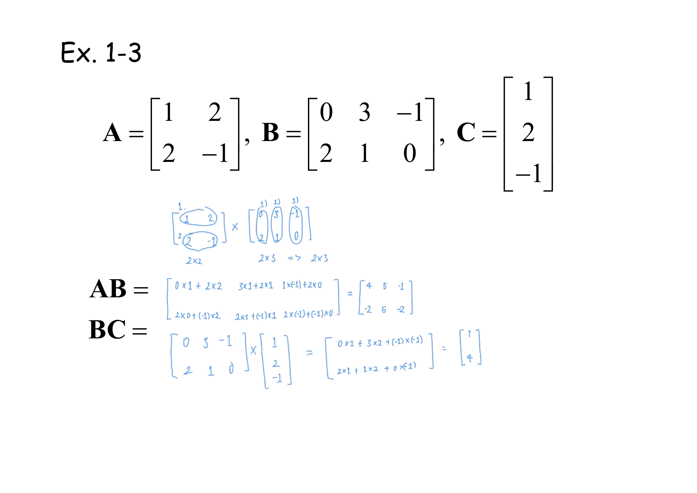
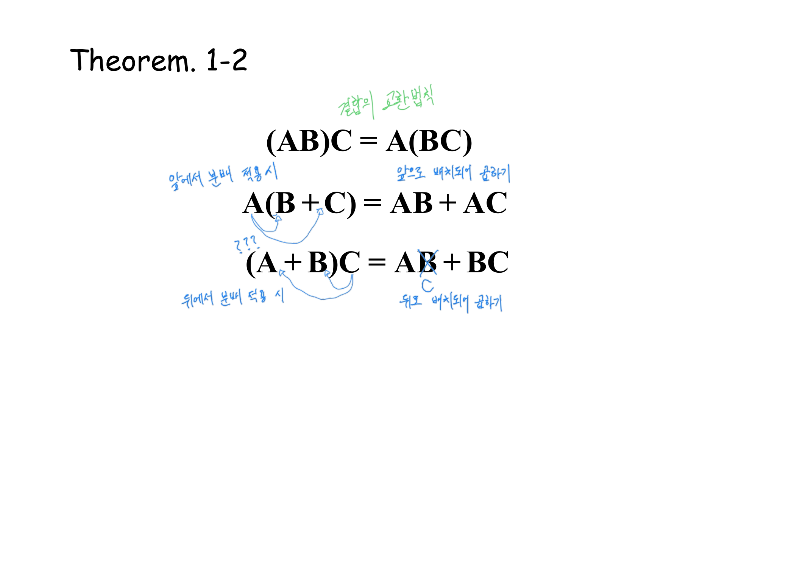
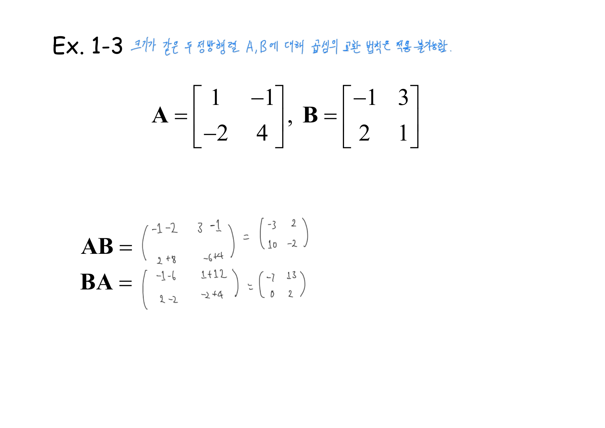
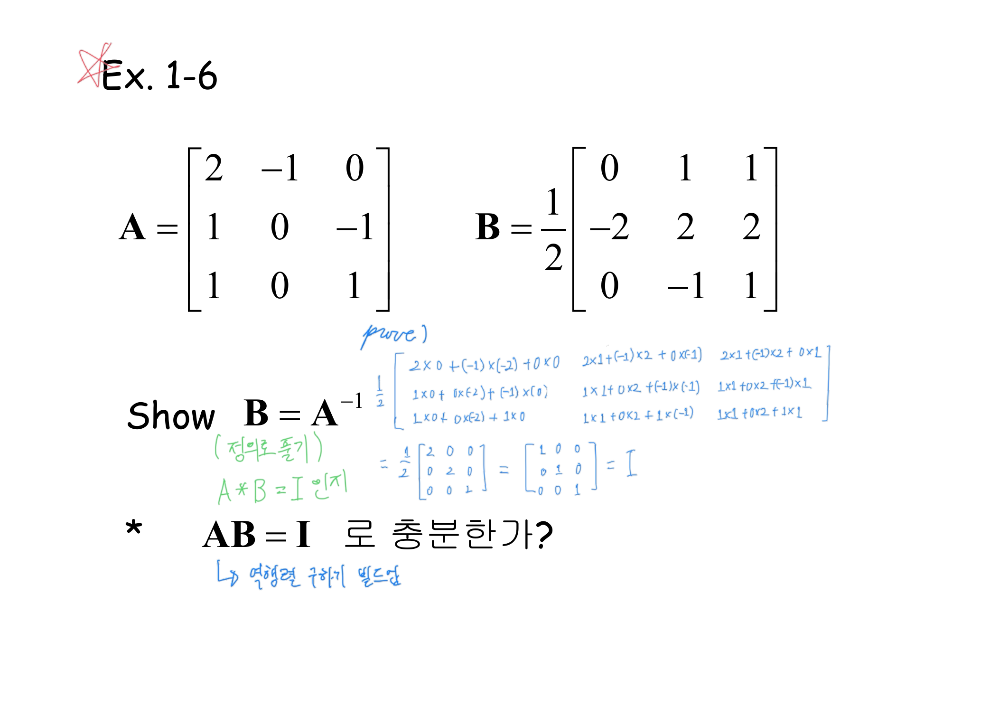
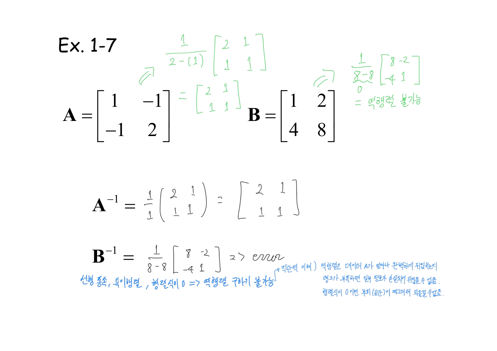
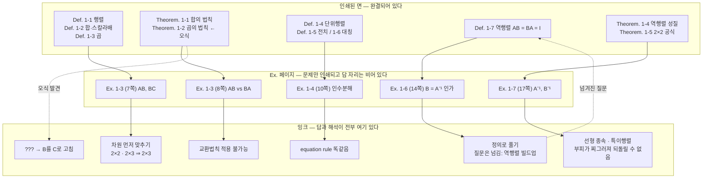

> [!abstract] 이 자료는 텍스트 추출로 읽을 수 없다
> 1장 PDF는 65쪽이고, `pdftotext`가 뽑아내는 글자는 페이지당 평균 **60자**다. 그 60자는 전부 인쇄된 정의·정리의 제목과 수식이고, **실제로 계산이 일어난 흔적은 한 글자도 포함되지 않는다.** 계산은 전부 손글씨이고, 손글씨는 이미지다.
>
> 그래서 이 정리는 **슬라이드를 읽고 필기를 참고하는** 방식이 아니라, 반대로 **필기를 본문으로 삼고 인쇄된 슬라이드를 그 골격으로 두는** 방식으로 썼다.

---

## 빈칸으로 인쇄된 슬라이드

1장의 페이지는 세 종류뿐이다. `Def. 1-n`(정의 28개), `Theorem. 1-n`(정리 21개), 그리고 `Ex. 1-n`이다. 앞의 둘은 완결되어 있다. 문제는 세 번째다.

`Ex.` 페이지를 인쇄 상태 그대로 옮기면 이렇게 생겼다.

```text
Ex. 1-3
                               1
     1 2        0 3 −1         
   A=      , B=        , C=2
      2 −1     2 1 0        −1

  AB =
  BC =
```

`AB =` 다음에 아무것도 없다. `BC =` 다음에도 없다. 7쪽만 그런 게 아니라 8·10·14·17·20·23·24·26·28·30·37·39·46·48·50쪽이 전부 같은 모양이다. **이 자료에서 답이 인쇄된 예제는 한 문제도 없다.**

그리고 실제 파일을 열면 그 빈칸이 이렇게 채워져 있다.



파란 잉크가 먼저 한 일은 계산이 아니다. $A$의 두 행을 세로로 묶고 $B$의 세 열을 세로로 묶은 뒤 `2×2`, `2×3`, `=> 2×3` 이라고 적은 것 — **곱셈이 가능한지, 결과가 몇 행 몇 열인지를 먼저 확정하는 일**이다. 성분 계산은 그다음에 온다.

$$AB=\begin{pmatrix}1\cdot0+2\cdot2 & 1\cdot3+2\cdot1 & 1\cdot(-1)+2\cdot0\\ 2\cdot0+(-1)\cdot2 & 2\cdot3+(-1)\cdot1 & 2\cdot(-1)+(-1)\cdot0\end{pmatrix}=\begin{pmatrix}4&5&-1\\-2&5&-2\end{pmatrix}$$

$$BC=\begin{pmatrix}0&3&-1\\2&1&0\end{pmatrix}\begin{pmatrix}1\\2\\-1\end{pmatrix}=\begin{pmatrix}0+6+1\\2+2+0\end{pmatrix}=\begin{pmatrix}7\\4\end{pmatrix}$$

이 순서 — 차원 먼저, 성분 나중 — 가 `Def. 1-3`이 실제로 말하는 바다. 정의는 $A \in \mathrm{Mat}(m,p)$, $B \in \mathrm{Mat}(p,n)$ 일 때에만 $AB$를 정의하는데, 인쇄된 슬라이드에서 이 $p$의 일치는 그저 기호다. 잉크에서는 그것이 **먼저 확인해야 하는 관문**이 된다. 5쪽 여백에 초록으로 적힌 `m×p 행렬`·`p×n 행렬`·`=> m×n 행렬이 됨`이 같은 말을 한다.

### 차원이 맞는지 직접 확인해 보기

아래는 `Def. 1-3`의 관문을 그대로 구현한 것이다. 두 행렬의 모양을 바꿔 가며 곱이 정의되는지, 정의된다면 $c_{ij}$가 어느 행과 어느 열의 내적인지 확인할 수 있다. 초기값은 위 `Ex. 1-3`의 $A$와 $B$다.

```html preview
<div id="mm-root">
  <style>
    #mm-root{font-family:system-ui,-apple-system,"Segoe UI",sans-serif;color:var(--foreground);padding:4px}
    #mm-root .panel{background:var(--card);border:1px solid var(--border);border-radius:10px;padding:14px;margin-bottom:10px}
    #mm-root .ctl{display:flex;flex-wrap:wrap;gap:14px;align-items:center;font-size:13px;margin-bottom:10px}
    #mm-root label{display:flex;gap:6px;align-items:center}
    #mm-root input[type=number]{width:52px;background:var(--card);color:var(--foreground);border:1px solid var(--border);border-radius:5px;padding:3px 5px;font:inherit}
    #mm-root .grids{display:flex;flex-wrap:wrap;gap:12px;align-items:center;justify-content:center}
    #mm-root table{border-collapse:collapse}
    #mm-root td{border:1px solid var(--border);width:34px;height:30px;text-align:center;font-size:13px;font-variant-numeric:tabular-nums;cursor:pointer}
    #mm-root td.hl{background:color-mix(in srgb,var(--chart-1) 28%,transparent)}
    #mm-root td.out{background:color-mix(in srgb,var(--chart-2) 22%,transparent)}
    #mm-root td.sel{outline:2px solid var(--chart-1);outline-offset:-2px}
    #mm-root .op{font-size:20px;opacity:.65}
    #mm-root .cap{text-align:center;font-size:11px;opacity:.7;margin-top:4px}
    #mm-root .msg{margin-top:10px;padding:9px 11px;border-radius:7px;font-size:13px;line-height:1.55;border:1px solid var(--border)}
    #mm-root .ok{background:color-mix(in srgb,var(--chart-2) 12%,transparent)}
    #mm-root .bad{background:color-mix(in srgb,var(--chart-5) 14%,transparent)}
    #mm-root code{font-family:ui-monospace,SFMono-Regular,Menlo,monospace}
  </style>
  <div class="panel">
    <div class="ctl">
      <label>A: <input type="number" id="m" min="1" max="4" value="2"> × <input type="number" id="p1" min="1" max="4" value="2"></label>
      <label>B: <input type="number" id="p2" min="1" max="4" value="2"> × <input type="number" id="n" min="1" max="4" value="3"></label>
      <button id="reset" style="background:var(--card);color:var(--foreground);border:1px solid var(--border);border-radius:5px;padding:4px 10px;font:inherit;cursor:pointer">Ex. 1-3으로</button>
    </div>
    <div class="grids" id="grids"></div>
    <div class="msg" id="msg"></div>
  </div>
</div>
<script>
(function(){
  var R=document.getElementById('mm-root');
  var A=[[1,2],[2,-1]], B=[[0,3,-1],[2,1,0]], sel=null;
  function dims(){return {m:+R.querySelector('#m').value,p1:+R.querySelector('#p1').value,p2:+R.querySelector('#p2').value,n:+R.querySelector('#n').value};}
  function fit(M,r,c){var o=[];for(var i=0;i<r;i++){o.push([]);for(var j=0;j<c;j++)o[i].push(M[i]&&M[i][j]!==undefined?M[i][j]:0);}return o;}
  function tbl(M,name,cls){
    var t='<div><table data-n="'+name+'">';
    for(var i=0;i<M.length;i++){t+='<tr>';for(var j=0;j<M[i].length;j++){
      t+='<td data-i="'+i+'" data-j="'+j+'" class="'+cls(i,j)+'">'+M[i][j]+'</td>';}t+='</tr>';}
    return t+'</table><div class="cap">'+name+' ('+M.length+'×'+M[0].length+')</div></div>';
  }
  function render(){
    var d=dims(); A=fit(A,d.m,d.p1); B=fit(B,d.p2,d.n);
    var ok=(d.p1===d.p2), g=R.querySelector('#grids'), msg=R.querySelector('#msg');
    var si=sel?sel[0]:-1, sj=sel?sel[1]:-1;
    var h=tbl(A,'A',function(i,j){return (ok&&si===i)?'hl':'';})+'<div class="op">×</div>'+
          tbl(B,'B',function(i,j){return (ok&&sj===j)?'hl':'';});
    if(ok){
      var C=[];for(var i=0;i<d.m;i++){C.push([]);for(var j=0;j<d.n;j++){var s=0;for(var k=0;k<d.p1;k++)s+=A[i][k]*B[k][j];C[i].push(s);}}
      h+='<div class="op">=</div>'+tbl(C,'AB',function(i,j){return (si===i&&sj===j)?'sel out':'out';});
    }
    g.innerHTML=h;
    if(!ok){
      msg.className='msg bad';
      msg.innerHTML='<b>곱이 정의되지 않는다.</b> A의 열 수 '+d.p1+' 과 B의 행 수 '+d.p2+' 가 다르다. <code>Def. 1-3</code>은 A ∈ Mat(m,<b>p</b>), B ∈ Mat(<b>p</b>,n) 일 때에만 AB를 정의한다 — 가운데 p가 맞아떨어져야 한다.';
    }else{
      var t='<b>('+d.m+'×'+d.p1+')('+d.p2+'×'+d.n+') → '+d.m+'×'+d.n+'.</b> 가운데 '+d.p1+'이 사라지고 바깥 두 수만 남는다.';
      if(sel){
        var i=sel[0],j=sel[1],parts=[],s=0;
        for(var k=0;k<d.p1;k++){parts.push(A[i][k]+'·'+B[k][j]);s+=A[i][k]*B[k][j];}
        t+='<br>결과의 <b>'+(i+1)+'행 '+(j+1)+'열</b> = A의 '+(i+1)+'행 · B의 '+(j+1)+'열 = <code>'+parts.join(' + ')+' = '+s+'</code>';
      }else{
        t+='<br><span style="opacity:.75">결과 행렬의 칸을 눌러 보면 그 칸이 A의 어느 행과 B의 어느 열에서 왔는지 보인다.</span>';
      }
      msg.className='msg ok'; msg.innerHTML=t;
    }
  }
  R.addEventListener('input',function(){sel=null;render();});
  R.addEventListener('click',function(e){
    var td=e.target.closest('td'); if(td&&td.closest('table').dataset.n==='AB'){sel=[+td.dataset.i,+td.dataset.j];render();return;}
    if(e.target.id==='reset'){A=[[1,2],[2,-1]];B=[[0,3,-1],[2,1,0]];
      R.querySelector('#m').value=2;R.querySelector('#p1').value=2;R.querySelector('#p2').value=2;R.querySelector('#n').value=3;sel=null;render();}
  });
  render();
})();
</script>
```

---

## 6쪽 — 인쇄가 틀렸고, 잉크가 그것을 잡았다

`Theorem. 1-2`는 곱셈의 결합법칙과 분배법칙 세 줄이다. 인쇄된 그대로 옮기면 이렇다.

```text
Theorem. 1-2
               (AB)C = A(BC)
           A(B + C) = AB + AC
           (A + B)C = AB + BC
```

세 번째 줄이 틀렸다. $(A+B)C$를 전개하면 $AC + BC$ 이지, $AB + BC$가 아니다. 왼쪽에 $B$가 등장하지 않았는데 오른쪽 첫 항이 $AB$일 수는 없다.



> [!caution] 원본 오류 ① — 6쪽 `Theorem. 1-2`의 분배법칙
> 인쇄된 `(A + B)C = AB + BC` 에서 우변 첫 항은 **`AC`** 여야 한다. 그리고 이 오식은 **원본 파일 안에서 이미 발견되어 있다** — 세 번째 줄 오른쪽의 `B` 글자에 파란 펜으로 사선이 그어져 있고 그 아래에 `C`가 새로 적혀 있으며, 줄 왼쪽에는 `???` 가 붙어 있다.
>
> 같은 잉크가 두 줄에 화살표를 그려 넣어 규칙을 요약했다. 둘째 줄에는 「앞에서 분배 적용 시 / 앞으로 배치되어 곱하기」, 셋째 줄에는 「뒤에서 분배 적용 시 / 뒤로 배치되어 곱하기」. 행렬 곱은 교환법칙이 없으므로 **분배를 할 때 공통 인자가 앞에 있었는지 뒤에 있었는지가 그대로 보존되어야 한다**는 것이 이 정리의 전부이고, 인쇄된 오식은 정확히 그 보존을 어긴 것이다.

이 한 장이 자료를 읽는 법을 정해 준다. 인쇄된 면은 검증되지 않았고, 검증은 잉크에서 일어났다. 아래 나머지 장들에서도 계속 같은 일이 벌어진다.

곱셈이 교환법칙을 갖지 않는다는 사실 자체는 바로 다음 장에서 숫자로 확인된다.



$$A=\begin{pmatrix}1&-1\\-2&4\end{pmatrix},\quad B=\begin{pmatrix}-1&3\\2&1\end{pmatrix}$$

$$AB=\begin{pmatrix}-3&2\\10&-2\end{pmatrix},\qquad BA=\begin{pmatrix}-7&13\\0&2\end{pmatrix}$$

네 성분이 전부 다르다. 크기가 같은 정방행렬이라 **곱이 양쪽 다 정의되는데도** 결과가 다르다는 것이 요점이다 — 차원 때문에 못 하는 게 아니라, 할 수 있는데 값이 다르다.

> [!warning] 원본 오류 ② — 같은 번호 `Ex. 1-3`이 두 번
> 7쪽과 8쪽이 **둘 다 `Ex. 1-3`** 이다. 7쪽은 $2\times2$ 와 $2\times3$의 곱(차원 맞추기), 8쪽은 $2\times2$ 두 개의 $AB$와 $BA$(교환법칙)로 내용이 완전히 다르다. 1장 안에서 예제 번호가 중복되는 유일한 자리다.

---

## 단위행렬은 곱셈에서만 편한 것이 아니다

`Def. 1-4`가 단위행렬 $I_n = (\delta_{ij})$를 정의하고 $AI = IA = A$를 붙인다. 그 바로 다음 10쪽 `Ex. 1-4`는 갑자기 인수분해 두 줄을 던진다.

$$A^2 - I = (A+I)(A-I),\qquad A^3 + I = (A+I)(A^2 - A + I)$$

잉크는 제목 옆에 딱 한 마디만 적었다 — 「equation rule 똑같음」. 숫자에서 쓰던 인수분해 공식이 행렬에서도 그대로 통한다는 뜻이다.

그런데 이게 왜 통하는지가 앞 장과 정확히 맞물린다. 우변을 전개하면

$$(A+I)(A-I) = A^2 - AI + IA - I^2 = A^2 - A + A - I = A^2 - I$$

가운데 두 항이 지워진 이유는 $AI = IA$, 즉 **$A$와 $I$가 교환되기 때문**이다. 8쪽이 방금 $AB \ne BA$를 보였는데, 여기서는 상쇄가 일어난다. 일반적인 두 행렬 $A$, $B$에 대해 $(A+B)(A-B) = A^2 - AB + BA - B^2$ 이고 가운데가 지워지지 않으므로 $A^2 - B^2$이 **아니다**. $I$가 특별해서 되는 것이다.

인쇄된 슬라이드는 이 이유를 한 줄도 적지 않는다. 8쪽과 10쪽을 나란히 놓고 읽어야 보이는 연결이고, 그 배치를 만든 것이 잉크의 「equation rule 똑같음」이다.

---

## 14쪽 — 슬라이드가 던지고 답하지 않은 질문

`Def. 1-7`은 역행렬을 $AB = BA = I$ 로 정의한다. **양쪽 다** 요구한다. 그리고 `Ex. 1-6`이 구체적인 두 행렬을 주고 $B = A^{-1}$임을 보이라고 한 뒤, 맨 아래에 이렇게 묻는다.

> `*  AB = I  로 충분한가?`



잉크는 $AB$를 아홉 성분 전부 전개해서 보였다.

$$A=\begin{pmatrix}2&-1&0\\1&0&-1\\1&0&1\end{pmatrix},\quad B=\frac{1}{2}\begin{pmatrix}0&1&1\\-2&2&2\\0&-1&1\end{pmatrix},\quad AB=\frac{1}{2}\begin{pmatrix}2&0&0\\0&2&0\\0&0&2\end{pmatrix}=I$$

초록 잉크가 옆에 「정의로 풀기 / $A * B = I$ 인지」라고 적어 방법을 이름 붙였다. 그런데 **맨 아래 질문에는 답이 없다.** 그 자리에 적힌 것은 파란 화살표와 「역행렬 구하기 빌드업」 한 줄뿐이다. 즉 이 질문은 답해진 것이 아니라 **다음 절로 넘겨진 것**이다.

> [!note] 넘겨진 질문의 실제 답 — 보충
> 이 답은 원본 어디에도 적혀 있지 않다. 다만 정방행렬에 한해 **「$AB = I$ 이면 $BA = I$ 이다」가 성립**하고, 그 증명은 이 자료가 나중에 확보하는 도구로 가능하다. $AB = I$ 이면 21쪽 `Theorem. 1-6`의 $\det(AB) = \det A \cdot \det B$ 에 의해 $\det A \cdot \det B = \det I = 1$ 이므로 $\det A \ne 0$ 이고, 22쪽 `Theorem. 1-7`의 수반행렬 공식이 $A^{-1}$의 존재를 준다. 그러면 $B = IB = (A^{-1}A)B = A^{-1}(AB) = A^{-1}$ 이 되어 $BA = I$ 도 따라온다.
>
> 정방행렬이 아니면 무너진다. $A = \begin{pmatrix}1&0&0\\0&1&0\end{pmatrix}$, $B = \begin{pmatrix}1&0\\0&1\\0&0\end{pmatrix}$ 이면 $AB = I_2$ 이지만 $BA = \begin{pmatrix}1&0&0\\0&1&0\\0&0&0\end{pmatrix} \ne I_3$ 이다. 그래서 `Def. 1-7`이 양쪽을 다 쓴 것은 낭비가 아니라, **정방이라는 전제를 빼면 실제로 필요한 조건**이다.

---

## 17쪽 — $\det = 0$ 에서 멈추는 자리

`Theorem. 1-5`가 $2\times2$ 역행렬 공식을 준다.

$$A=\begin{pmatrix}a_{11}&a_{12}\\a_{21}&a_{22}\end{pmatrix}\ \Longrightarrow\ A^{-1}=\frac{1}{a_{11}a_{22}-a_{12}a_{21}}\begin{pmatrix}a_{22}&-a_{12}\\-a_{21}&a_{11}\end{pmatrix}$$

`Ex. 1-7`은 이 공식에 두 행렬을 넣는다. 하나는 되고, 하나는 안 된다.



$$A=\begin{pmatrix}1&-1\\-1&2\end{pmatrix},\ \ a_{11}a_{22}-a_{12}a_{21}=2-1=1,\ \ A^{-1}=\begin{pmatrix}2&1\\1&1\end{pmatrix}$$

$$B=\begin{pmatrix}1&2\\4&8\end{pmatrix},\ \ a_{11}a_{22}-a_{12}a_{21}=8-8=0,\ \ B^{-1}=\frac{1}{0}\begin{pmatrix}8&-2\\-4&1\end{pmatrix}\ \Rightarrow\ \textsf{error}$$

여기서 잉크가 두 갈래로 갈린다. 파란 잉크는 **사실**을 적었다 — 「선형 종속, 특이행렬, 행렬식이 0 ⇒ 역행렬 구하기 불가능」. 그 오른쪽에 같은 파란 펜이 「직관적 이해」라는 머리말을 달고 세 줄을 덧붙였다.

> 역행렬은 데이터 $A$가 얼마나 완벽하게 뒤집히는지
> 랭크가 부족하면 일부 정보가 손실되어 뒤집을 수 없음
> **행렬식이 0이면 부피(공간)가 찌그러져 되돌릴 수 없음**

세 번째 줄이 이 장에서 가장 멀리 가는 문장이다. 인쇄된 슬라이드는 $\det$를 18쪽에 가서야 정의하고, 그때도 여인자 전개라는 **계산 절차**로만 정의한다. 「부피」라는 말은 1장 65쪽 어디에도 인쇄되어 있지 않다. 그런데 그 해석이 17쪽 여백에 미리 적혀 있고, 실제로 그것이 $\det = 0$ 이 왜 치명적인지를 설명하는 유일한 문장이다.

$B$가 왜 찌그러지는지는 숫자로 바로 보인다. $B$의 두 열 $(1,4)$ 와 $(2,8)$ 은 $2 \times (1,4) = (2,8)$ 로 **한 직선 위에 있다**. 두 열이 평행하면 $B$가 평면 전체를 그 직선 하나로 눌러 버리고, 눌린 것은 되돌릴 수 없다.

### 행렬식이 0이 되는 순간을 직접 보기

아래는 단위정사각형의 네 꼭짓점을 $2\times2$ 행렬로 보낸 결과다. 슬라이더를 움직여 $\det$가 0을 지나가게 하면, 넓이가 0으로 찌그러졌다가 뒤집히는 것을 볼 수 있다. `Ex. 1-7`의 $A$와 $B$ 버튼으로 원본의 두 행렬을 바로 넣을 수 있다.

```html preview
<div id="dv-root">
  <style>
    #dv-root{font-family:system-ui,-apple-system,"Segoe UI",sans-serif;color:var(--foreground);padding:4px}
    #dv-root .panel{background:var(--card);border:1px solid var(--border);border-radius:10px;padding:14px}
    #dv-root .wrap{display:flex;flex-wrap:wrap;gap:16px;align-items:flex-start}
    #dv-root .ctls{flex:1 1 230px;min-width:220px;font-size:13px}
    #dv-root .row{display:flex;align-items:center;gap:8px;margin:7px 0}
    #dv-root .row span{width:28px;opacity:.75;font-variant-numeric:tabular-nums}
    #dv-root input[type=range]{flex:1;accent-color:var(--chart-1);min-width:80px}
    #dv-root .val{width:42px;text-align:right;font-variant-numeric:tabular-nums}
    #dv-root svg{flex:0 0 auto;max-width:100%}
    #dv-root button{background:var(--card);color:var(--foreground);border:1px solid var(--border);border-radius:5px;padding:4px 9px;font:inherit;font-size:12px;cursor:pointer;margin-right:6px}
    #dv-root .out{margin-top:11px;padding:9px 11px;border:1px solid var(--border);border-radius:7px;font-size:13px;line-height:1.6}
    #dv-root code{font-family:ui-monospace,SFMono-Regular,Menlo,monospace}
  </style>
  <div class="panel">
    <div class="wrap">
      <svg id="dv-svg" width="290" height="290" viewBox="0 0 290 290" role="img" aria-label="단위정사각형이 행렬에 의해 옮겨진 모습"></svg>
      <div class="ctls">
        <div class="row"><span>a</span><input type="range" id="a" min="-3" max="3" step="0.1" value="1"><b class="val" id="av">1.0</b></div>
        <div class="row"><span>b</span><input type="range" id="b" min="-3" max="3" step="0.1" value="-1"><b class="val" id="bv">-1.0</b></div>
        <div class="row"><span>c</span><input type="range" id="c" min="-3" max="3" step="0.1" value="-1"><b class="val" id="cv">-1.0</b></div>
        <div class="row"><span>d</span><input type="range" id="d" min="-3" max="3" step="0.1" value="2"><b class="val" id="dv">2.0</b></div>
        <div style="margin-top:9px">
          <button data-m="1,-1,-1,2">Ex.1-7의 A</button>
          <button data-m="1,2,4,8">Ex.1-7의 B</button>
        </div>
        <div class="out" id="dv-out"></div>
      </div>
    </div>
  </div>
</div>
<script>
(function(){
  var R=document.getElementById('dv-root'),svg=R.querySelector('#dv-svg');
  var S=32,OX=145,OY=145;
  function X(x){return OX+x*S;} function Y(y){return OY-y*S;}
  function draw(){
    var a=+R.querySelector('#a').value,b=+R.querySelector('#b').value,
        c=+R.querySelector('#c').value,d=+R.querySelector('#d').value;
    R.querySelector('#av').textContent=a.toFixed(1);R.querySelector('#bv').textContent=b.toFixed(1);
    R.querySelector('#cv').textContent=c.toFixed(1);R.querySelector('#dv').textContent=d.toFixed(1);
    var det=a*d-b*c;
    var P=[[0,0],[1,0],[1,1],[0,1]].map(function(p){return [a*p[0]+b*p[1], c*p[0]+d*p[1]];});
    var g='';
    for(var k=-4;k<=4;k++){
      g+='<line x1="'+X(k)+'" y1="0" x2="'+X(k)+'" y2="290" stroke="var(--border)" stroke-width="'+(k===0?1.4:0.5)+'"/>';
      g+='<line x1="0" y1="'+Y(k)+'" x2="290" y2="'+Y(k)+'" stroke="var(--border)" stroke-width="'+(k===0?1.4:0.5)+'"/>';
    }
    g+='<polygon points="'+[[0,0],[1,0],[1,1],[0,1]].map(function(p){return X(p[0])+','+Y(p[1]);}).join(' ')+
       '" fill="none" stroke="var(--foreground)" stroke-width="1.2" stroke-dasharray="4 3" opacity="0.55"/>';
    g+='<polygon points="'+P.map(function(p){return X(p[0])+','+Y(p[1]);}).join(' ')+
       '" fill="var(--chart-1)" fill-opacity="'+(Math.abs(det)<0.02?0.05:0.25)+'" stroke="var(--chart-1)" stroke-width="2"/>';
    var cols=[[a,c],[b,d]];
    cols.forEach(function(v,i){
      g+='<line x1="'+X(0)+'" y1="'+Y(0)+'" x2="'+X(v[0])+'" y2="'+Y(v[1])+'" stroke="var(--chart-'+(i+2)+')" stroke-width="2.4"/>';
      g+='<circle cx="'+X(v[0])+'" cy="'+Y(v[1])+'" r="3.4" fill="var(--chart-'+(i+2)+')"/>';
    });
    svg.innerHTML=g;
    var o=R.querySelector('#dv-out'),near=Math.abs(det)<0.02;
    var t='<b>det = '+a.toFixed(1)+'·'+d.toFixed(1)+' − '+b.toFixed(1)+'·'+c.toFixed(1)+' = <span style="color:var(--chart-1)">'+det.toFixed(2)+'</span></b>';
    t+='<br>넓이 1의 정사각형(점선)이 넓이 <b>'+Math.abs(det).toFixed(2)+'</b> 로 바뀌었다.';
    if(near){t+='<br><b>두 열이 한 직선 위에 있다.</b> 평면 전체가 직선 하나로 눌렸다 — <code>Ex. 1-7</code>의 B가 정확히 이 상태이고, 눌린 것은 되돌릴 수 없으므로 역행렬이 없다.';}
    else if(det<0){t+='<br>det가 음수다 — 도형이 <b>뒤집혔다</b>. 넓이는 남아 있으므로 역행렬은 존재한다.';}
    else{t+='<br>det ≠ 0 이므로 역행렬이 존재한다.';}
    o.innerHTML=t;
  }
  R.addEventListener('input',draw);
  R.addEventListener('click',function(e){
    if(!e.target.dataset.m) return;
    var v=e.target.dataset.m.split(',');
    ['a','b','c','d'].forEach(function(id,i){R.querySelector('#'+id).value=v[i];});
    draw();
  });
  draw();
})();
</script>
```

여기서 `Ex.1-7의 B` 를 누르면 슬라이더가 $a{=}1, b{=}2, c{=}4, d{=}8$ 로 가고 도형이 선 하나로 눌린다. 「부피가 찌그러져 되돌릴 수 없음」이라는 17쪽 여백의 한 줄이 그 그림이다.

---

## 1~17쪽의 구조

인쇄된 면과 잉크가 하는 일이 어떻게 갈리는지를 정리하면 이렇다.



이 그림에서 눈에 띄는 것은 **화살표가 전부 한 방향**이라는 점이다. 인쇄된 정의가 예제를 낳고, 예제의 답은 잉크에만 있다. 반대 방향 화살표는 두 개뿐인데, 하나는 오식 수정이고 하나는 14쪽이 답하지 않고 넘긴 질문이다.

---

## 다음으로

18쪽부터 행렬식이 시작된다. 17쪽에서 「부피」라는 말이 먼저 나왔지만, 인쇄된 `Def. 1-8`은 부피를 말하지 않고 여인자 전개라는 **계산 절차**로 행렬식을 정의한다. 그 간격 — 하나의 수가 무엇을 뜻하는가와 그것을 어떻게 구하는가 — 이 다음 정리의 주제다.

- [02. 행렬식 하나가 대답하는 세 가지 질문](./02.%20행렬식%20하나가%20대답하는%20세%20가지%20질문.md) — 18~39쪽. $\det$·가우스 소거·선형변환
- [03. 잉크가 끊겼다 되살아나는 자리](./03.%20잉크가%20끊겼다%20되살아나는%20자리.md) — 40~65쪽. 벡터공간에서 고윳값을 지나 볼록성으로
- [01/data-structures](../../../01_programming-foundations/data-structures/README.md) — 배열과 2차원 인덱싱의 구현 쪽 배경

---

## 근거 자료

| 쪽 | 인쇄된 것 | 잉크가 더한 것 |
| --- | --- | --- |
| 1 | 표지 `최적화 수학 / 1. Matrix` | — |
| 2 | `Def. 1-1` 행렬의 정의, `Square matrix: m = n` | 「= 정방행렬」 |
| 3–4 | `Def. 1-2` 합·차·스칼라배, `Theorem. 1-1` | — |
| 5 | `Def. 1-3` 곱의 정의, $c_{ij} = \sum a_{ik}b_{kj}$ | 「행렬의 곱」, `m×p 행렬`·`p×n 행렬`·`m×n 행렬이 됨` |
| **6** | `Theorem. 1-2` — **세 번째 줄 오식** | **`???` 와 B→C 수정**, 앞/뒤 분배 규칙 |
| **7** | `Ex. 1-3` $A$,$B$,$C$ 와 빈 `AB =`·`BC =` | 차원 묶기 `2×2 · 2×3 ⇒ 2×3`, 전 성분 전개 |
| **8** | `Ex. 1-3`(중복 번호) $A$,$B$ 와 빈 `AB =`·`BA =` | 「곱셈의 교환 법칙은 적용 불가능함」, 두 답 |
| 9 | `Def. 1-4` 단위행렬 | — |
| 10 | `Ex. 1-4` 두 인수분해 | 「equation rule 똑같음」 |
| 11–13 | `Def. 1-5` 전치, `Theorem. 1-3`, `Def. 1-6` 대칭 | — |
| **14** | `Def. 1-7`·`Ex. 1-6`, 그리고 `AB = I 로 충분한가?` | $AB$ 9성분 전개, 「정의로 풀기」, **질문은 「역행렬 빌드업」으로 넘김** |
| 15–16 | `Theorem. 1-4` 역행렬 성질, `Theorem. 1-5` 2×2 공식 | — |
| **17** | `Ex. 1-7` $A$, $B$ 와 빈 `A⁻¹ =`·`B⁻¹ =` | $A^{-1}$, $B^{-1}$의 `error`, 「선형 종속·특이행렬」, **「부피가 찌그러져 되돌릴 수 없음」** |

추출 번들: `.ok/local/pdf-extract/02_math-theory__optimization-math__MSC087_1장_행렬_v3/`
(65쪽 전부 180 dpi로 렌더해 확인. `meta.json`의 `page_chars` 기준 0자 페이지는 64쪽 한 장뿐이지만, **본문에서 인용한 모든 손글씨는 텍스트 추출에 전혀 잡히지 않는다** — 인쇄된 글자만 세어진 수치이기 때문이다.)

인터랙티브에 쓴 수치는 전부 위 표의 원본 값이며, 행렬 곱·행렬식·역행렬 결과는 파이썬 정수·분수 연산으로 재계산해 손글씨와 대조했다.
