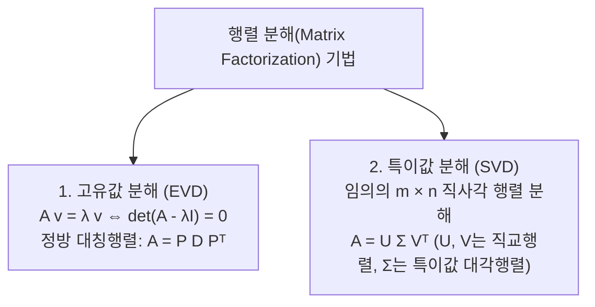

> [!abstract] 핵심 요약
> **선형대수학(Linear Algebra)**은 다차원 데이터 공간에서 선형 변환(Linear Transformation)을 수학적으로 다루는 도구이다.
> 행렬의 가역성(Invertibility, $\det(A) \neq 0$), 특성방정식을 통한 **고유값 분해(Eigenvalue Decomposition: $A\mathbf{v} = \lambda \mathbf{v}$)**, 그리고 직교 기저 기반의 **특이값 분해(Singular Value Decomposition: $A = U \Sigma V^T$)**는 주성분 분석(PCA), 차원 축소 및 신경망 최적화의 핵심 기반이다.

---

## 1. 2x2 행렬식(Determinant)과 역행렬(Inverse Matrix)

$$A = \begin{bmatrix} a & b \\ c & d \end{bmatrix}, \quad \det(A) = ad - bc$$

$$\det(A) \neq 0 \iff A^{-1} = \frac{1}{ad - bc} \begin{bmatrix} d & -b \\ -c & a \end{bmatrix}$$

---

## 2. 고유값 분해(EVD)와 특이값 분해(SVD) 수식 체계



### 1) 특성방정식과 2x2 고유값 공식
$$\det(A - \lambda I) = \lambda^2 - \text{tr}(A)\lambda + \det(A) = 0$$
$$\lambda_{1, 2} = \frac{\text{tr}(A) \pm \sqrt{\text{tr}(A)^2 - 4\det(A)}}{2} \quad (\text{단, } \text{tr}(A) = a + d)$$

### 2) 특이값 분해 (SVD)
$$A = U \Sigma V^T = \sum_{i=1}^r \sigma_i \mathbf{u}_i \mathbf{v}_i^T \quad (\sigma_i = \sqrt{\lambda_i(A^T A)})$$

---

## 3. 실시간 2x2 행렬식 및 고유값(Eigenvalue) 시뮬레이터

```html preview
<div style="font-family:system-ui,-apple-system,sans-serif;padding:20px;background:var(--card);color:var(--card-foreground);border:1px solid var(--border);border-radius:var(--radius)">
  <div style="font-size:16px;font-weight:700;margin-bottom:14px;color:var(--primary);display:flex;align-items:center;gap:8px">
    <span>📐 2x2 행렬식(det), 대각합(trace) & 고유값(λ) 실시간 계산기</span>
  </div>

  <div style="display:flex;gap:12px;margin-bottom:14px;align-items:center">
    <div style="display:grid;grid-template-columns:1fr 1fr;gap:6px;width:140px">
      <input id="mA" type="number" value="4" style="padding:6px;text-align:center;background:var(--background);color:var(--foreground);border:1px solid var(--border);border-radius:var(--radius);font-weight:700" />
      <input id="mB" type="number" value="1" style="padding:6px;text-align:center;background:var(--background);color:var(--foreground);border:1px solid var(--border);border-radius:var(--radius);font-weight:700" />
      <input id="mC" type="number" value="2" style="padding:6px;text-align:center;background:var(--background);color:var(--foreground);border:1px solid var(--border);border-radius:var(--radius);font-weight:700" />
      <input id="mD" type="number" value="3" style="padding:6px;text-align:center;background:var(--background);color:var(--foreground);border:1px solid var(--border);border-radius:var(--radius);font-weight:700" />
    </div>
    <div style="flex:1;font-size:11px;color:var(--muted-foreground)">
      행렬 $\begin{bmatrix} a & b \\ c & d \end{bmatrix}$의 원소를 변경하면 실시간으로 고유값과 가역성이 계산됩니다.
    </div>
  </div>

  <div style="display:grid;grid-template-columns:repeat(3, 1fr);gap:8px;margin-bottom:12px">
    <div style="padding:8px;background:var(--background);border:1px solid var(--border);border-radius:var(--radius);text-align:center">
      <div style="font-size:10px;color:var(--muted-foreground)">대각합 trace(A)</div>
      <div id="resTrace" style="font-size:14px;font-weight:700;color:var(--chart-1)"></div>
    </div>
    <div style="padding:8px;background:var(--background);border:1px solid var(--border);border-radius:var(--radius);text-align:center">
      <div style="font-size:10px;color:var(--muted-foreground)">행렬식 det(A)</div>
      <div id="resDet" style="font-size:14px;font-weight:700;color:var(--chart-2)"></div>
    </div>
    <div style="padding:8px;background:var(--background);border:1px solid var(--border);border-radius:var(--radius);text-align:center">
      <div style="font-size:10px;color:var(--muted-foreground)">가역성 (Invertible)</div>
      <div id="resInv" style="font-size:14px;font-weight:700;color:var(--chart-3)"></div>
    </div>
  </div>

  <div style="padding:10px;background:var(--background);border:1px solid var(--primary);border-radius:var(--radius);font-size:12px">
    <div style="font-weight:700;color:var(--primary);margin-bottom:4px">고유값 (Eigenvalues λ₁, λ₂):</div>
    <div id="resEigen" style="font-family:monospace;font-size:13px;font-weight:700;color:var(--foreground)"></div>
  </div>

  <script>
    var inA = document.getElementById('mA');
    var inB = document.getElementById('mB');
    var inC = document.getElementById('mC');
    var inD = document.getElementById('mD');

    function calcMatrix() {
      var a = parseFloat(inA.value) || 0;
      var b = parseFloat(inB.value) || 0;
      var c = parseFloat(inC.value) || 0;
      var d = parseFloat(inD.value) || 0;

      var tr = a + d;
      var det = (a * d) - (b * c);

      document.getElementById('resTrace').textContent = tr;
      document.getElementById('resDet').textContent = det;
      document.getElementById('resInv').textContent = (det !== 0) ? "가역 (det≠0)" : "비가역 (특이행렬)";

      var disc = tr * tr - 4 * det;
      var eigenStr = "";
      if (disc >= 0) {
        var l1 = ((tr + Math.sqrt(disc)) / 2).toFixed(3);
        var l2 = ((tr - Math.sqrt(disc)) / 2).toFixed(3);
        eigenStr = "λ₁ = " + l1 + " ,  λ₂ = " + l2 + " (실수 고유값)";
      } else {
        var realPart = (tr / 2).toFixed(3);
        var imgPart = (Math.sqrt(-disc) / 2).toFixed(3);
        eigenStr = "λ = " + realPart + " ± " + imgPart + "i (복소수 켤레 고유값)";
      }
      document.getElementById('resEigen').textContent = eigenStr;
    }

    [inA, inB, inC, inD].forEach(function(el) {
      el.addEventListener('input', calcMatrix);
    });
    calcMatrix();
  </script>
</div>
```
