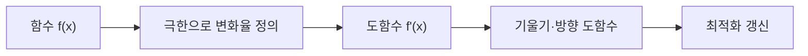

미적분 자료는 주요 함수 공식과 극한에서 시작해 도함수, 곱의 미분, 합성함수 미분으로 이어진다. 최적화에서는 함수의 변화율인 도함수가 이동 방향을 결정한다.



<Tabs>
  <Tab label="공식">로그·지수·삼각함수의 합각 공식과 기본 도함수를 참조한다.</Tab>
  <Tab label="극한">n이 무한대로 갈 때 (1+1/n)ⁿ→e, sin(h)/h→1 같은 극한을 다룬다.</Tab>
  <Tab label="미분">곱의 미분 (fg)'=f'g+fg'와 합성함수의 연쇄 규칙을 적용한다.</Tab>
</Tabs>

| 개념 | 최적화에서의 역할 |
| --- | --- |
| 극한 | 순간 변화율의 정의 |
| 도함수 | 함수값 증가·감소 방향 |
| 방향 도함수 | 특정 벡터 방향의 변화율 |
| 그래디언트 | 다변수에서 가장 가파른 증가 방향 |

```html preview
<div style="font-family:system-ui,sans-serif;padding:20px;color:var(--foreground)">
<label for="amt" style="font-size:14px;font-weight:600">미적분 절</label>
<div id="out" style="font-size:30px;font-weight:700;color:var(--chart-1);margin:6px 0">1절</div>
<input id="amt" type="range" min="1" max="4" step="1" value="1" style="width:100%;accent-color:var(--primary)" />
<p style="font-size:13px;color:var(--muted-foreground)">원본 장의 순서를 움직여 계산 단계를 확인한다.</p>
<script>
var amt=document.getElementById('amt'); var out=document.getElementById('out');
amt.addEventListener('input',function(){out.textContent=Number(amt.value).toLocaleString()+'절';});
</script>
</div>
```

> [!IMPORTANT]
> 도함수 기호와 함수값을 혼동하지 않는다. 자료의 식을 적용할 때 변수와 평가 지점을 먼저 지정한다.

<details>
<summary>계산 점검</summary>

곱·합성·로그·지수 항을 분해해 각각 미분한 뒤, 마지막에 항을 합친다. 다변수 식은 각 변수에 대한 편미분을 모아 그래디언트를 만든다.

</details>

<!-- source: MCS087 calculus deck; formulas and derivative sequence preserved -->