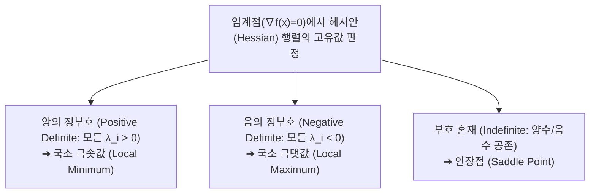

> [!abstract] 핵심 요약
> **다변수 미적분학(Multivariable Calculus)**은 기계학습 손실 함수(Loss Surface)의 지형을 분석하고 최적화 경로를 안내하는 나침반이다.
> 스칼라 함수의 기울기 벡터인 **그레이디언트($\nabla f(\mathbf{x})$)**는 함수값이 가장 가파르게 증가하는 방향을 가리키며, 2계 도함수 행렬인 **헤시안($H = \nabla^2 f(\mathbf{x})$)**의 고유값 부호는 극솟값, 극댓값, 그리고 학습을 정체시키는 **안장점(Saddle Point)**을 수학적으로 판정한다.

---

## 1. 그레이디언트(Gradient)와 야코비안(Jacobian) 행렬

### 1) 그레이디언트 벡터 (스칼라 함수 $f: \mathbb{R}^n \to \mathbb{R}$)
$$\nabla f(\mathbf{x}) = \begin{bmatrix} \frac{\partial f}{\partial x_1} \\ \frac{\partial f}{\partial x_2} \\ \vdots \\ \frac{\partial f}{\partial x_n} \end{bmatrix} \in \mathbb{R}^n$$

### 2) 야코비안 행렬 (벡터 함수 $\mathbf{f}: \mathbb{R}^n \to \mathbb{R}^m$)
$$J = \frac{\partial \mathbf{f}}{\partial \mathbf{x}} = \begin{bmatrix} \frac{\partial f_1}{\partial x_1} & \cdots & \frac{\partial f_1}{\partial x_n} \\ \vdots & \ddots & \vdots \\ \frac{\partial f_m}{\partial x_1} & \cdots & \frac{\partial f_m}{\partial x_n} \end{bmatrix} \in \mathbb{R}^{m \times n}$$

---

## 2. 헤시안(Hessian) 행렬과 2차 테일러 전개

$$H = \nabla^2 f(\mathbf{x}) = \begin{bmatrix} \frac{\partial^2 f}{\partial x_1^2} & \frac{\partial^2 f}{\partial x_1 \partial x_2} & \cdots & \frac{\partial^2 f}{\partial x_1 \partial x_n} \\ \frac{\partial^2 f}{\partial x_2 \partial x_1} & \frac{\partial^2 f}{\partial x_2^2} & \cdots & \frac{\partial^2 f}{\partial x_2 \partial x_n} \\ \vdots & \vdots & \ddots & \vdots \\ \frac{\partial^2 f}{\partial x_n \partial x_1} & \frac{\partial^2 f}{\partial x_n \partial x_2} & \cdots & \frac{\partial^2 f}{\partial x_n^2} \end{bmatrix}$$



---

## 3. 실시간 2차원 볼(Bowl) 함수 그레이디언트 벡터 시뮬레이터

```html preview
<div style="font-family:system-ui,-apple-system,sans-serif;padding:20px;background:var(--card);color:var(--card-foreground);border:1px solid var(--border);border-radius:var(--radius)">
  <div style="font-size:16px;font-weight:700;margin-bottom:14px;color:var(--primary);display:flex;align-items:center;gap:8px">
    <span>🧭 2차원 함수 f(x, y) = ax² + by² 그레이디언트(∇f) 시각화기</span>
  </div>

  <div style="display:grid;grid-template-columns:repeat(4, 1fr);gap:8px;margin-bottom:12px">
    <div>
      <label style="font-size:11px;color:var(--muted-foreground)">계수 a (x축 곡률):</label>
      <input id="inCoeffA" type="number" value="1" step="0.5" style="width:100%;padding:4px;background:var(--background);color:var(--foreground);border:1px solid var(--border);border-radius:var(--radius);font-weight:700" />
    </div>
    <div>
      <label style="font-size:11px;color:var(--muted-foreground)">계수 b (y축 곡률):</label>
      <input id="inCoeffB" type="number" value="2" step="0.5" style="width:100%;padding:4px;background:var(--background);color:var(--foreground);border:1px solid var(--border);border-radius:var(--radius);font-weight:700" />
    </div>
    <div>
      <label style="font-size:11px;color:var(--muted-foreground)">현재 x 좌표:</label>
      <input id="inPosX" type="number" value="3" step="0.5" style="width:100%;padding:4px;background:var(--background);color:var(--foreground);border:1px solid var(--border);border-radius:var(--radius);font-weight:700" />
    </div>
    <div>
      <label style="font-size:11px;color:var(--muted-foreground)">현재 y 좌표:</label>
      <input id="inPosY" type="number" value="2" step="0.5" style="width:100%;padding:4px;background:var(--background);color:var(--foreground);border:1px solid var(--border);border-radius:var(--radius);font-weight:700" />
    </div>
  </div>

  <div style="display:grid;grid-template-columns:1fr 1fr;gap:10px;margin-bottom:12px">
    <div style="padding:8px;background:var(--background);border:1px solid var(--border);border-radius:var(--radius)">
      <div style="font-size:11px;color:var(--muted-foreground)">그레이디언트 벡터 ∇f(x, y) = [2ax, 2by]ᵀ</div>
      <div id="gradVecOut" style="font-family:monospace;font-size:14px;font-weight:700;color:var(--chart-1);margin-top:2px"></div>
    </div>
    <div style="padding:8px;background:var(--background);border:1px solid var(--border);border-radius:var(--radius)">
      <div style="font-size:11px;color:var(--muted-foreground)">헤시안 행렬 및 지형 특성</div>
      <div id="hessianOut" style="font-family:monospace;font-size:14px;font-weight:700;color:var(--chart-2);margin-top:2px"></div>
    </div>
  </div>

  <div style="padding:10px;background:var(--background);border:1px solid var(--primary);border-radius:var(--radius);font-size:11px;color:var(--foreground)">
    💡 경사하강법 1보 이동 벡터: <b>-α ∇f(x, y)</b> (학습률 α=0.1일 때 다음 위치 ➔ <span id="nextStepOut" style="font-weight:700;color:var(--primary)"></span>)
  </div>

  <script>
    function updateGrad() {
      var a = parseFloat(document.getElementById('inCoeffA').value) || 0;
      var b = parseFloat(document.getElementById('inCoeffB').value) || 0;
      var x = parseFloat(document.getElementById('inPosX').value) || 0;
      var y = parseFloat(document.getElementById('inPosY').value) || 0;

      var gx = 2 * a * x;
      var gy = 2 * b * y;

      document.getElementById('gradVecOut').textContent = "[" + gx.toFixed(2) + ", " + gy.toFixed(2) + "]ᵀ";

      var hText = "H = [[" + (2*a) + ", 0], [0, " + (2*b) + "]] ➔ ";
      if (a > 0 && b > 0) hText += "양의 정부호 (극솟값 지형)";
      else if (a < 0 && b < 0) hText += "음의 정부호 (극댓값 지형)";
      else hText += "부호 혼재 (안장점 지형)";
      document.getElementById('hessianOut').textContent = hText;

      var nx = (x - 0.1 * gx).toFixed(2);
      var ny = (y - 0.1 * gy).toFixed(2);
      document.getElementById('nextStepOut').textContent = "(" + nx + ", " + ny + ")";
    }

    ['inCoeffA', 'inCoeffB', 'inPosX', 'inPosY'].forEach(function(id) {
      document.getElementById(id).addEventListener('input', updateGrad);
    });
    updateGrad();
  </script>
</div>
```
