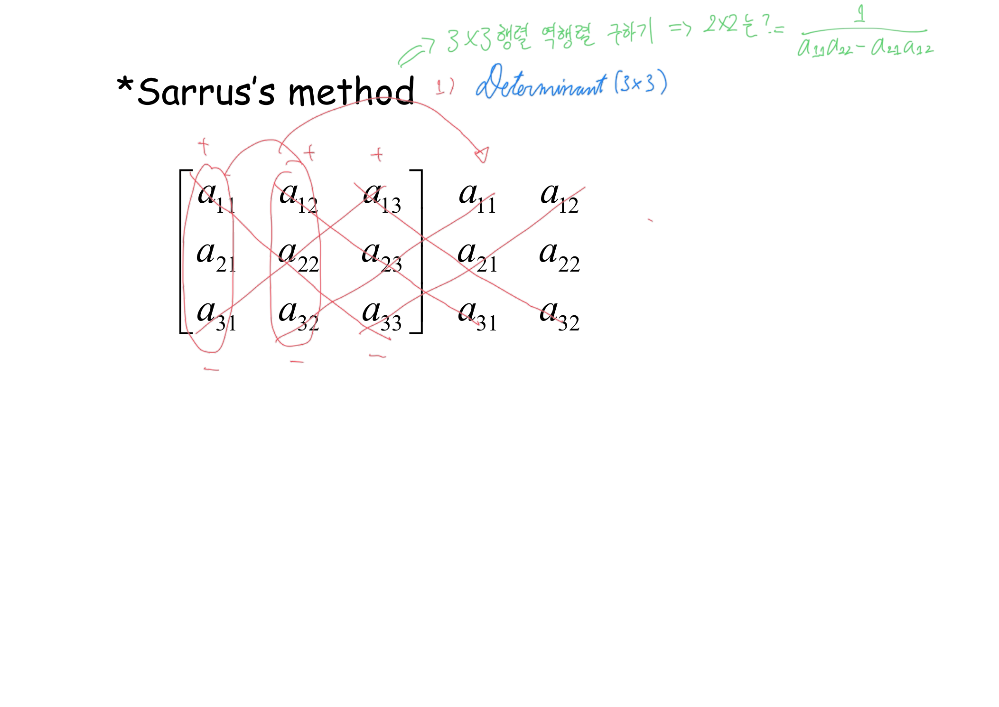
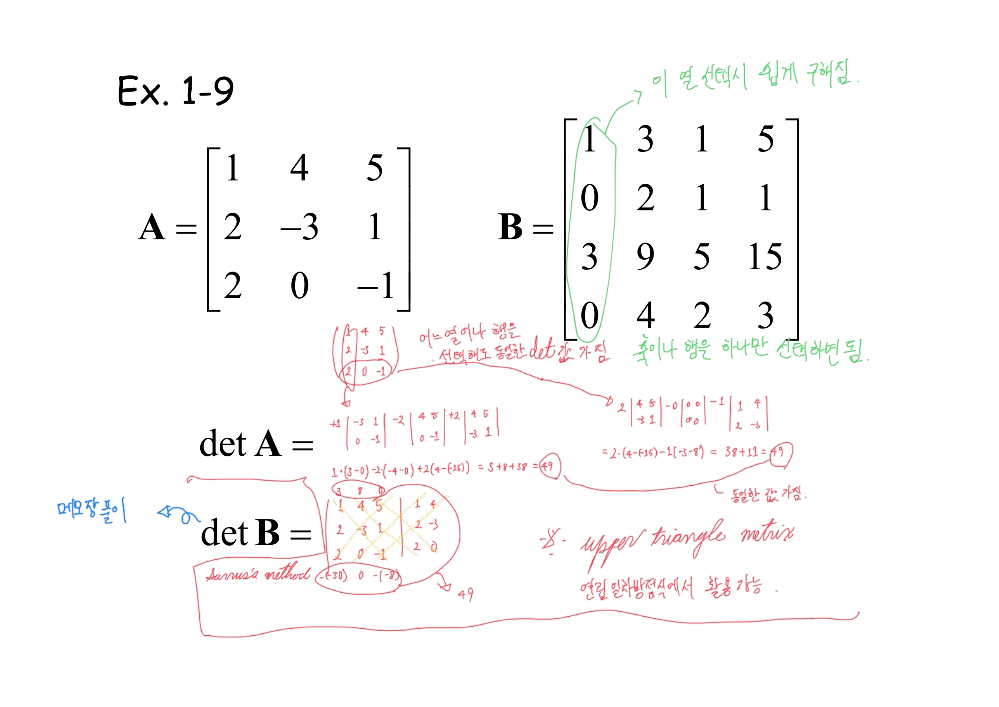
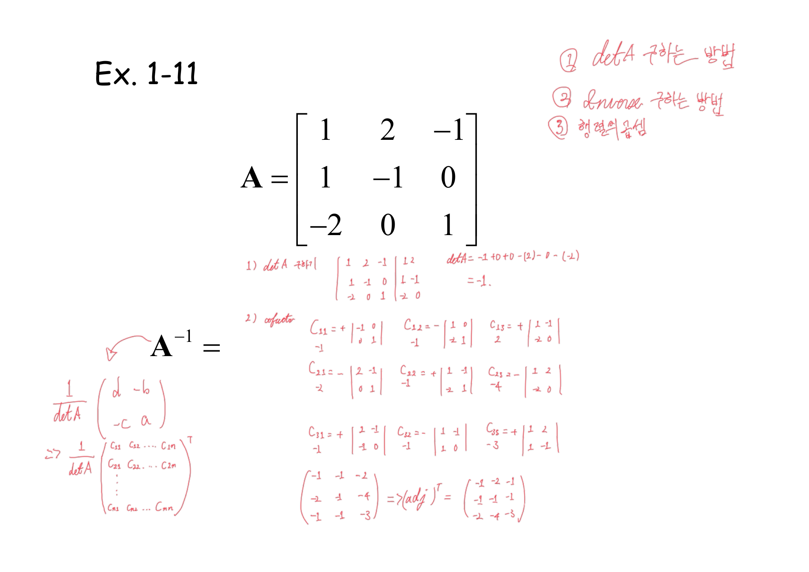
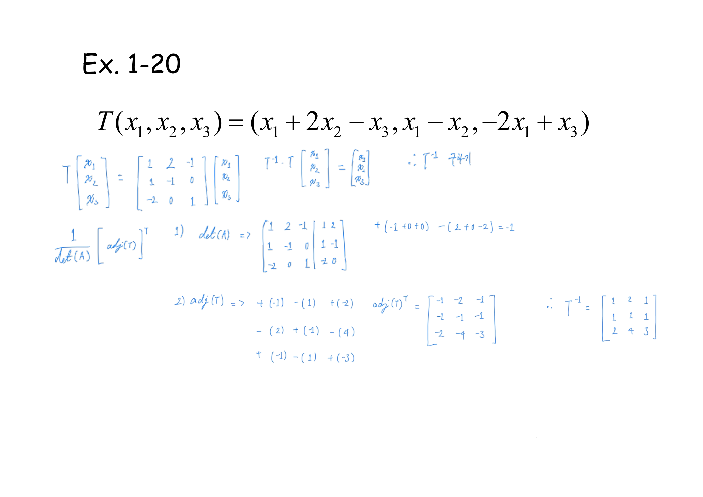
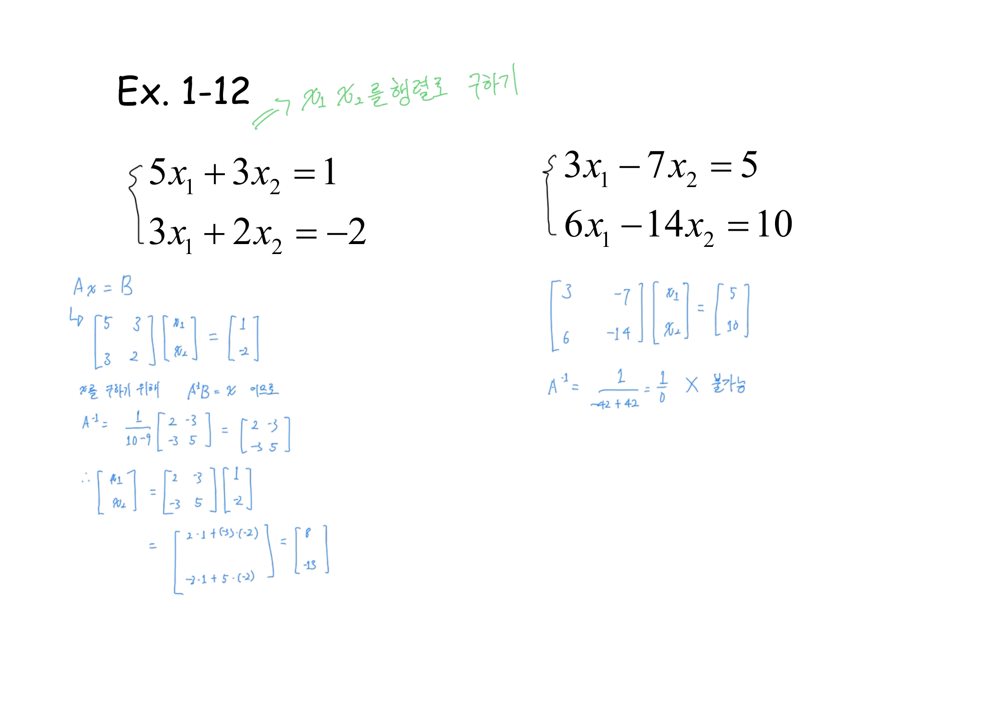
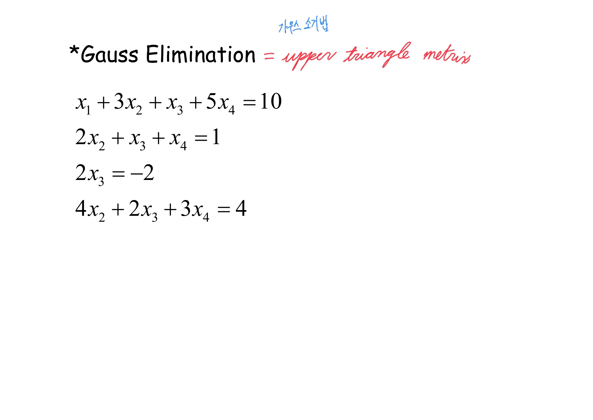
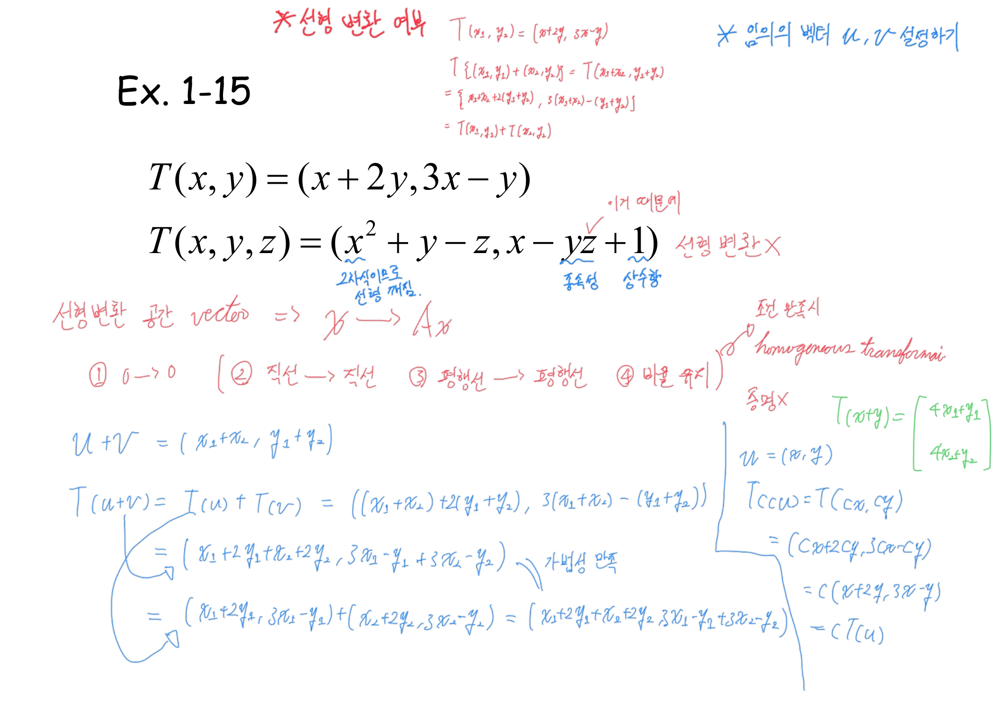
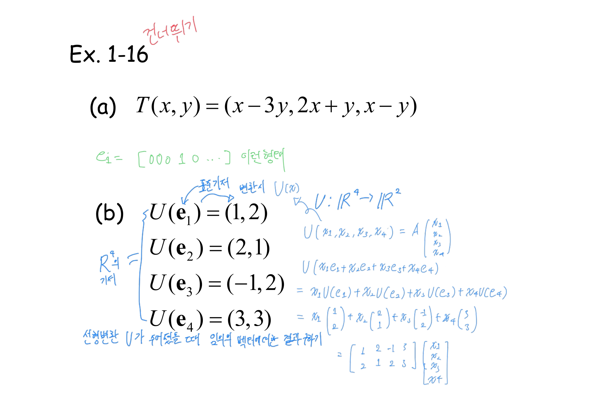
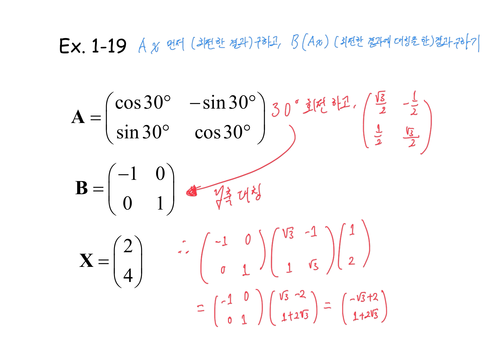
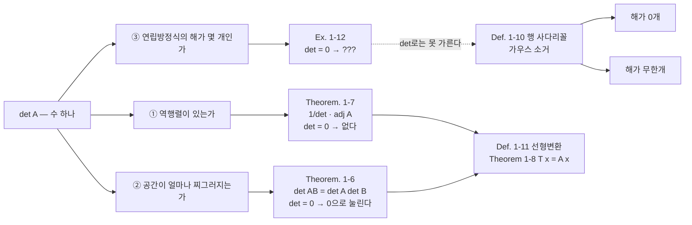

> [!abstract] 한 수에게 세 가지를 묻는다
> 18쪽부터 39쪽까지는 겉보기에 세 덩어리다 — 행렬식(18\~24), 가우스 소거(25\~26), 선형변환(27\~39). 그런데 실제로는 **하나의 수 $\det A$ 를 세 번 다르게 써먹는 과정**이다.
>
> | 묻는 것 | 답하는 자리 | $\det = 0$ 일 때 |
> | --- | --- | --- |
> | 역행렬이 있는가 | `Theorem. 1-7` 수반행렬 공식의 분모 | **없다** — 깨끗하다 |
> | 공간이 얼마나 찌그러지는가 | 17쪽 여백의 「부피」, 21쪽 `det[AB] = det A det B` | **0으로 눌린다** — 깨끗하다 |
> | 연립방정식의 해가 몇 개인가 | `Ex. 1-12` | **답할 수 없다** ← 여기서 어긋난다 |
>
> 셋째 칸이 이 정리의 척추다.

---

## 여인자 전개 — 어느 줄로 뜯어도 같은 수

`Def. 1-8`이 행렬식을 재귀로 정의한다.

$$\det A=\sum_{i=1}^{n} a_{ij}(-1)^{i+j}\det A_{ij}$$

$\det A_{ij}$ 가 소행렬식(minor), $(-1)^{i+j}\det A_{ij}$ 가 여인자(cofactor)다. 정의는 한 줄을 골라 그 줄의 성분마다 한 차원 작은 행렬식을 붙이라고 말한다. **어느 줄을 고를지는 말하지 않는다.**

3×3에 한해서는 재귀를 쓰지 않는 요령이 따로 붙는다.



$$\det\begin{pmatrix}a_{11}&a_{12}&a_{13}\\a_{21}&a_{22}&a_{23}\\a_{31}&a_{32}&a_{33}\end{pmatrix}=\underbrace{a_{11}a_{22}a_{33}+a_{12}a_{23}a_{31}+a_{13}a_{21}a_{32}}_{\searrow\ \text{더한다}}-\underbrace{(a_{13}a_{22}a_{31}+a_{11}a_{23}a_{32}+a_{12}a_{21}a_{33})}_{\swarrow\ \text{뺀다}}$$

붉은 잉크가 왼쪽 위에 `Determinant (3×3)` 이라 이름을 붙이고, 초록으로 그 위에 「3×3 행렬 역행렬 구하기 ⇒ 2×2는? = $\dfrac{1}{a_{11}a_{22}-a_{21}a_{12}}$」를 적어 두었다. 사루스가 **3×3 전용**임을 못 박아 둔 것이다. 이 단서가 다음 장에서 바로 필요해진다.

### 20쪽 — 같은 행렬을 두 번 전개한다

`Ex. 1-9`는 3×3 하나와 4×4 하나를 준다. 인쇄된 것은 두 행렬과 `det A =`, `det B =` 뿐이다.



$$A=\begin{pmatrix}1&4&5\\2&-3&1\\2&0&-1\end{pmatrix}$$

붉은 잉크는 이 하나를 **세 가지 방법으로** 계산했다. 먼저 1열 $(1,2,2)$ 로 전개한다.

$$1\cdot(3-0)-2\cdot(-4-0)+2\cdot(4-(-15))=3+8+38=49$$

그다음 3행 $(2,0,-1)$ 로 전개한다. 이 줄에는 0이 하나 있어 항 하나가 통째로 사라진다.

$$2\cdot(4-(-15))-0+(-1)\cdot(-3-8)=38+0+11=49$$

마지막으로 「메모장풀이」라는 딱지를 붙이고 사루스로 다시 49를 확인한다. 세 값이 같다.

그 사이 두 줄의 여백 글씨가 이 페이지의 요점을 말한다.

> 「어느 열이나 행을 선택해도 동일한 det 값 가짐」
> 「축이나 행은 하나만 선택하면 됨」

$B$는 4×4라 사루스를 쓸 수 없다. 대신 초록 잉크가 1열에 동그라미를 치고 화살표로 「이 열 선택시 쉽게 구해짐」이라 적었다.

$$B=\begin{pmatrix}1&3&1&5\\0&2&1&1\\3&9&5&15\\0&4&2&3\end{pmatrix}$$

1열이 $(1,0,3,0)$ 이라 0이 둘이다. 네 항 중 두 항이 처음부터 사라지므로 3×3 행렬식을 **네 번이 아니라 두 번만** 계산하면 된다. 이것이 `Def. 1-8`이 「어느 줄이든」이라고만 하고 넘어간 자유의 실제 값어치다.

> [!note] `det B` 는 원본에 적혀 있지 않다 — 보충
> 20쪽의 잉크는 $B$에 대해 **전략만 적고 값을 남기지 않았다.** 초록으로 표시한 1열로 직접 전개하면 이렇다.
>
> $$\det B = 1\cdot\det\begin{pmatrix}2&1&1\\9&5&15\\4&2&3\end{pmatrix}+3\cdot\det\begin{pmatrix}3&1&5\\2&1&1\\4&2&3\end{pmatrix} = 1\cdot 1 + 3\cdot 1 = 4$$
>
> (두 소행렬식은 각각 사루스로 1과 1이다. 파이썬 정수 연산으로 재확인했다.) 3행 $(3,9,5,15)$ 가 1행 $(1,3,1,5)$ 의 3배와 **거의** 같지만 셋째 성분만 $5 \ne 3$ 이라 어긋나고, 그 어긋남 하나가 $\det B$ 를 0이 아닌 4로 만든다.

### 어느 줄로 전개해도 같은지 직접 확인하기

```html preview
<div id="cf-root">
  <style>
    #cf-root{font-family:system-ui,-apple-system,"Segoe UI",sans-serif;color:var(--foreground);padding:4px}
    #cf-root .panel{background:var(--card);border:1px solid var(--border);border-radius:10px;padding:14px}
    #cf-root table{border-collapse:collapse;margin:0 auto 12px}
    #cf-root td input{width:42px;height:32px;text-align:center;background:transparent;color:var(--foreground);border:1px solid var(--border);font:inherit;font-size:13px;font-variant-numeric:tabular-nums}
    #cf-root td.dim input{opacity:.28}
    #cf-root td.on input{border-color:var(--chart-1);border-width:2px;background:color-mix(in srgb,var(--chart-1) 14%,transparent)}
    #cf-root .picks{display:flex;flex-wrap:wrap;gap:6px;justify-content:center;margin-bottom:10px}
    #cf-root button{background:var(--card);color:var(--foreground);border:1px solid var(--border);border-radius:5px;padding:4px 9px;font:inherit;font-size:12px;cursor:pointer}
    #cf-root button.act{border-color:var(--chart-1);background:color-mix(in srgb,var(--chart-1) 16%,transparent)}
    #cf-root .out{padding:10px 12px;border:1px solid var(--border);border-radius:7px;font-size:13px;line-height:1.75;overflow-x:auto}
    #cf-root .big{font-size:15px;font-weight:700;color:var(--chart-1)}
    #cf-root code{font-family:ui-monospace,SFMono-Regular,Menlo,monospace;white-space:nowrap}
  </style>
  <div class="panel">
    <table id="cf-grid"></table>
    <div class="picks" id="cf-picks"></div>
    <div class="out" id="cf-out"></div>
  </div>
</div>
<script>
(function(){
  var R=document.getElementById('cf-root');
  var M=[[1,4,5],[2,-3,1],[2,0,-1]];
  var mode={t:'row',k:2};
  function det2(m){return m[0][0]*m[1][1]-m[0][1]*m[1][0];}
  function minor(M,i,j){var o=[];for(var a=0;a<3;a++){if(a===i)continue;var r=[];for(var b=0;b<3;b++){if(b===j)continue;r.push(M[a][b]);}o.push(r);}return o;}
  function detFull(M){var s=0;for(var j=0;j<3;j++)s+=M[0][j]*Math.pow(-1,j)*det2(minor(M,0,j));return s;}
  function grid(){
    var h='';
    for(var i=0;i<3;i++){h+='<tr>';for(var j=0;j<3;j++){
      var on=(mode.t==='row'&&mode.k===i)||(mode.t==='col'&&mode.k===j);
      h+='<td class="'+(on?'on':'dim')+'"><input data-i="'+i+'" data-j="'+j+'" value="'+M[i][j]+'"></td>';}h+='</tr>';}
    R.querySelector('#cf-grid').innerHTML=h;
    var p='';
    ['row','col'].forEach(function(t){for(var k=0;k<3;k++){
      var a=(mode.t===t&&mode.k===k);
      p+='<button class="'+(a?'act':'')+'" data-t="'+t+'" data-k="'+k+'">'+(t==='row'?(k+1)+'행':(k+1)+'열')+'</button>';}});
    R.querySelector('#cf-picks').innerHTML=p;
  }
  function calc(){
    var terms=[],total=0;
    for(var s=0;s<3;s++){
      var i=(mode.t==='row')?mode.k:s, j=(mode.t==='row')?s:mode.k;
      var a=M[i][j], sg=Math.pow(-1,i+j), mm=det2(minor(M,i,j)), v=a*sg*mm;
      total+=v;
      terms.push({a:a,sg:sg,mm:mm,v:v,i:i,j:j});
    }
    var h='<b>'+(mode.t==='row'?(mode.k+1)+'행':(mode.k+1)+'열')+'으로 전개</b><br>';
    terms.forEach(function(t){
      var dead=(t.a===0);
      h+='<code'+(dead?' style="opacity:.45"':'')+'>'+(t.sg>0?'+':'−')+' '+t.a+' × det(소행렬) '+t.mm+' = '+(t.sg>0?'':'−')+(t.a*t.mm===0?'0':Math.abs(t.a*t.mm))+'</code>'
        +(dead?' <span style="opacity:.6">← 성분이 0이라 통째로 사라진다</span>':'')+'<br>';
    });
    var zeros=terms.filter(function(t){return t.a===0;}).length;
    h+='<span class="big">det A = '+total+'</span>';
    h+='<br><span style="opacity:.78">계산한 소행렬식 '+(3-zeros)+'개'+(zeros?' — 0 덕분에 '+zeros+'개를 건너뛰었다':'')+'. 어느 줄을 골라도 값은 같다.</span>';
    R.querySelector('#cf-out').innerHTML=h;
  }
  R.addEventListener('click',function(e){
    if(e.target.dataset.t){mode={t:e.target.dataset.t,k:+e.target.dataset.k};grid();calc();}
  });
  R.addEventListener('input',function(e){
    if(e.target.dataset.i===undefined)return;
    var v=parseFloat(e.target.value); if(isNaN(v))v=0;
    M[+e.target.dataset.i][+e.target.dataset.j]=v; calc();
  });
  grid();calc();
})();
</script>
```

초기값은 `Ex. 1-9`의 $A$다. `3행`을 고르면 0 하나가 항 하나를 지우고, 그래도 49가 나온다. 숫자를 바꿔 0을 더 많이 만들면 계산이 더 줄어든다 — 20쪽 초록 잉크가 $B$에 대해 하려던 일이 그것이다.

---

## 23쪽 — 수반행렬까지 가고 멈춘다

`Theorem. 1-7`이 역행렬을 여인자로 짓는 공식을 준다.

$$A^{-1}=\frac{1}{\det A}\begin{pmatrix}C_{11}&C_{21}&\cdots&C_{n1}\\C_{12}&C_{22}&\cdots&C_{n2}\\\vdots&&&\vdots\\C_{1n}&C_{2n}&\cdots&C_{nn}\end{pmatrix},\qquad \text{(수반행렬 } \mathrm{adj}\,A = C^{T})$$

여인자 행렬을 만든 뒤 **전치**하고 $\det A$ 로 나눈다. 전치가 들어가는 자리가 이 공식의 함정이다.



$$A=\begin{pmatrix}1&2&-1\\1&-1&0\\-2&0&1\end{pmatrix},\qquad \det A=-1$$

아홉 여인자를 계산하면 여인자 행렬 $C$ 와 그 전치가 나온다.

$$C=\begin{pmatrix}-1&-1&-2\\-2&-1&-4\\-1&-1&-3\end{pmatrix},\qquad \mathrm{adj}\,A=C^{T}=\begin{pmatrix}-1&-2&-1\\-1&-1&-1\\-2&-4&-3\end{pmatrix}$$

**그리고 페이지가 여기서 끝난다.** $\det A = -1$ 로 나누는 마지막 한 걸음이 남았는데 적혀 있지 않다. 인쇄된 `A⁻¹ =` 옆은 여전히 비어 있고, 잉크도 $\mathrm{adj}$ 에서 손을 놓았다.

이 미완성은 16쪽 뒤에서 조용히 완결된다. 39쪽 `Ex. 1-20`이 **같은 행렬**을 다시 들고 나오기 때문이다.



$$T(x_1,x_2,x_3)=(x_1+2x_2-x_3,\ x_1-x_2,\ -2x_1+x_3)\ \Longrightarrow\ A=\begin{pmatrix}1&2&-1\\1&-1&0\\-2&0&1\end{pmatrix}$$

같은 $A$다. 같은 $\det = -1$, 같은 $\mathrm{adj}$. 그런데 이번에는 $\frac{1}{\det A}$ 를 곱한다. $\det A = -1$ 이므로 모든 부호가 뒤집힌다.

$$T^{-1}=\frac{1}{-1}\begin{pmatrix}-1&-2&-1\\-1&-1&-1\\-2&-4&-3\end{pmatrix}=\begin{pmatrix}1&2&1\\1&1&1\\2&4&3\end{pmatrix}$$

검산하면 $AA^{-1} = I$ 다(직접 곱해 확인했다). 23쪽이 열어 둔 계산을 39쪽이 닫는데, **두 페이지 어디에도 서로를 가리키는 말은 없다.** 같은 숫자가 두 번 나온다는 사실만 있다.

---

## 24쪽 — 셋째 질문에서 어긋난다

`Ex. 1-12`는 연립방정식 두 개를 나란히 놓는다. 인쇄된 것은 식 네 줄뿐이다.



초록 잉크가 제목 옆에 목적을 적었다 — 「$x_1$, $x_2$ 를 행렬로 구하기」. 파란 잉크가 왼쪽을 푼다.

$$\begin{cases}5x_1+3x_2=1\\3x_1+2x_2=-2\end{cases}\ \Longrightarrow\ A=\begin{pmatrix}5&3\\3&2\end{pmatrix},\ \det A=10-9=1$$

$$A^{-1}=\begin{pmatrix}2&-3\\-3&5\end{pmatrix},\qquad \mathbf{x}=A^{-1}\mathbf{b}=\begin{pmatrix}2&-3\\-3&5\end{pmatrix}\begin{pmatrix}1\\-2\end{pmatrix}=\begin{pmatrix}8\\-13\end{pmatrix}$$

깔끔하다. 오른쪽으로 넘어간다.

$$\begin{cases}3x_1-7x_2=5\\6x_1-14x_2=10\end{cases}\ \Longrightarrow\ \det A = 3(-14)-(-7)(6) = -42+42 = 0$$

잉크가 적은 것은 이게 전부다.

$$A^{-1}=\frac{1}{-42+42}=\frac{1}{0}\quad \textsf{✗ 불가능}$$

> [!caution] 원본의 미완결 ③ — 24쪽 `Ex. 1-12` 오른쪽
> 「불가능」이 가리키는 것은 **역행렬**이지 **해**가 아니다. 그런데 문제는 「$x_1$, $x_2$ 를 구하라」였고, 풀이는 역행렬이 없다는 데서 멈춘다. 그 결과 이 연립방정식의 해에 대해서는 아무 말도 하지 않은 채 페이지가 끝난다.
>
> 실제로는 둘째 식이 첫째 식의 **정확히 2배**다.
>
> $$2\times(3x_1-7x_2=5)\ \Longrightarrow\ 6x_1-14x_2=10$$
>
> 즉 두 식은 같은 직선이다. **해가 없는 게 아니라 무수히 많다.** $x_2 = t$ 로 두면 $x_1 = \dfrac{5+7t}{3}$ 로 모든 $t$ 에 대해 해가 된다. 예를 들어 $(x_1,x_2) = (4,1)$ 을 넣으면 $12-7=5$ ✓, $24-14=10$ ✓ 다.
>
> 이것이 $\det$ 가 답하지 못하는 유일한 질문이다. $\det = 0$ 은 「해가 하나로 정해지지 않는다」까지만 말하고, 그것이 **0개**인지 **무한개**인지는 구분하지 못한다. 같은 $\det=0$ 이라도 $6x_1-14x_2=11$ 이었다면 해가 하나도 없다. 두 경우를 가르려면 행렬식이 아니라 다음 장의 도구 — 행 사다리꼴 — 가 필요하다.

그리고 실제로 바로 다음 장이 그 도구다.

---

## 25~26쪽 — 행렬식이 못 하는 일을 하는 절차

`Def. 1-10`이 행 사다리꼴(row echelon form)을 그림 두 개로 정의하고, 26쪽이 가우스 소거를 연립방정식 하나로 보인다. 붉은 잉크가 제목 옆에 등식을 하나 적었다 — `Gauss Elimination = upper triangle matrix`.



$$\begin{cases}x_1+3x_2+x_3+5x_4=10\\2x_2+x_3+x_4=1\\2x_3=-2\\4x_2+2x_3+3x_4=4\end{cases}$$

인쇄된 이 네 줄은 **아직 사다리꼴이 아니다.** 셋째 줄이 $x_3$ 만 남긴 깨끗한 줄인데 넷째 줄에 $x_2$ 가 다시 등장하므로 계단이 무너져 있다. 사다리꼴로 만드는 것이 곧 연습 문제인 셈인데, 풀이는 적혀 있지 않다.

> [!note] 26쪽 연립방정식의 해 — 보충
> 원본에 답이 없어 직접 풀었다. 셋째 식에서 $x_3=-1$. 이를 둘째·넷째에 넣으면
>
> $$2x_2+x_4=2,\qquad 4x_2+3x_4=6$$
>
> 이 2×2의 행렬식은 $2\cdot3-1\cdot4=2 \ne 0$ 이므로 해가 하나다 — $x_2=0$, $x_4=2$. 첫째 식에서 $x_1 = 10-0-(-1)-10 = 1$.
>
> $$(x_1,x_2,x_3,x_4)=(1,\ 0,\ -1,\ 2)$$
>
> 네 식에 넣으면 각각 10, 1, −2, 4 로 전부 맞는다.
>
> 24쪽 오른쪽과 대조하면 차이가 분명해진다. 여기서는 소거 끝에 **0 = 0 짜리 줄이 하나도 생기지 않아** 해가 유일하다. 24쪽 오른쪽은 소거하면 둘째 줄이 통째로 0 = 0 이 되고, 바로 그 줄 하나가 「무한개」의 증거다. 행렬식은 이 줄을 보여 주지 못하고 소거는 보여 준다.

---

## 27~39쪽 — 행렬이 함수가 된다

`Def. 1-11`이 선형변환을 두 조건으로 정의한다.

$$T(\mathbf{u}+\mathbf{v})=T(\mathbf{u})+T(\mathbf{v}),\qquad T(c\mathbf{u})=cT(\mathbf{u})$$

`Ex. 1-15`가 통과하는 것 하나와 떨어지는 것 하나를 준다.



$$T(x,y)=(x+2y,\ 3x-y)\quad\textsf{— 선형}$$

잉크가 $T(\mathbf{u}+\mathbf{v}) = T(\mathbf{u})+T(\mathbf{v})$ 와 $T(c\mathbf{u}) = cT(\mathbf{u})$ 를 성분으로 전부 전개해 보였다. 반면

$$T(x,y,z)=(x^2+y-z,\ x-yz+1)\quad\textsf{— 선형 아님}$$

여기에는 **세 군데에 각각 다른 붉은 밑줄**이 그어져 있고 이유가 따로 붙었다.

| 자리 | 붙은 말 | 깨지는 조건 |
| --- | --- | --- |
| $x^2$ | 「2차식이므로 선형 깨짐」 | $T(c\mathbf{u}) = cT(\mathbf{u})$ — $c^2 \ne c$ |
| $yz$ | 「종속성」 | $T(\mathbf{u}+\mathbf{v}) = T(\mathbf{u})+T(\mathbf{v})$ — 교차항이 남는다 |
| $+1$ | 「상수항」 | $T(\mathbf{0}) = \mathbf{0}$ — 원점이 원점으로 안 간다 |

한 식이 세 가지 다른 이유로 떨어진다는 것이 요점이다. 그리고 같은 붉은 펜이 페이지 왼쪽 아래에 선형변환이 **보존하는 것** 네 가지를 번호로 정리해 두었다 — ① 0 → 0 ② 직선 → 직선 ③ 평행선 → 평행선 ④ 비율 유지.

### 30쪽 — 기저의 상(像)이 곧 열이다

`Theorem 1-8`이 「$T$ 가 선형이면 $T(\mathbf{x}) = A\mathbf{x}$ 인 $A$ 가 존재한다」를 주장하고, `Ex. 1-16`(b)가 그 $A$ 를 실제로 짓는다.



$$U(\mathbf{e}_1)=(1,2),\quad U(\mathbf{e}_2)=(2,1),\quad U(\mathbf{e}_3)=(-1,2),\quad U(\mathbf{e}_4)=(3,3)$$

파란 잉크가 그대로 따라간다. 임의의 $\mathbf{x}$ 를 기저로 쪼개면

$$U(x_1\mathbf{e}_1+x_2\mathbf{e}_2+x_3\mathbf{e}_3+x_4\mathbf{e}_4)=x_1U(\mathbf{e}_1)+x_2U(\mathbf{e}_2)+x_3U(\mathbf{e}_3)+x_4U(\mathbf{e}_4)$$

이고, 네 상을 **열로 세우면** 그것이 행렬이다.

$$U(\mathbf{x})=\begin{pmatrix}1&2&-1&3\\2&1&2&3\end{pmatrix}\begin{pmatrix}x_1\\x_2\\x_3\\x_4\end{pmatrix},\qquad U:\mathbb{R}^4\to\mathbb{R}^2$$

$4$개의 상만 알면 $\mathbb{R}^4$ 전체에서의 값이 정해진다 — 선형성이 파는 것이 정확히 이것이다.

### 31쪽 — 직선을 보존하되 원점은 놓아준다

`Ax` 와 `Ax + b` 를 나란히 놓은 짧은 장인데, 여기서 잉크가 인쇄된 내용을 넘어선다. `Ax + b` 옆에 「= 행렬의 곱 + translation」, 「affine transformation」, 그리고

$$A\mathbf{x}+\mathbf{b}=A'\begin{pmatrix}\mathbf{x}\\1\end{pmatrix}\quad\textsf{「동차 좌표임 (확장)」}$$

평행이동은 행렬 곱으로 표현되지 않지만(원점이 안 움직이므로), 차원을 하나 늘려 $\mathbf{x}$ 아래에 1을 붙이면 다시 행렬 곱이 된다. 「동차 좌표 변환을 이용해 좌표의 이동을 행렬 곱으로 변환 가능함」이라고 적혀 있다. 인쇄된 슬라이드에는 `Ax` 와 `Ax + b` 두 줄뿐이고, 왜 `Homogeneous`라고 부르는지는 잉크에만 있다.

### 37쪽 — 순서가 결과를 바꾼다

`Def. 1-16`이 합성변환을 $U \circ T(\mathbf{x}) = BA\mathbf{x}$ 로 정의하고, `Ex. 1-19`가 구체적인 두 변환을 합성한다.



$$A=\begin{pmatrix}\cos30°&-\sin30°\\\sin30°&\cos30°\end{pmatrix}=\begin{pmatrix}\frac{\sqrt3}{2}&-\frac12\\[2pt]\frac12&\frac{\sqrt3}{2}\end{pmatrix},\qquad B=\begin{pmatrix}-1&0\\0&1\end{pmatrix},\qquad \mathbf{x}=\begin{pmatrix}2\\4\end{pmatrix}$$

붉은 잉크가 $A$ 옆에 「30° 회전하고」, $B$ 옆에 「$y$축 대칭」이라고 이름을 붙였다. 그리고 계산에서 작은 요령을 쓴다 — $A$ 에서 $\frac12$ 을, $\mathbf{x}$ 에서 2를 빼내 서로 지운다.

$$A\mathbf{x}=\frac12\begin{pmatrix}\sqrt3&-1\\1&\sqrt3\end{pmatrix}\cdot 2\begin{pmatrix}1\\2\end{pmatrix}=\begin{pmatrix}\sqrt3-2\\1+2\sqrt3\end{pmatrix}\approx\begin{pmatrix}-0.268\\4.464\end{pmatrix}$$

$$BA\mathbf{x}=\begin{pmatrix}-1&0\\0&1\end{pmatrix}\begin{pmatrix}\sqrt3-2\\1+2\sqrt3\end{pmatrix}=\begin{pmatrix}-\sqrt3+2\\1+2\sqrt3\end{pmatrix}\approx\begin{pmatrix}0.268\\4.464\end{pmatrix}$$

### 회전과 대칭, 순서를 바꿔 보기

원본은 $BA$ 만 계산하고 끝난다. 아래에서 순서를 뒤집어 $AB$ 를 만들면 8쪽의 「교환 법칙 적용 불가능」이 그림으로 보인다.

```html preview
<div id="tr-root">
  <style>
    #tr-root{font-family:system-ui,-apple-system,"Segoe UI",sans-serif;color:var(--foreground);padding:4px}
    #tr-root .panel{background:var(--card);border:1px solid var(--border);border-radius:10px;padding:14px}
    #tr-root .bar{display:flex;flex-wrap:wrap;gap:8px;align-items:center;justify-content:center;margin-bottom:10px;font-size:13px}
    #tr-root button{background:var(--card);color:var(--foreground);border:1px solid var(--border);border-radius:5px;padding:5px 11px;font:inherit;font-size:12px;cursor:pointer}
    #tr-root button.act{border-color:var(--chart-1);background:color-mix(in srgb,var(--chart-1) 16%,transparent)}
    #tr-root .stage{display:flex;justify-content:center}
    #tr-root .out{margin-top:10px;padding:9px 12px;border:1px solid var(--border);border-radius:7px;font-size:13px;line-height:1.7}
    #tr-root code{font-family:ui-monospace,SFMono-Regular,Menlo,monospace}
    #tr-root .k1{color:var(--chart-1)} #tr-root .k2{color:var(--chart-2)} #tr-root .k3{color:var(--chart-3)}
  </style>
  <div class="panel">
    <div class="bar">
      <button id="bBA" class="act">B∘A — 회전 다음 대칭 (원본)</button>
      <button id="bAB">A∘B — 대칭 다음 회전</button>
    </div>
    <div class="stage"><svg id="tr-svg" width="320" height="300" viewBox="0 0 320 300" role="img" aria-label="벡터 (2,4)에 회전과 대칭을 차례로 적용한 결과"></svg></div>
    <div class="out" id="tr-out"></div>
  </div>
</div>
<script>
(function(){
  var R=document.getElementById('tr-root'),svg=R.querySelector('#tr-svg'),order='BA';
  var th=Math.PI/6, c=Math.cos(th), s=Math.sin(th);
  var A=[[c,-s],[s,c]], B=[[-1,0],[0,1]], x0=[2,4];
  function ap(M,v){return [M[0][0]*v[0]+M[0][1]*v[1], M[1][0]*v[0]+M[1][1]*v[1]];}
  var S=30,OX=160,OY=250;
  function X(v){return OX+v*S;} function Y(v){return OY-v*S;}
  function arrow(v,cls,lab){
    return '<line x1="'+X(0)+'" y1="'+Y(0)+'" x2="'+X(v[0])+'" y2="'+Y(v[1])+'" stroke="var(--'+cls+')" stroke-width="2.6" marker-end="url(#ah-'+cls+')"/>'+
           '<text x="'+(X(v[0])+7)+'" y="'+(Y(v[1])-5)+'" font-size="11" fill="var(--'+cls+')">'+lab+'</text>';
  }
  function draw(){
    var mid = (order==='BA') ? ap(A,x0) : ap(B,x0);
    var fin = (order==='BA') ? ap(B,mid) : ap(A,mid);
    var g='<defs>';
    ['chart-1','chart-2','chart-3'].forEach(function(k){
      g+='<marker id="ah-'+k+'" markerWidth="8" markerHeight="8" refX="6.5" refY="3" orient="auto"><path d="M0,0 L7,3 L0,6 z" fill="var(--'+k+')"/></marker>';});
    g+='</defs>';
    for(var k=-5;k<=5;k++){
      g+='<line x1="'+X(k)+'" y1="0" x2="'+X(k)+'" y2="300" stroke="var(--border)" stroke-width="'+(k===0?1.4:0.5)+'"/>';
      if(Y(k)>=0&&Y(k)<=300) g+='<line x1="0" y1="'+Y(k)+'" x2="320" y2="'+Y(k)+'" stroke="var(--border)" stroke-width="'+(k===0?1.4:0.5)+'"/>';
    }
    g+='<circle cx="'+X(0)+'" cy="'+Y(0)+'" r="'+(Math.hypot(x0[0],x0[1])*S)+'" fill="none" stroke="var(--border)" stroke-dasharray="3 4"/>';
    g+=arrow(x0,'chart-1','x');
    g+=arrow(mid,'chart-2',order==='BA'?'Ax':'Bx');
    g+=arrow(fin,'chart-3',order==='BA'?'BAx':'ABx');
    svg.innerHTML=g;
    function fm(v){return '('+v[0].toFixed(3)+', '+v[1].toFixed(3)+')';}
    var t;
    if(order==='BA'){
      t='<b>B∘A</b> — 원본 <code>Ex. 1-19</code>가 계산한 순서.<br>'+
        '<span class="k1">x = (2, 4)</span> → <span class="k2">Ax = '+fm(mid)+'</span> → <span class="k3">BAx = '+fm(fin)+'</span><br>'+
        '정확한 값: Ax = (√3−2, 1+2√3), BAx = (−√3+2, 1+2√3).';
    }else{
      t='<b>A∘B</b> — 순서를 뒤집었다.<br>'+
        '<span class="k1">x = (2, 4)</span> → <span class="k2">Bx = '+fm(mid)+'</span> → <span class="k3">ABx = '+fm(fin)+'</span><br>'+
        '<b>도착점이 다르다.</b> 두 변환 다 길이는 보존하므로 점선 원 위에 있지만, 원 위의 <b>어디</b>냐가 순서에 달렸다.';
    }
    t+='<br><span style="opacity:.75">회전도 대칭도 원점을 움직이지 않고 길이를 보존한다 — 그래도 BA ≠ AB 다.</span>';
    R.querySelector('#tr-out').innerHTML=t;
    R.querySelector('#bBA').className=(order==='BA')?'act':'';
    R.querySelector('#bAB').className=(order==='AB')?'act':'';
  }
  R.querySelector('#bBA').onclick=function(){order='BA';draw();};
  R.querySelector('#bAB').onclick=function(){order='AB';draw();};
  draw();
})();
</script>
```

두 결과는 같은 원 위에 있지만 서로 다른 점이다. 8쪽이 숫자 네 개로 보인 것을 여기서는 **도착점 두 개**로 볼 수 있다.

---

## 18~39쪽의 구조



`Ex. 1-12` 오른쪽 방정식은 이 그림에서 `해가 무한개` 칸에 들어간다. 원본은 그 칸까지 가지 않고 `???` 에서 「불가능」이라 적고 멈춘다.

---

## 다음으로

39쪽까지가 「행렬로 계산하는 법」이다. 40쪽부터 갑자기 추상이 시작되고, 동시에 잉크의 성격도 바뀐다 — 어떤 예제는 통째로 건너뛰어지고 어떤 정의는 별 세 개를 받는다.

- [01. 인쇄된 것은 서식이고, 강의는 잉크다](./01.%20인쇄된%20것은%20서식이고%20강의는%20잉크다.md) — 1~17쪽. 이 자료를 읽는 법
- [03. 잉크가 끊겼다 되살아나는 자리](./03.%20잉크가%20끊겼다%20되살아나는%20자리.md) — 40~65쪽. 고윳값과 대각화
- [06. 잉크가 멈춘 자리에서 과제가 시작된다](./06.%20잉크가%20멈춘%20자리에서%20과제가%20시작된다.md) — 야코비 행렬식이 여기의 $\det$ 를 이어받는다

---

## 근거 자료

| 쪽 | 인쇄된 것 | 잉크가 더한 것 |
| --- | --- | --- |
| 18 | `Def. 1-8` 여인자 전개, `det(I)=1`, 교대성·다중선형성 | — |
| **19** | 사루스 방법 도식 | `Determinant (3×3)`, 「3×3 행렬 역행렬 구하기 ⇒ 2×2는?」과 2×2 공식 |
| **20** | `Ex. 1-9` $A$(3×3), $B$(4×4)와 빈 `det A =`·`det B =` | **49를 세 방법으로**, 「어느 열이나 행을 선택해도 동일한 det 값 가짐」, $B$ 1열에 「이 열 선택시 쉽게 구해짐」, `upper triangle matrix` |
| 21 | `Theorem. 1-6` 행렬식의 성질 6줄 | — |
| 22 | `Theorem. 1-7` 수반행렬, `Cramer's rule` | — |
| **23** | `Ex. 1-11` $A$와 빈 `A⁻¹ =` | ① det ② inverse ③ 곱셈 절차, $\det=-1$, 여인자 9개, $\mathrm{adj}$ — **$1/\det$ 곱하기 전에 멈춤** |
| **24** | `Ex. 1-12` 연립방정식 두 벌 | 「$x_1$, $x_2$ 를 행렬로 구하기」, 왼쪽 $(8,-13)$, 오른쪽 **「✗ 불가능」에서 끝** |
| 25 | `Def. 1-10` 행 사다리꼴 예 두 개 | 「행 사다리꼴 형태」 |
| **26** | 가우스 소거 예제 네 식 (풀이 없음) | 「가우스 소거법」, `= upper triangle matrix` |
| 27 | `Def. 1-11` 선형변환 두 조건 | — |
| **28** | `Ex. 1-15` 선형 하나·비선형 하나 | 가법성·동차성 전개, $x^2$/$yz$/$+1$ **세 군데에 다른 이유**, 보존 4가지 |
| 29 | `Theorem 1.8` $\exists A,\ T(\mathbf{x})=A\mathbf{x}$ | — |
| **30** | `Ex. 1-16` (a) 식 하나 (b) $U(\mathbf{e}_i)$ 넷 | 기저 분해 → 상을 열로 세우기, $U:\mathbb{R}^4\to\mathbb{R}^2$ |
| **31** | `Linear transformation Ax` / `Homogeneous transformation Ax + b` | 「affine transformation」, **동차 좌표 확장** $A'(\mathbf{x},1)^T$, 보존 3가지 |
| 32–36 | `Def. 1-13`~`1-16` 확대·대칭 4종·회전·합성 | — |
| **37** | `Ex. 1-19` $A$(회전 30°), $B$, $\mathbf{x}=(2,4)$ | 「30° 회전하고」·「$y$축 대칭」, $\frac12$과 2를 상쇄한 계산, $BA\mathbf{x}$ |
| 38 | `Def. 1-17` 역변환 | — |
| **39** | `Ex. 1-20` $T$ (Ex. 1-11과 **같은 행렬**) | $\det=-1$, $\mathrm{adj}^T$, **$T^{-1}$까지 완성** |

추출 번들: `.ok/local/pdf-extract/02_math-theory__optimization-math__MSC087_1장_행렬_v3/` (180 dpi 재렌더로 확인)

수치 검증: `det A = 49`(1열·3행·사루스 세 경로), `det B = 4`, `Ex. 1-11`의 $A^{-1}$와 $AA^{-1}=I$, `Ex. 1-12` 왼쪽 해 $(8,-13)$과 오른쪽의 2배 관계, 26쪽 해 $(1,0,-1,2)$, `Ex. 1-19`의 $A\mathbf{x}$·$BA\mathbf{x}$ — 전부 파이썬 분수·부동소수 연산으로 재계산해 손글씨와 대조했다.
