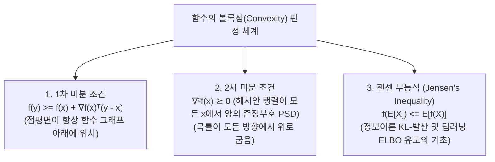
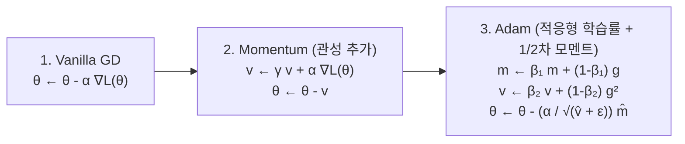

> [!abstract] 핵심 요약
> **볼록 최적화(Convex Optimization)**는 국소 최적해(Local Minima)가 곧 대역 최적해(Global Minima)임을 수학적으로 보장하는 최적화 이론의 정점이다.
> 1차 미분 가능 함수의 볼록성 조건($f(y) \ge f(x) + \nabla f(x)^T(y-x)$)과 2차 조건($\nabla^2 f(x) \succeq 0$), **경사하강법(Gradient Descent)**의 수렴성, 그리고 부등식 제약조건 최적화의 **KKT(Karush-Kuhn-Tucker) 4대 조건**은 딥러닝과 서포트 벡터 머신(SVM)의 엄밀한 수학적 토대를 구성한다.

---

## 1. 볼록 집합과 볼록 함수의 수학적 정의

### 1) 볼록 집합 (Convex Set $C$)
$$\forall x, y \in C, \; \forall \theta \in [0, 1] \implies \theta x + (1 - \theta) y \in C$$

### 2) 볼록 함수 (Convex Function $f$)
$$f(\theta x + (1 - \theta) y) \le \theta f(x) + (1 - \theta) f(y) \quad (\forall x, y \in \text{dom } f, \; \theta \in [0, 1])$$



---

## 2. 옵티마이저 3대 진화: GD ➔ Momentum ➔ Adam



---

## 3. 제약조건 최적화와 KKT 4대 조건

목적함수 $\min f_0(x)$ subject to $f_i(x) \le 0 \; (i=1..m), \; h_j(x) = 0 \; (j=1..p)$ 에 대한 라그랑지안:
$$\mathcal{L}(x, \lambda, \nu) = f_0(x) + \sum_{i=1}^m \lambda_i f_i(x) + \sum_{j=1}^p \nu_j h_j(x)$$

| KKT 4대 조건 | 수학적 수식 | 물리적 / 기하학적 의미 |
| :-- | :-- | :-- |
| **1. 정류성 (Stationarity)** | $\nabla_x \mathcal{L}(x^*, \lambda^*, \nu^*) = 0$ | 목적함수와 제약조건 힘의 평형 |
| **2. 원문제 실현가능성 (Primal Feasibility)** | $f_i(x^*) \le 0, \quad h_j(x^*) = 0$ | 모든 제약조건을 만족하는 영역 내 존재 |
| **3. 쌍대 실현가능성 (Dual Feasibility)** | $\lambda_i^* \ge 0 \quad (\forall i=1..m)$ | 부등식 제약에 대한 승수는 비음수 |
| **4. 상보적 여유성 (Complementary Slackness)** | $\lambda_i^* f_i(x^*) = 0 \quad (\forall i=1..m)$ | 경계 밖($f_i < 0$)이면 $\lambda_i = 0$, 경계 위($f_i = 0$)만 $\lambda_i > 0$ |

---

## 4. 실시간 볼록 2차 함수 경사하강법(GD) 궤적 시뮬레이터

```html preview
<div style="font-family:system-ui,-apple-system,sans-serif;padding:20px;background:var(--card);color:var(--card-foreground);border:1px solid var(--border);border-radius:var(--radius)">
  <div style="font-size:16px;font-weight:700;margin-bottom:14px;color:var(--primary);display:flex;align-items:center;gap:8px">
    <span>📉 볼록 2차 함수 $f(x) = x^2$ 실시간 경사하강법 수렴 시뮬레이터</span>
  </div>

  <div style="display:flex;gap:12px;margin-bottom:14px;align-items:center;flex-wrap:wrap">
    <div style="display:flex;align-items:center;gap:6px">
      <span style="font-size:12px;font-weight:700">초기 위치 x₀:</span>
      <input id="initX" type="number" value="4" step="0.5" style="width:60px;padding:4px;background:var(--background);color:var(--foreground);border:1px solid var(--border);border-radius:var(--radius);font-weight:700" />
    </div>
    <div style="display:flex;align-items:center;gap:6px">
      <span style="font-size:12px;font-weight:700">학습률 α:</span>
      <input id="learnRate" type="number" value="0.2" step="0.05" min="0.01" max="1.2" style="width:65px;padding:4px;background:var(--background);color:var(--foreground);border:1px solid var(--border);border-radius:var(--radius);font-weight:700" />
    </div>
    <button id="runGdBtn" style="padding:6px 14px;background:var(--primary);color:#fff;border:none;border-radius:var(--radius);font-size:12px;font-weight:700;cursor:pointer">최적화 10회 반복 실행</button>
  </div>

  <div style="padding:10px;background:var(--background);border:1px solid var(--border);border-radius:var(--radius);max-height:150px;overflow-y:auto;font-family:monospace;font-size:11px;line-height:1.6">
    <table style="width:100%;text-align:center;border-collapse:collapse">
      <thead style="border-bottom:1px solid var(--border);color:var(--primary)">
        <tr><th>Step (t)</th><th>x_t</th><th>∇f(x_t) = 2x_t</th><th>f(x_t) = x_t²</th></tr>
      </thead>
      <tbody id="gdTraceBody"></tbody>
    </table>
  </div>

  <script>
    function runOptimization() {
      var x = parseFloat(document.getElementById('initX').value) || 4;
      var alpha = parseFloat(document.getElementById('learnRate').value) || 0.2;
      var tbody = document.getElementById('gdTraceBody');
      tbody.innerHTML = '';

      for (var t = 0; t <= 10; t++) {
        var grad = 2 * x;
        var fx = x * x;

        var tr = document.createElement('tr');
        tr.style.color = (t === 10) ? 'var(--chart-2);font-weight:800' : 'inherit';
        tr.innerHTML = '<td>' + t + '</td><td>' + x.toFixed(4) + '</td><td>' + grad.toFixed(4) + '</td><td>' + fx.toFixed(4) + '</td>';
        tbody.appendChild(tr);

        x = x - alpha * grad;
      }
    }

    document.getElementById('runGdBtn').addEventListener('click', runOptimization);
    runOptimization();
  </script>
</div>
```
