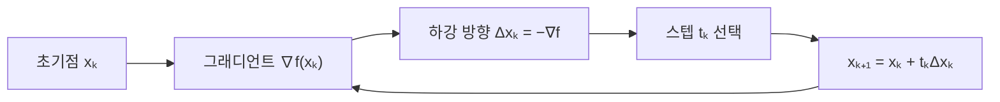

볼록 최적화 자료는 선형·지수·거듭제곱·x ln x·선형 함수 등의 볼록성 예시 뒤 Jensen 부등식과 경사하강법을 제시한다.



<Tabs>
  <Tab label="볼록성">함수 그래프의 두 점 선분이 함수 위에 놓이는 성질과 예시를 확인한다.</Tab>
  <Tab label="Jensen">볼록 함수와 평균의 관계를 부등식으로 표현한다.</Tab>
  <Tab label="경사하강">음의 그래디언트 방향으로 이동하고 스텝 크기를 정한다.</Tab>
  <Tab label="선형탐색">정확한 line search로 이동 길이를 결정하는 방법을 비교한다.</Tab>
</Tabs>

$$
f(x)=\frac{1}{2}x^T A x
$$

자료의 예시는 A=[[4,-2],[-2,2]], x₀=(2,3), tₖ=1/4인 2차식을 사용해 다음 점을 계산하도록 구성한다.

```html preview
<div style="font-family:system-ui,sans-serif;padding:20px;color:var(--foreground)">
<label for="amt" style="font-size:14px;font-weight:600">최적화 단계</label>
<div id="out" style="font-size:30px;font-weight:700;color:var(--chart-1);margin:6px 0">1단계</div>
<input id="amt" type="range" min="1" max="4" step="1" value="1" style="width:100%;accent-color:var(--primary)" />
<p style="font-size:13px;color:var(--muted-foreground)">원본 장의 순서를 움직여 계산 단계를 확인한다.</p>
<script>
var amt=document.getElementById('amt'); var out=document.getElementById('out');
amt.addEventListener('input',function(){out.textContent=Number(amt.value).toLocaleString()+'단계';});
</script>
</div>
```

| 선택 | 효과 |
| --- | --- |
| 양의 그래디언트 | 함수가 커지는 방향 |
| 음의 그래디언트 | 함수가 작아지는 하강 방향 |
| 큰 스텝 | 최소점을 지나칠 위험 |
| 작은 스텝 | 수렴이 느릴 수 있음 |

> [!CAUTION]
> 볼록하다고 해서 임의의 스텝 크기가 안전한 것은 아니다. 그래디언트 방향과 스텝 규칙을 함께 적용한다.

<details>
<summary>수렴 점검</summary>

각 반복에서 현재 함수값, 그래디언트, 스텝, 새 점을 기록한다. 변화량이 충분히 작아졌는지 또는 자료가 정한 종료 조건에 도달했는지 확인한다.

</details>

<!-- source: MSC087 chapter 3 convex optimization deck; formulas, example matrix and update rule preserved -->