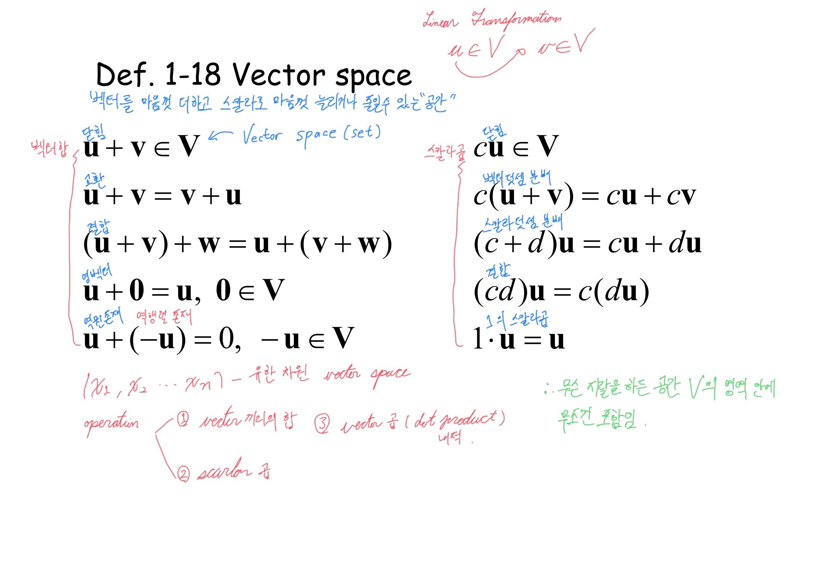
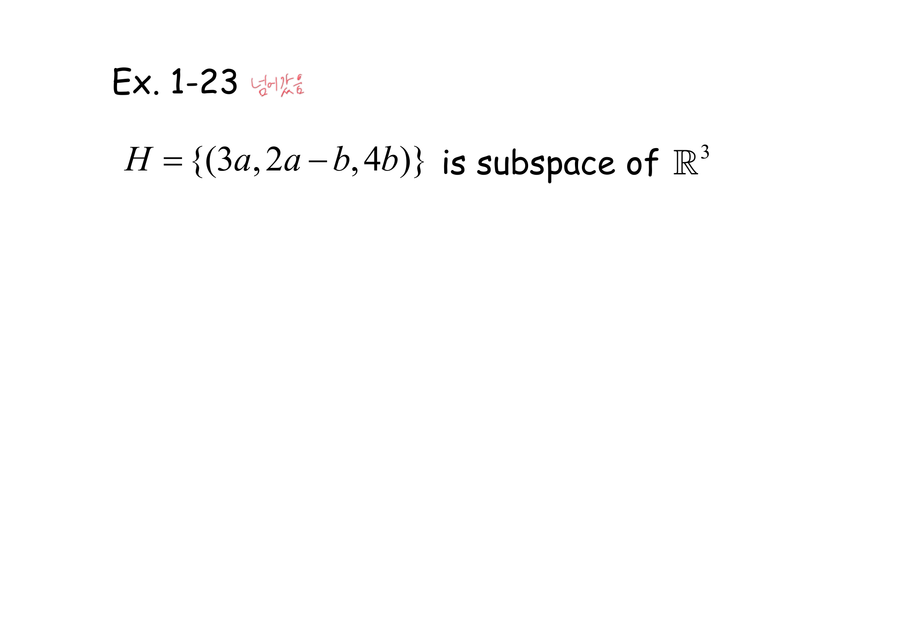
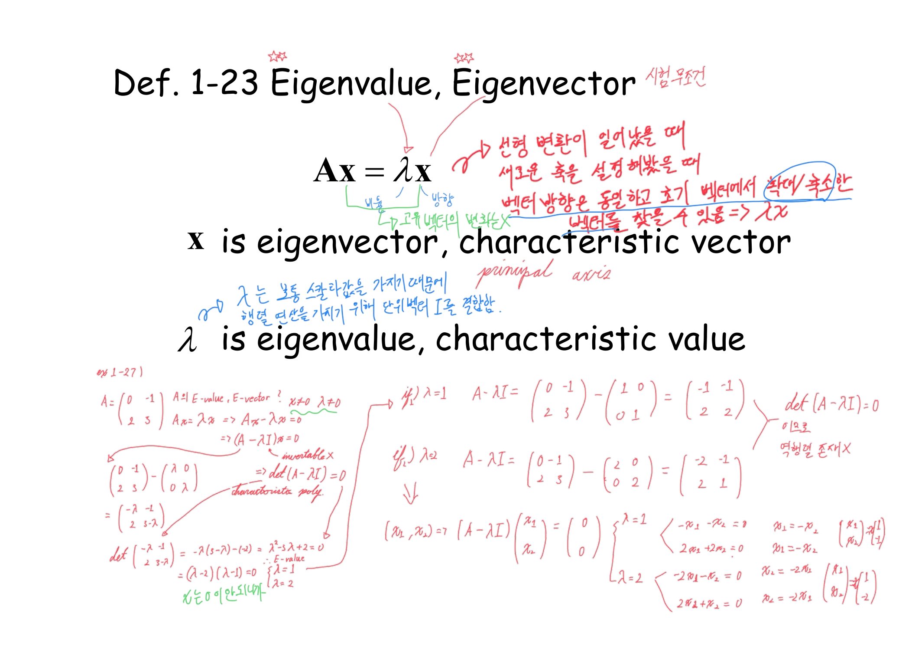
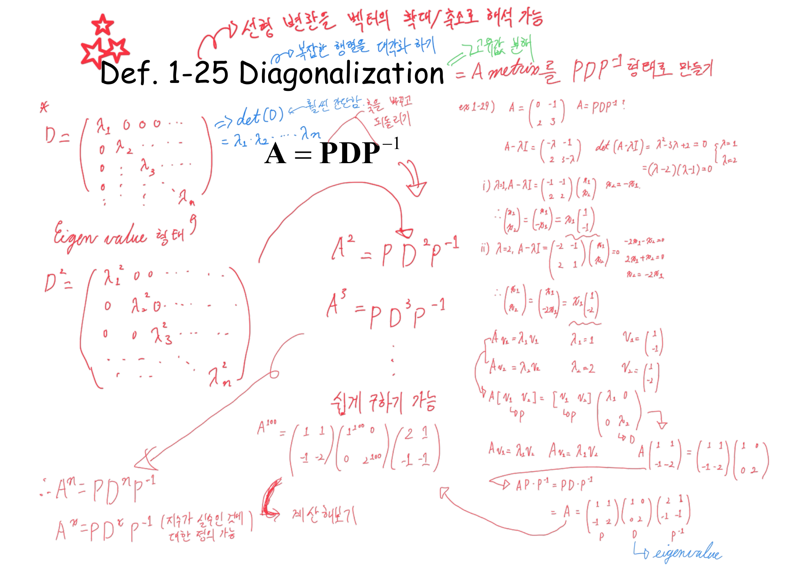
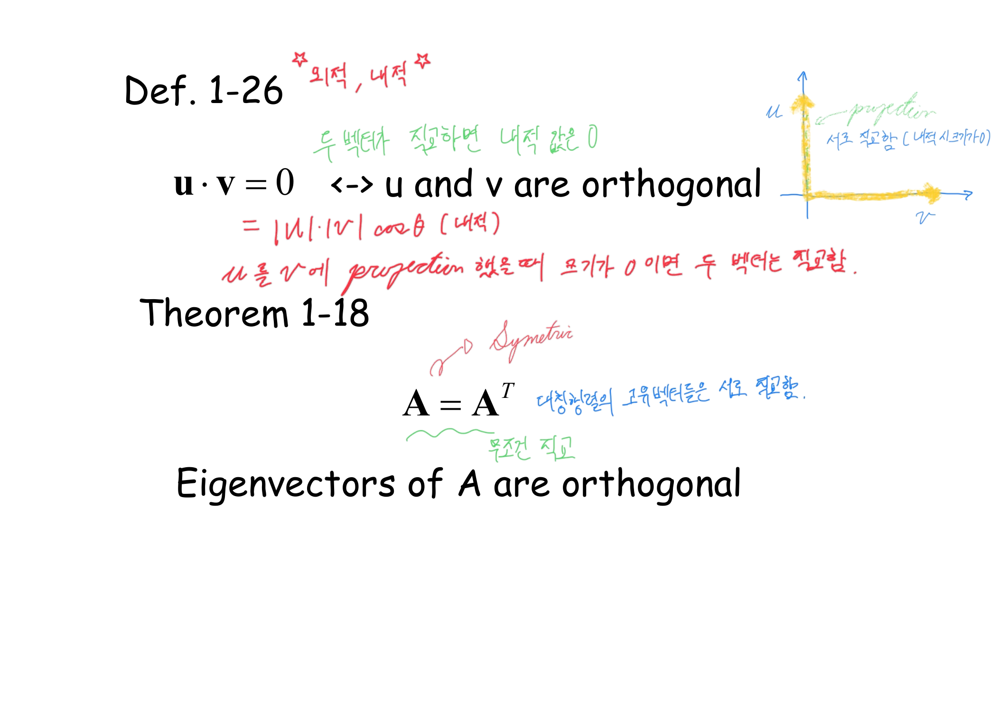
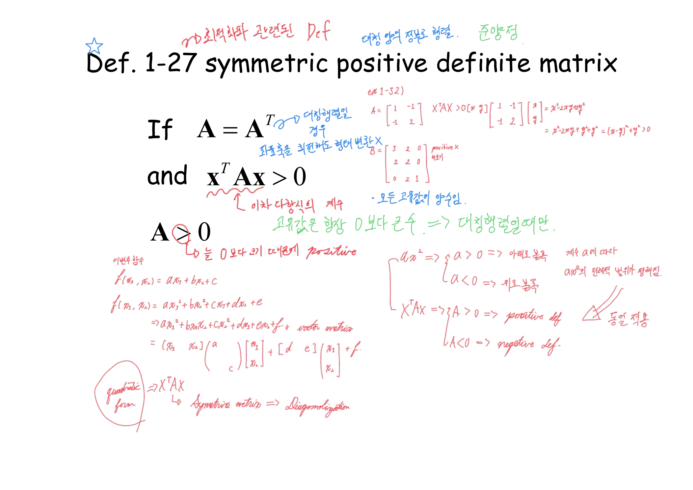
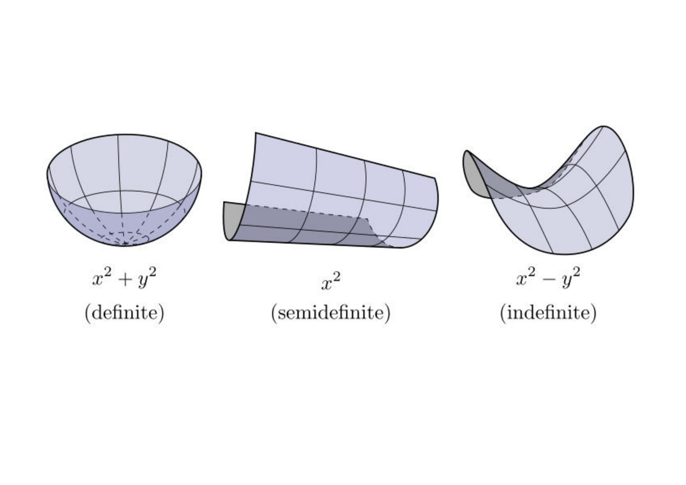
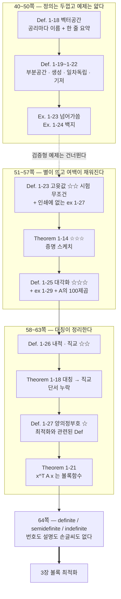

> [!abstract] 잉크의 농도가 이 구간의 지도다
> 앞의 39쪽까지는 규칙이 단순했다 — 정의는 인쇄되고 예제는 잉크로 풀린다([01](./01.%20인쇄된%20것은%20서식이고%20강의는%20잉크다.md)·[02](./02.%20행렬식%20하나가%20대답하는%20세%20가지%20질문.md)). 40쪽부터 그 규칙이 깨진다.
>
> | 구간 | 정의에 붙은 잉크 | 예제에 붙은 잉크 |
> | --- | --- | --- |
> | 40\~50쪽 벡터공간·부분공간·기저 | **빽빽하다** (직관·용어·분류) | **없다** — 46쪽 「넘어가씀」, 48쪽 백지 |
> | 51\~57쪽 고윳값·대각화 | **☆☆·☆☆☆ 와 함께 폭발** | 인쇄에 **없는** 예제가 여백에 통째로 |
> | 58\~63쪽 직교·양의정부호·이차형식 | ☆ 와 함께 유지 | 여백 예제 하나 |
> | 64쪽 | — | **번호도 설명도 없는 그림 한 장** |
>
> 이 농도 변화가 「무엇을 계산할 수 있어야 하는가」에 대한 강의의 판단이고, 그 판단이 곧 이 정리의 척추다.

---

## 40~45쪽 — 정의는 두껍고 예제는 얇다

`Def. 1-18`이 벡터공간을 공리 열 개로 정의한다. 왼쪽 다섯은 덧셈, 오른쪽 다섯은 스칼라배다. 인쇄된 것은 그 열 줄의 수식뿐인데, 잉크가 **공리마다 이름을 붙였다.**



제목 바로 아래 파란 한 줄이 열 공리를 한 문장으로 줄인다.

> 「벡터를 마음껏 더하고 스칼라로 마음껏 늘리거나 줄일 수 있는 "공간"」

그리고 초록 잉크가 결론을 적는다 — 「무슨 짓을 하든 공간 $V$의 영역 안에 무조건 포함임」. 열 개 공리가 실제로 요구하는 것은 **닫힘**이고, 나머지는 그 닫힘 안에서 산술이 평소처럼 굴러가게 하는 조건이라는 읽기다.

붉은 잉크는 따로 연산을 셋으로 정리해 두었다 — ① vector 끼리의 합 ② scalar 곱 ③ vector 곱(dot product, 내적). 세 번째가 **공리 목록에 없다**는 점이 중요하다. 내적은 벡터공간의 구조가 아니라 나중에 얹는 것이고, 실제로 이 자료는 58쪽에 가서야 `Def. 1-26`으로 내적을 꺼낸다.

41~45쪽은 예 다섯 개다 — 다항식 집합, $[0,1]$ 위의 함수 집합, 푸리에 급수, 부분공간의 정의, $H=\{(a,b,0)\}$. 잉크는 거의 없다. 그리고 46쪽에서 완전히 끊긴다.



$$H=\{(3a,\ 2a-b,\ 4b)\}\ \text{가}\ \mathbb{R}^3\text{의 부분공간임을 보여라}$$

풀이 자리에 적힌 것은 **「넘어가씀」** 뿐이다. 그리고 48쪽 `Ex. 1-24`(세 벡터의 일차독립 판정, 다항식 세 개의 일차독립 판정)는 잉크가 아예 **한 획도 없는 완전한 백지**다.

> [!note] 건너뛴 두 문제 — 보충
> 원본에 풀이가 없으므로 직접 정리해 둔다. 두 문제 다 **검증형**이다 — 계산해서 값을 얻는 게 아니라 조건을 만족하는지 따지는 문제고, 건너뛴 것이 그 두 개라는 점이 뒤에 나오는 판단과 이어진다.
>
> `Ex. 1-23`: $(3a, 2a-b, 4b) = a(3,2,0) + b(0,-1,4)$ 이므로 $H = \mathrm{span}\{(3,2,0),(0,-1,4)\}$ 이고, 45쪽 `Theorem 1-10`(생성집합은 부분공간이다)에 의해 곧바로 부분공간이다. **새 계산이 필요 없이 바로 앞 정리 하나로 끝난다.**
>
> `Ex. 1-24`(a): $\mathbf{v}_1=(1,2,3)$, $\mathbf{v}_2=(-1,0,2)$, $\mathbf{v}_3=(0,2,4)$ 은 $\mathbf{v}_1+\mathbf{v}_2 = (0,2,5) \ne \mathbf{v}_3$ 이지만, 세 벡터를 열로 세운 행렬의 행렬식이 $1(0\cdot4-2\cdot2)-(-1)(2\cdot4-2\cdot3)+0 = -4+2 = -2 \ne 0$ 이므로 **일차독립**이다.
>
> (b): $p_1=1$, $p_2=t-t^2$, $p_3=2t^2-2t+5$ 는 $p_3 = -2p_2 + 5p_1$ 이므로 **일차종속**이다. 계수를 직접 맞춰 보면 $-2(t-t^2)+5 = 2t^2-2t+5$ ✓.

---

## 51쪽 — 인쇄에 없는 예제가 여백에 나타난다

`Def. 1-23`은 한 줄짜리 정의다.

$$A\mathbf{x}=\lambda\mathbf{x}$$

그런데 이 페이지의 잉크 밀도가 앞 열 장을 합친 것보다 높다. 제목 위에 별이 **두 개** 그려져 있고 그 옆에 「시험 무조건」이 적혀 있다.



$A\mathbf{x} = \lambda\mathbf{x}$ 의 $\lambda$ 아래 초록으로 「비율」, $\mathbf{x}$ 아래 「방향」이라 적고, 오른쪽에 붉은 글씨로 뜻을 풀었다.

> 선형 변환이 일어났을 때 / 새로운 축을 설정해 봤을 때
> **벡터 방향은 동일하고 초기 벡터에서 확대/축소한 벡터를 찾을 수 있음** ⇒ $\lambda x$

그 아래 `principal axis` 라는 영어 한 마디가 붙는다. 그리고 왜 $\lambda$ 를 그냥 스칼라로 두지 않고 $\lambda I$ 로 쓰는지도 적혀 있다 — 「$\lambda$ 는 보통 스칼라값을 가지기 때문에 행렬 연산을 가지기 위해 단위벡터 $I$ 를 곱함」.

그리고 페이지 아래 절반이 **`ex 1-27)`** 로 시작하는 풀이로 덮여 있다. 인쇄된 1장에는 `Ex. 1-27`이 **존재하지 않는다.** 인쇄된 예제 번호는 `Ex. 1-25`에서 끊긴다.

$$A=\begin{pmatrix}0&-1\\2&3\end{pmatrix},\qquad A\mathbf{x}=\lambda\mathbf{x}\ \Rightarrow\ (A-\lambda I)\mathbf{x}=\mathbf{0}$$

여기서 잉크가 결정적인 한 줄을 적는다 — $\mathbf{x} \ne 0$ 이어야 하므로 $(A-\lambda I)$ 는 **가역이면 안 된다**(`invertable ✗`). 그래서

$$\det(A-\lambda I)=0\quad\textsf{(characteristic poly.)}$$

$$\det\begin{pmatrix}-\lambda&-1\\2&3-\lambda\end{pmatrix}=-\lambda(3-\lambda)+2=\lambda^2-3\lambda+2=(\lambda-2)(\lambda-1)=0$$

$\lambda = 1, 2$. 각각에 대해 $(A-\lambda I)\mathbf{x}=\mathbf{0}$ 을 풀면

| $\lambda$ | $A-\lambda I$ | 방정식 | 고유벡터 |
| --- | --- | --- | --- |
| 1 | $\begin{pmatrix}-1&-1\\2&2\end{pmatrix}$ | $-x_1-x_2=0$ | $\begin{pmatrix}1\\-1\end{pmatrix}$ |
| 2 | $\begin{pmatrix}-2&-1\\2&1\end{pmatrix}$ | $-2x_1-x_2=0$ | $\begin{pmatrix}1\\-2\end{pmatrix}$ |

검산: $A(1,-1)^T = (1,-1)^T = 1\cdot(1,-1)^T$ ✓, $A(1,-2)^T = (2,-4)^T = 2\cdot(1,-2)^T$ ✓.

초록 잉크가 마지막에 한 줄 더 적었다 — 「$x$ 는 0이 안 된다(제외)」. $\mathbf{x}=\mathbf{0}$ 은 어떤 $\lambda$ 에 대해서도 $A\mathbf{0} = \lambda\mathbf{0}$ 을 만족하므로 정의에서 배제해야 하는데, 인쇄된 `Def. 1-23`에는 그 단서가 없다.

### 어느 방향이 방향을 지키는지 보기

51쪽 잉크가 「벡터 방향은 동일하고 확대/축소만」이라고 적은 것을 그림으로 본다. 원 위의 방향을 돌려 가며 $A\mathbf{x}$ 가 $\mathbf{x}$ 와 같은 직선 위에 놓이는 순간을 찾으면 그것이 고유벡터다.

```html preview
<div id="ev-root">
  <style>
    #ev-root{font-family:system-ui,-apple-system,"Segoe UI",sans-serif;color:var(--foreground);padding:4px}
    #ev-root .panel{background:var(--card);border:1px solid var(--border);border-radius:10px;padding:14px}
    #ev-root .wrap{display:flex;flex-wrap:wrap;gap:16px;align-items:flex-start;justify-content:center}
    #ev-root .side{flex:1 1 220px;min-width:210px;font-size:13px}
    #ev-root .row{display:flex;align-items:center;gap:8px;margin:8px 0}
    #ev-root input[type=range]{flex:1;accent-color:var(--chart-1);min-width:90px}
    #ev-root button{background:var(--card);color:var(--foreground);border:1px solid var(--border);border-radius:5px;padding:4px 9px;font:inherit;font-size:12px;cursor:pointer;margin:2px 4px 2px 0}
    #ev-root .out{margin-top:9px;padding:9px 11px;border:1px solid var(--border);border-radius:7px;line-height:1.7}
    #ev-root .hit{background:color-mix(in srgb,var(--chart-2) 14%,transparent);border-color:var(--chart-2)}
    #ev-root code{font-family:ui-monospace,SFMono-Regular,Menlo,monospace}
  </style>
  <div class="panel">
    <div class="wrap">
      <svg id="ev-svg" width="300" height="300" viewBox="0 0 300 300" role="img" aria-label="벡터 x와 Ax를 함께 그린 그림"></svg>
      <div class="side">
        <div class="row"><span style="opacity:.7">방향</span><input type="range" id="ang" min="0" max="359" step="1" value="20"><b id="angv" style="width:40px;text-align:right">20°</b></div>
        <div>
          <button data-a="135">λ=1 방향 (1,−1)</button>
          <button data-a="296.565">λ=2 방향 (1,−2)</button>
        </div>
        <div class="out" id="ev-out"></div>
      </div>
    </div>
  </div>
</div>
<script>
(function(){
  var R=document.getElementById('ev-root'),svg=R.querySelector('#ev-svg');
  var A=[[0,-1],[2,3]], S=26, OX=150, OY=150, L=2.6;
  function X(v){return OX+v*S;} function Y(v){return OY-v*S;}
  function ap(v){return [A[0][0]*v[0]+A[0][1]*v[1], A[1][0]*v[0]+A[1][1]*v[1]];}
  function draw(){
    var deg=+R.querySelector('#ang').value, t=deg*Math.PI/180;
    R.querySelector('#angv').textContent=deg+'°';
    var x=[L*Math.cos(t), L*Math.sin(t)], y=ap(x);
    var g='<defs>';
    ['chart-1','chart-2'].forEach(function(k){
      g+='<marker id="ev-'+k+'" markerWidth="8" markerHeight="8" refX="6.5" refY="3" orient="auto"><path d="M0,0 L7,3 L0,6 z" fill="var(--'+k+')"/></marker>';});
    g+='</defs>';
    for(var k=-5;k<=5;k++){
      g+='<line x1="'+X(k)+'" y1="0" x2="'+X(k)+'" y2="300" stroke="var(--border)" stroke-width="'+(k===0?1.3:0.45)+'"/>';
      g+='<line x1="0" y1="'+Y(k)+'" x2="300" y2="'+Y(k)+'" stroke="var(--border)" stroke-width="'+(k===0?1.3:0.45)+'"/>';
    }
    [[1,-1],[1,-2]].forEach(function(v){
      var n=Math.hypot(v[0],v[1]),u=[v[0]/n*5.6,v[1]/n*5.6];
      g+='<line x1="'+X(-u[0])+'" y1="'+Y(-u[1])+'" x2="'+X(u[0])+'" y2="'+Y(u[1])+'" stroke="var(--chart-4)" stroke-width="1.1" stroke-dasharray="5 4" opacity=".8"/>';
    });
    g+='<circle cx="'+X(0)+'" cy="'+Y(0)+'" r="'+(L*S)+'" fill="none" stroke="var(--border)" stroke-dasharray="2 4"/>';
    g+='<line x1="'+X(0)+'" y1="'+Y(0)+'" x2="'+X(y[0])+'" y2="'+Y(y[1])+'" stroke="var(--chart-2)" stroke-width="2.6" marker-end="url(#ev-chart-2)"/>';
    g+='<line x1="'+X(0)+'" y1="'+Y(0)+'" x2="'+X(x[0])+'" y2="'+Y(x[1])+'" stroke="var(--chart-1)" stroke-width="2.6" marker-end="url(#ev-chart-1)"/>';
    g+='<text x="8" y="16" font-size="11" fill="var(--chart-1)">x</text>';
    g+='<text x="8" y="30" font-size="11" fill="var(--chart-2)">Ax</text>';
    g+='<text x="8" y="44" font-size="11" fill="var(--chart-4)">고유방향</text>';
    svg.innerHTML=g;
    var cross=Math.abs(x[0]*y[1]-x[1]*y[0]), nx=Math.hypot(x[0],x[1]), ny=Math.hypot(y[0],y[1]);
    var sinang=cross/(nx*ny||1), aligned=sinang<0.02;
    var ratio=(x[0]*y[0]+x[1]*y[1])/(nx*nx);
    var o=R.querySelector('#ev-out');
    var h='<code>x = ('+x[0].toFixed(2)+', '+x[1].toFixed(2)+')</code><br><code>Ax = ('+y[0].toFixed(2)+', '+y[1].toFixed(2)+')</code><br>';
    if(aligned){
      o.className='out hit';
      h+='<b>두 화살표가 한 직선 위에 있다.</b><br>Ax = <b>'+ratio.toFixed(3)+'</b> · x — 방향은 그대로이고 길이만 '+ratio.toFixed(3)+'배 됐다. 이것이 고유벡터이고 '+ratio.toFixed(3)+'이 고윳값 λ 다.';
    }else{
      o.className='out';
      h+='두 화살표가 <b>'+(Math.asin(Math.min(1,sinang))*180/Math.PI).toFixed(1)+'°</b> 벌어져 있다 — A가 방향을 바꿨으므로 고유벡터가 아니다.<br><span style="opacity:.72">점선 두 개가 벌어짐이 0이 되는 방향이다.</span>';
    }
    o.innerHTML=h;
  }
  R.addEventListener('input',draw);
  R.addEventListener('click',function(e){ if(e.target.dataset.a){R.querySelector('#ang').value=e.target.dataset.a;draw();} });
  draw();
})();
</script>
```

$2\times2$ 평면에서 방향을 한 바퀴 돌려도 화살표 둘이 겹치는 순간은 **두 번**뿐이다(그리고 그 반대 방향까지 네 번). 51쪽 잉크의 「새로운 축」이라는 말과 `principal axis` 라는 영어가 가리키는 것이 그 두 직선이다.

---

## 53쪽과 56쪽 — 별이 세 개로 늘어난다

`Theorem 1-14`에 별이 셋 붙는다. 「$n$개의 E-vector가 있을 때 이것들은 독립적임 ↳ E-vector는 basis 구성 가능」이 제목 옆에 적히고, 아래 여백에 증명 스케치가 손으로 쓰여 있다 — $c_1\mathbf{v}_1+\cdots+c_n\mathbf{v}_n=0$ 에 $A$ 를 곱하면 $c_i\lambda_i\mathbf{v}_i$ 들이 나오고, $\lambda$ 들이 서로 다르면 모든 $c_i$ 가 0이어야 한다는 흐름이다.

> [!caution] 원본 표기 문제 ④ — 53쪽 `Theorem 1-14`의 조건
> 조건이 **$\lambda_1 \ne \lambda_2 \ne \lambda_3 \ne \cdots \ne \lambda_n$** 으로 적혀 있다. 이 사슬 표기는 **이웃한 것끼리만** 다르다고 말할 뿐 전부 서로 다르다는 뜻이 아니다. $\lambda_1=1, \lambda_2=2, \lambda_3=1$ 은 이 사슬을 만족하지만 $\lambda_1=\lambda_3$ 이다. 정리가 실제로 요구하는 것은 「$i \ne j$ 이면 $\lambda_i \ne \lambda_j$」 — 쌍마다 다름이다.

56쪽 `Def. 1-25`가 1장에서 가장 빽빽한 페이지다. 인쇄된 것은 `A = PDP⁻¹` 한 줄뿐인데, 여백 전체가 붉은 글씨로 덮여 있다.



제목 옆 세 줄이 대각화가 무엇인지를 세 번 다르게 말한다.

> 「선형 변환을 벡터의 확대/축소로 해석 가능」 / 「복잡한 행렬을 대각화 하기」 / 「고윳값 분해 = A matrix를 $PDP^{-1}$ 형태로 만들기」

그리고 오른쪽 여백의 `ex 1-29)` 가 **51쪽과 같은 행렬**을 다시 든다.

$$A=\begin{pmatrix}0&-1\\2&3\end{pmatrix}\ \Rightarrow\ \lambda_1=1,\ \mathbf{v}_1=\begin{pmatrix}1\\-1\end{pmatrix},\qquad \lambda_2=2,\ \mathbf{v}_2=\begin{pmatrix}1\\-2\end{pmatrix}$$

잉크가 $A\mathbf{v}_1 = \lambda_1\mathbf{v}_1$, $A\mathbf{v}_2=\lambda_2\mathbf{v}_2$ 두 식을 **한 덩어리로 묶는 과정**을 직접 보인다.

$$A[\mathbf{v}_1\ \mathbf{v}_2]=[\mathbf{v}_1\ \mathbf{v}_2]\begin{pmatrix}\lambda_1&0\\0&\lambda_2\end{pmatrix}\quad\Longrightarrow\quad AP=PD\quad\Longrightarrow\quad A=PDP^{-1}$$

$$P=\begin{pmatrix}1&1\\-1&-2\end{pmatrix},\quad D=\begin{pmatrix}1&0\\0&2\end{pmatrix},\quad P^{-1}=\begin{pmatrix}2&1\\-1&-1\end{pmatrix}$$

($\det P = -1$ 이므로 `Theorem. 1-5` 공식으로 $P^{-1}$ 이 바로 나온다. $PDP^{-1}$ 을 곱해 보면 정확히 $A$ 로 돌아온다 — 직접 확인했다.)

그리고 이 페이지의 결론이 가운데에 있다.

$$A^2=PD^2P^{-1},\quad A^3=PD^3P^{-1},\quad \cdots,\quad A^n=PD^nP^{-1}$$

「쉽게 구하기 가능」이라는 말과 함께 구체적인 수가 하나 적혀 있다.

$$A^{100}=\begin{pmatrix}1&1\\-1&-2\end{pmatrix}\begin{pmatrix}1^{100}&0\\0&2^{100}\end{pmatrix}\begin{pmatrix}2&1\\-1&-1\end{pmatrix}$$

붉은 잉크는 여기까지만 적고 곱을 전개하지 않았다. 대각선의 $1^{100}$ 과 $2^{100}$ 을 보이는 것이 목적이었기 때문이다 — $D$ 는 $n$제곱이 대각선 성분의 $n$제곱일 뿐이라 **행렬 곱 99번이 스칼라 거듭제곱 두 번으로 줄어든다.**

### $A^n$ 을 두 가지 방법으로 계산해 보기

```html preview
<div id="pw-root">
  <style>
    #pw-root{font-family:system-ui,-apple-system,"Segoe UI",sans-serif;color:var(--foreground);padding:4px}
    #pw-root .panel{background:var(--card);border:1px solid var(--border);border-radius:10px;padding:14px}
    #pw-root .row{display:flex;align-items:center;gap:10px;font-size:13px;flex-wrap:wrap;margin-bottom:12px}
    #pw-root input[type=range]{flex:1;accent-color:var(--chart-1);min-width:120px}
    #pw-root .n{font-weight:700;color:var(--chart-1);min-width:52px;text-align:right;font-variant-numeric:tabular-nums}
    #pw-root .cols{display:flex;flex-wrap:wrap;gap:12px}
    #pw-root .box{flex:1 1 230px;min-width:215px;border:1px solid var(--border);border-radius:8px;padding:10px}
    #pw-root h4{margin:0 0 7px;font-size:12px;letter-spacing:.02em;opacity:.8;font-weight:600}
    #pw-root .mat{font-family:ui-monospace,SFMono-Regular,Menlo,monospace;font-size:11.5px;line-height:1.55;overflow-x:auto;white-space:nowrap}
    #pw-root .cost{margin-top:7px;font-size:12px;opacity:.85}
    #pw-root .note{margin-top:11px;padding:9px 11px;border:1px solid var(--border);border-radius:7px;font-size:13px;line-height:1.7}
    #pw-root b.hl{color:var(--chart-2)}
  </style>
  <div class="panel">
    <div class="row"><span style="opacity:.72">n =</span><input type="range" id="n" min="1" max="100" value="8"><span class="n" id="nv">8</span></div>
    <div class="cols">
      <div class="box"><h4>곧이곧대로 — A를 n번 곱한다</h4><div class="mat" id="m1"></div><div class="cost" id="c1"></div></div>
      <div class="box"><h4>대각화 — P Dⁿ P⁻¹</h4><div class="mat" id="m2"></div><div class="cost" id="c2"></div></div>
    </div>
    <div class="note" id="nt"></div>
  </div>
</div>
<script>
(function(){
  var R=document.getElementById('pw-root');
  var A=[[0n,-1n],[2n,3n]];
  function mul(X,Y){return [[X[0][0]*Y[0][0]+X[0][1]*Y[1][0], X[0][0]*Y[0][1]+X[0][1]*Y[1][1]],
                            [X[1][0]*Y[0][0]+X[1][1]*Y[1][0], X[1][0]*Y[0][1]+X[1][1]*Y[1][1]]];}
  function fmt(M){
    var s=M.map(function(r){return r.map(function(v){return v.toString();});});
    var w=Math.max.apply(null,s.flat().map(function(t){return t.length;}));
    return s.map(function(r){return '[ '+r.map(function(t){return t.padStart(w);}).join('  ')+' ]';}).join('<br>');
  }
  function render(){
    var n=+R.querySelector('#n').value; R.querySelector('#nv').textContent=n;
    var Pw=[[1n,0n],[0n,1n]]; for(var i=0;i<n;i++) Pw=mul(Pw,A);
    var P=[[1n,1n],[-1n,-2n]], Pi=[[2n,1n],[-1n,-1n]];
    var l1=1n**BigInt(n), l2=2n**BigInt(n);
    var D=[[l1,0n],[0n,l2]];
    var viaD=mul(mul(P,D),Pi);
    R.querySelector('#m1').innerHTML=fmt(Pw);
    R.querySelector('#m2').innerHTML=fmt(viaD);
    R.querySelector('#c1').innerHTML='2×2 행렬 곱 <b>'+n+'번</b>';
    R.querySelector('#c2').innerHTML='스칼라 거듭제곱 <b>2번</b> + 행렬 곱 2번';
    var same=Pw.flat().every(function(v,i){return v===viaD.flat()[i];});
    var digits=viaD[0][0].toString().replace('-','').length;
    var t='두 결과가 '+(same?'<b class="hl">정확히 같다</b>':'<b>다르다</b>')+'. ';
    t+='λ = 1 과 2 이므로 Dⁿ = diag(1, 2<sup>'+n+'</sup>) 이고, 1은 아무리 거듭제곱해도 1이라 <b>성분이 커지는 것은 오직 2<sup>'+n+'</sup> 때문</b>이다.';
    if(n>=60) t+='<br>지금 왼쪽 위 성분은 '+digits+'자리 수다. 오른쪽은 그 큰 수를 <code>2**'+n+'</code> 한 번으로 얻었다.';
    if(n===100) t+='<br><b>56쪽 여백이 적어 둔 것이 바로 이 상태다</b> — A¹⁰⁰ = P·diag(1, 2¹⁰⁰)·P⁻¹.';
    R.querySelector('#nt').innerHTML=t;
  }
  R.addEventListener('input',render); render();
})();
</script>
```

$n$을 100까지 밀면 왼쪽은 곱을 100번 하고 오른쪽은 $2^{100}$ 한 번을 한다. 결과는 같다.

$$A^{100}=\begin{pmatrix}2-2^{100}&1-2^{100}\\2^{101}-2&2^{101}-1\end{pmatrix}$$

(왼쪽 위 성분은 31자리 수 $-1267650600228229401496703205374$ 다.) 56쪽이 별 셋을 받은 이유가 여기 있다 — 대각화는 이론적 분류가 아니라 **계산량을 바꾸는 도구**다.

---

## 58~63쪽 — 대칭이 모든 것을 정리한다

`Def. 1-26`이 내적과 직교를 정의하고, `Theorem 1-18`이 대칭행렬의 고유벡터가 직교한다고 말한다. 별 두 개와 함께 「외적, 내적」이 제목 옆에 붙었다.



$$\mathbf{u}\cdot\mathbf{v}=|\mathbf{u}||\mathbf{v}|\cos\theta,\qquad \mathbf{u}\cdot\mathbf{v}=0\iff \mathbf{u}\perp\mathbf{v}$$

붉은 잉크가 투영으로 다시 말한다 — 「$u$ 를 $v$ 에 projection 했을 때 크기가 0이면 두 벡터는 직교함」. 이 투영 해석은 2장에서 방향도함수를 다룰 때 그대로 재등장한다([05](./05.%20한%20파일에%20붙어%20있는%20두%20권의%20책.md) 참조).

> [!caution] 원본 오류 ⑤ — 58쪽 `Theorem 1-18`의 단서 누락
> 인쇄된 문장은 조건 없이 **「$A = A^T$ 이면 $A$의 고유벡터들은 직교한다」** 이다. 이대로는 성립하지 않는다.
>
> 반례: $A = I$ 는 대칭이다. $\mathbf{u}=(1,0)$ 과 $\mathbf{v}=(1,1)$ 은 둘 다 $I\mathbf{x}=1\cdot\mathbf{x}$ 를 만족하는 고유벡터인데 $\mathbf{u}\cdot\mathbf{v} = 1 \ne 0$ 으로 직교하지 않는다.
>
> 정확한 진술은 **「서로 다른 고윳값에 대응하는 고유벡터는 직교한다」** 이다. 고윳값이 겹치면 그 고유공간 안에서 직교하도록 **고를 수 있을** 뿐이고, 아무거나 잡으면 직교하지 않는다. 바로 다음 59쪽 `Theorem 1-19`($A=A^T \Rightarrow A = PDP^{-1} = PDP^T$)가 성립하는 것은 그 「고를 수 있다」 덕분이므로, 결론 자체는 살아남는다 — 빠진 것은 단서뿐이다. 초록 잉크가 $A=A^T$ 아래에 적은 「무조건 직교」도 같은 과장을 옮겨 적었다.

60쪽 `Def. 1-27`이 이 장의 도착점이다.



붉은 잉크가 제목 위에 **「최적화와 관련된 Def」** 라고 적었다. 1장에서 과목 이름이 언급되는 유일한 자리다.

$$A=A^T\ \text{이고}\ \mathbf{x}^T A\mathbf{x}>0\ \Longrightarrow\ A>0$$

`ex 1-32)` 가 여백에 또 나타난다. 그리고 그 $A$ 는 **17쪽 `Ex. 1-7`에서 역행렬을 구했던 바로 그 행렬**이다.

$$A=\begin{pmatrix}1&-1\\-1&2\end{pmatrix},\qquad \mathbf{x}^TA\mathbf{x}=x^2-2xy+2y^2=(x-y)^2+y^2>0$$

완전제곱 두 개의 합이므로 $x=y=0$ 이 아닌 한 항상 양수다 ✓. 그 옆에 $B=\begin{pmatrix}3&2&0\\2&2&0\\0&2&1\end{pmatrix}$ 가 `positive ✗` 로 표시되어 있다 — $(2,3)$ 성분이 0인데 $(3,2)$ 성분이 2라 **애초에 대칭이 아니어서** 정의의 첫 조건부터 걸린다.

이 페이지의 오른쪽 아래가 1장 전체의 결론이다. 1차원과 $n$차원을 나란히 놓았다.

| 1차원 | $n$차원 |
| --- | --- |
| $ax^2$, $a>0$ ⇒ 아래로 볼록 | $\mathbf{x}^TA\mathbf{x}$, $A>0$ ⇒ positive def. |
| $ax^2$, $a<0$ ⇒ 위로 볼록 | $\mathbf{x}^TA\mathbf{x}$, $A<0$ ⇒ negative def. |

「동일 적용」이라 적혀 있다. 그리고 왼쪽 아래에 사슬 하나가 더 있다 — `quadratic form ⇒ XᵀAX ↳ Symmetric matrix ⇒ Diagonalization`. 이차형식을 다루려면 대칭행렬이 필요하고, 대칭이면 대각화가 되며, 대각화하면 고윳값의 부호로 볼록성이 판정된다는 흐름이다.

63쪽 `Theorem 1-21`이 그 사슬을 한 문장으로 닫는다.

> If $A$ is symmetric positively definite matrix, then $Q(\mathbf{x}) = \mathbf{x}^T A\mathbf{x}$ is **convex function**.

---

## 64쪽 — 번호도 설명도 없는 그림 한 장

1장 65쪽 중 텍스트 추출이 **0자**로 나오는 페이지는 딱 한 장, 64쪽이다. 열어 보면 이렇다.



| 그림 | 식 | 이름 | 고윳값 |
| --- | --- | --- | --- |
| 사발 | $x^2+y^2$ | definite | 둘 다 양수 |
| 반원통(홈통) | $x^2$ | semidefinite | 하나가 0 |
| 안장 | $x^2-y^2$ | indefinite | 부호가 엇갈림 |

이 세 곡면이 63쪽 `Theorem 1-21`의 조건이 **무엇을 배제하는지**를 보여 준다. 「positive definite」가 참인 것은 첫 번째뿐이고, 두 번째는 최솟값이 한 점이 아니라 직선 전체이며, 세 번째는 최솟값 자체가 없다.

> [!important] 이 그림은 1장의 결론이 아니라 3장의 도입이다
> 64쪽에는 손글씨가 없다. 앞뒤 어느 페이지도 이 그림을 가리키지 않는다. 65쪽은 `Question?` 한 단어다. **1장이 이 그림으로 끝난다는 사실만 있고, 왜 끝나는지는 적혀 있지 않다.**
>
> 그 답은 3장에 있다. 3장 16쪽 `예제 3-6`이 볼록함수 판정을 **헤세 행렬의 행렬식과 대각합**으로 하는데, 그 판정이 정확히 「고윳값이 전부 ≥ 0 인가」이고 그 세 경우가 이 그림의 세 곡면이다([07](./07.%20볼록%20하나를%20다섯%20번%20다시%20쓴다.md)). 그리고 3장의 모든 경사하강 예제가 쓰는 함수가 $f(\mathbf{x}) = \frac12\mathbf{x}^TA\mathbf{x}$ — 63쪽 `Theorem 1-21`의 $Q(\mathbf{x})$ 바로 그것이다([08](./08.%20같은%20문제를%20세%20번%20낸다.md)).
>
> 즉 이 그림은 1장이 만든 도구(대칭·고윳값·대각화·정부호)가 **어디에 쓰이려고 만들어졌는지**를 말없이 가리키는 표지판이다.

---

## 40~65쪽의 잉크 농도 지도



건너뛴 것과 별이 붙은 것을 나란히 놓으면 기준이 보인다. **「조건을 만족하는지 따지는 문제」는 넘어갔고, 「값을 구해 내는 문제」에는 별이 붙었다.** 부분공간임을 보이는 문제와 일차독립을 보이는 문제는 답이 「그렇다/아니다」뿐이지만, 고윳값·고유벡터·$P$·$D$·$A^{100}$ 은 전부 손으로 만들어 내야 하는 값이다.

---

## 다음으로

이것으로 1장이 끝난다. 2장은 완전히 다른 종류의 자료다 — 교수의 수식 목록과 교재 페이지가 한 파일 안에 블록으로 번갈아 붙어 있고, 텍스트가 0자인 페이지가 57쪽 중 **33장**이다.

- [02. 행렬식 하나가 대답하는 세 가지 질문](./02.%20행렬식%20하나가%20대답하는%20세%20가지%20질문.md) — 18~39쪽
- [04. 한 점에서 전 영역을 사 온다](./04.%20한%20점에서%20전%20영역을%20사%20온다.md) — 2장 1~10쪽. 테일러 급수
- [07. 볼록 하나를 다섯 번 다시 쓴다](./07.%20볼록%20하나를%20다섯%20번%20다시%20쓴다.md) — 64쪽 그림이 도착하는 곳

---

## 근거 자료

| 쪽 | 인쇄된 것 | 잉크가 더한 것 |
| --- | --- | --- |
| **40** | `Def. 1-18` 벡터공간 공리 10개 | 공리마다 이름(단힘·교환·결합·영벡터·역원존재 등), 「마음껏 더하고 늘리거나 줄일 수 있는 공간」, 연산 3종, 「무조건 포함임」 |
| 41–45 | `Ex. 1-21` 다항식·함수·푸리에, `Def. 1-19` 부분공간, `Ex. 1-22`, `Def. 1-20` 일차결합·생성, `Theorem 1-10` | 거의 없음 |
| **46** | `Ex. 1-23` $H=\{(3a,2a-b,4b)\}$ | **「넘어가씀」 세 글자뿐** |
| 47 | `Def. 1-21` 일차독립 | — |
| **48** | `Ex. 1-24` (a) 벡터 셋 (b) 다항식 셋 | **완전한 백지** |
| **49** | `Def. 1-22` 기저 | 「기저는 공간을 만들어내는 최소한의 벡터 집합」·「서로 독립이어야 함」, $\mathbb{R}^4$ 표준기저 네 개, `unique` |
| 50 | `Ex. 1-25` $\{1,t,\dots,t^n\}$ | — |
| **51** | `Def. 1-23` $A\mathbf{x}=\lambda\mathbf{x}$ 한 줄 | **☆☆ 「시험 무조건」**, 비율/방향, `principal axis`, $\lambda I$ 를 쓰는 이유, **인쇄에 없는 `ex 1-27` 전체 풀이**(특성방정식→$\lambda=1,2$→고유벡터) |
| 52 | `Theorem 1-13` $A^T$·$A^k$·$A^{-1}$의 고윳값 | — |
| **53** | `Theorem 1-14` — **조건이 사슬 표기** | ☆☆☆, 「$n$개의 E-vector는 독립」·「basis 구성 가능」, 증명 스케치 |
| 54–55 | `Def. 1-24` 닮음변환, `Theorem. 1-15` | — |
| **56** | `Def. 1-25` `A = PDP⁻¹` 한 줄 | **☆☆☆**, $D$·$D^2$의 모양, $AP=PD$ 유도, **`ex 1-29`**($P$·$D$·$P^{-1}$), $A^n=PD^nP^{-1}$, **$A^{100}$** |
| 57 | `Theorem 1-17` 대각화 가능 ⟺ 일차독립 고유벡터 $n$개 | — |
| **58** | `Def. 1-26` 내적·직교, `Theorem 1-18` — **단서 누락** | ☆☆ 「외적, 내적」, $\lvert\mathbf{u}\rvert\,\lvert\mathbf{v}\rvert\cos\theta$, projection 해석, 직교축 그림 |
| 59 | `Theorem 1-19` $A=PDP^T$ | — |
| **60** | `Def. 1-27` 대칭 양의정부호 | ☆, **「최적화와 관련된 Def」**, `ex 1-32`($(x-y)^2+y^2$), $B$에 `positive ✗`, **$ax^2$ ↔ $\mathbf{x}^TA\mathbf{x}$ 대조표**, `quadratic form → Symmetric → Diagonalization` |
| 61–62 | `Theorem 1-20`, `Def. 1-28` 이차형식 | — |
| 63 | `Theorem 1-21` $Q(\mathbf{x})=\mathbf{x}^TA\mathbf{x}$ 는 볼록함수 | — |
| **64** | **곡면 세 개 + 영문 캡션 3줄. 번호·설명·손글씨 전부 없음** | — |
| 65 | `Question?` | — |

추출 번들: `.ok/local/pdf-extract/02_math-theory__optimization-math__MSC087_1장_행렬_v3/` (`page_chars` 0자 페이지: 64쪽 한 장. 65쪽 전부 180 dpi 재렌더로 확인)

수치 검증: `ex 1-27`의 특성다항식·고유벡터와 $A\mathbf{v}=\lambda\mathbf{v}$ 검산, `ex 1-29`의 $P^{-1}$·$PDP^{-1}=A$, $A^{100}$(파이썬 `BigInt` 상당의 정수 연산으로 직접 곱한 결과와 $PD^{100}P^{-1}$ 을 대조 — 일치), `ex 1-32`의 $(x-y)^2+y^2$ 항등식, 보충으로 든 `Ex. 1-23`·`Ex. 1-24` 풀이와 `Theorem 1-18` 반례($A=I$) — 전부 직접 계산해 확인했다.
