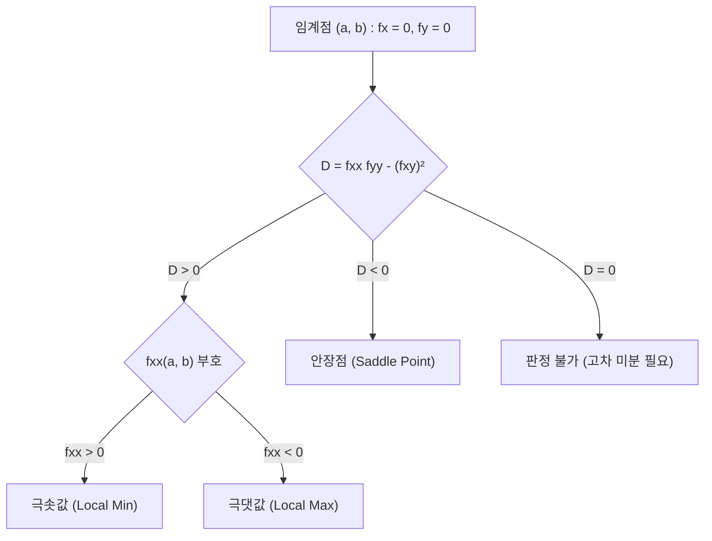

> [!abstract] 핵심 요약
> **방향 도함수(Directional Derivative)**는 임의의 단위 방향 벡터 $\mathbf{u}$를 따라 함수 $f(\mathbf{x})$의 순간 변화율을 측정하며, 그레이디언트와의 내적($D_{\mathbf{u}} f = \nabla f \cdot \mathbf{u}$)으로 계산된다.
> 제약조건 $g(\mathbf{x}) = 0$ 하의 최적화는 **라그랑주 승수법($\nabla f = \lambda \nabla g$)**으로 풀이하며, 2변수 함수의 극값 및 안장점 판정은 헤시안 행렬식 판별식 $D = f_{xx} f_{yy} - (f_{xy})^2$을 통해 엄밀하게 결정된다.

---

## 1. 방향 도함수(Directional Derivative) 수식 유도

단위 벡터 $\mathbf{u} = \frac{\mathbf{v}}{\|\mathbf{v}\|}$에 대해:

$$D_{\mathbf{u}} f(\mathbf{x}_0) = \lim_{h \to 0} \frac{f(\mathbf{x}_0 + h\mathbf{u}) - f(\mathbf{x}_0)}{h} = \nabla f(\mathbf{x}_0) \cdot \mathbf{u} = \|\nabla f(\mathbf{x}_0)\| \cos \theta$$

> [!NOTE]
> - **최대 증가율 방향**: $\theta = 0 \implies \mathbf{u} = \frac{\nabla f}{\|\nabla f\|}$ (최댓값: $\|\nabla f\|$)
> - **최대 감소율 방향**: $\theta = \pi \implies \mathbf{u} = -\frac{\nabla f}{\|\nabla f\|}$ (최솟값: $-\|\nabla f\|$)
> - **등고선 접선 방향 (변화율 0)**: $\theta = \frac{\pi}{2} \implies \nabla f \perp \mathbf{u}$

---

## 2. 2변수 함수 2계 도함수 판별식($D$)과 극값 분류

$$D = \det(H) = f_{xx}(a, b) f_{yy}(a, b) - [f_{xy}(a, b)]^2$$



---

## 3. 실시간 방향도함수 및 라그랑주 승수법 계산기

```html preview
<div style="font-family:system-ui,-apple-system,sans-serif;padding:20px;background:var(--card);color:var(--card-foreground);border:1px solid var(--border);border-radius:var(--radius)">
  <div style="font-size:16px;font-weight:700;margin-bottom:14px;color:var(--primary);display:flex;align-items:center;gap:8px">
    <span>🧭 방향 도함수 D_u f(x, y) 실시간 내적 계산기</span>
  </div>

  <div style="display:grid;grid-template-columns:1fr 1fr;gap:12px;margin-bottom:14px">
    <div style="padding:10px;background:var(--background);border:1px solid var(--border);border-radius:var(--radius)">
      <div style="font-size:12px;font-weight:700;color:var(--chart-1);margin-bottom:6px">그레이디언트 ∇f = [gx, gy]:</div>
      <div style="display:flex;gap:6px">
        <input id="inGx" type="number" value="3" style="width:50%;padding:4px;background:var(--card);color:var(--foreground);border:1px solid var(--border);border-radius:var(--radius);text-align:center;font-weight:700" />
        <input id="inGy" type="number" value="4" style="width:50%;padding:4px;background:var(--card);color:var(--foreground);border:1px solid var(--border);border-radius:var(--radius);text-align:center;font-weight:700" />
      </div>
    </div>

    <div style="padding:10px;background:var(--background);border:1px solid var(--border);border-radius:var(--radius)">
      <div style="font-size:12px;font-weight:700;color:var(--chart-2);margin-bottom:6px">방향 벡터 v = [vx, vy]:</div>
      <div style="display:flex;gap:6px">
        <input id="inVx" type="number" value="1" style="width:50%;padding:4px;background:var(--card);color:var(--foreground);border:1px solid var(--border);border-radius:var(--radius);text-align:center;font-weight:700" />
        <input id="inVy" type="number" value="1" style="width:50%;padding:4px;background:var(--card);color:var(--foreground);border:1px solid var(--border);border-radius:var(--radius);text-align:center;font-weight:700" />
      </div>
    </div>
  </div>

  <div style="padding:12px;background:var(--background);border:1px solid var(--primary);border-radius:var(--radius)">
    <div style="font-size:11px;color:var(--muted-foreground)">단위 벡터 정규화 및 방향 도함수 계산:</div>
    <div id="dirResultOut" style="font-family:monospace;font-size:13px;font-weight:700;color:var(--primary);margin-top:4px"></div>
  </div>

  <script>
    function calcDirDeriv() {
      var gx = parseFloat(document.getElementById('inGx').value) || 0;
      var gy = parseFloat(document.getElementById('inGy').value) || 0;
      var vx = parseFloat(document.getElementById('inVx').value) || 0;
      var vy = parseFloat(document.getElementById('inVy').value) || 0;

      var vNorm = Math.sqrt(vx * vx + vy * vy);
      if (vNorm === 0) {
        document.getElementById('dirResultOut').textContent = "방향벡터의 크기가 0입니다.";
        return;
      }

      var ux = vx / vNorm;
      var uy = vy / vNorm;

      var dirDeriv = (gx * ux) + (gy * uy);
      var gNorm = Math.sqrt(gx * gx + gy * gy);

      var out = "단위방향 u = [" + ux.toFixed(3) + ", " + uy.toFixed(3) + "]ᵀ\n";
      out += "D_u f = ∇f · u = (" + gx + " × " + ux.toFixed(3) + ") + (" + gy + " × " + uy.toFixed(3) + ") = " + dirDeriv.toFixed(4) + "\n";
      out += "최대 증가율: ||∇f|| = " + gNorm.toFixed(4);

      document.getElementById('dirResultOut').innerText = out;
    }

    ['inGx', 'inGy', 'inVx', 'inVy'].forEach(function(id) {
      document.getElementById(id).addEventListener('input', calcDirDeriv);
    });
    calcDirDeriv();
  </script>
</div>
```
