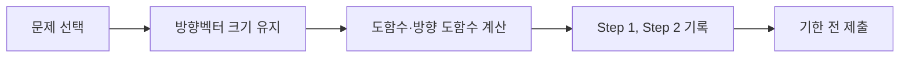

Homework 2는 방향 도함수, 도함수 계산 문제를 단계별 풀이로 제출하는 과제다. 리포트 양식은 학과·교수·학번·이름·제출일과 풀이 단계를 기록한다.



<Tabs>
  <Tab label="문제">p156–158의 2장 연습문제를 대상으로 한다.</Tab>
  <Tab label="풀이">모든 문제에서 계산 과정을 단계별로 명시한다.</Tab>
  <Tab label="양식">학과, 교수, 학번, 이름, 제출일을 채운다.</Tab>
</Tabs>

```html preview
<div style="font-family:system-ui,sans-serif;padding:20px;color:var(--foreground)">
<label for="amt" style="font-size:14px;font-weight:600">과제 단계</label>
<div id="out" style="font-size:30px;font-weight:700;color:var(--chart-1);margin:6px 0">1단계</div>
<input id="amt" type="range" min="1" max="3" step="1" value="1" style="width:100%;accent-color:var(--primary)" />
<p style="font-size:13px;color:var(--muted-foreground)">원본 장의 순서를 움직여 계산 단계를 확인한다.</p>
<script>
var amt=document.getElementById('amt'); var out=document.getElementById('out');
amt.addEventListener('input',function(){out.textContent=Number(amt.value).toLocaleString()+'단계';});
</script>
</div>
```

> [!WARNING]
> 원본 공지의 마감은 2025-12-07 22:00이다. 현재 제출 일정은 LMS의 최신 공지를 별도로 확인한다.

<details>
<summary>제출 전 점검</summary>

방향벡터의 크기 조건 확인 → 식 전개 → 단계별 답 작성 → 학생 정보 기입 → 파일 형식·제출 경로 확인.

</details>

<!-- source: MSC087_HW2 and report template; assignment scope and fields preserved -->