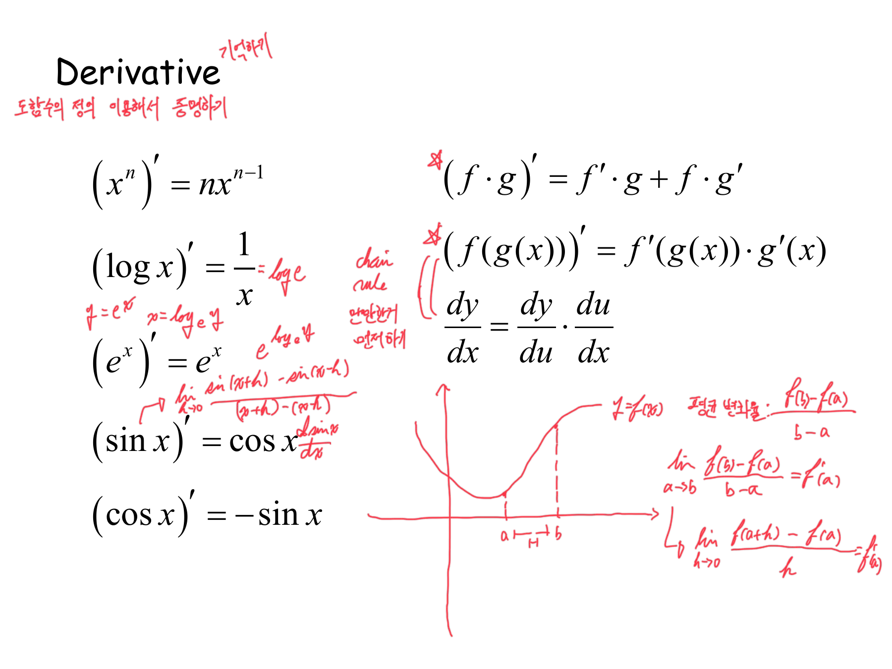
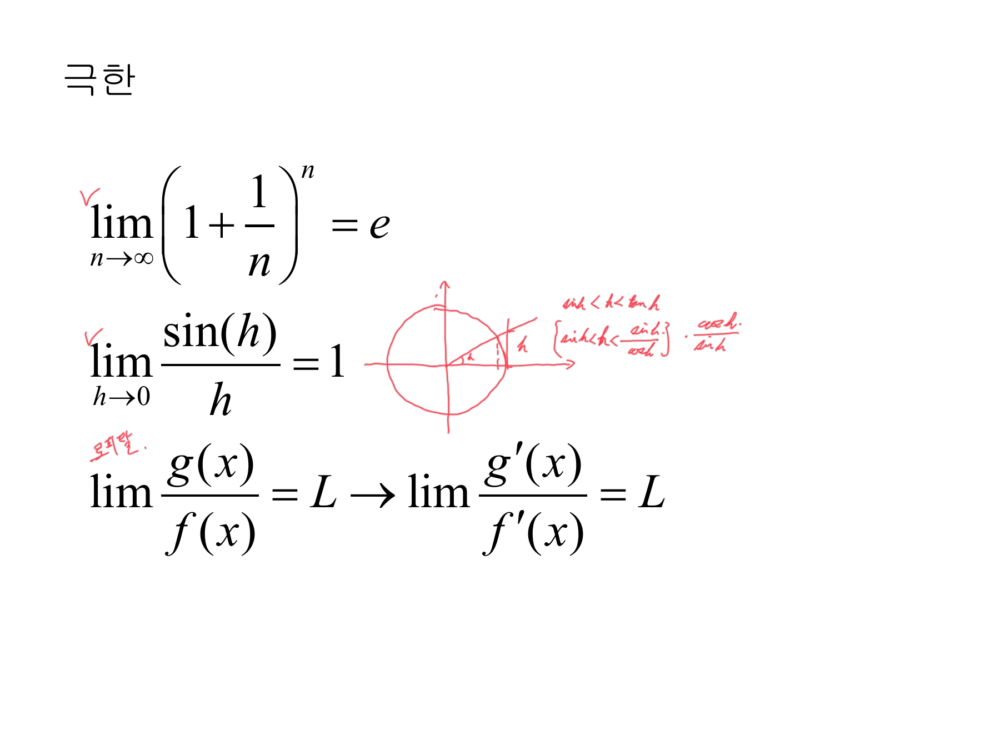
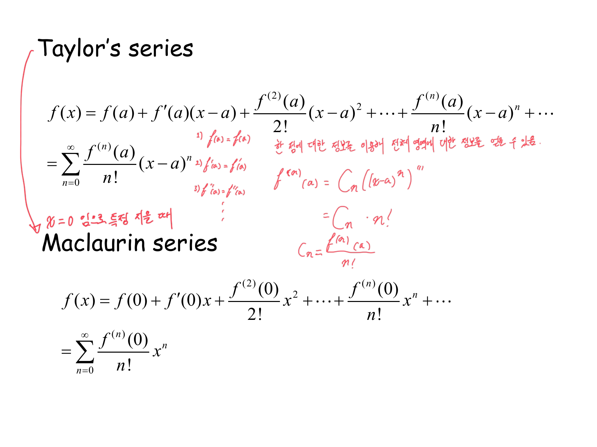
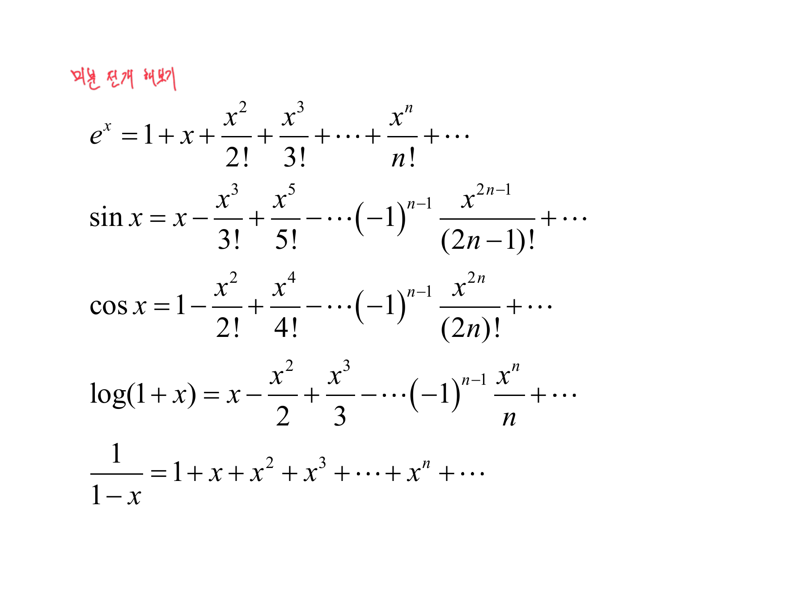
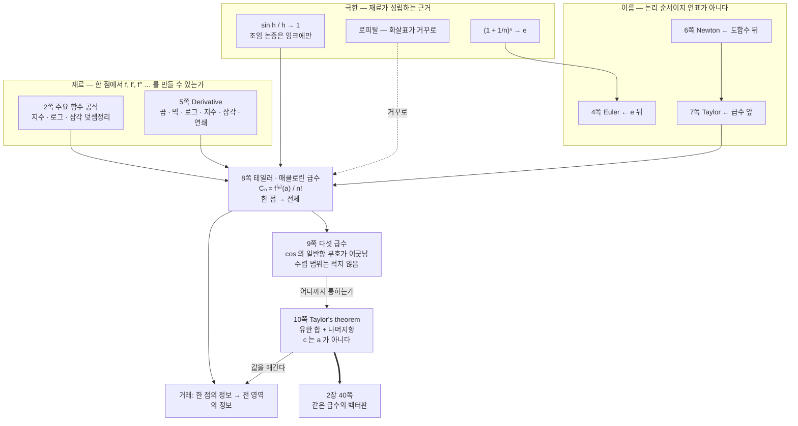

> [!abstract] 열 장이 준비하는 것은 한 문장이다
> 2장의 첫 열 장에는 예제가 하나도 없다. 공식 목록(2·5쪽), 극한 세 줄(3쪽), 초상화 세 장(4·6·7쪽), 급수(8·9쪽), 정리(10쪽)가 전부다. 왜 이것들이 이 순서로 놓였는지는 8쪽 여백의 붉은 한 줄이 말한다.
>
> > 「**한 점에 대한 정보를 이용하여 전체 영역에 대한 정보를 얻을 수 있음**」
>
> 앞의 일곱 장은 그 「한 점에 대한 정보」를 만들 재료이고, 10쪽은 그 거래에 붙는 값이다. 11쪽부터 다변수가 시작되면 이 열 장은 다시 언급되지 않지만, 40쪽에서 **같은 급수가 벡터로 다시 나온다**.

---

## 2·5쪽 — 「한 점의 정보」를 만들 연장

2쪽은 제목이 `주요 함수 공식`이고 다섯 줄이다.

$$e^{\log x}=x,\qquad \log_a x=\frac{\log x}{\log a}$$
$$\sin(\alpha+\beta)=\sin\alpha\cos\beta+\cos\alpha\sin\beta,\qquad \cos(\alpha+\beta)=\cos\alpha\cos\beta-\sin\alpha\sin\beta$$

5쪽은 `Derivative` 한 장에 미분 규칙 전부를 몰아넣었다.



$$(fg)'=f'g+fg',\qquad (x^n)'=nx^{n-1},\qquad (\log x)'=\frac1x,\qquad (e^x)'=e^x$$
$$(\sin x)'=\cos x,\qquad (\cos x)'=-\sin x,\qquad \bigl(f(g(x))\bigr)'=f'(g(x))\cdot g'(x)$$

이 목록에 **몫의 미분이 없다**는 점이 눈에 띈다. $(f/g)'$ 대신 곱과 합성만 있다 — $f/g = f \cdot g^{-1}$ 로 두고 곱과 멱을 조합하라는 뜻이고, 실제로 2장 16쪽 `예제 2-7`(b)에서 $\log\frac{x}{1+y}$ 를 $\log x - \log(1+y)$ 로 쪼개 미분하는 장면이 그 습관을 보여 준다([05](./05.%20한%20파일에%20붙어%20있는%20두%20권의%20책.md)).

두 장을 합치면 「어떤 점에서든 $f$, $f'$, $f''$, … 를 계산할 수 있다」가 확보된다. 그것이 곧 거래에 내놓을 물건이다.

---

## 3쪽 — 극한 세 줄, 그중 하나는 화살표가 거꾸로다



첫째 줄과 둘째 줄에는 붉은 체크만 붙었다.

$$\lim_{n\to\infty}\Bigl(1+\frac1n\Bigr)^n=e,\qquad \lim_{h\to0}\frac{\sin h}{h}=1$$

둘째 줄 옆에는 **증명이 그려져 있다.** 단위원을 그리고 각 $h$ 에 대해 세 길이를 비교한다.

$$\sin h<h<\tan h\ \Longrightarrow\ \sin h<h<\frac{\sin h}{\cos h}$$

양변을 $\sin h$ 로 나누면 $1 < \dfrac{h}{\sin h} < \dfrac{1}{\cos h}$ 이고, $h\to0$ 에서 양 끝이 모두 1이므로 가운데도 1이다. 인쇄된 슬라이드에는 결과 `= 1` 만 있고, 이 조임 논증은 잉크에만 있다.

셋째 줄에는 붉은 글씨로 **「로피탈」**이 붙었다. 그런데 인쇄된 식이 이렇다.

$$\lim\frac{g(x)}{f(x)}=L\ \longrightarrow\ \lim\frac{g'(x)}{f'(x)}=L$$

> [!caution] 원본 오류 ⑥ — 3쪽 로피탈 정리의 화살표 방향
> 화살표가 **거꾸로**다. 로피탈 정리는 「도함수의 비가 수렴하면 원래 비도 그 값으로 수렴한다」이므로 방향이 반대여야 한다.
>
> $$\lim\frac{g'(x)}{f'(x)}=L\ \longrightarrow\ \lim\frac{g(x)}{f(x)}=L$$
>
> 인쇄된 방향은 **거짓이다.** $g(x)=x+\sin x$, $f(x)=x$ 로 두고 $x\to\infty$ 를 보면
>
> $$\frac{g(x)}{f(x)}=1+\frac{\sin x}{x}\ \longrightarrow\ 1\quad\textsf{(수렴)},\qquad \frac{g'(x)}{f'(x)}=\frac{1+\cos x}{1}\quad\textsf{(0과 2 사이를 영원히 오간다)}$$
>
> 왼쪽은 수렴하는데 오른쪽은 극한이 없다. 그러므로 「$\lim g/f = L$ 이면 $\lim g'/f' = L$」은 성립하지 않는다.
>
> 덧붙여 인쇄된 식에는 **$0/0$ 또는 $\infty/\infty$ 라는 전제도 빠져 있다.** 이 전제 없이 쓰면 $\lim_{x\to0}\frac{x+1}{x+2} = \frac12$ 인데 도함수의 비는 $\frac11 = 1$ 로 서로 다른 값이 나온다.

### 화살표가 왜 한쪽으로만 가는지 보기

```html preview
<div id="lh-root">
  <style>
    #lh-root{font-family:system-ui,-apple-system,"Segoe UI",sans-serif;color:var(--foreground);padding:4px}
    #lh-root .panel{background:var(--card);border:1px solid var(--border);border-radius:10px;padding:14px}
    #lh-root .bar{display:flex;gap:10px;align-items:center;font-size:13px;flex-wrap:wrap;margin-bottom:10px}
    #lh-root input[type=range]{flex:1;accent-color:var(--chart-1);min-width:120px}
    #lh-root .stage{display:flex;justify-content:center}
    #lh-root .lg{display:flex;gap:14px;justify-content:center;font-size:12px;margin-top:6px;flex-wrap:wrap}
    #lh-root .sw{display:inline-block;width:20px;height:3px;vertical-align:middle;margin-right:5px}
    #lh-root .out{margin-top:10px;padding:9px 12px;border:1px solid var(--border);border-radius:7px;font-size:13px;line-height:1.75}
    #lh-root code{font-family:ui-monospace,SFMono-Regular,Menlo,monospace}
  </style>
  <div class="panel">
    <div class="bar"><span style="opacity:.72">x 를 어디까지 볼까</span><input type="range" id="xm" min="12" max="140" value="45"><b id="xmv" style="width:44px;text-align:right">45</b></div>
    <div class="stage"><svg id="lh-svg" width="560" height="230" viewBox="0 0 560 230" style="max-width:100%;height:auto" role="img" aria-label="g/f 와 g'/f' 의 그래프 비교"></svg></div>
    <div class="lg">
      <span><i class="sw" style="background:var(--chart-1)"></i>g(x)/f(x) = 1 + sin x / x</span>
      <span><i class="sw" style="background:var(--chart-2)"></i>g′(x)/f′(x) = 1 + cos x</span>
    </div>
    <div class="out" id="lh-out"></div>
  </div>
</div>
<script>
(function(){
  var R=document.getElementById('lh-root'),svg=R.querySelector('#lh-svg');
  var W=560,H=230,L=42,Rr=12,T=14,B=28;
  function draw(){
    var xm=+R.querySelector('#xm').value; R.querySelector('#xmv').textContent=xm;
    var x0=2, ymin=-0.35, ymax=2.35;
    function PX(x){return L+(x-x0)/(xm-x0)*(W-L-Rr);}
    function PY(y){return T+(ymax-y)/(ymax-ymin)*(H-T-B);}
    var g='';
    [0,1,2].forEach(function(v){
      g+='<line x1="'+L+'" y1="'+PY(v)+'" x2="'+(W-Rr)+'" y2="'+PY(v)+'" stroke="var(--border)" stroke-width="'+(v===1?1.3:0.6)+'" '+(v===1?'stroke-dasharray="6 4"':'')+'/>';
      g+='<text x="'+(L-7)+'" y="'+(PY(v)+4)+'" font-size="10" text-anchor="end" fill="var(--foreground)" opacity=".6">'+v+'</text>';
    });
    g+='<line x1="'+L+'" y1="'+PY(ymin)+'" x2="'+(W-Rr)+'" y2="'+PY(ymin)+'" stroke="var(--border)"/>';
    var p1='',p2='',N=1400;
    for(var i=0;i<=N;i++){
      var x=x0+(xm-x0)*i/N;
      var a=1+Math.sin(x)/x, b=1+Math.cos(x);
      p1+=(i?'L':'M')+PX(x).toFixed(2)+','+PY(a).toFixed(2);
      p2+=(i?'L':'M')+PX(x).toFixed(2)+','+PY(b).toFixed(2);
    }
    g+='<path d="'+p2+'" fill="none" stroke="var(--chart-2)" stroke-width="1.5" opacity=".95"/>';
    g+='<path d="'+p1+'" fill="none" stroke="var(--chart-1)" stroke-width="2.4"/>';
    g+='<text x="'+(W-Rr)+'" y="'+(H-8)+'" font-size="10" text-anchor="end" fill="var(--foreground)" opacity=".6">x = '+xm+'</text>';
    g+='<text x="'+L+'" y="'+(H-8)+'" font-size="10" fill="var(--foreground)" opacity=".6">x = 2</text>';
    svg.innerHTML=g;
    var band=(1+Math.sin(xm)/xm);
    R.querySelector('#lh-out').innerHTML=
      '<code>g/f</code> 는 x 가 커질수록 점선(=1)에 <b>달라붙는다</b> — 지금 끝값 '+band.toFixed(4)+', 오차는 1/x 이하로 줄어든다.<br>'+
      '<code>g′/f′ = 1 + cos x</code> 는 <b>0과 2 사이를 끝없이 오간다</b> — 폭이 전혀 줄지 않으므로 극한이 없다.<br>'+
      '<span style="opacity:.78">그래서 <b>왼쪽이 수렴해도 오른쪽은 수렴하지 않는다.</b> 3쪽 인쇄된 화살표가 주장하는 방향이 바로 이것이고, 이 그림이 그 반례다. 로피탈이 실제로 허용하는 것은 오른쪽 → 왼쪽뿐이다.</span>';
  }
  R.addEventListener('input',draw); draw();
})();
</script>
```

슬라이더를 오른쪽 끝까지 밀어도 파란 곡선의 진폭은 줄지 않는다. 반면 굵은 곡선은 점선에 붙는다. 「한쪽이 수렴한다고 다른 쪽이 수렴하지는 않는다」가 이 그림 전부다.

---

## 4·6·7쪽 — 초상화 세 장

4쪽 Leonhard Euler(1707–1783), 6쪽 Isaac Newton(1643–1727), 7쪽 Brook Taylor(1685–1731). 각 페이지에 이름과 생몰년 말고는 아무것도 없다.

배치가 말을 한다. **오일러는 상수 $e$ 뒤에, 뉴턴은 도함수 뒤에, 테일러는 급수 앞에** 놓였다. 3쪽의 $\lim(1+1/n)^n = e$ 가 오일러를 부르고, 5쪽의 미분 공식이 뉴턴을 부르며, 뉴턴 다음에 테일러가 와서 8쪽을 연다. 생몰년을 보면 순서가 시간순이 아니다 — 뉴턴(1643)이 오일러(1707)보다 앞이다. 그러니 이 배열은 연표가 아니라 **논리 순서**다.

---

## 8쪽 — 거래가 성립하는 자리



$$f(x)=f(a)+f'(a)(x-a)+\frac{f^{(2)}(a)}{2!}(x-a)^2+\cdots=\sum_{n=0}^{\infty}\frac{f^{(n)}(a)}{n!}(x-a)^n$$

인쇄된 것은 이 식과 $a=0$ 인 매클로린 급수다. 붉은 잉크는 **계수가 왜 $\dfrac{f^{(n)}(a)}{n!}$ 인지**를 유도해 놓았다.

먼저 왼쪽에 조건을 나열한다 — 근사식이 $x=a$ 에서 원래 함수와 값·1계·2계·… 도함수를 **전부 맞춰야** 한다.

$$f(a)=\tilde f(a),\quad f'(a)=\tilde f'(a),\quad f''(a)=\tilde f''(a),\ \dots$$

그다음 $n$번째 항 $C_n(x-a)^n$ 을 $n$번 미분하면 $(x-a)$ 가 전부 사라지고 상수만 남는다.

$$f^{(n)}(a)=C_n\bigl[(x-a)^n\bigr]^{(n)}=C_n\cdot n!\quad\Longrightarrow\quad C_n=\frac{f^{(n)}(a)}{n!}$$

$n!$ 은 임의로 붙인 것이 아니라 **$n$번 미분할 때 지수에서 떨어져 나온 것**이다. 그리고 그 위의 한 줄이 이 유도의 뜻을 요약한다 — 「한 점에 대한 정보를 이용하여 전체 영역에 대한 정보를 얻을 수 있음」.

매클로린 급수 쪽에는 화살표와 함께 「$x=0$ 임으로 특정 지을 때」가 붙었다. 매클로린은 새 정리가 아니라 $a=0$ 인 특수한 경우일 뿐이라는 표시다.

---

## 9쪽 — 다섯 급수, 그리고 하나의 부호



$$e^x=1+x+\frac{x^2}{2!}+\frac{x^3}{3!}+\cdots+\frac{x^n}{n!}+\cdots$$
$$\sin x=x-\frac{x^3}{3!}+\frac{x^5}{5!}-\cdots(-1)^{n-1}\frac{x^{2n-1}}{(2n-1)!}+\cdots$$
$$\log(1+x)=x-\frac{x^2}{2}+\frac{x^3}{3}-\cdots(-1)^{n-1}\frac{x^n}{n}+\cdots$$
$$\frac{1}{1-x}=1+x+x^2+x^3+\cdots+x^n+\cdots$$

붉은 글씨 「미분 전개 해보기」는 8쪽의 $C_n = f^{(n)}(0)/n!$ 를 이 다섯에 직접 적용해 보라는 지시다. 예를 들어 $e^x$ 는 모든 도함수가 $e^x$ 이고 $e^0=1$ 이므로 $C_n = 1/n!$ 이 바로 나온다.

> [!caution] 원본 오류 ⑦ — 9쪽 코사인 급수의 일반항 부호
> 인쇄된 코사인 급수는 이렇다.
>
> $$\cos x=1-\frac{x^2}{2!}+\frac{x^4}{4!}-\cdots(-1)^{n-1}\frac{x^{2n}}{(2n)!}+\cdots$$
>
> 앞쪽에 쓴 항들과 뒤의 일반항이 **어긋난다.** 일반항에 $n=1$ 을 넣으면 $(-1)^0\dfrac{x^2}{2!}=+\dfrac{x^2}{2!}$ 인데, 앞에 적힌 두 번째 항은 $-\dfrac{x^2}{2!}$ 다. 올바른 일반항은 $(-1)^{n}\dfrac{x^{2n}}{(2n)!}$ 이다.
>
> 같은 쪽의 다른 두 급수는 정확하다. $\sin$ 의 $(-1)^{n-1}\dfrac{x^{2n-1}}{(2n-1)!}$ 은 $n=1$ 에서 $+x$ 로 맞고, $\log(1+x)$ 의 $(-1)^{n-1}\dfrac{x^{n}}{n}$ 도 $n=1$ 에서 $+x$ 로 맞는다. **$(-1)^{n-1}$ 이라는 같은 부호 인자를 세 줄에 그대로 복사하면서, 코사인만 상수항 1 때문에 차수가 한 칸 밀린다는 점을 놓쳤다.**

### 다섯 급수가 어디까지 통하는지 보기

같은 「한 점의 정보」로 만들었는데도 다섯 급수가 미치는 범위는 전혀 다르다. 9쪽은 그 차이를 한마디도 하지 않는다.

```html preview
<div id="ts-root">
  <style>
    #ts-root{font-family:system-ui,-apple-system,"Segoe UI",sans-serif;color:var(--foreground);padding:4px}
    #ts-root .panel{background:var(--card);border:1px solid var(--border);border-radius:10px;padding:14px}
    #ts-root .bar{display:flex;gap:6px;flex-wrap:wrap;margin-bottom:9px}
    #ts-root button{background:var(--card);color:var(--foreground);border:1px solid var(--border);border-radius:5px;padding:4px 9px;font:inherit;font-size:12px;cursor:pointer}
    #ts-root button.act{border-color:var(--chart-1);background:color-mix(in srgb,var(--chart-1) 16%,transparent)}
    #ts-root .row{display:flex;gap:10px;align-items:center;font-size:13px;margin-bottom:8px}
    #ts-root input[type=range]{flex:1;accent-color:var(--chart-1);min-width:110px}
    #ts-root .stage{display:flex;justify-content:center}
    #ts-root .out{margin-top:9px;padding:9px 12px;border:1px solid var(--border);border-radius:7px;font-size:13px;line-height:1.7}
    #ts-root code{font-family:ui-monospace,SFMono-Regular,Menlo,monospace}
    #ts-root .lg{display:flex;gap:14px;justify-content:center;font-size:12px;margin-top:5px}
    #ts-root .sw{display:inline-block;width:20px;height:3px;vertical-align:middle;margin-right:5px}
  </style>
  <div class="panel">
    <div class="bar" id="ts-bar"></div>
    <div class="row"><span style="opacity:.72">차수 N</span><input type="range" id="N" min="1" max="24" value="5"><b id="Nv" style="width:26px;text-align:right">5</b></div>
    <div class="stage"><svg id="ts-svg" width="560" height="250" viewBox="0 0 560 250" style="max-width:100%;height:auto" role="img" aria-label="함수와 테일러 부분합 비교"></svg></div>
    <div class="lg"><span><i class="sw" style="background:var(--chart-3)"></i>원래 함수</span><span><i class="sw" style="background:var(--chart-1)"></i>N차 부분합</span></div>
    <div class="out" id="ts-out"></div>
  </div>
</div>
<script>
(function(){
  var R=document.getElementById('ts-root'),svg=R.querySelector('#ts-svg');
  var FS={
    'eˣ':{f:function(x){return Math.exp(x);},t:function(x,N){var s=0,t=1;for(var n=0;n<=N;n++){s+=t;t*=x/(n+1);}return s;},xr:[-4,4],yr:[-2,20],rad:'∞'},
    'sin x':{f:Math.sin,t:function(x,N){var s=0;for(var n=0;2*n+1<=N;n++){var t=Math.pow(-1,n)*Math.pow(x,2*n+1);for(var k=2;k<=2*n+1;k++)t/=k;s+=t;}return s;},xr:[-9,9],yr:[-3,3],rad:'∞'},
    'cos x':{f:Math.cos,t:function(x,N){var s=0;for(var n=0;2*n<=N;n++){var t=Math.pow(-1,n)*Math.pow(x,2*n);for(var k=2;k<=2*n;k++)t/=k;s+=t;}return s;},xr:[-9,9],yr:[-3,3],rad:'∞'},
    'log(1+x)':{f:function(x){return x<=-1?NaN:Math.log(1+x);},t:function(x,N){var s=0;for(var n=1;n<=N;n++)s+=Math.pow(-1,n-1)*Math.pow(x,n)/n;return s;},xr:[-1.6,1.6],yr:[-3.2,2],rad:'|x| < 1'},
    '1/(1−x)':{f:function(x){return Math.abs(x-1)<1e-9?NaN:1/(1-x);},t:function(x,N){var s=0;for(var n=0;n<=N;n++)s+=Math.pow(x,n);return s;},xr:[-1.6,1.6],yr:[-3,7],rad:'|x| < 1'}
  };
  var cur='eˣ';
  function bar(){R.querySelector('#ts-bar').innerHTML=Object.keys(FS).map(function(k){
    return '<button class="'+(k===cur?'act':'')+'" data-k="'+k+'">'+k+'</button>';}).join('');}
  var W=560,Hh=250,L=44,Rr=14,T=12,B=26;
  function draw(){
    var N=+R.querySelector('#N').value; R.querySelector('#Nv').textContent=N;
    var S=FS[cur],x0=S.xr[0],x1=S.xr[1],y0=S.yr[0],y1=S.yr[1];
    function PX(x){return L+(x-x0)/(x1-x0)*(W-L-Rr);}
    function PY(y){return T+(y1-y)/(y1-y0)*(Hh-T-B);}
    function clamp(y){return Math.max(y0-1,Math.min(y1+1,y));}
    var g='';
    g+='<line x1="'+PX(0)+'" y1="'+T+'" x2="'+PX(0)+'" y2="'+(Hh-B)+'" stroke="var(--border)" stroke-width="1.2"/>';
    if(y0<0&&y1>0) g+='<line x1="'+L+'" y1="'+PY(0)+'" x2="'+(W-Rr)+'" y2="'+PY(0)+'" stroke="var(--border)" stroke-width="1.2"/>';
    if(S.rad!=='∞'){
      [-1,1].forEach(function(v){g+='<line x1="'+PX(v)+'" y1="'+T+'" x2="'+PX(v)+'" y2="'+(Hh-B)+'" stroke="var(--chart-5)" stroke-width="1.2" stroke-dasharray="5 4" opacity=".8"/>';});
    }
    function path(fn){var p='',pen=false;
      for(var i=0;i<=900;i++){var x=x0+(x1-x0)*i/900,y=fn(x);
        if(!isFinite(y)||y<y0-1.2||y>y1+1.2){pen=false;continue;}
        p+=(pen?'L':'M')+PX(x).toFixed(2)+','+PY(clamp(y)).toFixed(2);pen=true;}
      return p;}
    g+='<path d="'+path(S.f)+'" fill="none" stroke="var(--chart-3)" stroke-width="2.6" opacity=".85"/>';
    g+='<path d="'+path(function(x){return S.t(x,N);})+'" fill="none" stroke="var(--chart-1)" stroke-width="2"/>';
    g+='<circle cx="'+PX(0)+'" cy="'+PY(S.f(0))+'" r="4" fill="var(--chart-1)"/>';
    g+='<text x="'+(PX(0)+7)+'" y="'+(PY(S.f(0))-7)+'" font-size="10" fill="var(--chart-1)">a = 0</text>';
    svg.innerHTML=g;
    var pts=[],tot=0,cnt=0;
    for(var i=0;i<=200;i++){var x=x0+(x1-x0)*i/200,a=S.f(x);
      if(isFinite(a)){var e=Math.abs(S.t(x,N)-a);if(isFinite(e)){tot+=Math.min(e,1e6);cnt++;}}}
    var o=R.querySelector('#ts-out');
    var t='<b>'+cur+'</b> 의 '+N+'차 부분합. 수렴 범위: <b>'+S.rad+'</b>';
    if(S.rad==='∞'){t+='<br>차수를 올리면 <b>양쪽으로 계속 넓어진다</b> — 어디까지 가든 결국 따라잡는다.';}
    else{t+='<br>점선 <code>x = ±1</code> 밖에서는 <b>차수를 아무리 올려도 따라잡지 못한다.</b> 오히려 더 크게 벗어난다.';}
    t+='<br><span style="opacity:.75">다섯 급수 다 「0에서의 도함수 전부」라는 같은 재료로 만들어졌는데 미치는 거리가 다르다. 9쪽은 이 차이를 적지 않는다.</span>';
    o.innerHTML=t;
  }
  R.addEventListener('click',function(e){if(e.target.dataset.k){cur=e.target.dataset.k;bar();draw();}});
  R.addEventListener('input',draw);
  bar();draw();
})();
</script>
```

$e^x$·$\sin$·$\cos$ 는 차수를 올리면 어디까지든 따라잡지만, $\log(1+x)$ 와 $\dfrac{1}{1-x}$ 는 $|x|<1$ 밖에서 **영원히 실패한다.** 8쪽의 거래가 항상 성립하는 것은 아니라는 뜻인데, 9쪽에는 그 단서가 없다. 그 단서를 제공하는 것이 바로 다음 장이다.

---

## 10쪽 — 거래에 붙는 값

`Taylor's theorem` 은 무한급수가 아니라 **유한 합 + 나머지항**이다.

$$f(x)=f(a)+f'(a)(x-a)+\cdots+\frac{f^{(n)}(a)}{n!}(x-a)^n+\underbrace{\frac{f^{(n+1)}(c)}{(n+1)!}(x-a)^{n+1}}_{\textsf{나머지항}},\qquad c\in(a,x)$$

8쪽·9쪽과 결정적으로 다른 점이 둘이다.

**첫째, 합이 유한하다.** $n$차까지만 쓰고 나머지를 한 항에 몰아넣는다. 무한급수는 「수렴하는가」를 따져야 하지만 이 식은 **모든 $n$에 대해 등식**이다.

**둘째, $c$ 가 $a$ 가 아니다.** 앞의 $n{+}1$ 개 계수는 전부 $a$ 에서 계산되는데 나머지항만 $a$ 와 $x$ 사이의 알 수 없는 점 $c$ 에서 계산된다. 이것이 거래의 값이다 — **한 점에서 전 영역을 사 오되, 오차는 그 구간 어딘가의 알 수 없는 점이 결정한다.**

$c$ 를 모르는 채로도 쓸모가 있는 이유는 $|f^{(n+1)}|$ 의 상한만 알면 오차의 상한이 나오기 때문이다. $\sin$·$\cos$ 는 모든 도함수의 절댓값이 1 이하라 나머지항이 $\dfrac{|x-a|^{n+1}}{(n+1)!}$ 로 눌리고, $(n+1)!$ 이 어떤 거듭제곱보다 빨리 커지므로 모든 $x$ 에서 0으로 간다. 위 그래프에서 $\sin$·$\cos$ 가 끝없이 넓어지는 이유가 그것이다.

---

## 1~10쪽의 구조



---

## 다음으로

11쪽에서 자료의 성격이 통째로 바뀐다. 교수의 수식 목록이 끊기고 **교재 페이지가 이미지째로 붙기 시작**하며, 텍스트 추출이 0자인 페이지가 줄줄이 이어진다.

- [03. 잉크가 끊겼다 되살아나는 자리](./03.%20잉크가%20끊겼다%20되살아나는%20자리.md) — 1장의 마지막, 볼록성으로 가는 다리
- [05. 한 파일에 붙어 있는 두 권의 책](./05.%20한%20파일에%20붙어%20있는%20두%20권의%20책.md) — 11~27쪽. 다변수와 기울기벡터
- [06. 잉크가 멈춘 자리에서 과제가 시작된다](./06.%20잉크가%20멈춘%20자리에서%20과제가%20시작된다.md) — 40쪽이 이 장의 급수를 벡터로 다시 쓴다

---

## 근거 자료

| 쪽 | 인쇄된 것 | 잉크가 더한 것 |
| --- | --- | --- |
| 1 | 표지 `최적화 수학 / 2. Calculus` | — |
| 2 | `주요 함수 공식` — $e^{\log x}$, 로그 밑변환, $\sin/\cos$ 덧셈정리 | — |
| **3** | `극한` 세 줄 — **셋째 줄 화살표가 거꾸로** | 앞 두 줄에 체크, **단위원과 $\sin h<h<\tan h$ 조임 논증**, 셋째 줄에 「로피탈」 |
| 4 | `Leonhard Euler (1707-1783)` | — |
| 5 | `Derivative` — 미분 규칙 7개 (몫의 미분은 없음) | — |
| 6 | `Isaac Newton (1643-1727)` | — |
| 7 | `Brook Taylor (1685-1731)` | — |
| **8** | `Taylor's series` · `Maclaurin series` | **계수 유도**($f^{(n)}(a)=C_n\cdot n!$), **「한 점에 대한 정보를 이용하여 전체 영역에 대한 정보를 얻을 수 있음」**, 매클로린에 「$x=0$ 임으로 특정 지을 때」 |
| **9** | 다섯 급수 — **cos 의 일반항이 $(-1)^{n-1}$** | 「미분 전개 해보기」 |
| 10 | `Taylor's theorem` — 유한 합 + 나머지항, $c\in(a,x)$ | — |

추출 번들: `.ok/local/pdf-extract/02_math-theory__optimization-math__MCS087_2장_미적분_v3/`
(57쪽 전부 `--render all` 로 렌더. 이 구간 1\~10쪽은 `page_chars` 가 15\~206자로 0자 페이지가 없지만, 3·8·9쪽의 붉은 글씨는 전부 추출에 잡히지 않는다.)

수치 검증: 로피탈 반례($g=x+\sin x$, $f=x$)의 두 극한을 수치로 확인했고, 코사인 급수 일반항에 $n=1$ 을 대입해 부호 불일치를 확인했다. 인터랙티브의 부분합은 정의대로 항을 더해 계산하며 원래 함수와 직접 대조한다.
