> [!abstract] 11쪽에서 자료가 바뀐다
> 1\~10쪽은 교수가 직접 만든 흰 슬라이드였다([04](./04.%20한%20점에서%20전%20영역을%20사%20온다.md)). 11쪽부터 **다른 책의 페이지가 이미지째로 끼어들기 시작**한다.
>
> | | 교수 슬라이드 | 끼어든 교재 페이지 |
> | --- | --- | --- |
> | 겉모습 | 흰 바탕, 수식만 | 파랑·붉은색·보라 색 박스에 `예제 2-2`·`정의 2-3`·`정리 2-3` |
> | 번호 | 없다 (`Clairut's theorem`, `Directional Derivatives`) | 있다 (`정의 2-6`, `예제 2-13`) |
> | 텍스트 추출 | 19\~127자로 잡힌다 | **0자** — 통째로 이미지다 |
> | 역할 | 절의 표지·요약 | 정의와 예제의 본문 |
>
> 이 구간 17장 중 **11장이 0자**다. 그래서 텍스트만 읽으면 이 장에는 「`Clairut's theorem`」과 「`Directional Derivatives`」 두 줄밖에 남지 않는다. 나머지는 전부 이미지이고, 그 위에 손글씨가 얹혀 있다.

---

## 11~13쪽 — 교재가 같은 문제를 두 번 낸다

첫 번째 교재 페이지가 `예제 2-2`다. 문제는 「다음 함수의 그래프를 그려보세요」이고, 인쇄된 것은 두 함수식뿐이다.

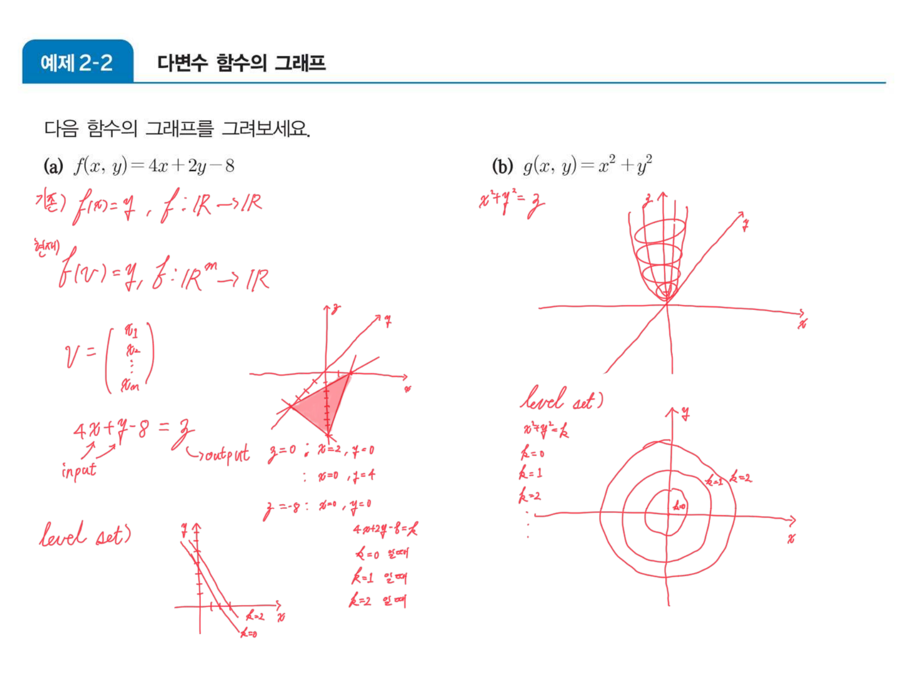

$$f(x,y)=4x+2y-8,\qquad g(x,y)=x^2+y^2$$

잉크가 먼저 한 일은 그림이 아니라 **차원을 다시 세는 것**이다. 왼쪽 위에 「기존) $f(x)=y$, $f:\mathbb{R}\to\mathbb{R}$」 과 「현재) $f(v)=y$, $f:\mathbb{R}^m\to\mathbb{R}$」 를 나란히 적고, $v$ 가 $(x_1,\dots,x_m)^T$ 임을 세로로 풀어 썼다. 1장에서 다룬 벡터가 이제 **함수의 입력**이 된다는 선언이다.

$f$ 에는 $4x+2y-8=z$ 라 쓰고 `input`·`output` 화살표를 붙인 뒤 절편으로 평면을 잡았다 — $z=0$ 일 때 $(2,0)$ 과 $(0,4)$, $x=y=0$ 일 때 $z=-8$. $g$ 에는 $x^2+y^2=z$ 라 쓰고 포물면을 그렸다.

그리고 두 함수 **각각에 「level set)」이라는 소제목을 붙여** 아래에 다시 그림을 그렸다. $f$ 는 $4x+2y-8=k$ 를 $k=0,1,2$ 에 대해 평행한 직선들로, $g$ 는 $x^2+y^2=k$ 를 $k=0,1,2$ 에 대한 동심원으로.

12쪽이 그 용어를 뒤늦게 정의한다. `정의 2-3 레벨집합`이고, 잉크는 딱 한 단어만 붙였다 — **「⇒ 등고선」**. 그리고 13쪽이 온다.

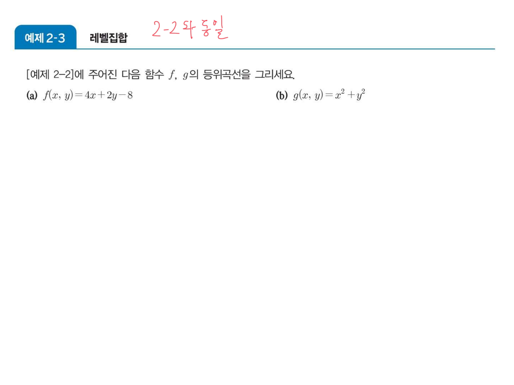

> 「[예제 2–2]에 주어진 다음 함수 $f$, $g$의 **등위곡선**을 그리세요.」
> **(a)** $f(x,y)=4x+2y-8$   **(b)** $g(x,y)=x^2+y^2$

같은 두 함수다. 그리고 등위곡선은 레벨집합의 다른 이름이므로 **`예제 2-2`에서 이미 그린 것을 다시 그리라는 문제**다. 잉크가 그 사실을 세 글자로 적었다 — 「2-2와 동일」. 그리고 아래는 비워 두었다.

> [!caution] 원본의 중복 ⑧ — `예제 2-2` ↔ `예제 2-3`
> 두 예제가 **같은 두 함수에 대해 같은 것을 요구한다.** 교재의 원래 배치에서는 `예제 2-2`(그래프)와 `정의 2-3`(레벨집합) 사이에 순서가 있어서 `예제 2-3`이 새 개념의 첫 적용이었을 것이다. 그런데 이 강의자료에서는 **11쪽의 잉크가 이미 레벨집합까지 그려 버려서** 13쪽이 할 일이 남지 않았다.
>
> 즉 이 중복은 교재 자체의 중복이기도 하고, 동시에 **정의보다 그림을 먼저 그린 강의 순서가 만든 중복**이기도 하다. 잉크의 「2-2와 동일」이 그 둘을 한 번에 지적한다.

---

## 15쪽 — 하나의 요령이 이 절 전체를 푼다

14쪽 `예제 2-4`(다변수 함수의 극한 두 문제)는 **완전한 백지**다. 잉크가 한 획도 없다. 그리고 15쪽에서 밀도가 폭발한다.

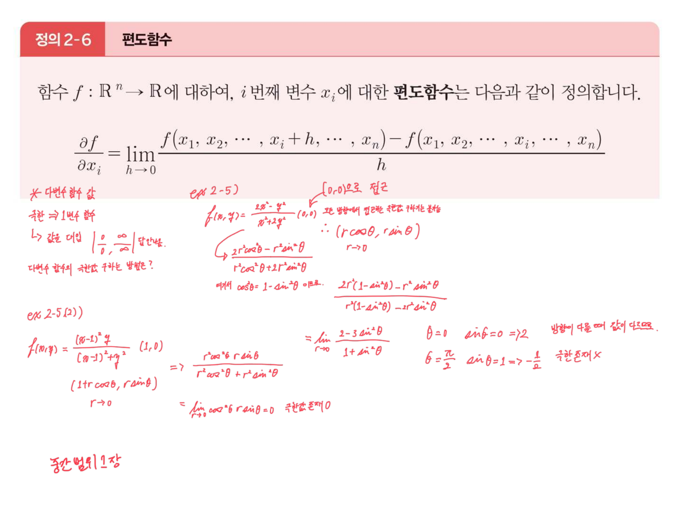

인쇄된 것은 편도함수의 정의다.

$$\frac{\partial f}{\partial x_i}=\lim_{h\to0}\frac{f(x_1,\dots,x_i+h,\dots,x_n)-f(x_1,\dots,x_i,\dots,x_n)}{h}$$

그런데 잉크는 **편도함수가 아니라 극한**을 다룬다. 왼쪽에 문제 제기부터 적었다.

> 「다변수 함수 값 / 극한 ⇒ 1변수 함수 / ↳ 값을 대입 $\left|\dfrac{0}{0}, \dfrac{\infty}{\infty}\right|$ 답답하다 / **다변수 함수의 극한값 구하는 방법은?**」

그리고 답을 내놓는다 — **극좌표 치환**이다. `ex 2-5)` 가 여백에 나타난다.

$$f(x,y)=\frac{2x^2-y^2}{x^2+2y^2}\ \text{의 } (0,0)\text{에서의 극한}$$

$x=r\cos\theta$, $y=r\sin\theta$ 를 넣으면 분자·분모의 $r^2$ 이 통째로 약분된다.

$$\frac{2r^2\cos^2\theta-r^2\sin^2\theta}{r^2\cos^2\theta+2r^2\sin^2\theta}=\frac{2\cos^2\theta-\sin^2\theta}{\cos^2\theta+2\sin^2\theta}$$

$\cos^2\theta = 1-\sin^2\theta$ 로 정리하면($「여기서 \cos^2\theta = 1-\sin^2\theta 이므로」$ 라고 적혀 있다)

$$\lim_{r\to0}\frac{2-3\sin^2\theta}{1+\sin^2\theta}$$

$r$ 이 사라졌다. **$\theta$ 만 남았다는 것이 결론이다.**

| $\theta$ | $\sin^2\theta$ | 극한값 |
| --- | --- | --- |
| $0$ | 0 | $\dfrac{2}{1}=2$ |
| $\dfrac{\pi}{2}$ | 1 | $\dfrac{-1}{2}=-\dfrac12$ |

잉크가 그 옆에 적었다 — 「방향이 다를 때마다 값이 다르므로」, 「극한 존재 ✗」. 원점에 **어느 방향으로 접근하느냐**에 따라 값이 달라지므로 극한이 없다.

이어서 `ex 2-5(2))` 가 대조군으로 붙는다.

$$f(x,y)=\frac{(x-1)^2y}{(x-1)^2+y^2}\ \text{의 } (1,0)\text{에서의 극한}$$

중심이 원점이 아니므로 $x=1+r\cos\theta$, $y=r\sin\theta$ 로 옮겨 놓고 치환한다.

$$\frac{r^2\cos^2\theta\cdot r\sin\theta}{r^2\cos^2\theta+r^2\sin^2\theta}=\frac{r^3\cos^2\theta\sin\theta}{r^2}=r\cos^2\theta\sin\theta\ \xrightarrow[r\to0]{}\ 0$$

이번에는 $r$ 이 **약분되지 않고 하나 남았다.** $|\cos^2\theta\sin\theta|\le1$ 이므로 $\theta$ 가 무엇이든 $r\to0$ 이면 0이다. 「극한값 존재 0」이라고 적혀 있다.

> [!important] 두 예제를 가르는 것은 $r$ 이 남느냐다
> 같은 치환을 쓰는데 결과가 갈린다. 분자와 분모의 **차수가 같으면** $r$ 이 전부 약분되어 $\theta$ 만 남고, 그러면 방향마다 값이 달라져 극한이 없다. 분자의 차수가 **더 높으면** $r$ 이 남아서 $\theta$ 와 무관하게 0으로 눌린다.
>
> `ex 2-5`는 분자·분모 다 2차라 약분되고, `ex 2-5(2)`는 분자가 3차·분모가 2차라 $r$ 이 하나 남는다. 이 기준은 원본에 한 줄로 적혀 있지 않지만 두 예제를 나란히 놓은 배치 자체가 그것을 가리킨다.

같은 쪽 왼쪽 아래에 시험 범위가 한 줄 적혀 있다 — **「중간 범위 1장」**.

### 방향을 돌려 가며 극한을 확인하기

```html preview
<div id="pl-root">
  <style>
    #pl-root{font-family:system-ui,-apple-system,"Segoe UI",sans-serif;color:var(--foreground);padding:4px}
    #pl-root .panel{background:var(--card);border:1px solid var(--border);border-radius:10px;padding:14px}
    #pl-root .bar{display:flex;gap:6px;flex-wrap:wrap;margin-bottom:10px}
    #pl-root button{background:var(--card);color:var(--foreground);border:1px solid var(--border);border-radius:5px;padding:5px 10px;font:inherit;font-size:12px;cursor:pointer}
    #pl-root button.act{border-color:var(--chart-1);background:color-mix(in srgb,var(--chart-1) 16%,transparent)}
    #pl-root .row{display:flex;gap:10px;align-items:center;font-size:13px;margin:8px 0}
    #pl-root input[type=range]{flex:1;accent-color:var(--chart-1);min-width:100px}
    #pl-root .wrap{display:flex;flex-wrap:wrap;gap:14px;justify-content:center}
    #pl-root .out{margin-top:10px;padding:10px 12px;border:1px solid var(--border);border-radius:7px;font-size:13px;line-height:1.75}
    #pl-root code{font-family:ui-monospace,SFMono-Regular,Menlo,monospace}
    #pl-root .big{font-size:16px;font-weight:700;color:var(--chart-1);font-variant-numeric:tabular-nums}
  </style>
  <div class="panel">
    <div class="bar">
      <button id="e1" class="act">ex 2-5 — (2x²−y²)/(x²+2y²) at (0,0)</button>
      <button id="e2">ex 2-5(2) — (x−1)²y/((x−1)²+y²) at (1,0)</button>
    </div>
    <div class="row"><span style="opacity:.72">방향 θ</span><input type="range" id="th" min="0" max="180" value="0"><b id="thv" style="width:44px;text-align:right">0°</b></div>
    <div class="row"><span style="opacity:.72">거리 r</span><input type="range" id="r" min="1" max="200" value="120"><b id="rv" style="width:64px;text-align:right"></b></div>
    <div class="wrap">
      <svg id="pl-svg" width="250" height="250" viewBox="0 0 250 250" role="img" aria-label="접근 방향을 표시한 평면"></svg>
      <svg id="pl-prof" width="280" height="250" viewBox="0 0 280 250" style="max-width:100%" role="img" aria-label="방향별 극한값 그래프"></svg>
    </div>
    <div class="out" id="pl-out"></div>
  </div>
</div>
<script>
(function(){
  var R=document.getElementById('pl-root');
  var which=1;
  function val(th,r){
    if(which===1){ var x=r*Math.cos(th), y=r*Math.sin(th);
      var d=x*x+2*y*y; if(d===0) return NaN; return (2*x*x-y*y)/d; }
    var X=1+r*Math.cos(th), Y=r*Math.sin(th), u=X-1;
    var d2=u*u+Y*Y; if(d2===0) return NaN; return u*u*Y/d2;
  }
  function limitAlong(th){ // r -> 0
    if(which===1){var s=Math.sin(th);return (2-3*s*s)/(1+s*s);}
    return 0;
  }
  function draw(){
    var thd=+R.querySelector('#th').value, th=thd*Math.PI/180;
    var rr=Math.pow(10,-(+R.querySelector('#r').value)/50);
    R.querySelector('#thv').textContent=thd+'°';
    R.querySelector('#rv').textContent=rr.toExponential(1);
    var cx=(which===1)?0:1;
    var svg=R.querySelector('#pl-svg'),S=52,OX=(which===1)?125:72,OY=125;
    function X(v){return OX+v*S;} function Y(v){return OY-v*S;}
    var g='';
    for(var k=-3;k<=3;k++){
      g+='<line x1="'+X(k)+'" y1="0" x2="'+X(k)+'" y2="250" stroke="var(--border)" stroke-width="'+(k===0?1.3:0.45)+'"/>';
      g+='<line x1="0" y1="'+Y(k)+'" x2="250" y2="'+Y(k)+'" stroke="var(--border)" stroke-width="'+(k===0?1.3:0.45)+'"/>';
    }
    for(var a=0;a<180;a+=15){
      var t=a*Math.PI/180;
      g+='<line x1="'+X(cx-2.1*Math.cos(t))+'" y1="'+Y(-2.1*Math.sin(t))+'" x2="'+X(cx+2.1*Math.cos(t))+'" y2="'+Y(2.1*Math.sin(t))+'" stroke="var(--border)" stroke-width="0.5" opacity=".7"/>';
    }
    g+='<line x1="'+X(cx)+'" y1="'+Y(0)+'" x2="'+X(cx+2.1*Math.cos(th))+'" y2="'+Y(2.1*Math.sin(th))+'" stroke="var(--chart-1)" stroke-width="2.6"/>';
    g+='<circle cx="'+X(cx)+'" cy="'+Y(0)+'" r="4.5" fill="var(--chart-2)"/>';
    g+='<text x="'+(X(cx)+8)+'" y="'+(Y(0)+16)+'" font-size="10" fill="var(--chart-2)">'+(which===1?'(0,0)':'(1,0)')+'</text>';
    svg.innerHTML=g;
    var pf=R.querySelector('#pl-prof'),W=280,Hh=250,L=44,T=16,B=30;
    var lo=(which===1)?-1:-1, hi=(which===1)?2.4:1;
    function PX(a){return L+a/180*(W-L-12);}
    function PY(v){return T+(hi-v)/(hi-lo)*(Hh-T-B);}
    var h='';
    [0,1,2].forEach(function(v){ if(v<lo||v>hi) return;
      h+='<line x1="'+L+'" y1="'+PY(v)+'" x2="'+(W-12)+'" y2="'+PY(v)+'" stroke="var(--border)" stroke-width="0.6"/>'+
         '<text x="'+(L-6)+'" y="'+(PY(v)+4)+'" font-size="10" text-anchor="end" opacity=".6" fill="var(--foreground)">'+v+'</text>';});
    if(lo<0) h+='<line x1="'+L+'" y1="'+PY(0)+'" x2="'+(W-12)+'" y2="'+PY(0)+'" stroke="var(--border)" stroke-width="1.2"/>';
    var p='';
    for(var a=0;a<=180;a++){var v=limitAlong(a*Math.PI/180);p+=(a?'L':'M')+PX(a).toFixed(1)+','+PY(v).toFixed(1);}
    h+='<path d="'+p+'" fill="none" stroke="var(--chart-3)" stroke-width="2.4"/>';
    var cv=limitAlong(th);
    h+='<line x1="'+PX(thd)+'" y1="'+T+'" x2="'+PX(thd)+'" y2="'+(Hh-B)+'" stroke="var(--chart-1)" stroke-width="1.2" stroke-dasharray="4 3"/>';
    h+='<circle cx="'+PX(thd)+'" cy="'+PY(cv)+'" r="4" fill="var(--chart-1)"/>';
    h+='<text x="'+L+'" y="'+(Hh-8)+'" font-size="10" opacity=".65" fill="var(--foreground)">θ = 0°</text>';
    h+='<text x="'+(W-12)+'" y="'+(Hh-8)+'" font-size="10" text-anchor="end" opacity=".65" fill="var(--foreground)">180°</text>';
    h+='<text x="'+L+'" y="'+(T-4)+'" font-size="10" opacity=".7" fill="var(--chart-3)">r → 0 일 때의 값</text>';
    pf.innerHTML=h;
    var now=val(th,rr);
    var o=R.querySelector('#pl-out');
    var t2='<code>r = '+rr.toExponential(1)+'</code> 에서의 실제 함숫값: <span class="big">'+(isNaN(now)?'—':now.toFixed(5))+'</span>';
    if(which===1){
      t2+='<br>극좌표로 치환하면 <code>(2 − 3sin²θ)/(1 + sin²θ)</code> — <b>r 이 전부 약분되어 사라졌다.</b>';
      t2+='<br>오른쪽 곡선이 평평하지 않다는 것이 결론이다. θ = 0° 에서 <b>2</b>, θ = 90° 에서 <b>−0.5</b>. '+
          '<b>방향마다 값이 다르므로 극한이 존재하지 않는다.</b> r 을 아무리 줄여도 값이 한 곳으로 모이지 않는다.';
    }else{
      t2+='<br>극좌표로 치환하면 <code>r · cos²θ · sinθ</code> — <b>r 이 하나 남았다.</b>';
      t2+='<br>오른쪽 곡선이 완전히 평평하다(전부 0). |cos²θ·sinθ| ≤ 1 이므로 θ 가 무엇이든 r → 0 이면 눌린다. '+
          '<b>극한값은 0이고 존재한다.</b>';
    }
    o.innerHTML=t2;
  }
  R.querySelector('#e1').onclick=function(){which=1;this.className='act';R.querySelector('#e2').className='';draw();};
  R.querySelector('#e2').onclick=function(){which=2;this.className='act';R.querySelector('#e1').className='';draw();};
  R.addEventListener('input',draw); draw();
})();
</script>
```

왼쪽 그림에서 방향을 돌리고 오른쪽에서 그 방향의 극한값을 읽는다. 첫째 예제는 곡선이 2에서 −0.5까지 출렁이고, 둘째는 완전히 평평하다. **평평한가 아닌가**가 극한의 존재 여부다.

---

## 16~18쪽 — 예제가 정리보다 먼저 온다

16쪽 `예제 2-7`은 편도함수 계산이다.

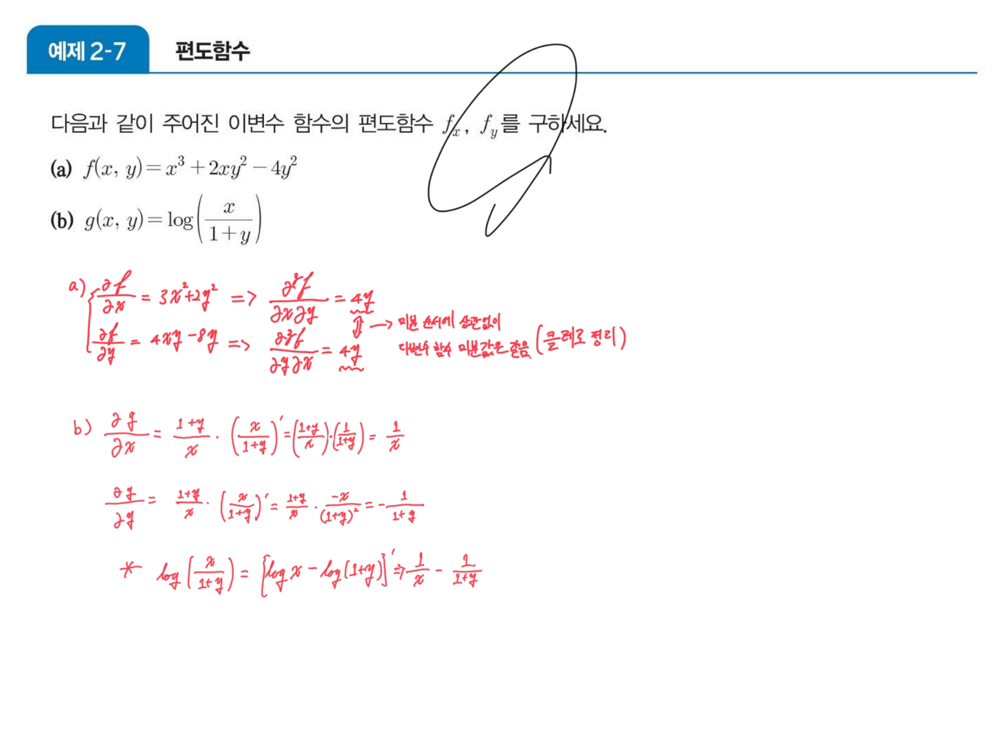

$$f(x,y)=x^3+2xy^2-4y^2\ \Longrightarrow\ \frac{\partial f}{\partial x}=3x^2+2y^2,\qquad \frac{\partial f}{\partial y}=4xy-8y$$

여기서 잉크가 한 걸음 더 나간다. 문제는 $f_x$, $f_y$ 만 구하라고 했는데 **2계까지 갔다.**

$$\frac{\partial^2 f}{\partial x\,\partial y}=4y,\qquad \frac{\partial^2 f}{\partial y\,\partial x}=4y$$

두 값 아래에 물결 밑줄을 긋고 적었다 — 「미분 순서에 상관없이 다변수 함수 미분값은 같음 **(클레로 정리)**」.

(b)는 $g(x,y)=\log\dfrac{x}{1+y}$ 인데 두 가지로 푼다. 연쇄법칙으로 곧이곧대로 밀면

$$\frac{\partial g}{\partial x}=\frac{1+y}{x}\cdot\frac{1}{1+y}=\frac1x,\qquad \frac{\partial g}{\partial y}=\frac{1+y}{x}\cdot\frac{-x}{(1+y)^2}=-\frac{1}{1+y}$$

그리고 별표를 붙여 지름길을 적었다 — $\log\dfrac{x}{1+y}=\log x-\log(1+y)$ 로 쪼개면 미분이 각각 $\dfrac1x$ 와 $-\dfrac{1}{1+y}$ 로 **한 줄에 끝난다.** [04](./04.%20한%20점에서%20전%20영역을%20사%20온다.md)에서 본 대로 5쪽 공식 목록에 몫의 미분이 없었던 이유가 여기서 드러난다.

그리고 **두 쪽 뒤**인 18쪽에 교수 슬라이드가 온다.

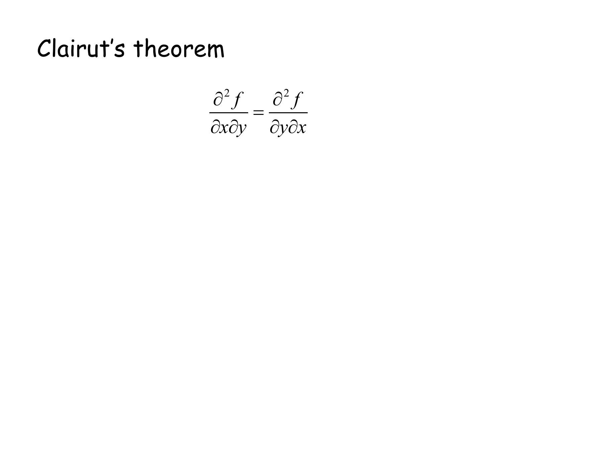

$$\frac{\partial^2 f}{\partial x\,\partial y}=\frac{\partial^2 f}{\partial y\,\partial x}$$

> [!caution] 원본 오류 ⑨ — 18쪽 정리 이름의 철자
> 인쇄된 이름이 **`Clairut's theorem`** 이다. 정확한 철자는 **Clairaut**(알렉시 클레로, Alexis Claude Clairaut)이며 `a`가 빠졌다. 16쪽의 손글씨는 한글로 「클레로 정리」라고 적어 철자 문제를 피해 갔다.

그리고 배치 자체가 거꾸로다. **16쪽의 예제가 정리를 먼저 써 버리고, 18쪽이 그 정리를 뒤늦게 진술한다.** 손글씨가 「클레로 정리」라는 이름을 16쪽에 미리 적어 넣은 것이 그 간격을 메운다.

19쪽도 같은 종류의 교수 슬라이드인데 더 얇다.

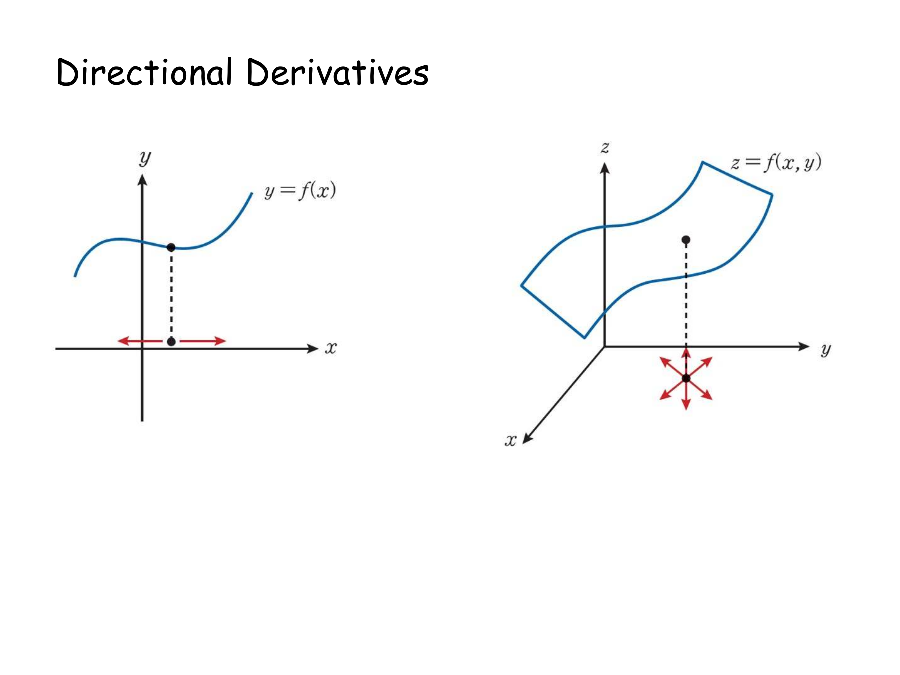

제목 한 줄이 전부다. 정의는 다음 장인 20쪽 `정의 2-7`(교재 페이지)이 한다. 즉 이 흰 슬라이드들은 **절의 표지** 역할이고, 내용은 교재 페이지가 진다.

---

## 21~22쪽 — 정의로 한 번, 정리로 또 한 번

20쪽 `정의 2-7`이 방향도함수를 극한으로 정의한다. 잉크는 없다.

$$D_{\mathbf{u}}f(x,y)=\lim_{h\to0}\frac{f(x_1+hu_1,\dots,x_n+hu_n)-f(x_1,\dots,x_n)}{h},\qquad \mathbf{u}\ \text{는 단위벡터}$$

21쪽 `예제 2-9`가 이 정의를 **곧이곧대로** 쓴다.

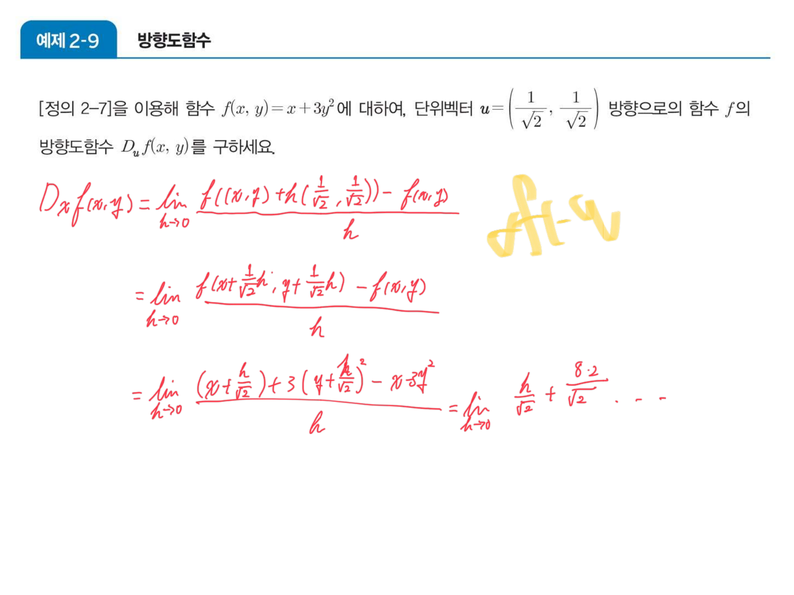

$$f(x,y)=x+3y^2,\qquad \mathbf{u}=\Bigl(\tfrac{1}{\sqrt2},\tfrac{1}{\sqrt2}\Bigr)$$

$$D_{\mathbf{u}}f=\lim_{h\to0}\frac{\bigl(x+\tfrac{h}{\sqrt2}\bigr)+3\bigl(y+\tfrac{h}{\sqrt2}\bigr)^2-x-3y^2}{h}=\frac{1}{\sqrt2}+\frac{6y}{\sqrt2}$$

그리고 22쪽이 이 고생을 없앤다.

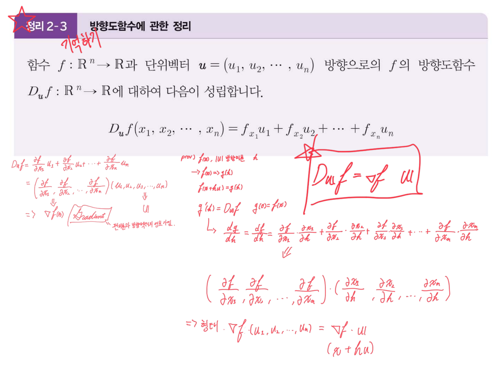

$$D_{\mathbf{u}}f(x_1,\dots,x_n)=f_{x_1}u_1+f_{x_2}u_2+\cdots+f_{x_n}u_n$$

잉크는 이 우변이 **내적**임을 알아보고 상자를 쳤다.

$$\boxed{D_{\mathbf{u}}f=\nabla f\cdot\mathbf{u}}$$

왼쪽 여백에 유도가 있다. 편도함수들을 가로로 묶고 $u$ 들을 가로로 묶으면

$$\Bigl(\frac{\partial f}{\partial x_1},\dots,\frac{\partial f}{\partial x_n}\Bigr)\cdot(u_1,\dots,u_n)$$

이고, 앞의 묶음에 `Gradient` 라는 이름을 붙이며 「편미분과 방향벡터의 정보 가짐」이라 적었다. 오른쪽에는 `prov)` 로 시작하는 증명이 있다 — $g(h)=f(\mathbf{x}+h\mathbf{u})$ 로 두면 $g'(0)=D_{\mathbf{u}}f$ 이고, 연쇄법칙으로

$$\frac{dg}{dh}=\sum_i \frac{\partial f}{\partial x_i}\frac{\partial x_i}{\partial h}=\nabla f\cdot\mathbf{u}$$

23쪽 `정의 2-9`가 그 `Gradient` 에 뒤늦게 이름을 준다 — 기울기벡터 $\nabla f=\bigl(\frac{\partial f}{\partial x_1},\dots,\frac{\partial f}{\partial x_n}\bigr)$. 여기서도 **잉크가 정의보다 먼저 이름을 썼다.**

---

## 26쪽 — 정의를 어기는 문제, 그리고 잉크가 고친다

26쪽 `예제 2-10`은 (a)에서 21쪽 문제를 정리로 다시 풀어 같은 답을 확인한다.

$$D_{\mathbf{u}}f=\nabla f\cdot\mathbf{u}=(1,\ 6y)\cdot\Bigl(\tfrac{1}{\sqrt2},\tfrac{1}{\sqrt2}\Bigr)=\frac{\sqrt2}{2}+3\sqrt2\,y$$

극한을 전개한 21쪽 결과 $\dfrac{1}{\sqrt2}+\dfrac{6y}{\sqrt2}$ 와 같은 값이다. 「정의로 하면 이렇게 길고 정리로 하면 이렇게 짧다」를 같은 문제로 보여 주는 배치다.

(b)가 문제다.

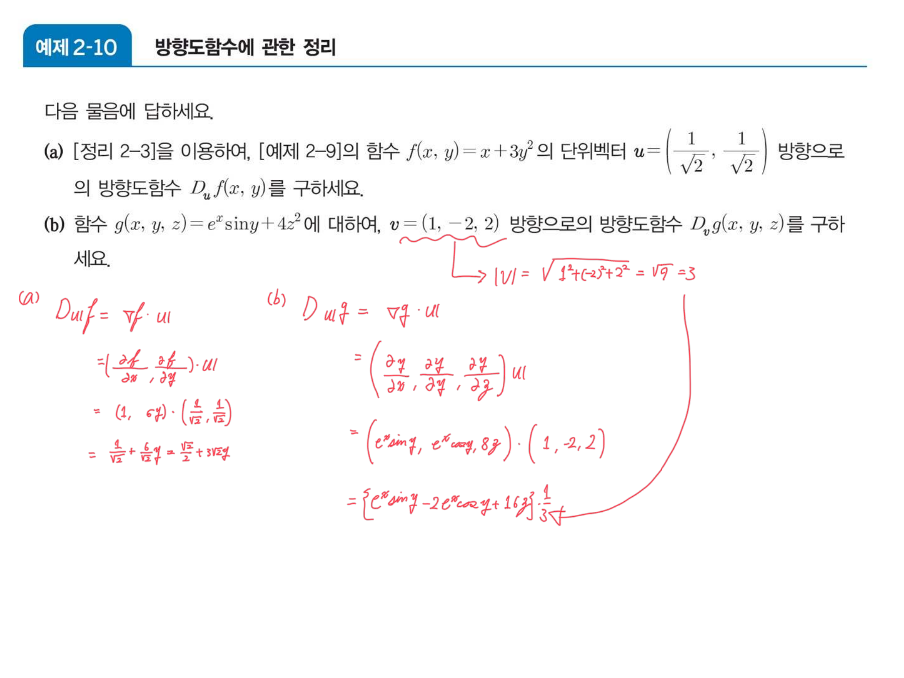

$$g(x,y,z)=e^x\sin y+4z^2,\qquad \mathbf{v}=(1,-2,2)\ \text{방향으로의}\ D_{\mathbf{v}}g$$

$\mathbf{v}=(1,-2,2)$ 는 **단위벡터가 아니다.** 20쪽 `정의 2-7`이 명시적으로 「단위벡터 $\mathbf{u}$」를 요구하는데 문제는 길이 3짜리 벡터를 준다. 잉크가 그 자리에 물결 밑줄을 긋고 길이를 계산했다.

$$|\mathbf{v}|=\sqrt{1^2+(-2)^2+2^2}=\sqrt9=3$$

그리고 $\mathbf{v}$ 대신 $\dfrac{\mathbf{v}}{3}$ 을 넣어 계산을 마친다.

$$\nabla g=(e^x\sin y,\ e^x\cos y,\ 8z)\ \Longrightarrow\ D_{\mathbf{v}}g=\bigl(e^x\sin y-2e^x\cos y+16z\bigr)\cdot\frac13$$

> [!warning] 이 정규화가 과제에서 뒤집힌다
> 여기서는 **정의에 맞추려고 3으로 나눴다.** 그런데 이 과목의 HOMEWORK 2는 정반대를 지시한다 — 열 문항 중 1·2번에 「**방향벡터의 크기 유지**」라는 단서가 붙어 있고, 제출된 리포트는 실제로 $\mathbf{u}=(1,2)$ 를 **정규화하지 않고 그대로** 내적한다.
>
> 즉 같은 과목 안에서 같은 기호 $D_{\mathbf{u}}f$ 가 한 번은 「단위벡터로 고쳐서」, 한 번은 「크기를 유지한 채로」 계산된다. 두 값은 정확히 $|\mathbf{v}|$ 배 차이가 난다. 자세한 것은 [10. 슬라이드가 비워 둔 열 칸](./10.%20슬라이드가%20비워%20둔%20열%20칸.md)에 정리했다.

---

## 27쪽 — 기울기벡터가 가진 정보

`예제 2-13`은 기울기벡터를 두 개 구하는 단순한 문제인데($\nabla f=(3x^2,\frac5y)$, $\nabla g=(e^{xy}y,\ e^{xy}x,\ -\sin z)$), 그 아래 여백이 이 절 전체의 요약으로 채워져 있다.

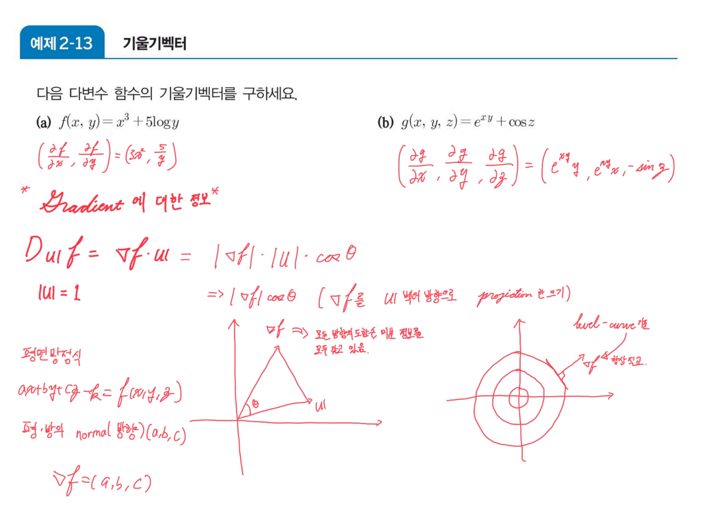

붉은 글씨로 `* Gradient 에 대한 정보 *` 라 쓰고 네 가지를 적었다.

**① 방향도함수는 투영이다.**

$$D_{\mathbf{u}}f=\nabla f\cdot\mathbf{u}=|\nabla f|\,|\mathbf{u}|\cos\theta \xrightarrow{\ |\mathbf{u}|=1\ } |\nabla f|\cos\theta$$

「$\nabla f$ 를 $\mathbf{u}$ 벡터 방향으로 projection 한 크기」라 적혀 있고, $\theta$ 를 표시한 그림이 함께 있다. 1장 58쪽에서 내적을 투영으로 읽었던 것이 그대로 재사용된다([03](./03.%20잉크가%20끊겼다%20되살아나는%20자리.md)).

**② $\nabla f$ 는 모든 방향의 정보를 갖고 있다.** — 「모든 방향의 도함수 미분 정보를 모두 갖고 있음」. 벡터 하나로 무한히 많은 방향의 변화율이 전부 결정된다.

**③ $\nabla f$ 는 등고선과 직교한다.** — 동심원을 그려 놓고 그 위의 한 점에서 바깥으로 나가는 화살표를 그린 뒤 「level-curve 랑 $\nabla f$ 항상 직교」라 적었다.

**④ 접평면의 법선이 $\nabla f$ 다.** — 「평면 방정식 $ax+by+cz-k=f(x,y,z)$ / 평면의 normal 방향 $(a,b,c)$ / $\nabla f=(a,b,c)$」.

①과 ③을 합치면 결론이 하나 나온다. $D_{\mathbf{u}}f=|\nabla f|\cos\theta$ 가 최대가 되는 것은 $\theta=0$, 즉 $\mathbf{u}$ 가 $\nabla f$ 방향일 때이고 그 값은 $|\nabla f|$ 다. **기울기벡터는 가장 가파른 방향이고 그 길이가 가파름이다.** 3장의 경사하강법이 $-\nabla f$ 를 쓰는 이유가 여기서 이미 준비된다([08](./08.%20같은%20문제를%20세%20번%20낸다.md)).

### 등고선·기울기·방향도함수를 한 그림에서

```html preview
<div id="gd-root">
  <style>
    #gd-root{font-family:system-ui,-apple-system,"Segoe UI",sans-serif;color:var(--foreground);padding:4px}
    #gd-root .panel{background:var(--card);border:1px solid var(--border);border-radius:10px;padding:14px}
    #gd-root .bar{display:flex;gap:6px;flex-wrap:wrap;margin-bottom:9px}
    #gd-root button{background:var(--card);color:var(--foreground);border:1px solid var(--border);border-radius:5px;padding:5px 10px;font:inherit;font-size:12px;cursor:pointer}
    #gd-root button.act{border-color:var(--chart-1);background:color-mix(in srgb,var(--chart-1) 16%,transparent)}
    #gd-root .row{display:flex;gap:10px;align-items:center;font-size:13px;margin:8px 0}
    #gd-root input[type=range]{flex:1;accent-color:var(--chart-1);min-width:100px}
    #gd-root .stage{display:flex;justify-content:center}
    #gd-root .out{margin-top:10px;padding:10px 12px;border:1px solid var(--border);border-radius:7px;font-size:13px;line-height:1.75}
    #gd-root code{font-family:ui-monospace,SFMono-Regular,Menlo,monospace}
    #gd-root .lg{display:flex;gap:13px;justify-content:center;font-size:11.5px;margin-top:5px;flex-wrap:wrap}
    #gd-root .sw{display:inline-block;width:18px;height:3px;vertical-align:middle;margin-right:4px}
  </style>
  <div class="panel">
    <div class="bar">
      <button id="gA" class="act">g = x² + y² (예제 2-2)</button>
      <button id="gB">f = 4x + 2y − 8 (예제 2-2)</button>
    </div>
    <div class="row"><span style="opacity:.72">u 의 방향</span><input type="range" id="ang" min="0" max="359" value="25"><b id="angv" style="width:44px;text-align:right">25°</b></div>
    <div class="stage"><svg id="gd-svg" width="330" height="330" viewBox="0 0 330 330" style="max-width:100%;height:auto" role="img" aria-label="등고선 위의 한 점에서 기울기벡터와 단위벡터"></svg></div>
    <div class="lg">
      <span><i class="sw" style="background:var(--chart-4)"></i>등고선</span>
      <span><i class="sw" style="background:var(--chart-1)"></i>∇f</span>
      <span><i class="sw" style="background:var(--chart-2)"></i>u (단위)</span>
      <span><i class="sw" style="background:var(--chart-3)"></i>투영 = D_u f</span>
    </div>
    <div class="out" id="gd-out"></div>
  </div>
</div>
<script>
(function(){
  var R=document.getElementById('gd-root');
  var which='A', P=[1.4,0.9];
  var F={A:{f:function(x,y){return x*x+y*y;},g:function(x,y){return [2*x,2*y];},name:'x² + y²'},
         B:{f:function(x,y){return 4*x+2*y-8;},g:function(){return [4,2];},name:'4x + 2y − 8'}};
  var S=44,OX=165,OY=175;
  function X(v){return OX+v*S;} function Y(v){return OY-v*S;}
  function draw(){
    var deg=+R.querySelector('#ang').value, th=deg*Math.PI/180;
    R.querySelector('#angv').textContent=deg+'°';
    var S0=F[which], gr=S0.g(P[0],P[1]), gn=Math.hypot(gr[0],gr[1]);
    var u=[Math.cos(th),Math.sin(th)];
    var du=gr[0]*u[0]+gr[1]*u[1];
    var g='<defs>';
    ['chart-1','chart-2','chart-3'].forEach(function(k){
      g+='<marker id="gd-'+k+'" markerWidth="8" markerHeight="8" refX="6.5" refY="3" orient="auto"><path d="M0,0 L7,3 L0,6 z" fill="var(--'+k+')"/></marker>';});
    g+='</defs>';
    for(var k=-3;k<=3;k++){
      g+='<line x1="'+X(k)+'" y1="0" x2="'+X(k)+'" y2="330" stroke="var(--border)" stroke-width="'+(k===0?1.2:0.4)+'"/>';
      if(Y(k)>0&&Y(k)<330) g+='<line x1="0" y1="'+Y(k)+'" x2="330" y2="'+Y(k)+'" stroke="var(--border)" stroke-width="'+(k===0?1.2:0.4)+'"/>';
    }
    if(which==='A'){
      [0.5,1,1.5,2,2.5,3].forEach(function(r){
        g+='<circle cx="'+X(0)+'" cy="'+Y(0)+'" r="'+(r*S)+'" fill="none" stroke="var(--chart-4)" stroke-width="'+(Math.abs(r-Math.hypot(P[0],P[1]))<0.05?2:1)+'" opacity="'+(Math.abs(r-Math.hypot(P[0],P[1]))<0.05?1:.55)+'"/>';});
    }else{
      for(var kk=-16;kk<=4;kk+=3){
        // 4x + 2y - 8 = kk  ->  y = (kk + 8 - 4x)/2
        var x1=-3.2,x2=3.2, y1=(kk+8-4*x1)/2, y2=(kk+8-4*x2)/2;
        var cur=Math.abs(S0.f(P[0],P[1])-kk)<1.5;
        g+='<line x1="'+X(x1)+'" y1="'+Y(y1)+'" x2="'+X(x2)+'" y2="'+Y(y2)+'" stroke="var(--chart-4)" stroke-width="'+(cur?2:1)+'" opacity="'+(cur?1:.5)+'"/>';
      }
    }
    var sc=0.45;
    g+='<line x1="'+X(P[0])+'" y1="'+Y(P[1])+'" x2="'+X(P[0]+gr[0]*sc)+'" y2="'+Y(P[1]+gr[1]*sc)+'" stroke="var(--chart-1)" stroke-width="2.8" marker-end="url(#gd-chart-1)"/>';
    g+='<line x1="'+X(P[0])+'" y1="'+Y(P[1])+'" x2="'+X(P[0]+u[0]*1.15)+'" y2="'+Y(P[1]+u[1]*1.15)+'" stroke="var(--chart-2)" stroke-width="2.4" marker-end="url(#gd-chart-2)"/>';
    var pl=du*sc;
    g+='<line x1="'+X(P[0])+'" y1="'+Y(P[1])+'" x2="'+X(P[0]+u[0]*pl)+'" y2="'+Y(P[1]+u[1]*pl)+'" stroke="var(--chart-3)" stroke-width="5.5" opacity=".55" stroke-linecap="round"/>';
    g+='<line x1="'+X(P[0]+gr[0]*sc)+'" y1="'+Y(P[1]+gr[1]*sc)+'" x2="'+X(P[0]+u[0]*pl)+'" y2="'+Y(P[1]+u[1]*pl)+'" stroke="var(--chart-3)" stroke-width="1" stroke-dasharray="3 3" opacity=".8"/>';
    g+='<circle cx="'+X(P[0])+'" cy="'+Y(P[1])+'" r="4" fill="var(--foreground)"/>';
    R.querySelector('#gd-svg').innerHTML=g;
    var ang=Math.acos(Math.max(-1,Math.min(1,(gr[0]*u[0]+gr[1]*u[1])/gn)))*180/Math.PI;
    var o=R.querySelector('#gd-out');
    var t='점 (1.4, 0.9) 에서 <code>∇f = ('+gr[0].toFixed(2)+', '+gr[1].toFixed(2)+')</code>, |∇f| = <b>'+gn.toFixed(3)+'</b><br>';
    t+='u 와의 각 θ = <b>'+ang.toFixed(1)+'°</b> 이므로 <code>D_u f = |∇f| cos θ = '+du.toFixed(3)+'</code>';
    if(Math.abs(ang)<4) t+=' — <b>최대다.</b> u 가 ∇f 와 같은 방향일 때 값이 |∇f| 자체가 된다.';
    else if(Math.abs(ang-180)<4) t+=' — <b>최소다.</b> 경사하강법이 쓰는 방향이 바로 이쪽(−∇f)이다.';
    else if(Math.abs(ang-90)<4) t+=' — <b>0이다.</b> u 가 등고선을 따라가고 있다. 등고선 위에서는 함숫값이 변하지 않으므로 당연하다.';
    t+='<br><span style="opacity:.75">굵은 ∇f 화살표가 등고선과 언제나 직각을 이룬다 — 27쪽의 「level-curve 랑 ∇f 항상 직교」가 이것이다. 반투명 막대는 ∇f 를 u 위로 투영한 길이이고, 그 길이가 곧 방향도함수다.</span>';
    o.innerHTML=t;
  }
  R.querySelector('#gA').onclick=function(){which='A';this.className='act';R.querySelector('#gB').className='';draw();};
  R.querySelector('#gB').onclick=function(){which='B';this.className='act';R.querySelector('#gA').className='';draw();};
  R.addEventListener('input',draw); draw();
})();
</script>
```

방향을 돌려 $\theta=90°$ 를 맞추면 투영 막대가 사라진다 — 등고선을 따라 걸으면 높이가 변하지 않는다는 뜻이고, 그것이 「$\nabla f$ ⊥ 등고선」의 다른 표현이다. 두 함수를 바꿔 보면 평면 쪽은 $\nabla f$ 가 **어디서나 같은 $(4,2)$** 로 고정되어 등고선이 평행 직선인 이유가 보인다.

---

## 11~27쪽의 교대 배치

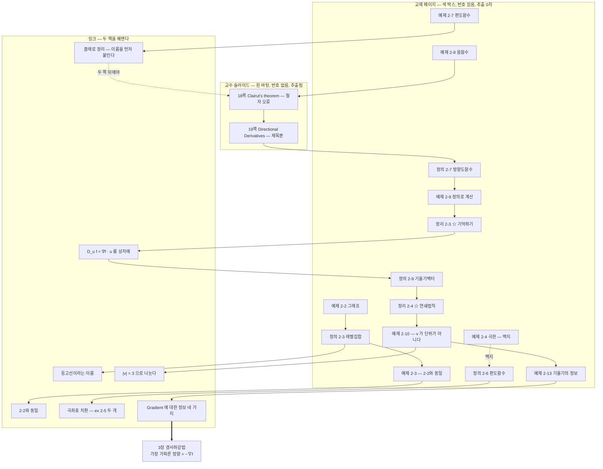

이 그림에서 잉크가 하는 일은 세 가지다 — **이름 붙이기**(등고선, 클레로 정리, Gradient), **중복·오류 지적하기**(2-2와 동일, $|v|=3$), **기법 공급하기**(극좌표 치환). 교재 페이지와 교수 슬라이드 어느 쪽도 이 세 가지를 하지 않는다.

---

## 다음으로

28쪽부터 연쇄법칙의 일반형이 나오고, 곧이어 라그랑주 승수법과 헤세 행렬이 온다. 그런데 그 절에서 **잉크가 완전히 끊긴다** — 그리고 끊긴 자리가 정확히 이 과목의 HOMEWORK 2 문항이다.

- [04. 한 점에서 전 영역을 사 온다](./04.%20한%20점에서%20전%20영역을%20사%20온다.md) — 1~10쪽. 테일러 급수
- [06. 잉크가 멈춘 자리에서 과제가 시작된다](./06.%20잉크가%20멈춘%20자리에서%20과제가%20시작된다.md) — 28~57쪽
- [10. 슬라이드가 비워 둔 열 칸](./10.%20슬라이드가%20비워%20둔%20열%20칸.md) — 26쪽의 정규화가 과제에서 뒤집히는 자리

---

## 근거 자료

| 쪽 | 계열 | 인쇄된 것 | 잉크가 더한 것 |
| --- | --- | --- | --- |
| **11** | 교재 | `예제 2-2` 다변수 함수의 그래프 — 두 함수식만 | $f:\mathbb{R}^m\to\mathbb{R}$ 로의 확장, 평면·포물면 그림, **두 함수 각각에 「level set)」 그림** |
| 12 | 교재 | `정의 2-3` 레벨집합 | **「⇒ 등고선」** |
| **13** | 교재 | `예제 2-3` — `예제 2-2`와 **같은 두 함수, 같은 요구** | **「2-2와 동일」** |
| 14 | 교재 | `예제 2-4` 극한 두 문제 | **백지** |
| **15** | 교재 | `정의 2-6` 편도함수 정의 한 줄 | 「다변수 함수의 극한값 구하는 방법은?」, **`ex 2-5` 극좌표 치환**($\theta$만 남음 → 극한 없음), **`ex 2-5(2)`**($r$ 이 남음 → 0), 「중간 범위 1장」 |
| **16** | 교재 | `예제 2-7` $f_x$, $f_y$ 를 구하라 | **2계까지 진행**, $f_{xy}=f_{yx}=4y$, **「클레로 정리」**, $\log$ 를 쪼개는 지름길 |
| 17 | 교재 | `예제 2-8` 음함수의 편도함수 | 음함수 미분 전개, 양함수/음함수 대조, **앞으로의 순서 4가지**(편미분·방향미분·Gradient·Jacobian) |
| **18** | 교수 | **`Clairut's theorem`** — 철자 오류 | — |
| **19** | 교수 | `Directional Derivatives` — 제목 한 줄 | — |
| 20 | 교재 | `정의 2-7` 방향도함수 — **단위벡터 요구** | 없음 |
| **21** | 교재 | `예제 2-9` 정의로 $D_{\mathbf{u}}f$ 구하기 | 극한식 전개 |
| **22** | 교재 | `정리 2-3` $D_{\mathbf{u}}f=f_{x_1}u_1+\cdots$ | ☆ 「기억하기」, **$\boxed{D_{\mathbf{u}}f=\nabla f\cdot\mathbf{u}}$**, `Gradient` 명명, 연쇄법칙 증명 |
| 23 | 교재 | `정의 2-9` 기울기벡터 | 형광펜 |
| 24 | 교재 | `정리 2-4` 연쇄법칙 (1) | ☆, $f=x_1x_2$·$x_1=t^2$·$x_2=e^t$ 예제($2te^t+t^2e^t$), 편미분·방향미분·Gradient 목록 |
| 25 | 교재 | `정리 2-5` 연쇄법칙 (2) | 백지 |
| **26** | 교재 | `예제 2-10` (b)의 $\mathbf{v}=(1,-2,2)$ — **단위벡터가 아니다** | (a) 정리로 재확인, (b) **$\lvert\mathbf{v}\rvert=3$ 계산 후 정규화** |
| **27** | 교재 | `예제 2-13` 기울기벡터 두 개 | **`Gradient 에 대한 정보`** — 투영 해석, 「모든 방향의 정보」, **「level-curve 랑 ∇f 항상 직교」**, 접평면 법선 |

추출 번들: `.ok/local/pdf-extract/02_math-theory__optimization-math__MCS087_2장_미적분_v3/`
(이 구간 17장 중 `page_chars` 가 0인 페이지는 11·12·13·14·15·16·17·20·21·22·23·24·25·26·27쪽 — 교재 페이지 전부다. 교수 슬라이드인 18·19쪽만 각각 31자·22자로 잡힌다. 전 쪽을 180 dpi로 렌더해 확인했다.)

수치 검증: `ex 2-5` 의 방향별 극한값($\theta=0$ 에서 2, $\theta=\pi/2$ 에서 $-\frac12$)과 `ex 2-5(2)` 가 반지름 $10^{-1}$·$10^{-3}$·$10^{-6}$ 원 위에서 각각 $3.8\times10^{-2}$·$3.8\times10^{-4}$·$3.8\times10^{-7}$ 이하로 눌리는 것을 수치로 확인했다. `예제 2-9` 의 극한 전개는 차분몫($h=10^{-3},10^{-5},10^{-7}$)으로 $\frac{1+6y}{\sqrt2}$ 에 수렴함을, `예제 2-10`(b)는 $\nabla g\cdot\frac{\mathbf{v}}{3}$ 이 손글씨의 최종식과 일치함을 확인했다.
