> [!abstract] 한 구간이 통째로 비어 있고, 그 자리가 곧 과제다
> 2장 28\~57쪽을 손글씨의 유무로만 칠하면 이렇게 된다.
>
> | 쪽 | 내용 | 잉크 |
> | --- | --- | --- |
> | 28·30 | 연쇄법칙 → 극값 조건 | 있음 |
> | **29, 31\~43** | **라그랑주 승수법 · 헤세 행렬** | **없음 — 열다섯 장 연속** |
> | 44\~46, 52\~53 | 벡터함수 · 야코비 | 있음 (예제까지 전부 풀림) |
> | 47\~51 | 행렬 미분 · 2차 테일러 | 없음 |
> | 54\~56 | 야코비 연쇄법칙 예제 | 없음 |
>
> 그리고 이 과목의 `HOMEWORK 2` 열 문항 중 **여섯 문항(4·5·6·7·8·9번)이 정확히 그 빈 띠 안의 주제**다. 슬라이드가 말을 멈춘 자리에서 과제가 시작된다 — 그것이 이 구간의 구조다.

---

## 28·30쪽 — 방향도함수가 최적화 조건이 되는 순간

28쪽은 교수 슬라이드다(흰 바탕, 번호 없음). 연쇄법칙의 일반형을 적는다.

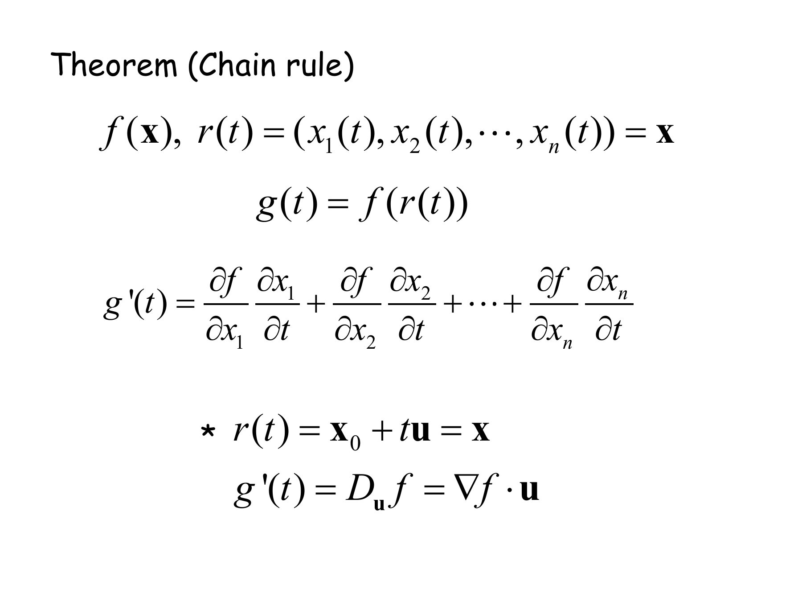

$$\mathbf{r}(t)=(x_1(t),\dots,x_n(t)),\quad g(t)=f(\mathbf{r}(t))\ \Longrightarrow\ g'(t)=\sum_i\frac{\partial f}{\partial x_i}\frac{\partial x_i}{\partial t}$$

그리고 아래에 별표로 특수한 경로 하나를 고른다.

$$\mathbf{r}(t)=\mathbf{x}_0+t\mathbf{u}\ \Longrightarrow\ g'(t)=D_{\mathbf{u}}f=\nabla f\cdot\mathbf{u}$$

경로를 **직선**으로 잡으면 연쇄법칙이 곧 방향도함수라는 뜻이다. [05](./05.%20한%20파일에%20붙어%20있는%20두%20권의%20책.md)에서 22쪽 잉크가 손으로 유도했던 것과 같은 식인데, 여기서는 인쇄되어 있다.

30쪽이 그 위에 한 줄을 얹는다.

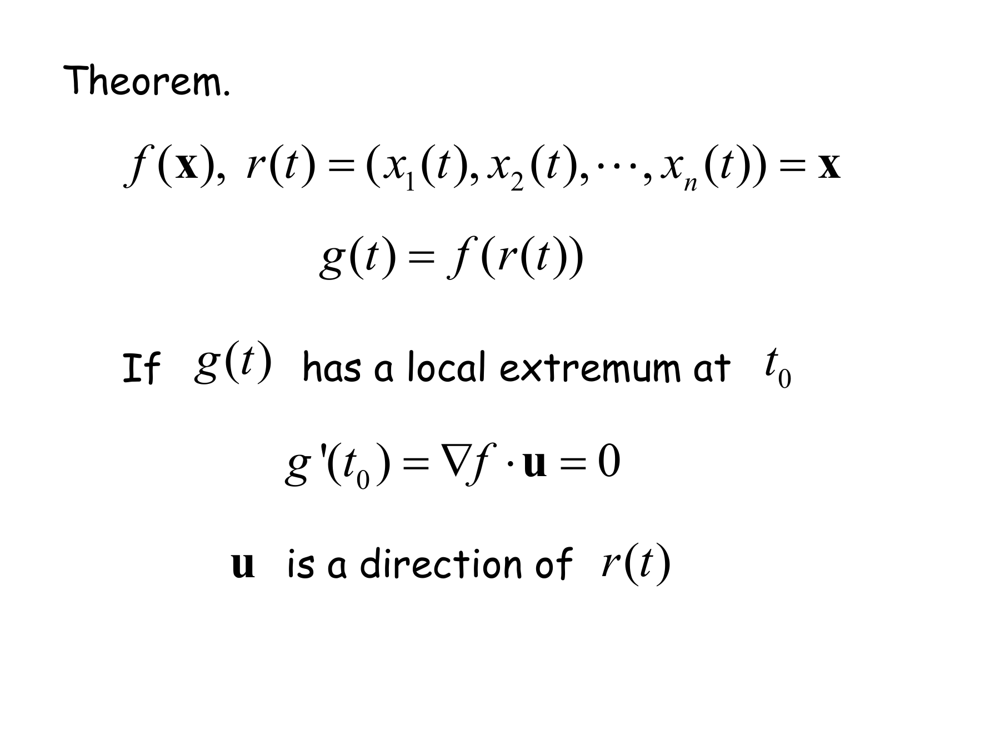

> If $g(t)$ has a local extremum at $t_0$, then $g'(t_0)=\nabla f\cdot\mathbf{u}=0$.

이것이 2장 전체에서 가장 중요한 한 줄이다. **극값에서는 모든 방향의 방향도함수가 0이다.** $\mathbf{u}$ 가 임의의 단위벡터인데 $\nabla f\cdot\mathbf{u}=0$ 이려면 $\nabla f=\mathbf{0}$ 이어야 한다. 27쪽이 말한 「$\nabla f$ 는 가장 가파른 방향」과 합치면 — 가장 가파른 방향조차 기울기가 0이면 어느 방향으로도 움직일 이유가 없다.

3장의 경사하강법이 멈추는 조건($\nabla f(\mathbf{x})=\mathbf{0}$)과 정지 조건이 여기서 나온다([08](./08.%20같은%20문제를%20세%20번%20낸다.md)).

---

## 31~38쪽 — 제약이 붙으면 이야기가 달라지는데, 그 이야기가 비어 있다

30쪽까지는 제약이 없었다. 31쪽부터는 있다.

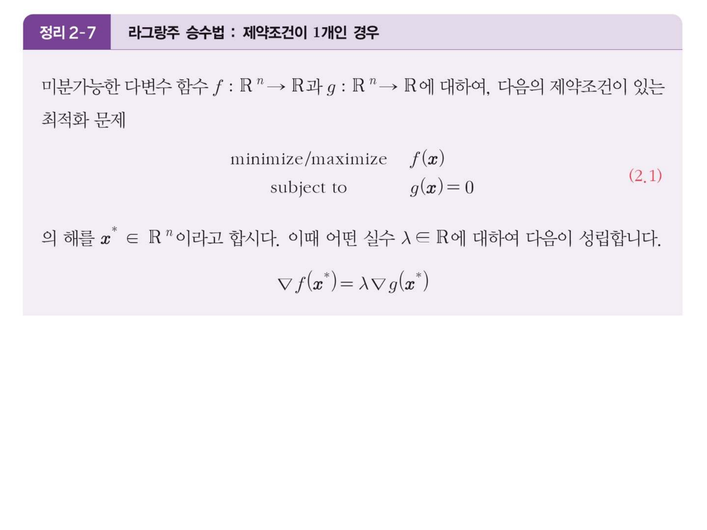

$$\underset{\textsf{subject to}}{\text{minimize/maximize}}\quad f(\mathbf{x}),\qquad g(\mathbf{x})=0\ \Longrightarrow\ \nabla f(\mathbf{x}^*)=\lambda\nabla g(\mathbf{x}^*)$$

그리고 33쪽이 라그랑주 함수를 정의한다(교수 슬라이드).

$$L(\mathbf{x},\lambda)=f(\mathbf{x})+\lambda g(\mathbf{x})$$

이 사이에 32쪽이 끼어 있는데, 그 페이지에서 텍스트로 추출되는 것이 이것 하나다.

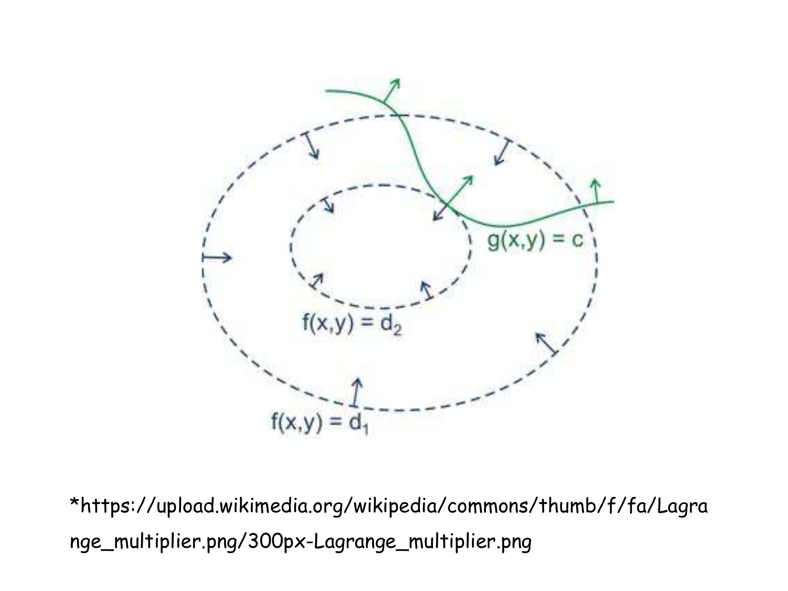

```text
*https://upload.wikimedia.org/wikipedia/commons/thumb/f/fa/Lagra
nge_multiplier.png/300px-Lagrange_multiplier.png
```

37쪽에는 또 하나가 있다.

```text
* https://bluehorn07.github.io/2024/07/14/lagrange-multiplier/
```

> [!important] 2장 57쪽 중 URL이 적힌 페이지는 이 두 장뿐이다
> 32쪽의 위키미디어 이미지와 37쪽의 개인 블로그 글 — **둘 다 라그랑주 승수법이고, 둘 다 손글씨가 없는 띠 안**에 있다. 앞의 31장에도, 뒤의 19장에도 URL은 하나도 없다.
>
> 직접 설명하는 대신 바깥 자료를 가리킨 자리가 정확히 잉크가 끊긴 자리와 겹친다.

34·35·38쪽은 예제 셋인데 전부 백지다.

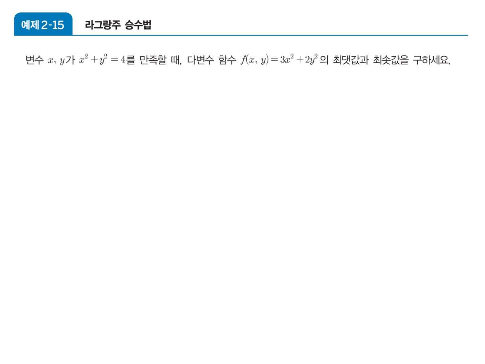

| 쪽 | 예제 | 문제 | 잉크 |
| --- | --- | --- | --- |
| 34 | `예제 2-15` | $x^2+y^2=4$ 에서 $3x^2+2y^2$ 의 최대·최소 | 없음 |
| 35 | `예제 2-16` | 겉넓이 48인 뚜껑 없는 상자의 최대 부피 | 없음 |
| 38 | `예제 2-17` | $xy=1$, $x^2+z^2=2$ 에서 $xy+zx$ 의 최대·최소 | 없음 |

36쪽 `정리 2-8`(제약조건이 여러 개인 경우, $\nabla f=\lambda_1\nabla g_1+\cdots+\lambda_N\nabla g_N$)도 백지다.

그리고 `HOMEWORK 2`의 4·5번 문항이 이것이다.

> **4.** p157. 09 (a) 주어진 제약조건에서 다음 함수의 최대값과 최소값을 구하세요.
> **5.** p157. 09 (b) 주어진 제약조건에서 다음 함수의 최대값과 최소값을 구하세요.

교재의 같은 절, 같은 유형이다. 슬라이드에서 세 문제를 비워 둔 뒤 과제로 두 문제를 낸 셈이다.

### 라그랑주 조건이 눈에 보이는 순간

31쪽이 주장하는 것은 「최적점에서 $\nabla f$ 와 $\nabla g$ 가 **평행**하다」는 한 가지다. 아래는 과제 4번이 실제로 다루는 함수 $f(x,y)=e^{2xy}$ 와 제약 $x^2+y^2=4$ 로 그 조건을 그려 본 것이다.

```html preview
<div id="lg-root">
  <style>
    #lg-root{font-family:system-ui,-apple-system,"Segoe UI",sans-serif;color:var(--foreground);padding:4px}
    #lg-root .panel{background:var(--card);border:1px solid var(--border);border-radius:10px;padding:14px}
    #lg-root .row{display:flex;gap:10px;align-items:center;font-size:13px;margin-bottom:9px}
    #lg-root input[type=range]{flex:1;accent-color:var(--chart-1);min-width:110px}
    #lg-root button{background:var(--card);color:var(--foreground);border:1px solid var(--border);border-radius:5px;padding:4px 9px;font:inherit;font-size:12px;cursor:pointer;margin-right:5px}
    #lg-root .stage{display:flex;justify-content:center}
    #lg-root .lg2{display:flex;gap:13px;justify-content:center;font-size:11.5px;margin-top:5px;flex-wrap:wrap}
    #lg-root .sw{display:inline-block;width:18px;height:3px;vertical-align:middle;margin-right:4px}
    #lg-root .out{margin-top:10px;padding:10px 12px;border:1px solid var(--border);border-radius:7px;font-size:13px;line-height:1.75}
    #lg-root .hit{border-color:var(--chart-2);background:color-mix(in srgb,var(--chart-2) 13%,transparent)}
    #lg-root code{font-family:ui-monospace,SFMono-Regular,Menlo,monospace}
  </style>
  <div class="panel">
    <div class="row"><span style="opacity:.72">제약 원 위의 위치</span><input type="range" id="t" min="0" max="3599" value="300"><b id="tv" style="width:52px;text-align:right">30.0°</b></div>
    <div>
      <button data-t="450">(√2, √2)</button><button data-t="1350">(−√2, √2)</button>
      <button data-t="2250">(−√2, −√2)</button><button data-t="3150">(√2, −√2)</button>
    </div>
    <div class="stage"><svg id="lg-svg" width="330" height="330" viewBox="0 0 330 330" style="max-width:100%;height:auto" role="img" aria-label="제약원 위에서 ∇f 와 ∇g 를 비교"></svg></div>
    <div class="lg2">
      <span><i class="sw" style="background:var(--chart-4)"></i>제약 x²+y²=4</span>
      <span><i class="sw" style="background:var(--chart-5)"></i>f 의 등고선</span>
      <span><i class="sw" style="background:var(--chart-1)"></i>∇f</span>
      <span><i class="sw" style="background:var(--chart-2)"></i>∇g</span>
    </div>
    <div class="out" id="lg-out"></div>
  </div>
</div>
<script>
(function(){
  var R=document.getElementById('lg-root'),svg=R.querySelector('#lg-svg');
  var S=62,OX=165,OY=165;
  function X(v){return OX+v*S;} function Y(v){return OY-v*S;}
  function draw(){
    var td=+R.querySelector('#t').value/10, t=td*Math.PI/180;
    R.querySelector('#tv').textContent=td.toFixed(1)+'°';
    var x=2*Math.cos(t), y=2*Math.sin(t);
    var e=Math.exp(2*x*y);
    var gf=[2*y*e, 2*x*e], gg=[2*x, 2*y];
    var nf=Math.hypot(gf[0],gf[1]), ng=Math.hypot(gg[0],gg[1]);
    var cross=Math.abs(gf[0]*gg[1]-gf[1]*gg[0])/((nf*ng)||1);
    var g='<defs>';
    ['chart-1','chart-2'].forEach(function(k){
      g+='<marker id="lg-'+k+'" markerWidth="8" markerHeight="8" refX="6.5" refY="3" orient="auto"><path d="M0,0 L7,3 L0,6 z" fill="var(--'+k+')"/></marker>';});
    g+='</defs>';
    for(var k=-2;k<=2;k++){
      g+='<line x1="'+X(k)+'" y1="0" x2="'+X(k)+'" y2="330" stroke="var(--border)" stroke-width="'+(k===0?1.2:0.4)+'"/>';
      g+='<line x1="0" y1="'+Y(k)+'" x2="330" y2="'+Y(k)+'" stroke="var(--border)" stroke-width="'+(k===0?1.2:0.4)+'"/>';
    }
    // level curves of e^{2xy}: xy = const  -> hyperbolas
    [0.5,1,1.5,2,-0.5,-1,-1.5,-2].forEach(function(c){
      var p='',pen=false;
      for(var i=0;i<=400;i++){
        var xx=-2.4+4.8*i/400; if(Math.abs(xx)<0.06){pen=false;continue;}
        var yy=c/xx; if(Math.abs(yy)>2.4){pen=false;continue;}
        p+=(pen?'L':'M')+X(xx).toFixed(1)+','+Y(yy).toFixed(1); pen=true;
      }
      g+='<path d="'+p+'" fill="none" stroke="var(--chart-5)" stroke-width="1" opacity=".55"/>';
    });
    g+='<circle cx="'+X(0)+'" cy="'+Y(0)+'" r="'+(2*S)+'" fill="none" stroke="var(--chart-4)" stroke-width="2.2"/>';
    var s1=0.9/(nf||1), s2=0.9/(ng||1);
    g+='<line x1="'+X(x)+'" y1="'+Y(y)+'" x2="'+X(x+gg[0]*s2)+'" y2="'+Y(y+gg[1]*s2)+'" stroke="var(--chart-2)" stroke-width="3" marker-end="url(#lg-chart-2)"/>';
    g+='<line x1="'+X(x)+'" y1="'+Y(y)+'" x2="'+X(x+gf[0]*s1)+'" y2="'+Y(y+gf[1]*s1)+'" stroke="var(--chart-1)" stroke-width="2.4" marker-end="url(#lg-chart-1)"/>';
    g+='<circle cx="'+X(x)+'" cy="'+Y(y)+'" r="4.2" fill="var(--foreground)"/>';
    svg.innerHTML=g;
    var ang=Math.asin(Math.min(1,cross))*180/Math.PI;
    var o=R.querySelector('#lg-out');
    var h='점 <code>('+x.toFixed(3)+', '+y.toFixed(3)+')</code> — 여기서 <code>f = e^(2xy) = '+ (2*x*y>7?'e^'+(2*x*y).toFixed(2) : e.toFixed(4)) +'</code><br>';
    h+='두 기울기가 벌어진 각: <b>'+ang.toFixed(2)+'°</b><br>';
    if(cross<0.004){
      o.className='out hit';
      h+='<b>평행하다 — 라그랑주 조건 ∇f = λ∇g 가 성립한다.</b> 이 점이 후보다. ';
      h+=(x*y>0)?'xy = 2 이므로 <b>f = e⁴ ≈ 54.598 로 최댓값</b>이다.':'xy = −2 이므로 <b>f = e⁻⁴ ≈ 0.018 로 최솟값</b>이다.';
      h+='<br><span style="opacity:.75">등고선(쌍곡선)이 제약원에 <b>접해 있다</b>. 접하면 두 법선이 같은 직선 위에 놓인다 — 그것이 곧 ∇f ∥ ∇g 다.</span>';
    }else{
      o.className='out';
      h+='평행하지 않다. 등고선이 제약원을 <b>가로지르고</b> 있으므로, 원을 따라 조금만 움직여도 f 가 커지거나 작아진다 — 극점일 수 없다.';
      h+='<br><span style="opacity:.75">원 위를 돌려 두 화살표가 한 직선에 겹치는 네 지점을 찾아보면 그것이 (±√2, ±√2) 다.</span>';
    }
    o.innerHTML=h;
  }
  R.addEventListener('input',draw);
  R.addEventListener('click',function(e){if(e.target.dataset.t){R.querySelector('#t').value=e.target.dataset.t;draw();}});
  draw();
})();
</script>
```

원을 돌려 보면 두 화살표가 겹치는 지점이 정확히 네 곳 — $(\pm\sqrt2,\pm\sqrt2)$ 다. 부호가 같은 두 점에서 $xy=2$ 라 $f=e^4$ 이 최대, 부호가 엇갈린 두 점에서 $xy=-2$ 라 $f=e^{-4}$ 가 최소다. 제출된 리포트의 답과 일치한다([10](./10.%20슬라이드가%20비워%20둔%20열%20칸.md)).

---

## 39~42쪽 — 헤세 행렬, 그리고 판정법 (c)의 범위

39쪽 `정의 2-10`이 헤세 행렬을 정의한다. 백지다.

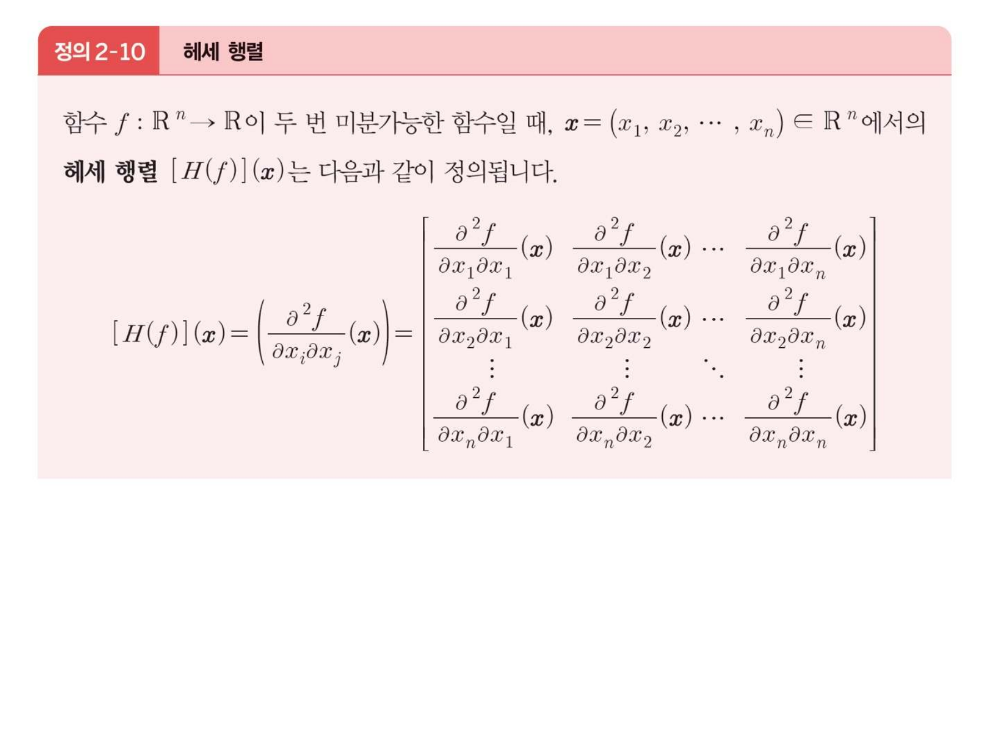

$$[H(f)](\mathbf{x})=\Bigl(\frac{\partial^2 f}{\partial x_i\partial x_j}(\mathbf{x})\Bigr)$$

16쪽에서 잉크가 「클레로 정리」라고 적었던 $f_{xy}=f_{yx}$ 가 여기서 값을 한다 — **헤세 행렬은 대칭이다.** 그러면 1장 58\~63쪽의 도구가 전부 적용된다. 대칭이므로 직교하는 고유벡터로 대각화되고, 고윳값의 부호가 $\mathbf{x}^TH\mathbf{x}$ 의 부호를 정하며, 전부 양수면 `Theorem 1-21`에 의해 볼록이다([03](./03.%20잉크가%20끊겼다%20되살아나는%20자리.md)).

41쪽 `예제 2-18`(두 함수의 헤세 행렬을 구하라)도 백지다. 그리고 `HOMEWORK 2`의 6·7번이 이것이다.

> **6.** p158, 13 (a) 주어진 점에서 다음 함수의 Hessian matrix 를 구하세요.
> **7.** p158, 13 (b) 주어진 점에서 다음 함수의 Hessian matrix 를 구하세요.

42쪽 `정리 2-9`가 헤세 판정법을 준다. 역시 백지다.

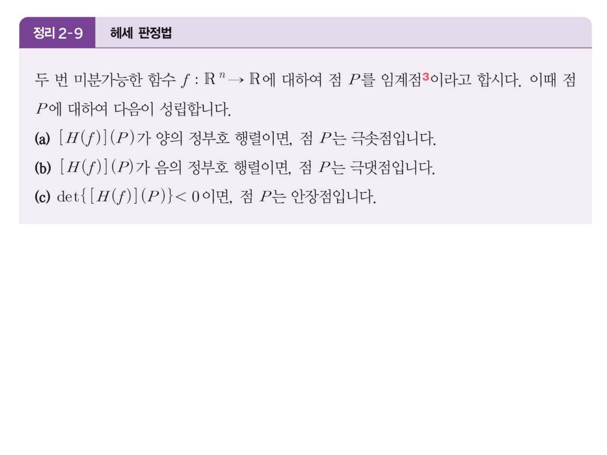

> **(a)** $[H(f)](P)$ 가 **양의 정부호**이면 $P$ 는 극솟점
> **(b)** $[H(f)](P)$ 가 **음의 정부호**이면 $P$ 는 극댓점
> **(c)** $\det\{[H(f)](P)\}<0$ 이면 $P$ 는 **안장점**

세 항목이 나란히 놓여 있지만 셋째만 조건이 다르다 — 앞의 둘은 행렬의 정부호성을 말하고, 셋째는 행렬식이라는 수 하나를 말한다.

> [!caution] 원본 오류 ⑩ — 42쪽 `정리 2-9` (c)는 2변수에서만 성립한다
> (a)·(b)는 차원과 무관하게 옳지만 **(c)는 $n=2$ 에서만 옳다.** $n\ge3$ 이면 (b)와 정면으로 충돌한다.
>
> 반례: $f(x,y,z)=-(x^2+y^2+z^2)$ 는 원점에서 $H=-2I_3$ 이다. 이 행렬은 **음의 정부호**이므로 (b)에 의해 원점은 극댓점이고, 실제로도 $f(0,0,0)=0$ 이 최댓값이다. 그런데
>
> $$\det(-2I_3)=(-2)^3=-8<0$$
>
> 이므로 (c)는 같은 점을 **안장점**이라고 말한다. 한 점이 (b)로는 극댓점, (c)로는 안장점이 된다.
>
> 원인은 $\det H=\lambda_1\lambda_2\cdots\lambda_n$ 이라는 데 있다. $n=2$ 이면 $\lambda_1\lambda_2<0$ 이 곧 「부호가 엇갈린다」이지만, $n=3$ 이면 음수 셋의 곱도 음수라 구별되지 않는다. 일반 차원에서 안장점을 판정하려면 행렬식 하나가 아니라 **고윳값의 부호 조합**(또는 선행 주 소행렬식 전부)을 봐야 한다.
>
> 이 과목이 실제로 쓰는 범위에서는 문제가 드러나지 않는다 — 제출된 리포트의 8·9번 풀이는 $D=f_{xx}f_{yy}-f_{xy}^2$ 라는 **2×2 행렬식**만 쓴다.

`HOMEWORK 2`의 8·9번이 정확히 이 판정법을 요구한다.

> **8·9.** p158, 14 (a)·(b) 다음과 같은 함수의 극대점, 극소점, 안장점을 구하세요.

**슬라이드에는 이 유형의 예제가 아예 없다.** 39·41·42쪽이 정의와 정리만 놓고 지나가며, 극대·극소·안장점을 실제로 분류해 보는 페이지가 한 장도 없다.

---

## 40·51쪽 — 4장의 급수가 벡터로 돌아온다

빈 띠 한가운데에 교수 슬라이드가 하나 끼어 있다. 40쪽이다.

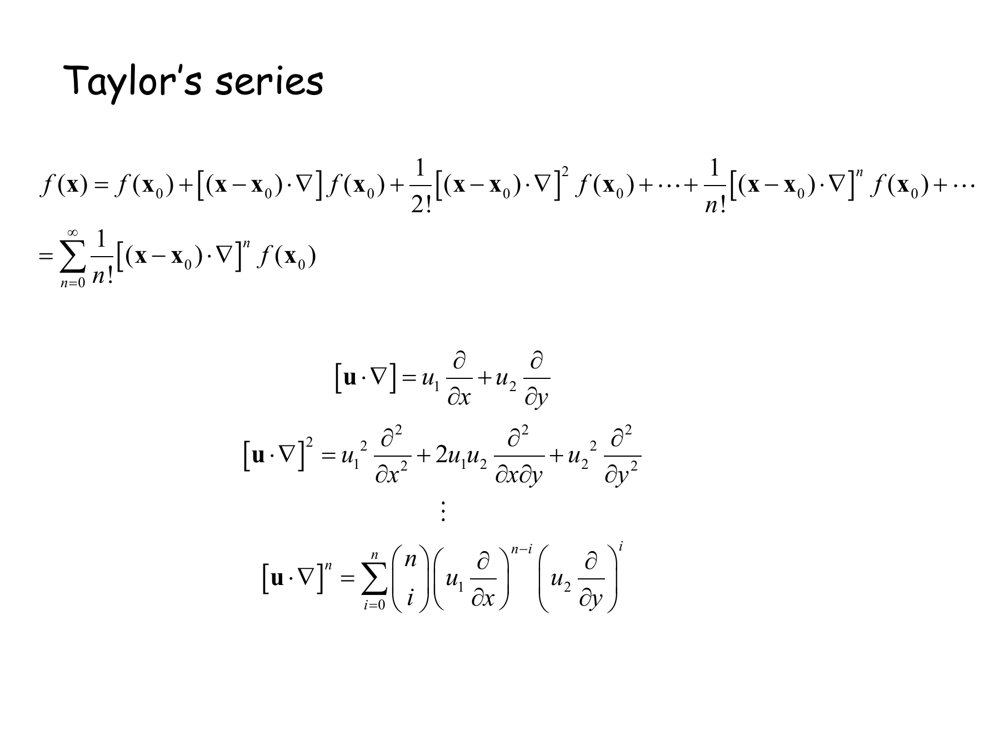

$$f(\mathbf{x})=\sum_{n=0}^{\infty}\frac{1}{n!}\bigl[(\mathbf{x}-\mathbf{x}_0)\cdot\nabla\bigr]^n f(\mathbf{x}_0)$$

[04](./04.%20한%20점에서%20전%20영역을%20사%20온다.md)에서 본 $\sum\frac{f^{(n)}(a)}{n!}(x-a)^n$ 의 다변수판인데, $(x-a)^n$ 자리에 **연산자 $[(\mathbf{x}-\mathbf{x}_0)\cdot\nabla]^n$** 이 들어갔다. 이 연산자를 2변수에서 전개하면

$$\mathbf{u}\cdot\nabla=u_1\frac{\partial}{\partial x}+u_2\frac{\partial}{\partial y},\qquad (\mathbf{u}\cdot\nabla)^2=u_1^2\frac{\partial^2}{\partial x^2}+2u_1u_2\frac{\partial^2}{\partial x\partial y}+u_2^2\frac{\partial^2}{\partial y^2}$$

이고, 일반항은 이항계수로 적힌다. 가운데 항의 계수 2가 나오는 근거가 **클레로 정리**다 — $\frac{\partial^2}{\partial x\partial y}$ 와 $\frac{\partial^2}{\partial y\partial x}$ 가 같아야 둘을 합쳐 $2u_1u_2$ 로 쓸 수 있다.

51쪽이 그 2차항을 헤세 행렬로 다시 쓴다.

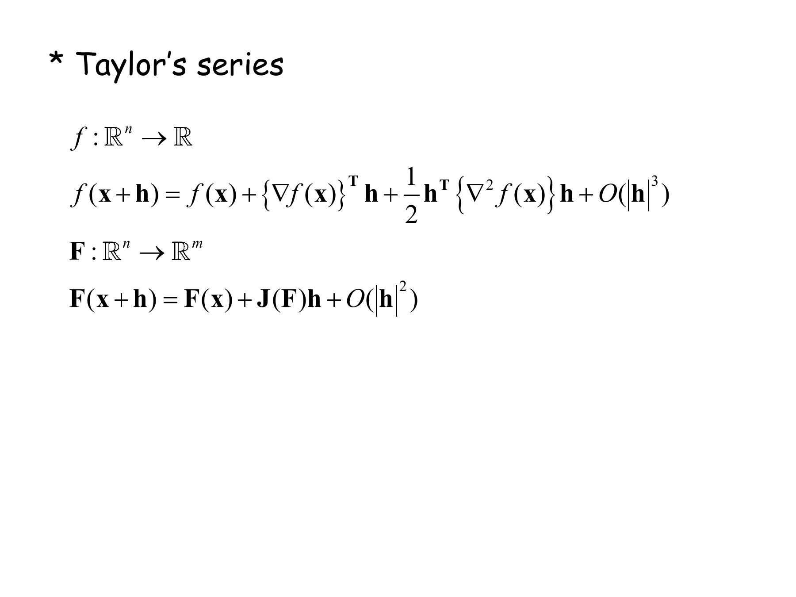

$$f(\mathbf{x}+\mathbf{h})=f(\mathbf{x})+\nabla f(\mathbf{x})^T\mathbf{h}+\frac12\mathbf{h}^T\nabla^2f(\mathbf{x})\,\mathbf{h}+O(\lVert\mathbf{h}\rVert^3)$$

이 한 줄이 이 과목 전체의 접합점이다. 세 항이 각각 다른 장에서 왔다.

| 항 | 정체 | 어디서 왔나 |
| --- | --- | --- |
| $f(\mathbf{x})$ | 값 | — |
| $\nabla f(\mathbf{x})^T\mathbf{h}$ | 방향도함수 | 2장 22쪽 $D_{\mathbf{u}}f=\nabla f\cdot\mathbf{u}$ |
| $\frac12\mathbf{h}^T\nabla^2f\,\mathbf{h}$ | **이차형식** | 1장 62쪽 `Def. 1-28` $Q(\mathbf{x})=\mathbf{x}^TA\mathbf{x}$ |

세 번째 항이 1장의 `Def. 1-28` 과 **글자 그대로 같은 형태**다. 그래서 $\nabla^2 f$ 가 양의 정부호면 `Theorem 1-21`에 의해 그 항이 볼록이고, 42쪽 `정리 2-9`(a)가 「극솟점」이라고 말하는 근거가 바로 이것이다. 그리고 3장의 모든 경사하강 예제가 쓰는 함수 $f(\mathbf{x})=\frac12\mathbf{x}^TA\mathbf{x}$ 는 **이 식에서 1차항이 없고 3차 이상이 정확히 0인 경우**다([08](./08.%20같은%20문제를%20세%20번%20낸다.md)).

---

## 44~53쪽 — 잉크가 돌아온다

44쪽에서 손글씨가 열다섯 장 만에 되살아난다.

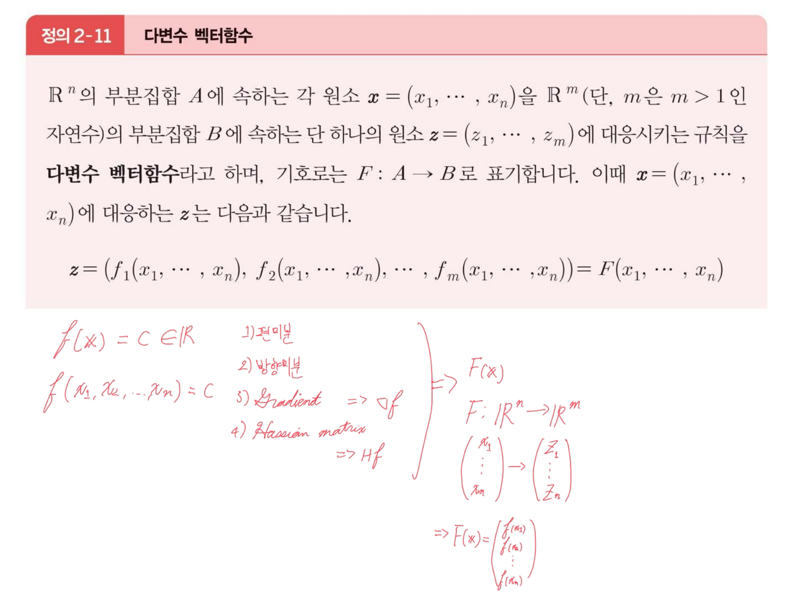

붉은 잉크가 지금까지의 도구를 네 칸 사다리로 정리했다.

$$f(\mathbf{x})=c\in\mathbb{R}\quad\begin{cases}1)\ \textsf{편미분}\\2)\ \textsf{방향미분}\\3)\ \textsf{Gradient}\Rightarrow\nabla f\\4)\ \textsf{Hessian matrix}\Rightarrow Hf\end{cases}\ \Longrightarrow\ F:\mathbb{R}^n\to\mathbb{R}^m$$

**출력이 스칼라인 동안 쓸 수 있는 것이 네 개였고, 이제 출력이 벡터가 된다**는 선언이다. 17쪽에서 같은 잉크가 「1. $f:\mathbb{R}^n\to\mathbb{R}$ — 편미분·방향미분·Gradient·Jacobian」이라고 적어 둔 예고의 회수이기도 하다.

45쪽 `정의 2-12`가 야코비 행렬을 정의하고, 잉크가 모양만 확인한다 — 「$J(F) = m\times n$ matrix」, $J(F)=(a_{ij})=\bigl(\frac{\partial f_i}{\partial x_j}\bigr)$.

46쪽 `예제 2-20`은 **완전히 풀려 있다.**

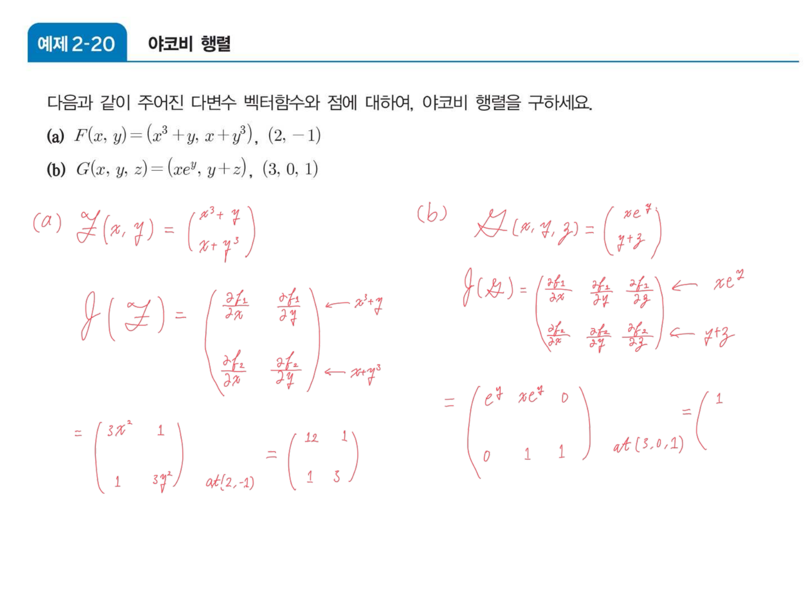

$$F(x,y)=(x^3+y,\ x+y^3)\ \Longrightarrow\ J(F)=\begin{pmatrix}3x^2&1\\1&3y^2\end{pmatrix}\ \xrightarrow{\ (2,-1)\ }\ \begin{pmatrix}12&1\\1&3\end{pmatrix}$$

$$G(x,y,z)=(xe^y,\ y+z)\ \Longrightarrow\ J(G)=\begin{pmatrix}e^y&xe^y&0\\0&1&1\end{pmatrix}\ \xrightarrow{\ (3,0,1)\ }\ \begin{pmatrix}1&3&0\\0&1&1\end{pmatrix}$$

(b)가 $2\times3$ 인 것에 주목할 만하다. **야코비 행렬은 정방일 필요가 없다** — 출력 차원 $m$ 이 행, 입력 차원 $n$ 이 열이다. 그래서 52쪽 `정의 2-13`이 야코비 **행렬식**을 정의할 때는 $F:\mathbb{R}^n\to\mathbb{R}^n$ 이라는 단서가 붙고, 잉크가 그 자리에 「$n=m$」이라고 적어 두었다.

53쪽 `예제 2-21`이 이 장의 마지막 계산이다.

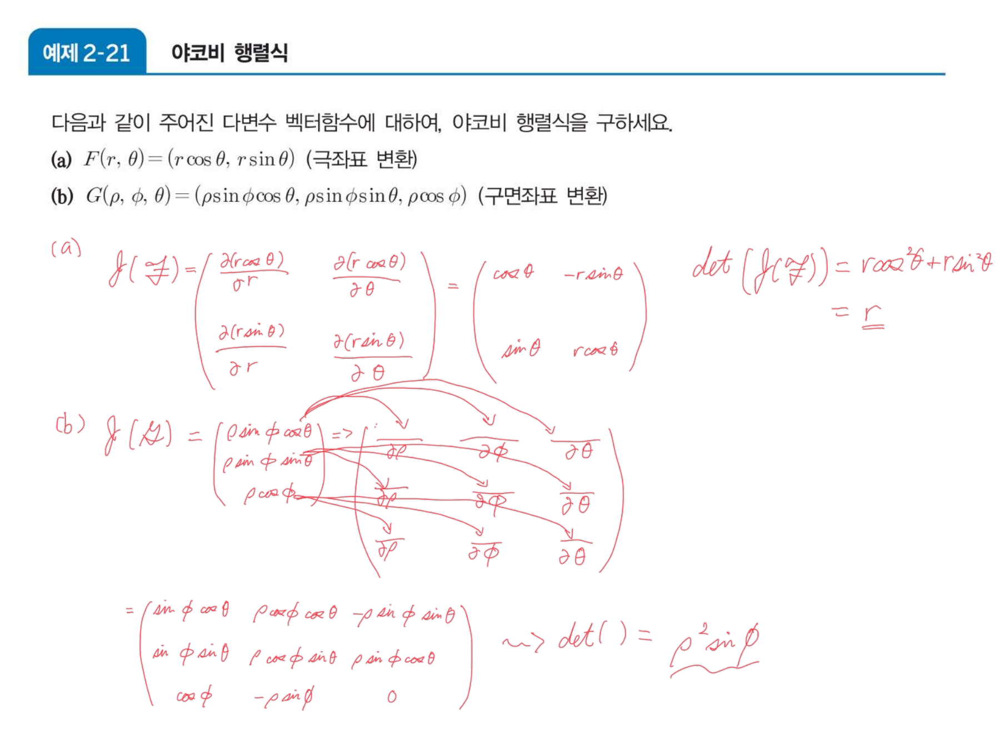

$$F(r,\theta)=(r\cos\theta,\ r\sin\theta)\ \Longrightarrow\ J=\begin{pmatrix}\cos\theta&-r\sin\theta\\\sin\theta&r\cos\theta\end{pmatrix},\quad \det J=r\cos^2\theta+r\sin^2\theta=\underline{r}$$

$$G(\rho,\phi,\theta)=(\rho\sin\phi\cos\theta,\ \rho\sin\phi\sin\theta,\ \rho\cos\phi)\ \Longrightarrow\ \det J=\rho^2\sin\phi$$

**이 $\det J$ 가 1장의 $\det$ 와 같은 것**이다. 1장 17쪽 여백이 「행렬식이 0이면 부피가 찌그러져 되돌릴 수 없음」이라 적었던 그 넓이·부피 배율이, 여기서는 좌표 변환이 **각 점에서 국소적으로** 넓이를 몇 배 하는가가 된다. 극좌표에서 $\det J=r$ 이므로 원점에서 멀수록 같은 $(dr,d\theta)$ 칸이 더 넓은 영역을 덮는다 — $r=0$ 에서는 $\det J=0$ 이고, 그래서 원점이 극좌표의 특이점이다.

### 야코비 행렬식이 넓이 배율임을 보기

```html preview
<div id="jb-root">
  <style>
    #jb-root{font-family:system-ui,-apple-system,"Segoe UI",sans-serif;color:var(--foreground);padding:4px}
    #jb-root .panel{background:var(--card);border:1px solid var(--border);border-radius:10px;padding:14px}
    #jb-root .bar{display:flex;gap:6px;flex-wrap:wrap;margin-bottom:9px}
    #jb-root button{background:var(--card);color:var(--foreground);border:1px solid var(--border);border-radius:5px;padding:5px 10px;font:inherit;font-size:12px;cursor:pointer}
    #jb-root button.act{border-color:var(--chart-1);background:color-mix(in srgb,var(--chart-1) 16%,transparent)}
    #jb-root .row{display:flex;gap:10px;align-items:center;font-size:13px;margin:7px 0}
    #jb-root input[type=range]{flex:1;accent-color:var(--chart-1);min-width:100px}
    #jb-root .stage{display:flex;justify-content:center;gap:10px;flex-wrap:wrap}
    #jb-root .out{margin-top:10px;padding:10px 12px;border:1px solid var(--border);border-radius:7px;font-size:13px;line-height:1.75}
    #jb-root code{font-family:ui-monospace,SFMono-Regular,Menlo,monospace}
    #jb-root .cap{text-align:center;font-size:11px;opacity:.7}
  </style>
  <div class="panel">
    <div class="bar">
      <button id="jP" class="act">예제 2-21 (a) — x = r cosθ, y = r sinθ</button>
      <button id="jR">리포트 10번 — x = u sin v, y = u cos v</button>
    </div>
    <div class="row"><span style="opacity:.72">r (또는 u)</span><input type="range" id="r" min="20" max="200" value="110"><b id="rv" style="width:40px;text-align:right"></b></div>
    <div class="row"><span style="opacity:.72">각</span><input type="range" id="a" min="0" max="120" value="35"><b id="av" style="width:44px;text-align:right"></b></div>
    <div class="stage">
      <div><svg id="jb-src" width="235" height="235" viewBox="0 0 235 235" role="img" aria-label="매개변수 평면의 작은 사각형"></svg><div class="cap">매개변수 평면 (r, θ)</div></div>
      <div><svg id="jb-dst" width="235" height="235" viewBox="0 0 235 235" role="img" aria-label="옮겨진 뒤의 모양"></svg><div class="cap">xy 평면</div></div>
    </div>
    <div class="out" id="jb-out"></div>
  </div>
</div>
<script>
(function(){
  var R=document.getElementById('jb-root'),mode='P';
  var dr=0.22, da=0.30;
  function map(r,a){ return (mode==='P') ? [r*Math.cos(a), r*Math.sin(a)] : [r*Math.sin(a), r*Math.cos(a)]; }
  function detJ(r){ return (mode==='P') ? r : -r; }
  function draw(){
    var r=+R.querySelector('#r').value/100, a=+R.querySelector('#a').value/100;
    R.querySelector('#rv').textContent=r.toFixed(2);
    R.querySelector('#av').textContent=(a*180/Math.PI).toFixed(0)+'°';
    var S1=78,O1=26,B1=209;
    var s=R.querySelector('#jb-src'),g='';
    function SX(v){return O1+v*S1;} function SY(v){return B1-v*S1*0.9;}
    for(var k=0;k<=2;k+=0.5){
      g+='<line x1="'+SX(k)+'" y1="16" x2="'+SX(k)+'" y2="'+B1+'" stroke="var(--border)" stroke-width="0.5"/>';
      g+='<line x1="'+O1+'" y1="'+SY(k)+'" x2="219" y2="'+SY(k)+'" stroke="var(--border)" stroke-width="0.5"/>';
    }
    g+='<line x1="'+O1+'" y1="'+B1+'" x2="219" y2="'+B1+'" stroke="var(--border)" stroke-width="1.2"/>';
    g+='<line x1="'+O1+'" y1="16" x2="'+O1+'" y2="'+B1+'" stroke="var(--border)" stroke-width="1.2"/>';
    g+='<rect x="'+SX(r)+'" y="'+SY(a+da)+'" width="'+(dr*S1)+'" height="'+(da*S1*0.9)+'" fill="var(--chart-1)" fill-opacity=".3" stroke="var(--chart-1)" stroke-width="1.8"/>';
    g+='<text x="'+O1+'" y="12" font-size="10" fill="var(--foreground)" opacity=".6">각 ↑ / 반지름 →</text>';
    s.innerHTML=g;
    var d=R.querySelector('#jb-dst'),h='',S2=62,OX=117,OY=150;
    function X(v){return OX+v*S2;} function Y(v){return OY-v*S2;}
    for(var k2=-2;k2<=2;k2++){
      h+='<line x1="'+X(k2)+'" y1="0" x2="'+X(k2)+'" y2="235" stroke="var(--border)" stroke-width="'+(k2===0?1.1:0.4)+'"/>';
      h+='<line x1="0" y1="'+Y(k2)+'" x2="235" y2="'+Y(k2)+'" stroke="var(--border)" stroke-width="'+(k2===0?1.1:0.4)+'"/>';
    }
    var pts=[],N=14;
    for(var i=0;i<=N;i++) pts.push(map(r, a+da*i/N));
    for(var i=0;i<=N;i++) pts.push(map(r+dr, a+da*(1-i/N)));
    h+='<polygon points="'+pts.map(function(p){return X(p[0]).toFixed(1)+','+Y(p[1]).toFixed(1);}).join(' ')+
       '" fill="var(--chart-1)" fill-opacity=".3" stroke="var(--chart-1)" stroke-width="1.8"/>';
    d.innerHTML=h;
    var srcArea=dr*da;
    var trueArea=(mode==='P') ? 0.5*da*((r+dr)*(r+dr)-r*r) : 0.5*da*((r+dr)*(r+dr)-r*r);
    var dj=detJ(r);
    var o=R.querySelector('#jb-out');
    var t='매개변수 평면의 작은 직사각형 넓이 = <code>Δr · Δθ = '+srcArea.toFixed(4)+'</code><br>';
    t+='옮겨진 뒤의 실제 넓이 ≈ <code>'+trueArea.toFixed(4)+'</code>, 배율 ≈ <b>'+(trueArea/srcArea).toFixed(3)+'</b><br>';
    t+='야코비 행렬식 <code>det J = '+(mode==='P'?'r':'−u')+' = '+dj.toFixed(3)+'</code>, |det J| = <b>'+Math.abs(dj).toFixed(3)+'</b>';
    if(mode==='P'){
      t+='<br><span style="opacity:.78">두 수가 거의 같다 — <b>야코비 행렬식은 그 점에서의 넓이 배율</b>이다. r 을 키우면 같은 칸이 더 넓게 퍼지고, r → 0 이면 배율이 0이 되어 원점이 뭉개진다.</span>';
    }else{
      t+='<br><b>부호가 음수다.</b> 리포트 10번의 변환은 sin 과 cos 이 뒤바뀌어 있어 det J = −u 가 된다. 넓이 배율의 <b>크기</b>는 |−u| = u 로 극좌표와 같지만, 부호가 음수라는 것은 <b>방향이 뒤집혔다</b>는 뜻이다 — 왼쪽 사각형의 테두리를 반시계로 돌면 오른쪽에서는 시계로 돈다.';
      t+='<br><span style="opacity:.78">1장에서 det 가 음수일 때 도형이 뒤집혔던 것과 같은 현상이다.</span>';
    }
    o.innerHTML=t;
  }
  R.querySelector('#jP').onclick=function(){mode='P';this.className='act';R.querySelector('#jR').className='';draw();};
  R.querySelector('#jR').onclick=function(){mode='R';this.className='act';R.querySelector('#jP').className='';draw();};
  R.addEventListener('input',draw); draw();
})();
</script>
```

오른쪽 버튼은 제출된 리포트의 10번 문항 변환이다. $x=u\sin v$, $y=u\cos v$ 는 사인과 코사인이 극좌표와 **뒤바뀌어** 있고, 그래서

$$J=\begin{pmatrix}\sin v&u\cos v\\\cos v&-u\sin v\end{pmatrix},\qquad \det J=-u\sin^2v-u\cos^2v=-u$$

크기는 극좌표와 같은데 **부호가 음수**다. 좌표축의 역할을 맞바꾸면 방향이 뒤집힌다는 1장의 사실이 여기서 다시 나온다.

54쪽 `정리 2-10`(백지)이 마지막 연결을 놓는다.

$$[J(G\circ F)](\mathbf{x})=[J(G)](F(\mathbf{x}))\cdot[J(F)](\mathbf{x})$$

**연쇄법칙이 행렬 곱이다.** 1장 5쪽 `Def. 1-3`이 정의한 그 곱이고, 차원도 맞는다 — $G\circ F:\mathbb{R}^n\to\mathbb{R}^l$ 이므로 $(l\times m)(m\times n)=(l\times n)$ 이다. 55·56쪽의 예제 두 개는 백지로 남았다.

---

## 빈 띠와 과제 문항의 대응

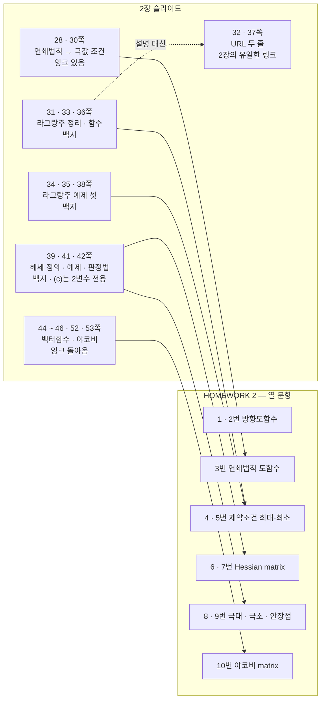

화살표가 **백지에서 과제로** 간다. 잉크가 있는 두 구간(28·30쪽, 44\~53쪽)에 대응하는 과제는 3번과 10번 두 문항뿐이고, 나머지 여섯 문항은 전부 백지 구간에서 나온다.

---

## 다음으로

57쪽 `Question?` 로 2장이 끝나고 3장이 시작된다. 3장은 이 과목에서 텍스트가 가장 희박한 자료다 — 60쪽 중 **45장이 0자**이고, 같은 문제를 세 번 반복해 낸다.

- [05. 한 파일에 붙어 있는 두 권의 책](./05.%20한%20파일에%20붙어%20있는%20두%20권의%20책.md) — 11~27쪽
- [07. 볼록 하나를 다섯 번 다시 쓴다](./07.%20볼록%20하나를%20다섯%20번%20다시%20쓴다.md) — 3장 1~19쪽
- [10. 슬라이드가 비워 둔 열 칸](./10.%20슬라이드가%20비워%20둔%20열%20칸.md) — 이 빈 띠를 학생이 채운 기록

---

## 근거 자료

| 쪽 | 계열 | 인쇄된 것 | 잉크 |
| --- | --- | --- | --- |
| 28 | 교수 | `Theorem (Chain rule)` + $\mathbf{r}(t)=\mathbf{x}_0+t\mathbf{u}$ 일 때 $g'(t)=D_{\mathbf{u}}f$ | 없음 |
| 29 | 교재 | `예제 2-14` 방향도함수와 기울기벡터 | **백지** |
| 30 | 교수 | 극값이면 $g'(t_0)=\nabla f\cdot\mathbf{u}=0$ | 없음 |
| **31** | 교재 | `정리 2-7` 라그랑주 승수법(제약 1개) | **백지** |
| **32** | — | **위키미디어 이미지 URL 한 줄** + 그림 | 없음 |
| 33 | 교수 | `Def. Lagrangean Function` $L=f+\lambda g$ | 없음 |
| **34·35** | 교재 | `예제 2-15`·`2-16` | **백지** |
| 36 | 교재 | `정리 2-8` 제약 여러 개 | **백지** |
| **37** | — | **블로그 URL 한 줄** | 없음 |
| **38** | 교재 | `예제 2-17` | **백지** |
| **39** | 교재 | `정의 2-10` 헤세 행렬 | **백지** |
| 40 | 교수 | 테일러 급수의 벡터판 + 연산자 전개 | 없음 |
| **41** | 교재 | `예제 2-18` 헤세 행렬 구하기 | **백지** |
| **42** | 교재 | `정리 2-9` 헤세 판정법 — **(c)는 2변수 전용** | **백지** |
| 43 | 교재 | (헤세 관련) | **백지** |
| **44** | 교재 | `정의 2-11` 다변수 벡터함수 | **네 도구의 사다리**, $F:\mathbb{R}^n\to\mathbb{R}^m$ 로의 전환 |
| **45** | 교재 | `정의 2-12` 야코비 행렬 | $m\times n$ 확인, $(a_{ij})=(\partial f_i/\partial x_j)$ |
| **46** | 교재 | `예제 2-20` (a) 2×2 (b) 2×3 | **둘 다 완전히 풀림** |
| 47–50 | 교수 | `Total Derivative`, 행렬 미분, 선형·이차형식의 도함수 | 없음 |
| 51 | 교수 | 2차 테일러 $f+\nabla f^T\mathbf{h}+\frac12\mathbf{h}^T\nabla^2f\,\mathbf{h}$ | 없음 |
| **52** | 교재 | `정의 2-13` 야코비 행렬식 | 「$n=m$」, $J$ 의 크기 |
| **53** | 교재 | `예제 2-21` 극좌표·구면좌표 | **$\det J=r$, $\det J=\rho^2\sin\phi$ 까지 완성** |
| 54 | 교재 | `정리 2-10` $J(G\circ F)=J(G)\cdot J(F)$ | **백지** |
| 55·56 | 교재 | `예제 2-22`·`2-23` 합성함수의 야코비 | **백지** |
| 57 | 교수 | `Question?` | — |

추출 번들: `.ok/local/pdf-extract/02_math-theory__optimization-math__MCS087_2장_미적분_v3/`
(이 구간에서 `page_chars` 가 0인 페이지: 29·31·34·35·36·38·39·41·42·43·44·45·46·52·53·54·55·56쪽. 44\~46·52·53쪽은 0자이면서도 손글씨가 빽빽하다 — **0자라는 수치가 곧 백지를 뜻하지 않는다**는 점이 이 과목 전체에서 되풀이된다.)

수치 검증: 라그랑주 인터랙티브의 임계점 $(\pm\sqrt2,\pm\sqrt2)$ 과 최대 $e^4$·최소 $e^{-4}$ 를 제약원을 20만 등분한 수치 탐색으로 확인했고, `예제 2-20`의 두 야코비 행렬과 대입값, `예제 2-21`의 $\det J=r$·$\rho^2\sin\phi$, 리포트 10번의 $\det J=-u$ 를 각각 수치로 재계산해 대조했다. `정리 2-9`(c)의 반례($H=-2I_3$, $\det=-8<0$)는 직접 구성했다.
