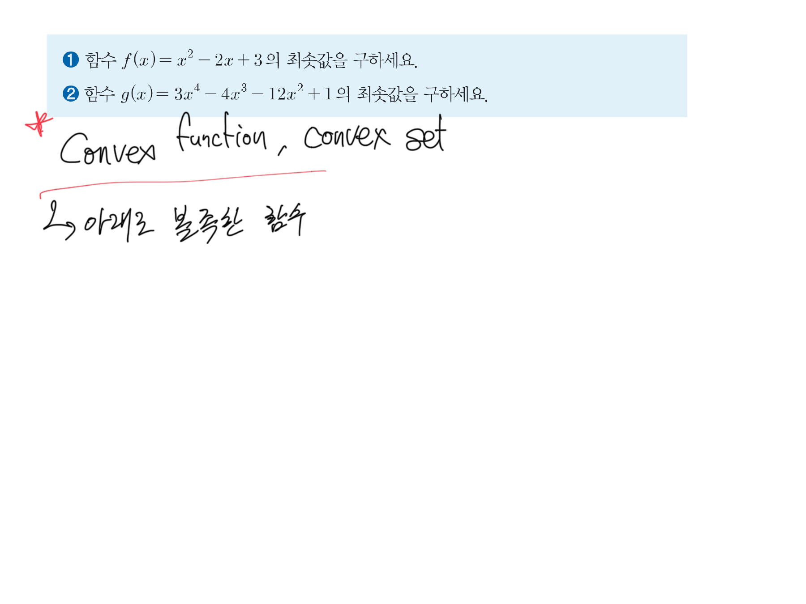
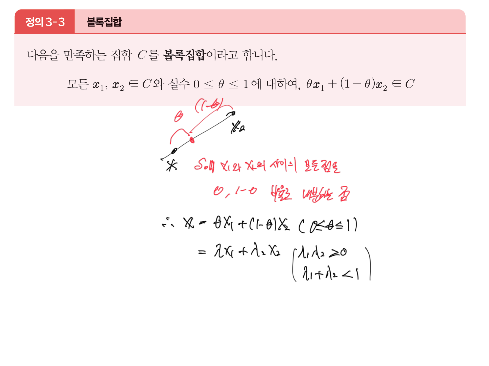
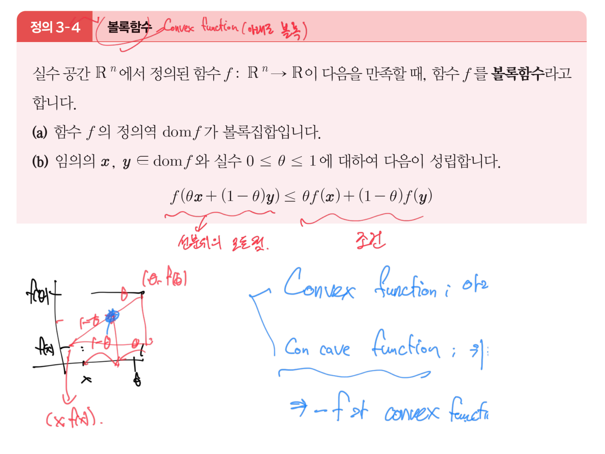
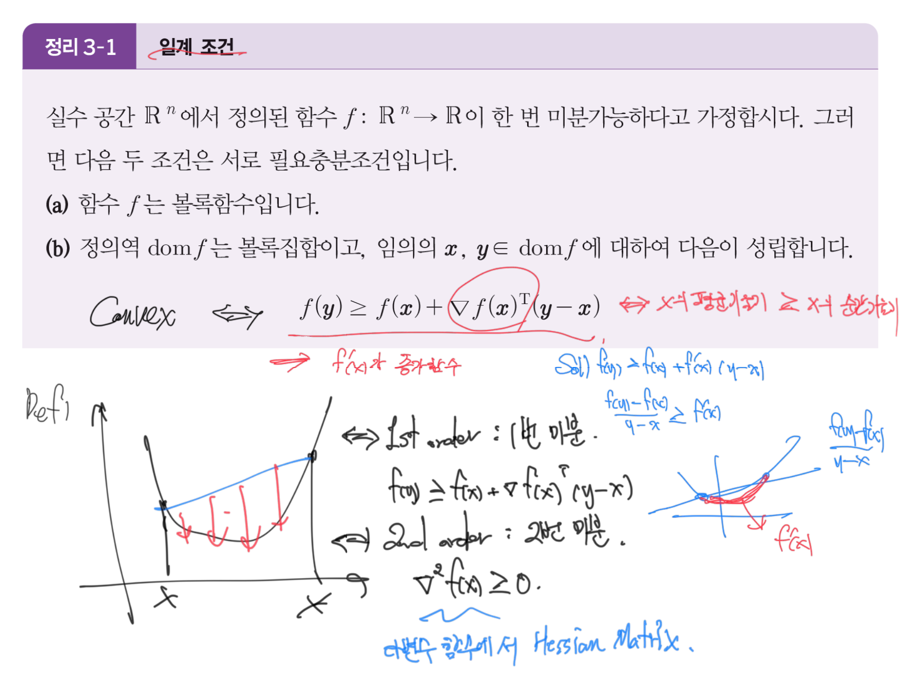
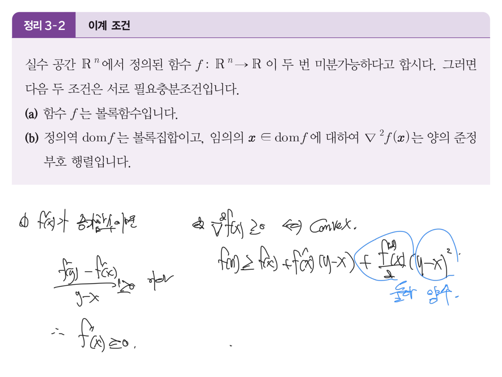
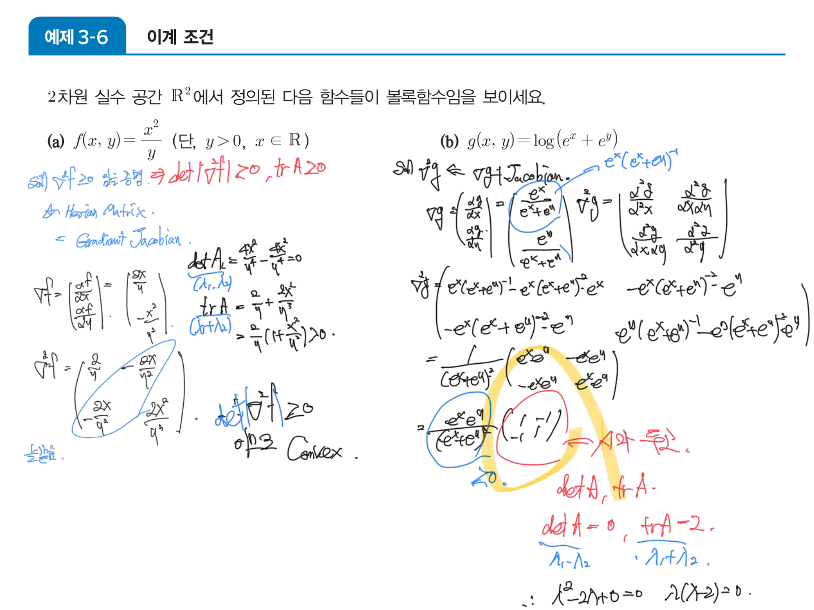
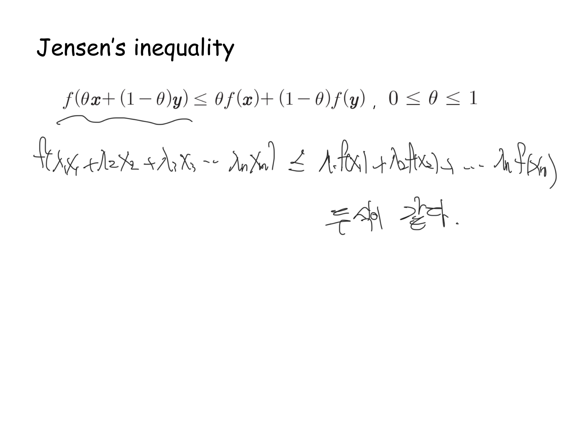
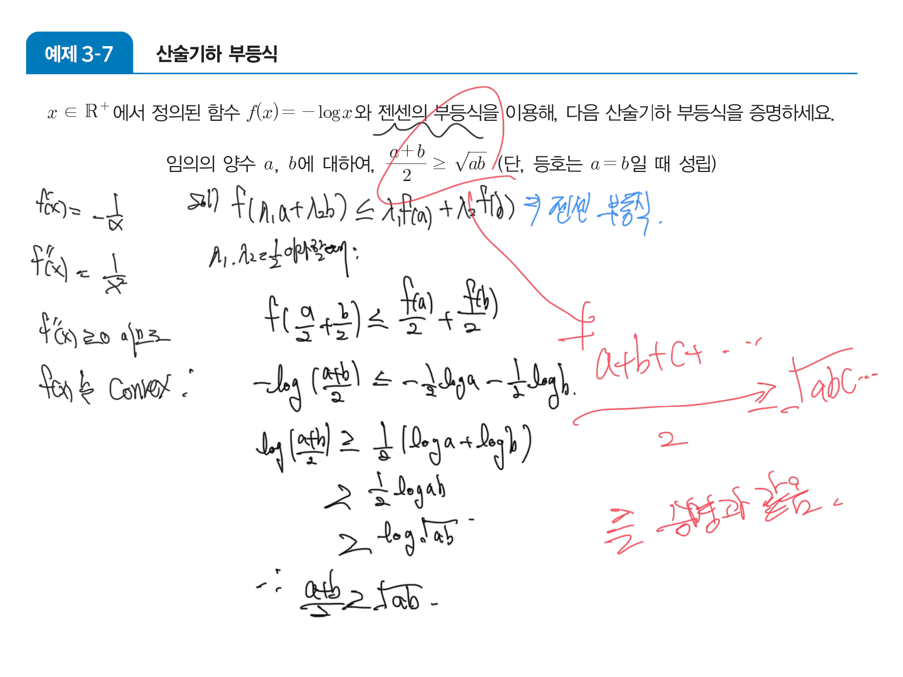
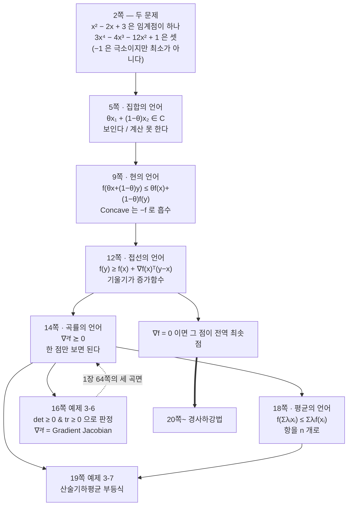

> [!abstract] 같은 말을 다섯 번 한다 — 그럴 이유가 있다
> 3장은 이 과목에서 텍스트가 가장 희박하다. 60쪽 중 **45장이 추출 0자**이고, 1\~19쪽만 보면 19장 중 16장이 0자다. 그 16장에 들어 있는 것은 사실상 **한 문장**이다 — 「아래로 볼록」.
>
> | 쪽 | 언어 | 형태 | 눈으로 보이는가 | 계산할 수 있는가 |
> | --- | --- | --- | --- | --- |
> | 5 | **집합** | $\theta\mathbf{x}_1+(1-\theta)\mathbf{x}_2\in C$ | 그렇다 | 아니다 |
> | 9 | **현** | $f(\theta x+(1-\theta)y)\le\theta f(x)+(1-\theta)f(y)$ | 그렇다 | 두 점을 전부 봐야 한다 |
> | 12 | **접선** | $f(y)\ge f(x)+\nabla f(x)^T(y-x)$ | 거의 | 여전히 두 점 |
> | 14 | **곡률** | $\nabla^2 f(\mathbf{x})\succeq0$ | 아니다 | **한 점에서 끝난다** |
> | 18 | **평균** | $f\bigl(\sum\lambda_i x_i\bigr)\le\sum\lambda_i f(x_i)$ | 아니다 | 부등식을 만들어 낸다 |
>
> 위에서 아래로 갈수록 **그림이 사라지고 계산 가능성이 올라간다.** 그 교환이 이 구간의 척추다.

---

## 2쪽 — 볼록이 왜 필요한지 먼저 보인다

3장은 정의로 시작하지 않는다. 문제 두 개로 시작한다.



> ❶ 함수 $f(x)=x^2-2x+3$ 의 최솟값을 구하세요.
> ❷ 함수 $g(x)=3x^4-4x^3-12x^2+1$ 의 최솟값을 구하세요.

붉은 잉크는 별 하나와 함께 제목만 달았다 — `Convex function, convex set` 그리고 「↳ 아래로 볼록한 함수」. 풀이는 없다.

그런데 이 두 문제가 **같은 난이도가 아니다.**

$$f'(x)=2x-2=0\ \Rightarrow\ x=1,\qquad f(1)=2$$

$f$ 는 미분해서 0이 되는 점이 하나뿐이고, 그 점이 곧 답이다. 반면

$$g'(x)=12x^3-12x^2-24x=12x(x-2)(x+1)=0\ \Rightarrow\ x=-1,\ 0,\ 2$$

세 점이 나오고, 값을 전부 넣어 봐야 한다.

| $x$ | $g(x)$ | 정체 |
| --- | --- | --- |
| $-1$ | $-4$ | **극솟점인데 최솟값이 아니다** |
| $0$ | $1$ | 극댓점 |
| $2$ | $-31$ | 극솟점이자 최솟값 |

$g''(x)=12(3x^2-2x-2)$ 가 $x\approx-0.549$ 와 $x\approx1.215$ 사이에서 음수라 그 구간에서 위로 볼록하다. 즉 $g$ 는 볼록함수가 아니고, 그래서 **「미분해서 0인 점을 찾았다」가 「답을 찾았다」를 뜻하지 않는다.** $x=-1$ 에서 멈춘 사람은 $-4$ 를 답으로 내고 틀린다.

볼록함수의 값어치가 여기 있다 — 볼록이면 극솟점이 곧 최솟점이므로 **지역적으로 확인한 것이 전역적으로 참**이다. 3장의 나머지 전부(특히 경사하강법)가 그 보장 위에 선다.

---

## 5쪽 — 집합의 언어

`정의 3-3`이 볼록집합을 정의한다.



$$\textsf{모든 }\mathbf{x}_1,\mathbf{x}_2\in C\textsf{ 와 }0\le\theta\le1\textsf{ 에 대하여 }\ \theta\mathbf{x}_1+(1-\theta)\mathbf{x}_2\in C$$

잉크가 두 점을 선분으로 잇고 그 위의 한 점에 $\theta$ 와 $(1-\theta)$ 를 표시한 뒤 뜻을 적었다.

> 「$C$ 에 $x_1$ 와 $x_2$ 의 사이의 모든 점을 $\theta$, $1-\theta$ 비율로 내분하는 점」

이 정의가 눈에 보이는 이유는 「집합에 구멍이나 오목한 곳이 없다」는 그림과 정확히 대응하기 때문이다. 대신 **계산할 수 있는 것이 없다** — 모든 점 쌍, 모든 $\theta$ 를 확인해야 한다.

---

## 9쪽 — 현의 언어

`정의 3-4`가 집합의 조건을 함수로 옮긴다.



**(a)** $\mathrm{dom}\,f$ 가 볼록집합이고
**(b)** $f(\theta\mathbf{x}+(1-\theta)\mathbf{y})\le\theta f(\mathbf{x})+(1-\theta)f(\mathbf{y})$

잉크가 좌변·우변 아래에 각각 물결을 긋고 이름을 붙였다 — 좌변은 「선분의 y좌표」가 아니라 **함수값**, 우변은 **현 위의 점**이다. 그리고 그림을 그렸다. $(x,f(x))$ 와 $(y,f(y))$ 를 잇는 직선이 그래프보다 **위에** 있다.

옆에 파란 글씨로 대응 관계를 정리했다.

$$\textsf{Convex function : 아래로 볼록},\qquad \textsf{Concave function : 위로 볼록}\ \Longrightarrow\ -f\ \textsf{가 convex function}$$

오목함수를 따로 이론화할 필요가 없다는 뜻이다. 최대화 문제는 $-f$ 의 최소화로 바꾸면 되고, 그래서 이 과목은 **볼록·최소화만** 다룬다.

(a)가 붙어 있는 이유는 (b)를 쓰려면 $\theta\mathbf{x}+(1-\theta)\mathbf{y}$ 가 정의역 안에 있어야 하기 때문이다 — 5쪽의 집합 조건이 여기서 전제로 재사용된다.

11쪽이 볼록함수의 예를 목록으로 준다.

$$f(x)=ax+b,\quad e^{ax},\quad x^p\ (x\ge0,\ p\ge1),\quad |x|^p\ (p\ge1),\quad x\log x,\quad \mathbf{a}^T\mathbf{x}+b,\quad \lVert\mathbf{x}\rVert_p$$

첫 줄 $f(x)=ax+b$ 가 재미있다. 직선은 볼록이면서 동시에 오목이다 — 현이 그래프 **위에 있으면서 동시에 그래프 자체**이므로 부등식이 등호로 성립한다.

---

## 12쪽 — 접선의 언어

`정리 3-1`이 현을 접선으로 바꾼다.



$$f \textsf{ 가 볼록}\iff f(\mathbf{y})\ge f(\mathbf{x})+\nabla f(\mathbf{x})^T(\mathbf{y}-\mathbf{x})$$

우변은 $\mathbf{x}$ 에서 그은 **접평면**이다. 그러니까 이 조건은 「그래프가 어느 접평면보다도 위에 있다」이다. 잉크가 그림으로 그 말을 그렸다 — 곡선 아래에 직선을 긋고 둘 사이의 간격을 붉은 화살표로 여러 개 표시했다.

오른쪽에 붉은 글씨로 1변수 버전의 뜻을 적었다.

$$f(y)\ge f(x)+f'(x)(y-x)\ \Longrightarrow\ \frac{f(y)-f(x)}{y-x}\ge f'(x)\ \Longrightarrow\ \textsf{「}f'(x)\textsf{가 증가함수」}$$

즉 볼록이란 **기울기가 단조증가**한다는 뜻이다. 그리고 그 아래에 다음 단계를 예고한다 — 「1st order : 1번 미분」, 「2nd order : 2번 미분, $\nabla^2f(\mathbf{x})\ge0$」, 그리고 파란 글씨로 「다변수 함수에서 **Hessian Matrix**」.

이 조건에는 중요한 따름정리가 하나 딸려 온다. $\nabla f(\mathbf{x})=\mathbf{0}$ 인 점에서는

$$f(\mathbf{y})\ge f(\mathbf{x})+0=f(\mathbf{x})\qquad\textsf{모든 }\mathbf{y}\textsf{ 에 대하여}$$

**기울기가 0이면 그 점이 곧 전역 최솟점**이다. 2장 30쪽이 「극값이면 $\nabla f=0$」이라는 필요조건을 줬는데([06](./06.%20잉크가%20멈춘%20자리에서%20과제가%20시작된다.md)), 볼록이라는 전제가 붙는 순간 그것이 충분조건까지 된다. 2쪽의 $g$ 에서 $x=-1$ 이 함정이었던 이유가 이 전제가 없었기 때문이다.

---

## 14쪽 — 곡률의 언어

`정리 3-2`가 마지막 한 걸음을 간다.



$$f\textsf{ 가 볼록}\iff \nabla^2f(\mathbf{x})\ \textsf{가 양의 준정부호}$$

**이것이 결정적인 전환이다.** 앞의 셋은 전부 두 점 $\mathbf{x}$, $\mathbf{y}$ 를 동시에 봐야 했는데, 이 조건은 **한 점 $\mathbf{x}$ 만 본다.** 각 점에서 헤세 행렬 하나를 계산해 부호만 확인하면 끝난다.

잉크가 1계에서 2계로 넘어가는 다리를 적어 두었다. 2차 테일러 전개

$$f(y)\ge f(x)+f'(x)(y-x)+\frac{f''(x)}{2}(y-x)^2$$

에서 마지막 항에 동그라미를 치고 「둘 다 양수」라 적었다 — $(y-x)^2$ 은 항상 0 이상이므로 $f''(x)\ge0$ 이면 그 항 전체가 0 이상이고, 그러면 12쪽의 1계 부등식이 자동으로 따라온다. 2장 51쪽의 2차 테일러 전개가 여기서 쓰인다([06](./06.%20잉크가%20멈춘%20자리에서%20과제가%20시작된다.md)).

그리고 1장 60~64쪽에서 준비해 둔 것이 전부 여기에 꽂힌다 — 헤세 행렬은 클레로 정리에 의해 대칭이고, 대칭이면 고윳값이 실수이며 직교 대각화가 되고, **고윳값의 부호가 정부호성을 결정**한다([03](./03.%20잉크가%20끊겼다%20되살아나는%20자리.md)).

### 16쪽 — 고윳값을 구하지 않고 부호만 알아내기

`예제 3-6`이 그 판정을 실제로 한다. 그런데 고유방정식을 풀지 않는다.



파란 잉크가 맨 위에 방법을 못 박았다 — 「$\nabla^2 f\ge0$ 임을 증명 ⇒ $\det|\nabla^2f|\ge0$, $\mathrm{tr}\,A\ge0$」. 그리고 정체를 밝힌다 — 「$\nabla^2f$ = **Hessian Matrix = Gradient Jacobian**」.

기울기벡터의 야코비 행렬이 헤세 행렬이라는 이 한 줄이 2장 44\~46쪽의 야코비와 39쪽의 헤세를 하나로 묶는다.

**(a)** $f(x,y)=\dfrac{x^2}{y}$ ($y>0$)

$$\nabla f=\Bigl(\frac{2x}{y},\ -\frac{x^2}{y^2}\Bigr),\qquad \nabla^2f=\begin{pmatrix}\dfrac{2}{y}&-\dfrac{2x}{y^2}\\[6pt]-\dfrac{2x}{y^2}&\dfrac{2x^2}{y^3}\end{pmatrix}$$

$$\det=\frac{2}{y}\cdot\frac{2x^2}{y^3}-\frac{4x^2}{y^4}=\frac{4x^2}{y^4}-\frac{4x^2}{y^4}=0,\qquad \mathrm{tr}=\frac{2}{y}+\frac{2x^2}{y^3}=\frac{2}{y}\Bigl(1+\frac{x^2}{y^2}\Bigr)\ge0$$

**(b)** $g(x,y)=\log(e^x+e^y)$

$$\nabla^2g=\frac{e^xe^y}{(e^x+e^y)^2}\begin{pmatrix}1&-1\\-1&1\end{pmatrix}$$

붉은 잉크가 $\begin{pmatrix}1&-1\\-1&1\end{pmatrix}$ 만 떼어 「$A$와 동일」이라 적고 $\det A=0$, $\mathrm{tr}\,A=2$ 를 쓴 뒤 특성방정식을 세운다.

$$\lambda^2-2\lambda+0=0\ \Longrightarrow\ \lambda(\lambda-2)=0\ \Longrightarrow\ \lambda=0,\ 2$$

둘 다 0 이상이므로 양의 **준**정부호이고, 따라서 볼록이다.

> [!note] 2×2에서 det과 tr이 고윳값을 대신하는 이유
> 대칭 $2\times2$ 행렬의 특성방정식은 $\lambda^2-(\mathrm{tr}A)\lambda+\det A=0$ 이므로
>
> $$\lambda_1+\lambda_2=\mathrm{tr}\,A,\qquad \lambda_1\lambda_2=\det A$$
>
> 두 고윳값이 **모두 0 이상** ⟺ 합도 곱도 0 이상이다. 그래서 고유방정식을 풀지 않고 두 수만 봐도 된다. 두 예제 다 $\det=0$ 이라 고윳값 하나가 정확히 0 — 즉 **정부호가 아니라 준정부호**다.
>
> 이것이 1장 64쪽 그림의 가운데 곡면($x^2$, semidefinite)에 해당한다. 최솟값이 한 점이 아니라 **직선 전체**라는 뜻이고, 실제로 $f=x^2/y$ 는 $x=0$ 인 모든 $y$ 에서 0이다([03](./03.%20잉크가%20끊겼다%20되살아나는%20자리.md)).

### det과 tr로 직접 분류해 보기

```html preview
<div id="qf-root">
  <style>
    #qf-root{font-family:system-ui,-apple-system,"Segoe UI",sans-serif;color:var(--foreground);padding:4px}
    #qf-root .panel{background:var(--card);border:1px solid var(--border);border-radius:10px;padding:14px}
    #qf-root .wrap{display:flex;flex-wrap:wrap;gap:16px;align-items:flex-start;justify-content:center}
    #qf-root .side{flex:1 1 235px;min-width:225px;font-size:13px}
    #qf-root .row{display:flex;align-items:center;gap:8px;margin:7px 0}
    #qf-root .row span{width:34px;opacity:.72;font-variant-numeric:tabular-nums}
    #qf-root input[type=range]{flex:1;accent-color:var(--chart-1);min-width:85px}
    #qf-root .v{width:40px;text-align:right;font-variant-numeric:tabular-nums}
    #qf-root button{background:var(--card);color:var(--foreground);border:1px solid var(--border);border-radius:5px;padding:4px 8px;font:inherit;font-size:11.5px;cursor:pointer;margin:2px 3px 2px 0}
    #qf-root .out{margin-top:9px;padding:9px 11px;border:1px solid var(--border);border-radius:7px;line-height:1.7}
    #qf-root .tag{display:inline-block;padding:2px 9px;border-radius:99px;font-weight:700;font-size:12px;border:1px solid var(--border)}
    #qf-root code{font-family:ui-monospace,SFMono-Regular,Menlo,monospace}
  </style>
  <div class="panel">
    <div class="wrap">
      <svg id="qf-svg" width="290" height="290" viewBox="0 0 290 290" role="img" aria-label="이차형식의 등고선"></svg>
      <div class="side">
        <div style="opacity:.72;font-size:12px;margin-bottom:3px">대칭 행렬 A = [[a, b], [b, c]]</div>
        <div class="row"><span>a</span><input type="range" id="a" min="-4" max="4" step="0.25" value="2"><b class="v" id="av"></b></div>
        <div class="row"><span>b</span><input type="range" id="b" min="-4" max="4" step="0.25" value="-1"><b class="v" id="bv"></b></div>
        <div class="row"><span>c</span><input type="range" id="c" min="-4" max="4" step="0.25" value="2"><b class="v" id="cv"></b></div>
        <div>
          <button data-m="2,-1,2">아래로 볼록</button>
          <button data-m="1,-1,1">예제 3-6 (b)</button>
          <button data-m="2,0,-2">안장</button>
          <button data-m="-2,1,-2">위로 볼록</button>
        </div>
        <div class="out" id="qf-out"></div>
      </div>
    </div>
  </div>
</div>
<script>
(function(){
  var R=document.getElementById('qf-root'),svg=R.querySelector('#qf-svg');
  var S=34,OX=145,OY=145;
  function X(v){return OX+v*S;} function Y(v){return OY-v*S;}
  function draw(){
    var a=+R.querySelector('#a').value,b=+R.querySelector('#b').value,c=+R.querySelector('#c').value;
    R.querySelector('#av').textContent=a.toFixed(2);
    R.querySelector('#bv').textContent=b.toFixed(2);
    R.querySelector('#cv').textContent=c.toFixed(2);
    var det=a*c-b*b, tr=a+c;
    var disc=tr*tr-4*det, sq=Math.sqrt(Math.max(0,disc));
    var l1=(tr-sq)/2, l2=(tr+sq)/2;
    var g='';
    for(var k=-4;k<=4;k++){
      g+='<line x1="'+X(k)+'" y1="0" x2="'+X(k)+'" y2="290" stroke="var(--border)" stroke-width="'+(k===0?1.1:0.35)+'"/>';
      g+='<line x1="0" y1="'+Y(k)+'" x2="290" y2="'+Y(k)+'" stroke="var(--border)" stroke-width="'+(k===0?1.1:0.35)+'"/>';
    }
    var N=110,cell=290/N;
    var vals=[];
    for(var i=0;i<N;i++){vals.push([]);for(var j=0;j<N;j++){
      var xx=(i*cell-OX)/S, yy=(OY-j*cell)/S;
      vals[i].push(a*xx*xx+2*b*xx*yy+c*yy*yy);}}
    var levels=[-12,-6,-2,-0.5,0.5,2,6,12,20];
    levels.forEach(function(L){
      var col=(L>0)?'var(--chart-1)':'var(--chart-5)';
      var p='';
      for(var i=0;i<N-1;i++)for(var j=0;j<N-1;j++){
        var v0=vals[i][j],v1=vals[i+1][j],v2=vals[i][j+1];
        if((v0-L)*(v1-L)<0) p+='M'+(i*cell+cell/2).toFixed(1)+','+(j*cell).toFixed(1)+'l0,'+cell.toFixed(1);
        if((v0-L)*(v2-L)<0) p+='M'+(i*cell).toFixed(1)+','+(j*cell+cell/2).toFixed(1)+'l'+cell.toFixed(1)+',0';
      }
      g+='<path d="'+p+'" stroke="'+col+'" stroke-width="1.15" fill="none" opacity=".8"/>';
    });
    g+='<circle cx="'+X(0)+'" cy="'+Y(0)+'" r="3.6" fill="var(--foreground)"/>';
    svg.innerHTML=g;
    var kind,note;
    var eps=1e-9;
    if(det>eps&&tr>0){kind='양의 정부호 — 아래로 볼록';note='두 고윳값이 모두 양수. 원점이 <b>유일한 최솟점</b>이고 등고선은 닫힌 타원이다. 1장 64쪽의 사발이 이것이다.';}
    else if(det>eps&&tr<0){kind='음의 정부호 — 위로 볼록';note='두 고윳값이 모두 음수. 원점이 최댓점이다. −f 를 보면 볼록이 된다.';}
    else if(det<-eps){kind='부정부호 — 안장';note='고윳값의 <b>부호가 엇갈린다.</b> 어느 방향으로는 올라가고 어느 방향으로는 내려간다 — 최솟값도 최댓값도 없다. 1장 64쪽의 안장이 이것이다.';}
    else if(Math.abs(det)<=eps&&tr>0){kind='양의 준정부호 — 볼록이지만 평평한 방향이 있다';note='고윳값 하나가 <b>정확히 0</b>이다. 그 방향으로는 값이 전혀 변하지 않아 최솟점이 한 점이 아니라 <b>직선 전체</b>다. <code>예제 3-6</code>의 두 함수가 모두 이 상태다 — 1장 64쪽의 홈통.';}
    else if(Math.abs(det)<=eps&&tr<0){kind='음의 준정부호';note='고윳값이 0과 음수다.';}
    else{kind='영행렬';note='모든 방향이 평평하다.';}
    R.querySelector('#qf-out').innerHTML=
      '<code>det A = '+det.toFixed(3)+'</code> &nbsp; <code>tr A = '+tr.toFixed(2)+'</code><br>'+
      'λ = <b>'+l1.toFixed(3)+'</b>, <b>'+l2.toFixed(3)+'</b> &nbsp; <span style="opacity:.65">(λ₁λ₂ = det, λ₁+λ₂ = tr)</span><br>'+
      '<span class="tag">'+kind+'</span><br><span style="opacity:.82">'+note+'</span>';
  }
  R.addEventListener('input',draw);
  R.addEventListener('click',function(e){
    if(!e.target.dataset.m) return;
    var v=e.target.dataset.m.split(',');
    ['a','b','c'].forEach(function(id,i){R.querySelector('#'+id).value=v[i];});
    draw();
  });
  draw();
})();
</script>
```

`예제 3-6 (b)` 버튼을 누르면 $\begin{pmatrix}1&-1\\-1&1\end{pmatrix}$ 이 들어가고 $\det=0$, $\mathrm{tr}=2$, $\lambda=0,2$ 가 그대로 나온다. 등고선이 타원이 아니라 **평행한 직선 쌍**이 되는데, 고윳값 0에 대응하는 방향(여기서는 $(1,1)$ 방향)으로는 값이 변하지 않기 때문이다.

---

## 18~19쪽 — 평균의 언어, 그리고 값을 치른다

18쪽이 젠센 부등식이다. 인쇄된 것은 `정의 3-4`(b)와 글자 그대로 같은 식인데, 잉크가 **항의 개수를 둘에서 $n$ 개로 늘린다.**



$$f\Bigl(\sum_{i=1}^{n}\lambda_ix_i\Bigr)\le\sum_{i=1}^{n}\lambda_if(x_i),\qquad \lambda_i\ge0,\ \sum\lambda_i=1$$

「똑같이 같다」고 적혀 있다. 두 점의 내분이 $n$ 점의 가중평균으로 바뀌었을 뿐 부등호의 방향과 의미는 그대로다. 그리고 이 일반화가 19쪽에서 값을 한다.



문제는 이것이다.

> $x\in\mathbb{R}^+$ 에서 정의된 $f(x)=-\log x$ 와 젠센의 부등식을 이용해 $\dfrac{a+b}{2}\ge\sqrt{ab}$ 를 증명하세요.

잉크의 풀이는 세 걸음이다.

**① 볼록임을 보인다** — 14쪽의 2계 조건을 쓴다.

$$f(x)=-\log x,\quad f'(x)=-\frac1x,\quad f''(x)=\frac{1}{x^2}\ge0\ \Longrightarrow\ f\ \textsf{는 convex}$$

**② 젠센에 $\lambda_1=\lambda_2=\frac12$ 을 넣는다.**

$$f\Bigl(\frac{a}{2}+\frac{b}{2}\Bigr)\le\frac{f(a)}{2}+\frac{f(b)}{2}\ \Longrightarrow\ -\log\frac{a+b}{2}\le-\frac12\log a-\frac12\log b$$

**③ 부호를 뒤집고 로그를 합친다.**

$$\log\frac{a+b}{2}\ge\frac12(\log a+\log b)=\frac12\log(ab)=\log\sqrt{ab}\ \Longrightarrow\ \boxed{\frac{a+b}{2}\ge\sqrt{ab}}$$

그리고 붉은 잉크가 오른쪽에 확장을 적었다.

$$\frac{a+b+c+\cdots}{n}\ge\sqrt[n]{abc\cdots}\qquad\textsf{「증명과 똑같음」}$$

$n$ 개 항짜리 젠센에 $\lambda_i=\frac1n$ 을 넣으면 그대로 나온다는 뜻이다. 18쪽에서 항을 늘려 둔 이유가 여기서 드러난다.

> [!important] 이 한 문제가 다섯 언어를 한 줄에 꿴다
> `예제 3-7`의 풀이를 거꾸로 읽으면 이 구간 전체가 보인다.
>
> $$\underbrace{f''=\tfrac{1}{x^2}\ge0}_{\textsf{14쪽 곡률}}\ \Longrightarrow\ \underbrace{f\ \textsf{는 볼록}}_{\textsf{9쪽 현}}\ \Longrightarrow\ \underbrace{\textsf{젠센 부등식}}_{\textsf{18쪽 평균}}\ \Longrightarrow\ \underbrace{\textsf{산술기하평균 부등식}}_{\textsf{전혀 다른 정리}}$$
>
> **「한 점에서 2계 도함수의 부호를 본다」에서 출발해 「임의의 두 양수에 대한 부등식」으로 도착한다.** 다섯 번 다시 쓴 것이 낭비가 아니었다는 증거이고, 동시에 왜 뒤로 갈수록 그림을 버리고 계산을 택했는지에 대한 답이다 — 그림으로는 이 유도를 할 수 없다.

---

## 다섯 언어의 관계



---

## 다음으로

19쪽까지가 「볼록이란 무엇인가」다. 20쪽부터는 「그래서 최솟점을 어떻게 찾는가」로 넘어가는데, 그 방식이 특이하다 — **같은 문제를 세 번 낸다.**

- [03. 잉크가 끊겼다 되살아나는 자리](./03.%20잉크가%20끊겼다%20되살아나는%20자리.md) — 1장 64쪽의 세 곡면이 여기로 온다
- [06. 잉크가 멈춘 자리에서 과제가 시작된다](./06.%20잉크가%20멈춘%20자리에서%20과제가%20시작된다.md) — 2계 조건이 쓰는 헤세 행렬
- [08. 같은 문제를 세 번 낸다](./08.%20같은%20문제를%20세%20번%20낸다.md) — 20~47쪽. 경사하강법

---

## 근거 자료

| 쪽 | 인쇄된 것 | 잉크 |
| --- | --- | --- |
| 1 | 표지 `최적화 수학 / 3. Convex Optimization` | — |
| **2** | 최솟값을 구하는 두 문제 | ☆, `Convex function, convex set`, 「아래로 볼록한 함수」 |
| 3–4 | (볼록집합 도입) | — |
| **5** | `정의 3-3` 볼록집합 | 선분과 $\theta$·$1-\theta$ 그림, 「사이의 모든 점을 내분」, $\lambda_1x_1+\lambda_2x_2$ 표기 |
| 6–8 | (볼록집합의 예) | — |
| **9** | `정의 3-4` 볼록함수 (a)(b) | 현 그림, 좌변·우변 명명, **Convex/Concave 대응과 $-f$** |
| 10 | (볼록함수 도입) | — |
| 11 | 볼록함수 목록 7개 | — |
| **12** | `정리 3-1` 일계 조건 | 접선이 그래프 아래 그림, 「$f'(x)$가 증가함수」, **1st/2nd order 예고**, 「다변수 함수에서 Hessian Matrix」 |
| 13 | (일계 조건 관련) | — |
| **14** | `정리 3-2` 이계 조건 | 1계→2계 유도, 2차항에 「둘 다 양수」 |
| 15 | (이계 조건 관련) | — |
| **16** | `예제 3-6` (a) $x^2/y$ (b) $\log(e^x+e^y)$ | **$\det\ge0$ & $\mathrm{tr}\ge0$ 판정법**, 「$\nabla^2f$ = Hessian Matrix = Gradient Jacobian」, (b)의 $\lambda^2-2\lambda=0\Rightarrow\lambda=0,2$ |
| 17 | (이계 조건 예제) | — |
| **18** | `Jensen's inequality` 두 항짜리 | **$n$ 항으로 일반화**, 「똑같이 같다」 |
| **19** | `예제 3-7` 산술기하 부등식 | $f''=1/x^2\ge0$, 젠센에 $\lambda=\frac12$ 대입, 전개 전부, **$n$개 항 확장과 「증명과 똑같음」** |

추출 번들: `.ok/local/pdf-extract/02_math-theory__optimization-math__MSC087_3장_볼록최적화/`
(이 구간 19장 중 `page_chars` 가 0이 아닌 것은 1쪽(25자)·11쪽(77자)·18쪽(19자) 셋뿐이다. 나머지 16장은 전부 0자이며 60쪽 전체를 180 dpi로 렌더해 확인했다.)

수치 검증: 2쪽 두 문제의 임계점과 함숫값($f$ 의 최솟값 2, $g$ 의 $g(-1)=-4$·$g(0)=1$·$g(2)=-31$), $g''$ 의 부호가 바뀌는 지점 $x=\frac{1\pm\sqrt7}{3}\approx-0.549,\ 1.215$, `예제 3-6` 두 헤세 행렬의 $\det$ 와 $\mathrm{tr}$, (b)의 고윳값 0과 2 — 전부 직접 계산해 손글씨와 대조했다. 인터랙티브의 분류는 $\lambda_{1,2}=\frac{\mathrm{tr}\pm\sqrt{\mathrm{tr}^2-4\det}}{2}$ 를 그대로 쓴다.
