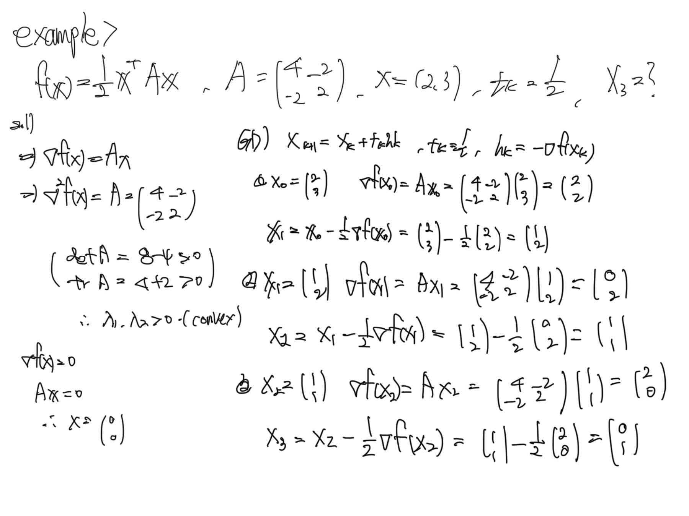
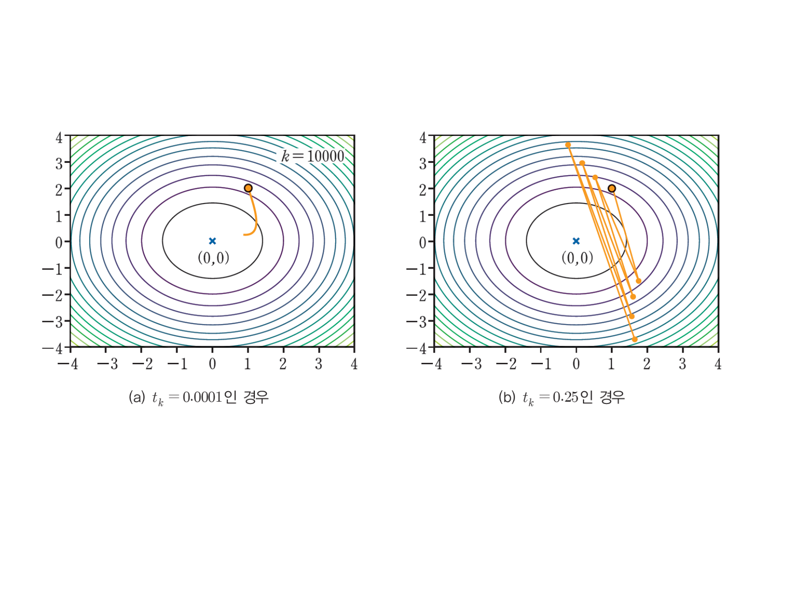
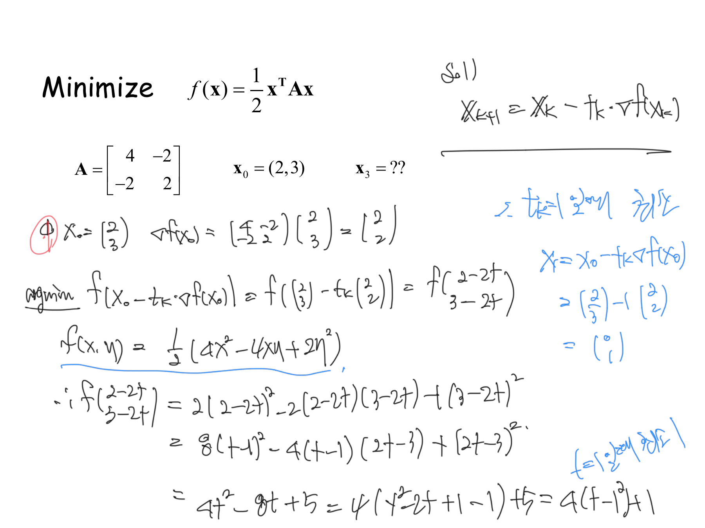
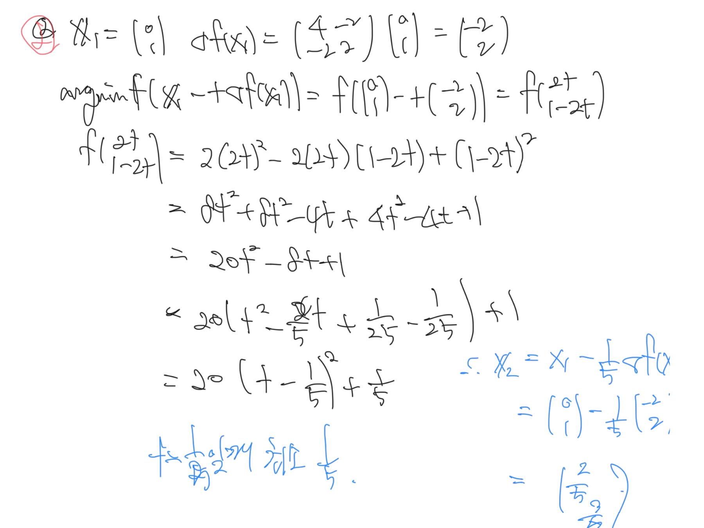
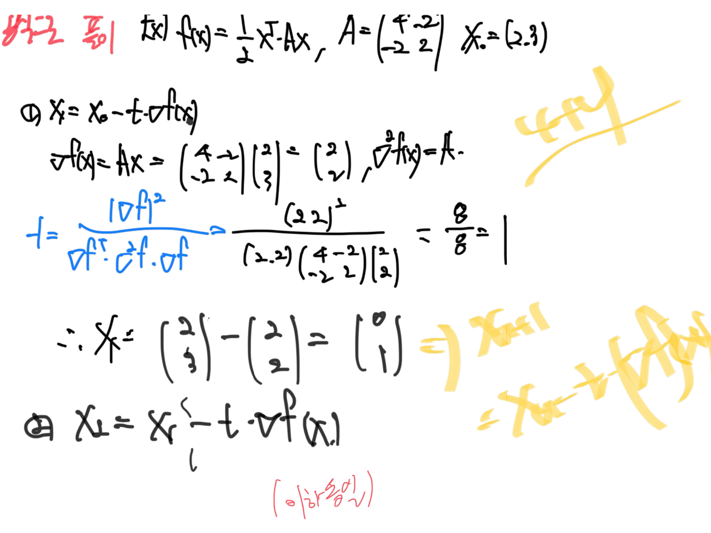
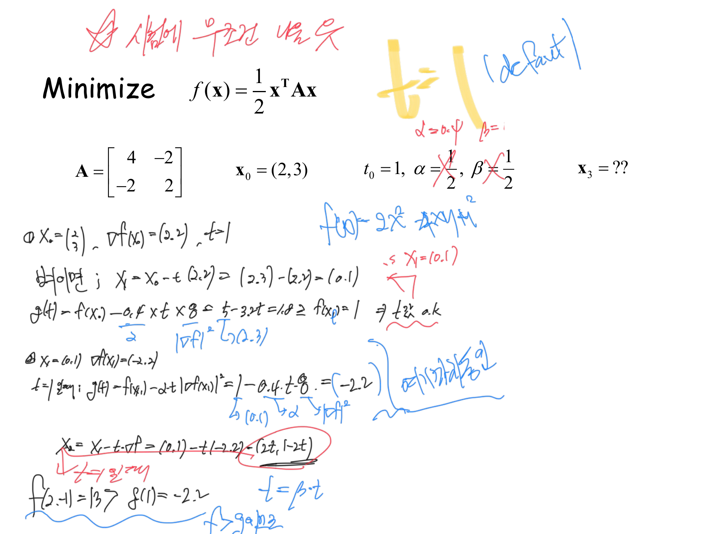
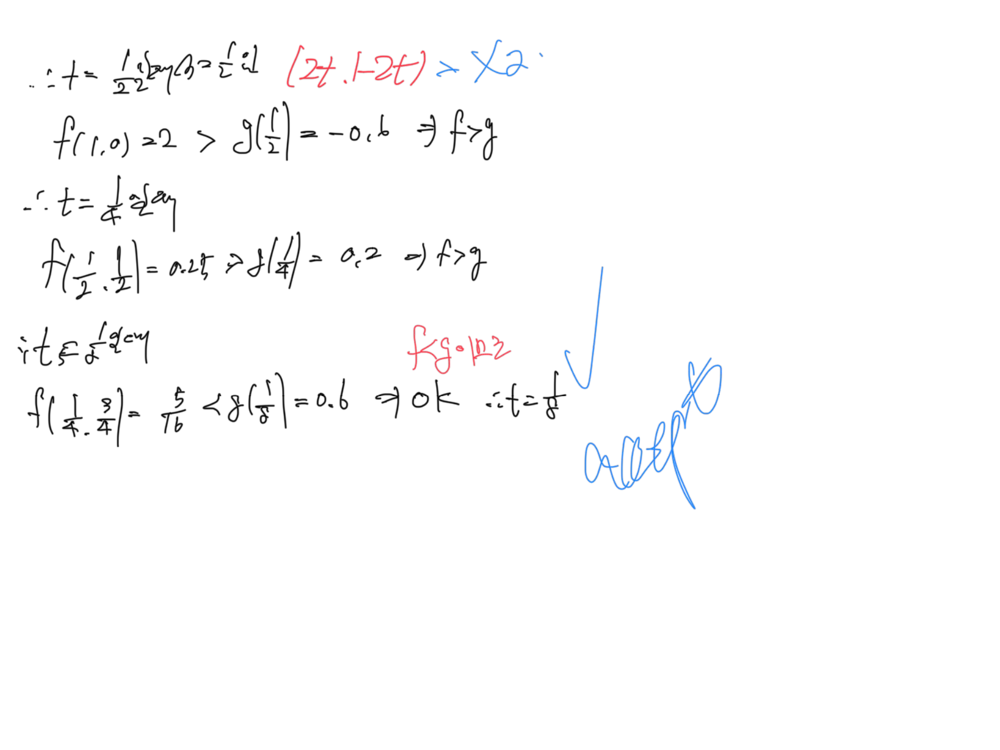
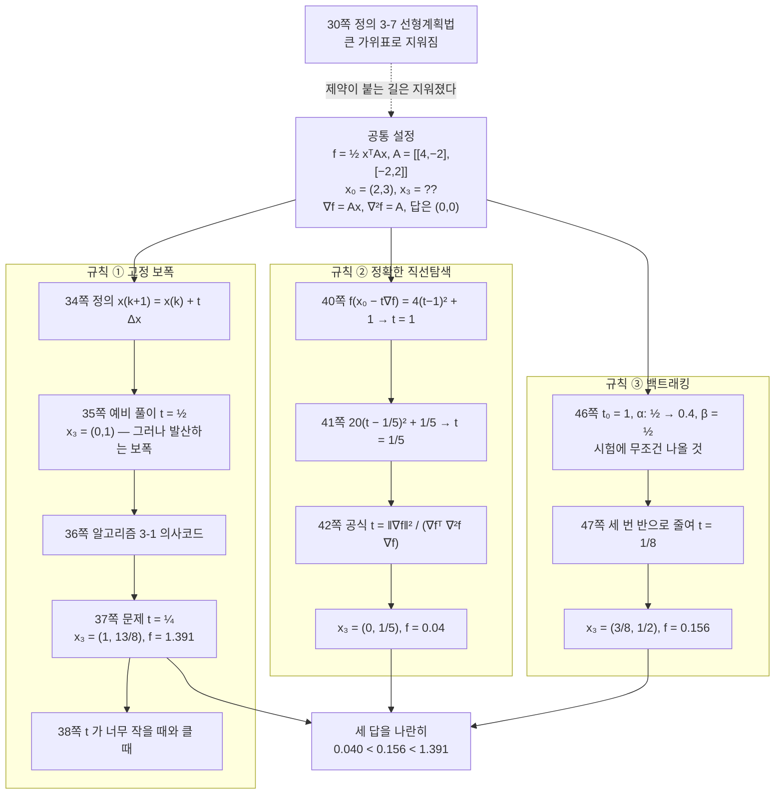
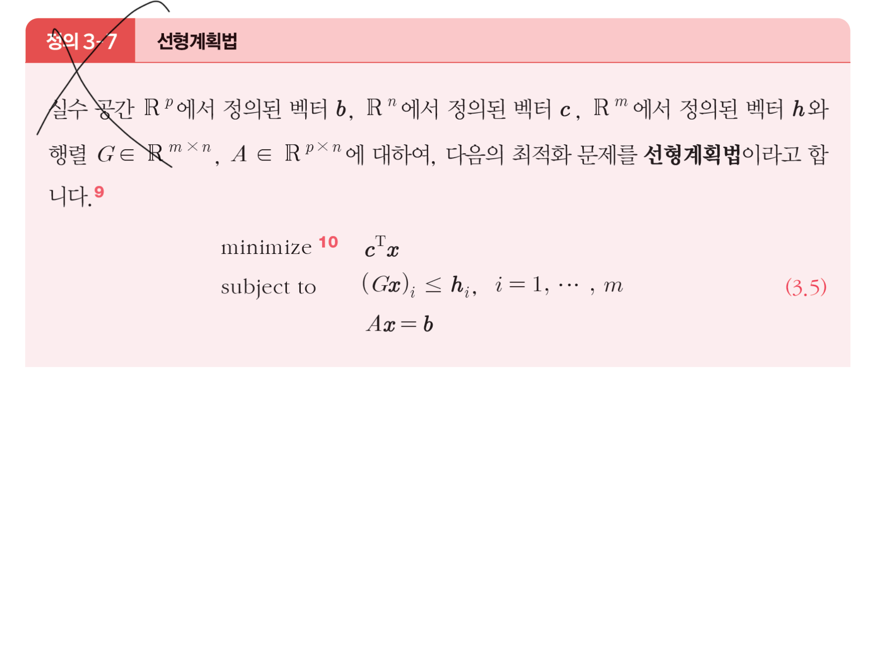

> [!abstract] 한 문제, 세 번
> 37·40·46쪽을 나란히 놓으면 세 장이 거의 같은 글자로 채워져 있다.
>
> $$\text{Minimize}\quad f(\mathbf{x})=\frac12\mathbf{x}^T\!A\mathbf{x},\qquad A=\begin{pmatrix}4&-2\\-2&2\end{pmatrix},\qquad \mathbf{x}_0=(2,3),\qquad \mathbf{x}_3=\ ??$$
>
> | 쪽 | 다른 것 | 절 이름 |
> | --- | --- | --- |
> | 37 | $t_k=\dfrac14$ 로 **고정** | Gradient Descent Method |
> | 40 | $t_k$ 를 **매번 최적으로** | Exact line search method |
> | 46 | $t_0=1$ 에서 **줄여 가며** ($\alpha$, $\beta$) | Backtracking line search method |
>
> 함수도 출발점도 걸음 수도 같다. **바뀌는 것은 보폭 규칙 하나뿐이고, 그것이 실험 설계다.** 세 답을 비교하는 것이 이 구간의 전부다.

---

## 왜 하필 이 $A$ 인가

$A=\begin{pmatrix}4&-2\\-2&2\end{pmatrix}$ 는 임의로 고른 행렬이 아니다. 1장과 2장이 준비한 조건을 전부 만족하는 최소한의 예다.

**① 대칭이다** — $A=A^T$ 이므로 1장 `Def. 1-27`의 첫 조건을 통과하고, 고윳값이 실수이며 직교 대각화된다.

**② 양의 정부호다** — $\det A=8-4=4>0$, $\mathrm{tr}\,A=4+2=6>0$ 이므로 두 고윳값이 모두 양수다. 35쪽 손글씨가 정확히 이 두 수를 계산해 놓았다.

$$\lambda=\frac{6\pm\sqrt{36-16}}{2}=3\pm\sqrt5\quad\Longrightarrow\quad \lambda_{\min}=3-\sqrt5\approx0.7639,\qquad \lambda_{\max}=3+\sqrt5\approx5.2361$$

**③ 따라서 볼록이다** — 1장 `Theorem 1-21`이 $Q(\mathbf{x})=\mathbf{x}^TA\mathbf{x}$ 를 볼록함수라고 보장한다([03](./03.%20잉크가%20끊겼다%20되살아나는%20자리.md)). 3장 `정리 3-2`로 말하면 $\nabla^2f=A\succ0$ 이다([07](./07.%20볼록%20하나를%20다섯%20번%20다시%20쓴다.md)).

**④ 기울기와 헤세가 즉시 나온다** — 2장 50쪽이 적어 둔 대로 대칭 이차형식의 도함수는

$$f(\mathbf{x})=\frac12\mathbf{x}^TA\mathbf{x}\ \Longrightarrow\ \nabla f(\mathbf{x})=A\mathbf{x},\qquad \nabla^2f(\mathbf{x})=A$$

**⑤ 답을 이미 안다** — $\nabla f=\mathbf{0}$ 이면 $A\mathbf{x}=\mathbf{0}$ 이고 $A$ 가 가역이므로 $\mathbf{x}^*=(0,0)$, $f^*=0$. 세 방법이 **어디로 가야 하는지가 처음부터 정해져 있다.** 그래서 「누가 더 가까이 갔는가」를 잴 수 있다.

전개하면 다루기도 쉽다.

$$f(x,y)=\frac12(4x^2-4xy+2y^2)=2x^2-2xy+y^2,\qquad f(2,3)=8-12+9=5$$

---

## 35쪽 — 슬라이드보다 먼저 온 손글씨

34쪽이 경사하강법을 정의한다.

$$\mathbf{x}_{k+1}=\mathbf{x}_k+t_k\Delta\mathbf{x}_k,\qquad \Delta\mathbf{x}_k=-\nabla f(\mathbf{x}_k)$$

그런데 문제 슬라이드(37쪽)가 나오기 전에, 35쪽 빈 장에 검은 펜으로 **예비 풀이 한 벌**이 먼저 적혀 있다.



이 예비 풀이는 **$t_k=\frac12$** 을 쓴다. 37쪽 슬라이드가 지시하는 $\frac14$ 이 아니다.

$$\nabla f(\mathbf{x}_0)=A\begin{pmatrix}2\\3\end{pmatrix}=\begin{pmatrix}8-6\\-4+6\end{pmatrix}=\begin{pmatrix}2\\2\end{pmatrix}$$

$$\mathbf{x}_1=\begin{pmatrix}2\\3\end{pmatrix}-\frac12\begin{pmatrix}2\\2\end{pmatrix}=\begin{pmatrix}1\\2\end{pmatrix},\quad \mathbf{x}_2=\begin{pmatrix}1\\2\end{pmatrix}-\frac12\begin{pmatrix}0\\2\end{pmatrix}=\begin{pmatrix}1\\1\end{pmatrix},\quad \mathbf{x}_3=\begin{pmatrix}1\\1\end{pmatrix}-\frac12\begin{pmatrix}2\\0\end{pmatrix}=\begin{pmatrix}0\\1\end{pmatrix}$$

세 걸음 만에 $f$ 가 $5\to2\to1\to1$ 로 줄었다. 잘 되는 것처럼 보인다.

> [!caution] 원본의 함정 ⑪ — $t=\frac12$ 은 수렴하지 않는 보폭이다
> $f(\mathbf{x})=\frac12\mathbf{x}^TA\mathbf{x}$ 에 고정 보폭 $t$ 를 쓰면 반복식이 정확히 선형이 된다.
>
> $$\mathbf{x}_{k+1}=\mathbf{x}_k-tA\mathbf{x}_k=(I-tA)\mathbf{x}_k$$
>
> 수렴 조건은 $I-tA$ 의 모든 고윳값의 절댓값이 1보다 작은 것, 즉 모든 $i$ 에 대해 $|1-t\lambda_i|<1$ 이고 이는
>
> $$0<t<\frac{2}{\lambda_{\max}}=\frac{2}{3+\sqrt5}=\frac{3-\sqrt5}{2}\approx0.38197$$
>
> 로 정리된다. **$t=\frac12$ 은 이 한계를 넘는다.** 실제로
>
> $$1-\tfrac12\lambda_{\max}=1-\tfrac{3+\sqrt5}{2}=-\frac{1+\sqrt5}{2}=-\varphi\approx-1.618$$
>
> 증폭률이 **음의 황금비**다. 그래서 반복은 부호를 뒤집으며 1.618배씩 커진다.
>
> 세 걸음까지 그 사실이 보이지 않는 이유는 출발점 때문이다. $\mathbf{x}_0=(2,3)$ 을 $A$ 의 고유벡터로 분해하면 $\lambda_{\max}$ 방향 성분이 $-0.124$ 로 아주 작다. 위험한 성분이 거의 없는 상태로 출발했으므로 초반에는 $\lambda_{\min}$ 방향의 얌전한 수축만 보인다. 그러나 작은 성분도 1.618배씩 자라므로 결국 이긴다.
>
> | $k$ | 3 | 5 | 8 | 11 | 14 | 16 |
> | --- | --- | --- | --- | --- | --- | --- |
> | $f(\mathbf{x}_k)$ | 1 | 5 | 89 | 1,597 | 28,657 | 196,418 |
>
> 다섯 걸음째에 이미 출발점 $f=5$ 로 되돌아왔고, 그다음부터 폭발한다. 그리고 저 수들은 **피보나치 수**다. $I-\frac12A=\begin{pmatrix}-1&1\\1&0\end{pmatrix}$ 의 반복이 곧 $x_{k+1}=-x_k+y_k$, $y_{k+1}=x_k$ 라는 부호 붙은 피보나치 점화식이고, 증폭률이 $-\varphi$ 이기 때문이다. $\mathbf{x}_{16}=(233,-144)$ — $F_{13}$ 과 $F_{12}$ 다.
>
> 37쪽 슬라이드가 지시하는 $t=\frac14$ 은 $0.25<0.38197$ 이라 **안전하다.** 즉 35쪽 예비 풀이와 37쪽 문제의 차이는 단순한 숫자 차이가 아니라 **수렴과 발산의 차이**다. 원본은 이 점을 언급하지 않는다.

36쪽 `알고리즘 3-1`이 의사코드로 절차를 못 박는다 — 정지 조건은 $\lVert\mathbf{x}_{k+1}-\mathbf{x}_k\rVert_2<\epsilon$ 이다. 걸음이 충분히 짧아지면 멈춘다는 뜻인데, 발산하는 보폭에서는 이 조건이 **영원히 성립하지 않는다.**

### 보폭 하나가 수렴과 발산을 가른다

```html preview
<div id="st-root">
  <style>
    #st-root{font-family:system-ui,-apple-system,"Segoe UI",sans-serif;color:var(--foreground);padding:4px}
    #st-root .panel{background:var(--card);border:1px solid var(--border);border-radius:10px;padding:14px}
    #st-root .row{display:flex;gap:10px;align-items:center;font-size:13px;margin-bottom:8px;flex-wrap:wrap}
    #st-root input[type=range]{flex:1;accent-color:var(--chart-1);min-width:130px}
    #st-root button{background:var(--card);color:var(--foreground);border:1px solid var(--border);border-radius:5px;padding:4px 9px;font:inherit;font-size:12px;cursor:pointer;margin-right:5px}
    #st-root .stage{display:flex;justify-content:center;gap:10px;flex-wrap:wrap}
    #st-root .out{margin-top:10px;padding:10px 12px;border:1px solid var(--border);border-radius:7px;font-size:13px;line-height:1.75}
    #st-root .good{border-color:var(--chart-2);background:color-mix(in srgb,var(--chart-2) 11%,transparent)}
    #st-root .bad{border-color:var(--chart-5);background:color-mix(in srgb,var(--chart-5) 12%,transparent)}
    #st-root code{font-family:ui-monospace,SFMono-Regular,Menlo,monospace}
    #st-root .cap{text-align:center;font-size:11px;opacity:.7;margin-top:3px}
  </style>
  <div class="panel">
    <div class="row"><span style="opacity:.72">보폭 t</span><input type="range" id="t" min="2" max="70" value="25"><b id="tv" style="width:52px;text-align:right">0.250</b></div>
    <div class="row">
      <button data-t="25">37쪽 t = 1/4</button>
      <button data-t="50">35쪽 t = 1/2</button>
      <button data-t="38">한계 근처 0.38</button>
      <button data-t="4">아주 작게 0.04</button>
    </div>
    <div class="stage">
      <div><svg id="st-map" width="285" height="285" viewBox="0 0 285 285" role="img" aria-label="등고선 위의 반복 궤적"></svg><div class="cap">궤적 (16걸음)</div></div>
      <div><svg id="st-plot" width="270" height="285" viewBox="0 0 270 285" style="max-width:100%" role="img" aria-label="f 값의 변화"></svg><div class="cap">f(x_k) — 세로는 로그 눈금</div></div>
    </div>
    <div class="out" id="st-out"></div>
  </div>
</div>
<script>
(function(){
  var R=document.getElementById('st-root');
  var A=[[4,-2],[-2,2]];
  function mv(x){return [A[0][0]*x[0]+A[0][1]*x[1], A[1][0]*x[0]+A[1][1]*x[1]];}
  function f(x){var g=mv(x);return 0.5*(x[0]*g[0]+x[1]*g[1]);}
  var LMAX=3+Math.sqrt(5), LIM=2/LMAX;
  function draw(){
    var t=+R.querySelector('#t').value/100;
    R.querySelector('#tv').textContent=t.toFixed(3);
    var xs=[[2,3]];
    for(var k=0;k<16;k++){var g=mv(xs[k]);xs.push([xs[k][0]-t*g[0], xs[k][1]-t*g[1]]);}
    var m=4.6,S=285/(2*m),OX=142.5,OY=142.5;
    function X(v){return OX+v*S;} function Y(v){return OY-v*S;}
    var g1='';
    var N=100,cell=285/N,vals=[];
    for(var i=0;i<N;i++){vals.push([]);for(var j=0;j<N;j++){
      var xx=(i*cell-OX)/S, yy=(OY-j*cell)/S; vals[i].push(f([xx,yy]));}}
    [0.5,2,5,10,20,35].forEach(function(L){
      var p='';
      for(var i=0;i<N-1;i++)for(var j=0;j<N-1;j++){
        var v0=vals[i][j];
        if((v0-L)*(vals[i+1][j]-L)<0) p+='M'+(i*cell+cell/2).toFixed(1)+','+(j*cell).toFixed(1)+'l0,'+cell.toFixed(1);
        if((v0-L)*(vals[i][j+1]-L)<0) p+='M'+(i*cell).toFixed(1)+','+(j*cell+cell/2).toFixed(1)+'l'+cell.toFixed(1)+',0';
      }
      g1+='<path d="'+p+'" stroke="var(--chart-4)" stroke-width="1" fill="none" opacity=".6"/>';
    });
    g1+='<line x1="'+X(-m)+'" y1="'+Y(0)+'" x2="'+X(m)+'" y2="'+Y(0)+'" stroke="var(--border)"/>';
    g1+='<line x1="'+X(0)+'" y1="'+Y(-m)+'" x2="'+X(0)+'" y2="'+Y(m)+'" stroke="var(--border)"/>';
    var path='';
    xs.forEach(function(p,i){
      var cx=Math.max(-m,Math.min(m,p[0])), cy=Math.max(-m,Math.min(m,p[1]));
      path+=(i?'L':'M')+X(cx).toFixed(1)+','+Y(cy).toFixed(1);});
    g1+='<path d="'+path+'" stroke="var(--chart-1)" stroke-width="1.9" fill="none" opacity=".9"/>';
    xs.forEach(function(p,i){
      if(Math.abs(p[0])>m||Math.abs(p[1])>m) return;
      g1+='<circle cx="'+X(p[0])+'" cy="'+Y(p[1])+'" r="'+(i===0?4.2:(i<=3?3.2:2))+'" fill="var(--chart-'+(i===0?'2':'1')+')"/>';});
    g1+='<circle cx="'+X(0)+'" cy="'+Y(0)+'" r="3.4" fill="var(--chart-3)"/>';
    R.querySelector('#st-map').innerHTML=g1;
    var W=270,Hh=285,L2=40,T=14,B=26;
    var fs=xs.map(f), lo=-3, hi=Math.max(2, Math.log10(Math.max.apply(null,fs)||1)+0.4);
    function PX(i){return L2+i/16*(W-L2-12);}
    function PY(v){var l=Math.log10(Math.max(v,1e-4));return T+(hi-l)/(hi-lo)*(Hh-T-B);}
    var g2='';
    for(var e=Math.ceil(lo);e<=Math.floor(hi);e++){
      g2+='<line x1="'+L2+'" y1="'+PY(Math.pow(10,e))+'" x2="'+(W-12)+'" y2="'+PY(Math.pow(10,e))+'" stroke="var(--border)" stroke-width="0.6"/>'+
          '<text x="'+(L2-5)+'" y="'+(PY(Math.pow(10,e))+4)+'" font-size="9.5" text-anchor="end" opacity=".65" fill="var(--foreground)">1e'+e+'</text>';
    }
    g2+='<line x1="'+L2+'" y1="'+PY(5)+'" x2="'+(W-12)+'" y2="'+PY(5)+'" stroke="var(--chart-5)" stroke-width="1.1" stroke-dasharray="5 4"/>';
    g2+='<text x="'+(W-13)+'" y="'+(PY(5)-4)+'" font-size="9.5" text-anchor="end" fill="var(--chart-5)">출발값 5</text>';
    var p2='';
    fs.forEach(function(v,i){p2+=(i?'L':'M')+PX(i).toFixed(1)+','+PY(v).toFixed(1);});
    g2+='<path d="'+p2+'" stroke="var(--chart-1)" stroke-width="2.2" fill="none"/>';
    fs.forEach(function(v,i){g2+='<circle cx="'+PX(i)+'" cy="'+PY(v)+'" r="2.4" fill="var(--chart-1)"/>';});
    g2+='<text x="'+L2+'" y="'+(Hh-8)+'" font-size="10" opacity=".65" fill="var(--foreground)">k = 0</text>';
    g2+='<text x="'+(W-12)+'" y="'+(Hh-8)+'" font-size="10" text-anchor="end" opacity=".65" fill="var(--foreground)">16</text>';
    R.querySelector('#st-plot').innerHTML=g2;
    var amp=Math.max(Math.abs(1-t*LMAX),Math.abs(1-t*(3-Math.sqrt(5))));
    var o=R.querySelector('#st-out');
    var h='<code>|1 − t·λ_max| = '+Math.abs(1-t*LMAX).toFixed(4)+'</code> &nbsp; (수렴 한계 t &lt; 2/λ_max = <b>'+LIM.toFixed(5)+'</b>)<br>';
    h+='f(x₃) = <b>'+fs[3].toFixed(4)+'</b>, &nbsp; f(x₁₆) = <b>'+(fs[16]>1e4?fs[16].toExponential(3):fs[16].toFixed(4))+'</b><br>';
    if(amp<1){
      o.className='out good';
      h+='<b>수렴한다.</b> 매 걸음 최대 '+amp.toFixed(3)+'배로 줄어든다. '+(t<0.08?'다만 보폭이 너무 작아 기어간다 — 38쪽 그림 (a)의 상태다.':'');
    }else{
      o.className='out bad';
      h+='<b>발산한다.</b> '+Math.abs(1-t*LMAX).toFixed(3)+'배씩 커지는 방향이 있다. ';
      if(Math.abs(t-0.5)<0.006) h+='t = ½ 에서 증폭률은 정확히 <b>−φ = −1.618…</b>(음의 황금비)이고, 그래서 성분이 <b>피보나치 수</b>를 따라간다 — x₁₆ = (233, −144).';
      h+='<br>초반 세 걸음만 보면 잘 줄어드는 것처럼 보이는 것이 함정이다.';
    }
    h+='<br><span style="opacity:.75">왼쪽 큰 점이 출발점 (2,3), 가운데 점이 최솟점 (0,0)이다.</span>';
    o.innerHTML=h;
  }
  R.addEventListener('input',draw);
  R.addEventListener('click',function(e){if(e.target.dataset.t){R.querySelector('#t').value=e.target.dataset.t;draw();}});
  draw();
})();
</script>
```

`35쪽 t = 1/2` 를 누르면 처음 세 점은 안쪽으로 들어가다가 네 걸음째부터 바깥으로 튕겨 나간다. `37쪽 t = 1/4` 는 지그재그를 그리며 꾸준히 수축한다.

38쪽이 교재에서 가져온 그림으로 양 극단을 보여 준다.



왼쪽은 $k=10000$ 이라고 적혀 있는데도 등고선 한두 개밖에 못 건넜다. 오른쪽은 격렬하게 진동한다. **보폭 하나가 「못 간다」와 「튕겨 나간다」 사이에 있다**는 것이 이 그림의 요점이다.

> [!note] 38쪽 그림의 함수는 이 장의 $A$ 가 아니다 — 보충
> 그림 (b)의 캡션은 $t_k=0.25$ 인데, 37쪽 슬라이드의 $A$ 에 $t=0.25$ 를 쓰면 위 인터랙티브가 보여 주듯 **얌전히 수렴한다.** 그림이 크게 진동하는 것은 교재가 다른 함수(더 큰 $\lambda_{\max}$)를 쓰기 때문이다. 원본은 그 함수를 밝히지 않는다.
>
> 즉 이 그림은 「$0.25$ 라는 숫자가 크다」가 아니라 **「같은 숫자도 함수의 곡률에 따라 크기도 하고 작기도 하다」**로 읽어야 한다. 기준은 언제나 $2/\lambda_{\max}$ 라는 상대적 한계다.

---

## 40~42쪽 — 매 걸음 최선의 보폭을 계산한다

39쪽이 `Exact line search method` 를 이름만 걸고, 40쪽이 같은 문제를 $t_k$ 지정 없이 다시 낸다. 그리고 손글씨가 시작된다.



핵심은 **보폭을 1변수 최소화 문제로 바꾸는 것**이다.

$$\mathbf{x}_0-t\nabla f(\mathbf{x}_0)=\begin{pmatrix}2\\3\end{pmatrix}-t\begin{pmatrix}2\\2\end{pmatrix}=\begin{pmatrix}2-2t\\3-2t\end{pmatrix}$$

$$f(2-2t,\ 3-2t)=2(2-2t)^2-2(2-2t)(3-2t)+(3-2t)^2=4t^2-8t+5$$

완전제곱으로 정리하면 최솟점이 바로 읽힌다.

$$4t^2-8t+5=4(t^2-2t+1)-4+5=4(t-1)^2+1\ \Longrightarrow\ t=1\ \textsf{일 때 최소}$$

$$\mathbf{x}_1=\begin{pmatrix}2\\3\end{pmatrix}-1\cdot\begin{pmatrix}2\\2\end{pmatrix}=\begin{pmatrix}0\\1\end{pmatrix}$$

41쪽이 둘째 걸음을 같은 방식으로 간다.



$$f(2t,\ 1-2t)=20t^2-8t+1=20\Bigl(t-\frac15\Bigr)^2+\frac15\ \Longrightarrow\ t=\frac15,\quad \mathbf{x}_2=\begin{pmatrix}2/5\\3/5\end{pmatrix}$$

42쪽이 매번 완전제곱을 하는 대신 쓸 수 있는 **공식**을 준다.



$$t=\frac{\lVert\nabla f\rVert^2}{\nabla f^T\,\nabla^2f\,\nabla f}=\frac{(2,2)\cdot(2,2)}{(2,2)\,A\,(2,2)^T}=\frac{8}{8}=1$$

이 공식이 나오는 이유는 간단하다. $\mathbf{g}=\nabla f(\mathbf{x})$ 라 하면

$$f(\mathbf{x}-t\mathbf{g})=f(\mathbf{x})-t\,\mathbf{g}^T\mathbf{g}+\frac{t^2}{2}\mathbf{g}^TA\mathbf{g}$$

이고 $t$ 로 미분해 0으로 두면 $t^*=\dfrac{\mathbf{g}^T\mathbf{g}}{\mathbf{g}^TA\mathbf{g}}$ 다. 이차함수라 **3차 이상 항이 정확히 0**이므로 근사가 아니라 정확한 값이다 — 2장 51쪽의 2차 테일러 전개에서 $O(\lVert h\rVert^3)$ 항이 사라지는 유일한 경우다([06](./06.%20잉크가%20멈춘%20자리에서%20과제가%20시작된다.md)).

이 공식으로 셋째 걸음을 계산하면 $t=1$ 이 다시 나오고

$$\mathbf{x}_3=\begin{pmatrix}2/5\\3/5\end{pmatrix}-1\cdot\begin{pmatrix}2/5\\2/5\end{pmatrix}=\begin{pmatrix}0\\1/5\end{pmatrix},\qquad f(\mathbf{x}_3)=\frac{1}{25}=0.04$$

$t$ 가 $1,\ \frac15,\ 1$ 로 오간다. 정확한 직선탐색의 특징인데, 연속한 두 걸음의 방향이 **반드시 직교**하기 때문이다 — 직선 위에서 최소인 점에서는 그 직선 방향의 방향도함수가 0이고, 그것이 곧 $\nabla f(\mathbf{x}_{k+1})\perp\mathbf{g}_k$ 다. 그래서 궤적이 직각으로 꺾이는 지그재그가 된다.

---

## 46~47쪽 — 최선 대신 「충분히 좋은」 보폭

44쪽이 `Backtracking line search method` 를 걸고, 46쪽이 세 번째 문제를 낸다.



$$t_0=1,\qquad \alpha=\frac12,\qquad \beta=\frac12$$

붉은 잉크가 페이지 맨 위에 **「시험에 무조건 나올 것」**을 적었다. 그리고 인쇄된 $\alpha=\frac12$ 에 사선을 긋고 **$\alpha=0.4$** 로 고쳐 썼다.

절차는 이렇다. $t=t_0$ 에서 시작해 다음 부등식(아르미호 조건)이 만족될 때까지 $t\leftarrow\beta t$ 로 줄인다.

$$f(\mathbf{x}-t\nabla f)\ \le\ f(\mathbf{x})-\alpha\,t\,\lVert\nabla f\rVert^2$$

우변은 「접선을 따라 내려갔을 때 얻을 이득의 $\alpha$ 배는 실제로 얻어야 한다」는 요구다. $\alpha$ 가 그 욕심의 크기다.

**첫째 걸음** — $\mathbf{x}_0=(2,3)$, $\nabla f=(2,2)$, $\lVert\nabla f\rVert^2=8$, $f(\mathbf{x}_0)=5$.

$t=1$: $\mathbf{x}=(0,1)$, $f=1$. 기준은 $5-0.4\cdot1\cdot8=1.8$. $1\le1.8$ ✓ **통과** — 줄일 필요가 없다.

**둘째 걸음** — $\mathbf{x}_1=(0,1)$, $\nabla f=(-2,2)$, $\lVert\nabla f\rVert^2=8$, $f(\mathbf{x}_1)=1$.



| $t$ | $\mathbf{x}_2$ 후보 | $f$ | 기준 $1-0.4t\cdot8$ | 판정 |
| --- | --- | --- | --- | --- |
| $1$ | $(2,-1)$ | $13$ | $-2.2$ | ✗ |
| $\frac12$ | $(1,0)$ | $2$ | $-0.6$ | ✗ |
| $\frac14$ | $(\frac12,\frac12)$ | $0.25$ | $0.2$ | ✗ |
| $\frac18$ | $(\frac14,\frac34)$ | $\frac{5}{16}=0.3125$ | $0.6$ | **✓** |

세 번 반으로 줄여 $t=\frac18$ 을 얻는다. $\mathbf{x}_2=(\frac14,\frac34)$.

**셋째 걸음** — 같은 방식으로 두 번 줄여 $t=\frac14$, $\mathbf{x}_3=(\frac38,\frac12)$, $f(\mathbf{x}_3)=\frac{5}{32}=0.15625$.

> [!note] 고쳐 적은 $\alpha$ 는 답을 바꾸지 않는다 — 보충
> 인쇄된 $\alpha=\frac12$ 과 손으로 고친 $\alpha=0.4$ 중 어느 쪽을 써도 **세 걸음의 결과가 완전히 같다.** 두 값 다 첫 걸음에서 $t=1$ 을 통과시키고($\alpha=\frac12$ 이면 기준이 정확히 $1$ 이라 등호로 통과), 둘째·셋째 걸음에서 같은 횟수만큼 줄인다. 분수로 계산해 확인했다.
>
> $\alpha=0.4$ 로 고친 것은 첫 걸음의 판정을 **등호가 아닌 부등호**로 만들어 애매함을 없애려는 조정으로 보인다.

---

## 세 답을 나란히

세 방법의 결과다(전부 분수로 정확히 계산했다). 출발값은 $f(\mathbf{x}_0)=5$, 목표는 $f^*=0$ 이다.

| 방법 | $\mathbf{x}_1$ | $\mathbf{x}_2$ | $\mathbf{x}_3$ | $f(\mathbf{x}_3)$ | 걸음당 비용 |
| --- | --- | --- | --- | --- | --- |
| 고정 $t=\frac14$ (37쪽) | $(\frac32,\frac52)$ | $(\frac54,2)$ | $(1,\frac{13}{8})$ | $\frac{89}{64}\approx1.391$ | 기울기 1회 |
| 고정 $t=\frac12$ (35쪽) | $(1,2)$ | $(1,1)$ | $(0,1)$ | $1$ | 기울기 1회 · **발산** |
| 정확한 직선탐색 (40쪽) | $(0,1)$ | $(\frac25,\frac35)$ | $(0,\frac15)$ | $\frac{1}{25}=0.04$ | 1변수 최소화 |
| 백트래킹 (46쪽) | $(0,1)$ | $(\frac14,\frac34)$ | $(\frac38,\frac12)$ | $\frac{5}{32}\approx0.156$ | $f$ 를 1\~4회 |

읽어 낼 것이 셋이다.

**① 정확한 직선탐색이 가장 멀리 간다.** $0.04$ 로 고정 보폭의 35배 가까이 좋다. 매 걸음 그 방향에서 **가능한 최선**을 뽑기 때문이다.

**② 백트래킹이 그 뒤를 바짝 쫓는다.** $0.156$ 은 정확한 탐색의 네 배지만 고정 보폭보다 아홉 배 좋다. 그러면서 1변수 최소화를 풀지 않고 $f$ 를 몇 번 계산해 볼 뿐이다. **이 문제는 이차함수라 최적 $t$ 가 공식으로 나오지만, 일반적인 $f$ 에서는 그 공식이 없다** — 그때 남는 것이 백트래킹이다.

**③ 고정 보폭이 가장 나쁘고, 심지어 위험하다.** $t=\frac14$ 는 안전하지만 느리고, $t=\frac12$ 는 세 걸음만 보면 더 좋아 보이지만 발산한다. **고정 보폭의 진짜 문제는 느린 것이 아니라 $\lambda_{\max}$ 를 미리 알아야 한다는 것**이다.

### 세 궤적을 겹쳐 보기

```html preview
<div id="cm-root">
  <style>
    #cm-root{font-family:system-ui,-apple-system,"Segoe UI",sans-serif;color:var(--foreground);padding:4px}
    #cm-root .panel{background:var(--card);border:1px solid var(--border);border-radius:10px;padding:14px}
    #cm-root .row{display:flex;gap:10px;align-items:center;font-size:13px;margin-bottom:9px}
    #cm-root input[type=range]{flex:1;accent-color:var(--chart-1);min-width:120px}
    #cm-root .stage{display:flex;justify-content:center}
    #cm-root table{border-collapse:collapse;width:100%;font-size:12.5px;margin-top:10px}
    #cm-root th,#cm-root td{border:1px solid var(--border);padding:5px 7px;text-align:right;font-variant-numeric:tabular-nums}
    #cm-root th{text-align:left;font-weight:600;opacity:.85}
    #cm-root td:first-child{text-align:left}
    #cm-root .sw{display:inline-block;width:14px;height:3px;vertical-align:middle;margin-right:6px}
    #cm-root .note{margin-top:9px;font-size:12.5px;opacity:.8;line-height:1.7}
  </style>
  <div class="panel">
    <div class="row"><span style="opacity:.72">걸음 k</span><input type="range" id="k" min="0" max="8" value="3"><b id="kv" style="width:20px;text-align:right">3</b></div>
    <div class="stage"><svg id="cm-svg" width="330" height="330" viewBox="0 0 330 330" style="max-width:100%;height:auto" role="img" aria-label="세 가지 보폭 규칙의 궤적 비교"></svg></div>
    <table id="cm-tab"></table>
    <div class="note" id="cm-note"></div>
  </div>
</div>
<script>
(function(){
  var R=document.getElementById('cm-root');
  var A=[[4,-2],[-2,2]];
  function mv(x){return [A[0][0]*x[0]+A[0][1]*x[1], A[1][0]*x[0]+A[1][1]*x[1]];}
  function f(x){var g=mv(x);return 0.5*(x[0]*g[0]+x[1]*g[1]);}
  function run(kind,K){
    var x=[2,3],out=[x.slice()],ts=[];
    for(var k=0;k<K;k++){
      var g=mv(x),t;
      if(kind==='fix') t=0.25;
      else if(kind==='exact'){var Ag=mv(g);t=(g[0]*g[0]+g[1]*g[1])/(g[0]*Ag[0]+g[1]*Ag[1]);}
      else{t=1;var n2=g[0]*g[0]+g[1]*g[1],f0=f(x),n=0;
        while(f([x[0]-t*g[0],x[1]-t*g[1]])>f0-0.4*t*n2 && n<40){t*=0.5;n++;}}
      ts.push(t); x=[x[0]-t*g[0], x[1]-t*g[1]]; out.push(x.slice());
    }
    return {xs:out,ts:ts};
  }
  var KINDS=[{k:'fix',n:'고정 t = 1/4 (37쪽)',c:'chart-5'},
             {k:'exact',n:'정확한 직선탐색 (40쪽)',c:'chart-2'},
             {k:'back',n:'백트래킹 (46쪽)',c:'chart-1'}];
  function draw(){
    var K=+R.querySelector('#k').value; R.querySelector('#kv').textContent=K;
    var res=KINDS.map(function(o){return run(o.k,8);});
    var m=3.6,S=330/(2*m),OX=165,OY=165;
    function X(v){return OX+v*S;} function Y(v){return OY-v*S;}
    var g='';
    var N=95,cell=330/N,vals=[];
    for(var i=0;i<N;i++){vals.push([]);for(var j=0;j<N;j++){
      var xx=(i*cell-OX)/S, yy=(OY-j*cell)/S; vals[i].push(f([xx,yy]));}}
    [0.2,1,3,6,12,20].forEach(function(L){
      var p='';
      for(var i=0;i<N-1;i++)for(var j=0;j<N-1;j++){
        var v0=vals[i][j];
        if((v0-L)*(vals[i+1][j]-L)<0) p+='M'+(i*cell+cell/2).toFixed(1)+','+(j*cell).toFixed(1)+'l0,'+cell.toFixed(1);
        if((v0-L)*(vals[i][j+1]-L)<0) p+='M'+(i*cell).toFixed(1)+','+(j*cell+cell/2).toFixed(1)+'l'+cell.toFixed(1)+',0';
      }
      g+='<path d="'+p+'" stroke="var(--chart-4)" stroke-width="1" fill="none" opacity=".5"/>';
    });
    g+='<line x1="0" y1="'+Y(0)+'" x2="330" y2="'+Y(0)+'" stroke="var(--border)"/>';
    g+='<line x1="'+X(0)+'" y1="0" x2="'+X(0)+'" y2="330" stroke="var(--border)"/>';
    res.forEach(function(r,idx){
      var pts=r.xs.slice(0,K+1),p='';
      pts.forEach(function(q,i){p+=(i?'L':'M')+X(q[0]).toFixed(1)+','+Y(q[1]).toFixed(1);});
      g+='<path d="'+p+'" stroke="var(--'+KINDS[idx].c+')" stroke-width="2.2" fill="none"/>';
      pts.forEach(function(q,i){g+='<circle cx="'+X(q[0])+'" cy="'+Y(q[1])+'" r="'+(i===K?4:2.6)+'" fill="var(--'+KINDS[idx].c+')"/>';});
    });
    g+='<circle cx="'+X(2)+'" cy="'+Y(3)+'" r="5" fill="none" stroke="var(--foreground)" stroke-width="1.6"/>';
    g+='<text x="'+(X(2)+8)+'" y="'+(Y(3)-6)+'" font-size="10.5" fill="var(--foreground)">x₀</text>';
    g+='<circle cx="'+X(0)+'" cy="'+Y(0)+'" r="4" fill="var(--chart-3)"/>';
    g+='<text x="'+(X(0)+8)+'" y="'+(Y(0)+14)+'" font-size="10.5" fill="var(--chart-3)">x* = (0,0)</text>';
    R.querySelector('#cm-svg').innerHTML=g;
    var h='<tr><th>방법</th><th>x_'+K+'</th><th>f(x_'+K+')</th><th>이번 보폭</th></tr>';
    res.forEach(function(r,i){
      var q=r.xs[K];
      h+='<tr><td><i class="sw" style="background:var(--'+KINDS[i].c+')"></i>'+KINDS[i].n+'</td>'+
         '<td>('+q[0].toFixed(3)+', '+q[1].toFixed(3)+')</td>'+
         '<td>'+f(q).toFixed(5)+'</td>'+
         '<td>'+(K===0?'—':r.ts[K-1].toFixed(4))+'</td></tr>';
    });
    R.querySelector('#cm-tab').innerHTML=h;
    var nt='';
    if(K===3) nt='<b>k = 3 이 원본이 묻는 지점이다.</b> 세 슬라이드가 전부 x₃ 를 요구한다 — f 값이 각각 1.391 / 0.040 / 0.156 이다.';
    else if(K===0) nt='출발점은 셋 다 (2, 3) 이고 f = 5 다.';
    else nt='정확한 직선탐색의 궤적이 <b>매번 직각으로 꺾이는 것</b>에 주목할 만하다 — 직선 위에서 최소인 점에서는 그 방향의 기울기가 0이므로 다음 기울기가 직전 방향과 직교한다.';
    R.querySelector('#cm-note').innerHTML=nt;
  }
  R.addEventListener('input',draw); draw();
})();
</script>
```

---

## 20~47쪽의 구조



30쪽 `정의 3-7 선형계획법`이 **큰 가위표로 지워져 있다**는 점이 이 구조를 거들어 준다. 제약이 있는 최적화(선형계획법)로 가는 갈래를 잘라 내고, 제약 없는 최소화 한 줄기에만 세 방법을 붙인 것이다.



---

## 다음으로

47쪽까지가 「어떻게 내려가는가」다. 48쪽부터 갑자기 데이터가 등장한다 — 선형 회귀와 다변량 분석이고, 그 최소제곱 문제가 바로 이 장에서 다룬 $\frac12\mathbf{x}^TA\mathbf{x}$ 와 같은 얼굴임이 드러난다.

- [07. 볼록 하나를 다섯 번 다시 쓴다](./07.%20볼록%20하나를%20다섯%20번%20다시%20쓴다.md) — 1~19쪽. $\nabla f=0$ 이 왜 답인지
- [09. 최적화가 데이터로 내려앉는 자리](./09.%20최적화가%20데이터로%20내려앉는%20자리.md) — 48~60쪽
- [03. 잉크가 끊겼다 되살아나는 자리](./03.%20잉크가%20끊겼다%20되살아나는%20자리.md) — 이 $A$ 가 만족하는 조건들이 만들어진 곳

---

## 근거 자료

| 쪽 | 인쇄된 것 | 잉크 |
| --- | --- | --- |
| 20–29 | (볼록 최적화 문제의 형태들) | 거의 없음 |
| **30** | `정의 3-7` 선형계획법 | **전체에 큰 가위표** |
| 31–33 | (최적화 문제 분류) | — |
| 34 | `Gradient Descent Method` $\mathbf{x}_{k+1}=\mathbf{x}_k+t_k\Delta\mathbf{x}_k$ | — |
| **35** | (백지 슬라이드) | **`example)` 예비 풀이 전체** — $\nabla f=A\mathbf{x}$, $\nabla^2f=A$, $\det A=8-4>0$·$\mathrm{tr}\,A=4+2>0$ ⇒ convex, $\nabla f=0\Rightarrow\mathbf{x}=(0,0)$, **$t_k=\frac12$ 로 세 걸음** |
| 36 | `알고리즘 3-1` 의사코드, 정지 조건 $\lVert\mathbf{x}_{k+1}-\mathbf{x}_k\rVert_2<\epsilon$ | — |
| **37** | 문제: $A$, $\mathbf{x}_0=(2,3)$, $t_k=\frac14$, $\mathbf{x}_3=??$ | 「$f(x)$가 convex 인지」·「$\nabla^2f\ge0$ 인지 확인」, `Sol)` 과 $\mathbf{x}_{n+1}=\mathbf{x}_n-t_k\nabla f(\mathbf{x}_n)$ |
| **38** | 교재 그림 — (a) $t_k=0.0001$, $k=10000$ (b) $t_k=0.25$ | — |
| 39 | `Exact line search method` | — |
| **40** | 문제: 같은 $A$·$\mathbf{x}_0$, $t$ 지정 없음 | $\nabla f(\mathbf{x}_0)=(2,2)$, $f(x,y)=\frac12(4x^2-4xy+2y^2)$, **$4t^2-8t+5=4(t-1)^2+1$**, $t=1$, $\mathbf{x}_1=(0,1)$ |
| **41** | (백지) | $\nabla f(\mathbf{x}_1)=(-2,2)$, **$20t^2-8t+1=20(t-\frac15)^2+\frac15$**, $t=\frac15$, $\mathbf{x}_2=(\frac25,\frac35)$ |
| **42** | (백지) | **$t=\dfrac{\lVert\nabla f\rVert^2}{\nabla f^T\nabla^2f\nabla f}=\dfrac{8}{8}=1$** |
| 44 | `Backtracking line search method` | — |
| **46** | 문제: 같은 $A$·$\mathbf{x}_0$, $t_0=1$, $\alpha=\frac12$, $\beta=\frac12$ | **「시험에 무조건 나올 것」**, **$\alpha=\frac12$ 에 사선 + $\alpha=0.4$**, 첫 걸음 $5-3.2t=1.8\ge f(\mathbf{x}_1)=1$ ⇒ `t값 o.k` |
| **47** | (백지) | $t=\frac12$: $f(1,0)=2>-0.6$ ✗ / $t=\frac14$: $f(\frac12,\frac12)=0.25>0.2$ ✗ / $t=\frac18$: $f(\frac14,\frac34)=\frac{5}{16}<0.6$ ✓ |

추출 번들: `.ok/local/pdf-extract/02_math-theory__optimization-math__MSC087_3장_볼록최적화/`
(이 구간에서 `page_chars` 가 0이 아닌 것은 34(45자)·37(51자)·39(21자)·40(46자)·44(28자)·46(60자)쪽 — 전부 인쇄된 제목과 문제 설정이다. 35·38·41·42·43·45·47쪽은 0자이면서 손글씨나 그림이 들어 있다.)

수치 검증: 네 가지 보폭 규칙의 세 걸음을 **파이썬 분수(`Fraction`) 연산**으로 계산해 손글씨와 전부 대조했다 — 고정 $\frac14$ 은 $(1,\frac{13}{8})$·$f=\frac{89}{64}$, 고정 $\frac12$ 은 $(0,1)$·$f=1$, 정확한 직선탐색은 $t=1,\frac15,1$ 로 $(0,\frac15)$·$f=\frac{1}{25}$, 백트래킹($\alpha=0.4$ 와 $\alpha=0.5$ 양쪽 다)은 $t=1,\frac18,\frac14$ 로 $(\frac38,\frac12)$·$f=\frac{5}{32}$. 고윳값 $3\pm\sqrt5$, 수렴 한계 $\frac{2}{3+\sqrt5}=\frac{3-\sqrt5}{2}\approx0.38197$, $t=\frac12$ 에서의 증폭률 $-\frac{1+\sqrt5}{2}=-\varphi$, 그리고 16걸음까지의 발산(피보나치 $\mathbf{x}_{16}=(233,-144)$)도 직접 반복해 확인했다.
