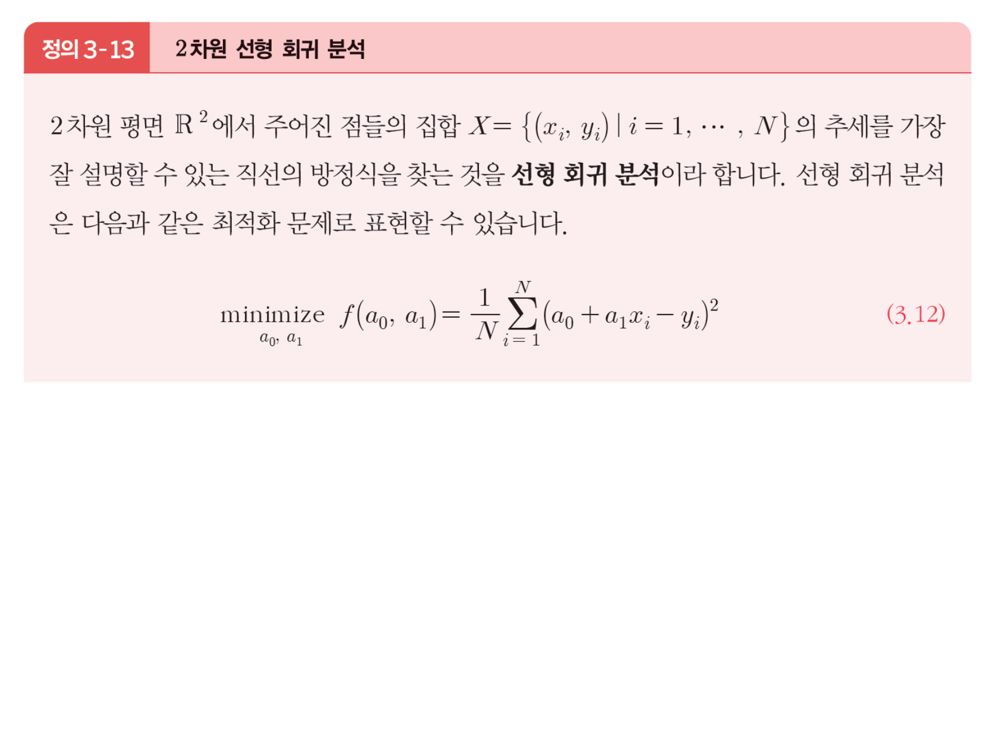
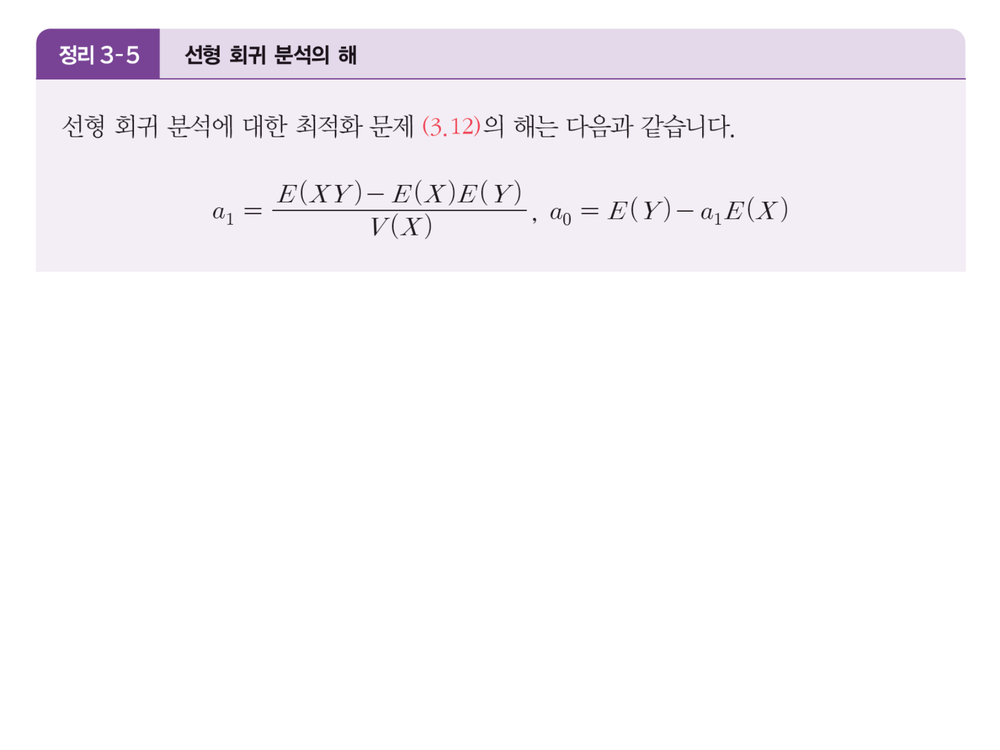
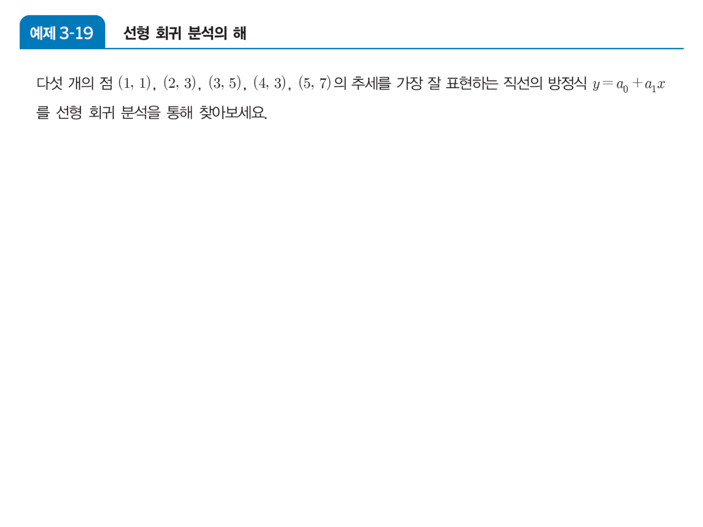
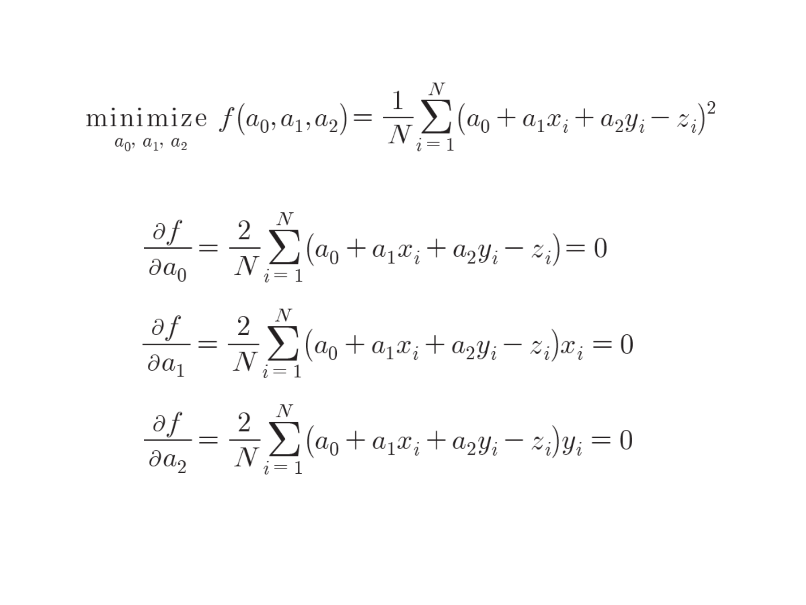
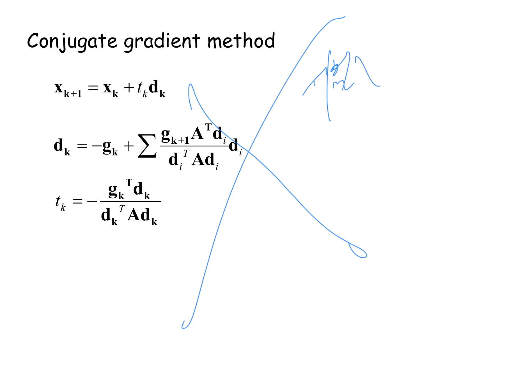
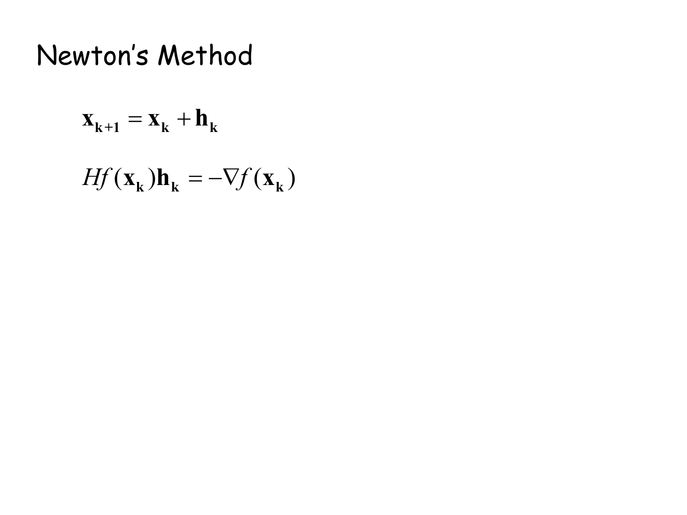
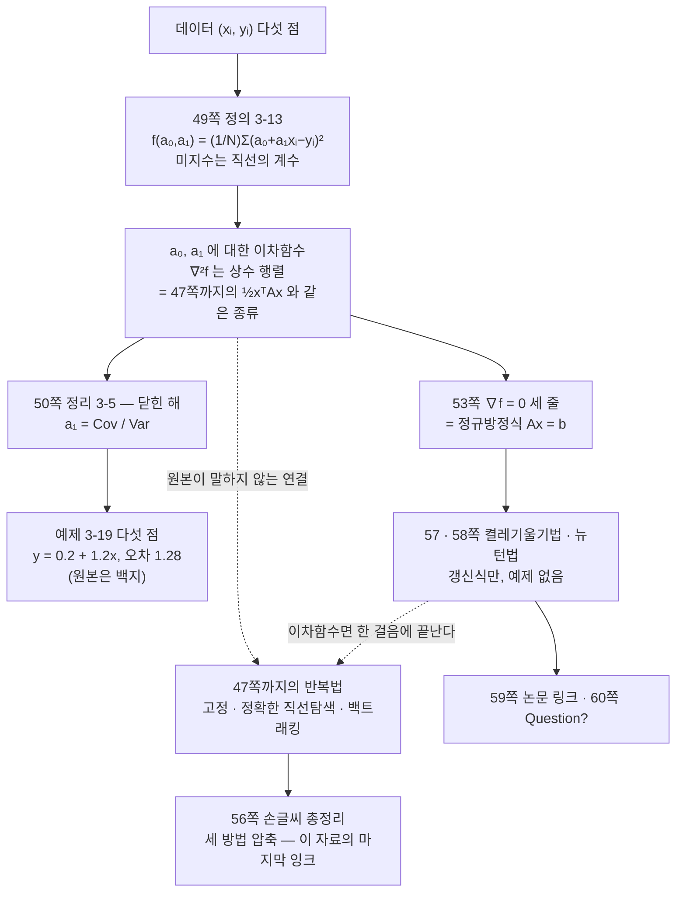

> [!abstract] 문제가 주어지는 방식이 바뀐다
> 47쪽까지 최적화 문제는 이렇게 왔다 — 「$A$ 는 이것이고 $\mathbf{x}_0$ 는 저것이니 $\mathbf{x}_3$ 을 구하라」([08](./08.%20같은%20문제를%20세%20번%20낸다.md)). 목적함수가 **주어져 있었다.**
>
> 48쪽부터는 점 다섯 개 $(1,1),(2,3),(3,5),(4,3),(5,7)$ 이 오고, **그 점들로부터 목적함수를 만들어야** 한다. 최소화의 대상이 처음으로 데이터에서 나온다.
>
> 그런데 그렇게 만들어진 함수가 앞 절의 $\frac12\mathbf{x}^TA\mathbf{x}$ 와 **같은 종류**다 — 미지수에 대한 이차함수다. 그래서 47쪽까지의 도구가 글자 하나 바꾸지 않고 적용되는데, **원본은 그 연결을 한 번도 말하지 않는다.** 대신 닫힌 해 공식을 주고 넘어간다.

---

## 49쪽 — 데이터가 목적함수가 되는 방식

48쪽이 `Linear regression analysis` 를 제목만 걸고, 49쪽이 문제를 정식으로 세운다.



$$\underset{a_0,\,a_1}{\text{minimize}}\quad f(a_0,a_1)=\frac1N\sum_{i=1}^{N}\bigl(a_0+a_1x_i-y_i\bigr)^2$$

두 가지를 짚어 둘 만하다.

**① 변수가 바뀌었다.** 최소화하는 대상은 $x$ 나 $y$ 가 아니라 **$a_0$ 와 $a_1$** 이다. 데이터 $(x_i,y_i)$ 는 상수이고, 직선의 계수가 미지수다. 이 뒤집기가 이 절의 전부다.

**② 제곱을 쓴 이유가 적혀 있지 않다.** $|a_0+a_1x_i-y_i|$ 를 최소화해도 「가장 잘 설명하는 직선」이라 부를 수 있는데, 제곱을 쓴다. 이유는 앞 장들에 이미 있다 — 제곱이면 **$a_0,a_1$ 에 대한 이차함수**가 되고, 이차함수는 미분이 선형이라 $\nabla f=0$ 이 연립일차방정식이 되며, 헤세 행렬이 상수라 볼록성 판정이 한 번에 끝난다. 절댓값을 쓰면 이 셋이 전부 무너진다.

전개해 보면 그 사실이 눈에 보인다.

$$f(a_0,a_1)=\frac1N\Bigl[\bigl(\textstyle\sum 1\bigr)a_0^2+2\bigl(\textstyle\sum x_i\bigr)a_0a_1+\bigl(\textstyle\sum x_i^2\bigr)a_1^2-2\bigl(\textstyle\sum y_i\bigr)a_0-2\bigl(\textstyle\sum x_iy_i\bigr)a_1+\textstyle\sum y_i^2\Bigr]$$

$\mathbf{a}=(a_0,a_1)^T$ 로 두면 **정확히 $\frac12\mathbf{a}^TH\mathbf{a}+\mathbf{b}^T\mathbf{a}+c$ 꼴**이고, 헤세 행렬은

$$H=\nabla^2f=\frac{2}{N}\begin{pmatrix}N&\sum x_i\\\sum x_i&\sum x_i^2\end{pmatrix}$$

로 $\mathbf{a}$ 와 무관한 **상수 행렬**이다. 그러니 3장 `정리 3-2`를 한 번만 적용하면 전 영역에서 볼록임이 끝난다([07](./07.%20볼록%20하나를%20다섯%20번%20다시%20쓴다.md)).

예제의 다섯 점으로 계산하면

$$H=\frac{2}{5}\begin{pmatrix}5&15\\15&55\end{pmatrix}=\begin{pmatrix}2&6\\6&22\end{pmatrix},\qquad \det H=44-36=8>0,\quad \mathrm{tr}\,H=24>0$$

양의 정부호다. **최솟점이 유일하고, 찾으면 그것이 답이다.**

---

## 50쪽 — 닫힌 해가 주어진다

`정리 3-5`가 답을 공식으로 준다. 백지다.



$$a_1=\frac{E(XY)-E(X)E(Y)}{V(X)},\qquad a_0=E(Y)-a_1E(X)$$

$E(XY)-E(X)E(Y)$ 는 공분산이고 $V(X)$ 는 분산이다. 그러니 $a_1=\dfrac{\mathrm{Cov}(X,Y)}{V(X)}$ 인데, **이 자료는 공분산·분산이라는 말을 쓰지 않는다.** 기댓값 기호만 쓴다.

51쪽이 구체적인 문제를 낸다. 역시 백지다.



> [!note] `예제 3-19` 의 답 — 보충
> 원본에 풀이가 없으므로 `정리 3-5` 를 그대로 적용해 둔다. $X=(1,2,3,4,5)$, $Y=(1,3,5,3,7)$ 이므로
>
> $$E(X)=3,\quad E(Y)=\frac{19}{5}=3.8,\quad E(XY)=\frac{69}{5}=13.8,\quad V(X)=E(X^2)-E(X)^2=11-9=2$$
>
> $$a_1=\frac{13.8-3\cdot3.8}{2}=\frac{2.4}{2}=\frac65=1.2,\qquad a_0=3.8-1.2\cdot3=\frac15=0.2$$
>
> $$\boxed{y=0.2+1.2x}$$
>
> 정규방정식 $\begin{pmatrix}5&15\\15&55\end{pmatrix}\begin{pmatrix}a_0\\a_1\end{pmatrix}=\begin{pmatrix}19\\69\end{pmatrix}$ 를 직접 풀어도 같은 분수 $\bigl(\frac15,\frac65\bigr)$ 이 나온다(두 경로를 분수 연산으로 대조했다). 이때 잔차 제곱 평균은 $f=1.28$ 이다.
>
> 네 번째 점 $(4,3)$ 이 추세에서 벗어나 있어 $f$ 가 0이 되지 않는다 — 다섯 점이 한 직선 위에 있지 않으므로 **완전히 맞히는 직선은 존재하지 않고**, 최소제곱은 「가장 덜 틀리는」 직선을 고른다.

### 직선을 직접 움직여 보기

```html preview
<div id="rg-root">
  <style>
    #rg-root{font-family:system-ui,-apple-system,"Segoe UI",sans-serif;color:var(--foreground);padding:4px}
    #rg-root .panel{background:var(--card);border:1px solid var(--border);border-radius:10px;padding:14px}
    #rg-root .row{display:flex;gap:9px;align-items:center;font-size:13px;margin:7px 0}
    #rg-root .row>span:first-child{width:24px;opacity:.72}
    #rg-root input[type=range]{flex:1;accent-color:var(--chart-1);min-width:100px}
    #rg-root .v{width:48px;text-align:right;font-variant-numeric:tabular-nums}
    #rg-root button{background:var(--card);color:var(--foreground);border:1px solid var(--border);border-radius:5px;padding:5px 10px;font:inherit;font-size:12px;cursor:pointer;margin-right:6px}
    #rg-root .stage{display:flex;justify-content:center;gap:10px;flex-wrap:wrap}
    #rg-root .cap{text-align:center;font-size:11px;opacity:.7;margin-top:3px}
    #rg-root .out{margin-top:10px;padding:10px 12px;border:1px solid var(--border);border-radius:7px;font-size:13px;line-height:1.75}
    #rg-root .best{border-color:var(--chart-2);background:color-mix(in srgb,var(--chart-2) 12%,transparent)}
    #rg-root code{font-family:ui-monospace,SFMono-Regular,Menlo,monospace}
  </style>
  <div class="panel">
    <div class="row"><span>a₀</span><input type="range" id="a0" min="-200" max="300" value="150"><b class="v" id="a0v"></b></div>
    <div class="row"><span>a₁</span><input type="range" id="a1" min="-50" max="250" value="70"><b class="v" id="a1v"></b></div>
    <div><button id="fit">정리 3-5 의 답으로</button><button id="bad">엉뚱한 직선으로</button></div>
    <div class="stage">
      <div><svg id="rg-pt" width="275" height="265" viewBox="0 0 275 265" role="img" aria-label="다섯 점과 직선, 잔차"></svg><div class="cap">다섯 점과 직선 — 세로 막대가 잔차</div></div>
      <div><svg id="rg-ct" width="255" height="265" viewBox="0 0 255 265" role="img" aria-label="a0 a1 평면에서의 오차 등고선"></svg><div class="cap">(a₀, a₁) 평면의 오차 등고선</div></div>
    </div>
    <div class="out" id="rg-out"></div>
  </div>
</div>
<script>
(function(){
  var R=document.getElementById('rg-root');
  var XS=[1,2,3,4,5], YS=[1,3,5,3,7];
  function err(a0,a1){var s=0;for(var i=0;i<5;i++){var r=a0+a1*XS[i]-YS[i];s+=r*r;}return s/5;}
  function draw(){
    var a0=+R.querySelector('#a0').value/100, a1=+R.querySelector('#a1').value/100;
    R.querySelector('#a0v').textContent=a0.toFixed(2);
    R.querySelector('#a1v').textContent=a1.toFixed(2);
    var L=36,Rr=12,T=12,B=30,W=275,H=265;
    function PX(x){return L+(x-0)/6*(W-L-Rr);}
    function PY(y){return T+(9-y)/(9-(-1))*(H-T-B);}
    var g='';
    for(var v=0;v<=8;v+=2){
      g+='<line x1="'+L+'" y1="'+PY(v)+'" x2="'+(W-Rr)+'" y2="'+PY(v)+'" stroke="var(--border)" stroke-width="0.55"/>'+
         '<text x="'+(L-5)+'" y="'+(PY(v)+4)+'" font-size="9.5" text-anchor="end" opacity=".6" fill="var(--foreground)">'+v+'</text>';}
    for(var u=1;u<=5;u++)
      g+='<line x1="'+PX(u)+'" y1="'+T+'" x2="'+PX(u)+'" y2="'+PY(-1)+'" stroke="var(--border)" stroke-width="0.4"/>'+
         '<text x="'+PX(u)+'" y="'+(H-10)+'" font-size="9.5" text-anchor="middle" opacity=".6" fill="var(--foreground)">'+u+'</text>';
    g+='<line x1="'+L+'" y1="'+PY(0)+'" x2="'+(W-Rr)+'" y2="'+PY(0)+'" stroke="var(--border)" stroke-width="1.1"/>';
    g+='<line x1="'+PX(0)+'" y1="'+PY(a0)+'" x2="'+PX(6)+'" y2="'+PY(a0+6*a1)+'" stroke="var(--chart-1)" stroke-width="2.4"/>';
    for(var i=0;i<5;i++){
      var yh=a0+a1*XS[i];
      g+='<line x1="'+PX(XS[i])+'" y1="'+PY(YS[i])+'" x2="'+PX(XS[i])+'" y2="'+PY(yh)+'" stroke="var(--chart-5)" stroke-width="4.5" opacity=".45" stroke-linecap="round"/>';
      g+='<circle cx="'+PX(XS[i])+'" cy="'+PY(YS[i])+'" r="4.2" fill="var(--chart-3)"/>';
    }
    R.querySelector('#rg-pt').innerHTML=g;
    var CW=255,CH=265,CL=36,CT=12,CB=28,CR=12;
    function QX(v){return CL+(v+2)/5*(CW-CL-CR);}
    function QY(v){return CT+(2.6-v)/3.4*(CH-CT-CB);}
    var h='',N=88;
    var cw=(CW-CL-CR)/N, ch=(CH-CT-CB)/N, vals=[];
    for(var i=0;i<N;i++){vals.push([]);for(var j=0;j<N;j++){
      var A0=-2+5*i/N, A1=2.6-3.4*j/N; vals[i].push(err(A0,A1));}}
    [1.3,1.6,2.2,3.5,6,10,18,30].forEach(function(Lv){
      var p='';
      for(var i=0;i<N-1;i++)for(var j=0;j<N-1;j++){
        var v0=vals[i][j];
        if((v0-Lv)*(vals[i+1][j]-Lv)<0) p+='M'+(CL+i*cw+cw/2).toFixed(1)+','+(CT+j*ch).toFixed(1)+'l0,'+ch.toFixed(1);
        if((v0-Lv)*(vals[i][j+1]-Lv)<0) p+='M'+(CL+i*cw).toFixed(1)+','+(CT+j*ch+ch/2).toFixed(1)+'l'+cw.toFixed(1)+',0';
      }
      h+='<path d="'+p+'" stroke="var(--chart-4)" stroke-width="1" fill="none" opacity=".62"/>';
    });
    h+='<circle cx="'+QX(0.2)+'" cy="'+QY(1.2)+'" r="4" fill="var(--chart-2)"/>';
    h+='<text x="'+(QX(0.2)+7)+'" y="'+(QY(1.2)+14)+'" font-size="9.5" fill="var(--chart-2)">(0.2, 1.2)</text>';
    h+='<circle cx="'+QX(a0)+'" cy="'+QY(a1)+'" r="4.5" fill="var(--chart-1)"/>';
    h+='<text x="'+CL+'" y="'+(CH-8)+'" font-size="9.5" opacity=".6" fill="var(--foreground)">a₀ = −2</text>';
    h+='<text x="'+(CW-CR)+'" y="'+(CH-8)+'" font-size="9.5" text-anchor="end" opacity=".6" fill="var(--foreground)">3</text>';
    R.querySelector('#rg-ct').innerHTML=h;
    var e=err(a0,a1), best=err(0.2,1.2);
    var o=R.querySelector('#rg-out');
    var t='직선 <code>y = '+a0.toFixed(2)+' + '+a1.toFixed(2)+'x</code> — 잔차 제곱 평균 <b>'+e.toFixed(4)+'</b>';
    if(Math.abs(e-best)<1e-4){
      o.className='out best';
      t+='<br><b>여기가 최소다.</b> 정리 3-5 가 주는 a₀ = 1/5, a₁ = 6/5 이고 그때 값이 1.28 이다.';
      t+='<br><span style="opacity:.78">0이 아닌 이유는 다섯 점이 한 직선 위에 있지 않기 때문이다 — 특히 (4,3) 이 추세에서 벗어나 있다. 최소제곱은 「맞히는」 직선이 아니라 「가장 덜 틀리는」 직선을 고른다.</span>';
    }else{
      o.className='out';
      t+=' &nbsp; <span style="opacity:.7">(최소는 1.28)</span><br>오른쪽 등고선에서 지금 점이 가운데 표시에서 얼마나 떨어져 있는지 보인다. 등고선이 <b>기울어진 타원</b>인 것은 헤세 행렬의 비대각 성분 6 때문이다 — a₀ 와 a₁ 이 서로 얽혀 있어 한쪽만 고쳐서는 최소에 닿지 못한다.';
    }
    o.innerHTML=t;
  }
  R.querySelector('#fit').onclick=function(){R.querySelector('#a0').value=20;R.querySelector('#a1').value=120;draw();};
  R.querySelector('#bad').onclick=function(){R.querySelector('#a0').value=-120;R.querySelector('#a1').value=210;draw();};
  R.addEventListener('input',draw); draw();
})();
</script>
```

오른쪽 등고선이 **길쭉하게 기울어진 타원**인 점이 중요하다. $H=\begin{pmatrix}2&6\\6&22\end{pmatrix}$ 의 고윳값은

$$\lambda=12\pm\sqrt{136}\ \Longrightarrow\ \lambda_{\min}\approx0.338,\quad \lambda_{\max}\approx23.662$$

조건수가 $\kappa\approx70$ 이다. [08](./08.%20같은%20문제를%20세%20번%20낸다.md)에서 세 번 풀었던 $A=\begin{pmatrix}4&-2\\-2&2\end{pmatrix}$ 의 조건수가 $\approx6.85$ 였으니 **열 배 나쁘다.** 그리고 고정 보폭의 상한도

$$\frac{2}{\lambda_{\max}}\approx0.0845$$

로 앞 절의 $0.382$ 보다 훨씬 작다. 같은 경사하강법을 이 문제에 쓰면 훨씬 느리고 훨씬 조심해야 한다는 뜻인데, 원본은 이 비교를 하지 않는다.

### 닫힌 해와 경사하강법을 같은 문제에 붙여 보기

```html preview
<div id="gr-root">
  <style>
    #gr-root{font-family:system-ui,-apple-system,"Segoe UI",sans-serif;color:var(--foreground);padding:4px}
    #gr-root .panel{background:var(--card);border:1px solid var(--border);border-radius:10px;padding:14px}
    #gr-root .row{display:flex;gap:10px;align-items:center;font-size:13px;margin:7px 0;flex-wrap:wrap}
    #gr-root input[type=range]{flex:1;accent-color:var(--chart-1);min-width:120px}
    #gr-root button{background:var(--card);color:var(--foreground);border:1px solid var(--border);border-radius:5px;padding:4px 9px;font:inherit;font-size:12px;cursor:pointer;margin-right:5px}
    #gr-root .out{margin-top:10px;padding:10px 12px;border:1px solid var(--border);border-radius:7px;font-size:13px;line-height:1.75}
    #gr-root .bad{border-color:var(--chart-5);background:color-mix(in srgb,var(--chart-5) 12%,transparent)}
    #gr-root .good{border-color:var(--chart-2);background:color-mix(in srgb,var(--chart-2) 11%,transparent)}
    #gr-root code{font-family:ui-monospace,SFMono-Regular,Menlo,monospace}
    #gr-root .stage{display:flex;justify-content:center}
  </style>
  <div class="panel">
    <div class="row"><span style="opacity:.72">고정 보폭 t</span><input type="range" id="t" min="1" max="120" value="40"><b id="tv" style="width:56px;text-align:right"></b></div>
    <div class="row"><span style="opacity:.72">걸음 수</span><input type="range" id="k" min="1" max="300" value="60"><b id="kv" style="width:38px;text-align:right"></b></div>
    <div><button data-t="40">t = 0.04</button><button data-t="84">한계 0.0845</button><button data-t="95">넘겨 보기 0.095</button></div>
    <div class="stage"><svg id="gr-svg" width="330" height="290" viewBox="0 0 330 290" style="max-width:100%;height:auto" role="img" aria-label="회귀 문제에서의 경사하강 궤적"></svg></div>
    <div class="out" id="gr-out"></div>
  </div>
</div>
<script>
(function(){
  var R=document.getElementById('gr-root');
  var XS=[1,2,3,4,5], YS=[1,3,5,3,7], N=5;
  var S1=N, Sx=15, Sxx=55, Sy=19, Sxy=69;
  function err(a0,a1){var s=0;for(var i=0;i<N;i++){var r=a0+a1*XS[i]-YS[i];s+=r*r;}return s/N;}
  function grad(a0,a1){
    return [2/N*(S1*a0+Sx*a1-Sy), 2/N*(Sx*a0+Sxx*a1-Sxy)];
  }
  var LMAX=12+Math.sqrt(136), LIM=2/LMAX;
  function draw(){
    var t=+R.querySelector('#t').value/1000, K=+R.querySelector('#k').value;
    R.querySelector('#tv').textContent=t.toFixed(4);
    R.querySelector('#kv').textContent=K;
    var a=[-1.5,2.4], pts=[a.slice()];
    for(var k=0;k<K;k++){var g=grad(a[0],a[1]); a=[a[0]-t*g[0], a[1]-t*g[1]]; pts.push(a.slice());}
    var W=330,H=290,L=38,T=12,B=28,Rr=12;
    function QX(v){return L+(v+2.2)/5.4*(W-L-Rr);}
    function QY(v){return T+(2.8-v)/3.8*(H-T-B);}
    var g='',NN=88,cw=(W-L-Rr)/NN, ch=(H-T-B)/NN, vals=[];
    for(var i=0;i<NN;i++){vals.push([]);for(var j=0;j<NN;j++){
      vals[i].push(err(-2.2+5.4*i/NN, 2.8-3.8*j/NN));}}
    [1.3,1.6,2.2,3.5,6,10,18,30,50].forEach(function(Lv){
      var p='';
      for(var i=0;i<NN-1;i++)for(var j=0;j<NN-1;j++){
        var v0=vals[i][j];
        if((v0-Lv)*(vals[i+1][j]-Lv)<0) p+='M'+(L+i*cw+cw/2).toFixed(1)+','+(T+j*ch).toFixed(1)+'l0,'+ch.toFixed(1);
        if((v0-Lv)*(vals[i][j+1]-Lv)<0) p+='M'+(L+i*cw).toFixed(1)+','+(T+j*ch+ch/2).toFixed(1)+'l'+cw.toFixed(1)+',0';
      }
      g+='<path d="'+p+'" stroke="var(--chart-4)" stroke-width="1" fill="none" opacity=".55"/>';
    });
    var path='';
    pts.forEach(function(p,i){
      var cx=Math.max(-2.2,Math.min(3.2,p[0])), cy=Math.max(-1,Math.min(2.8,p[1]));
      path+=(i?'L':'M')+QX(cx).toFixed(1)+','+QY(cy).toFixed(1);});
    g+='<path d="'+path+'" stroke="var(--chart-1)" stroke-width="1.8" fill="none"/>';
    g+='<circle cx="'+QX(-1.5)+'" cy="'+QY(2.4)+'" r="4.5" fill="none" stroke="var(--foreground)" stroke-width="1.6"/>';
    g+='<circle cx="'+QX(0.2)+'" cy="'+QY(1.2)+'" r="4.5" fill="var(--chart-2)"/>';
    var last=pts[pts.length-1];
    if(Math.abs(last[0])<4&&Math.abs(last[1])<4)
      g+='<circle cx="'+QX(Math.max(-2.2,Math.min(3.2,last[0])))+'" cy="'+QY(Math.max(-1,Math.min(2.8,last[1])))+'" r="3.6" fill="var(--chart-1)"/>';
    g+='<text x="'+(QX(0.2)+8)+'" y="'+(QY(1.2)+14)+'" font-size="10" fill="var(--chart-2)">정리 3-5 의 답</text>';
    R.querySelector('#gr-svg').innerHTML=g;
    var e=err(last[0],last[1]);
    var o=R.querySelector('#gr-out');
    var h='<code>t = '+t.toFixed(4)+'</code> &nbsp; 수렴 한계 <code>2/λ_max = '+LIM.toFixed(5)+'</code><br>';
    if(isFinite(e)&&e<1e6){
      h+=K+'걸음 뒤 <code>(a₀, a₁) = ('+last[0].toFixed(4)+', '+last[1].toFixed(4)+')</code>, 오차 <b>'+e.toFixed(5)+'</b> &nbsp;<span style="opacity:.7">(최소 1.28)</span>';
    } else { h+=K+'걸음 뒤 값이 <b>폭발했다.</b>'; }
    if(t>=LIM){
      o.className='out bad';
      h+='<br><b>보폭이 한계를 넘었다.</b> 등고선이 길쭉해서 이 문제의 λ_max 가 23.66 으로 크고, 그만큼 허용 보폭이 작다.';
    } else if(e<1.2801){
      o.className='out good';
      h+='<br>수렴했다. 닫힌 해 하나로 끝나는 문제를 <b>수십~수백 걸음</b> 걸어 도달한 셈이다 — 그래서 50쪽이 공식을 준다.';
    } else {
      o.className='out';
      h+='<br>아직 가는 중이다. 조건수가 <b>κ ≈ 70</b> 이라 지그재그가 심하다 — 3장이 앞에서 쓴 A 는 κ ≈ 6.85 로 열 배 순했다.';
    }
    o.innerHTML=h;
  }
  R.addEventListener('input',draw);
  R.addEventListener('click',function(e){if(e.target.dataset.t){R.querySelector('#t').value=e.target.dataset.t;draw();}});
  draw();
})();
</script>
```

여기서 드러나는 것이 **닫힌 해가 존재하는 이유**다. 목적함수가 이차라서 $\nabla f=0$ 이 **연립일차방정식**이 되고, 그 방정식은 반복 없이 한 번에 풀린다. 경사하강법은 그 답에 수십·수백 걸음을 걸어 다가갈 뿐이다.

---

## 52~53쪽 — 변수를 늘려도 구조는 같다

52쪽이 `Multivariate analysis` 를 걸고 53쪽이 변수 하나를 더한 문제를 낸다.



$$\underset{a_0,a_1,a_2}{\text{minimize}}\quad f=\frac1N\sum_{i=1}^{N}\bigl(a_0+a_1x_i+a_2y_i-z_i\bigr)^2$$

$$\frac{\partial f}{\partial a_0}=\frac2N\sum(\cdots)=0,\quad \frac{\partial f}{\partial a_1}=\frac2N\sum(\cdots)x_i=0,\quad \frac{\partial f}{\partial a_2}=\frac2N\sum(\cdots)y_i=0$$

**이 세 줄이 곧 $\nabla f=\mathbf{0}$ 이다.** 2장 30쪽의 극값 조건([06](./06.%20잉크가%20멈춘%20자리에서%20과제가%20시작된다.md))과 3장 `정리 3-1`의 따름정리(볼록이면 $\nabla f=0$ 인 점이 전역 최솟점, [07](./07.%20볼록%20하나를%20다섯%20번%20다시%20쓴다.md))가 합쳐져 여기서 값을 한다.

그리고 세 식이 전부 $a_0,a_1,a_2$ 에 대해 **일차**다. 정리하면

$$\begin{pmatrix}N&\sum x_i&\sum y_i\\\sum x_i&\sum x_i^2&\sum x_iy_i\\\sum y_i&\sum x_iy_i&\sum y_i^2\end{pmatrix}\begin{pmatrix}a_0\\a_1\\a_2\end{pmatrix}=\begin{pmatrix}\sum z_i\\\sum x_iz_i\\\sum y_iz_i\end{pmatrix}$$

**정규방정식**이고, 1장 24쪽이 다룬 $A\mathbf{x}=\mathbf{b}$ 꼴이다([02](./02.%20행렬식%20하나가%20대답하는%20세%20가지%20질문.md)). 왼쪽 행렬은 대칭이고, 데이터가 퇴화하지 않으면 양의 정부호다. 변수를 $n$ 개로 늘려도 구조는 그대로 — **이 절의 요점이 그것이다.** 원본은 세 식을 적고 멈추며, 정규방정식이라는 이름도 행렬 형태도 적지 않는다.

---

## 56쪽 — 이 자료의 마지막 손글씨

54·55쪽을 지나 56쪽에, 3장에서 마지막 손글씨가 나온다. 회귀 절 한복판인데 내용은 회귀가 아니다.

![56쪽 — gradient / Exact / Back 세 방법의 갱신식을 나란히 적고, 아래에 A = [[4,−2],[−2,2]], x = (2,3), f = ½xᵀAx 와 각 방법의 보폭 공식을 다시 정리했다](../assets/ch03-p56-세-방법-손글씨-총정리.png)

$$\textsf{gradient}:\ \mathbf{x}_{k+1}=\mathbf{x}_k-t\nabla f$$
$$\textsf{Exact}:\ \mathbf{x}_{k+1}=\mathbf{x}_k-t\nabla f,\qquad t=\frac{\lVert\nabla f\rVert^2}{\nabla f^T\nabla^2f\,\nabla f}$$
$$\textsf{Back}:\ \mathbf{x}_{k+1}=\mathbf{x}_k-\alpha t\lVert\nabla f\rVert^2\ \textsf{조건 }g(t)>f(t)$$

그 아래에 `ex)` 로 $A=\begin{pmatrix}4&-2\\-2&2\end{pmatrix}$, $\mathbf{x}=(2,3)$, $f(\mathbf{x})=\frac12\mathbf{x}^TA\mathbf{x}$ 를 다시 적고 $\nabla f=A\mathbf{x}$, $\nabla^2f=A$ 를 붙였다.

**[08](./08.%20같은%20문제를%20세%20번%20낸다.md)에서 다룬 세 방법의 압축 요약**이다. 46쪽에 「시험에 무조건 나올 것」이라 적혀 있던 그 내용을 한 장에 몰아 정리한 것이고, 그래서 이 페이지는 강의의 진행이 아니라 **시험 준비의 흔적**이다.

이 자료 전체에서 손글씨가 마지막으로 나타나는 자리가 회귀 절 한가운데의 이 요약 한 장이라는 사실이, 48쪽 이후 구간에 대한 판단을 말해 준다.

---

## 57~60쪽 — 열린 채 끝난다

57쪽이 켤레기울기법을 갱신식만으로 소개한다.



$$\mathbf{x}_{k+1}=\mathbf{x}_k+t_k\mathbf{d}_k,\qquad \mathbf{d}_k=-\mathbf{g}_k+\frac{\mathbf{g}_{k+1}^TA^T\mathbf{d}_i}{\mathbf{d}_i^TA\mathbf{d}_i}\mathbf{d}_i,\qquad t_k=-\frac{\mathbf{g}_k^T\mathbf{d}_k}{\mathbf{d}_k^TA\mathbf{d}_k}$$

58쪽이 뉴턴법을 두 줄로 소개한다.



$$\mathbf{x}_{k+1}=\mathbf{x}_k+\mathbf{h}_k,\qquad H_f(\mathbf{x}_k)\,\mathbf{h}_k=-\nabla f(\mathbf{x}_k)$$

뉴턴법의 형태를 보면 이 과목이 준비한 것이 전부 들어 있다 — 왼쪽은 헤세 행렬(2장 39쪽)이고, 이 식은 $\mathbf{h}_k$ 에 대한 **연립일차방정식**(1장 24·26쪽)이며, $H_f$ 가 양의 정부호이면(1장 60쪽) 유일하게 풀린다.

> [!important] 이 자료의 $f=\frac12\mathbf{x}^TA\mathbf{x}$ 에 뉴턴법을 쓰면 한 걸음에 끝난다 — 보충
> $\nabla f=A\mathbf{x}$, $H_f=A$ 이므로 뉴턴 방정식은 $A\mathbf{h}=-A\mathbf{x}$ 이고 $A$ 가 가역이므로 $\mathbf{h}=-\mathbf{x}$, 따라서
>
> $$\mathbf{x}_1=\mathbf{x}_0+\mathbf{h}_0=\mathbf{x}_0-\mathbf{x}_0=(0,0)$$
>
> **첫 걸음에 정확한 답에 도착한다.** 3장이 세 가지 보폭 규칙으로 세 걸음을 걸어 $f=1.391$·$0.156$·$0.040$ 에 닿은 그 문제를, 뉴턴법은 한 번에 $f=0$ 으로 끝낸다. 이차함수에서는 2차 테일러 전개가 근사가 아니라 등식이기 때문이다(2장 51쪽).
>
> 켤레기울기법도 마찬가지로 $n$ 차원 이차함수를 **$n$ 걸음 안에** 정확히 푼다. 즉 57·58쪽의 두 방법은 앞 절의 예제를 압도하는데, 원본은 예제를 한 개도 붙이지 않는다.

59쪽은 semanticscholar 논문 링크 한 줄이고 60쪽은 `Question?` 이다.

**57·58쪽에는 예제가 없다.** 3장 전체가 같은 문제를 세 번 반복하며 보폭 규칙을 비교했는데, 그 문제를 한 걸음에 끝낼 두 방법에는 갱신식만 걸고 끝난다. 이 구간은 **완결이 아니라 목차**다.

---

## 48~60쪽의 구조



---

## 이것으로 3장이 끝난다

세 장을 관통하는 한 줄이 있다. 1장이 $\mathbf{x}^TA\mathbf{x}$ 를 만들고, 2장이 그것을 2차 테일러 전개의 세 번째 항으로 다시 꺼냈으며, 3장이 그 함수를 실제로 최소화했다. 그리고 마지막에 데이터가 들어와 같은 함수를 스스로 만들어 냈다.

- [07. 볼록 하나를 다섯 번 다시 쓴다](./07.%20볼록%20하나를%20다섯%20번%20다시%20쓴다.md) — 3장 1~19쪽
- [08. 같은 문제를 세 번 낸다](./08.%20같은%20문제를%20세%20번%20낸다.md) — 3장 20~47쪽
- [10. 슬라이드가 비워 둔 열 칸](./10.%20슬라이드가%20비워%20둔%20열%20칸.md) — 과제와 리포트

---

## 근거 자료

| 쪽 | 인쇄된 것 | 잉크 |
| --- | --- | --- |
| 48 | `Linear regression analysis` — 제목 한 줄 | — |
| **49** | `정의 3-13` 2차원 선형 회귀 분석, 식 (3.12) | 없음 |
| **50** | `정리 3-5` 선형 회귀 분석의 해 — $a_1$, $a_0$ 공식 | **백지** |
| **51** | `예제 3-19` 다섯 점 $(1,1),(2,3),(3,5),(4,3),(5,7)$ | **백지** |
| 52 | `Multivariate analysis` — 제목 한 줄 | — |
| **53** | 3변수 최소화와 $\partial f/\partial a_0=\partial f/\partial a_1=\partial f/\partial a_2=0$ | **백지** |
| 54·55 | (회귀 관련) | **백지** |
| **56** | (백지 슬라이드) | **세 방법 총정리** — gradient·Exact($t=\frac{\lVert\nabla f\rVert^2}{\nabla f^T\nabla^2f\nabla f}$)·Back, 그리고 `ex)` $A$·$\mathbf{x}=(2,3)$·$\nabla f=A\mathbf{x}$·$\nabla^2f=A$. **이 자료의 마지막 손글씨** |
| 57 | `Conjugate gradient method` 갱신식 3줄 | 예제 없음 |
| 58 | `Newton's Method` 갱신식 2줄 | 예제 없음 |
| 59 | semanticscholar 논문 URL 한 줄 | — |
| 60 | `Question?` | — |

추출 번들: `.ok/local/pdf-extract/02_math-theory__optimization-math__MSC087_3장_볼록최적화/`
(이 구간에서 `page_chars` 가 0이 아닌 것은 48(24자)·52(20자)·57(74자)·58(40자)·59(118자)·60(9자)쪽이다. 49\~51·53\~56쪽은 전부 0자이고, 그중 실제로 내용이 있는 것은 교재 페이지 넷과 손글씨 한 장(56쪽)이다.)

수치 검증: `예제 3-19` 의 답을 **`정리 3-5` 공식**과 **정규방정식 직접 풀이** 두 경로로 각각 분수 연산해 $\bigl(a_0,a_1\bigr)=\bigl(\frac15,\frac65\bigr)$ 로 일치함을 확인했고, 그때의 잔차 제곱 평균 $1.28$ 과 주변 점들의 값이 모두 그보다 큼을 확인했다. 헤세 행렬 $\begin{pmatrix}2&6\\6&22\end{pmatrix}$ 의 $\det=8$·$\mathrm{tr}=24$·고윳값 $12\pm\sqrt{136}$·조건수 $\approx70.0$·$2/\lambda_{\max}\approx0.0845$ 와, 비교 대상인 3장 $A$ 의 조건수 $\approx6.85$·$2/\lambda_{\max}\approx0.382$ 도 직접 계산했다. 뉴턴법이 $f=\frac12\mathbf{x}^TA\mathbf{x}$ 에서 한 걸음에 $(0,0)$ 에 도달한다는 것은 $A\mathbf{h}=-A\mathbf{x}\Rightarrow\mathbf{h}=-\mathbf{x}$ 로 확인된다.
