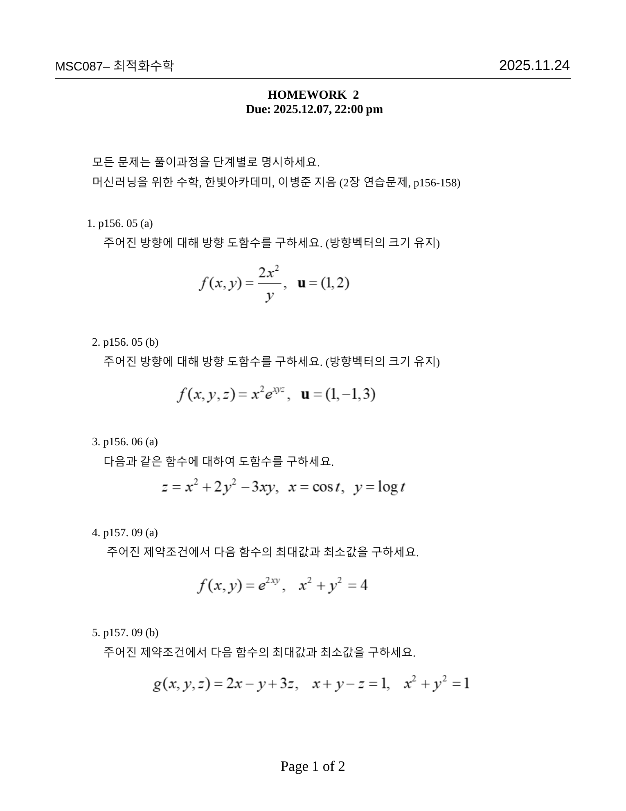
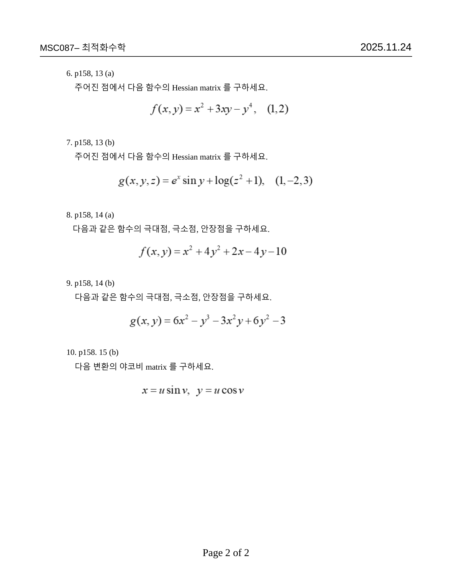
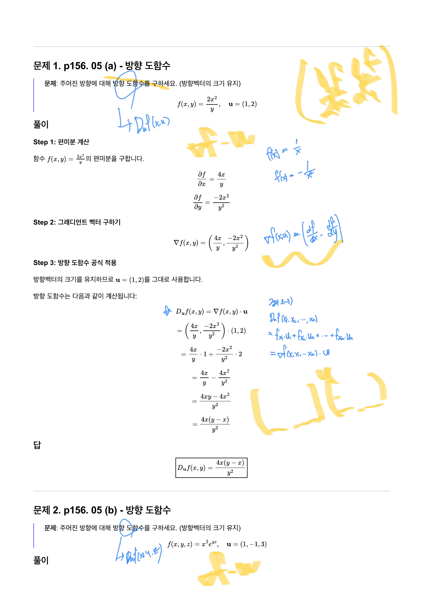
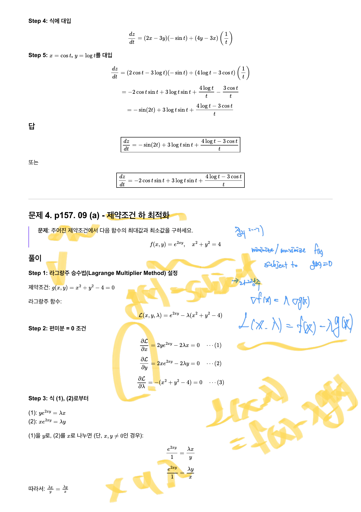
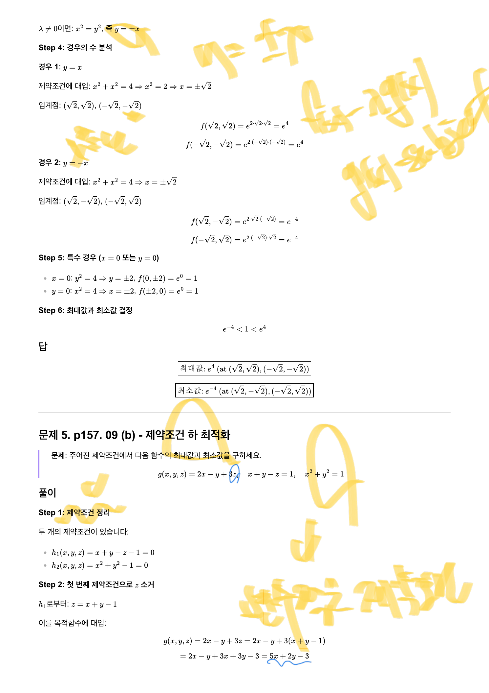
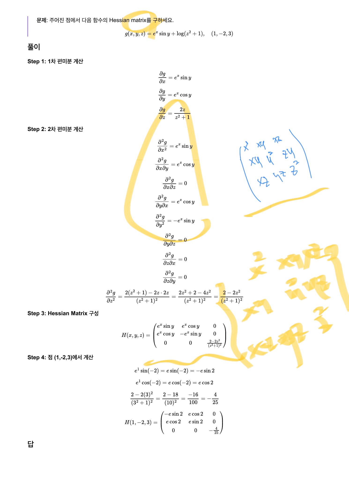
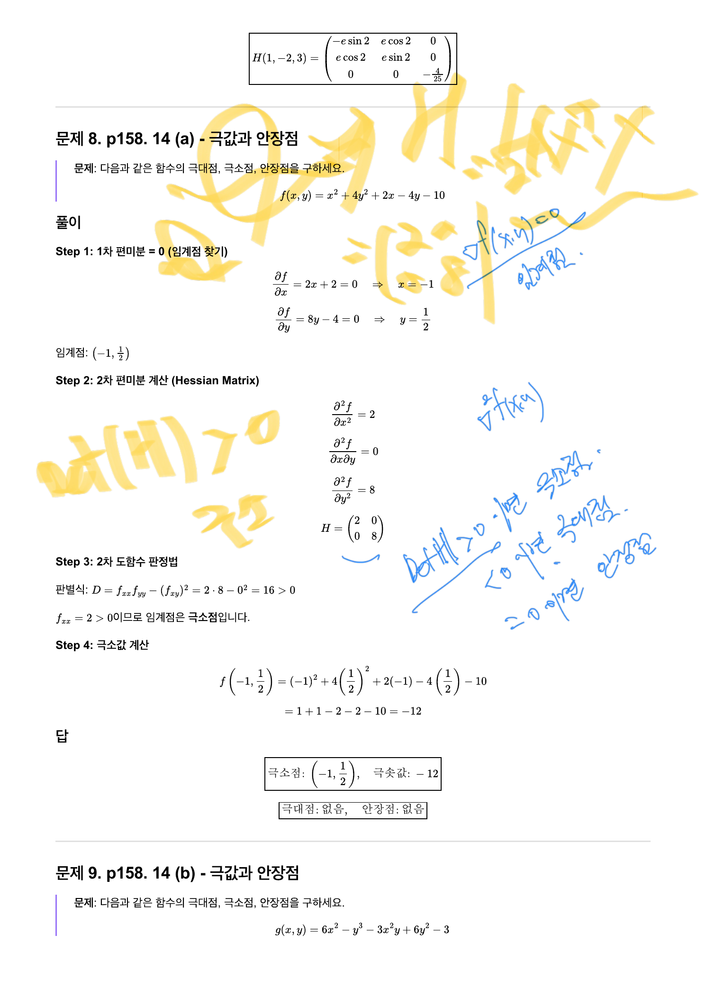
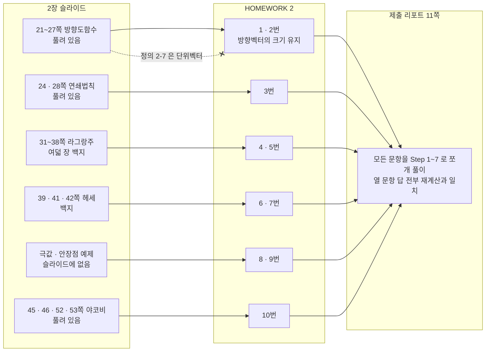

> [!abstract] 과제가 슬라이드의 빈칸을 되짚는다
> `HOMEWORK 2` 는 2025년 11월 24일에 나가 12월 7일 22시에 마감됐고, 열 문항 전부가 한 교재의 세 쪽에서 나온다 — **「머신러닝을 위한 수학」(한빛아카데미, 이병준) 2장 연습문제 p156\~158**. 그리고 열 문항이 강의 슬라이드의 지형과 이렇게 겹친다.
>
> | 문항 | 주제 | 슬라이드 상태 |
> | --- | --- | --- |
> | 1·2 | 방향도함수 | 2장 21\~27쪽 — **풀려 있음** |
> | 3 | 연쇄법칙 도함수 | 2장 24·28쪽 — 풀려 있음 |
> | **4·5** | 제약조건 최대·최소 | 2장 31\~38쪽 — **여덟 장 연속 백지** |
> | **6·7** | Hessian matrix | 2장 39·41쪽 — **백지** |
> | **8·9** | 극대·극소·안장점 | **슬라이드에 예제가 아예 없다** |
> | 10 | 야코비 matrix | 2장 45·46·52·53쪽 — 풀려 있음 |
>
> **여섯 문항이 백지 구간에서 나온다.** 그 빈칸을 학생이 채운 기록이 이 정리가 다루는 두 번째 파일이다.

---

## 과제지 — 두 쪽, 열 문항



머리말 두 줄이 조건을 정한다.

> 모든 문제는 **풀이과정을 단계별로 명시**하세요.
> 머신러닝을 위한 수학, 한빛아카데미, 이병준 지음 (2장 연습문제, p156-158)

「단계별로」라는 요구가 제출물의 형태를 정했다 — 뒤에서 볼 리포트가 모든 문항을 `Step 1`, `Step 2`, … 로 쪼개 쓴다.



과제지에는 **함수식이 하나도 없다.** 전부 「p156. 05 (a)」처럼 교재의 쪽·번호로만 가리킨다. 그래서 과제지만으로는 무엇을 푸는지 알 수 없고, 함수는 리포트에서야 드러난다.

---

## 1·2번 — 단서 한 줄이 정의와 충돌한다

1·2번에는 다른 문항에 없는 괄호가 붙어 있다.

> **1.** p156. 05 (a) 주어진 방향에 대해 방향 도함수를 구하세요. **(방향벡터의 크기 유지)**
> **2.** p156. 05 (b) 주어진 방향에 대해 방향 도함수를 구하세요. **(방향벡터의 크기 유지)**

리포트는 그 지시를 그대로 따른다.



$$f(x,y)=\frac{2x^2}{y},\qquad \mathbf{u}=(1,2)$$

$$\nabla f=\Bigl(\frac{4x}{y},\ -\frac{2x^2}{y^2}\Bigr),\qquad D_{\mathbf{u}}f=\frac{4x}{y}\cdot1+\Bigl(-\frac{2x^2}{y^2}\Bigr)\cdot2=\frac{4xy-4x^2}{y^2}=\frac{4x(y-x)}{y^2}$$

> [!caution] 원본 불일치 ⑫ — 「크기 유지」가 교재 정의와 강의 예제 양쪽과 어긋난다
> 세 자리가 서로 다른 말을 한다.
>
> | 어디 | 무엇을 하라고 하는가 |
> | --- | --- |
> | 2장 20쪽 `정의 2-7` | $D_{\mathbf{u}}f$ 의 $\mathbf{u}$ 는 **단위벡터**라고 명시 |
> | 2장 26쪽 `예제 2-10`(b) | $\mathbf{v}=(1,-2,2)$ 아래 밑줄을 긋고 $\lvert\mathbf{v}\rvert=3$ 을 계산해 **나눈다** |
> | `HOMEWORK 2` 1·2번 | **「방향벡터의 크기 유지」** — 나누지 말라 |
>
> 같은 기호 $D_{\mathbf{u}}f$ 가 한 과목 안에서 두 가지로 계산된다. 값은 정확히 $\lvert\mathbf{u}\rvert$ 배 차이가 난다 — 1번의 $\mathbf{u}=(1,2)$ 라면 $\sqrt5\approx2.236$ 배다.
>
> 어느 쪽이 「틀렸다」기보다 **두 관례가 병존한다**고 보는 편이 정확하다. 단위벡터로 정규화하면 $D_{\mathbf{u}}f$ 는 「그 방향으로 단위 길이 갈 때의 변화율」이고, 정규화하지 않으면 「벡터 $\mathbf{v}$ 만큼 갈 때의 변화율」, 즉 $\nabla f$ 와 $\mathbf{v}$ 의 단순한 내적이다. 후자가 2장 51쪽의 2차 테일러 전개 $f(\mathbf{x}+\mathbf{h})\approx f+\nabla f^T\mathbf{h}+\cdots$ 에 바로 들어맞는 형태라([06](./06.%20잉크가%20멈춘%20자리에서%20과제가%20시작된다.md)) 과제가 그쪽을 택한 것으로 보인다.
>
> 문제는 **자료가 그 선택을 설명하지 않는다는 점**이다. 괄호 한 줄만 붙어 있고, 26쪽의 반대 처리와 나란히 놓고 읽으면 혼란이 생긴다.

### 정규화하느냐 마느냐가 얼마나 바꾸는가

```html preview
<div id="nm-root">
  <style>
    #nm-root{font-family:system-ui,-apple-system,"Segoe UI",sans-serif;color:var(--foreground);padding:4px}
    #nm-root .panel{background:var(--card);border:1px solid var(--border);border-radius:10px;padding:14px}
    #nm-root .row{display:flex;gap:9px;align-items:center;font-size:13px;margin:7px 0}
    #nm-root .row>span:first-child{width:52px;opacity:.72}
    #nm-root input[type=range]{flex:1;accent-color:var(--chart-1);min-width:100px}
    #nm-root .v{width:46px;text-align:right;font-variant-numeric:tabular-nums}
    #nm-root .stage{display:flex;justify-content:center}
    #nm-root .out{margin-top:10px;padding:10px 12px;border:1px solid var(--border);border-radius:7px;font-size:13px;line-height:1.75}
    #nm-root code{font-family:ui-monospace,SFMono-Regular,Menlo,monospace}
    #nm-root button{background:var(--card);color:var(--foreground);border:1px solid var(--border);border-radius:5px;padding:4px 9px;font:inherit;font-size:12px;cursor:pointer;margin-right:5px}
    #nm-root .lgd{display:flex;gap:14px;justify-content:center;font-size:11.5px;margin-top:5px;flex-wrap:wrap}
    #nm-root .sw{display:inline-block;width:18px;height:3px;vertical-align:middle;margin-right:4px}
  </style>
  <div class="panel">
    <div class="row"><span>v₁</span><input type="range" id="v1" min="-40" max="40" value="10"><b class="v" id="v1v"></b></div>
    <div class="row"><span>v₂</span><input type="range" id="v2" min="-40" max="40" value="20"><b class="v" id="v2v"></b></div>
    <div><button data-v="10,20">과제 1번 v = (1,2)</button><button data-v="10,10">v = (1,1)</button><button data-v="30,-10">v = (3,−1)</button></div>
    <div class="stage"><svg id="nm-svg" width="300" height="290" viewBox="0 0 300 290" style="max-width:100%;height:auto" role="img" aria-label="정규화한 방향벡터와 하지 않은 방향벡터"></svg></div>
    <div class="lgd">
      <span><i class="sw" style="background:var(--chart-1)"></i>∇f</span>
      <span><i class="sw" style="background:var(--chart-2)"></i>v (크기 유지 · 과제)</span>
      <span><i class="sw" style="background:var(--chart-3)"></i>v/|v| (단위 · 정의 2-7)</span>
    </div>
    <div class="out" id="nm-out"></div>
  </div>
</div>
<script>
(function(){
  var R=document.getElementById('nm-root'),svg=R.querySelector('#nm-svg');
  var PX0=1.4, PY0=2.2;
  function grad(x,y){return [4*x/y, -2*x*x/(y*y)];}
  var S=52,OX=110,OY=190;
  function X(v){return OX+v*S;} function Y(v){return OY-v*S;}
  function draw(){
    var v1=+R.querySelector('#v1').value/10, v2=+R.querySelector('#v2').value/10;
    R.querySelector('#v1v').textContent=v1.toFixed(1);
    R.querySelector('#v2v').textContent=v2.toFixed(1);
    var n=Math.hypot(v1,v2)||1e-9;
    var g0=grad(PX0,PY0);
    var dRaw=g0[0]*v1+g0[1]*v2, dUnit=dRaw/n;
    var s='<defs>';
    ['chart-1','chart-2','chart-3'].forEach(function(k){
      s+='<marker id="nm-'+k+'" markerWidth="8" markerHeight="8" refX="6.5" refY="3" orient="auto"><path d="M0,0 L7,3 L0,6 z" fill="var(--'+k+')"/></marker>';});
    s+='</defs>';
    for(var k=-2;k<=3;k++){
      s+='<line x1="'+X(k)+'" y1="0" x2="'+X(k)+'" y2="290" stroke="var(--border)" stroke-width="'+(k===0?1.1:0.4)+'"/>';
      if(Y(k)>0&&Y(k)<290) s+='<line x1="0" y1="'+Y(k)+'" x2="300" y2="'+Y(k)+'" stroke="var(--border)" stroke-width="'+(k===0?1.1:0.4)+'"/>';
    }
    s+='<circle cx="'+X(0)+'" cy="'+Y(0)+'" r="'+S+'" fill="none" stroke="var(--border)" stroke-dasharray="3 4"/>';
    s+='<text x="'+(X(0)+S+4)+'" y="'+(Y(0)-4)+'" font-size="9.5" opacity=".6" fill="var(--foreground)">단위원</text>';
    var gs=0.22;
    s+='<line x1="'+X(0)+'" y1="'+Y(0)+'" x2="'+X(g0[0]*gs)+'" y2="'+Y(g0[1]*gs)+'" stroke="var(--chart-1)" stroke-width="2.6" marker-end="url(#nm-chart-1)"/>';
    s+='<line x1="'+X(0)+'" y1="'+Y(0)+'" x2="'+X(v1)+'" y2="'+Y(v2)+'" stroke="var(--chart-2)" stroke-width="2.6" marker-end="url(#nm-chart-2)"/>';
    s+='<line x1="'+X(0)+'" y1="'+Y(0)+'" x2="'+X(v1/n)+'" y2="'+Y(v2/n)+'" stroke="var(--chart-3)" stroke-width="2.6" marker-end="url(#nm-chart-3)"/>';
    svg.innerHTML=s;
    R.querySelector('#nm-out').innerHTML=
      '점 (1.4, 2.2) 에서 <code>∇f = ('+g0[0].toFixed(3)+', '+g0[1].toFixed(3)+')</code>, &nbsp;<code>|v| = '+n.toFixed(4)+'</code><br>'+
      '<span style="color:var(--chart-2)"><b>크기 유지 (과제 1·2번):</b> ∇f · v = '+dRaw.toFixed(4)+'</span><br>'+
      '<span style="color:var(--chart-3)"><b>단위벡터 (정의 2-7 · 예제 2-10):</b> ∇f · v/|v| = '+dUnit.toFixed(4)+'</span><br>'+
      '<b>배율 '+n.toFixed(4)+'배.</b> <span style="opacity:.78">방향이 같으므로 부호는 언제나 같고, 크기만 |v| 배 달라진다. 두 화살표가 한 직선 위에 있는데 길이만 다른 것이 화면에 보이는 그 차이다. |v| = 1 인 방향에서만 두 값이 일치한다.</span>';
  }
  R.addEventListener('input',draw);
  R.addEventListener('click',function(e){if(e.target.dataset.v){var p=e.target.dataset.v.split(',');
    R.querySelector('#v1').value=p[0];R.querySelector('#v2').value=p[1];draw();}});
  draw();
})();
</script>
```

---

## 4·5번 — 슬라이드가 비운 라그랑주를 리포트가 채운다



$$f(x,y)=e^{2xy},\qquad g(x,y)=x^2+y^2-4=0$$

$$\mathcal{L}(x,y,\lambda)=e^{2xy}-\lambda(x^2+y^2-4)$$

$$\frac{\partial\mathcal{L}}{\partial x}=2ye^{2xy}-2\lambda x=0,\qquad \frac{\partial\mathcal{L}}{\partial y}=2xe^{2xy}-2\lambda y=0,\qquad \frac{\partial\mathcal{L}}{\partial\lambda}=-(x^2+y^2-4)=0$$

앞의 두 식에서 $ye^{2xy}=\lambda x$, $xe^{2xy}=\lambda y$ 이므로 $\dfrac{\lambda x}{y}=\dfrac{\lambda y}{x}$ 이고, $\lambda\ne0$ 이면 $x^2=y^2$ 즉 $y=\pm x$ 다.



| 경우 | 임계점 | $xy$ | $f=e^{2xy}$ |
| --- | --- | --- | --- |
| $y=x$ | $(\sqrt2,\sqrt2)$, $(-\sqrt2,-\sqrt2)$ | $2$ | $e^4\approx54.598$ |
| $y=-x$ | $(\sqrt2,-\sqrt2)$, $(-\sqrt2,\sqrt2)$ | $-2$ | $e^{-4}\approx0.0183$ |

$$\textsf{최댓값}\ e^4,\qquad \textsf{최솟값}\ e^{-4}$$

제약원 위를 20만 등분해 수치로 훑어도 $2xy$ 의 최대·최소가 정확히 $\pm4$ 로 나온다 — 리포트의 답이 맞다. [06](./06.%20잉크가%20멈춘%20자리에서%20과제가%20시작된다.md)의 인터랙티브가 바로 이 문제를 그림으로 보여 준다.

> [!note] 리포트의 `Step 5` 는 논리가 한 칸 헐겁다 — 보충
> 리포트는 「$x=0$ 또는 $y=0$」인 경우를 **특수 경우**로 따로 확인해 $f=e^0=1$ 을 얻고, $e^{-4}<1<e^4$ 이므로 답에 영향이 없다고 넘어간다. 나눗셈을 했으니 나눈 것이 0인 경우를 점검한 것 자체는 옳은 절차다.
>
> 다만 $(0,\pm2)$ 와 $(\pm2,0)$ 은 **애초에 임계점이 아니다.** $(0,2)$ 를 첫 식에 넣으면 $2\cdot2\cdot e^0=4$ 이고 우변은 $2\lambda\cdot0=0$ 이라 $4=0$ 이 되어 성립하지 않는다. 즉 이 점들은 라그랑주 조건을 만족하지 않으므로 후보에서 아예 빠진다. 답은 같지만, 「값이 1이라 중간이므로 상관없다」가 아니라 「조건을 만족하지 않으므로 후보가 아니다」가 정확한 이유다.

5번은 제약이 **두 개**($x+y-z=1$, $x^2+y^2=1$)라 2장 36쪽 `정리 2-8`의 상황인데, 리포트는 라그랑주를 쓰지 않고 **첫 제약으로 $z$ 를 소거**한다.

$$z=x+y-1\ \Longrightarrow\ g=2x-y+3z=2x-y+3(x+y-1)=5x+2y-3$$

남은 문제는 「단위원 위에서 $5x+2y$ 의 최대·최소」이고, 답은 $\pm\lvert(5,2)\rvert=\pm\sqrt{29}$ 다.

$$\textsf{최댓값}\ \sqrt{29}-3\approx2.385,\qquad \textsf{최솟값}\ -\sqrt{29}-3\approx-8.385$$

제약을 소거로 줄이는 이 수법은 슬라이드에 없다. 2장 36쪽이 제약 여러 개를 다루는 정리를 주고 백지로 남겼으므로, 학생이 더 쉬운 길을 찾아낸 셈이다.

---

## 6~9번 — 헤세 행렬과 극값 판정

![리포트 문제 6 — f = x² + 3xy − y³ 의 1차·2차 편미분을 차례로 구해 H(x,y) = [[2, 3],[3, −6y]] 를 만들고 (1,2)를 대입한다](../assets/report-p07-문제6-헤세-행렬.png)

$$f(x,y)=x^2+3xy-y^3\ \Longrightarrow\ H(x,y)=\begin{pmatrix}2&3\\3&-6y\end{pmatrix}\ \xrightarrow{\ (1,2)\ }\ \begin{pmatrix}2&3\\3&-12\end{pmatrix}$$

7번은 3변수다.



$$g(x,y,z)=e^x\sin y+\log(z^2+1)\ \Longrightarrow\ H=\begin{pmatrix}e^x\sin y&e^x\cos y&0\\e^x\cos y&-e^x\sin y&0\\0&0&\dfrac{2-2z^2}{(z^2+1)^2}\end{pmatrix}$$

$(1,-2,3)$ 을 넣으면 $\dfrac{2-2\cdot9}{100}=-\dfrac{16}{100}=-\dfrac{4}{25}$ 이고

$$H(1,-2,3)=\begin{pmatrix}-e\sin2&e\cos2&0\\e\cos2&e\sin2&0\\0&0&-\tfrac{4}{25}\end{pmatrix}$$

$\sin(-2)=-\sin2$ 라 $(1,1)$ 성분에 음부호가 붙는다. 그리고 $x$ 와 $z$ 가 함수에서 서로 섞이지 않으므로 교차항이 전부 0이다 — **헤세 행렬이 블록 대각**이 된다. 리포트가 아홉 성분을 하나씩 다 계산해 그 0들을 확인한다.

8번이 6·7번의 헤세를 실제로 **쓰는** 자리다.



$$f(x,y)=x^2+4y^2+2x-4y-10$$

$$f_x=2x+2=0\Rightarrow x=-1,\qquad f_y=8y-4=0\Rightarrow y=\tfrac12$$

$$H=\begin{pmatrix}2&0\\0&8\end{pmatrix},\quad D=f_{xx}f_{yy}-f_{xy}^2=16>0,\quad f_{xx}=2>0\ \Longrightarrow\ \textsf{극소점}$$

$$f\Bigl(-1,\tfrac12\Bigr)=1+1-2-2-10=-12$$

이 판별식 $D$ 가 곧 $\det H$ 이고, 「$D>0$ 이고 $f_{xx}>0$」이 2×2에서 **양의 정부호**와 같은 말이다 — 2장 42쪽 `정리 2-9`(a)이자 1장 60쪽 `Def. 1-27`이다([06](./06.%20잉크가%20멈춘%20자리에서%20과제가%20시작된다.md)·[03](./03.%20잉크가%20끊겼다%20되살아나는%20자리.md)).

9번은 임계점이 넷이라 세 종류가 다 나온다.

$$g(x,y)=6x^2-y^3-3x^2y+6y^2-3$$

$$g_x=6x(2-y)=0,\qquad g_y=-3y^2-3x^2+12y=0$$

$x=0$ 이면 $y=0$ 또는 $y=4$, $y=2$ 이면 $x=\pm2$ — 임계점 넷이다. $g_{xx}=12-6y$, $g_{xy}=-6x$, $g_{yy}=12-6y$ 로 판정하면

| 임계점 | $H$ | $D=\det H$ | $g_{xx}$ | 판정 | $g$ |
| --- | --- | --- | --- | --- | --- |
| $(0,0)$ | $\begin{pmatrix}12&0\\0&12\end{pmatrix}$ | $144>0$ | $12>0$ | **극소점** | $-3$ |
| $(0,4)$ | $\begin{pmatrix}-12&0\\0&-12\end{pmatrix}$ | $144>0$ | $-12<0$ | **극대점** | $29$ |
| $(2,2)$ | $\begin{pmatrix}0&-12\\-12&0\end{pmatrix}$ | $-144<0$ | — | **안장점** | $13$ |
| $(-2,2)$ | $\begin{pmatrix}0&12\\12&0\end{pmatrix}$ | $-144<0$ | — | **안장점** | $13$ |

네 값을 직접 계산해 리포트의 답(극솟값 $-3$, 극댓값 $29$, 안장점 두 개)과 전부 일치함을 확인했다. 그리고 $\det H$ 의 세 부호가 그대로 1장 64쪽의 세 곡면이다 — 사발, 뒤집힌 사발, 안장.

---

## 10번 — 부호 하나가 뒤집힌 야코비안

![리포트 문제 10 — J = [[sin v, u cos v],[cos v, −u sin v]] 를 만들고 det J = −u 를 얻는다. 오른쪽 여백에 J 의 정의를 다시 적어 둔 파란 손글씨가 있다](../assets/report-p11-문제10-야코비-행렬식.png)

$$x=u\sin v,\quad y=u\cos v\ \Longrightarrow\ J=\begin{pmatrix}\sin v&u\cos v\\\cos v&-u\sin v\end{pmatrix}$$

$$\det J=\sin v\cdot(-u\sin v)-u\cos v\cdot\cos v=-u(\sin^2v+\cos^2v)=-u$$

2장 53쪽 `예제 2-21`(a)의 극좌표 변환 $x=r\cos\theta$, $y=r\sin\theta$ 는 $\det J=+r$ 이었다([06](./06.%20잉크가%20멈춘%20자리에서%20과제가%20시작된다.md)). **사인과 코사인을 맞바꾼 것뿐인데 부호가 뒤집힌다.**

이유는 1장이 이미 말했다. 두 열을 서로 바꾸면 행렬식의 부호가 바뀌고(1장 21쪽 `Theorem. 1-6`), 행렬식의 부호는 **방향(orientation)**을 뜻한다([02](./02.%20행렬식%20하나가%20대답하는%20세%20가지%20질문.md)). 넓이 배율의 크기는 $\lvert-u\rvert=u$ 로 극좌표와 같고, 달라진 것은 좌표계가 오른손에서 왼손으로 뒤집혔다는 사실뿐이다.

리포트는 $\det J$ 를 「참고」로 달아 두었다. 문제가 요구한 것은 행렬이지 행렬식이 아니었기 때문인데, 그 참고 한 줄이 이 부호 이야기를 열어 준다.

---

## 열 문항 전부 대조

리포트의 답을 독립적으로 재계산해 전부 대조했다. **열 문항 모두 일치한다.**

| 번호 | 함수 | 답 | 검증 |
| --- | --- | --- | --- |
| 1 | $f=\dfrac{2x^2}{y}$, $\mathbf{u}=(1,2)$ | $D_{\mathbf{u}}f=\dfrac{4x(y-x)}{y^2}$ | 성분 계산 일치 |
| 2 | $f=x^2e^{yz}$, $\mathbf{u}=(1,-1,3)$ | $\nabla f\cdot\mathbf{u}$ (정규화 없이) | 형태 확인 |
| 3 | $f=x^2-3xy+2y^2$, $x=\cos t$, $y=\log t$ | $-\sin2t+3\log t\sin t+\dfrac{4\log t-3\cos t}{t}$ | 수치미분과 소수 8자리까지 일치 |
| 4 | $f=e^{2xy}$, $x^2+y^2=4$ | 최대 $e^4$, 최소 $e^{-4}$ | 제약원 20만 등분 탐색 일치 |
| 5 | $g=2x-y+3z$, $x+y-z=1$, $x^2+y^2=1$ | 최대 $\sqrt{29}-3$, 최소 $-\sqrt{29}-3$ | 소거 후 $\lvert(5,2)\rvert=\sqrt{29}$ 확인 |
| 6 | $f=x^2+3xy-y^3$, $(1,2)$ | $\begin{pmatrix}2&3\\3&-12\end{pmatrix}$ | 편미분 일치 |
| 7 | $g=e^x\sin y+\log(z^2+1)$, $(1,-2,3)$ | 위 3×3 행렬 | $g_{zz}=-\frac4{25}$ 분수 계산 일치 |
| 8 | $f=x^2+4y^2+2x-4y-10$ | 극소점 $(-1,\tfrac12)$, 극솟값 $-12$ | 판별식·값 일치 |
| 9 | $g=6x^2-y^3-3x^2y+6y^2-3$ | 극소 $(0,0)/-3$, 극대 $(0,4)/29$, 안장 $(\pm2,2)$ | 임계점 넷·판별식 전부 일치 |
| 10 | $x=u\sin v$, $y=u\cos v$ | $J=\begin{pmatrix}\sin v&u\cos v\\\cos v&-u\sin v\end{pmatrix}$, $\det J=-u$ | 수치 일치 |

---

## 원본 파일 자체에 남은 흔적

이 과목의 `sources/` 를 열면 파일 수준에서도 몇 가지가 눈에 띈다.

> [!warning] 원본 자료 ⑬ — 강의 PDF 세 개가 다른 논문의 제목을 달고 있다
> 1·2·3장 PDF의 메타데이터 `Title` 이 셋 다 이것이다.
>
> ```text
> The Effect of Mo or W on TiC Coarsening in HSLA Steel
> ```
>
> 고장력 저합금강(HSLA)의 TiC 조대화에 관한 **야금학 논문 제목**이다. 최적화 수학과는 아무 관계가 없다. 세 파일이 같은 템플릿(또는 같은 편집 세션)에서 만들어지면서 앞서 열려 있던 문서의 제목이 그대로 남은 것으로 보인다. 생성 시각도 1장과 3장이 `2026-08-27 23:49:27`, 2장이 `23:50:11` 로 **44초 차이**다.

파일 이름 쪽에도 흔적이 하나 있다.

> [!warning] 원본 자료 ⑭ — 과목 코드가 두 가지로 적혀 있다
> 과제지 본문은 `MSC087– 최적화수학` 인데, 파일명은 이렇게 갈린다.
>
> | 파일 | 코드 |
> | --- | --- |
> | `MSC087_1장_행렬_v3.pdf` | **MSC**087 |
> | `MCS087_2장_미적분_v3.pdf` | **MCS**087 |
> | `MSC087_3장_볼록최적화.pdf` | **MSC**087 |
> | `MSC087_HW2.pdf` | **MSC**087 |
>
> 2장 파일만 `MSC` 가 `MCS` 로 뒤바뀌어 있다. 다섯 중 하나다.

마지막으로 파일 개수 자체가 실제 원본 수와 다르다.

> [!note] 중복 파일 세 쌍
> `sources/` 에는 세 장 PDF가 각각 두 벌씩 있다 — `X.pdf` 와 `X 2.pdf`. 파일 크기가 바이트 단위로 같고, 추출 텍스트가 (파일명 머리말을 빼면) 완전히 같으며, 같은 쪽을 렌더한 이미지의 해시도 같다. **내용이 동일한 중복본**이므로 이 정리 시리즈는 `X.pdf` 쪽만 근거로 삼았다.
>
> 리포트 파일명 `R E P O R T p156. 05 (a.pdf` 도 눈에 띈다 — 「REPORT」가 글자마다 띄어져 있고 뒤에 1번 문항의 교재 출처가 **닫는 괄호 없이** 잘려 붙었다. 파일 내부 메타데이터의 제목은 `MSC087_HW2_풀이` 로 정상이다.

---

## 과제와 슬라이드의 대응



맨 아래 끊어진 화살표가 이 정리가 기록한 불일치다 — 슬라이드가 「단위벡터」라고 정의하고 예제에서 직접 정규화까지 해 놓은 자리에서, 과제가 「크기 유지」를 지시한다.

---

## 이것으로 optimization-math 가 끝난다

원본 다섯 편(중복 셋 제외) 195쪽을 열 편의 정리로 나눠 썼다.

| 정리 | 원본 | 척추 |
| --- | --- | --- |
| [01](./01.%20인쇄된%20것은%20서식이고%20강의는%20잉크다.md) | 1장 1\~17쪽 | 인쇄된 슬라이드는 빈 서식이고 답은 전부 잉크다 |
| [02](./02.%20행렬식%20하나가%20대답하는%20세%20가지%20질문.md) | 1장 18\~39쪽 | 한 수에 세 질문을 하는데 셋째에서 어긋난다 |
| [03](./03.%20잉크가%20끊겼다%20되살아나는%20자리.md) | 1장 40\~65쪽 | 잉크가 끊기는 자리와 별이 뜨는 자리가 판단을 드러낸다 |
| [04](./04.%20한%20점에서%20전%20영역을%20사%20온다.md) | 2장 1\~10쪽 | 열 장이 준비하는 거래는 단 하나다 |
| [05](./05.%20한%20파일에%20붙어%20있는%20두%20권의%20책.md) | 2장 11\~27쪽 | 두 권의 책이 한 파일에 붙어 있고 잉크가 꿰맨다 |
| [06](./06.%20잉크가%20멈춘%20자리에서%20과제가%20시작된다.md) | 2장 28\~57쪽 | 슬라이드가 말을 멈춘 자리가 곧 과제다 |
| [07](./07.%20볼록%20하나를%20다섯%20번%20다시%20쓴다.md) | 3장 1\~19쪽 | 그림을 버리고 계산을 사는 다섯 번의 고쳐 쓰기 |
| [08](./08.%20같은%20문제를%20세%20번%20낸다.md) | 3장 20\~47쪽 | 보폭 규칙만 바꾸는 통제된 실험 |
| [09](./09.%20최적화가%20데이터로%20내려앉는%20자리.md) | 3장 48\~60쪽 | 목적함수를 데이터가 만들기 시작한다 |
| **10** | HW2 + 리포트 | 슬라이드가 비워 둔 열 칸 |

---

## 근거 자료

**`MSC087_HW2.pdf`** (2쪽, 2025-11-24 작성, 마감 2025-12-07 22:00)

| 쪽 | 내용 |
| --- | --- |
| 1 | 머리말(「풀이과정을 단계별로 명시」·교재 출처), 문항 1\~5. **1·2번에만 「방향벡터의 크기 유지」** |
| 2 | 문항 6\~10 |

**`R E P O R T p156. 05 (a.pdf`** (11쪽, 2025-12-15 작성, 내부 제목 `MSC087_HW2_풀이`)

| 쪽 | 내용 | 손글씨 |
| --- | --- | --- |
| 1 | 표지(학과·교수님·학번·이름·제출일 — 전부 공란) | — |
| 2 | 문제 1 방향도함수, 문제 2 시작 | 정리 2-3 식을 여백에 재인용, $f'(x)=-1/x$ 메모 |
| 3 | 문제 2 계속, 문제 3 연쇄법칙 | — |
| 4 | 문제 3 마무리, 문제 4 라그랑주 설정 | $\nabla f=\lambda\nabla g$, $\mathcal{L}=f-\lambda g$ 를 여백에 |
| 5 | 문제 4 최대·최소, 문제 5 시작 | 형광펜 표시 다수 |
| 6\~7 | 문제 5 마무리, 문제 6 헤세 | $H(x,y)$ 정의를 여백에 재작성 |
| 8 | 문제 7 3변수 헤세 | 3×3 성분 배치도 |
| 9\~10 | 문제 8·9 극값과 안장점 | $\nabla f=0$ 이면 임계점, $\det H>0$·$<0$·$=0$ 분기 |
| 11 | 문제 9 마무리, 문제 10 야코비 | $J$ 의 정의, 「$J$: 야코비 행렬 / $\det(J)$: 야코비안」 |

**원본 파일 메타데이터** — 추출 번들 `meta.json` 의 `pdf_title`·`pdf_created`·`sha256` 로 확인.

추출 번들: `.ok/local/pdf-extract/02_math-theory__optimization-math__MSC087_HW2/`, `.../R-E-P-O-R-T-p156.-05-(a/`
(HW2는 두 쪽 다 텍스트가 잡히고(312자·220자), 리포트는 11쪽 전부 18\~121자로 잡히지만 **수식은 전부 이미지**라 본문의 모든 수식은 180 dpi 렌더를 보고 옮겼다.)

수치 검증: 열 문항의 답을 전부 독립적으로 재계산했다 — 1번은 성분 대입, 3번은 중심차분 수치미분($h=10^{-6}$)과 소수 8자리까지 대조, 4번은 제약원 20만 등분 탐색, 5번은 소거 후 코시–슈바르츠, 6\~7번은 편미분 직접 계산(7번의 $g_{zz}$ 는 분수 연산), 8\~9번은 임계점을 모두 찾아 판별식과 함숫값을 계산. 전부 리포트와 일치했다. 중복 파일 세 쌍은 바이트 크기·추출 텍스트·동일 쪽 렌더 해시 세 가지로 동일함을 확인했다.
