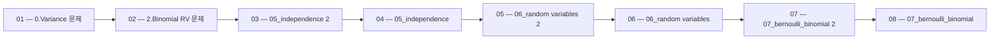

 > [!abstract] 사용법
 > 이 지도는 현재 폴더의 원본 PDF를 파일 순서대로 묶어 **강의 진행 → 핵심 단서 → 점검 포인트**를 연결합니다. 세부 개념은 같은 폴더의 주제 노트와 함께 대조하세요.

## 강의 흐름



<Tabs>
  <Tab label="파일 순서">파일명에 포함된 주차·장·버전 표기를 먼저 읽어 강의의 큰 흐름을 잡습니다.</Tab>
  <Tab label="중복 자료">같은 접두사나 버전이 겹치면 앞 자료를 기준으로 뒤 자료의 보충·실습 여부를 비교합니다.</Tab>
  <Tab label="검증">파일명과 쪽수는 탐색용 단서입니다. 정의·식·코드·도식은 각 원본 PDF에서 다시 확인합니다.</Tab>
</Tabs>

## 원본 PDF 목록

| 파일 | 쪽수 | 확인 메모 |
| :-- | --: | :-- |
| 0.Variance 문제.pdf | 1 | 원본 첫 페이지·본문 대조 |
| 2.Binomial RV 문제.pdf | 3 | 원본 첫 페이지·본문 대조 |
| 05_independence 2.pdf | 29 | 원본 첫 페이지·본문 대조 |
| 05_independence.pdf | 29 | 원본 첫 페이지·본문 대조 |
| 06_random variables 2.pdf | 39 | 원본 첫 페이지·본문 대조 |
| 06_random variables.pdf | 39 | 원본 첫 페이지·본문 대조 |
| 07_bernoulli_binomial 2.pdf | 42 | 원본 첫 페이지·본문 대조 |
| 07_bernoulli_binomial.pdf | 42 | 원본 첫 페이지·본문 대조 |
| 09_continuous_rv 2.pdf | 42 | 원본 첫 페이지·본문 대조 |
| 09_continuous_rv.pdf | 42 | 원본 첫 페이지·본문 대조 |
| 10_normal_gaussian 2.pdf | 40 | 원본 첫 페이지·본문 대조 |
| 10_normal_gaussian.pdf | 40 | 원본 첫 페이지·본문 대조 |
| 11_joint_rvs 2.pdf | 36 | 원본 첫 페이지·본문 대조 |
| 11_joint_rvs.pdf | 36 | 원본 첫 페이지·본문 대조 |
| 12_independent_rvs 2.pdf | 24 | 원본 첫 페이지·본문 대조 |
| 12_independent_rvs.pdf | 24 | 원본 첫 페이지·본문 대조 |
| 13_joint_statistics 2.pdf | 39 | 원본 첫 페이지·본문 대조 |
| 13_joint_statistics.pdf | 39 | 원본 첫 페이지·본문 대조 |
| 14_conditional_expectation 2.pdf | 24 | 원본 첫 페이지·본문 대조 |
| 14_conditional_expectation.pdf | 24 | 원본 첫 페이지·본문 대조 |
| 15_general_inference 2.pdf | 45 | 원본 첫 페이지·본문 대조 |
| 15_general_inference.pdf | 45 | 원본 첫 페이지·본문 대조 |
| 16_continous_joint_probability_i 2.pdf | 45 | 원본 첫 페이지·본문 대조 |
| 16_continous_joint_probability_i.pdf | 45 | 원본 첫 페이지·본문 대조 |
| 17_continous_joint_probability_iI 2.pdf | 39 | 원본 첫 페이지·본문 대조 |
| 17_continous_joint_probability_iI.pdf | 39 | 원본 첫 페이지·본문 대조 |
| 19_sampling_bootstrap 2.pdf | 74 | 원본 첫 페이지·본문 대조 |
| 19_sampling_bootstrap.pdf | 74 | 원본 첫 페이지·본문 대조 |
| 20_mle 2.pdf | 58 | 원본 첫 페이지·본문 대조 |
| 20_mle.pdf | 58 | 원본 첫 페이지·본문 대조 |
| 22_map 2.pdf | 32 | 원본 첫 페이지·본문 대조 |
| 22_map.pdf | 32 | 원본 첫 페이지·본문 대조 |
| 23_naive_bayes.pdf | 58 | 원본 첫 페이지·본문 대조 |
| Bayes theorem 문제.pdf | 2 | 원본 첫 페이지·본문 대조 |
| Bernoulli RV 문제.pdf | 1 | 원본 첫 페이지·본문 대조 |
| Combinations 문제.pdf | 3 | 원본 첫 페이지·본문 대조 |
| Continuous RVs 문제.pdf | 4 | 원본 첫 페이지·본문 대조 |
| Counting 문제.pdf | 3 | 원본 첫 페이지·본문 대조 |
| Independence 문제.pdf | 1 | 원본 첫 페이지·본문 대조 |
| Normal RV 문제.pdf | 5 | 원본 첫 페이지·본문 대조 |
| Permutations 문제.pdf | 2 | 원본 첫 페이지·본문 대조 |
| Poisson 문제.pdf | 2 | 원본 첫 페이지·본문 대조 |
| Probability 문제.pdf | 4 | 원본 첫 페이지·본문 대조 |
| Random Variables 문제.pdf | 1 | 원본 첫 페이지·본문 대조 |

## 원본 단계 인터랙티브

```html preview
<div style="font-family:system-ui,sans-serif;padding:20px;color:var(--foreground)">
  <label for="flow263368343" style="font-size:14px;font-weight:600">원본 자료 단계</label>
  <div id="flow263368343-out" style="font-size:24px;font-weight:700;color:var(--chart-1);margin:6px 0">0.Variance 문제</div>
  <input id="flow263368343" type="range" min="1" max="44" step="1" value="1" style="width:100%;accent-color:var(--primary)" />
  <p style="font-size:13px;color:var(--muted-foreground)">슬라이더를 움직이면 파일명 순서대로 자료의 위치를 확인합니다.</p>
  <script>
    var flow263368343 = document.getElementById('flow263368343');
    var flow263368343Out = document.getElementById('flow263368343-out');
    var flow263368343Steps = ["0.Variance 문제","2.Binomial RV 문제","05_independence 2","05_independence","06_random variables 2","06_random variables","07_bernoulli_binomial 2","07_bernoulli_binomial","09_continuous_rv 2","09_continuous_rv","10_normal_gaussian 2","10_normal_gaussian","11_joint_rvs 2","11_joint_rvs","12_independent_rvs 2","12_independent_rvs","13_joint_statistics 2","13_joint_statistics","14_conditional_expectation 2","14_conditional_expectation","15_general_inference 2","15_general_inference","16_continous_joint_probability_i 2","16_continous_joint_probability_i","17_continous_joint_probability_iI 2","17_continous_joint_probability_iI","19_sampling_bootstrap 2","19_sampling_bootstrap","20_mle 2","20_mle","22_map 2","22_map","23_naive_bayes","Bayes theorem 문제","Bernoulli RV 문제","Combinations 문제","Continuous RVs 문제","Counting 문제","Independence 문제","Normal RV 문제","Permutations 문제","Poisson 문제","Probability 문제","Random Variables 문제"];
    flow263368343.addEventListener('input', function () {
      flow263368343Out.textContent = flow263368343Steps[Number(flow263368343.value) - 1] || '';
    });
  </script>
</div>
```

## 점검 포인트

- **범위:** 44개 PDF, 총 1306쪽.
- **근거:** 쪽수와 파일명은 현재 sources/ 디렉터리에서 직접 수집했습니다.
- **학습 순서:** 흐름도와 슬라이더를 먼저 훑은 뒤, 주제 노트의 정의·절차·실습 결과를 순서대로 대조합니다.

> [!warning] 과해석 방지
> 이 지도에는 파일명·쪽수·확인 메모만 기록했습니다. PDF에 없는 구현 세부, 성능 수치, 권장 설정은 추가하지 않습니다.

<details>
<summary>다음 읽기</summary>

현재 단계의 원본을 열어 제목·절차·도식을 확인한 뒤, 같은 폴더의 주제 노트에 해당 근거가 반영되었는지 점검하세요.

</details>
