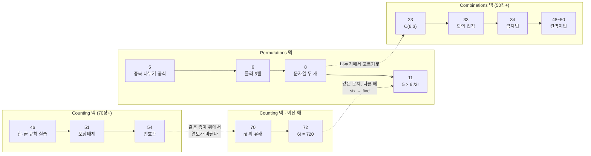
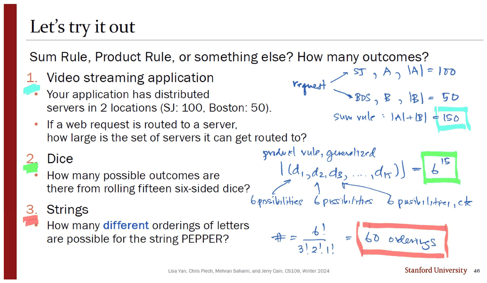
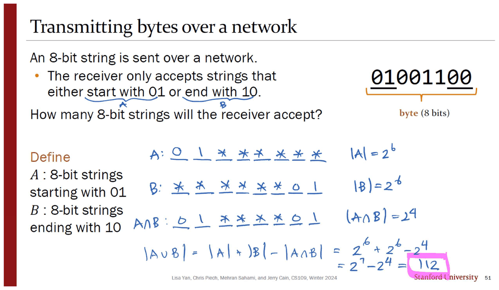
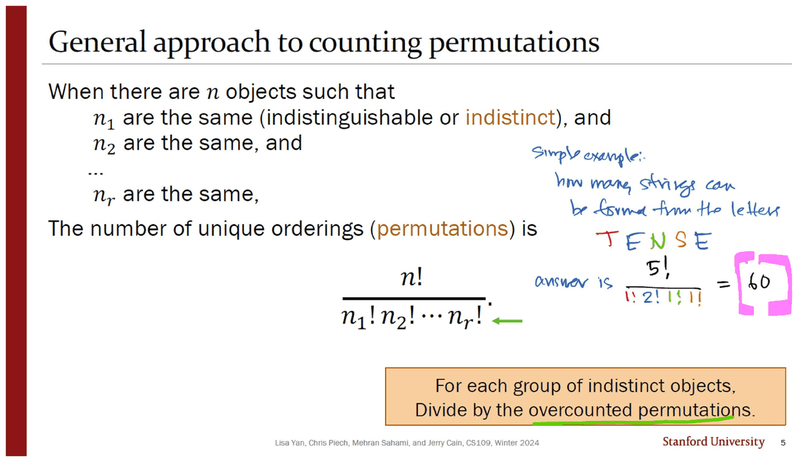
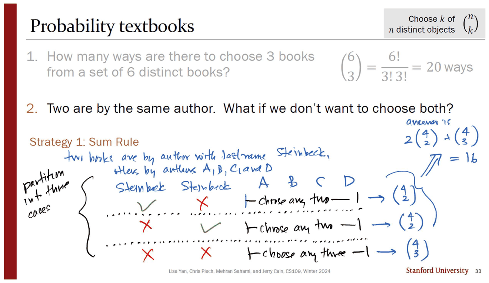
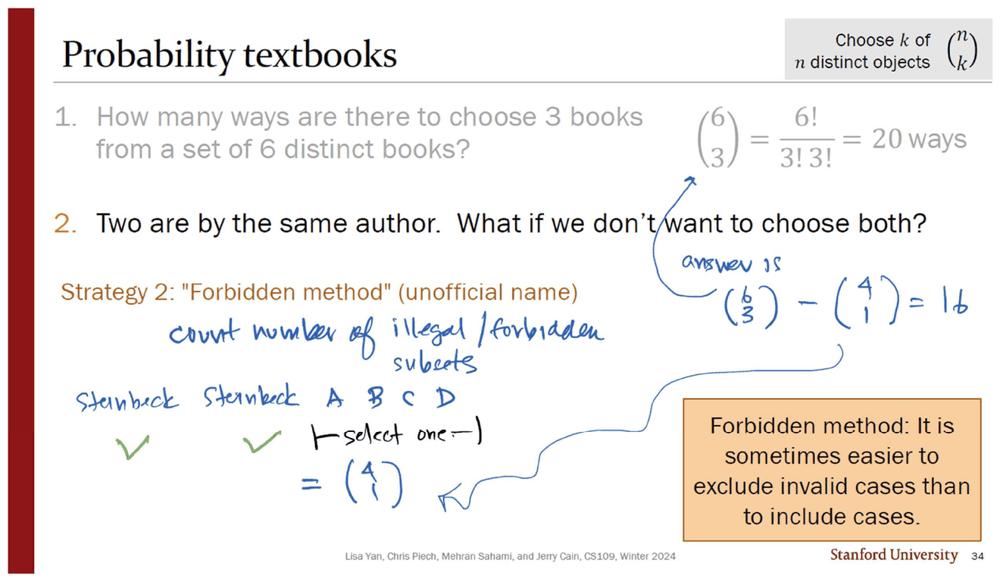
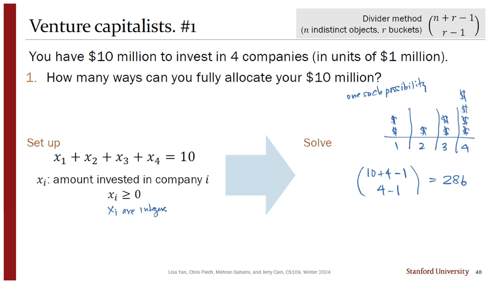

> [!abstract] 이 문서가 다루는 것
> `sources/` 에는 강의 PDF가 **05번부터** 있다. 01~04번 강의는 없다. 그런데 그 강의들이 다뤘을 내용 — 세는 법, 순열, 조합 — 의 **문제지 세 편은 남아 있다**. A4 한 장에 슬라이드를 두 장씩 얹은 유인물이고, 여백은 파랑·초록·빨강·분홍 네 색의 잉크로 채워져 있다.
>
> 이 세 편은 「연습문제 모음」이 아니다. 슬라이드 하단의 번호가 **46 · 51 · 54 · 70 · 72 · 5 · 6 · 8 · 11 · 23 · 33 · 34 · 48 · 49 · 50** 으로 흩어져 있어서, **원래 강의가 적어도 70장이 넘는 덱이었다는 사실**을 역산하게 해 준다. 남은 것은 그 덱의 열다섯 장이다.

---

## 남은 열다섯 장이 가리키는 것

세 파일을 슬라이드 번호 순이 아니라 **인쇄된 순서 그대로** 늘어놓으면 이렇게 된다.

| 파일 | 쪽 | 위치 | 슬라이드 번호 | 하단 연도 | 제목 |
| --- | --- | --- | --- | --- | --- |
| `Counting 문제` | 1 | 위 | 46 | Winter 2024 | Let's try it out |
| `Counting 문제` | 1 | 아래 | 51 | Winter 2024 | Transmitting bytes over a network |
| `Counting 문제` | 2 | 위 | 54 | Winter 2024 | License plates |
| `Counting 문제` | 2 | 아래 | **70** | **Winter 2023** | Arrange $n$ distinct objects |
| `Counting 문제` | 3 | 위 | **72** | **Winter 2023** | Unique 6-digit passcodes with **six** smudges |
| `Counting 문제` | 3 | 아래 | — | — | *(백지)* |
| `Permutations 문제` | 1 | 위 | 5 | Winter 2024 | General approach to counting permutations |
| `Permutations 문제` | 1 | 아래 | 6 | Winter 2024 | Sort semi-distinct objects |
| `Permutations 문제` | 2 | 위 | 8 | Winter 2024 | Strings |
| `Permutations 문제` | 2 | 아래 | 11 | Winter 2024 | Unique 6-digit passcodes with **five** smudges |
| `Combinations 문제` | 1 | 위 | 23 | Winter 2024 | Probability textbooks |
| `Combinations 문제` | 1 | 아래 | 33 | Winter 2024 | Probability textbooks — Strategy 1 |
| `Combinations 문제` | 2 | 위 | 34 | Winter 2024 | Probability textbooks — Strategy 2 |
| `Combinations 문제` | 2 | 아래 | 48 | Winter 2024 | Venture capitalists. #1 |
| `Combinations 문제` | 3 | 위 | 49 | Winter 2024 | Venture capitalists. #2 |
| `Combinations 문제` | 3 | 아래 | 50 | Winter 2024 | Venture capitalists. #3 |

두 가지가 즉시 보인다.

**첫째, 한 유인물 안에 두 해의 덱이 섞여 있다.** `Counting 문제` 2쪽은 위가 Winter 2024의 54번, 아래가 Winter **2023**의 70번이다. 같은 종이 한 장 위에서 연도가 바뀐다. 그래서 46 → 51 → 54 → 70 → 72 라는 번호 진행을 「한 강의의 흐름」으로 읽으면 안 된다. 54와 70 사이에는 열여섯 장이 아니라 **한 해**가 있다.

**둘째, 번호가 두 계열이다.** 40~72번대(Counting)와 5~11번대(Permutations), 23~50번대(Combinations). 슬라이드 5번이 이미 「$n!/(n_1!\,n_2!\cdots n_r!)$」라는 완성된 일반 공식을 제시한다는 것은, 그 앞 네 장이 이미 단순 순열을 끝냈다는 뜻이다. **문제지는 강의의 시작이 아니라 각 강의의 중반 이후만 잘라 온 것이다.**



> [!warning] 이 지도는 복원이지 원본이 아니다
> 화살표 중 실선만 원본에서 직접 확인된 순서(같은 파일 안에서 번호가 증가한다)이고, 점선은 이 문서가 슬라이드 번호·연도 표기·문제의 동일성으로부터 **추론한 연결**이다. 사라진 강의 PDF가 복구되면 점선은 바뀔 수 있다.

---

## 곱하기 — 그리고 곱하면 안 되는 자리

`Counting 문제` 1쪽 위(46번)는 세 문항을 한 화면에 세워 놓고 「합의 법칙인가, 곱의 법칙인가, 아니면 다른 것인가」를 묻는다. 셋을 고른 이유가 분명하다. **답이 각각 다른 규칙이기 때문이다.**



| 문항 | 잉크가 세운 식 | 값 | 규칙 |
| --- | --- | --- | --- |
| 서버 두 곳(SJ 100대, Boston 50대)으로 라우팅 | $\lvert A\rvert+\lvert B\rvert$ | **150** | 합의 법칙 |
| 주사위 열다섯 개 굴리기 | $\lvert (d_1,d_2,\dots,d_{15})\rvert = 6^{15}$ | **470,184,984,576** | 곱의 법칙(일반화) |
| `PEPPER` 의 서로 다른 배열 | $\dfrac{6!}{3!\,2!\,1!}$ | **60** | 둘 다 아님 — **나눗셈** |

세 번째 답이 이 문서의 제목이다. 잉크는 앞의 두 문항 옆에 「sum rule」·「product rule, generalized」라고 규칙 이름을 써 넣었는데, 세 번째 옆에는 **이름을 쓰지 않고 식만 쓴다.** 규칙에 이름이 없어서가 아니라, 그 이름(순열)이 아직 강의에 등장하지 않았기 때문으로 읽힌다 — 이름은 `Permutations` 덱 5번에서 붙는다.

곱의 법칙이 곧장 깨지는 자리도 바로 다음 장이다.



8비트 문자열 중 「`01` 로 시작하거나 `10` 으로 끝나는」 것의 개수. 잉크는 자리를 밑줄로 그려 놓고 세어 나간다.

$$\lvert A\rvert = 2^6 = 64,\qquad \lvert B\rvert = 2^6 = 64,\qquad \lvert A\cap B\rvert = 2^4 = 16$$
$$\lvert A\cup B\rvert = 64 + 64 - 16 = \mathbf{112}$$

`01******` 과 `******10` 은 **동시에 성립할 수 있다**(`01****10`). 그래서 합의 법칙이 그대로는 안 되고, 겹친 만큼 한 번 빼야 한다. 앞 장의 서버 문제에서 합의 법칙이 통했던 이유도 여기서 드러난다 — 한 요청이 SJ와 Boston에 동시에 갈 수는 없기 때문이다. **원본은 그 대비를 말로 설명하지 않는다. 두 장을 나란히 놓았을 뿐이다.**

---

## 나누기 — 과다 계산을 되돌리는 한 번의 연산

`Permutations 문제` 1쪽 위(5번)가 이 문서의 중심 슬라이드다. 공식이 먼저 나오고, 그 아래 주황 상자가 공식의 **의미**를 한 줄로 번역한다.



> For each group of indistinct objects, **divide by the overcounted permutations.**

잉크는 이 공식 옆에 곧장 예제를 만들어 붙인다 — `TENSE`, 다섯 글자, `E` 가 둘.

$$\frac{5!}{1!\,2!\,1!\,1!} = \frac{120}{2} = \mathbf{60}$$

분모에 `1!` 세 개를 **굳이 적었다**는 점이 중요하다. 값은 바뀌지 않지만, 「글자 종류마다 하나씩 인수가 있다」는 공식의 구조를 눈으로 보여 준다. 같은 잉크가 슬라이드 8번에서는 그 습관을 버리고 겹치는 글자만 적는다(`12!/(2!2!2!)`). 공식을 익히는 두 단계가 세 장 안에서 지나간다.

원본이 이 공식으로 처리하는 네 문자열의 값을 전부 계산해 대조했다.

```html preview
<div id="perm-root">
  <style>
    #perm-root{font-family:system-ui,-apple-system,"Segoe UI",sans-serif;color:var(--foreground);padding:4px}
    #perm-root .panel{background:var(--card);border:1px solid var(--border);border-radius:10px;padding:14px}
    #perm-root .chips{display:flex;flex-wrap:wrap;gap:6px;margin-bottom:10px}
    #perm-root button{background:var(--card);color:var(--foreground);border:1px solid var(--border);border-radius:6px;padding:5px 10px;font:inherit;font-size:13px;cursor:pointer}
    #perm-root button.on{border-color:var(--chart-1);background:color-mix(in srgb,var(--chart-1) 16%,transparent)}
    #perm-root input[type=text]{background:var(--card);color:var(--foreground);border:1px solid var(--border);border-radius:6px;padding:6px 9px;font:inherit;width:230px;letter-spacing:.06em}
    #perm-root .letters{display:flex;flex-wrap:wrap;gap:5px;margin:12px 0}
    #perm-root .lt{border:1px solid var(--border);border-radius:6px;padding:4px 9px;font-family:ui-monospace,SFMono-Regular,Menlo,monospace;font-size:13px}
    #perm-root .out{margin-top:10px;padding:10px 12px;border:1px solid var(--border);border-radius:8px;line-height:1.75;font-size:14px}
    #perm-root .frac{display:inline-block;text-align:center;vertical-align:middle;margin:0 3px}
    #perm-root .frac span{display:block;padding:0 4px}
    #perm-root .frac .den{border-top:1px solid var(--foreground)}
    #perm-root .src{font-size:12px;opacity:.72;margin-top:8px}
    #perm-root code{font-family:ui-monospace,SFMono-Regular,Menlo,monospace}
  </style>
  <div class="panel">
    <div class="chips" id="perm-chips"></div>
    <div><input type="text" id="perm-in" value="PEPPER" spellcheck="false" aria-label="문자열 입력"></div>
    <div class="letters" id="perm-lt"></div>
    <div class="out" id="perm-out"></div>
    <div class="src" id="perm-src"></div>
  </div>
</div>
<script>
(function(){
  var R=document.getElementById('perm-root');
  var SRC={
    'PEPPER':'Counting 문제 1쪽 위 (슬라이드 46, 3번 문항) — 잉크가 6!/(3!2!1!) = 60 이라 적었다.',
    'TENSE':'Permutations 문제 1쪽 위 (슬라이드 5) — 잉크가 5!/(1!2!1!1!) = 60 이라 적었다.',
    'SUBCOMMITTEE':'Permutations 문제 2쪽 위 (슬라이드 8, 1번) — 잉크: 12 letters, 2 M’s, 2 T’s, 2 E’s → 12!/(2!2!2!).',
    'MISSISSIPPI':'Permutations 문제 2쪽 위 (슬라이드 8, 2번) — 잉크: 11 letters, 4 I’s, 4 S’s, 2 P’s → 11!/(4!4!2!).'
  };
  function fact(n){var r=1n; for(var i=2n;i<=BigInt(n);i++) r*=i; return r;}
  function group(s){
    var m={},o=[];
    for(var i=0;i<s.length;i++){var c=s[i]; if(!(c in m)){m[c]=0;o.push(c);} m[c]++;}
    return o.map(function(c){return [c,m[c]];});
  }
  function fmt(b){return b.toString().replace(/\B(?=(\d{3})+(?!\d))/g,',');}
  function draw(){
    var s=R.querySelector('#perm-in').value.toUpperCase().replace(/[^A-Z]/g,'');
    R.querySelector('#perm-in').value=s;
    var g=group(s), n=s.length;
    R.querySelector('#perm-lt').innerHTML=g.map(function(p){
      return '<span class="lt"'+(p[1]>1?' style="border-color:var(--chart-1)"':'')+'>'+p[0]+' × '+p[1]+'</span>';}).join('');
    var den=1n; g.forEach(function(p){den*=fact(p[1]);});
    var total=n?fact(n)/den:0n;
    var dtxt=g.map(function(p){return p[1]+'!';}).join('·');
    var html='<div><span class="frac"><span class="num">'+n+'!</span><span class="den">'+(dtxt||'1')+'</span></span> = <b style="color:var(--chart-1)">'+fmt(total)+'</b> 가지</div>';
    var dup=g.filter(function(p){return p[1]>1;});
    if(!dup.length && n) html+='<div style="opacity:.78;margin-top:6px">겹치는 글자가 없으므로 분모가 1이다 — 나눌 것이 없고 '+n+'! 이 그대로 답이다.</div>';
    else if(n) html+='<div style="opacity:.78;margin-top:6px">겹치는 글자 '+dup.length+'종이 만드는 과다 계산 배수는 '+fmt(den)+' 배다. 순서를 구분해 센 '+fmt(fact(n))+' 가지를 그만큼 나눈다.</div>';
    R.querySelector('#perm-out').innerHTML=html;
    R.querySelector('#perm-src').textContent=SRC[s]||'원본에 없는 문자열이다 — 공식만 같은 방식으로 적용했다.';
    R.querySelectorAll('#perm-chips button').forEach(function(b){b.className=(b.textContent===s?'on':'');});
  }
  R.querySelector('#perm-chips').innerHTML=Object.keys(SRC).map(function(k){return '<button>'+k+'</button>';}).join('');
  R.addEventListener('click',function(e){ if(e.target.tagName==='BUTTON'){R.querySelector('#perm-in').value=e.target.textContent; draw();} });
  R.querySelector('#perm-in').addEventListener('input',draw);
  draw();
})();
</script>
```

`SUBCOMMITTEE` 는 **59,875,200**, `MISSISSIPPI` 는 **34,650** 이다. 두 값 모두 원본에는 식만 있고 수치는 없다 — 잉크도 분수까지만 적고 멈췄다. 위 계산기의 값은 이 문서가 파이썬으로 계산해 확인한 것이다.

슬라이드 6번의 콜라 다섯 캔(`Coke` 2 · `Coke0` 3)은 $5!/(2!3!) = 10$ 이고, 이것이 바로 다음 절의 조합 $\binom{5}{2}$ 와 같은 수다. **원본은 그 일치를 지적하지 않는다.** 두 개를 고르는 일과 두 개를 같은 것으로 두고 줄 세우는 일이 같은 셈이라는 사실이, 순열 덱과 조합 덱 사이의 다리인데 그 다리는 인쇄되지 않았다.

---

## 같은 답에 이르는 두 길 — 16

`Combinations 문제` 1쪽 아래와 2쪽 위는 **같은 문제를 두 번 푼다.** 여섯 권 중 세 권을 고르되, 같은 저자의 책 두 권을 함께 고르지 않는 경우의 수.



**전략 1(합의 법칙).** 잉크가 Steinbeck 두 권을 왼쪽에 세우고 체크·엑스로 세 경우를 직접 그린다.

$$\underbrace{\binom{4}{2}}_{\text{첫 Steinbeck 포함}} + \underbrace{\binom{4}{2}}_{\text{둘째 포함}} + \underbrace{\binom{4}{3}}_{\text{둘 다 제외}} = 6 + 6 + 4 = \mathbf{16}$$



**전략 2(금지법).** 전체에서 위반 사례만 뺀다. 두 Steinbeck을 이미 고른 뒤 남은 넷 중 하나를 더 고르면 위반이다.

$$\binom{6}{3} - \binom{4}{1} = 20 - 4 = \mathbf{16}$$

원본이 전략 2에 붙인 주황 상자가 이 대비의 교훈을 적어 놓았다 — *"It is sometimes easier to exclude invalid cases than to include cases."* 여기서는 「가끔」이 아니라 **항상** 더 쉽다. 전략 1은 경우를 셋으로 쪼개고 각각 세지만, 전략 2는 뺄셈 하나다. 아래에서 스무 개의 부분집합을 전부 펼쳐 두 길이 같은 열여섯 개를 가리키는지 확인할 수 있다.

```html preview
<div id="books-root">
  <style>
    #books-root{font-family:system-ui,-apple-system,"Segoe UI",sans-serif;color:var(--foreground);padding:4px}
    #books-root .panel{background:var(--card);border:1px solid var(--border);border-radius:10px;padding:14px}
    #books-root .row{display:flex;flex-wrap:wrap;gap:8px;align-items:center;margin-bottom:10px}
    #books-root button{background:var(--card);color:var(--foreground);border:1px solid var(--border);border-radius:6px;padding:5px 10px;font:inherit;font-size:13px;cursor:pointer}
    #books-root button.on{border-color:var(--chart-2);background:color-mix(in srgb,var(--chart-2) 16%,transparent)}
    #books-root .grid{display:grid;grid-template-columns:repeat(auto-fill,minmax(122px,1fr));gap:6px;margin-top:6px}
    #books-root .cell{border:1px solid var(--border);border-radius:7px;padding:6px 7px;font-size:12px;font-family:ui-monospace,SFMono-Regular,Menlo,monospace;text-align:center;transition:background .12s}
    #books-root .bad{opacity:.4;text-decoration:line-through}
    #books-root .hit{border-color:var(--chart-1);background:color-mix(in srgb,var(--chart-1) 18%,transparent)}
    #books-root .out{margin-top:11px;padding:10px 12px;border:1px solid var(--border);border-radius:8px;font-size:14px;line-height:1.7}
  </style>
  <div class="panel">
    <div class="row">
      <span style="font-size:13px;opacity:.75">보기</span>
      <button data-m="all" class="on">스무 개 전부</button>
      <button data-m="s1">전략 1 — 세 경우</button>
      <button data-m="s2">전략 2 — 금지 목록</button>
    </div>
    <div class="grid" id="books-grid"></div>
    <div class="out" id="books-out"></div>
  </div>
</div>
<script>
(function(){
  var R=document.getElementById('books-root');
  var B=['S1','S2','A','B','C','D'], mode='all';
  var subs=[];
  for(var i=0;i<6;i++)for(var j=i+1;j<6;j++)for(var k=j+1;k<6;k++) subs.push([i,j,k]);
  function has(s,x){return s.indexOf(x)>=0;}
  function draw(){
    var g='';
    subs.forEach(function(s){
      var both=has(s,0)&&has(s,1), cls='cell';
      if(mode==='all') cls+= both?' bad':'';
      else if(mode==='s2') cls+= both?' hit':' bad';
      else { // s1
        cls+= both?' bad':' hit';
      }
      g+='<div class="'+cls+'">'+s.map(function(x){return B[x];}).join(' ')+'</div>';
    });
    R.querySelector('#books-grid').innerHTML=g;
    var txt;
    if(mode==='all') txt='여섯 권에서 세 권을 고르는 모든 방법은 <b>C(6,3) = 20</b> 가지다. 흐리게 처리된 <b>4</b> 가지가 Steinbeck 두 권(S1·S2)을 함께 담고 있다.';
    else if(mode==='s1') txt='전략 1은 남는 <b>16</b> 가지를 「S1만 · S2만 · 둘 다 아님」 세 덩어리로 나눠 C(4,2)+C(4,2)+C(4,3) = 6+6+4 로 센다.';
    else txt='전략 2는 지워야 할 <b>4</b> 가지만 센다 — S1·S2를 먼저 넣고 남은 넷 중 하나를 더 고르는 C(4,1) = 4. 20 − 4 = <b>16</b>.';
    R.querySelector('#books-out').innerHTML=txt;
    R.querySelectorAll('.row button').forEach(function(b){b.className=(b.dataset.m===mode?'on':'');});
  }
  R.addEventListener('click',function(e){ if(e.target.dataset.m){mode=e.target.dataset.m;draw();} });
  draw();
})();
</script>
```

> [!note] 같은 제목이 세 번
> 슬라이드 23·33·34가 전부 「Probability textbooks」다. 23번은 단순히 $\binom{6}{3}=20$ 을 묻고, 33·34번은 저자 제약이 붙은 **다른 문제**다. 제목만으로는 구분되지 않아서, 유인물에서는 1쪽 위와 1쪽 아래가 같은 문제인 것처럼 보인다. 잉크가 33번 왼쪽에 「partition into three cases」라고 써 넣은 것은 그 혼동을 끊으려는 표시로 읽힌다.

---

## 칸막이 — 나누지도 고르지도 않는 셋째 길

마지막 세 장(48·49·50)은 앞의 두 도구가 다 듣지 않는 문제를 가져온다. **1천만 달러를 100만 달러 단위로 네 회사에 배분하는 방법의 수.**



$$x_1+x_2+x_3+x_4 = 10,\qquad x_i \ge 0$$

잉크가 슬라이드 오른쪽에 **달러 기호와 세로 막대**를 직접 그려 놓았다 — `$$ | $ | $$ | $$$$`. 이것이 칸막이법의 전부다. 열 개의 동일한 달러와 세 개의 칸막이를 일렬로 놓으면 배분이 하나 정해지고, 그 배열의 수가 답이다.

$$\binom{n+r-1}{r-1} = \binom{10+4-1}{4-1} = \binom{13}{3} = \mathbf{286}$$

세 문항이 같은 틀을 세 번 비트는 구조다.

| 문항 | 원본의 조건 | 잉크가 바꾼 것 | 식 | 값 |
| --- | --- | --- | --- | --- |
| #1 | $x_i \ge 0$, 전액 배분 | — | $\binom{13}{3}$ | **286** |
| #2 | 1번 회사에 최소 300만 | 「300만을 먼저 떼고 남은 700만을 자유 배분」 → $\sum x_i = 7$ | $\binom{10}{3}$ | **120** |
| #3 | 전액을 다 쓰지 않아도 됨 | **다섯 번째 변수 $x_5$ 를 만들어 「쓰지 않은 돈」을 담게 한다** | $\binom{14}{4}$ | **1001** |

**#3** 의 잉크 한 줄이 이 세 장의 핵심이다 — *"$x_1+x_2+x_3+x_4+\boxed{x_5}=10$, where $x_5$ counts the money you don't invest."* 부등식을 등식으로 되돌리는 조작이고, 원본 슬라이드는 이 변수를 **인쇄하지 않았다.** 인쇄된 것은 $\le$ 옆의 노란 경고 삼각형 하나뿐이다. 경고만 있고 해법은 잉크에 있다.

```html preview
<div id="star-root">
  <style>
    #star-root{font-family:system-ui,-apple-system,"Segoe UI",sans-serif;color:var(--foreground);padding:4px}
    #star-root .panel{background:var(--card);border:1px solid var(--border);border-radius:10px;padding:14px}
    #star-root .row{display:flex;align-items:center;gap:9px;margin:8px 0;font-size:13px;flex-wrap:wrap}
    #star-root input[type=range]{flex:1;min-width:120px;accent-color:var(--chart-1)}
    #star-root button{background:var(--card);color:var(--foreground);border:1px solid var(--border);border-radius:6px;padding:5px 10px;font:inherit;font-size:13px;cursor:pointer}
    #star-root button.on{border-color:var(--chart-1);background:color-mix(in srgb,var(--chart-1) 16%,transparent)}
    #star-root .out{margin-top:10px;padding:10px 12px;border:1px solid var(--border);border-radius:8px;font-size:14px;line-height:1.75}
    #star-root code{font-family:ui-monospace,SFMono-Regular,Menlo,monospace}
  </style>
  <div class="panel">
    <div class="row">
      <button data-p="1" class="on">#1 전액 배분</button>
      <button data-p="2">#2 1번에 최소 3</button>
      <button data-p="3">#3 남겨도 됨</button>
    </div>
    <div class="row"><span style="opacity:.7;width:74px">금액 n</span><input type="range" id="star-n" min="1" max="14" step="1" value="10"><b id="star-nv" style="width:26px;text-align:right">10</b></div>
    <div class="row"><span style="opacity:.7;width:74px">회사 r</span><input type="range" id="star-r" min="2" max="6" step="1" value="4"><b id="star-rv" style="width:26px;text-align:right">4</b></div>
    <svg id="star-svg" width="100%" height="96" viewBox="0 0 640 96" role="img" aria-label="별과 칸막이 배열 그림"></svg>
    <div class="out" id="star-out"></div>
  </div>
</div>
<script>
(function(){
  var R=document.getElementById('star-root'), prob='1';
  function comb(n,k){ if(k<0||k>n) return 0n; var r=1n,N=BigInt(n); for(var i=1n;i<=BigInt(k);i++) r=r*(N-i+1n)/i; return r; }
  function fmt(b){return b.toString().replace(/\B(?=(\d{3})+(?!\d))/g,',');}
  function draw(){
    var n=+R.querySelector('#star-n').value, r=+R.querySelector('#star-r').value;
    R.querySelector('#star-nv').textContent=n; R.querySelector('#star-rv').textContent=r;
    var eff=n, effr=r, note='';
    if(prob==='2'){ eff=Math.max(0,n-3); note='1번 회사에 3을 먼저 떼어 두면 남은 '+eff+' 을 자유 배분하는 문제가 된다.'; }
    if(prob==='3'){ effr=r+1; note='쓰지 않은 돈을 담는 가상의 '+ (r+1) +'번째 칸을 더한다.'; }
    var total=comb(eff+effr-1, effr-1);
    var g='', x=18, unit=Math.min(30, 600/(eff+effr));
    for(var i=0;i<eff;i++){ g+='<circle cx="'+(x+unit/2)+'" cy="34" r="'+Math.min(9,unit/3)+'" fill="var(--chart-1)"/>'; x+=unit; }
    for(var j=0;j<effr-1;j++){ g+='<rect x="'+(x+unit/2-2)+'" y="16" width="4" height="36" rx="1.5" fill="var(--chart-4)"/>'; x+=unit; }
    g+='<text x="18" y="74" font-size="12" fill="var(--foreground)" opacity=".75">동일한 금액 '+eff+' 개 + 칸막이 '+(effr-1)+' 개 = 자리 '+(eff+effr-1)+' 개</text>';
    R.querySelector('#star-svg').innerHTML=g;
    var html='<code>C('+(eff+effr-1)+', '+(effr-1)+') = <b style="color:var(--chart-1)">'+fmt(total)+'</b></code>';
    if(note) html+='<div style="opacity:.78;margin-top:6px">'+note+'</div>';
    var orig={'1':[10,4,'286'],'2':[10,4,'120'],'3':[10,4,'1001']}[prob];
    if(n===orig[0]&&r===orig[1]) html+='<div style="margin-top:6px;color:var(--chart-2)">원본 슬라이드 '+(47+ +prob)+'번의 값과 일치한다 — '+orig[2]+'.</div>';
    R.querySelector('#star-out').innerHTML=html;
    R.querySelectorAll('.row button').forEach(function(b){b.className=(b.dataset.p===prob?'on':'');});
  }
  R.addEventListener('input',draw);
  R.addEventListener('click',function(e){ if(e.target.dataset.p){prob=e.target.dataset.p;draw();} });
  draw();
})();
</script>
```

여기서 세 도구가 한 줄로 정리된다.

- **곱한다** — 자리마다 선택이 독립이고 모든 결과가 구별될 때(주사위 열다섯, 번호판)
- **곱한 뒤 나눈다** — 구별할 수 없는 것을 구별해서 세 버렸을 때(`PEPPER`, 콜라, 여섯 권 중 세 권)
- **자리를 만들어 배열한다** — 나눌 대상 자체가 없을 때, 즉 대상이 전부 동일하고 **칸**만 다를 때(1천만 달러)

세 번째가 첫째와 둘째의 특수한 경우가 아니라는 점이 이 세 장의 요지다. $\binom{13}{3}$ 의 13은 어디에도 없던 수 — 달러 열 개와 칸막이 세 개를 합쳐 **새로 만든 자리의 수**다.

---

## 원본에서 확인한 것

> [!caution] 한 유인물 안에서 연도가 바뀐다
> `Counting 문제` 2쪽은 위가 `Lisa Yan, Chris Piech, Mehran Sahami, and Jerry Cain, CS109, **Winter 2024**` (슬라이드 54), 아래가 같은 저자의 `**Winter 2023**` (슬라이드 70)이다. 3쪽의 72번도 Winter 2023이다. 같은 과목의 서로 다른 해 강의자료가 한 유인물로 묶였고, 어느 쪽에도 그 사실을 알리는 표시가 없다. 슬라이드 번호를 흐름으로 읽으면 안 되는 이유다.

<!-- -->
> [!caution] 같은 제목이 서로 다른 세 문제에 붙어 있다
> 「Probability textbooks」가 슬라이드 23·33·34에 모두 붙어 있다. 23번은 제약 없는 $\binom{6}{3}$, 33·34번은 「같은 저자 두 권을 함께 고르지 않는다」는 제약이 붙은 문제다. 유인물에서 두 문제가 같은 쪽 위아래에 놓이면서 제목만으로는 구분되지 않는다.

<!-- -->
> [!caution] 3쪽 아래 절반이 백지다
> 세 유인물을 통틀어 2-up 배치가 깨지는 유일한 자리다. `Counting 문제` 는 슬라이드 다섯 장을 세 쪽에 인쇄했고, 마지막 쪽 아래는 비어 있다. 빠진 슬라이드가 있어서가 아니라 홀수 장이기 때문으로 보이지만, 「여기서 끝」이라는 표시가 없어서 다음 장이 잘린 것처럼 읽힌다.

<!-- -->
> [!note] 같은 문제의 두 판본 — six smudges와 five smudges
> `Counting 문제` 3쪽(2023년 72번)은 여섯 자리 비밀번호에 지문 얼룩이 **여섯 개**인 경우($6! = 720$), `Permutations 문제` 2쪽 아래(2024년 11번)는 **다섯 개**인 경우($5 \times 6!/2! = 1800$)다. 같은 사진, 같은 제목 틀에서 단어 하나가 바뀌었고 난이도가 한 단계 올라간다. 두 장 사이에 아무 연결 표시가 없어서 유인물만 보면 서로 다른 문제로 읽힌다.

<!-- -->
> [!note] 잉크는 분수에서 멈춘다
> 슬라이드 8번의 `SUBCOMMITTEE`·`MISSISSIPPI` 는 잉크가 $12!/(2!2!2!)$·$11!/(4!4!2!)$ 까지만 적고 값을 내지 않았다. 슬라이드 46번의 `PEPPER`(60)와 5번의 `TENSE`(60)는 값까지 적었다. **값이 손으로 계산 가능한 크기일 때만 값을 적는다** — 이 문서가 계산한 59,875,200과 34,650은 원본에 없는 수다.

이 문서에서 값으로 제시한 수는 전부 파이썬(`math.factorial`·`math.comb`)으로 다시 계산해 잉크와 대조했다. **150 · $6^{15}$ · 60 · 112 · 17,576,000 · 175,760,000 · 720 · 1800 · 20 · 16 · 286 · 120 · 1001 — 잉크의 값은 하나도 틀리지 않았다.** 이 점이 다음 문서들에서 기준선이 된다. 인쇄된 슬라이드에는 오식이 있지만([06. 기댓값은 누가 재느냐에 따라 달라진다](<./06. 기댓값은 누가 재느냐에 따라 달라진다.md>)에서 22,625를 22,635로 적은 자리를 다룬다), 잉크는 지금까지 정확하다.

---

## 다음 문서로

여기까지가 **세는 법**이다. 다음 문서는 이렇게 센 것을 분모와 분자에 놓아 **확률**을 만든다 — 그리고 같은 문제를 순서를 고려해 한 번, 고려하지 않고 또 한 번 세어 답이 같은지 확인하는 방식으로 진행된다.

- [02. 확률 — 두 번 세어 같은 답이 나오는지 확인한다](<./02. 확률 — 두 번 세어 같은 답이 나오는지 확인한다.md>)
- [03. 독립 — 정의는 한 줄이고 직관은 매번 틀린다](<./03. 독립 — 정의는 한 줄이고 직관은 매번 틀린다.md>)

## 근거 자료

| 원본 파일 | 쪽 | 슬라이드 | 이 문서에서 쓴 곳 |
| --- | --- | --- | --- |
| `Counting 문제.pdf` | 1 | 46 · 51 | 곱하기 / 포함배제 |
| `Counting 문제.pdf` | 2 | 54 · 70 | 번호판 / 연도가 바뀌는 자리 |
| `Counting 문제.pdf` | 3 | 72 | six smudges |
| `Permutations 문제.pdf` | 1 | 5 · 6 | 나누기 공식 · 콜라 다섯 캔 |
| `Permutations 문제.pdf` | 2 | 8 · 11 | 문자열 두 개 · five smudges |
| `Combinations 문제.pdf` | 1 | 23 · 33 | $\binom{6}{3}$ · 전략 1 |
| `Combinations 문제.pdf` | 2 | 34 · 48 | 전략 2 · 칸막이법 #1 |
| `Combinations 문제.pdf` | 3 | 49 · 50 | 칸막이법 #2 · #3 |

원본 PDF 8쪽, 슬라이드 15장(백지 반쪽 하나 제외). 인용한 슬라이드 이미지 7장은 200 dpi 렌더에서 2-up 유인물의 위·아래를 잘라 만들었다.
