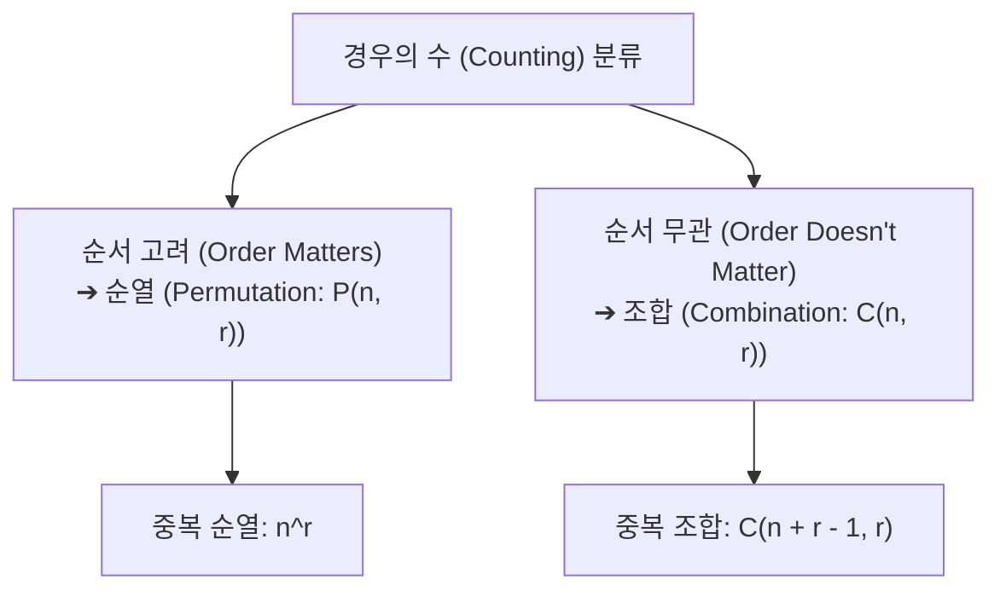
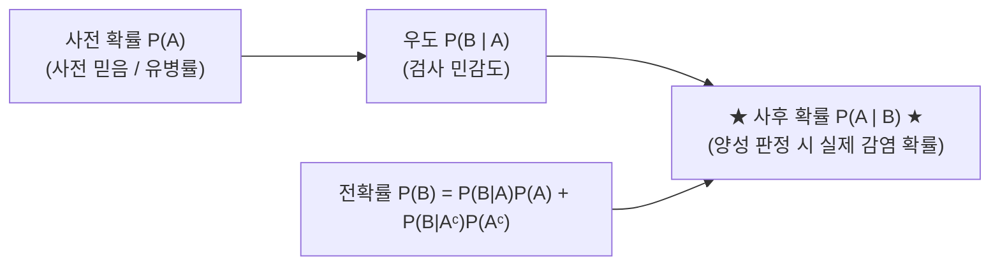

> [!abstract] 핵심 요약
> **경우의 수(Counting)**와 **확률론(Probability Theory)**은 불확실성(Uncertainty)을 정량화하는 컴퓨터 과학과 AI의 수학적 기둥이다.
> 사건의 사전 지식(Prior)에 새로운 관측 데이터(Likelihood)를 결합하여 갱신된 신념도인 **사후 확률(Posterior)**을 계산하는 **베이즈 정리(Bayes' Theorem)**는 현대 머신러닝, 스팸 필터링, 의료 AI 진단 시스템의 기본 작동 원리이다.

---

## 1. 순열(Permutations)과 조합(Combinations)

$$P(n, r) = \frac{n!}{(n - r)!}, \quad \binom{n}{r} = \frac{n!}{r!(n - r)!}$$



---

## 2. 조건부 확률과 베이즈 정리(Bayes' Theorem)



$$P(A \mid B) = \frac{P(B \mid A) P(A)}{P(B)} = \frac{P(B \mid A) P(A)}{P(B \mid A)P(A) + P(B \mid A^c)P(A^c)}$$

---

## 3. 실시간 베이즈 정리 질병 진단 사후 확률(PPV) 시뮬레이터

```html preview
<div style="font-family:system-ui,-apple-system,sans-serif;padding:20px;background:var(--card);color:var(--card-foreground);border:1px solid var(--border);border-radius:var(--radius)">
  <div style="font-size:16px;font-weight:700;margin-bottom:14px;color:var(--primary);display:flex;align-items:center;gap:8px">
    <span>🧬 베이지안 질병 진단 사후 확률 (PPV) 실시간 계산기</span>
  </div>

  <div style="display:grid;grid-template-columns:repeat(3, 1fr);gap:10px;margin-bottom:14px">
    <div>
      <label style="font-size:11px;color:var(--muted-foreground)">사전 유병률 P(D) %:</label>
      <input id="inPrev" type="number" value="1" step="0.1" min="0.01" max="50" style="width:100%;padding:4px 8px;background:var(--background);color:var(--foreground);border:1px solid var(--border);border-radius:var(--radius);font-weight:700" />
    </div>
    <div>
      <label style="font-size:11px;color:var(--muted-foreground)">민감도 P(+|D) % (TPR):</label>
      <input id="inSens" type="number" value="99" step="0.5" min="50" max="100" style="width:100%;padding:4px 8px;background:var(--background);color:var(--foreground);border:1px solid var(--border);border-radius:var(--radius);font-weight:700" />
    </div>
    <div>
      <label style="font-size:11px;color:var(--muted-foreground)">특이도 P(-|Dᶜ) % (TNR):</label>
      <input id="inSpec" type="number" value="95" step="0.5" min="50" max="100" style="width:100%;padding:4px 8px;background:var(--background);color:var(--foreground);border:1px solid var(--border);border-radius:var(--radius);font-weight:700" />
    </div>
  </div>

  <div style="display:grid;grid-template-columns:1fr 1fr;gap:10px;margin-bottom:12px">
    <div style="padding:10px;background:var(--background);border:1px solid var(--border);border-radius:var(--radius)">
      <div style="font-size:11px;color:var(--muted-foreground)">양성 검사 전확률 P(+)</div>
      <div id="probPosOut" style="font-family:monospace;font-size:14px;font-weight:700;color:var(--chart-1);margin-top:2px"></div>
    </div>
    <div style="padding:10px;background:var(--background);border:1px solid var(--border);border-radius:var(--radius)">
      <div style="font-size:11px;color:var(--muted-foreground)">양성 판정 시 실제 감염 사후 확률 P(D|+)</div>
      <div id="probPostOut" style="font-family:monospace;font-size:16px;font-weight:800;color:var(--chart-2);margin-top:2px"></div>
    </div>
  </div>

  <div style="padding:10px;background:var(--background);border:1px solid var(--primary);border-radius:var(--radius);font-size:11px">
    💡 <b>기저율의 오류(Base Rate Fallacy)</b>: 99%의 높은 검사 정확도라도 유병률이 1%로 낮으면 양성 반응자 중 실제 감염 확률은 <b>16.6%</b>에 불과합니다.
  </div>

  <script>
    function calcBayes() {
      var pD = (parseFloat(document.getElementById('inPrev').value) || 1) / 100;
      var sens = (parseFloat(document.getElementById('inSens').value) || 99) / 100;
      var spec = (parseFloat(document.getElementById('inSpec').value) || 95) / 100;

      var pNotD = 1 - pD;
      var fpr = 1 - spec; // P(+|Dᶜ) 위양성률

      var pPos = (sens * pD) + (fpr * pNotD);
      var pPost = (sens * pD) / pPos;

      document.getElementById('probPosOut').textContent = (pPos * 100).toFixed(3) + " %";
      document.getElementById('probPostOut').textContent = (pPost * 100).toFixed(2) + " %";
    }

    ['inPrev', 'inSens', 'inSpec'].forEach(function(id) {
      document.getElementById(id).addEventListener('input', calcBayes);
    });
    calcBayes();
  </script>
</div>
```
