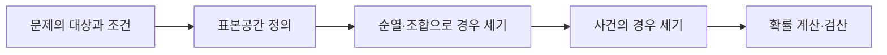

이 묶음은 사건을 정의하고 가능한 경우를 세어 확률을 계산하는 기초 연습이다. 경우의 수를 먼저 정리한 뒤 분모와 분자를 같은 표본공간 기준으로 둔다.



<Tabs>
  <Tab label="Counting">중복·순서를 허용하는지 확인하고 곱셈·덧셈 원리를 적용한다.</Tab>
  <Tab label="Permutation">순서가 결과를 바꾸면 배열 순서를 포함해 센다.</Tab>
  <Tab label="Combination">순서를 무시하고 선택된 묶음만 센다.</Tab>
  <Tab label="Probability">사건 수를 전체 가능한 경우 수와 비교한다.</Tab>
</Tabs>

| 판단 | 먼저 물을 것 |
| --- | --- |
| 순서 | 배치 순서가 다른 결과인가 |
| 중복 | 같은 대상을 다시 선택할 수 있는가 |
| 범위 | 모든 결과가 동일한 가능성을 갖는가 |
| 검산 | 확률이 0과 1 사이인가 |

```html preview
<div style="font-family:system-ui,sans-serif;padding:20px;color:var(--foreground)">
<label for="amt" style="font-size:14px;font-weight:600">연습 묶음</label>
<div id="out" style="font-size:30px;font-weight:700;color:var(--chart-1);margin:6px 0">1번</div>
<input id="amt" type="range" min="1" max="4" step="1" value="1" style="width:100%;accent-color:var(--primary)" />
<p style="font-size:13px;color:var(--muted-foreground)">원본 강의 번호와 연습문제 묶음의 순서를 움직인다.</p>
<script>
var amt=document.getElementById('amt'); var out=document.getElementById('out');
amt.addEventListener('input',function(){out.textContent=Number(amt.value).toLocaleString()+'번';});
</script>
</div>
```

> [!WARNING]
> 순열과 조합을 바꾸어 사용하면 같은 숫자라도 의미가 달라진다. 문제 문장의 순서·중복 조건을 표시한 뒤 식을 선택한다.

<details>
<summary>풀이 기록</summary>

표본공간 → 사건 → 경우의 수 식 → 값 대입 → 범위 검산 순서로 답안을 남긴다.

</details>

<!-- source: counting, permutation, combination and probability problem PDFs; condition-first workflow preserved -->