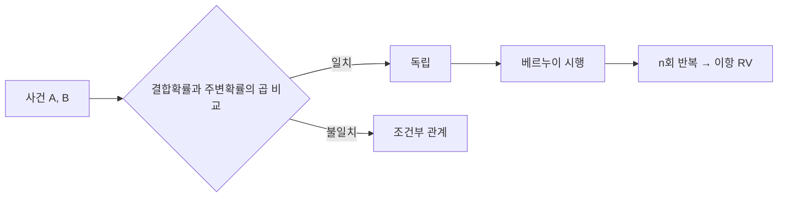

독립성 자료는 두 사건의 발생이 서로 영향을 주지 않는 조건을 세우고, 베르누이 한 번의 시행을 반복해 이항 확률변수로 확장한다.



<Tabs>
  <Tab label="독립">교집합 확률이 주변 확률의 곱과 같은지 확인한다.</Tab>
  <Tab label="베르누이">한 시행의 성공·실패 두 결과와 성공 확률을 둔다.</Tab>
  <Tab label="이항">독립 베르누이 시행 n회의 성공 횟수를 확률변수로 둔다.</Tab>
</Tabs>

| 모델 | 결과 |
| --- | --- |
| Bernoulli | 0 또는 1 |
| Binomial | n회 중 성공 횟수 |
| 독립성 | 결합확률과 곱 비교 |

```html preview
<div style="font-family:system-ui,sans-serif;padding:20px;color:var(--foreground)">
<label for="amt" style="font-size:14px;font-weight:600">이산 분포 단계</label>
<div id="out" style="font-size:30px;font-weight:700;color:var(--chart-1);margin:6px 0">1단계</div>
<input id="amt" type="range" min="1" max="3" step="1" value="1" style="width:100%;accent-color:var(--primary)" />
<p style="font-size:13px;color:var(--muted-foreground)">원본 강의 번호와 연습문제 묶음의 순서를 움직인다.</p>
<script>
var amt=document.getElementById('amt'); var out=document.getElementById('out');
amt.addEventListener('input',function(){out.textContent=Number(amt.value).toLocaleString()+'단계';});
</script>
</div>
```

> [!CAUTION]
> 반복 시행이 독립인지 먼저 확인한다. 같은 성공 확률을 갖는다는 사실만으로 독립성이 보장되지는 않는다.

<details>
<summary>연습 문제</summary>

독립성 판정 → 시행 수와 성공 확률 확인 → 확률변수 값의 범위 설정 → 해당 분포식 대입의 순서로 풀이한다.

</details>

<!-- source: independence and Bernoulli/binomial decks plus problem PDFs; definitions preserved -->