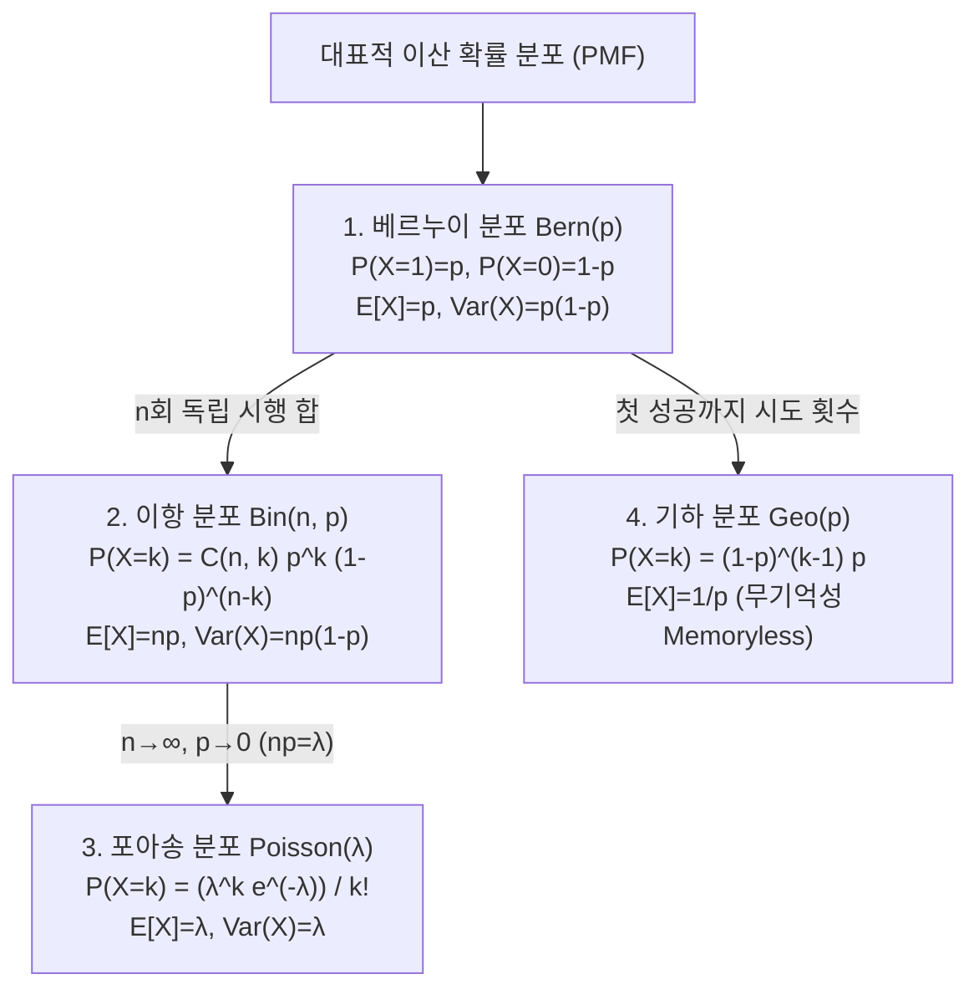

> [!abstract] 핵심 요약
> **이산 확률 변수(Discrete Random Variable)**는 셀 수 있는 이산적인 값들을 취하는 확률 변수이다.
> 성공 확률 $p$인 $n$회의 독립 베르누이 시행에서 성공 횟수를 모델링하는 **이항 분포($X \sim \text{Bin}(n, p)$)**와, 희귀 사건의 발생 횟수를 모델링하는 **포아송 분포($X \sim \text{Poisson}(\lambda)$)**는 네트워크 패킷 도착, A/B 테스트 및 서버 로드 분석의 수학적 토대이다.

---

## 1. 4대 핵심 이산 확률 분포 수식 체계



---

## 2. 포아송 극한 정리 (Poisson Paradigm)

시행 횟수 $n$이 매우 크고 성공 확률 $p$가 매우 작을 때 ($\lambda = np$ 일정):

$$\lim_{n \to \infty} \binom{n}{k} p^k (1 - p)^{n - k} = \frac{\lambda^k e^{-\lambda}}{k!}$$

---

## 3. 실시간 이항 분포(Binomial) PMF & 기댓값/분산 계산기

```html preview
<div style="font-family:system-ui,-apple-system,sans-serif;padding:20px;background:var(--card);color:var(--card-foreground);border:1px solid var(--border);border-radius:var(--radius)">
  <div style="font-size:16px;font-weight:700;margin-bottom:14px;color:var(--primary);display:flex;align-items:center;gap:8px">
    <span>🎲 이항 분포 Bin(n, p) PMF 확률 질량 및 통계량 계산기</span>
  </div>

  <div style="display:grid;grid-template-columns:repeat(3, 1fr);gap:10px;margin-bottom:14px">
    <div>
      <label style="font-size:11px;color:var(--muted-foreground)">시행 횟수 n:</label>
      <input id="inN" type="number" value="10" min="1" max="50" style="width:100%;padding:4px 8px;background:var(--background);color:var(--foreground);border:1px solid var(--border);border-radius:var(--radius);font-weight:700" />
    </div>
    <div>
      <label style="font-size:11px;color:var(--muted-foreground)">성공 확률 p:</label>
      <input id="inP" type="number" value="0.3" step="0.05" min="0" max="1" style="width:100%;padding:4px 8px;background:var(--background);color:var(--foreground);border:1px solid var(--border);border-radius:var(--radius);font-weight:700" />
    </div>
    <div>
      <label style="font-size:11px;color:var(--muted-foreground)">목표 성공 횟수 k:</label>
      <input id="inK" type="number" value="3" min="0" max="50" style="width:100%;padding:4px 8px;background:var(--background);color:var(--foreground);border:1px solid var(--border);border-radius:var(--radius);font-weight:700" />
    </div>
  </div>

  <div style="display:grid;grid-template-columns:repeat(3, 1fr);gap:10px;margin-bottom:12px">
    <div style="padding:8px;background:var(--background);border:1px solid var(--border);border-radius:var(--radius);text-align:center">
      <div style="font-size:10px;color:var(--muted-foreground)">P(X = k)</div>
      <div id="resProb" style="font-size:14px;font-weight:800;color:var(--primary)"></div>
    </div>
    <div style="padding:8px;background:var(--background);border:1px solid var(--border);border-radius:var(--radius);text-align:center">
      <div style="font-size:10px;color:var(--muted-foreground)">기댓값 E[X] = np</div>
      <div id="resMean" style="font-size:14px;font-weight:700;color:var(--chart-1)"></div>
    </div>
    <div style="padding:8px;background:var(--background);border:1px solid var(--border);border-radius:var(--radius);text-align:center">
      <div style="font-size:10px;color:var(--muted-foreground)">분산 Var(X) = np(1-p)</div>
      <div id="resVar" style="font-size:14px;font-weight:700;color:var(--chart-2)"></div>
    </div>
  </div>

  <script>
    function nCr(n, r) {
      if (r < 0 || r > n) return 0;
      if (r === 0 || r === n) return 1;
      if (r > n / 2) r = n - r;
      var res = 1;
      for (var i = 1; i <= r; i++) {
        res = res * (n - i + 1) / i;
      }
      return res;
    }

    function calcBinomial() {
      var n = parseInt(document.getElementById('inN').value) || 10;
      var p = parseFloat(document.getElementById('inP').value) || 0.3;
      var k = parseInt(document.getElementById('inK').value) || 0;

      if (k > n) k = n;

      var comb = nCr(n, k);
      var prob = comb * Math.pow(p, k) * Math.pow(1 - p, n - k);
      var mean = n * p;
      var variance = n * p * (1 - p);

      document.getElementById('resProb').textContent = (prob * 100).toFixed(2) + " %";
      document.getElementById('resMean').textContent = mean.toFixed(2);
      document.getElementById('resVar').textContent = variance.toFixed(2);
    }

    ['inN', 'inP', 'inK'].forEach(function(id) {
      document.getElementById(id).addEventListener('input', calcBinomial);
    });
    calcBinomial();
  </script>
</div>
```
