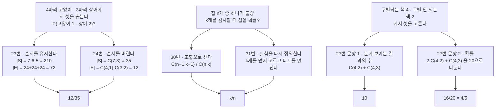
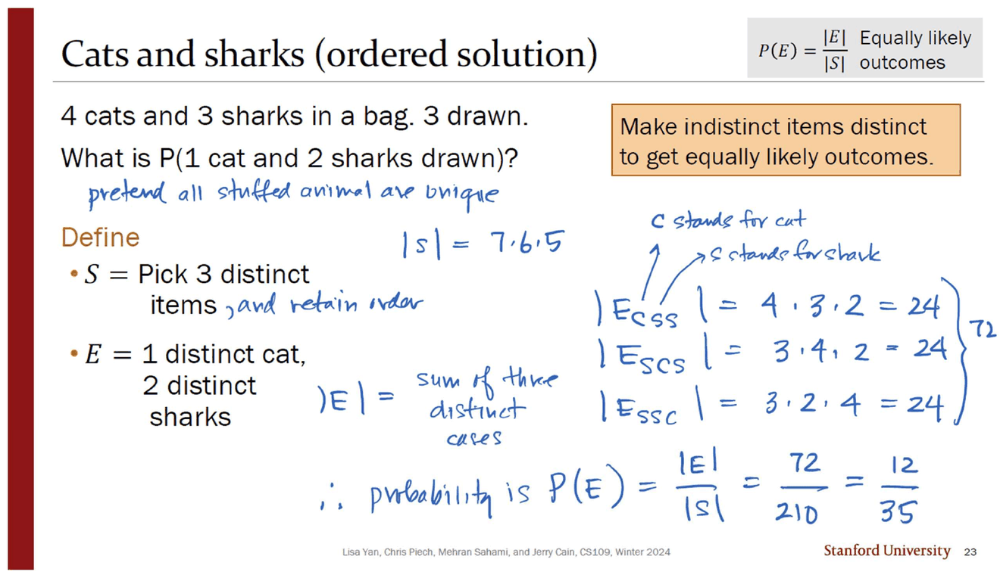
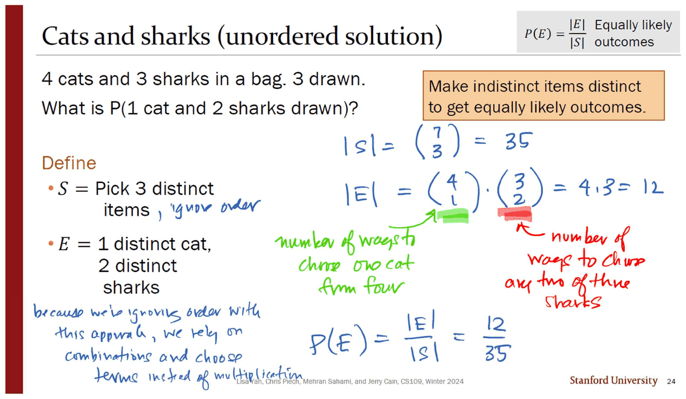
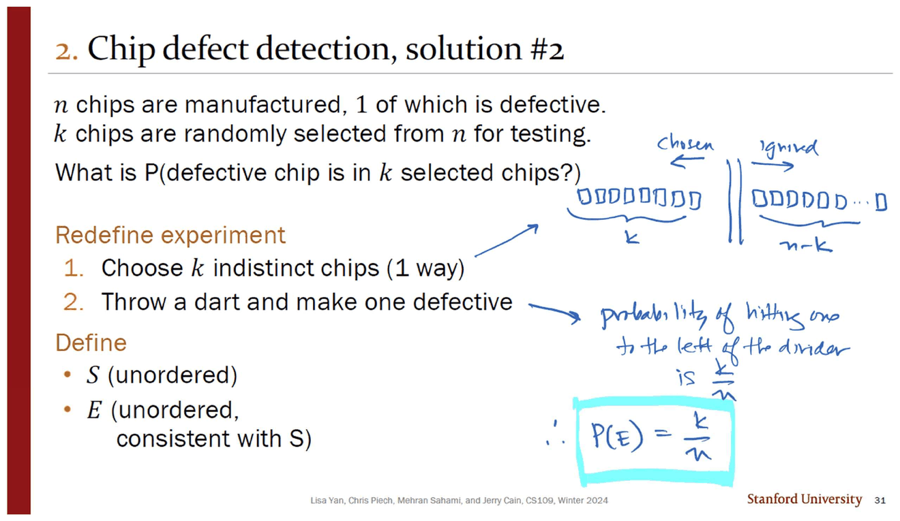
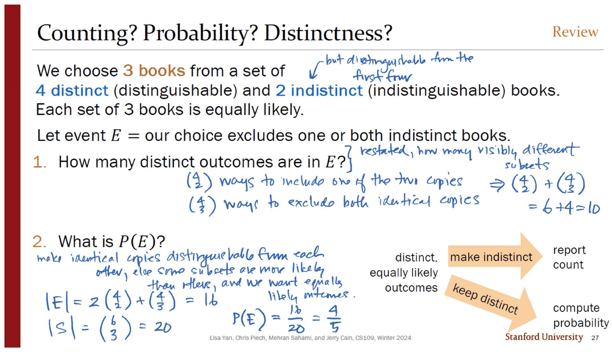
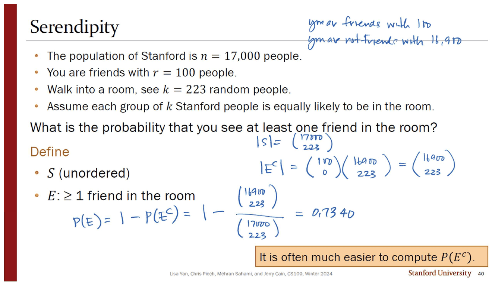
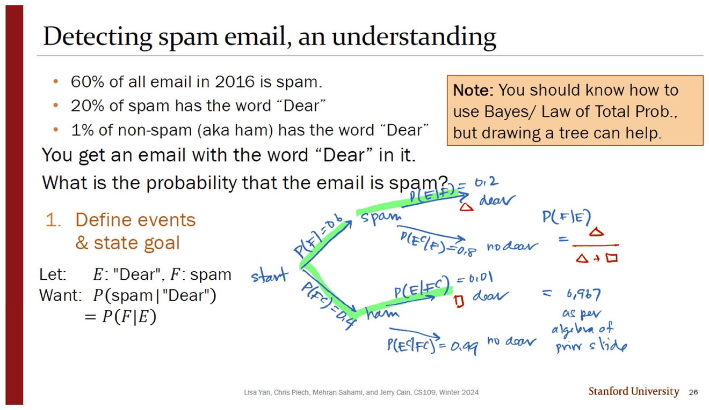
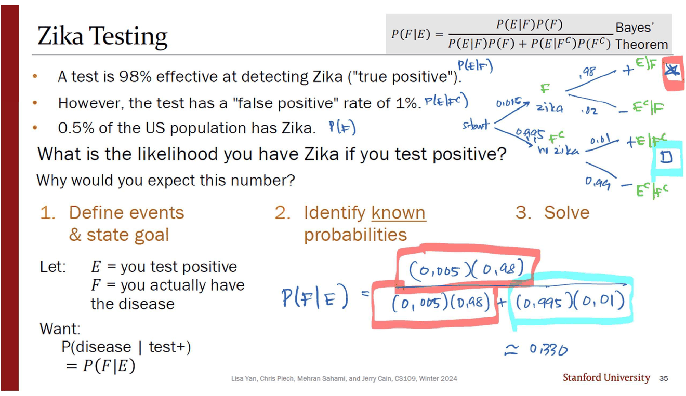

> [!abstract] 이 유인물의 형식이 곧 내용이다
> `Probability 문제` 는 슬라이드 일곱 장(23 · 24 · 27 · 29 · 30 · 31 · 40)을 담고 있다. 그런데 **일곱 중 여섯이 셋씩 짝을 이룬다** — 23과 24는 같은 문제의 「ordered solution」과 「unordered solution」, 30과 31은 같은 문제의 첫째 풀이와 「solution #2」, 그리고 27은 한 장 안에서 같은 사건을 두 번 센다.
>
> 이 반복은 게으름이 아니다. $P(E)=\lvert E\rvert/\lvert S\rvert$ 라는 한 줄짜리 정의는 **분자와 분모를 같은 방식으로 세었을 때만** 옳고, 그 「같은 방식」이 무엇인지는 정의에 적혀 있지 않다. 두 번 세어 답이 일치하는지 보는 것이 그 전제를 확인하는 유일한 방법이다. 유인물의 오른쪽 위 회색 상자가 그 전제를 세 번 반복해 붙여 놓았다 — *Equally likely outcomes.*



두 갈래가 한 점으로 모이는 것이 앞의 두 쌍이고, **한 점에서 갈라지는 것이 셋째 쌍**이다. 이 문서의 중심은 그 갈림이다.

---

## 첫째 쌍 — 순서를 유지하거나, 버리거나

가방에 고양이 인형 넷과 상어 인형 셋이 있고 셋을 꺼낸다. 고양이 하나와 상어 둘이 나올 확률은?



23번의 잉크는 먼저 전제를 못 박는다 — *"pretend all stuffed animals are unique."* 그러고 나서 표본공간을 순서 있는 삼중쌍으로 잡는다.

$$\lvert S\rvert = 7\cdot 6\cdot 5 = 210$$

사건 쪽은 **뽑히는 순서에 따라 세 경우로 쪼갠다.** 잉크가 $E_{CSS}$·$E_{SCS}$·$E_{SSC}$ 라고 이름을 붙이고 각각을 곱셈으로 센다.

| 순서 | 계산 | 값 |
| --- | --- | --- |
| 고양이 → 상어 → 상어 | $4\cdot 3\cdot 2$ | 24 |
| 상어 → 고양이 → 상어 | $3\cdot 4\cdot 2$ | 24 |
| 상어 → 상어 → 고양이 | $3\cdot 2\cdot 4$ | 24 |

셋 다 24인 것은 우연이 아니다 — 같은 세 인수 $4,3,2$ 의 순서만 바뀌었다. 합은 72이고 $P(E)=72/210=12/35$.



24번은 같은 문제를 조합으로 다시 푼다. 잉크가 왼쪽 아래에 두 풀이의 관계를 한 줄로 적었다 — *"because we're ignoring order with this approach, we rely on combinations and choose terms instead of multiplication."*

$$\lvert S\rvert=\binom{7}{3}=35,\qquad \lvert E\rvert=\binom{4}{1}\binom{3}{2}=4\cdot 3=12,\qquad P(E)=\frac{12}{35}$$

분자와 분모가 **둘 다** $3!=6$ 배만큼 작아졌기 때문에 비가 유지된다. 두 풀이가 같은 답을 내는 이유가 여기 있고, 원본은 그 사실을 「두 장을 나란히 두는 것」으로만 말한다.

```html preview
<div id="cs-root">
  <style>
    #cs-root{font-family:system-ui,-apple-system,"Segoe UI",sans-serif;color:var(--foreground);padding:4px}
    #cs-root .panel{background:var(--card);border:1px solid var(--border);border-radius:10px;padding:14px}
    #cs-root .row{display:flex;align-items:center;gap:10px;margin:8px 0;font-size:13px;flex-wrap:wrap}
    #cs-root input[type=range]{flex:1;min-width:110px;accent-color:var(--chart-1)}
    #cs-root .cols{display:flex;gap:12px;flex-wrap:wrap;margin-top:12px}
    #cs-root .col{flex:1 1 240px;border:1px solid var(--border);border-radius:8px;padding:11px 13px;font-size:13.5px;line-height:1.8}
    #cs-root .col h4{margin:0 0 7px;font-size:13px;letter-spacing:.02em}
    #cs-root .verdict{margin-top:11px;padding:10px 12px;border:1px solid var(--chart-2);border-radius:8px;background:color-mix(in srgb,var(--chart-2) 12%,transparent);font-size:14px}
    #cs-root code{font-family:ui-monospace,SFMono-Regular,Menlo,monospace}
    #cs-root .orig{font-size:12px;opacity:.72;margin-top:7px}
  </style>
  <div class="panel">
    <div class="row"><span style="opacity:.7;width:104px">고양이 수</span><input type="range" id="cs-c" min="1" max="8" value="4"><b id="cs-cv" style="width:22px;text-align:right">4</b></div>
    <div class="row"><span style="opacity:.7;width:104px">상어 수</span><input type="range" id="cs-s" min="1" max="8" value="3"><b id="cs-sv" style="width:22px;text-align:right">3</b></div>
    <div class="row"><span style="opacity:.7;width:104px">뽑는 상어 수</span><input type="range" id="cs-k" min="0" max="3" value="2"><b id="cs-kv" style="width:22px;text-align:right">2</b></div>
    <div class="cols">
      <div class="col" id="cs-ord"></div>
      <div class="col" id="cs-uno"></div>
    </div>
    <div class="verdict" id="cs-v"></div>
    <div class="orig" id="cs-o"></div>
  </div>
</div>
<script>
(function(){
  var R=document.getElementById('cs-root');
  function comb(n,k){ if(k<0||k>n) return 0; var r=1; for(var i=1;i<=k;i++) r=r*(n-i+1)/i; return Math.round(r); }
  function perm(n,k){ var r=1; for(var i=0;i<k;i++) r*=(n-i); return r; }
  function gcd(a,b){ return b? gcd(b,a%b):a; }
  function draw(){
    var c=+R.querySelector('#cs-c').value, s=+R.querySelector('#cs-s').value, k=+R.querySelector('#cs-k').value;
    var draws=3, cc=draws-k;
    R.querySelector('#cs-cv').textContent=c; R.querySelector('#cs-sv').textContent=s; R.querySelector('#cs-kv').textContent=k;
    var n=c+s;
    var S1=perm(n,draws);
    // 순서 있는 풀이: 자리 배치 C(3,k) 가지 각각에 대해 내림차순 곱
    var arrangements=comb(draws,k);
    var per = perm(s,k)*perm(c,cc);
    var E1=arrangements*per;
    var S2=comb(n,draws), E2=comb(s,k)*comb(c,cc);
    var p1=S1?E1/S1:0, p2=S2?E2/S2:0;
    var g=E2&&S2?gcd(E2,S2):1;
    R.querySelector('#cs-ord').innerHTML='<h4 style="color:var(--chart-1)">23번 · 순서를 유지한다</h4>'
      +'<code>|S| = '+n+'·'+(n-1)+'·'+(n-2)+' = '+S1+'</code><br>'
      +'<code>|E| = '+arrangements+' 가지 순서 × '+per+' = '+E1+'</code><br>'
      +'<span style="opacity:.75">뽑히는 순서를 '+arrangements+' 가지로 쪼개 각각 곱셈으로 센다.</span>';
    R.querySelector('#cs-uno').innerHTML='<h4 style="color:var(--chart-4)">24번 · 순서를 버린다</h4>'
      +'<code>|S| = C('+n+',3) = '+S2+'</code><br>'
      +'<code>|E| = C('+s+','+k+')·C('+c+','+cc+') = '+E2+'</code><br>'
      +'<span style="opacity:.75">고를 것만 고른다. 순서를 세지 않으므로 곱셈이 조합으로 바뀐다.</span>';
    var same=Math.abs(p1-p2)<1e-12;
    R.querySelector('#cs-v').innerHTML= (cc<0||cc>c||k>s)
      ? '이 조합은 불가능하다 — 뽑을 수 있는 수를 넘었다.'
      : '<b>'+(same?'두 풀이가 같은 값을 낸다':'두 풀이가 어긋난다')+'</b> — '
        +'<code>'+E1+'/'+S1+'</code> = <code>'+E2+'/'+S2+'</code> = <b>'
        +(g>1?(E2/g)+'/'+(S2/g):E2+'/'+S2)+'</b> ≈ '+p2.toFixed(4)
        +'<div style="opacity:.78;margin-top:5px">분자와 분모가 똑같이 3! = 6 배 줄었으므로 비는 그대로다.</div>';
    R.querySelector('#cs-o').textContent=(c===4&&s===3&&k===2)
      ? '지금 값이 원본 슬라이드 23·24번의 설정이다 — 잉크가 두 장 모두에 12/35 라 적었다.'
      : '원본 설정은 고양이 4 · 상어 3 · 상어 2마리를 뽑는 경우(12/35)다.';
  }
  R.addEventListener('input',draw); draw();
})();
</script>
```

---

## 둘째 쌍 — 계산을 바꾸는 대신 실험을 바꾼다

$n$ 개 칩 중 하나가 불량이고 $k$ 개를 뽑아 검사한다. 불량품이 검사 대상에 들어 있을 확률은?

30번은 정공법이다. 불량 칩 하나를 반드시 포함시키고($\binom{1}{1}$), 나머지 $k-1$ 개를 정상 $n-1$ 개에서 고른다.

$$P(E)=\frac{\binom{1}{1}\binom{n-1}{k-1}}{\binom{n}{k}}
=\frac{\dfrac{(n-1)!}{(k-1)!\,(n-k)!}}{\dfrac{n!}{k!\,(n-k)!}}
=\frac{(n-1)!}{n!}\cdot\frac{k!}{(k-1)!}=\frac{k}{n}$$

잉크가 이 약분을 한 줄씩 손으로 끌고 가 하늘색 상자에 $P(E)=k/n$ 을 넣는다. **깨끗한 답이 나왔다는 사실 자체가 다음 장의 동기다.**



31번은 계산을 하지 않는다. 대신 **실험을 다시 정의한다.**

1. 구별되지 않는 칩 $k$ 개를 고른다 — **1가지**
2. 다트를 던져 하나를 불량으로 만든다

잉크가 그린 그림이 전부다. 사각형 $n$ 개를 일렬로 놓고 세로 이중선으로 왼쪽 $k$ 개(chosen)와 오른쪽 $n-k$ 개(ignored)를 가른다. 다트가 왼쪽에 꽂힐 확률은 그냥 $k/n$ 이다.

> [!note] 무엇이 바뀌었나
> 30번과 31번은 **같은 확률 공간을 쓰지 않는다.** 30번의 표본공간은 「$k$개 부분집합」이고 31번의 표본공간은 「어느 칩이 불량인가」다. 둘 다 동등하게 일어날 법한 결과를 갖고, 둘 다 $k/n$ 을 준다. 원본은 이 전환에 `Redefine experiment` 라는 표제만 붙이고 정당화는 하지 않는다 — 정당화는 앞 장의 대수 계산 그 자체다. **두 번 푸는 형식이 여기서는 증명 역할을 한다.**

---

## 셋째 쌍 — 답이 두 개이고 둘 다 맞다

앞의 두 쌍이 「같은 답」으로 수렴했다면, 27번은 **한 장 안에서 갈라진다.**



설정: 구별되는 책 4권과 **서로 구별되지 않는** 책 2권, 합해서 6권 중 3권을 고른다. 사건 $E$ = 구별되지 않는 두 권 중 하나 또는 둘 다를 **제외**하는 선택.

**문항 1 — 눈에 보이는 결과는 몇 가지인가.** 잉크가 「restated, how many visibly different subsets」라고 문제를 다시 쓴다.

$$\binom{4}{2}+\binom{4}{3}=6+4=\mathbf{10}$$

**문항 2 — $P(E)$ 는 얼마인가.** 여기서 같은 두 권을 **억지로 구별한다.**

$$\lvert E\rvert = 2\binom{4}{2}+\binom{4}{3}=12+4=\mathbf{16},\qquad
\lvert S\rvert=\binom{6}{3}=20,\qquad P(E)=\frac{16}{20}=\frac{4}{5}$$

잉크가 그 이유를 왼쪽 아래에 적었다 — *"make identical copies distinguishable from each other, else some subsets are more likely than others, and we want equally likely outcomes."* 사본 두 권 중 「하나만 포함」하는 선택은 실제로는 **두 가지 방식으로 일어나므로**, 그것을 한 가지로 세면 확률이 왜곡된다.

원본 오른쪽의 주황 화살표 두 개가 이 갈림을 그림 하나로 요약한다.

- `make indistinct` → **report count**
- `keep distinct` → **compute probability**

```html preview
<div id="bk-root">
  <style>
    #bk-root{font-family:system-ui,-apple-system,"Segoe UI",sans-serif;color:var(--foreground);padding:4px}
    #bk-root .panel{background:var(--card);border:1px solid var(--border);border-radius:10px;padding:14px}
    #bk-root .row{display:flex;gap:8px;flex-wrap:wrap;align-items:center;margin-bottom:10px}
    #bk-root button{background:var(--card);color:var(--foreground);border:1px solid var(--border);border-radius:6px;padding:5px 11px;font:inherit;font-size:13px;cursor:pointer}
    #bk-root button.on{border-color:var(--chart-1);background:color-mix(in srgb,var(--chart-1) 16%,transparent)}
    #bk-root .grid{display:grid;grid-template-columns:repeat(auto-fill,minmax(112px,1fr));gap:6px}
    #bk-root .cell{border:1px solid var(--border);border-radius:7px;padding:6px 4px;font-size:12px;font-family:ui-monospace,SFMono-Regular,Menlo,monospace;text-align:center}
    #bk-root .in{border-color:var(--chart-2);background:color-mix(in srgb,var(--chart-2) 16%,transparent)}
    #bk-root .out{opacity:.38}
    #bk-root .merged{border-style:dashed;border-color:var(--chart-4)}
    #bk-root .sum{margin-top:11px;padding:10px 12px;border:1px solid var(--border);border-radius:8px;font-size:14px;line-height:1.75}
  </style>
  <div class="panel">
    <div class="row">
      <button data-v="distinct" class="on">사본을 구별한다 (확률)</button>
      <button data-v="merged">사본을 합친다 (개수)</button>
    </div>
    <div class="grid" id="bk-grid"></div>
    <div class="sum" id="bk-sum"></div>
  </div>
</div>
<script>
(function(){
  var R=document.getElementById('bk-root'), view='distinct';
  var N=['A','B','C','D','x1','x2'];      // A~D 구별됨, x1·x2 는 같은 책의 두 사본
  var subs=[];
  for(var i=0;i<6;i++)for(var j=i+1;j<6;j++)for(var k=j+1;k<6;k++) subs.push([i,j,k]);
  function label(s,merge){
    return s.map(function(x){ return merge? N[x].replace(/x[12]/,'x') : N[x]; }).join(' ');
  }
  function inE(s){ // 사본 둘 다 포함하지 않으면 E
    return !(s.indexOf(4)>=0 && s.indexOf(5)>=0);
  }
  function draw(){
    var g='', seen={}, shown=0, inCount=0;
    subs.forEach(function(s){
      var lab=label(s,view==='merged');
      if(view==='merged'){ if(seen[lab]) return; seen[lab]=1; }
      shown++;
      var e=inE(s); if(e) inCount++;
      g+='<div class="cell '+(e?'in':'out')+(view==='merged'&&s.indexOf(4)>=0&&s.indexOf(5)<0?' merged':'')+'">'+lab+'</div>';
    });
    R.querySelector('#bk-grid').innerHTML=g;
    var txt;
    if(view==='distinct')
      txt='두 사본을 <code>x1</code>·<code>x2</code> 로 억지로 구별하면 부분집합은 <b>20</b> 개이고 전부 같은 확률을 갖는다. 그중 사건 E 에 드는 것이 <b>'+inCount+'</b> 개 — <code>2·C(4,2) + C(4,3) = 12 + 4 = 16</code>. 따라서 <b>P(E) = 16/20 = 4/5</b>.';
    else
      txt='사본을 하나로 합쳐 보이는 대로만 세면 서로 다른 결과는 <b>'+shown+'</b> 개로 줄고, 사건 E 에 드는 것은 <b>'+inCount+'</b> 개다 — <code>C(4,2) + C(4,3) = 6 + 4 = 10</code>. 점선 테두리 칸은 앞 화면에서 <b>두 칸이던 것이 한 칸으로 합쳐진 자리</b>다. 이 칸들은 다른 칸보다 두 배 자주 일어나므로, 이 세기로는 확률을 계산할 수 없다.';
    R.querySelector('#bk-sum').innerHTML=txt;
    R.querySelectorAll('.row button').forEach(function(b){b.className=(b.dataset.v===view?'on':'');});
  }
  R.addEventListener('click',function(e){ if(e.target.dataset.v){view=e.target.dataset.v;draw();} });
  draw();
})();
</script>
```

> [!caution] 한 장 안에서 $\lvert E\rvert$ 가 10이면서 16이다
> 27번은 같은 사건 $E$ 의 크기를 두 번 계산하는데 값이 다르다. 문항 1의 답 **10** 에는 기호가 붙지 않고, 문항 2의 잉크만 `|E| = 16` 이라고 적는다. 같은 쪽에서 「$E$ 안의 distinct outcome 수」와 「$\lvert E\rvert$」가 서로 다른 것을 가리키는 셈이다. 두 수가 왜 다른지는 잉크가 설명하지만, 기호가 그 구분을 담지 못한다.

---

## 여집합 — 세기 어려운 쪽을 피하는 법

`Probability 문제` 마지막 장(40번)은 세는 기술의 마지막 카드를 꺼낸다.



스탠퍼드 인구 17,000명, 내 친구는 100명, 방에 무작위로 223명이 있다. **친구를 한 명 이상 볼 확률**은?

「한 명 이상」을 직접 세려면 1명·2명·…·100명인 경우를 전부 더해야 한다. 잉크는 그 대신 여집합을 센다 — 위쪽 여백에 *"you are friends with 100 / you are not friends with 16,900"* 라고 먼저 인구를 둘로 가른 뒤,

$$P(E)=1-P(E^c)=1-\frac{\binom{100}{0}\binom{16900}{223}}{\binom{17000}{223}}
=1-\frac{\binom{16900}{223}}{\binom{17000}{223}}=\mathbf{0.7340}$$

$\binom{100}{0}=1$ 을 **굳이 적었다가 곧 지우는** 잉크의 두 단계가, 「사건을 $\binom{\text{친구}}{j}\binom{\text{비친구}}{223-j}$ 꼴로 쓴다」는 일반형에서 $j=0$ 을 대입한 것임을 보여 준다. 원본의 주황 상자는 교훈만 남긴다 — *"It is often much easier to compute $P(E^c)$."*

값 0.7340은 파이썬 정수 이항계수로 다시 계산해 잉크와 일치함을 확인했다.

---

## 베이즈 — 답은 맞고 직관이 틀린다

`Bayes theorem 문제` 는 네 장(25 · 26 · 35 · 43)이다. 여기서도 같은 형식이 한 번 더 반복된다 — 25번이 대수로 풀고, 26번이 **같은 문제를 나무로 다시 푼다.**



스팸 필터. 메일의 60%가 스팸이고, 스팸의 20%·정상 메일의 1%에 「Dear」가 들어 있다. 「Dear」가 있는 메일이 스팸일 확률은?

$$P(F\mid E)=\frac{(0.2)(0.6)}{(0.2)(0.6)+(0.01)(0.4)}=\frac{0.12}{0.124}\approx\mathbf{0.967}$$

26번의 나무 그림에서 잉크는 끝 마디 두 개에 △와 □ 를 그려 넣고 $P(F\mid E)=\triangle/(\triangle+\square)$ 라고 쓴다. **베이즈 정리를 「전체 중 해당 가지의 몫」으로 번역한 것**이고, 원본의 주황 상자도 같은 말을 한다 — *"You should know how to use Bayes/ Law of Total Prob., but drawing a tree can help."*

그런데 다음 장에서 같은 계산이 전혀 다른 느낌의 답을 낸다.



$$P(F\mid E)=\frac{(0.005)(0.98)}{(0.005)(0.98)+(0.995)(0.01)}=\frac{0.0049}{0.014850}\approx\mathbf{0.330}$$

98% 정확한 검사에서 양성이 나왔는데 실제로 병에 걸렸을 확률이 **33%** 다. 스팸 필터와 수식이 완전히 같은데 답의 성격이 뒤집힌 이유는 하나뿐 — **사전확률**이다. 스팸은 0.6, 지카는 0.005다.

```html preview
<div id="by-root">
  <style>
    #by-root{font-family:system-ui,-apple-system,"Segoe UI",sans-serif;color:var(--foreground);padding:4px}
    #by-root .panel{background:var(--card);border:1px solid var(--border);border-radius:10px;padding:14px}
    #by-root .row{display:flex;align-items:center;gap:10px;margin:7px 0;font-size:13px;flex-wrap:wrap}
    #by-root input[type=range]{flex:1;min-width:120px;accent-color:var(--chart-1)}
    #by-root button{background:var(--card);color:var(--foreground);border:1px solid var(--border);border-radius:6px;padding:5px 11px;font:inherit;font-size:13px;cursor:pointer}
    #by-root button.on{border-color:var(--chart-2);background:color-mix(in srgb,var(--chart-2) 16%,transparent)}
    #by-root .out{margin-top:10px;padding:10px 12px;border:1px solid var(--border);border-radius:8px;font-size:14px;line-height:1.8}
    #by-root code{font-family:ui-monospace,SFMono-Regular,Menlo,monospace}
    #by-root svg{display:block;margin-top:8px}
  </style>
  <div class="panel">
    <div class="row">
      <button data-p="spam">25·26번 스팸 필터</button>
      <button data-p="zika" class="on">35번 지카 검사</button>
    </div>
    <div class="row"><span style="opacity:.7;width:140px">사전확률 P(F)</span><input type="range" id="by-pf" min="1" max="990" value="5"><b id="by-pfv" style="width:58px;text-align:right">0.005</b></div>
    <div class="row"><span style="opacity:.7;width:140px">민감도 P(E|F)</span><input type="range" id="by-se" min="1" max="1000" value="980"><b id="by-sev" style="width:58px;text-align:right">0.98</b></div>
    <div class="row"><span style="opacity:.7;width:140px">오탐률 P(E|F<sup>c</sup>)</span><input type="range" id="by-fp" min="0" max="500" value="10"><b id="by-fpv" style="width:58px;text-align:right">0.01</b></div>
    <svg id="by-svg" width="100%" height="64" viewBox="0 0 620 64" role="img" aria-label="양성 결과 중 참양성과 위양성의 비율 막대"></svg>
    <div class="out" id="by-out"></div>
  </div>
</div>
<script>
(function(){
  var R=document.getElementById('by-root');
  var P={spam:[600,200,10],zika:[5,980,10]};
  function set(k){ var v=P[k]; R.querySelector('#by-pf').value=v[0]; R.querySelector('#by-se').value=v[1]; R.querySelector('#by-fp').value=v[2]; draw(k); }
  function draw(preset){
    var pf=+R.querySelector('#by-pf').value/1000, se=+R.querySelector('#by-se').value/1000, fp=+R.querySelector('#by-fp').value/1000;
    R.querySelector('#by-pfv').textContent=pf.toFixed(3);
    R.querySelector('#by-sev').textContent=se.toFixed(3);
    R.querySelector('#by-fpv').textContent=fp.toFixed(3);
    var tp=pf*se, fpp=(1-pf)*fp, den=tp+fpp;
    var post=den?tp/den:0;
    var w=600, a=den?Math.max(1,w*tp/den):0;
    R.querySelector('#by-svg').innerHTML=
      '<rect x="10" y="10" width="'+w+'" height="26" rx="4" fill="var(--chart-4)" opacity=".45"/>'
      +'<rect x="10" y="10" width="'+a+'" height="26" rx="4" fill="var(--chart-1)"/>'
      +'<text x="10" y="52" font-size="11.5" fill="var(--foreground)" opacity=".8">양성 판정 전체 중 진짜 양성이 차지하는 몫 = '+(post*100).toFixed(1)+'%</text>';
    var html='<code>P(F|E) = '+tp.toFixed(6)+' / ('+tp.toFixed(6)+' + '+fpp.toFixed(6)+') = <b style="color:var(--chart-1)">'+post.toFixed(4)+'</b></code>';
    if(preset==='zika'||(Math.abs(pf-0.005)<1e-9&&Math.abs(se-0.98)<1e-9&&Math.abs(fp-0.01)<1e-9))
      html+='<div style="margin-top:6px">원본 35번의 설정이다 — 잉크의 <b>0.330</b> 과 일치한다. 병에 걸린 사람보다 <b>건강한데 양성이 뜬 사람이 두 배 많다</b>(0.00995 대 0.0049).</div>';
    else if(preset==='spam'||(Math.abs(pf-0.6)<1e-9&&Math.abs(se-0.2)<1e-9&&Math.abs(fp-0.01)<1e-9))
      html+='<div style="margin-top:6px">원본 25·26번의 설정이다 — 잉크의 <b>0.967</b> 과 일치한다. 증거(「Dear」)는 지카 검사보다 훨씬 약한데도(민감도 0.2) 사전확률 0.6 이 결론을 끌고 간다.</div>';
    else html+='<div style="margin-top:6px;opacity:.78">원본에 없는 설정이다 — 같은 식에 값만 바꿔 넣었다.</div>';
    R.querySelector('#by-out').innerHTML=html;
    R.querySelectorAll('.row button').forEach(function(b){b.className=(b.dataset.p===preset?'on':'');});
  }
  R.addEventListener('input',function(){draw(null);});
  R.addEventListener('click',function(e){ if(e.target.dataset.p) set(e.target.dataset.p); });
  set('zika');
})();
</script>
```

슬라이더를 움직여 보면 사전확률만 0.005에서 0.6으로 올려도 사후확률이 0.99를 넘는다. **검사의 성능은 그대로인데** 답이 바뀐다. 35번이 본문에 던지는 두 번째 질문 — *"Why would you expect this number?"* — 이 가리키는 것이 이 사실이다.

> [!caution] 물음표만 남고 답이 없다
> 35번은 「왜 이 숫자를 예상할 수 있었겠는가」라고 묻지만, **이 유인물 어디에도 그 답이 인쇄되어 있지 않다.** 잉크도 계산만 하고 이 질문에는 응답하지 않았다. 다음 장(43번)은 제목이 「Why it's still good to get tested」로 비슷해 보이지만 **다른 질문에 답한다** — 음성이 나왔을 때의 확률 $P(F\mid E^c)\approx 0.0001$ 이다. 즉 「33%가 왜 낮은가」가 아니라 「그래도 검사할 가치가 있는가」다. 두 질문이 제목의 유사성 때문에 하나로 읽히기 쉽다.

43번의 표는 네 칸을 채워 그 값을 얻는 경로를 보여 준다.

| | $F$ 병 있음 | $F^c$ 병 없음 |
| --- | --- | --- |
| $E$ 양성 | 참양성 $P(E\mid F)=0.98$ | 위양성 $P(E\mid F^c)=0.01$ |
| $E^c$ 음성 | **위음성** $P(E^c\mid F)=0.02$ | **참음성** $P(E^c\mid F^c)=0.99$ |

$$P(F\mid E^c)=\frac{(0.02)(0.005)}{(0.02)(0.005)+(0.99)(0.995)}\approx 0.000102$$

잉크가 이 값을 `≈ 0.0001` 로 적고 옆에 *"via similar math"* 라고만 썼다. 양성일 때 33%였던 확률이 음성일 때 0.01%로 떨어진다 — 검사가 쓸모없는 것이 아니라, **양성이라는 결과가 33%까지 끌어올린 것**이다(0.5%에서 66배). 원본은 그 배수를 말하지 않는다.

---

## 원본에서 확인한 것

> [!caution] 같은 사건의 크기가 10과 16으로 두 번 계산된다
> `Probability 문제` 2쪽 위(27번). 문항 1은 「distinct outcomes in $E$」를 $\binom{4}{2}+\binom{4}{3}=10$ 으로, 문항 2는 $\lvert E\rvert = 2\binom{4}{2}+\binom{4}{3}=16$ 으로 센다. 두 값이 다른 이유는 잉크가 설명하지만 **기호는 그 구분을 담지 않아서**, $\lvert E\rvert$ 가 한 장 안에서 두 뜻으로 쓰인다.

<!-- -->
> [!caution] 답 없는 질문이 그대로 남는다
> `Bayes theorem 문제` 2쪽 위(35번)의 두 번째 물음 *"Why would you expect this number?"* 에 대한 답이 유인물 어디에도 없다. 잉크도 계산만 했다. 제목이 비슷한 43번은 다른 질문(음성일 때의 확률)에 답한다.

<!-- -->
> [!caution] 백지로 끝나는 마지막 반쪽
> `Probability 문제` 4쪽 아래가 비어 있다. [01. 없는 강의를 세는 법](<./01. 없는 강의를 세는 법 — 곱하고 나서 나눈다.md>)에서 본 `Counting 문제` 3쪽과 같은 형태다 — 슬라이드가 홀수 장이라 2-up 배치의 마지막 반쪽이 남는다. 다섯 편 중 두 편에서 같은 일이 일어난다.

<!-- -->
> [!note] 「straight」의 정의가 스트레이트 플러시를 포함한다
> 29번은 스트레이트를 *"5 consecutive rank cards of any suit"* 로 정의하고 $\lvert E\rvert = 10\cdot 4^5 = 10{,}240$ 으로 센다. $P = 10{,}240/\binom{52}{5} \approx 0.00394$ 이고 잉크의 값과 일치한다. 다만 이 10,240에는 모든 카드의 무늬가 같은 경우(스트레이트 플러시) 40가지가 **포함되어 있다.** 포커 규칙에서는 보통 별도로 치지만, 슬라이드는 자기 정의를 따르고 있으므로 계산은 정의에 맞다. *(이 문단의 40가지는 원본에 없는 보충이다.)*

<!-- -->
> [!note] 2016년 통계가 2024년 강의에 그대로 있다
> 25·26번의 전제는 *"60% of all email in 2016 is spam"* 이다. 슬라이드 하단은 `CS109, Winter 2024`. 8년 된 수치를 그대로 쓰는데, 본문에서 값이 바뀌어도 방법은 같다는 점이 요지이므로 계산에는 영향이 없다.

이 문서의 수치 — **12/35 · $k/n$ · 10 · 16/20 · 0.00394 · 0.7340 · 0.967 · 0.330 · 0.000102** — 는 전부 파이썬(`math.comb` 정수 연산과 부동소수 산술)으로 다시 계산해 잉크와 대조했다. 잉크 쪽에 틀린 값은 없었다.

---

## 다음 문서로

여기까지는 **사건 하나의 확률**이다. 다음 문서는 사건 **둘**의 관계로 넘어간다 — 그리고 그 관계를 재는 유일한 도구가 곱셈 하나뿐이라는 것, 직관은 매번 틀린다는 것이 밝혀진다.

- [03. 독립 — 정의는 한 줄이고 직관은 매번 틀린다](<./03. 독립 — 정의는 한 줄이고 직관은 매번 틀린다.md>)
- [01. 없는 강의를 세는 법 — 곱하고 나서 나눈다](<./01. 없는 강의를 세는 법 — 곱하고 나서 나눈다.md>)

## 근거 자료

| 원본 파일 | 쪽 | 슬라이드 | 이 문서에서 쓴 곳 |
| --- | --- | --- | --- |
| `Probability 문제.pdf` | 1 | 23 · 24 | 첫째 쌍 — 순서 있는/없는 풀이 |
| `Probability 문제.pdf` | 2 | 27 · 29 | 셋째 쌍 — 개수와 확률 / 포커 스트레이트 |
| `Probability 문제.pdf` | 3 | 30 · 31 | 둘째 쌍 — 조합 계산과 실험 재정의 |
| `Probability 문제.pdf` | 4 | 40 (아래 반쪽 백지) | 여집합 |
| `Bayes theorem 문제.pdf` | 1 | 25 · 26 | 스팸 필터 — 대수와 나무 |
| `Bayes theorem 문제.pdf` | 2 | 35 · 43 | 지카 검사 · 음성일 때의 확률 |

원본 PDF 6쪽, 슬라이드 11장. 인용 이미지 7장은 2-up 유인물을 200 dpi로 렌더해 위·아래로 잘랐다.
