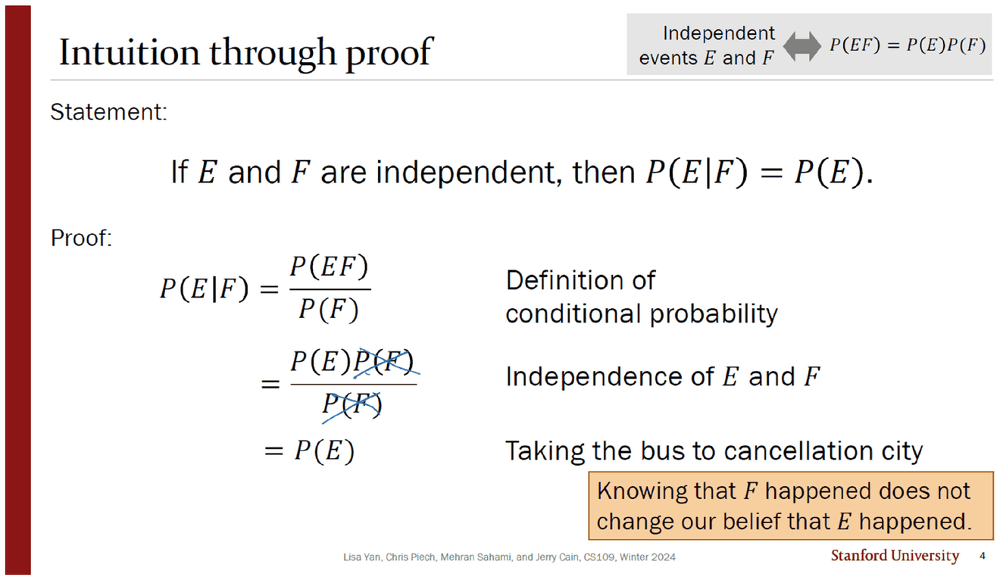
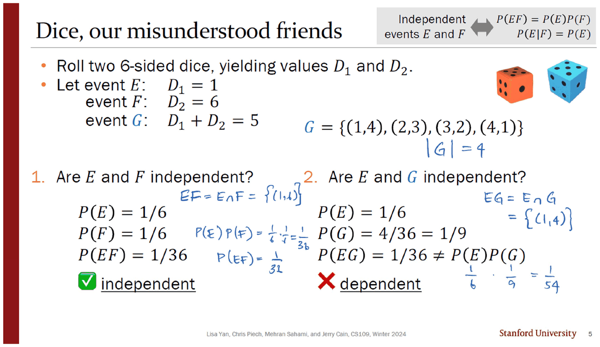
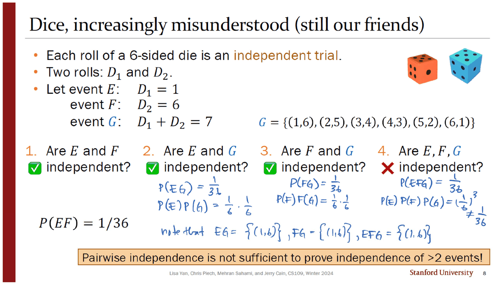
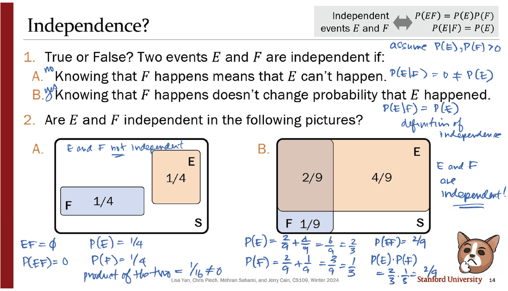
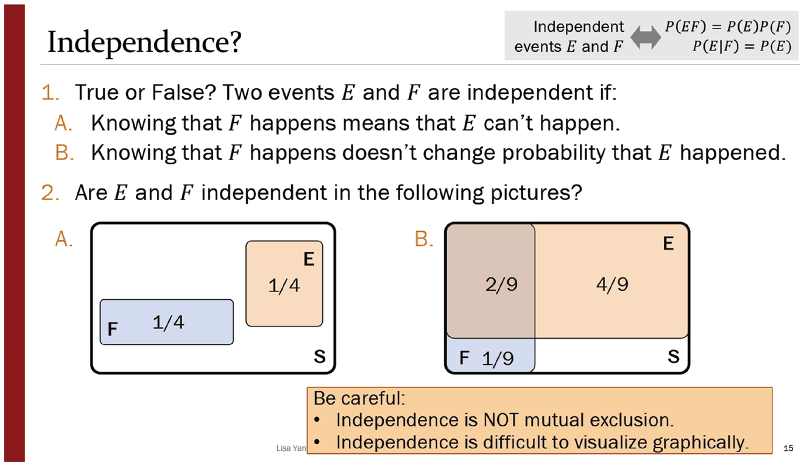
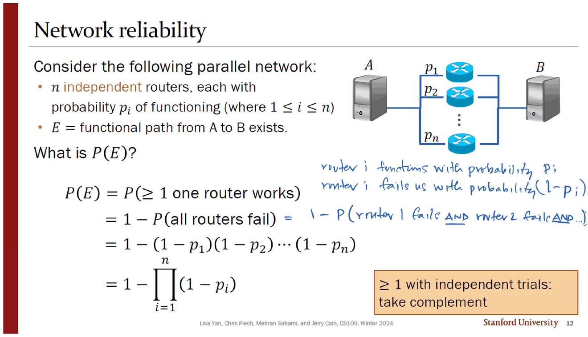

> [!abstract] 이 덱이 하는 일
> 05번 덱(29쪽 · Jerry Cain · 2024년 1월 19일)은 목차를 세 토막으로 나눈다 — `2 Independence I` · `9 Independence II` · `13 Exercises`. 이 문서는 앞 두 토막과 연습문제의 첫 장, 즉 **슬라이드 1~15**를 다룬다.
>
> 독립의 정의는 한 줄이다. $P(EF)=P(E)P(F)$. 그런데 덱 전체가 하는 일은 그 한 줄을 **직관이 이기지 못한다는 것을 반복해서 보여 주는 것**이다. 슬라이드 5에서 주사위 두 개의 합이 5일 때 종속이던 두 사건이, 슬라이드 7에서 합만 7로 바뀌자 독립이 된다. 숫자 하나가 바뀌었을 뿐 사건의 이름도 주사위도 그대로다.

---

## 한 줄짜리 정의와 그 두 번째 얼굴



3번 슬라이드가 정의를 놓고, 4번이 곧바로 그 정의에서 두 번째 표현을 끌어낸다.

$$P(E\mid F)=\frac{P(EF)}{P(F)}=\frac{P(E)\cancel{P(F)}}{\cancel{P(F)}}=P(E)$$

증명은 세 줄이고, 마지막 줄의 근거란에 적힌 것은 수학 용어가 아니라 농담이다 — *"Taking the bus to cancellation city."* 약분 한 번이면 끝이라는 뜻이고, 실제로 이 덱에서 가장 긴 증명이 이것이다.

두 표현의 역할은 다르다.

| 표현 | 대칭성 | 전제 | 쓰임 |
| --- | --- | --- | --- |
| $P(EF)=P(E)P(F)$ | $E$ 와 $F$ 가 대칭 | 없음 | **판정** — 세 수를 계산해 비교한다 |
| $P(E\mid F)=P(E)$ | 비대칭 | $P(F)>0$ | **해석** — 「$F$ 를 알아도 $E$ 에 대한 믿음이 변하지 않는다」 |

원본의 주황 상자가 두 번째 줄의 뜻을 문장으로 번역한다. 그리고 이 문서 전체에서 계산에 쓰이는 것은 **항상 첫째 표현**이다. 둘째는 말로 설명할 때만 나온다.

> [!note] 조건부 확률 표현에는 조건이 하나 더 붙는다
> 4번의 증명은 $P(F)$ 로 나누므로 $P(F)>0$ 이 필요하다. 슬라이드 3·4 어디에도 그 단서가 인쇄되어 있지 않다. **잉크는 그것을 알고 있다** — 슬라이드 14번 오른쪽 위에 `assume P(E), P(F) > 0` 이라고 손으로 적어 넣었다(아래 「그림은 판정하지 못한다」 절 참고). 인쇄가 빠뜨린 전제를 잉크가 복구한 자리다.

---

## 5를 7로 — 한 글자가 종속을 독립으로 뒤집는다

여기서부터가 이 덱의 본론이다. 설정은 세 장 내내 같다. 6면체 주사위 둘을 굴려 $D_1, D_2$ 를 얻고,

$$E: D_1=1,\qquad F: D_2=6,\qquad G: D_1+D_2 = \square$$

세 사건의 정의 중 **$\square$ 안의 숫자만 바뀐다.**



5번 슬라이드는 $\square = 5$ 다. 잉크가 먼저 $G=\{(1,4),(2,3),(3,2),(4,1)\}$ 을 나열하고 $\lvert G\rvert = 4$ 를 적는다. 그다음 두 판정을 나란히 한다.

| | $E$ 와 $F$ | $E$ 와 $G$ |
| --- | --- | --- |
| 교집합 | $EF=\{(1,6)\}$ | $EG=\{(1,4)\}$ |
| $P(\cdot)$ | $P(E)=P(F)=\tfrac16$ | $P(E)=\tfrac16,\ P(G)=\tfrac4{36}=\tfrac19$ |
| 곱 | $\tfrac16\cdot\tfrac16=\tfrac1{36}$ | $\tfrac16\cdot\tfrac19=\tfrac1{54}$ |
| 교집합의 확률 | $\tfrac1{36}$ | $\tfrac1{36}$ |
| 판정 | ✅ **독립** | ❌ **종속** |

두 경우 모두 교집합은 원소 하나짜리이고 확률은 $1/36$ 으로 같다. **갈린 것은 오직 $P(G)$** 다. $4/36$ 이라서 곱이 $1/54$ 가 되고, $1/36 \ne 1/54$ 이므로 종속이다.

그리고 두 장 뒤, 같은 화면에서 $\square$ 가 **7** 이 된다.



$G=\{(1,6),(2,5),(3,4),(4,3),(5,2),(6,1)\}$ 이므로 $P(G)=6/36=1/6$. 이제 곱이 $\tfrac16\cdot\tfrac16=\tfrac1{36}$ 이고 교집합도 $\tfrac1{36}$ 이라 **독립**이 된다. $F$ 와 $G$ 도 같은 이유로 독립이다.

왜 하필 7인가? 합이 7일 때만 $G$ 의 원소가 여섯 개, 즉 $D_1$ 의 값마다 정확히 하나씩이기 때문이다. 아래에서 2부터 12까지 전부 확인할 수 있다 — **독립이 성립하는 목표값은 7 하나뿐이다.**

```html preview
<div id="dice-root">
  <style>
    #dice-root{font-family:system-ui,-apple-system,"Segoe UI",sans-serif;color:var(--foreground);padding:4px}
    #dice-root .panel{background:var(--card);border:1px solid var(--border);border-radius:10px;padding:14px}
    #dice-root .row{display:flex;align-items:center;gap:10px;margin:8px 0;font-size:13px;flex-wrap:wrap}
    #dice-root input[type=range]{flex:1;min-width:130px;accent-color:var(--chart-1)}
    #dice-root .wrap{display:flex;gap:16px;flex-wrap:wrap;align-items:flex-start;margin-top:8px}
    #dice-root table{border-collapse:collapse;font-size:12px;font-family:ui-monospace,SFMono-Regular,Menlo,monospace}
    #dice-root td,#dice-root th{border:1px solid var(--border);width:34px;height:30px;text-align:center;padding:0}
    #dice-root th{opacity:.65;font-weight:500}
    #dice-root td.g{background:color-mix(in srgb,var(--chart-4) 30%,transparent)}
    #dice-root td.e{box-shadow:inset 0 0 0 2px var(--chart-1)}
    #dice-root td.f{box-shadow:inset 0 0 0 2px var(--chart-2)}
    #dice-root td.ef{box-shadow:inset 0 0 0 2px var(--chart-1),inset 0 0 0 4px var(--chart-2)}
    #dice-root .side{flex:1 1 250px;font-size:13.5px;line-height:1.85}
    #dice-root .verdict{margin-top:9px;padding:9px 11px;border:1px solid var(--border);border-radius:8px}
    #dice-root .ok{border-color:var(--chart-2);background:color-mix(in srgb,var(--chart-2) 13%,transparent)}
    #dice-root code{font-family:ui-monospace,SFMono-Regular,Menlo,monospace}
  </style>
  <div class="panel">
    <div class="row"><span style="opacity:.7">사건 G : D<sub>1</sub>+D<sub>2</sub> =</span><input type="range" id="dice-s" min="2" max="12" value="5"><b id="dice-sv" style="width:24px;text-align:right">5</b></div>
    <div class="wrap">
      <table id="dice-t"></table>
      <div class="side">
        <div><span style="color:var(--chart-1)">■</span> E : D<sub>1</sub> = 1 &nbsp; <span style="color:var(--chart-2)">■</span> F : D<sub>2</sub> = 6 &nbsp; <span style="color:var(--chart-4)">■</span> G</div>
        <div class="verdict" id="dice-eg"></div>
        <div class="verdict" id="dice-fg"></div>
        <div class="verdict" id="dice-efg"></div>
      </div>
    </div>
  </div>
</div>
<script>
(function(){
  var R=document.getElementById('dice-root');
  function frac(n,d){ // 36분모 기약분수 문자열
    function g(a,b){return b?g(b,a%b):a;} var k=g(n,d)||1; return (n/k)+'/'+(d/k);
  }
  function draw(){
    var s=+R.querySelector('#dice-s').value;
    R.querySelector('#dice-sv').textContent=s;
    var h='<tr><th></th>'; for(var b=1;b<=6;b++) h+='<th>'+b+'</th>'; h+='</tr>';
    var nG=0,nEG=0,nFG=0,nEFG=0;
    for(var a=1;a<=6;a++){
      h+='<tr><th>'+a+'</th>';
      for(var b2=1;b2<=6;b2++){
        var inG=(a+b2===s), inE=(a===1), inF=(b2===6);
        if(inG) nG++;
        if(inG&&inE) nEG++;
        if(inG&&inF) nFG++;
        if(inG&&inE&&inF) nEFG++;
        var cls=(inG?'g ':'')+(inE&&inF?'ef':inE?'e':inF?'f':'');
        h+='<td class="'+cls.trim()+'">'+(inG?'●':'')+'</td>';
      }
      h+='</tr>';
    }
    R.querySelector('#dice-t').innerHTML=h;
    function verdict(el,label,inter,pA,pB){
      var lhs=inter/36, rhs=(pA/36)*(pB/36)*36/36;
      // pA,pB 는 36분모 개수
      rhs=(pA/36)*(pB/36);
      var ok=Math.abs(lhs-rhs)<1e-12;
      R.querySelector(el).className='verdict'+(ok?' ok':'');
      R.querySelector(el).innerHTML='<b>'+label+'</b> — <code>P(교집합) = '+frac(inter,36)+'</code>, <code>곱 = '+frac(pA,36)+'·'+frac(pB,36)+' = '+(rhs===0?'0':frac(pA*pB,1296))+'</code> → '+(ok?'<b>독립</b>':'<b>종속</b>');
    }
    verdict('#dice-eg','E 와 G',nEG,6,nG);
    verdict('#dice-fg','F 와 G',nFG,6,nG);
    var lhs3=nEFG/36, rhs3=(6/36)*(6/36)*(nG/36);
    var ok3=Math.abs(lhs3-rhs3)<1e-12;
    var el=R.querySelector('#dice-efg');
    el.className='verdict'+(ok3?' ok':'');
    el.innerHTML='<b>E · F · G 셋 전부</b> — <code>P(EFG) = '+frac(nEFG,36)+'</code>, <code>P(E)P(F)P(G) = (1/6)²·'+frac(nG,36)+'</code> → '+(ok3?'<b>독립</b>':'<b>종속</b>')
      + (s===7? '<div style="opacity:.8;margin-top:5px">쌍으로는 셋 다 독립인데 셋을 한꺼번에 보면 깨진다 — <code>1/36 ≠ 1/216</code>. 원본 8쪽의 결론이다.</div>':'');
  }
  R.addEventListener('input',draw); draw();
})();
</script>
```

---

## 그리고 셋이 되는 순간 무너진다

6번 슬라이드가 먼저 정의를 확장한다. 사건 셋이 독립이라는 것은 네 개의 등식을 **동시에** 요구한다 — 삼중곱 하나와 쌍 세 개. 잉크는 그 오른쪽에 「we need pairwise independence」라 적고, 일반 $n$ 개 정의 아래에는 목록을 늘려 놓는다.

> we need pairwise independence / we need trio-wise independence / we need quartet-wise independence / etc.

8번 슬라이드가 그 정의가 필요한 이유를 직접 만들어 보인다. 합이 7일 때,

$$P(EG)=P(E)P(G)\ \checkmark\qquad P(FG)=P(F)P(G)\ \checkmark\qquad P(EF)=P(E)P(F)\ \checkmark$$

세 쌍이 전부 독립이다. 그런데 잉크가 아래에 결정적인 한 줄을 적는다.

> note that $EG=\{(1,6)\}$, $FG=\{(1,6)\}$, $EFG=\{(1,6)\}$

**세 집합이 같다.** 합이 7이면서 $D_1=1$ 이면 $D_2$ 는 6일 수밖에 없으므로, 두 사건만 알아도 세 번째가 결정된다. 그래서

$$P(EFG)=\frac1{36}\qquad\text{대}\qquad P(E)P(F)P(G)=\left(\frac16\right)^3=\frac1{216}$$

원본의 주황 상자가 결론을 적는다 — *"Pairwise independence is not sufficient to prove independence of >2 events!"*

> [!important] 이 반례가 왜 좋은가
> 쌍마다 독립이지만 전체로는 독립이 아닌 예를 만들려면 보통 인위적인 구성이 필요한데, 이 덱은 **앞 장에서 이미 쓰던 사건 셋을 그대로 재사용한다.** 숫자를 5에서 7로 바꾼 조작 하나가 (ⅰ) 종속을 독립으로 만들고 (ⅱ) 바로 그 때문에 삼중 독립을 깨뜨린다. 두 효과가 같은 원인에서 나온다는 점을 원본은 지적하지 않는다 — $\square=7$ 일 때 $G$ 는 $D_1$ 에 대해 아무 정보를 주지 않지만($P(G\mid E)=P(G)$), $E$ 와 $F$ 를 **함께** 알면 $G$ 가 완전히 결정된다.

---

## 그림은 판정하지 못한다

`Independence I` 절이 정의와 반례로 끝나고, 연습문제의 첫 장(14번)이 같은 질문을 **그림으로** 던진다.



문항 1은 참·거짓이다. 잉크가 A 옆에 `no`, B 옆에 `yes` 를 적고 근거를 단다.

- **A. 「$F$ 가 일어나면 $E$ 는 일어날 수 없다」** → $P(E\mid F)=0 \ne P(E)$. 이것은 독립이 아니라 **배반**이다.
- **B. 「$F$ 를 알아도 $E$ 의 확률이 변하지 않는다」** → $P(E\mid F)=P(E)$, 곧 독립의 정의.

문항 2의 그림 두 개가 이 문서에서 가장 밀도 높은 잉크를 받는다.

| 그림 | 인쇄된 값 | 잉크의 계산 | 판정 |
| --- | --- | --- | --- |
| **A** — $E$ 와 $F$ 가 떨어져 있다 | $P(E)=P(F)=\tfrac14$ | $EF=\varnothing$, $P(EF)=0$, 곱 $=\tfrac1{16}\ne 0$ | **독립 아님** |
| **B** — $E$ 와 $F$ 가 겹친다 | 겹친 칸 $\tfrac29$ · $E$ 의 나머지 $\tfrac49$ · $F$ 의 나머지 $\tfrac19$ | $P(E)=\tfrac29+\tfrac49=\tfrac23$, $P(F)=\tfrac29+\tfrac19=\tfrac13$, $P(EF)=\tfrac29=\tfrac23\cdot\tfrac13$ | **독립** |

눈으로 보면 A가 훨씬 「독립처럼」 생겼다. 두 사각형이 서로 상관없이 놓여 있기 때문이다. 그런데 **떨어져 있다는 것은 최대한으로 종속이라는 뜻**이다 — $F$ 가 일어나면 $E$ 는 확실히 일어나지 않는다. 반대로 겹쳐 있는 B가 독립이다.



그리고 다음 장(15번)이 「정답 공개」 슬라이드다. 잉크가 사라지고 주황 상자가 나타난다.

> Be careful:
>
> - Independence is **NOT** mutual exclusion.
> - Independence is **difficult to visualize graphically.**

<!-- -->
> [!caution] 인쇄된 답에는 답이 없다
> 15번은 「A와 B 중 어느 것이 독립인가」에 **답하지 않는다.** 경고 두 줄만 남긴다. 어느 그림이 독립인지, $\tfrac29$ 가 왜 $\tfrac23\cdot\tfrac13$ 인지는 **오직 14번의 잉크에만 존재한다.** 슬라이드만 인쇄해 읽으면 이 연습문제는 답이 없는 문제가 된다. 두 번째 경고 줄 — 「그래픽으로 시각화하기 어렵다」 — 이 사실상 그 공백의 변명이다.

<!-- -->
> [!note] 유인물은 이 덱의 재인쇄다
> `Independence 문제.pdf` (1쪽 · 2-up)의 위·아래는 이 덱의 **14번과 19번 슬라이드이고, 잉크까지 그대로**다. 두 이미지를 같은 해상도로 정규화해 화소 차이를 재 보면 평균 절대 차이 3.3 / 255, 차이가 뚜렷한 화소는 0.6%에 불과했다 — 2-up 축소에서 생기는 재표본화 오차 수준이다. 즉 유인물은 별도로 만든 문제지가 아니라 **이미 필기가 끝난 강의 PDF를 두 장씩 다시 인쇄한 것**이다. [01. 없는 강의를 세는 법](<./01. 없는 강의를 세는 법 — 곱하고 나서 나눈다.md>)에서 다룬 `Counting`·`Permutations`·`Combinations` 유인물도 같은 방식으로 만들어졌다고 보는 편이 자연스럽고, 그렇다면 사라진 01~04번 덱에도 같은 잉크가 있었다는 뜻이 된다.

---

## 독립 시행 — 여집합이 다시 등장한다

`Independence II` 절(9~12번)은 정의에서 도구로 넘어간다. 10번이 **독립 시행**을 정의한다 — 같은 결과 집합을 갖는 $n$ 번의 시행, 그리고 시행의 어느 부분집합에서 일어난 사건이 다른 부분집합의 사건과 독립.

예로 든 넷 중 마지막이 눈에 띈다. *"Send $n$ web requests to $k$ different servers."* 이 설정이 [04. 해시 테이블에서 끝나지 않는 질문](<./04. 해시 테이블에서 끝나지 않는 질문.md>)에서 덱을 끝까지 끌고 간다.



12번은 병렬 네트워크다. A에서 B로 가는 라우터가 $n$ 개, 각각 확률 $p_i$ 로 동작한다. 경로가 존재할 확률은?

$$P(E)=1-P(\text{모든 라우터가 고장})=1-\prod_{i=1}^{n}(1-p_i)$$

잉크가 오른쪽에 두 줄을 적어 각 항의 뜻을 고정한다 — *"router $i$ functions with probability $p_i$ / router $i$ fails us with probability $(1-p_i)$"* — 그리고 둘째 줄 옆에 **AND 를 두 번 밑줄 친다.** 곱셈이 허용되는 이유가 독립이라는 것을 그 밑줄이 가리킨다.

주황 상자가 규칙을 한 줄로 만든다 — *"≥ 1 with independent trials: take complement."* [02. 확률 — 두 번 세어 같은 답이 나오는지 확인한다](<./02. 확률 — 두 번 세어 같은 답이 나오는지 확인한다.md>)의 Serendipity 문제에서 **세는 방식으로** 나왔던 같은 전략이, 여기서는 **곱셈 형태로** 다시 나온다.

```html preview
<div id="net-root">
  <style>
    #net-root{font-family:system-ui,-apple-system,"Segoe UI",sans-serif;color:var(--foreground);padding:4px}
    #net-root .panel{background:var(--card);border:1px solid var(--border);border-radius:10px;padding:14px}
    #net-root .row{display:flex;align-items:center;gap:10px;margin:8px 0;font-size:13px;flex-wrap:wrap}
    #net-root input[type=range]{flex:1;min-width:130px;accent-color:var(--chart-1)}
    #net-root .out{margin-top:10px;padding:10px 12px;border:1px solid var(--border);border-radius:8px;font-size:14px;line-height:1.8}
    #net-root code{font-family:ui-monospace,SFMono-Regular,Menlo,monospace}
    #net-root svg{display:block;margin-top:6px}
  </style>
  <div class="panel">
    <div class="row"><span style="opacity:.7;width:150px">라우터 수 n</span><input type="range" id="net-n" min="1" max="12" value="4"><b id="net-nv" style="width:26px;text-align:right">4</b></div>
    <div class="row"><span style="opacity:.7;width:150px">각 라우터 동작 확률 p</span><input type="range" id="net-p" min="1" max="99" value="70"><b id="net-pv" style="width:40px;text-align:right">0.70</b></div>
    <svg id="net-svg" width="100%" height="150" viewBox="0 0 560 150" role="img" aria-label="병렬 라우터와 경로 존재 확률"></svg>
    <div class="out" id="net-out"></div>
  </div>
</div>
<script>
(function(){
  var R=document.getElementById('net-root');
  function draw(){
    var n=+R.querySelector('#net-n').value, p=+R.querySelector('#net-p').value/100;
    R.querySelector('#net-nv').textContent=n;
    R.querySelector('#net-pv').textContent=p.toFixed(2);
    var fail=Math.pow(1-p,n), ok=1-fail;
    var g='', top=18, gap=Math.min(26, 112/Math.max(1,n));
    g+='<rect x="8" y="58" width="42" height="34" rx="5" fill="none" stroke="var(--border)"/><text x="29" y="80" font-size="13" text-anchor="middle" fill="var(--foreground)">A</text>';
    g+='<rect x="500" y="58" width="42" height="34" rx="5" fill="none" stroke="var(--border)"/><text x="521" y="80" font-size="13" text-anchor="middle" fill="var(--foreground)">B</text>';
    for(var i=0;i<n;i++){
      var y=top+i*gap+gap/2;
      g+='<line x1="50" y1="75" x2="230" y2="'+y+'" stroke="var(--border)" stroke-width="1"/>';
      g+='<line x1="330" y1="'+y+'" x2="500" y2="75" stroke="var(--border)" stroke-width="1"/>';
      g+='<rect x="230" y="'+(y-7)+'" width="100" height="14" rx="4" fill="var(--chart-4)" opacity=".28"/>';
      g+='<rect x="230" y="'+(y-7)+'" width="'+(100*p)+'" height="14" rx="4" fill="var(--chart-1)"/>';
    }
    g+='<text x="280" y="144" font-size="11" text-anchor="middle" fill="var(--foreground)" opacity=".75">채워진 부분이 각 라우터가 동작할 확률 p</text>';
    R.querySelector('#net-svg').innerHTML=g;
    R.querySelector('#net-out').innerHTML=
      '<code>P(모두 고장) = (1 − '+p.toFixed(2)+')<sup>'+n+'</sup> = '+fail.toExponential(3)+'</code><br>'
      +'<code>P(경로 존재) = 1 − '+fail.toExponential(3)+' = <b style="color:var(--chart-1)">'+ok.toFixed(6)+'</b></code>'
      +'<div style="opacity:.8;margin-top:6px">라우터 하나만 놓고 보면 '+(p*100).toFixed(0)+'% 밖에 안 되지만, '+n+'개를 병렬로 두면 '+(ok*100).toFixed(4)+'% 가 된다. 곱셈이 허용되는 근거는 독립뿐이다 — 라우터들이 같은 전원을 쓴다면 이 식은 성립하지 않는다.</div>';
  }
  R.addEventListener('input',draw); draw();
})();
</script>
```

> [!note] 이 식이 무너지는 조건은 원본에 없다
> 마지막 문장의 「같은 전원」 예는 원본에 없는 보충이다. 원본은 라우터가 독립이라고 **가정으로 못 박고** 시작한다(`n independent routers`). 독립 가정이 깨질 때 이 식이 얼마나 낙관적인 값을 주는지는 이 덱에서 다루지 않는다.

---

## 원본에서 확인한 것

> [!caution] 정답 슬라이드가 정답을 담고 있지 않다
> 14번(문제)과 15번(정답 공개)은 같은 화면이고, 15번에서 나타나는 것은 주황 경고 상자뿐이다. 두 그림 중 어느 쪽이 독립인지는 **인쇄물에 없고 잉크에만 있다.** 이 덱에서 슬라이드만으로 답을 얻을 수 없는 유일한 연습문제다.

<!-- -->
> [!caution] $P(E\mid F)=P(E)$ 에 필요한 전제가 인쇄되어 있지 않다
> 3·4번 슬라이드는 $P(F)>0$ 을 요구하지 않는다. 4번의 증명은 $P(F)$ 로 나누므로 그 전제가 필요하다. 잉크가 14번에서 `assume P(E), P(F) > 0` 을 손으로 보충한다.

<!-- -->
> [!caution] 슬라이드 두 장이 PDF에서 빠져 있다
> 29쪽짜리 PDF인데 마지막 슬라이드 번호는 31이다. 확인해 보면 **11번과 18번이 없다.** 목차(`2 / 9 / 13`)의 구간 경계와는 무관한 위치이고, 발표에서 숨긴 슬라이드로 보인다. 그래서 PDF 쪽 번호와 슬라이드 번호가 12쪽부터 어긋난다 — 이 문서에서 「덱 $N$쪽」과 「슬라이드 $M$번」을 함께 적은 이유다.

<!-- -->
> [!note] 잉크가 손으로 쓴 6은 4처럼 보인다
> 5번 슬라이드의 $P(E)P(F)=\tfrac16\cdot\tfrac16=\tfrac1{36}$ 은 300 dpi로 확대해도 가운데 분모가 `4` 로도 읽힌다. 같은 잉크가 같은 줄에서 쓴 `36` 의 6과 획이 다르다. 문맥상 6이 맞고(바로 위 인쇄된 $P(F)=1/6$), 계산 결과 $1/36$ 도 맞으므로 **오기가 아니라 필체 문제로 판단했다.** 이런 자리는 값이 원본의 인쇄된 수치와 맞는지로 판정할 수밖에 없다.

이 문서의 판정 — 합이 2부터 12까지일 때 $E{\cdot}G$, $F{\cdot}G$, $E{\cdot}F{\cdot}G$ 의 독립 여부 — 는 36칸을 전부 열거하는 파이썬 분수 연산으로 다시 계산했다. **쌍 독립이 성립하는 목표값은 7 하나뿐이고, 그 7에서 삼중 독립은 반드시 깨진다.** 원본은 5와 7 두 값만 보여 주므로, 이 「7뿐」이라는 사실은 이 문서가 확인한 보충이다.

---

## 다음 문서로

덱의 남은 절반(슬라이드 16~31)은 독립을 **쓰는** 쪽으로 간다 — 동전 던지기의 이항 꼴, 그리고 해시 테이블의 충돌. 그리고 덱은 답 없는 질문 하나로 끝난다.

- [04. 해시 테이블에서 끝나지 않는 질문](<./04. 해시 테이블에서 끝나지 않는 질문.md>)
- [02. 확률 — 두 번 세어 같은 답이 나오는지 확인한다](<./02. 확률 — 두 번 세어 같은 답이 나오는지 확인한다.md>)

## 근거 자료

| 원본 파일 | 쪽(슬라이드) | 이 문서에서 쓴 곳 |
| --- | --- | --- |
| `05_independence.pdf` | 1 (1) | 목차 · 강의 날짜 |
| `05_independence.pdf` | 3·4 (3·4) | 정의와 두 번째 얼굴 |
| `05_independence.pdf` | 5 (5) | 합이 5 — 종속 |
| `05_independence.pdf` | 6 (6) | 세 사건 독립의 정의 |
| `05_independence.pdf` | 7·8 (7·8) | 합이 7 — 쌍 독립과 삼중 종속 |
| `05_independence.pdf` | 9·10 (9·10) | `Independence II` · 독립 시행 |
| `05_independence.pdf` | 11 (12) | 네트워크 신뢰도 |
| `05_independence.pdf` | 13·14 (14·15) | 그림 판정 · 정답 없는 정답 슬라이드 |
| `Independence 문제.pdf` | 1 (14·19) | 유인물이 덱의 재인쇄임을 확인 |

원본 14쪽, 슬라이드 15장(11번은 PDF에 없음). 인용 이미지 6장은 200 dpi 렌더이고, 필체 판독을 위한 확대는 300 dpi로 따로 뽑았다.
