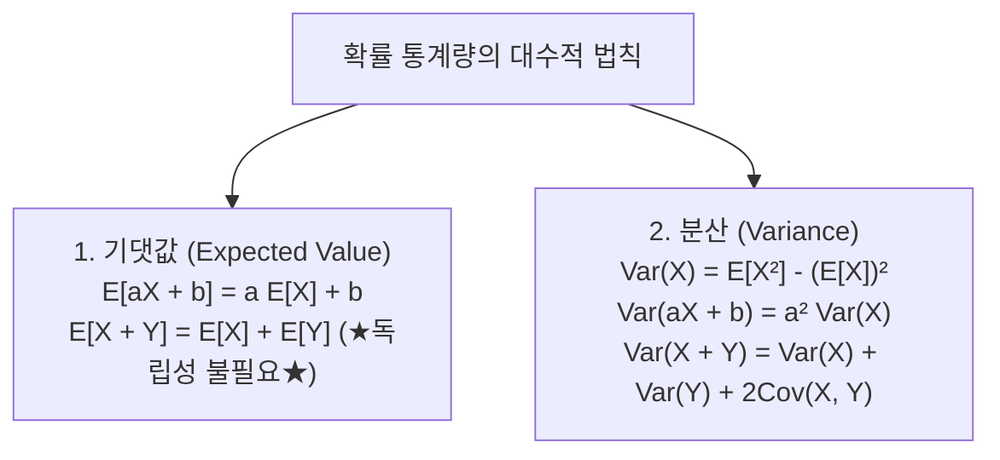

> [!abstract] 핵심 요약
> **기댓값의 선형성($E[aX + bY] = aE[X] + bE[Y]$)**은 변수 간의 독립 여부와 무관하게 언제나 성립하는 확률론 최강의 도구이다.
> 확률 변수의 퍼짐 정도를 측정하는 **분산($\text{Var}(X) = E[X^2] - (E[X])^2$)**과, 정보 이론에서 사건의 예측 불가능성을 정량화하는 **섀넌 엔트로피($H(X) = -\sum P(x) \log_2 P(x)$)**는 손실 함수(Cross-Entropy Loss) 및 결정 트리(Decision Tree) 분할 기준의 핵심 기초이다.

---

## 1. 기댓값과 분산의 주요 대수적 성질



---

## 2. 섀넌 엔트로피와 딥러닝 크로스 엔트로피 손실

### 1) 섀넌 엔트로피 (Shannon Entropy)
$$H(X) = -\sum_{i=1}^n P(x_i) \log_2 P(x_i) \quad (\text{단, } 0 \log 0 = 0)$$

### 2) 쿨백-라이블러 발산 (KL-Divergence) & 크로스 엔트로피
$$D_{KL}(P \parallel Q) = \sum_{x} P(x) \log \frac{P(x)}{Q(x)}$$
$$H(P, Q) = H(P) + D_{KL}(P \parallel Q) = -\sum_{x} P(x) \log Q(x)$$

---

## 3. 실시간 이진 섀넌 엔트로피 곡선 $H(p)$ 시뮬레이터

```html preview
<div style="font-family:system-ui,-apple-system,sans-serif;padding:20px;background:var(--card);color:var(--card-foreground);border:1px solid var(--border);border-radius:var(--radius)">
  <div style="font-size:16px;font-weight:700;margin-bottom:14px;color:var(--primary);display:flex;align-items:center;gap:8px">
    <span>📊 이진 사건 확률 p에 따른 섀넌 엔트로피 H(p) 실시간 계산기</span>
  </div>

  <div style="display:flex;gap:12px;margin-bottom:14px;align-items:center">
    <label style="font-size:12px;font-weight:700">사건 A의 확률 p:</label>
    <input id="entropyP" type="range" min="0.01" max="0.99" step="0.01" value="0.5" style="flex:1" />
    <span id="entropyPVal" style="font-size:14px;font-weight:800;color:var(--chart-1);width:45px">0.50</span>
  </div>

  <div style="display:grid;grid-template-columns:1fr 1fr;gap:12px;margin-bottom:12px">
    <div style="padding:10px;background:var(--background);border:1px solid var(--border);border-radius:var(--radius);text-align:center">
      <div style="font-size:11px;color:var(--muted-foreground)">섀넌 정보 엔트로피 H(p) [bits]</div>
      <div id="entropyValOut" style="font-size:18px;font-weight:800;color:var(--primary);margin-top:2px">1.000 bits</div>
    </div>
    <div style="padding:10px;background:var(--background);border:1px solid var(--border);border-radius:var(--radius);text-align:center">
      <div style="font-size:11px;color:var(--muted-foreground)">불확실성(Uncertainty) 상태</div>
      <div id="uncertaintyDesc" style="font-size:13px;font-weight:700;color:var(--chart-2);margin-top:6px">최대 불확실성 (동전 던지기)</div>
    </div>
  </div>

  <script>
    var pSlider = document.getElementById('entropyP');
    var pOut = document.getElementById('entropyPVal');
    var eOut = document.getElementById('entropyValOut');
    var uOut = document.getElementById('uncertaintyDesc');

    function calcEntropy() {
      var p = parseFloat(pSlider.value);
      pOut.textContent = p.toFixed(2);

      var q = 1 - p;
      var h = -(p * (Math.log(p) / Math.LN2) + q * (Math.log(q) / Math.LN2));

      eOut.textContent = h.toFixed(3) + " bits";

      if (p === 0.5) {
        uOut.textContent = "최대 불확실성 (1.0 bit, 완벽한 균등 동전)";
      } else if (p > 0.8 || p < 0.2) {
        uOut.textContent = "낮은 불확실성 (결과가 매우 편향됨)";
      } else {
        uOut.textContent = "중간 불확실성";
      }
    }

    pSlider.addEventListener('input', calcEntropy);
    calcEntropy();
  </script>
</div>
```
