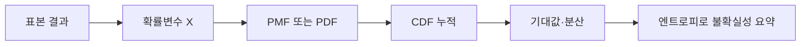

확률변수는 표본공간의 결과를 수치로 바꾸는 함수다. 자료는 이산 확률변수의 PMF와 CDF, 분산 문제, 분포의 불확실성을 나타내는 엔트로피로 이어진다.



<Tabs>
  <Tab label="PMF">이산 확률변수가 각 값을 가질 확률을 기록한다.</Tab>
  <Tab label="CDF">주어진 값 이하가 될 누적 확률을 나타낸다.</Tab>
  <Tab label="분산">기대값 주변에서 값이 얼마나 퍼지는지 측정한다.</Tab>
  <Tab label="엔트로피">확률이 고르게 퍼질수록 높고 한 값에 집중될수록 낮다.</Tab>
</Tabs>

| 분포 모양 | 엔트로피 해석 |
| --- | --- |
| 한 값에 집중 | 확신도가 높아 낮음 |
| 여러 값이 비슷 | 불확실성이 높음 |
| 확률 합 | PMF의 전체 합은 1 |

```html preview
<div style="font-family:system-ui,sans-serif;padding:20px;color:var(--foreground)">
<label for="amt" style="font-size:14px;font-weight:600">확률변수 단계</label>
<div id="out" style="font-size:30px;font-weight:700;color:var(--chart-1);margin:6px 0">1단계</div>
<input id="amt" type="range" min="1" max="4" step="1" value="1" style="width:100%;accent-color:var(--primary)" />
<p style="font-size:13px;color:var(--muted-foreground)">원본 강의 번호와 연습문제 묶음의 순서를 움직인다.</p>
<script>
var amt=document.getElementById('amt'); var out=document.getElementById('out');
amt.addEventListener('input',function(){out.textContent=Number(amt.value).toLocaleString()+'단계';});
</script>
</div>
```

> [!WARNING]
> CDF는 누적 확률이라 단일 값의 PMF와 다르다. 분산 문제에서는 평균과 편차 제곱의 기준을 동일하게 유지한다.

<details>
<summary>정의 점검</summary>

확률변수의 값과 확률을 표로 만든 뒤 PMF 합, CDF의 단조 증가, 분산의 음이 아닌 성질을 확인한다.

</details>

<!-- source: random-variable, variance and normal/entropy decks; PMF/CDF and entropy distinctions preserved -->