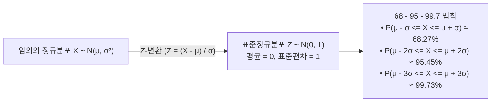

> [!abstract] 핵심 요약
> **연속 확률 변수(Continuous Random Variable)**는 구간 내 무한히 많은 실수 값을 취하며, 특정 한 점의 확률은 $0$이고 구간 적분인 **확률 밀도 함수(PDF, $P(a \le X \le b) = \int_a^b f(x) dx$)**로 확률을 정의한다.
> 자연계와 데이터 과학의 기저가 되는 **정규분포($X \sim \mathcal{N}(\mu, \sigma^2)$)**와, 모집단의 분포와 무관하게 독립 확률 변수들의 합(평균)이 정규분포로 수렴한다는 **중심극한정리(CLT)**는 통계적 추론의 핵심 기둥이다.

---

## 1. 정규분포(Normal Distribution)와 Z-표준화

$$f(x) = \frac{1}{\sqrt{2\pi}\sigma} \exp\left( -\frac{(x - \mu)^2}{2\sigma^2} \right), \quad Z = \frac{X - \mu}{\sigma} \sim \mathcal{N}(0, 1)$$



---

## 2. 중심극한정리 (Central Limit Theorem, CLT)

평균 $\mu$, 분산 $\sigma^2$을 갖는 임의의 독립항등분포(i.i.d.) 확률 변수 $X_1, X_2, \dots, X_n$의 표본 평균 $\bar{X}_n = \frac{1}{n}\sum_{i=1}^n X_i$에 대해:

$$\bar{X}_n \xrightarrow{d} \mathcal{N}\left( \mu, \; \frac{\sigma^2}{n} \right) \quad (\text{as } n \to \infty)$$

---

## 3. 실시간 가우스 정규분포 및 Z-구간 확률 적분기

```html preview
<div style="font-family:system-ui,-apple-system,sans-serif;padding:20px;background:var(--card);color:var(--card-foreground);border:1px solid var(--border);border-radius:var(--radius)">
  <div style="font-size:16px;font-weight:700;margin-bottom:14px;color:var(--primary);display:flex;align-items:center;gap:8px">
    <span>🔔 가우스 정규분포 N(μ, σ²) Z-점수 및 확률 실시간 계산기</span>
  </div>

  <div style="display:grid;grid-template-columns:repeat(3, 1fr);gap:10px;margin-bottom:14px">
    <div>
      <label style="font-size:11px;color:var(--muted-foreground)">평균 (μ):</label>
      <input id="inMu" type="number" value="100" style="width:100%;padding:4px 8px;background:var(--background);color:var(--foreground);border:1px solid var(--border);border-radius:var(--radius);font-weight:700" />
    </div>
    <div>
      <label style="font-size:11px;color:var(--muted-foreground)">표준편차 (σ):</label>
      <input id="inSigma" type="number" value="15" min="0.1" style="width:100%;padding:4px 8px;background:var(--background);color:var(--foreground);border:1px solid var(--border);border-radius:var(--radius);font-weight:700" />
    </div>
    <div>
      <label style="font-size:11px;color:var(--muted-foreground)">관측값 (X):</label>
      <input id="inObsX" type="number" value="130" style="width:100%;padding:4px 8px;background:var(--background);color:var(--foreground);border:1px solid var(--border);border-radius:var(--radius);font-weight:700" />
    </div>
  </div>

  <div style="display:grid;grid-template-columns:1fr 1fr;gap:10px;margin-bottom:12px">
    <div style="padding:10px;background:var(--background);border:1px solid var(--border);border-radius:var(--radius);text-align:center">
      <div style="font-size:11px;color:var(--muted-foreground)">Z-점수 (Z = (X - μ) / σ)</div>
      <div id="zScoreOut" style="font-family:monospace;font-size:16px;font-weight:800;color:var(--chart-1);margin-top:2px"></div>
    </div>
    <div style="padding:10px;background:var(--background);border:1px solid var(--border);border-radius:var(--radius);text-align:center">
      <div style="font-size:11px;color:var(--muted-foreground)">누적 확률 P(X ≤ x)</div>
      <div id="cdfProbOut" style="font-family:monospace;font-size:16px;font-weight:800;color:var(--chart-2);margin-top:2px"></div>
    </div>
  </div>

  <script>
    function erf(x) {
      // 오차함수 수치 근사 (Abramowitz and Stegun)
      var sign = (x >= 0) ? 1 : -1;
      x = Math.abs(x);
      var a1 =  0.254829592;
      var a2 = -0.284496736;
      var a3 =  1.421413741;
      var a4 = -1.453152027;
      var a5 =  1.061405429;
      var p  =  0.3275911;

      var t = 1.0 / (1.0 + p * x);
      var y = 1.0 - (((((a5 * t + a4) * t) + a3) * t + a2) * t + a1) * t * Math.exp(-x * x);
      return sign * y;
    }

    function stdNormCdf(z) {
      return 0.5 * (1 + erf(z / Math.SQRT2));
    }

    function calcNormal() {
      var mu = parseFloat(document.getElementById('inMu').value) || 0;
      var sigma = parseFloat(document.getElementById('inSigma').value) || 1;
      var x = parseFloat(document.getElementById('inObsX').value) || 0;

      if (sigma <= 0) sigma = 1;

      var z = (x - mu) / sigma;
      var p = stdNormCdf(z);

      document.getElementById('zScoreOut').textContent = "Z = " + z.toFixed(2) + " σ";
      document.getElementById('cdfProbOut').textContent = (p * 100).toFixed(2) + " % (상위 " + ((1 - p) * 100).toFixed(2) + "%)";
    }

    ['inMu', 'inSigma', 'inObsX'].forEach(function(id) {
      document.getElementById(id).addEventListener('input', calcNormal);
    });
    calcNormal();
  </script>
</div>
```
