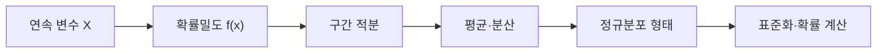

연속 확률변수는 한 점의 확률보다 구간 아래 면적을 사용한다. 자료는 연속 확률변수에서 정규·가우시안 분포와 표준화 예제로 이동한다.



<Tabs>
  <Tab label="밀도">PDF의 높이 자체가 확률은 아니며 구간 면적이 확률이다.</Tab>
  <Tab label="정규">평균을 중심으로 좌우 대칭인 가우시안 곡선을 사용한다.</Tab>
  <Tab label="표준화">평균과 표준편차를 이용해 공통 척도로 변환한다.</Tab>
</Tabs>

| 확인 | 오류 예방 |
| --- | --- |
| 구간 | 확률을 구할 시작·끝을 명시 |
| 면적 | 밀도와 확률을 구분 |
| 매개변수 | 평균·분산 단위 확인 |
| 꼬리 | 좌·우 꼬리 방향 확인 |

```html preview
<div style="font-family:system-ui,sans-serif;padding:20px;color:var(--foreground)">
<label for="amt" style="font-size:14px;font-weight:600">연속 분포 단계</label>
<div id="out" style="font-size:30px;font-weight:700;color:var(--chart-1);margin:6px 0">1단계</div>
<input id="amt" type="range" min="1" max="3" step="1" value="1" style="width:100%;accent-color:var(--primary)" />
<p style="font-size:13px;color:var(--muted-foreground)">원본 강의 번호와 연습문제 묶음의 순서를 움직인다.</p>
<script>
var amt=document.getElementById('amt'); var out=document.getElementById('out');
amt.addEventListener('input',function(){out.textContent=Number(amt.value).toLocaleString()+'단계';});
</script>
</div>
```

> [!CAUTION]
> 연속분포에서 특정 한 점의 확률은 면적 관점으로 해석해야 한다. PDF 값과 구간 확률을 같은 것으로 쓰지 않는다.

<details>
<summary>문제 풀이</summary>

분포 매개변수 확인 → 구간 또는 꼬리 표시 → 적분/표준화 식 선택 → 확률 범위 검산 순서로 풀이한다.

</details>

<!-- source: continuous and normal RV decks plus problem PDFs; density/area distinction preserved -->