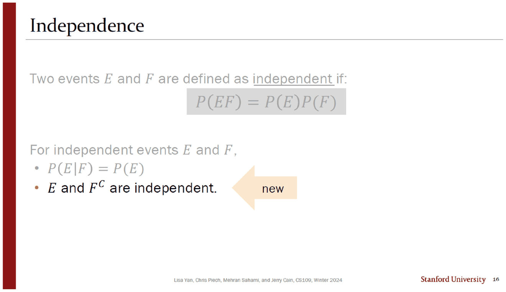
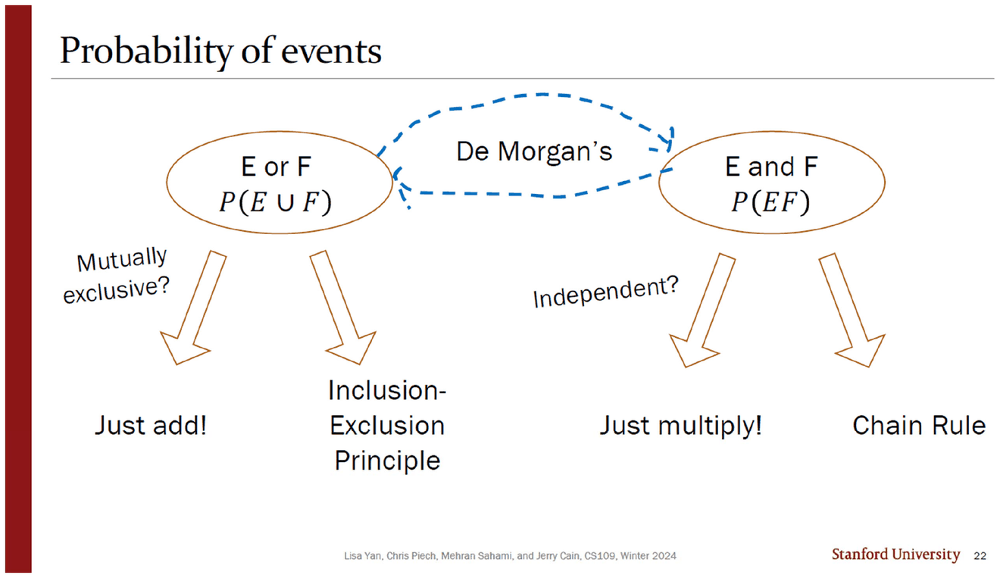
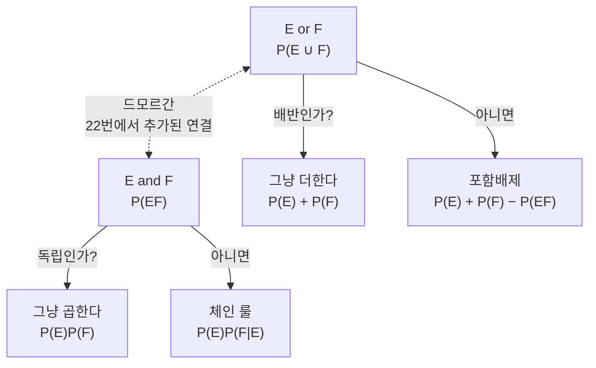
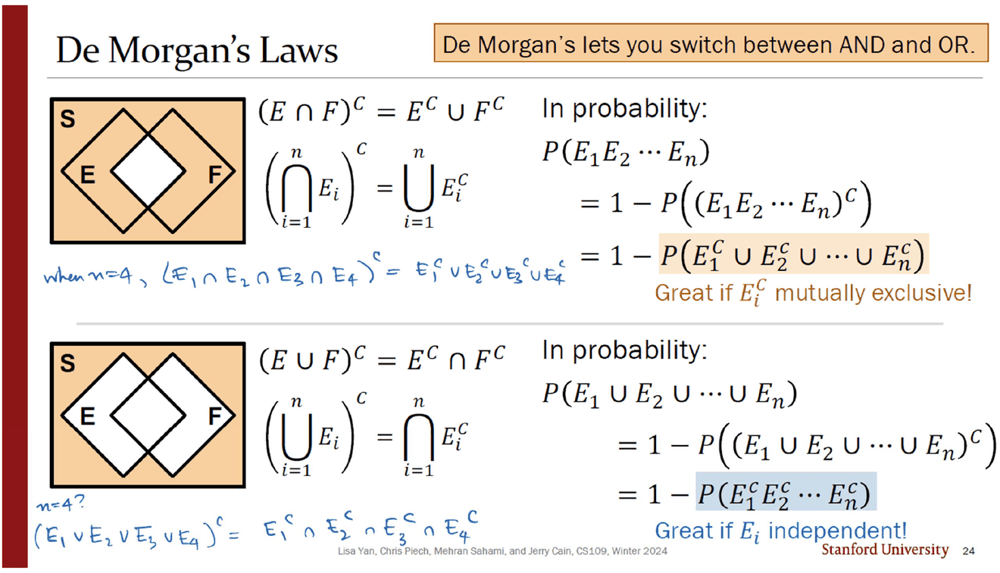
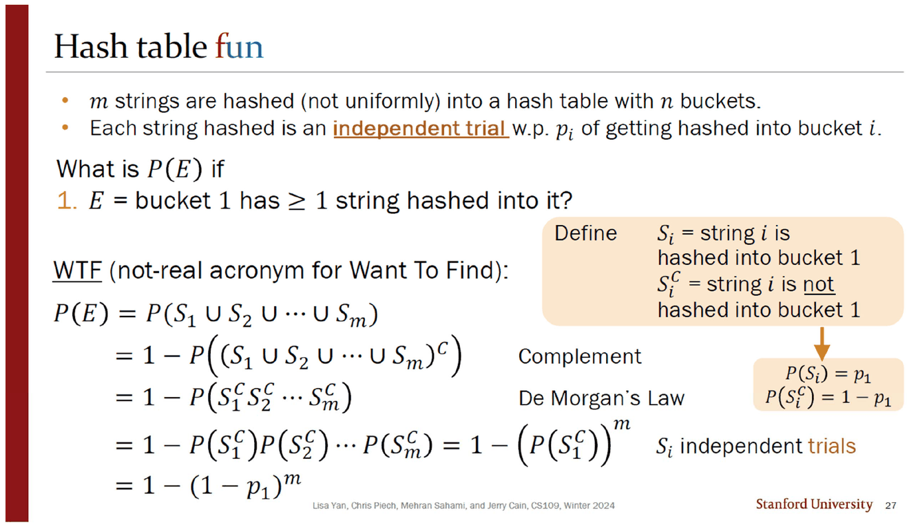
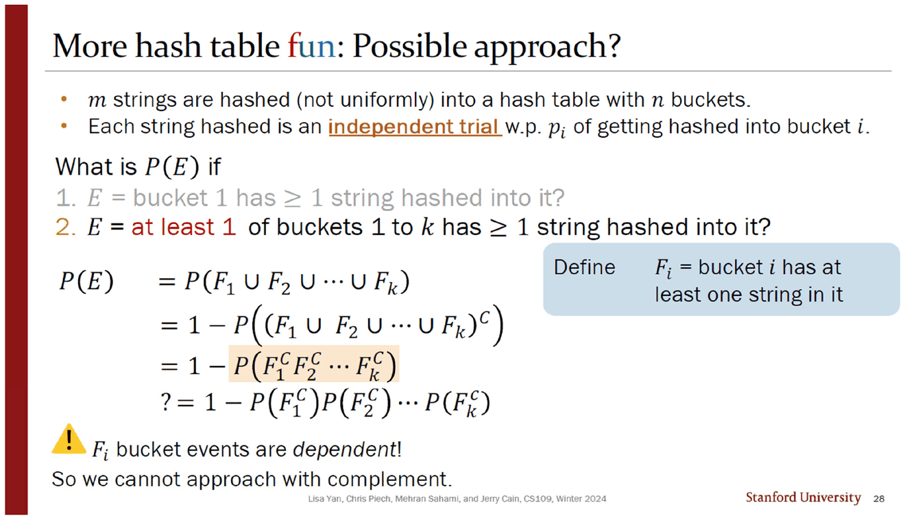
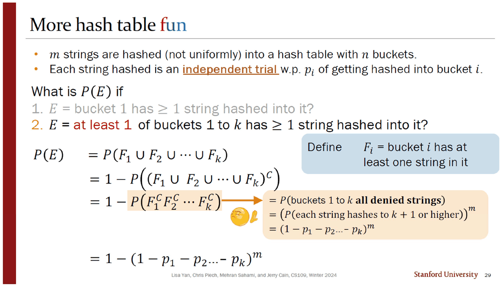
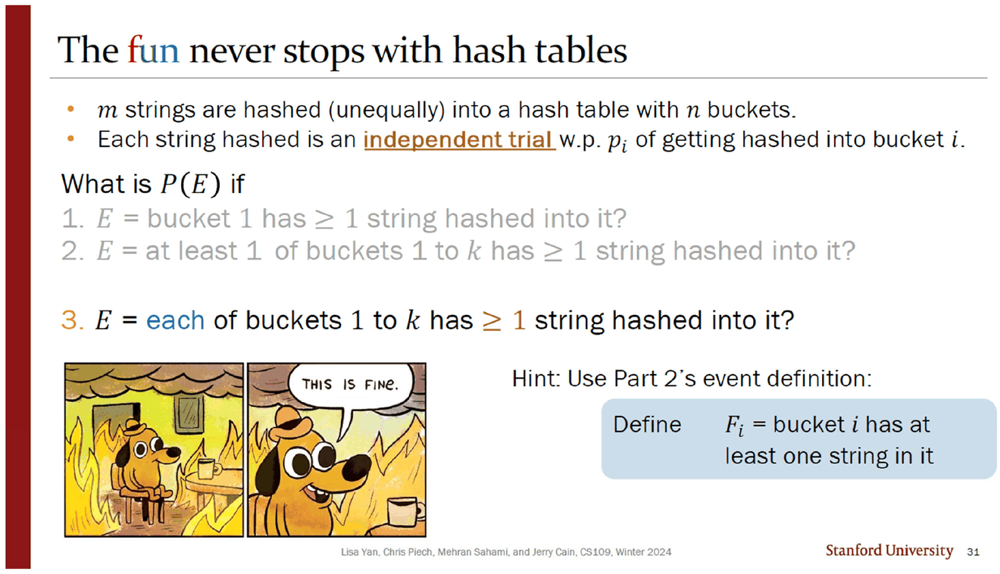

> [!abstract] 여집합은 두 번 통하고 세 번째에 막힌다
> 덱의 뒤 절반은 새 개념을 거의 도입하지 않는다. 대신 **지금까지 쌓은 도구를 한 장의 지도로 정리하고**(20~22번), 그 지도를 해시 테이블 문제 세 개에 차례로 들이댄다.
>
> 1번 문제는 여집합과 곱셈으로 한 줄에 풀린다. 2번은 「여집합으로는 접근할 수 없다」는 선언이 붙는데 **바로 다음 장이 여집합으로 푼다.** 3번은 힌트만 주고 「This is fine」 밈과 함께 끝난다 — 이 덱에서 답이 인쇄되지 않은 유일한 문제이고, 덱의 마지막 슬라이드다.

---

## 여집합에도 독립이 옮아간다

앞 절반이 정의와 반례였다면([03. 독립 — 정의는 한 줄이고 직관은 매번 틀린다](<./03. 독립 — 정의는 한 줄이고 직관은 매번 틀린다.md>)), 16번은 정의를 **쓸 수 있게 만드는** 성질 하나를 추가한다.



슬라이드는 이전 내용을 회색으로 지워 놓고 새 줄 하나만 검게 남긴 뒤 주황 화살표에 `new` 라고 쓴다.

> $E$ and $F^C$ are independent.

17번의 증명은 네 줄이고, 각 줄의 근거가 오른쪽에 적혀 있다.

$$P(EF^C)\overset{\text{교집합}}{=}P(E)-P(EF)\overset{\text{독립}}{=}P(E)-P(E)P(F)\overset{\text{인수분해}}{=}P(E)[1-P(F)]\overset{\text{여집합}}{=}P(E)P(F^C)$$

잉크는 증명 아래에 결론을 조건부 형태로 한 번 더 옮겨 적는다 — *"mathematically: $P(E\mid F^C)=P(E)$."* 주황 상자의 문장이 왜 중요한지가 거기서 드러난다. 「$F$ 가 일어났다는 것을 알아도」가 아니라 **「$F$ 가 일어났든 일어나지 않았든」** 믿음이 변하지 않는다는 것이다.

이 한 줄이 없으면 뒤에 나오는 모든 계산이 막힌다. 해시 문제에서 실제로 곱하게 되는 것은 $P(S_i)$ 가 아니라 $P(S_i^C)$ 이기 때문이다.

---

## 도구 지도 — 세 단계로 펼쳐지는 한 장

20 · 21 · 22번은 **같은 그림의 세 단계**다. 슬라이드가 한 번에 하나씩 색을 입힌다.

| 단계 | 밝아지는 부분 | 내용 |
| --- | --- | --- |
| 20번 | 왼쪽 절반 | `E or F` → 배반인가? → **그냥 더한다** / 아니면 **포함배제** |
| 21번 | 오른쪽 절반 | `E and F` → 독립인가? → **그냥 곱한다** / 아니면 **체인 룰** |
| 22번 | 양쪽 + 파란 점선 | 두 타원을 **드모르간**이 잇는다 |





네 갈래가 나란히 놓인 것이 이 지도의 요지다. **「더하기」와 「곱하기」는 각각 조건이 붙은 지름길**이고, 조건이 없으면 포함배제와 체인 룰이라는 일반형으로 내려가야 한다. 그리고 드모르간은 그 네 갈래 중 하나를 고르는 것이 아니라, **왼쪽 문제를 오른쪽 문제로 바꿔치기하는 통로**다.



24번은 그 통로를 두 방향으로 다 쓴다. 벤 다이어그램 두 개가 위아래로 놓이고, 각각에 확률 버전이 붙는다.

| 방향 | 항등식 | 확률에서의 쓸모 | 원본의 조건 |
| --- | --- | --- | --- |
| 교집합 → 합집합 | $\left(\bigcap E_i\right)^C=\bigcup E_i^C$ | $P(E_1\cdots E_n)=1-P(E_1^C\cup\cdots\cup E_n^C)$ | *Great if $E_i^C$ mutually exclusive!* |
| 합집합 → 교집합 | $\left(\bigcup E_i\right)^C=\bigcap E_i^C$ | $P(E_1\cup\cdots\cup E_n)=1-P(E_1^C\cdots E_n^C)$ | *Great if $E_i$ independent!* |

잉크가 두 항등식 모두에 $n=4$ 를 대입해 손으로 풀어 쓴다. 그리고 아래쪽 방향의 단서 — **「$E_i$ 가 독립이면 좋다」** — 가 이 덱의 나머지 전부를 지배한다. 합집합을 교집합으로 바꾼 뒤 독립을 써서 곱으로 쪼개는 것, 그것이 앞으로 나올 세 문제의 유일한 전략이다.

---

## 1번 — 통한다



설정: 문자열 $m$ 개가 버킷 $n$ 개짜리 해시 테이블에 **균등하지 않게** 들어간다. 각 문자열은 독립 시행이고 버킷 $i$ 로 갈 확률이 $p_i$ 다. 잉크가 슬라이드 위쪽에 전제를 하나 보충한다 — $\sum_{i=1}^{n}p_i=1$.

> **1번.** 버킷 1에 문자열이 하나 이상 들어갈 확률은?

$S_i$ = 「문자열 $i$ 가 버킷 1로 간다」로 두면 $P(S_i)=p_1$. 27번의 계산은 정확히 지도를 따라간다.

$$P(E)=P(S_1\cup\cdots\cup S_m)
\overset{\text{여집합}}{=}1-P\!\left((S_1\cup\cdots\cup S_m)^C\right)
\overset{\text{드모르간}}{=}1-P(S_1^C\cdots S_m^C)
\overset{\text{독립}}{=}1-\left(1-p_1\right)^m$$

세 단계가 각각 22번 지도의 통로, 24번 아래쪽 방향, 그리고 16·17번의 「여집합도 독립」이다. **앞 세 절이 여기서 한 줄로 합쳐진다.**

슬라이드가 이 풀이에 붙인 이름표가 `WTF (not-real acronym for Want To Find)` 다.

```html preview
<div id="h1-root">
  <style>
    #h1-root{font-family:system-ui,-apple-system,"Segoe UI",sans-serif;color:var(--foreground);padding:4px}
    #h1-root .panel{background:var(--card);border:1px solid var(--border);border-radius:10px;padding:14px}
    #h1-root .row{display:flex;align-items:center;gap:10px;margin:8px 0;font-size:13px;flex-wrap:wrap}
    #h1-root input[type=range]{flex:1;min-width:130px;accent-color:var(--chart-1)}
    #h1-root .out{margin-top:10px;padding:10px 12px;border:1px solid var(--border);border-radius:8px;font-size:14px;line-height:1.8}
    #h1-root code{font-family:ui-monospace,SFMono-Regular,Menlo,monospace}
    #h1-root svg{display:block;margin-top:6px}
  </style>
  <div class="panel">
    <div class="row"><span style="opacity:.7;width:170px">문자열 수 m</span><input type="range" id="h1-m" min="1" max="60" value="10"><b id="h1-mv" style="width:28px;text-align:right">10</b></div>
    <div class="row"><span style="opacity:.7;width:170px">버킷 1로 갈 확률 p<sub>1</sub></span><input type="range" id="h1-p" min="1" max="500" value="100"><b id="h1-pv" style="width:52px;text-align:right">0.100</b></div>
    <svg id="h1-svg" width="100%" height="130" viewBox="0 0 560 130" role="img" aria-label="m이 늘어날 때 버킷 1이 비어 있지 않을 확률"></svg>
    <div class="out" id="h1-out"></div>
  </div>
</div>
<script>
(function(){
  var R=document.getElementById('h1-root');
  function draw(){
    var m=+R.querySelector('#h1-m').value, p=+R.querySelector('#h1-p').value/1000;
    R.querySelector('#h1-mv').textContent=m; R.querySelector('#h1-pv').textContent=p.toFixed(3);
    var W=520,H=90,X0=28,Y0=14;
    var g='<line x1="'+X0+'" y1="'+(Y0+H)+'" x2="'+(X0+W)+'" y2="'+(Y0+H)+'" stroke="var(--border)"/>'
         +'<line x1="'+X0+'" y1="'+Y0+'" x2="'+X0+'" y2="'+(Y0+H)+'" stroke="var(--border)"/>'
         +'<text x="4" y="'+(Y0+6)+'" font-size="10" fill="var(--foreground)" opacity=".7">1</text>'
         +'<text x="4" y="'+(Y0+H)+'" font-size="10" fill="var(--foreground)" opacity=".7">0</text>';
    var d='';
    for(var i=0;i<=60;i++){
      var v=1-Math.pow(1-p,i);
      var x=X0+W*i/60, y=Y0+H*(1-v);
      d+=(i?'L':'M')+x.toFixed(1)+','+y.toFixed(1)+' ';
    }
    g+='<path d="'+d+'" fill="none" stroke="var(--chart-1)" stroke-width="2"/>';
    var cur=1-Math.pow(1-p,m), cx=X0+W*m/60, cy=Y0+H*(1-cur);
    g+='<line x1="'+cx+'" y1="'+Y0+'" x2="'+cx+'" y2="'+(Y0+H)+'" stroke="var(--chart-2)" stroke-dasharray="3 3"/>';
    g+='<circle cx="'+cx+'" cy="'+cy+'" r="4.5" fill="var(--chart-2)"/>';
    g+='<text x="'+X0+'" y="'+(Y0+H+18)+'" font-size="10.5" fill="var(--foreground)" opacity=".7">m = 0</text>';
    g+='<text x="'+(X0+W-34)+'" y="'+(Y0+H+18)+'" font-size="10.5" fill="var(--foreground)" opacity=".7">m = 60</text>';
    R.querySelector('#h1-svg').innerHTML=g;
    R.querySelector('#h1-out').innerHTML=
      '<code>P(버킷 1이 비어 있다) = (1 − '+p.toFixed(3)+')<sup>'+m+'</sup> = '+Math.pow(1-p,m).toFixed(6)+'</code><br>'
      +'<code>P(E) = 1 − '+Math.pow(1-p,m).toFixed(6)+' = <b style="color:var(--chart-1)">'+cur.toFixed(6)+'</b></code>'
      +'<div style="opacity:.8;margin-top:6px">버킷이 균등하지 않아도 식은 <b>p<sub>1</sub> 하나에만</b> 의존한다 — 나머지 버킷이 확률을 어떻게 나눠 갖든 상관없다. 27번이 다른 p<sub>i</sub> 를 한 번도 쓰지 않는 이유다.</div>';
  }
  R.addEventListener('input',draw); draw();
})();
</script>
```

---

## 2번 — 「할 수 없다」고 써 놓고 다음 장에서 한다



> **2번.** 버킷 1부터 $k$ 까지 중 **적어도 하나**에 문자열이 들어갈 확률은?

$F_i$ = 「버킷 $i$ 에 문자열이 하나 이상 있다」로 두고 같은 길을 간다. 여집합, 드모르간까지는 똑같다. 그런데 마지막 한 걸음에서 슬라이드가 물음표를 붙인다.

$$?\;=\;1-P(F_1^C)P(F_2^C)\cdots P(F_k^C)$$

노란 경고 삼각형과 함께 두 줄이 붙는다.

> $F_i$ bucket events are *dependent*!
> **So we cannot approach with complement.**

$F_i$ 들이 종속인 것은 맞다 — 버킷 1이 비어 있다는 사실은 그 문자열들이 다른 버킷에 있다는 뜻이므로 버킷 2가 비어 있을 확률을 낮춘다. 그래서 **곱으로 쪼개는 마지막 등식이 성립하지 않는다.**

그런데 다음 장이 곧바로 그 여집합으로 답을 낸다.



$$P(F_1^C F_2^C\cdots F_k^C)=P(\text{버킷 1}\sim k\text{ 가 전부 비어 있다})=\Big(P(\text{한 문자열이 }k{+}1\text{ 이상으로 간다})\Big)^{m}=(1-p_1-p_2-\cdots-p_k)^m$$

$$\therefore\ P(E)=1-(1-p_1-\cdots-p_k)^m$$

> [!caution] 28번의 문장이 실제보다 넓다
> *"So we cannot approach with complement"* 는 과한 표현이다. **여집합으로 접근하는 것 자체는 막히지 않는다** — 29번이 정확히 그렇게 푼다. 막히는 것은 여집합을 **버킷별 인수의 곱으로 분해하는 것**이고, 그것은 $F_i$ 의 종속성 때문이다. 29번의 풀이는 분해 대상을 버킷이 아니라 **문자열**로 바꿔서(문자열 시행은 독립이다) 같은 여집합을 $m$ 제곱 하나로 끝낸다. 28번의 물음표 줄이 겨냥한 것은 「$P(F_i^C)$ 들의 곱」이지 「여집합」이 아니다.

두 값이 얼마나 다른지는 계산해 보면 바로 보인다. 아래에서 29번의 정답과, 28번이 물음표를 붙인 **틀린 곱 형태**를 나란히 둔다. 버킷 확률은 모두 균등($p_i=1/n$)으로 두었다 — 원본은 일반 $p_i$ 로 쓰지만 수치 비교를 위해 이 문서가 택한 설정이다.

```html preview
<div id="h2-root">
  <style>
    #h2-root{font-family:system-ui,-apple-system,"Segoe UI",sans-serif;color:var(--foreground);padding:4px}
    #h2-root .panel{background:var(--card);border:1px solid var(--border);border-radius:10px;padding:14px}
    #h2-root .row{display:flex;align-items:center;gap:10px;margin:8px 0;font-size:13px;flex-wrap:wrap}
    #h2-root input[type=range]{flex:1;min-width:120px;accent-color:var(--chart-1)}
    #h2-root .bars{margin-top:10px}
    #h2-root .bar{margin:7px 0;font-size:13px}
    #h2-root .track{height:20px;border-radius:5px;background:color-mix(in srgb,var(--foreground) 10%,transparent);overflow:hidden;margin-top:3px}
    #h2-root .fill{height:100%;border-radius:5px}
    #h2-root .out{margin-top:10px;padding:10px 12px;border:1px solid var(--border);border-radius:8px;font-size:13.5px;line-height:1.8}
    #h2-root code{font-family:ui-monospace,SFMono-Regular,Menlo,monospace}
  </style>
  <div class="panel">
    <div class="row"><span style="opacity:.7;width:150px">버킷 수 n</span><input type="range" id="h2-n" min="2" max="40" value="10"><b id="h2-nv" style="width:26px;text-align:right">10</b></div>
    <div class="row"><span style="opacity:.7;width:150px">대상 버킷 수 k</span><input type="range" id="h2-k" min="1" max="10" value="3"><b id="h2-kv" style="width:26px;text-align:right">3</b></div>
    <div class="row"><span style="opacity:.7;width:150px">문자열 수 m</span><input type="range" id="h2-m" min="1" max="60" value="8"><b id="h2-mv" style="width:26px;text-align:right">8</b></div>
    <div class="bars">
      <div class="bar"><span style="color:var(--chart-1)">29번의 정답</span> <b id="h2-a"></b><div class="track"><div class="fill" id="h2-af" style="background:var(--chart-1)"></div></div></div>
      <div class="bar"><span style="color:var(--chart-4)">28번이 물음표를 붙인 곱 형태</span> <b id="h2-b"></b><div class="track"><div class="fill" id="h2-bf" style="background:var(--chart-4)"></div></div></div>
    </div>
    <div class="out" id="h2-out"></div>
  </div>
</div>
<script>
(function(){
  var R=document.getElementById('h2-root');
  function draw(){
    var n=+R.querySelector('#h2-n').value, m=+R.querySelector('#h2-m').value;
    var kEl=R.querySelector('#h2-k'); kEl.max=n;
    var k=Math.min(+kEl.value,n);
    R.querySelector('#h2-nv').textContent=n; R.querySelector('#h2-kv').textContent=k; R.querySelector('#h2-mv').textContent=m;
    var p=1/n;
    var right=1-Math.pow(1-k*p,m);              // 29번
    var each=Math.pow(1-p,m);                    // P(F_i^C)
    var wrong=1-Math.pow(each,k);                // 28번이 물음표를 붙인 곱 형태
    R.querySelector('#h2-a').textContent=right.toFixed(6);
    R.querySelector('#h2-b').textContent=wrong.toFixed(6);
    R.querySelector('#h2-af').style.width=(right*100)+'%';
    R.querySelector('#h2-bf').style.width=(wrong*100)+'%';
    var diff=wrong-right;
    R.querySelector('#h2-out').innerHTML=
      '<code>정답 = 1 − (1 − '+k+'/'+n+')<sup>'+m+'</sup></code><br>'
      +'<code>곱 형태 = 1 − ((1 − 1/'+n+')<sup>'+m+'</sup>)<sup>'+k+'</sup></code>'
      +'<div style="margin-top:6px">차이 <b>'+(diff>=0?'+':'')+diff.toFixed(6)+'</b>. '
      +(k===1
        ? 'k = 1 일 때는 두 식이 같다 — 버킷이 하나뿐이면 종속이 생길 자리가 없다.'
        : '곱 형태는 언제나 정답보다 <b>크다</b>. 버킷들이 서로 비어 있기를 방해한다는 사실(= 종속)을 무시하고 독립인 것처럼 곱했기 때문이다.')
      +'</div>';
  }
  R.addEventListener('input',draw); draw();
})();
</script>
```

> [!note] 이 비교는 원본에 없다
> 원본은 28번에서 곱 형태에 물음표를 붙이고 버렸을 뿐, 그 값을 계산하지 않는다. 위의 대조는 두 식이 얼마나 어긋나는지를 보이기 위해 이 문서가 균등 분포($p_i=1/n$)를 가정하고 계산한 **보충**이다. 원본이 실제로 보증하는 것은 29번의 $1-(1-p_1-\cdots-p_k)^m$ 하나다.

---

## 3번 — 끝나지 않는다



30번은 1·2번에 초록 체크를 달고 한 줄을 남긴다 — *"Looking for a challenge? ☺"*. 그리고 31번이 3번 문제를 던진다.

> **3번.** 버킷 1부터 $k$ 까지가 **각각** 문자열을 하나 이상 갖게 될 확률은?

2번의 「적어도 하나」가 3번에서 「각각」으로 바뀌었다. 힌트는 *"Use Part 2's event definition"* 뿐이고, 그림은 불타는 방에 앉아 「THIS IS FINE」이라고 말하는 개다. **덱은 여기서 끝난다.** 답도, 다음 슬라이드도 없다.

무엇이 어려워졌는지는 기호만 봐도 보인다.

| 문제 | 사건 | 여집합 | 여집합의 모양 |
| --- | --- | --- | --- |
| 2번 | $F_1\cup\cdots\cup F_k$ | $F_1^C\cdots F_k^C$ | **교집합** — 「전부 비었다」, 문자열 단위로 곱이 된다 |
| 3번 | $F_1\cdots F_k$ | $F_1^C\cup\cdots\cup F_k^C$ | **합집합** — 「적어도 하나가 비었다」, 곱으로 떨어지지 않는다 |

2번에서는 여집합이 교집합이 되어 문자열 $m$ 개의 독립을 그대로 쓸 수 있었다. 3번에서는 여집합이 **합집합**이 되므로, 22번 지도의 왼쪽 갈래 — 배반이 아닐 때 쓰는 **포함배제** — 로 돌아가야 한다. 지도의 네 갈래 중 이 덱이 실제로 한 번도 계산에 쓰지 않은 갈래가 정확히 그것이다. *(이 문단의 분석은 원본에 없다. 원본이 주는 것은 힌트 한 줄과 밈 한 장이다.)*

---

## 원본에서 확인한 것

> [!caution] 「여집합으로 접근할 수 없다」는 다음 장에서 반박된다
> 28번의 결론 문장 *"So we cannot approach with complement"* 은 29번의 풀이와 충돌한다. 29번은 같은 여집합 $P(F_1^C\cdots F_k^C)$ 를 그대로 계산해 답을 낸다. 실제로 막히는 것은 여집합을 $P(F_1^C)\cdots P(F_k^C)$ 로 **인수분해**하는 단계다. 문장이 한 단계 넓게 적혀 있다.

<!-- -->
> [!caution] 같은 전제 줄의 낱말이 두 슬라이드에서 다르다
> 해시 문제의 첫 줄은 25~30번에서 *"$m$ strings are hashed **(not uniformly)** into a hash table"* 인데, 마지막 31번에서만 *"**(unequally)**"* 로 바뀐다. 뜻은 같지만 여섯 장 내내 유지되던 문구가 마지막 한 장에서 흔들린다.

<!-- -->
> [!caution] 덱이 답 없이 끝난다
> 31번이 PDF의 마지막 쪽이다. 3번 문제에는 힌트 한 줄 외에 아무 풀이도 없고, 다음 강의(`06_random variables`)도 이 문제로 돌아오지 않는다. [05. 확률변수 — 표본공간을 숫자 하나로 접는다](<./05. 확률변수 — 표본공간을 숫자 하나로 접는다.md>)에서 확인했듯 06번 덱은 완전히 다른 주제로 시작한다.

<!-- -->
> [!note] 잉크가 보충한 전제
> 26번 슬라이드 오른쪽 위에 $\sum_{i=1}^{n}p_i=1$ 이 손으로 적혀 있다. 인쇄된 본문은 「각 문자열이 확률 $p_i$ 로 버킷 $i$ 에 들어간다」고만 하고 $p_i$ 들의 합에 대해 말하지 않는다. 29번의 $1-p_1-\cdots-p_k$ 를 「$k+1$ 이상으로 갈 확률」로 읽으려면 그 전제가 필요하다.

<!-- -->
> [!note] 지도의 네 갈래 중 셋만 쓰인다
> 22번 지도는 **그냥 더하기 · 포함배제 · 그냥 곱하기 · 체인 룰** 네 갈래를 그린다. 이 덱의 나머지에서 실제 계산에 쓰이는 것은 그냥 곱하기(독립 시행)와 여집합뿐이고, 체인 룰과 포함배제는 그림에만 있다. 그리고 답이 인쇄되지 않은 3번 문제가 **정확히 포함배제를 요구한다.**

---

## 다음 문서로

여기까지 확률은 「사건」에 붙는 수였다. 다음 덱(`06_random variables`)은 사건을 버리고 **숫자**로 넘어간다 — 표본공간 전체를 실수 하나로 접는 함수, 곧 확률변수다.

- [05. 확률변수 — 표본공간을 숫자 하나로 접는다](<./05. 확률변수 — 표본공간을 숫자 하나로 접는다.md>)
- [03. 독립 — 정의는 한 줄이고 직관은 매번 틀린다](<./03. 독립 — 정의는 한 줄이고 직관은 매번 틀린다.md>)

## 근거 자료

| 원본 쪽(슬라이드) | 제목 | 이 문서에서 쓴 곳 |
| --- | --- | --- |
| 15·16 (16·17) | Independence / Independence of complements | 여집합에도 독립이 옮아간다 |
| 17 (19) | (biased) Coin Flips | 독립 시행의 이항 꼴 — [07. 분산](<./07. 분산 — 같은 평균을 가진 분포를 가르는 수.md>)으로 넘긴다 |
| 18·19·20 (20·21·22) | Probability of events ×3 | 도구 지도 세 단계 |
| 21 (23) | Augustus De Morgan | 인물 소개 |
| 22 (24) | De Morgan's Laws | 두 방향의 통로 |
| 23·24·25 (25·26·27) | Hash table fun | 1번 문제 |
| 26·27 (28·29) | More hash table fun | 2번 문제와 그 선언 |
| 28·29 (30·31) | The fun never stops with hash tables | 3번 문제 — 답 없음 |

원본 15쪽, 슬라이드 16장(18번은 PDF에 없음). 인용 이미지 7장은 200 dpi 렌더다.
