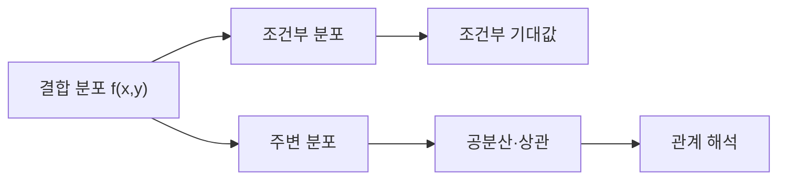

두 확률변수의 결합분포에서 주변분포를 얻고, 조건부 분포와 조건부 기대값으로 관계를 정량화한다. 공분산·상관은 함께 변하는 방향과 크기를 요약하지만 인과관계를 보장하지 않는다.



<Tabs>
  <Tab label="결합">두 변수의 동시 확률 또는 밀도를 기록한다.</Tab>
  <Tab label="주변">한 변수를 합 또는 적분해 제거한다.</Tab>
  <Tab label="조건부">다른 변수의 값이 주어졌을 때의 분포를 정규화한다.</Tab>
  <Tab label="상관">공분산을 표준편차로 스케일해 선형 동조를 비교한다.</Tab>
</Tabs>

| 개념 | 주의 |
| --- | --- |
| 독립 | 결합이 주변의 곱으로 분리되는 조건 |
| 공분산 | 단위의 영향을 받음 |
| 상관 | 표준화된 선형 관계 |
| 인과 | 상관만으로 결론 내릴 수 없음 |

```html preview
<div style="font-family:system-ui,sans-serif;padding:20px;color:var(--foreground)">
<label for="amt" style="font-size:14px;font-weight:600">결합 확률 단계</label>
<div id="out" style="font-size:30px;font-weight:700;color:var(--chart-1);margin:6px 0">1단계</div>
<input id="amt" type="range" min="1" max="4" step="1" value="1" style="width:100%;accent-color:var(--primary)" />
<p style="font-size:13px;color:var(--muted-foreground)">원본 강의 번호와 연습문제 묶음의 순서를 움직인다.</p>
<script>
var amt=document.getElementById('amt'); var out=document.getElementById('out');
amt.addEventListener('input',function(){out.textContent=Number(amt.value).toLocaleString()+'단계';});
</script>
</div>
```

> [!WARNING]
> 공분산·상관이 크다고 원인과 결과가 정해지는 것은 아니다. 자료의 spurious correlation 사례처럼 제3의 요인을 점검한다.

<details>
<summary>계산 순서</summary>

결합식의 정의역 확인 → 주변화 또는 조건부 정규화 → 기대값 계산 → 공분산·상관 해석 순으로 진행한다.

</details>

<!-- source: joint RV, independent RV, joint statistics, conditional expectation and continuous joint decks; caveats preserved -->