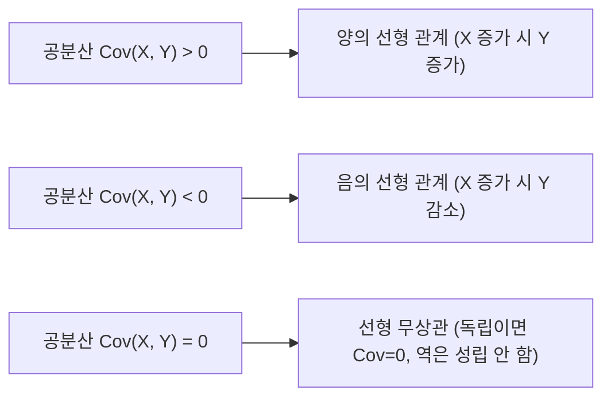

> [!abstract] 핵심 요약
> **결합 확률 분포(Joint Distribution)**는 두 개 이상의 확률 변수가 동시에 취하는 상호작용의 확률 법칙을 기술한다.
> 결합 분포에서 특정 변수를 적분/합산하여 추출하는 **주변화(Marginalization)**, 두 변수의 선형 관계 방향을 측정하는 **공분산($\text{Cov}(X, Y)$)**과 **상관계수($\rho \in [-1, 1]$)**, 그리고 분산을 조건부 성분으로 분해하는 **전체 분산의 법칙(Eve's Law: $\text{Var}(X) = E[\text{Var}(X|Y)] + \text{Var}(E[X|Y])$)**은 다변량 통계학과 머신러닝의 초석이다.

---

## 1. 공분산(Covariance)과 피어슨 상관계수(Correlation)

$$\text{Cov}(X, Y) = E\big[(X - \mu_X)(Y - \mu_Y)\big] = E[XY] - E[X]E[Y]$$

$$\rho_{X, Y} = \frac{\text{Cov}(X, Y)}{\sigma_X \sigma_Y} \quad (-1 \le \rho \le 1)$$



---

## 2. 조건부 기댓값의 두 정리 (Tower Property & Eve's Law)

| 정리 명칭 | 수학적 공식 | 핵심 의미 |
| :-- | :-- | :-- |
| **전체 기댓값의 법칙 (Tower Property)** | $E[X] = E\big[E[X \mid Y]\big]$ | 조건부 평균들의 평균은 전체 평균과 같다 |
| **전체 분산의 법칙 (Eve's Law)** | $\text{Var}(X) = E\big[\text{Var}(X \mid Y)\big] + \text{Var}\big(E[X \mid Y]\big)$ | 전체 분산 = (그룹 내 평균 분산) + (그룹 간 평균의 분산) |

---

## 3. 실시간 2x2 결합 확률표 공분산 및 상관계수(ρ) 계산기

```html preview
<div style="font-family:system-ui,-apple-system,sans-serif;padding:20px;background:var(--card);color:var(--card-foreground);border:1px solid var(--border);border-radius:var(--radius)">
  <div style="font-size:16px;font-weight:700;margin-bottom:14px;color:var(--primary);display:flex;align-items:center;gap:8px">
    <span>📊 2x2 이진 결합 확률 P(X=x, Y=y) 공분산·상관계수(ρ) 계산기</span>
  </div>

  <table style="width:100%;max-width:320px;border-collapse:collapse;margin-bottom:14px;text-align:center;font-size:12px">
    <tr style="border-bottom:1px solid var(--border)">
      <th></th><th>Y = 0</th><th>Y = 1</th>
    </tr>
    <tr>
      <th style="padding:6px">X = 0</th>
      <td><input id="p00" type="number" value="0.4" step="0.05" min="0" max="1" style="width:70px;padding:4px;text-align:center;background:var(--background);color:var(--foreground);border:1px solid var(--border);border-radius:var(--radius);font-weight:700" /></td>
      <td><input id="p01" type="number" value="0.1" step="0.05" min="0" max="1" style="width:70px;padding:4px;text-align:center;background:var(--background);color:var(--foreground);border:1px solid var(--border);border-radius:var(--radius);font-weight:700" /></td>
    </tr>
    <tr>
      <th style="padding:6px">X = 1</th>
      <td><input id="p10" type="number" value="0.1" step="0.05" min="0" max="1" style="width:70px;padding:4px;text-align:center;background:var(--background);color:var(--foreground);border:1px solid var(--border);border-radius:var(--radius);font-weight:700" /></td>
      <td><input id="p11" type="number" value="0.4" step="0.05" min="0" max="1" style="width:70px;padding:4px;text-align:center;background:var(--background);color:var(--foreground);border:1px solid var(--border);border-radius:var(--radius);font-weight:700" /></td>
    </tr>
  </table>

  <div style="display:grid;grid-template-columns:repeat(3, 1fr);gap:8px;margin-bottom:12px">
    <div style="padding:8px;background:var(--background);border:1px solid var(--border);border-radius:var(--radius);text-align:center">
      <div style="font-size:10px;color:var(--muted-foreground)">확률의 합 (∑P = 1.0)</div>
      <div id="sumProbOut" style="font-size:13px;font-weight:700;color:var(--chart-1)"></div>
    </div>
    <div style="padding:8px;background:var(--background);border:1px solid var(--border);border-radius:var(--radius);text-align:center">
      <div style="font-size:10px;color:var(--muted-foreground)">공분산 Cov(X, Y)</div>
      <div id="covOut" style="font-size:13px;font-weight:700;color:var(--chart-2)"></div>
    </div>
    <div style="padding:8px;background:var(--background);border:1px solid var(--border);border-radius:var(--radius);text-align:center">
      <div style="font-size:10px;color:var(--muted-foreground)">상관계수 (ρ_XY)</div>
      <div id="corrOut" style="font-size:14px;font-weight:800;color:var(--primary)"></div>
    </div>
  </div>

  <script>
    function calcJoint() {
      var p00 = parseFloat(document.getElementById('p00').value) || 0;
      var p01 = parseFloat(document.getElementById('p01').value) || 0;
      var p10 = parseFloat(document.getElementById('p10').value) || 0;
      var p11 = parseFloat(document.getElementById('p11').value) || 0;

      var sum = p00 + p01 + p10 + p11;
      document.getElementById('sumProbOut').textContent = sum.toFixed(2);

      // 주변 확률
      var pX1 = p10 + p11;
      var pY1 = p01 + p11;

      var eX = pX1;
      var eY = pY1;
      var eXY = p11; // 1*1*P(1,1)

      var cov = eXY - (eX * eY);
      var varX = eX * (1 - eX);
      var varY = eY * (1 - eY);
      var denom = Math.sqrt(varX * varY);
      var rho = (denom > 0) ? (cov / denom) : 0;

      document.getElementById('covOut').textContent = cov.toFixed(3);
      document.getElementById('corrOut').textContent = rho.toFixed(3);
    }

    ['p00', 'p01', 'p10', 'p11'].forEach(function(id) {
      document.getElementById(id).addEventListener('input', calcJoint);
    });
    calcJoint();
  </script>
</div>
```
