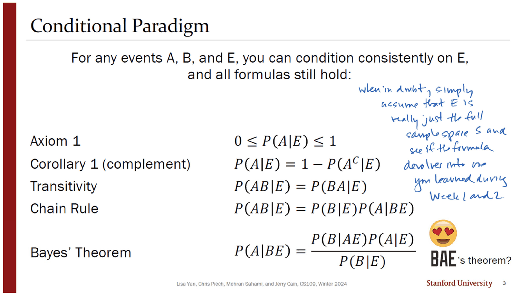
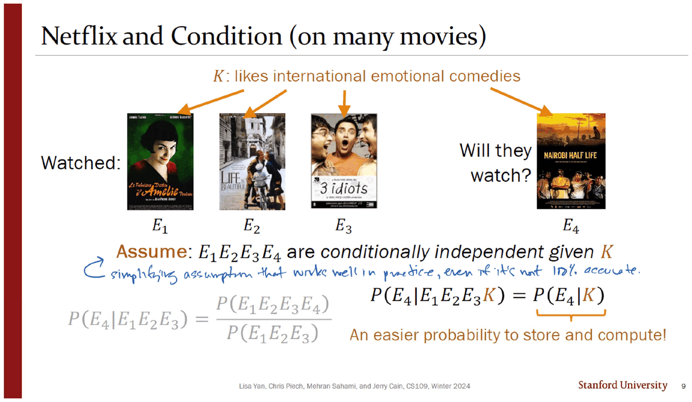
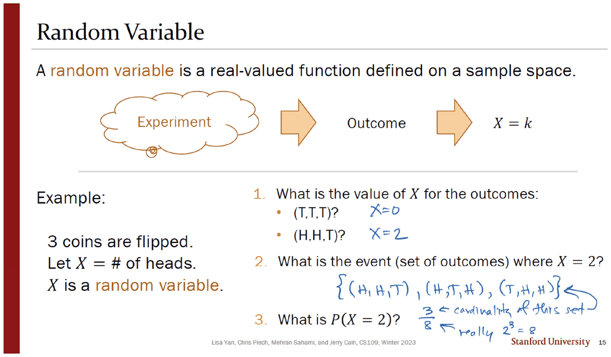
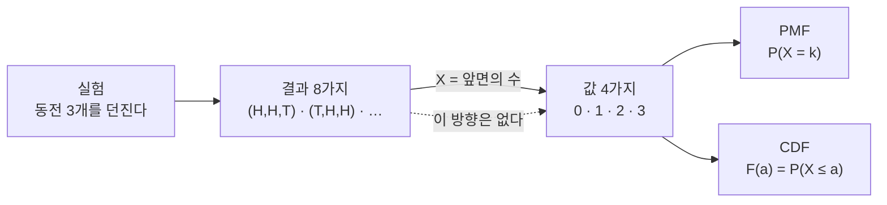
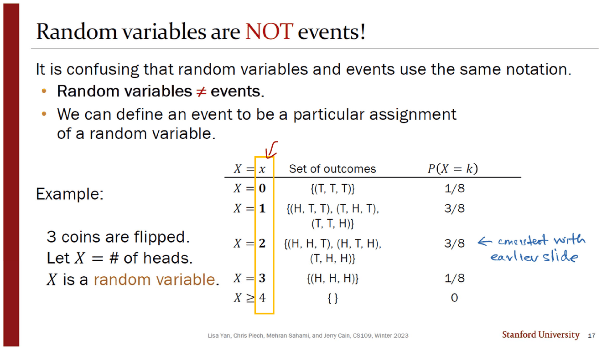
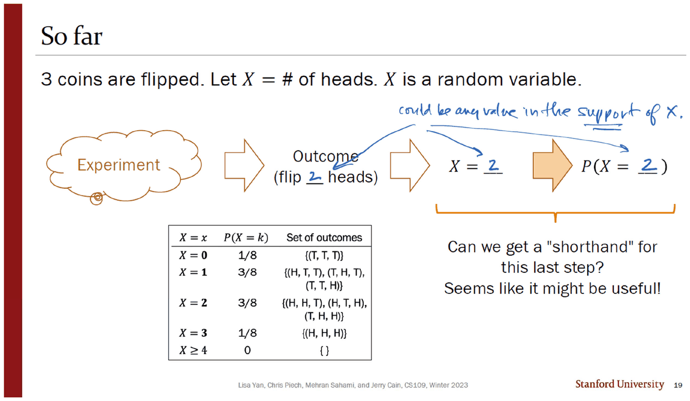
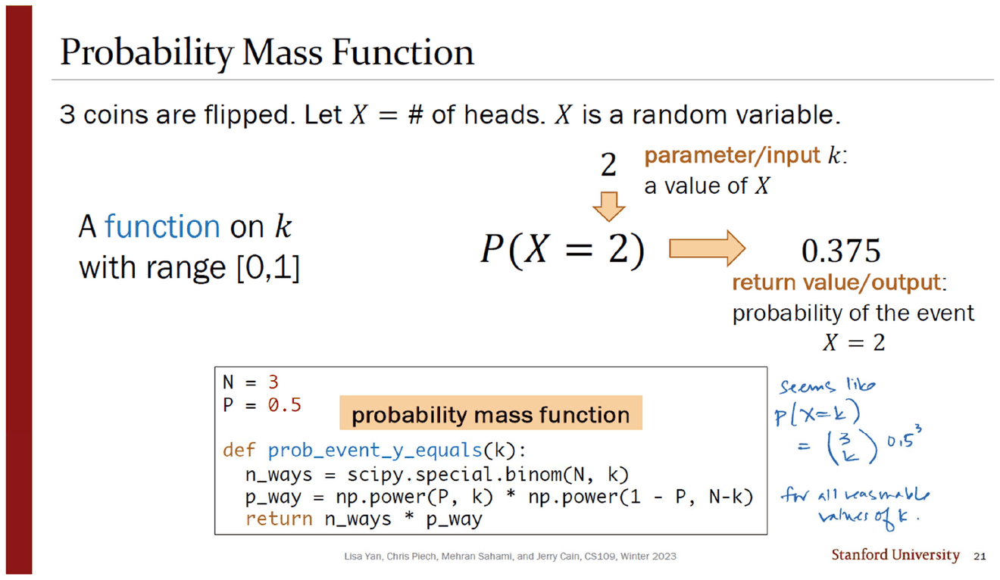
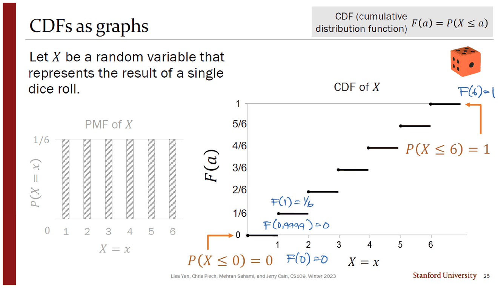

> [!abstract] 이 덱은 두 해를 꿰매 만든 것이다
> 06번 덱(39쪽 · Jerry Cain · 2024년 1월 22일)의 목차는 다섯 토막이다 — `2 Conditional Independence` · `12 Random Variables` · `18 PMF/CDF` · `26 Expectation` · `34 Exercises`. 이 문서는 앞 세 토막(슬라이드 1~25)을 다룬다.
>
> 그런데 슬라이드 하단의 저작권 줄을 따라가면 **덱이 두 해의 자료로 꿰매져 있다.** 조건부 독립 절은 `CS109, Winter 2024`, 확률변수·PMF/CDF 절은 `CS109, **Winter 2023**` 이다. 그리고 그 이음매가 정확히 목차의 경계(슬라이드 12)와 겹친다.

| 절 | 슬라이드 | 하단 연도 | 확인한 쪽 |
| --- | --- | --- | --- |
| Conditional Independence | 3 ~ 11 | Winter **2024** | 3 · 5 · 6 · 9 · 10 · 11 |
| Random Variables · PMF/CDF | 13 ~ 25 | Winter **2023** | 13 · 15 · 17 · 19 · 20 · 21 · 23 · 24 · 25 |

이 이음매는 내용에도 흔적을 남긴다. 앞 절은 05번 덱의 독립을 그대로 이어받아 조건 하나만 덧붙이는 **복습에 가까운 절**이고, 뒤 절은 확률의 언어 자체를 바꾸는 **새 출발**이다. 두 절 사이에는 이어 주는 문장이 한 줄도 없다.

---

## 조건을 붙여도 전부 그대로다



3번 슬라이드는 지금까지 배운 공식 다섯 개를 세로로 늘어놓고 **전부에 $\mid E$ 를 붙인다.**

| 이름 | 조건부 버전 |
| --- | --- |
| 공리 1 | $0\le P(A\mid E)\le 1$ |
| 따름정리 1 (여집합) | $P(A\mid E)=1-P(A^C\mid E)$ |
| 교환 | $P(AB\mid E)=P(BA\mid E)$ |
| 체인 룰 | $P(AB\mid E)=P(B\mid E)P(A\mid BE)$ |
| 베이즈 정리 | $P(A\mid BE)=\dfrac{P(B\mid AE)P(A\mid E)}{P(B\mid E)}$ |

제목이 `Conditional Paradigm` 이고 본문은 한 문장이다 — *"For any events A, B, and E, you can condition consistently on E, and all formulas still hold."* 새 정리가 아니라 **읽는 법**이다.

잉크가 그 읽는 법을 실행 가능한 절차로 바꿔 적는다.

> when in doubt, simply assume that $E$ is really just the full sample space $S$ and see if the formula devolves into one you learned during Week 1 and 2.

$E=S$ 로 두면 $P(A\mid S)=P(A)$ 이므로 다섯 줄이 전부 원래 공식으로 되돌아간다. **조건부 세계는 표본공간을 $E$ 로 갈아 끼운 원래 세계**라는 것이 이 절의 전부다. (슬라이드는 베이즈 줄 옆에 하트 눈 이모지와 `BAE's theorem?` 이라는 농담을 붙여 두었다.)

5번이 그 원칙을 조건부 독립의 정의에 적용한다. 정의는 $P(AB\mid E)=P(A\mid E)P(B\mid E)$ 이고, 「동치인 정의」 후보로 셋을 제시한다.

| 후보 | 식 |
| --- | --- |
| A | $P(A\mid B)=P(A)$ |
| B | $P(A\mid BE)=P(A)$ |
| **C** | $P(A\mid BE)=P(A\mid E)$ |

슬라이드가 C에 동그라미를 치고 이유를 적는다 — *"E is the new sample space, so left and right side must both be conditioned on E."* 잉크가 왼쪽에 같은 말을 자기 문장으로 다시 쓴다.

> each of these might be true, but only the third one conditions everything on $E$, so it's the only one that's equivalent to the above definition.

**「참일 수도 있다」와 「동치다」를 구분한 것**이 이 잉크의 요지다. A와 B도 어떤 상황에서는 성립하지만, 정의와 항상 같은 뜻이 되는 것은 C뿐이다.

---

## 조건부 독립이 실제로 사는 곳



6번이 넷플릭스 예로 조건부 확률을 실제 수로 보여 준다 — 5,092만 명 중 1,023만 명이 「인생은 아름다워」를 봤으므로 $P(E)\approx 0.20$, 「아멜리에」를 본 사람으로 좁히면 $P(E\mid F)\approx 0.42$. 두 배가 넘는다.

9번은 그 관찰을 네 편으로 확장한다. $E_1,E_2,E_3$ 을 본 사람이 $E_4$ 도 볼 확률은?

$$P(E_4\mid E_1E_2E_3)=\frac{P(E_1E_2E_3E_4)}{P(E_1E_2E_3)}$$

슬라이드는 이 식을 회색으로 죽이고, 대신 가정 하나를 놓는다 — $E_1E_2E_3E_4$ 가 $K$(「국제 감성 코미디를 좋아한다」)가 주어졌을 때 조건부 독립이라면,

$$P(E_4\mid E_1E_2E_3K)=P(E_4\mid K)$$

그리고 주황색으로 한 줄 — *"An easier probability to store and compute!"* 잉크가 그 가정의 성격을 정확히 적는다.

> simplifying assumption that works well in practice, even if it's not 100% accurate.

11번이 이 절의 결론을 상자에 담는다.

> Dependent events can be conditionally independent.
> (**And vice versa**: Independent events can be conditionally dependent.)

네 영화는 서로 **종속**이다(감성 코미디를 좋아하는 사람은 넷을 다 볼 가능성이 높다). 그런데 「좋아한다」는 사실 $K$ 를 알고 나면 그 연결이 사라진다. $K$ 가 종속의 **원인**이었기 때문이다. 10번은 이 아이디어의 무게를 인용 하나로 못 박는다 — 2011년 튜링상 수상자 주디아 펄, *"Exploiting conditional independence to generate fast probabilistic computations is one of the main contributions CS has made to probability theory."*

> [!note] 6주 뒤로 미뤄진 질문
> 11번 오른쪽에 *"Challenge: How do we determine $K$? Stay tuned in 6 weeks' time!"* 라고 적혀 있다. $K$ 를 관측할 수 없는 변수로 두고 데이터에서 추정하는 것 — 이 과목의 `23_naive_bayes` 덱이 다루는 주제다. 그 덱은 `sources/` 에 있지만 이 회차의 범위 밖이다.

---

## 접기 — 표본공간을 숫자 하나로

12번 구분 슬라이드를 지나면 덱의 언어가 바뀐다. 사건이 사라지고 **숫자**가 들어온다.

13번이 그 전환을 프로그래머의 언어로 번역한다. `int a = 5;` 옆에 「미래의 배틀에 데려갈 포켓몬의 수 $A\in\{1,\dots,6\}$」, `double b = 4.2;` 옆에 「배틀에서 이긴 뒤 받을 돈 $B\in\mathbb{R}^+$」, `bit c = 1;` 옆에 「사천왕을 이기면 1, 아니면 0인 $C\in\{0,1\}$」. 주황 상자의 요약은 — *"Random variables are like typed variables (with uncertainty)."*



15번이 정의와 그림을 함께 놓는다.

> A **random variable** is a real-valued function defined on a sample space.

그림은 화살표 두 개다 — `Experiment` → `Outcome` → `X = k`. 첫 화살표는 확률이 하는 일(어떤 결과가 나온다), 둘째 화살표가 **확률변수가 하는 일**(그 결과에 숫자를 붙인다)이다.

잉크가 동전 세 개 예제로 세 물음에 답한다. $(T,T,T)\Rightarrow X=0$, $(H,H,T)\Rightarrow X=2$, 그리고 $X=2$ 인 사건은 $\{(H,H,T),(H,T,H),(T,H,H)\}$ — 잉크가 화살표로 「cardinality of this set」 이라 쓰고 $\tfrac38$ 을 적으며 분모 옆에 「really $2^3=8$」 이라 덧붙인다.



점선으로 표시한 방향이 이 절의 핵심이다. $X=2$ 라는 값에서 「어느 동전이 앞면이었나」로 되돌아갈 길은 없다. **접기는 정보를 버리는 연산이다.**

---

## 접기 이전이 마지막으로 보이는 자리



17번의 제목은 경고다 — **Random variables are NOT events!** 본문이 이유를 밝힌다. *"It is confusing that random variables and events use the same notation."* $P(X=2)$ 에서 $X$ 는 확률변수이고 $X=2$ 는 사건이다. 표기가 그 둘을 구분해 주지 않는다.

그래서 슬라이드는 표를 하나 그려 **양쪽을 한 화면에 둔다.**

| $X = x$ | Set of outcomes | $P(X=k)$ |
| --- | --- | --- |
| $X=0$ | $\{(T,T,T)\}$ | $1/8$ |
| $X=1$ | $\{(H,T,T),(T,H,T),(T,T,H)\}$ | $3/8$ |
| $X=2$ | $\{(H,H,T),(H,T,H),(T,H,H)\}$ | $3/8$ |
| $X=3$ | $\{(H,H,H)\}$ | $1/8$ |
| $X\ge 4$ | $\{\ \}$ | $0$ |

가운데 열이 **접기 이전**이고, 오른쪽 열이 **접기 이후**다. 잉크가 왼쪽 열을 노란 네모로 둘러 표시하고 `3/8` 행 옆에 「consistent with earlier slide」라 적는다 — 15번에서 손으로 계산했던 값과 같다는 확인이다.



19번(`So far`)이 같은 표를 한 번 더 싣는다. 그리고 **이 덱에서 `Set of outcomes` 열이 보이는 것은 이 슬라이드가 마지막이다.** 20번부터 끝까지, 남는 것은 $P(X=k)$ 뿐이다. 슬라이드 스스로가 그 전환을 질문 형태로 적는다.

> Can we get a "shorthand" for this last step? Seems like it might be useful!

잉크가 화살표 위에 조건을 하나 붙인다 — 밑줄 친 *"could be any value in the support of $X$."* 「마지막 단계의 축약」이 곧 PMF이고, 그 함수의 정의역이 **지지집합**이라는 예고다.

```html preview
<div id="fold-root">
  <style>
    #fold-root{font-family:system-ui,-apple-system,"Segoe UI",sans-serif;color:var(--foreground);padding:4px}
    #fold-root .panel{background:var(--card);border:1px solid var(--border);border-radius:10px;padding:14px}
    #fold-root .row{display:flex;gap:8px;flex-wrap:wrap;align-items:center;margin-bottom:10px;font-size:13px}
    #fold-root button{background:var(--card);color:var(--foreground);border:1px solid var(--border);border-radius:6px;padding:5px 11px;font:inherit;font-size:13px;cursor:pointer}
    #fold-root button.on{border-color:var(--chart-1);background:color-mix(in srgb,var(--chart-1) 16%,transparent)}
    #fold-root input[type=range]{accent-color:var(--chart-1);flex:1;min-width:110px}
    #fold-root .out{margin-top:10px;padding:10px 12px;border:1px solid var(--border);border-radius:8px;font-size:13.5px;line-height:1.8}
    #fold-root code{font-family:ui-monospace,SFMono-Regular,Menlo,monospace}
  </style>
  <div class="panel">
    <div class="row">
      <span style="opacity:.7">동전 수 n</span><input type="range" id="fold-n" min="1" max="6" value="3"><b id="fold-nv" style="width:20px">3</b>
      <button data-m="unfold" class="on">결과를 펼쳐 본다</button>
      <button data-m="fold">X 로 접는다</button>
    </div>
    <svg id="fold-svg" width="100%" height="230" viewBox="0 0 620 230" role="img" aria-label="표본공간이 확률변수 값으로 접히는 그림"></svg>
    <div class="out" id="fold-out"></div>
  </div>
</div>
<script>
(function(){
  var R=document.getElementById('fold-root'), mode='unfold';
  function comb(n,k){var r=1;for(var i=1;i<=k;i++) r=r*(n-i+1)/i;return Math.round(r);}
  function draw(){
    var n=+R.querySelector('#fold-n').value;
    R.querySelector('#fold-nv').textContent=n;
    var total=Math.pow(2,n), g='', W=600;
    if(mode==='unfold'){
      var cols=Math.ceil(Math.sqrt(total*2.6)), cw=Math.min(74, W/cols), ch=Math.min(26, 190/Math.ceil(total/cols));
      for(var i=0;i<total;i++){
        var s='', heads=0;
        for(var b=n-1;b>=0;b--){ var bit=(i>>b)&1; s+= bit?'H':'T'; heads+=bit; }
        var r=Math.floor(i/cols), c=i%cols;
        var hue=heads;
        g+='<rect x="'+(10+c*cw)+'" y="'+(12+r*ch)+'" width="'+(cw-4)+'" height="'+(ch-4)+'" rx="4" fill="var(--chart-'+((hue%5)+1)+')" opacity=".30" stroke="var(--border)"/>';
        g+='<text x="'+(10+c*cw+(cw-4)/2)+'" y="'+(12+r*ch+(ch-4)/2+4)+'" font-size="10.5" text-anchor="middle" font-family="ui-monospace,monospace" fill="var(--foreground)">'+s+'</text>';
      }
      R.querySelector('#fold-out').innerHTML='결과는 <b>2<sup>'+n+'</sup> = '+total+'</b> 가지이고 전부 서로 다르다. 같은 색은 앞면 수가 같은 결과다 — 접기 전에는 구별되는 것들이다.';
    } else {
      var maxc=comb(n,Math.floor(n/2)), bw=Math.min(84, W/(n+1));
      for(var k=0;k<=n;k++){
        var c2=comb(n,k), h=Math.round(170*c2/maxc);
        g+='<rect x="'+(14+k*bw)+'" y="'+(186-h)+'" width="'+(bw-10)+'" height="'+h+'" rx="4" fill="var(--chart-'+((k%5)+1)+')" opacity=".55" stroke="var(--border)"/>';
        g+='<text x="'+(14+k*bw+(bw-10)/2)+'" y="'+(182-h)+'" font-size="11" text-anchor="middle" fill="var(--foreground)">'+c2+'</text>';
        g+='<text x="'+(14+k*bw+(bw-10)/2)+'" y="202" font-size="11.5" text-anchor="middle" fill="var(--foreground)">X = '+k+'</text>';
        g+='<text x="'+(14+k*bw+(bw-10)/2)+'" y="218" font-size="10.5" text-anchor="middle" fill="var(--foreground)" opacity=".7">'+(c2/total).toFixed(3)+'</text>';
      }
      R.querySelector('#fold-out').innerHTML='접고 나면 값은 <b>'+(n+1)+'</b> 가지뿐이다 — '+total+' 가지가 '+(n+1)+' 칸으로 들어갔다. 막대 위 숫자가 그 칸에 들어간 결과의 수이고, 아래 숫자가 <code>P(X = k)</code> 다. <b>어느 결과였는지는 더 이상 알 수 없다.</b>';
    }
    R.querySelector('#fold-svg').innerHTML=g;
    R.querySelectorAll('.row button').forEach(function(b){b.className=(b.dataset.m===mode?'on':'');});
  }
  R.addEventListener('input',draw);
  R.addEventListener('click',function(e){ if(e.target.dataset.m){mode=e.target.dataset.m;draw();} });
  draw();
})();
</script>
```

원본이 다루는 것은 $n=3$ 인 경우다 — 결과 8가지가 값 4가지로 접히고 $1/8,\ 3/8,\ 3/8,\ 1/8$ 이 된다. 위에서 $n$ 을 움직이면 접기의 압축률이 $2^n \to n+1$ 로 벌어지는 것을 볼 수 있다. *(동전 수를 바꾸는 것은 원본에 없는 확장이다.)*

---

## 펼치는 두 가지 방법



20·21번이 PMF를 **함수**로 소개한다. 슬라이드의 구성이 특이하다 — 수식이 아니라 **함수 호출의 해부도**다.

| 부품 | 슬라이드의 표현 |
| --- | --- |
| 입력 | `parameter/input k: a value of X` |
| 출력 | `return value/output: probability of the event X = 2` |
| 정의역·치역 | *A function on $k$ with range [0,1]* |

그리고 아래에 파이썬 코드가 붙어 그 함수를 실제로 구현한다. $N=3,\ P=0.5$ 에서 $P(X=2)=0.375$.

잉크가 코드 오른쪽에 일반형을 추측해 적는다 — *"seems like $P(X=k)=\binom{3}{k}0.5^3$ for all reasonable values of $k$."* 이 추측이 다음 덱([07. 분산](<./07. 분산 — 같은 평균을 가진 분포를 가르는 수.md>))의 주제가 된다.

23번은 주사위 한 개의 PMF를 조각 정의로 쓰고 지지집합을 명시한다.

$$p(x)=\begin{cases}1/6 & x\in\{1,\dots,6\}\\ 0 & \text{otherwise}\end{cases}$$



24번이 CDF를 정의하고($F(a)=P(X\le a)$, 이산에서는 $\sum_{x\le a}p(x)$), 25번이 같은 주사위를 **두 그림으로 나란히** 보여 준다. 왼쪽은 높이가 모두 $1/6$ 인 막대 여섯 개, 오른쪽은 $1/6$ 씩 올라가는 계단.

잉크가 계단 위 네 점에 값을 직접 적는다.

| 잉크가 적은 값 | 뜻 |
| --- | --- |
| $F(0)=0$ | 1보다 작은 곳은 전부 0 |
| $F(0.9999)=0$ | **정수가 아닌 곳에서도 정의된다** |
| $F(1)=1/6$ | 첫 계단은 1에서 올라간다 |
| $F(6)=1$ | 마지막 계단에서 1에 닿는다 |

$F(0.9999)$ 를 굳이 적은 것이 요점이다. PMF의 정의역은 지지집합이지만 **CDF의 정의역은 실수 전체**다 — 24번이 $-\infty<a<\infty$ 라고 명시한 대로다. 접힌 값이 $\{1,\dots,6\}$ 여섯 개뿐인데도 그것을 펼치는 함수는 연속체 위에 산다.

```html preview
<div id="pc-root">
  <style>
    #pc-root{font-family:system-ui,-apple-system,"Segoe UI",sans-serif;color:var(--foreground);padding:4px}
    #pc-root .panel{background:var(--card);border:1px solid var(--border);border-radius:10px;padding:14px}
    #pc-root .row{display:flex;gap:9px;flex-wrap:wrap;align-items:center;margin-bottom:8px;font-size:13px}
    #pc-root button{background:var(--card);color:var(--foreground);border:1px solid var(--border);border-radius:6px;padding:5px 11px;font:inherit;font-size:13px;cursor:pointer}
    #pc-root button.on{border-color:var(--chart-2);background:color-mix(in srgb,var(--chart-2) 16%,transparent)}
    #pc-root input[type=range]{accent-color:var(--chart-1);flex:1;min-width:130px}
    #pc-root .out{margin-top:9px;padding:10px 12px;border:1px solid var(--border);border-radius:8px;font-size:13.5px;line-height:1.8}
    #pc-root code{font-family:ui-monospace,SFMono-Regular,Menlo,monospace}
  </style>
  <div class="panel">
    <div class="row">
      <button data-d="die" class="on">주사위 한 개 (23·25번)</button>
      <button data-d="coin">동전 세 개 (17·19번)</button>
    </div>
    <div class="row"><span style="opacity:.7">a =</span><input type="range" id="pc-a" min="-50" max="750" step="1" value="299"><b id="pc-av" style="width:52px;text-align:right">2.99</b></div>
    <svg id="pc-svg" width="100%" height="200" viewBox="0 0 620 200" role="img" aria-label="PMF 막대와 CDF 계단"></svg>
    <div class="out" id="pc-out"></div>
  </div>
</div>
<script>
(function(){
  var R=document.getElementById('pc-root'), which='die';
  var D={ die:{vals:[1,2,3,4,5,6], p:[1/6,1/6,1/6,1/6,1/6,1/6], lo:-0.5, hi:7.5, lab:'주사위 눈'},
          coin:{vals:[0,1,2,3], p:[1/8,3/8,3/8,1/8], lo:-1.5, hi:4.5, lab:'앞면의 수'} };
  function draw(){
    var d=D[which], a=+R.querySelector('#pc-a').value/100;
    R.querySelector('#pc-av').textContent=a.toFixed(2);
    var W=270,H=130,gapX=42;
    function X1(v){return 28+(v-d.lo)/(d.hi-d.lo)*W;}
    function X2(v){return 28+W+gapX+(v-d.lo)/(d.hi-d.lo)*W;}
    var maxp=Math.max.apply(null,d.p);
    var g='';
    // PMF
    g+='<text x="28" y="12" font-size="11.5" fill="var(--foreground)" opacity=".8">PMF  p(x)</text>';
    g+='<line x1="28" y1="'+(18+H)+'" x2="'+(28+W)+'" y2="'+(18+H)+'" stroke="var(--border)"/>';
    d.vals.forEach(function(v,i){
      var h=H*d.p[i]/maxp*0.9, inA=(v<=a);
      g+='<rect x="'+(X1(v)-9)+'" y="'+(18+H-h)+'" width="18" height="'+h+'" rx="3" fill="var(--chart-1)" opacity="'+(inA?'.85':'.25')+'"/>';
      g+='<text x="'+X1(v)+'" y="'+(32+H)+'" font-size="10.5" text-anchor="middle" fill="var(--foreground)" opacity=".8">'+v+'</text>';
    });
    // CDF
    g+='<text x="'+(28+W+gapX)+'" y="12" font-size="11.5" fill="var(--foreground)" opacity=".8">CDF  F(a) = P(X ≤ a)</text>';
    g+='<line x1="'+(28+W+gapX)+'" y1="'+(18+H)+'" x2="'+(28+W+gapX+W)+'" y2="'+(18+H)+'" stroke="var(--border)"/>';
    var cum=0, prevX=X2(d.lo), prevY=18+H;
    var path='M'+prevX+','+prevY+' ';
    d.vals.forEach(function(v,i){
      path+='L'+X2(v)+','+prevY+' ';
      cum+=d.p[i];
      prevY=18+H-H*cum*0.9;
      path+='L'+X2(v)+','+prevY+' ';
    });
    path+='L'+X2(d.hi)+','+prevY+' ';
    g+='<path d="'+path+'" fill="none" stroke="var(--chart-2)" stroke-width="2"/>';
    var F=0; d.vals.forEach(function(v,i){ if(v<=a) F+=d.p[i]; });
    g+='<line x1="'+X2(a)+'" y1="18" x2="'+X2(a)+'" y2="'+(18+H)+'" stroke="var(--chart-4)" stroke-dasharray="3 3"/>';
    g+='<circle cx="'+X2(a)+'" cy="'+(18+H-H*F*0.9)+'" r="4.5" fill="var(--chart-4)"/>';
    g+='<line x1="'+X1(a)+'" y1="18" x2="'+X1(a)+'" y2="'+(18+H)+'" stroke="var(--chart-4)" stroke-dasharray="3 3"/>';
    R.querySelector('#pc-svg').innerHTML=g;
    var frac = which==='die' ? Math.round(F*6)+'/6' : Math.round(F*8)+'/8';
    R.querySelector('#pc-out').innerHTML=
      '<code>F('+a.toFixed(2)+') = '+frac+' = '+F.toFixed(4)+'</code>'
      +'<div style="opacity:.82;margin-top:6px">왼쪽에서 진하게 칠해진 막대의 합이 오른쪽 점의 높이다. <b>a 를 소수점 아래로 움직여도 CDF는 정의된다</b> — 25번 슬라이드에 잉크로 적힌 <code>F(0.9999) = 0</code> 이 가리키는 성질이다. 값이 뛰는 곳은 PMF에 막대가 서 있는 자리뿐이다.</div>';
    R.querySelectorAll('.row button').forEach(function(b){b.className=(b.dataset.d===which?'on':'');});
  }
  R.addEventListener('input',draw);
  R.addEventListener('click',function(e){ if(e.target.dataset.d){which=e.target.dataset.d;draw();} });
  draw();
})();
</script>
```

---

## 원본에서 확인한 것

> [!caution] 한 덱 안에서 저작권 연도가 바뀐다
> 슬라이드 3~11번은 `CS109, Winter 2024`, 13~25번은 `CS109, Winter 2023` 이다. 목차의 절 경계(12번)와 정확히 겹치므로 우연한 한 장의 실수가 아니라 **절 단위로 다른 해의 자료를 가져다 붙인 것**이다. [01. 없는 강의를 세는 법](<./01. 없는 강의를 세는 법 — 곱하고 나서 나눈다.md>)에서 본 `Counting 문제` 유인물의 연도 섞임과 같은 현상이 강의 덱 안에서도 일어난다.

<!-- -->
> [!caution] 같은 표의 열 순서가 두 장에서 다르다
> 17번의 표는 `X = x | Set of outcomes | P(X = k)` 순이고, 19번의 표는 **`X = x | P(X = k) | Set of outcomes`** 순이다. 내용은 같은데 가운데와 오른쪽이 맞바뀌었다. 두 장을 연달아 보면 같은 표가 두 번 나오는 것으로 읽히기 쉽다.

<!-- -->
> [!caution] 한 표 안에서 $x$ 와 $k$ 가 섞인다
> 같은 표의 첫 열 머리는 `X = x`, 셋째 열 머리는 `P(X = k)` 다. 두 기호가 같은 것(확률변수가 가질 수 있는 값)을 가리키는데 이름이 다르다. 잉크가 17번에서 `x` 열을 노란 네모로 둘러 표시해 둔 것은 이 불일치를 짚은 것으로 읽힌다. 덧붙여 마지막 행 `X ≥ 4` 는 **등식 열에 들어온 부등식**이라 열 머리와 맞지 않는다.

<!-- -->
> [!caution] 코드의 함수 이름이 확률변수와 어긋난다
> 21번의 파이썬 코드는 `def prob_event_y_equals(k):` 다. 이 슬라이드의 확률변수는 처음부터 끝까지 $X$ 이고 $Y$ 는 등장하지 않는다. 함수 이름만 다른 문자를 쓴다.

<!-- -->
> [!note] 교수가 끼워 넣은 주석 상자에 오타가 있다
> 20번과 24번 슬라이드 위쪽에는 원본에 없던 주석 상자가 붙어 있다 — `PMF : Probabilty Mass Function (확률 질량 함수)` 와 `CDF : 누적 분포 함수`, 각각 한국어 위키백과 링크가 딸려 있다. 노란 형광펜 표시와 함께 이 강의를 한국어로 다시 읽기 위해 추가된 것인데, 첫 상자의 `Probabilty` 는 `Probability` 의 오타다. 슬라이드 제목 자체(`Probability Mass Function`)는 정확하다.

이 문서에 나온 확률값 — 동전 세 개의 $1/8,\ 3/8,\ 3/8,\ 1/8$, $P(X=2)=0.375$, 주사위의 $F(a)$ 계단 — 은 전부 파이썬으로 다시 계산해 슬라이드 및 잉크와 대조했다. 넷플릭스 슬라이드의 $10{,}234{,}231/50{,}923{,}123=0.20098\ldots$ 도 확인했다(슬라이드의 `≈ 0.20` 과 일치).

---

## 다음 문서로

덱의 나머지(슬라이드 26~41)는 접힌 값을 **하나의 수로 더 접는다** — 기댓값이다. 그리고 거기서 「평균」이라는 말이 누구의 평균인지에 따라 답이 갈리는 예제가 나온다.

- [06. 기댓값은 누가 재느냐에 따라 달라진다](<./06. 기댓값은 누가 재느냐에 따라 달라진다.md>)
- [04. 해시 테이블에서 끝나지 않는 질문](<./04. 해시 테이블에서 끝나지 않는 질문.md>)

## 근거 자료

| 원본 쪽(슬라이드) | 제목 | 이 문서에서 쓴 곳 |
| --- | --- | --- |
| 1 (1) | 목차 · 2024년 1월 22일 | 덱의 구성 |
| 3 (3) | Conditional Paradigm | 조건을 붙여도 그대로다 |
| 5 (5) | Conditional Independence | 동치인 정의는 C 하나 |
| 6 (6) | Netflix and Condition | $P(E)\approx0.20$ · $P(E\mid F)\approx0.42$ |
| 9·10·11 (9·10·11) | Netflix / Big Deal | 조건부 독립 가정과 펄의 인용 |
| 13 (13) | Random variables are like typed variables | 타입 있는 변수 |
| 14 (15) | Random Variable | 정의와 화살표 두 개 |
| 16 (17) | Random variables are NOT events! | 표기 충돌 · 결과 목록 |
| 18 (19) | So far | 결과 목록이 보이는 마지막 자리 |
| 19·20 (20·21) | Probability Mass Function | PMF는 함수 · 파이썬 구현 |
| 22 (23) | PMF for a single 6-sided die | 지지집합 |
| 23·24 (24·25) | Cumulative Distribution Functions / CDFs as graphs | CDF 정의와 계단 |

원본 24쪽, 슬라이드 25장(14번은 PDF에 없음). 인용 이미지 7장은 200 dpi 렌더다.
