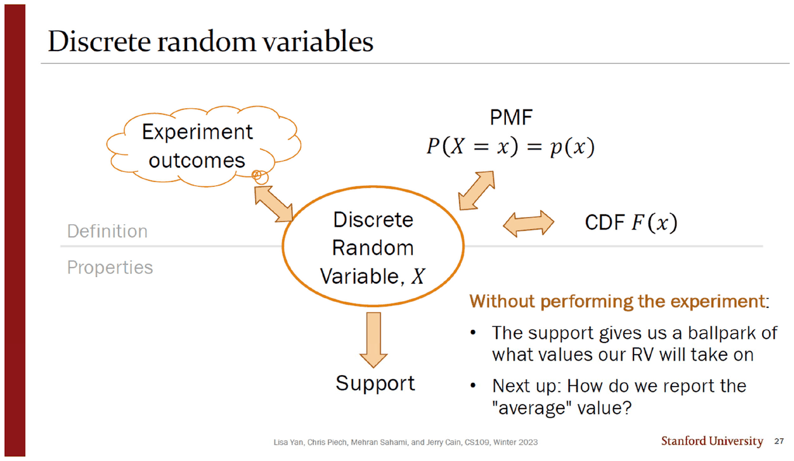
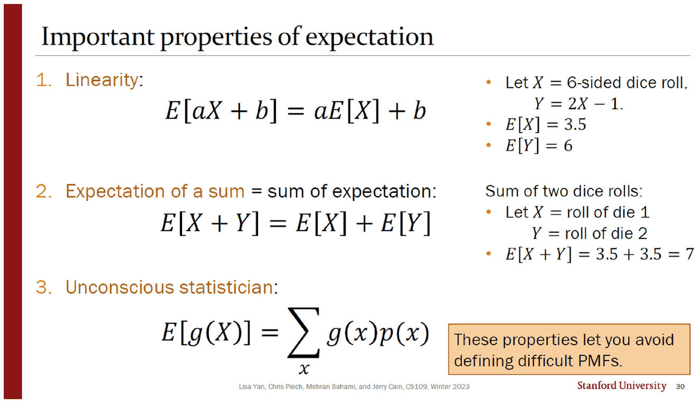
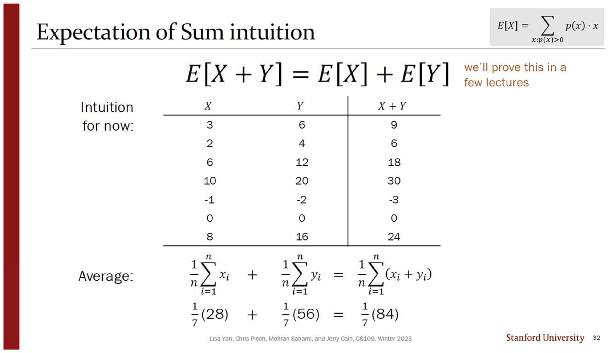
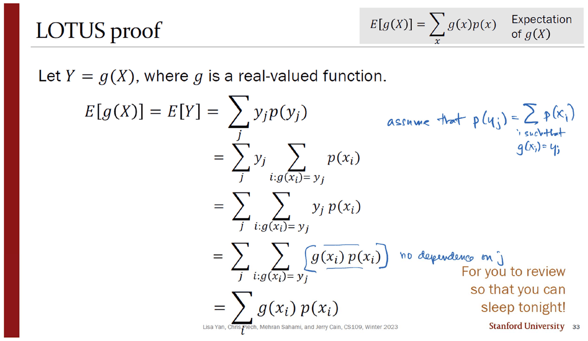
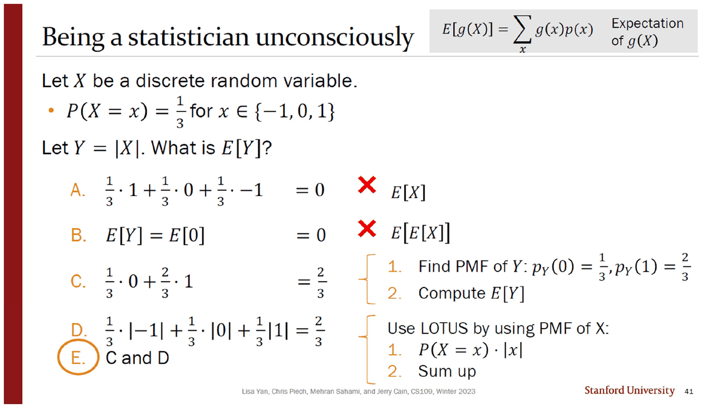
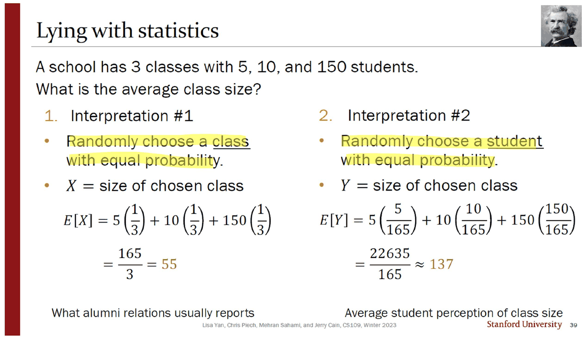

> [!abstract] 「평균」은 계산이 아니라 선택이다
> 덱의 `Expectation` 절은 27번의 한 줄로 열린다 — *"Next up: How do we report the 'average' value?"* 따옴표가 붙어 있는 `average` 가 이 문서의 주제다.
>
> 정의(28번)는 한 줄, 첫 계산(29번)은 $7/2$, 성질 셋(30번)은 「어려운 PMF를 정의하지 않고도 답을 얻게」 해 준다. 여기까지는 매끄럽다. 그런데 연습문제 절의 39번이 **학급이 셋뿐인 학교의 「평균 학급 크기」로 55와 137 두 답을 내놓는다.** 계산이 틀려서가 아니라 확률변수를 무엇으로 잡았는지가 다르기 때문이고, 두 답 모두 옳다. 슬라이드 제목이 `Lying with statistics` 이고 오른쪽 위에 마크 트웨인의 사진이 붙어 있다.
>
> 그리고 이 회차에서 확인한 **원본의 계산 오식 한 건이 바로 그 슬라이드에 있다.**

---

## 실험을 하지 않고도 말할 수 있는 것



27번은 앞 절을 그림 한 장으로 닫는다. 가운데에 `Discrete Random Variable, X` 가 있고 네 방향으로 화살표가 뻗는다 — 실험 결과(왼쪽 위), PMF(오른쪽 위), CDF(오른쪽), 지지집합(아래).

오른쪽 아래에 이 그림의 요지가 적혀 있다. **Without performing the experiment:**

- The support gives us a ballpark of what values our RV will take on
- **Next up: How do we report the "average" value?**

확률변수의 쓸모가 여기서 정리된다. 실험을 하지 않고도 「어느 범위의 값이 나올 것인가」는 지지집합이 말해 주고, 「대표값은 얼마인가」는 아직 도구가 없다. 그 도구를 만드는 것이 다음 여섯 장이다.

---

## 정의 한 줄, 이름 다섯 개

28번의 정의는 짧다.

$$E[X]=\sum_{x:\,p(x)>0} p(x)\cdot x$$

밑에 붙은 조건 $x:p(x)>0$ 이 [05. 확률변수 — 표본공간을 숫자 하나로 접는다](<./05. 확률변수 — 표본공간을 숫자 하나로 접는다.md>)의 지지집합과 이어진다. 슬라이드가 굳이 한 줄로 다시 설명한다 — *"sum over all values of $X=x$ that have non-zero probability."*

더 눈에 띄는 것은 그 아래 줄이다.

> Other names: **mean**, expected value, **weighted average**, center of mass, first moment

한 대상에 이름이 다섯이다. 그리고 다섯이 서로 다른 분야에서 왔다 — 통계(mean), 도박(expected value), 산술(weighted average), 물리(center of mass), 해석학(first moment). 원본은 이 목록만 주고 각 이름의 출처를 설명하지 않는다.

29번이 첫 계산을 한다. 주사위 한 개.

$$E[X]=1\cdot\tfrac16+2\cdot\tfrac16+3\cdot\tfrac16+4\cdot\tfrac16+5\cdot\tfrac16+6\cdot\tfrac16=\frac{7}{2}$$

답이 $3.5$ 라는 것 — **지지집합에 없는 값** — 을 슬라이드는 언급하지 않는다. 「무게 중심」이라는 이름이 왜 붙었는지가 이 한 예에 이미 들어 있다.

---

## 성질 셋 — PMF를 정의하지 않고 지나가는 법



| | 성질 | 원본이 붙인 예 |
| --- | --- | --- |
| 1 | **선형성** $E[aX+b]=aE[X]+b$ | $X$ = 주사위, $Y=2X-1$ → $E[X]=3.5$, $E[Y]=6$ |
| 2 | **합의 기댓값** $E[X+Y]=E[X]+E[Y]$ | 주사위 두 개 → $3.5+3.5=7$ |
| 3 | **무의식적 통계학자** $E[g(X)]=\sum_x g(x)p(x)$ | (예 없음 — 40·41번에서 다룬다) |

주황 상자가 세 성질의 공통점을 한 줄로 적는다 — *"These properties let you avoid defining difficult PMFs."* 이것이 이 절의 실용적 요지다. $Y=2X-1$ 의 PMF를 새로 쓰지 않고도 $E[Y]$ 를 안다.

31번이 선형성을 네 줄로 증명한다. 합을 쪼개고, $\sum_x xp(x)=E[X]$ 와 $\sum_x p(x)=1$ 을 각각 주황·파랑 배경으로 강조해 대입한다.

$$E[aX+b]=\sum_x (ax+b)p(x)=a\underbrace{\sum_x xp(x)}_{E[X]}+b\underbrace{\sum_x p(x)}_{1}=aE[X]+b$$

성질 2는 증명하지 않는다. 32번 오른쪽에 *"we'll prove this in a few lectures"* 라고 적고 **표 하나로 직관만 준다.**



$$\frac17(28)+\frac17(56)=\frac17(84)$$

> [!caution] 이 표의 $Y$ 는 정확히 $2X$ 다
> 표의 일곱 줄을 보면 $Y$ 값이 $6,4,12,20,-2,0,16$ 으로 **$X$ 의 정확히 두 배**다. 즉 $Y$ 는 $X$ 로 완전히 결정되는 값이고, 두 열은 서로 가장 강하게 종속이다.
>
> 이것이 틀린 예는 아니다 — $E[X+Y]=E[X]+E[Y]$ 는 독립이든 종속이든 **항상** 성립하고, 그것이 이 성질이 강력한 이유다. 그런데 하필 종속의 극단인 $Y=2X$ 를 예로 들면, **그 「항상」이 보이지 않는다.** 표만 보는 학생은 「두 열이 나란히 움직이니까 합이 맞아떨어지는구나」로 읽을 수 있고, 원본은 그 오해를 막는 말을 하지 않는다. 아래에서 $Y$ 열을 바꿔 가며 등식이 흔들리지 않는 것을 직접 볼 수 있다.

```html preview
<div id="lin-root">
  <style>
    #lin-root{font-family:system-ui,-apple-system,"Segoe UI",sans-serif;color:var(--foreground);padding:4px}
    #lin-root .panel{background:var(--card);border:1px solid var(--border);border-radius:10px;padding:14px}
    #lin-root .row{display:flex;gap:8px;flex-wrap:wrap;align-items:center;margin-bottom:10px}
    #lin-root button{background:var(--card);color:var(--foreground);border:1px solid var(--border);border-radius:6px;padding:5px 11px;font:inherit;font-size:13px;cursor:pointer}
    #lin-root button.on{border-color:var(--chart-1);background:color-mix(in srgb,var(--chart-1) 16%,transparent)}
    #lin-root table{border-collapse:collapse;font-size:13px;font-family:ui-monospace,SFMono-Regular,Menlo,monospace;margin-top:4px}
    #lin-root th,#lin-root td{border-bottom:1px solid var(--border);padding:4px 16px;text-align:right}
    #lin-root th{opacity:.7;font-weight:500}
    #lin-root tr.sum td,#lin-root tr.sum th{border-top:2px solid var(--border);border-bottom:none;font-weight:700}
    #lin-root .out{margin-top:11px;padding:10px 12px;border:1px solid var(--chart-2);border-radius:8px;background:color-mix(in srgb,var(--chart-2) 12%,transparent);font-size:14px;line-height:1.8}
    #lin-root code{font-family:ui-monospace,SFMono-Regular,Menlo,monospace}
  </style>
  <div class="panel">
    <div class="row">
      <button data-m="orig" class="on">원본 그대로 (Y = 2X)</button>
      <button data-m="rev">Y 를 거꾸로 붙인다</button>
      <button data-m="shuf">Y 를 섞는다</button>
      <button data-m="neg">Y = −2X</button>
    </div>
    <table id="lin-t"></table>
    <div class="out" id="lin-out"></div>
  </div>
</div>
<script>
(function(){
  var R=document.getElementById('lin-root'), mode='orig';
  var X=[3,2,6,10,-1,0,8], Y0=[6,4,12,20,-2,0,16];
  function ys(){
    if(mode==='orig') return Y0.slice();
    if(mode==='rev')  return Y0.slice().reverse();
    if(mode==='neg')  return X.map(function(v){return -2*v;});
    var a=Y0.slice(), seed=7;
    for(var i=a.length-1;i>0;i--){ seed=(seed*1103515245+12345)%2147483648; var j=seed%(i+1); var t=a[i];a[i]=a[j];a[j]=t; }
    return a;
  }
  function draw(){
    var Y=ys(), n=X.length;
    var h='<tr><th>X</th><th>Y</th><th>X + Y</th></tr>';
    var sx=0, sy=0, ss=0;
    for(var i=0;i<n;i++){ sx+=X[i]; sy+=Y[i]; ss+=X[i]+Y[i];
      h+='<tr><td>'+X[i]+'</td><td>'+Y[i]+'</td><td>'+(X[i]+Y[i])+'</td></tr>'; }
    h+='<tr class="sum"><td>'+sx+'</td><td>'+sy+'</td><td>'+ss+'</td></tr>';
    R.querySelector('#lin-t').innerHTML=h;
    var ex=sx/n, ey=sy/n, es=ss/n;
    R.querySelector('#lin-out').innerHTML=
      '<code>(1/'+n+')('+sx+') + (1/'+n+')('+sy+') = '+ex.toFixed(4)+' + '+ey.toFixed(4)+' = <b>'+(ex+ey).toFixed(4)+'</b></code><br>'
      +'<code>(1/'+n+')('+ss+') = <b>'+es.toFixed(4)+'</b></code>'
      +'<div style="margin-top:6px">'+(Math.abs(ex+ey-es)<1e-9
        ? '두 값이 같다. <b>X 와 Y 를 어떻게 짝지어도 등식은 흔들리지 않는다</b> — 합의 순서를 바꾼 것뿐이기 때문이다.'
        : '어긋났다.')
      +(mode==='orig'?' 지금이 원본 32번의 표이고 합은 28 · 56 · 84 다.':'')
      +'</div>';
    R.querySelectorAll('.row button').forEach(function(b){b.className=(b.dataset.m===mode?'on':'');});
  }
  R.addEventListener('click',function(e){ if(e.target.dataset.m){mode=e.target.dataset.m;draw();} });
  draw();
})();
</script>
```

$Y$ 를 거꾸로 붙이든 섞든 $-2X$ 로 뒤집든 $\frac17\sum(x_i+y_i)$ 는 $\frac17\sum x_i+\frac17\sum y_i$ 와 같다. **덧셈의 순서를 바꾼 것뿐**이라는 것이 성질 2의 전부이고, 32번 표는 그 사실을 보여 줄 수 있는 자리에서 $Y=2X$ 를 골라 기회를 놓쳤다. *(표를 바꿔 보는 위 실험은 원본에 없는 확장이다. 원본의 값은 첫 번째 버튼 하나뿐이다.)*

---

## 증명 하나는 잉크가 메운다



33번은 성질 3(LOTUS, *Law Of The Unconscious Statistician*)을 증명한다. $Y=g(X)$ 로 두고 $E[Y]$ 의 정의에서 출발해 $\sum_i g(x_i)p(x_i)$ 로 내려가는 다섯 줄이다. 슬라이드는 이 증명에 *"For you to review so that you can sleep tonight!"* 이라는 말을 붙여 사실상 넘어간다.

잉크가 그 다섯 줄에서 **인쇄되지 않은 두 대목**을 채운다.

| 잉크가 적은 것 | 어느 단계에 | 왜 필요한가 |
| --- | --- | --- |
| *assume that $p(y_j)=\sum_i p(x_i)$ such that $g(x_i)=y_j$* | 1줄 → 2줄 | $Y$ 의 PMF를 $X$ 의 PMF로 바꾸는 단계. 이 등식이 곧 **여러 $x$ 가 같은 $y$ 로 접힌다**는 사실이다 |
| *no dependence on $j$* | 4줄 → 5줄 | 안쪽 항 $g(x_i)p(x_i)$ 에 $j$ 가 없으므로 이중합을 하나로 합칠 수 있다 |

두 번째 메모가 특히 중요하다. 이중합 $\sum_j\sum_{i:g(x_i)=y_j}$ 가 단일합 $\sum_i$ 로 무너지는 것은, **$j$ 로 나눈 $i$ 의 묶음들이 전체 $i$ 를 빠짐없이 한 번씩 덮기 때문**이다. 원본은 그 단계에 아무 설명을 달지 않는다.

40·41번이 LOTUS의 쓸모를 선택형 문제로 확인한다. $P(X=x)=\frac13$ for $x\in\{-1,0,1\}$, $Y=\lvert X\rvert$ 일 때 $E[Y]$ 는?



| 보기 | 값 | 41번의 채점 |
| --- | --- | --- |
| A | $0$ | ❌ 이것은 $E[X]$ 다 |
| B | $0$ | ❌ 이것은 $E[E[X]]$ 다 |
| C | $\tfrac23$ | ✅ **$Y$ 의 PMF를 먼저 구하는 길** — $p_Y(0)=\tfrac13,\ p_Y(1)=\tfrac23$ |
| D | $\tfrac23$ | ✅ **LOTUS로 $X$ 의 PMF를 그대로 쓰는 길** — $\sum_x \lvert x\rvert p(x)$ |
| **E** | C and D | ⭕ 정답 |

정답이 「둘 다」인 문제 구성이 요점이다. C는 접기를 한 번 더 해서($-1$ 과 $1$ 이 둘 다 $1$ 로 간다) 새 PMF를 만든 뒤 정의를 쓰고, D는 새 PMF를 만들지 않고 $g$ 를 안으로 밀어 넣는다. **LOTUS가 아끼는 것은 정확히 그 접기 한 번**이다.

오답의 정체를 41번이 적어 준 것도 친절하다 — A는 절댓값을 빠뜨려 $E[X]$ 를 계산한 것이고, B는 $E[X]=0$ 을 먼저 구한 뒤 거기에 $g$ 를 씌운 것($g(E[X])$)이다. 후자는 **$E[g(X)]\ne g(E[X])$** 라는 일반 사실의 구체적 예인데, 원본은 그 일반 명제를 말하지 않고 `E[E[X]]` 라는 표기로만 지적한다.

---

## 같은 학교, 두 개의 평균



39번의 설정은 세 줄이다. **학급이 셋인 학교, 학생 수는 5명·10명·150명. 평균 학급 크기는?**

| | 해석 #1 | 해석 #2 |
| --- | --- | --- |
| 무엇을 무작위로 뽑는가 | **학급**을 균등하게 | **학생**을 균등하게 |
| 확률변수 | $X$ = 뽑힌 학급의 크기 | $Y$ = 뽑힌 학생이 속한 학급의 크기 |
| PMF | $\tfrac13,\tfrac13,\tfrac13$ | $\tfrac{5}{165},\tfrac{10}{165},\tfrac{150}{165}$ |
| 기댓값 | $\dfrac{165}{3}=\mathbf{55}$ | $\dfrac{25+100+22500}{165}\approx\mathbf{137}$ |
| 슬라이드의 설명 | *What alumni relations usually reports* | *Average student perception of class size* |

두 답의 차이는 **2.5배**다. 그리고 어느 쪽도 계산이 틀리지 않았다. 갈린 지점은 계산이 아니라 **확률변수를 정의한 순간**이다 — 「학급을 뽑는다」와 「학생을 뽑는다」는 서로 다른 실험이다.

큰 학급은 학생이 많으므로 학생을 뽑는 실험에서 **뽑힐 확률이 크기에 비례해 커진다.** 150명짜리 학급은 학급 기준으로는 $\tfrac13$ 이지만 학생 기준으로는 $\tfrac{150}{165}\approx 0.909$ 다. 그래서 $E[Y]$ 는 큰 학급 쪽으로 끌려간다.

```html preview
<div id="cls-root">
  <style>
    #cls-root{font-family:system-ui,-apple-system,"Segoe UI",sans-serif;color:var(--foreground);padding:4px}
    #cls-root .panel{background:var(--card);border:1px solid var(--border);border-radius:10px;padding:14px}
    #cls-root .row{display:flex;align-items:center;gap:10px;margin:7px 0;font-size:13px;flex-wrap:wrap}
    #cls-root input[type=range]{flex:1;min-width:120px;accent-color:var(--chart-1)}
    #cls-root button{background:var(--card);color:var(--foreground);border:1px solid var(--border);border-radius:6px;padding:5px 11px;font:inherit;font-size:13px;cursor:pointer}
    #cls-root .cols{display:flex;gap:12px;flex-wrap:wrap;margin-top:12px}
    #cls-root .col{flex:1 1 230px;border:1px solid var(--border);border-radius:8px;padding:11px 13px;font-size:13.5px;line-height:1.8}
    #cls-root .col h4{margin:0 0 6px;font-size:13px}
    #cls-root .note{margin-top:10px;padding:10px 12px;border:1px solid var(--border);border-radius:8px;font-size:13.5px;line-height:1.8}
    #cls-root code{font-family:ui-monospace,SFMono-Regular,Menlo,monospace}
    #cls-root svg{display:block;margin-top:8px}
  </style>
  <div class="panel">
    <div class="row"><span style="opacity:.7;width:78px">학급 A</span><input type="range" id="cls-a" min="1" max="200" value="5"><b id="cls-av" style="width:34px;text-align:right">5</b></div>
    <div class="row"><span style="opacity:.7;width:78px">학급 B</span><input type="range" id="cls-b" min="1" max="200" value="10"><b id="cls-bv" style="width:34px;text-align:right">10</b></div>
    <div class="row"><span style="opacity:.7;width:78px">학급 C</span><input type="range" id="cls-c" min="1" max="200" value="150"><b id="cls-cv" style="width:34px;text-align:right">150</b></div>
    <div class="row"><button id="cls-reset">원본 설정으로 (5 · 10 · 150)</button></div>
    <svg id="cls-svg" width="100%" height="86" viewBox="0 0 600 86" role="img" aria-label="학급 기준과 학생 기준의 가중치 비교"></svg>
    <div class="cols">
      <div class="col" id="cls-x"></div>
      <div class="col" id="cls-y"></div>
    </div>
    <div class="note" id="cls-n"></div>
  </div>
</div>
<script>
(function(){
  var R=document.getElementById('cls-root');
  function draw(){
    var a=+R.querySelector('#cls-a').value, b=+R.querySelector('#cls-b').value, c=+R.querySelector('#cls-c').value;
    R.querySelector('#cls-av').textContent=a; R.querySelector('#cls-bv').textContent=b; R.querySelector('#cls-cv').textContent=c;
    var s=[a,b,c], N=a+b+c;
    var ex=(a+b+c)/3, num=a*a+b*b+c*c, ey=num/N;
    var g='', x=10, W=580;
    g+='<text x="10" y="12" font-size="11" fill="var(--foreground)" opacity=".75">학급을 뽑는다 — 셋이 똑같이 1/3</text>';
    for(var i=0;i<3;i++){ var w=W/3; g+='<rect x="'+(10+i*w)+'" y="18" width="'+(w-3)+'" height="16" rx="3" fill="var(--chart-1)" opacity=".65"/>'
      +'<text x="'+(10+i*w+(w-3)/2)+'" y="31" font-size="10.5" text-anchor="middle" fill="var(--foreground)">1/3</text>'; }
    g+='<text x="10" y="56" font-size="11" fill="var(--foreground)" opacity=".75">학생을 뽑는다 — 학급 크기에 비례</text>';
    var px=10;
    for(var j=0;j<3;j++){ var w2=W*s[j]/N; g+='<rect x="'+px+'" y="62" width="'+Math.max(1,w2-3)+'" height="16" rx="3" fill="var(--chart-4)" opacity=".75"/>';
      if(w2>44) g+='<text x="'+(px+w2/2)+'" y="75" font-size="10.5" text-anchor="middle" fill="var(--foreground)">'+s[j]+'/'+N+'</text>';
      px+=w2; }
    R.querySelector('#cls-svg').innerHTML=g;
    R.querySelector('#cls-x').innerHTML='<h4 style="color:var(--chart-1)">해석 #1 — 학급을 뽑는다</h4>'
      +'<code>E[X] = ('+a+' + '+b+' + '+c+') / 3</code><br><code>= '+N+'/3 = <b>'+ex.toFixed(2)+'</b></code>';
    R.querySelector('#cls-y').innerHTML='<h4 style="color:var(--chart-4)">해석 #2 — 학생을 뽑는다</h4>'
      +'<code>E[Y] = ('+(a*a)+' + '+(b*b)+' + '+(c*c)+') / '+N+'</code><br><code>= '+num+'/'+N+' ≈ <b>'+ey.toFixed(2)+'</b></code>';
    var txt='두 평균의 비는 <b>'+(ey/ex).toFixed(3)+'</b> 배다. 학급 크기가 모두 같아질 때만 1이 된다.';
    if(a===5&&b===10&&c===150)
      txt+='<br><b>지금이 원본 39번의 설정이다.</b> 원본은 <code>E[X] = 165/3 = 55</code>, <code>E[Y] = 22635/165 ≈ 137</code> 이라 적었는데 분자 <b>22,635 는 22,625 의 오식</b>이다 — 25 + 100 + 22,500 = 22,625. 두 값 모두 반올림하면 137이라 결론은 살아남는다(137.12 대 137.18).';
    R.querySelector('#cls-n').innerHTML=txt;
  }
  R.addEventListener('input',draw);
  R.querySelector('#cls-reset').addEventListener('click',function(){
    R.querySelector('#cls-a').value=5; R.querySelector('#cls-b').value=10; R.querySelector('#cls-c').value=150; draw(); });
  draw();
})();
</script>
```

---

## 원본에서 확인한 것

> [!caution] 39번의 분자가 22,625가 아니라 22,635로 인쇄되어 있다
> 해석 #2의 계산은 $5\cdot\frac{5}{165}+10\cdot\frac{10}{165}+150\cdot\frac{150}{165}$ 이므로 분자는 $25+100+22{,}500=\mathbf{22{,}625}$ 다. 슬라이드는 $\frac{22635}{165}$ 로 적었다. 자릿수 하나가 다르다.
>
> **결론은 살아남는다.** $22{,}625/165=137.121\ldots$, $22{,}635/165=137.181\ldots$ 로 둘 다 반올림하면 슬라이드가 적은 `≈ 137` 이다. 그래서 이 오식은 답을 보고도 잡히지 않는다 — 분자를 직접 다시 더해야 드러난다. 이 문서는 파이썬 정수 연산으로 세 항을 더해 확인했다.

<!-- -->
> [!caution] 합의 기댓값을 보이는 표에서 $Y = 2X$ 를 골랐다
> 32번 표의 일곱 줄에서 $Y$ 는 언제나 $X$ 의 두 배다. $E[X+Y]=E[X]+E[Y]$ 가 **독립성을 요구하지 않는다**는 것이 이 성질의 핵심인데, 예제가 종속의 극단을 쓰는 바람에 그 점이 드러나지 않는다. 슬라이드는 독립 여부를 언급하지 않는다.

<!-- -->
> [!note] 증명 하나는 미루고 하나는 잉크가 메운다
> 성질 2($E[X+Y]=E[X]+E[Y]$)는 *"we'll prove this in a few lectures"* 로 미뤄지고 표 하나로 대체된다. 성질 3(LOTUS)은 33번에서 증명되지만 두 단계의 근거가 인쇄되어 있지 않고, 잉크가 `assume that p(y_j) = Σ p(x_i) such that g(x_i) = y_j` 와 `no dependence on j` 로 그 자리를 메운다.

<!-- -->
> [!note] 연습문제 절에 PMF 슬라이드가 섞여 있다
> 목차상 34번부터가 `Exercises` 인데, 36번은 두 주사위 합의 PMF를 조각 정의로 제시하는 **설명 슬라이드**다($p(y)=\frac{y-1}{36}$ for $2\le y\le 6$, $\frac{13-y}{36}$ for $7\le y\le 12$). 절 구분이 엄격하지 않다. 덧붙여 이 조각 정의는 $y=7$ 을 아래 가지에 넣는데, 두 식 모두 $y=7$ 에서 $\frac{6}{36}$ 을 주므로 값은 일치한다.

<!-- -->
> [!note] 37번 슬라이드가 PDF에 없다
> 39쪽짜리 PDF의 마지막 슬라이드 번호는 41이고, 빠진 것은 **14번과 37번** 두 장이다. 37번은 36번(두 주사위 합의 PMF)과 38번(5회 동전 던지기) 사이이므로, 같은 계열의 예제 한 장이 숨겨진 것으로 보인다.

이 문서의 값 — $7/2$, $E[Y]=6$, $28/56/84$, $2/3$, $55$, $137.12$ — 는 전부 파이썬 분수·정수 연산으로 다시 계산해 슬라이드와 대조했다. 어긋난 곳은 위에 적은 22,635 한 자리다.

---

## 다음 문서로

이 덱은 21번에서 잉크가 적어 둔 추측 — $P(X=k)=\binom{3}{k}0.5^3$ — 을 끝내 일반화하지 않고 끝난다. 다음 덱(`07_bernoulli_binomial`)이 바로 그 일을 한다. 분포에 **이름**과 **매개변수**가 붙기 시작한다.

- [07. 베르누이와 이항 — 같은 확률을 묶어야 곱할 수 있다](<./07. 분산 — 같은 평균을 가진 분포를 가르는 수.md>)
- [05. 확률변수 — 표본공간을 숫자 하나로 접는다](<./05. 확률변수 — 표본공간을 숫자 하나로 접는다.md>)

## 근거 자료

| 원본 쪽(슬라이드) | 제목 | 이 문서에서 쓴 곳 |
| --- | --- | --- |
| 25 (26) | Expectation (구분) | 절의 시작 |
| 26 (27) | Discrete random variables | 실험 없이 말할 수 있는 것 |
| 27 (28) | Expectation | 정의와 다섯 이름 |
| 28 (29) | Expectation of a die roll | $7/2$ |
| 29 (30) | Important properties of expectation | 성질 셋 |
| 30 (31) | Linearity of Expectation proof | 네 줄 증명 |
| 31 (32) | Expectation of Sum intuition | 일곱 줄 표 · $Y=2X$ 문제 |
| 32 (33) | LOTUS proof | 잉크가 메운 두 단계 |
| 33 (34) | Exercises (구분) | — |
| 34 (35) | A Whole New World with Random Variables | 사건 중심과 확률변수 중심의 대비 |
| 35 (36) | PMF for the sum of two dice | 조각 정의 |
| 36 (38) | Example random variable | 5회 던지기의 PMF |
| 37 (39) | Lying with statistics | 55와 137 · 원본 오식 |
| 38·39 (40·41) | Being a statistician unconsciously | LOTUS 선택형 문제 |

원본 15쪽, 슬라이드 16장(37번은 PDF에 없음). 인용 이미지 6장은 200 dpi 렌더다.
