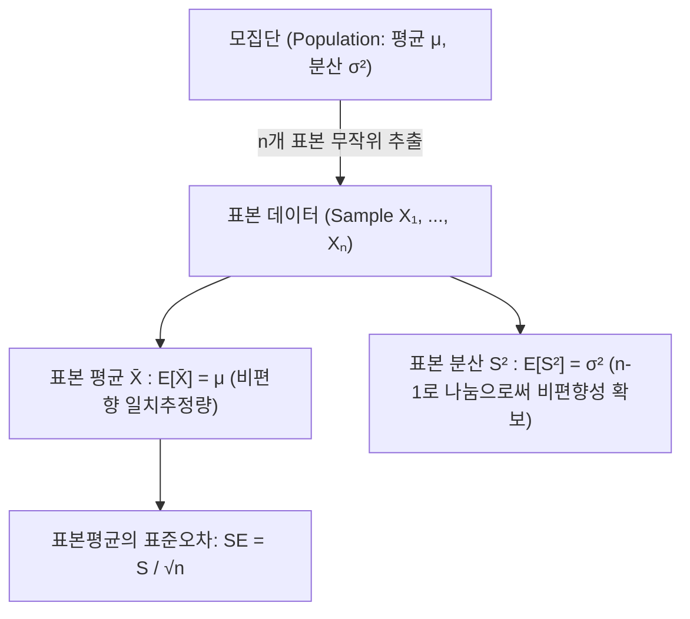
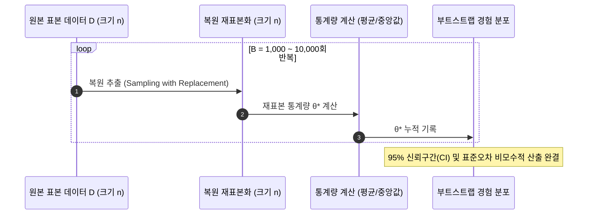

> [!abstract] 핵심 요약
> **통계적 추론(Statistical Inference)**은 한정된 표본(Sample) 데이터로부터 전체 모집단(Population)의 특성을 과학적으로 추정하고 검정하는 학문이다.
> 모분산의 편향을 없애기 위해 $n$ 대신 $n-1$로 나누는 **베셀 보정 표본 분산($S^2 = \frac{1}{n-1}\sum(X_i - \bar{X})^2$)**과, 모집단 분포에 대한 가정 없이 컴퓨터의 반복 연산력으로 복원 추출하는 **부트스트랩(Bootstrap)**은 현대 데이터 과학의 핵심 도구이다.

---

## 1. 표본 통계량과 베셀 보정(Bessel's Correction)

$$\bar{X} = \frac{1}{n}\sum_{i=1}^n X_i, \quad S^2 = \frac{1}{n - 1}\sum_{i=1}^n (X_i - \bar{X})^2$$



---

## 2. 부트스트랩(Bootstrap) 재표본화 알고리즘



---

## 3. 실시간 부트스트랩(Bootstrap) 1,000회 재표본화 시뮬레이터

```html preview
<div style="font-family:system-ui,-apple-system,sans-serif;padding:20px;background:var(--card);color:var(--card-foreground);border:1px solid var(--border);border-radius:var(--radius)">
  <div style="font-size:16px;font-weight:700;margin-bottom:14px;color:var(--primary);display:flex;align-items:center;gap:8px">
    <span>🔁 부트스트랩(Bootstrap) 실시간 복원 재표본화 & 95% 신뢰구간 산출기</span>
  </div>

  <div style="margin-bottom:12px">
    <label style="font-size:11px;color:var(--muted-foreground)">원본 표본 데이터 (쉼표로 구분):</label>
    <input id="rawSampleInput" type="text" value="12, 15, 14, 18, 22, 19, 25, 30, 28, 16, 20" style="width:100%;padding:6px 10px;background:var(--background);color:var(--foreground);border:1px solid var(--border);border-radius:var(--radius);font-family:monospace;font-size:12px" />
  </div>

  <button id="runBootstrapBtn" style="padding:8px 16px;background:var(--primary);color:#fff;border:none;border-radius:var(--radius);font-size:12px;font-weight:700;cursor:pointer;margin-bottom:14px">부트스트랩 1,000회 재표본화 실행</button>

  <div style="display:grid;grid-template-columns:repeat(3, 1fr);gap:10px">
    <div style="padding:10px;background:var(--background);border:1px solid var(--border);border-radius:var(--radius);text-align:center">
      <div style="font-size:10px;color:var(--muted-foreground)">원본 표본 평균 (x̄)</div>
      <div id="bootRawMean" style="font-size:14px;font-weight:800;color:var(--chart-1)"></div>
    </div>
    <div style="padding:10px;background:var(--background);border:1px solid var(--border);border-radius:var(--radius);text-align:center">
      <div style="font-size:10px;color:var(--muted-foreground)">부트스트랩 표준오차 (SE)</div>
      <div id="bootSeOut" style="font-size:14px;font-weight:800;color:var(--chart-2)"></div>
    </div>
    <div style="padding:10px;background:var(--background);border:1px solid var(--border);border-radius:var(--radius);text-align:center">
      <div style="font-size:10px;color:var(--muted-foreground)">95% 신뢰구간 (CI)</div>
      <div id="bootCiOut" style="font-size:13px;font-weight:800;color:var(--primary)"></div>
    </div>
  </div>

  <script>
    function runBootstrap() {
      var str = document.getElementById('rawSampleInput').value;
      var data = str.split(',').map(function(s) { return parseFloat(s.trim()); }).filter(function(v) { return !isNaN(v); });

      if (data.length === 0) return;

      var n = data.length;
      var sum = 0;
      for (var i = 0; i < n; i++) sum += data[i];
      var rawMean = sum / n;

      var B = 1000;
      var bootMeans = [];

      for (var b = 0; b < B; b++) {
        var bSum = 0;
        for (var i = 0; i < n; i++) {
          var randIdx = Math.floor(Math.random() * n);
          bSum += data[randIdx];
        }
        bootMeans.push(bSum / n);
      }

      bootMeans.sort(function(a, b) { return a - b; });

      var bootMeanSum = 0;
      for (var b = 0; b < B; b++) bootMeanSum += bootMeans[b];
      var bootMeanAvg = bootMeanSum / B;

      var bootVarSum = 0;
      for (var b = 0; b < B; b++) bootVarSum += Math.pow(bootMeans[b] - bootMeanAvg, 2);
      var bootSe = Math.sqrt(bootVarSum / (B - 1));

      var ciLow = bootMeans[Math.floor(B * 0.025)];
      var ciHigh = bootMeans[Math.floor(B * 0.975)];

      document.getElementById('bootRawMean').textContent = rawMean.toFixed(2);
      document.getElementById('bootSeOut').textContent = "± " + bootSe.toFixed(3);
      document.getElementById('bootCiOut').textContent = "[" + ciLow.toFixed(2) + ", " + ciHigh.toFixed(2) + "]";
    }

    document.getElementById('runBootstrapBtn').addEventListener('click', runBootstrap);
    runBootstrap();
  </script>
</div>
```
