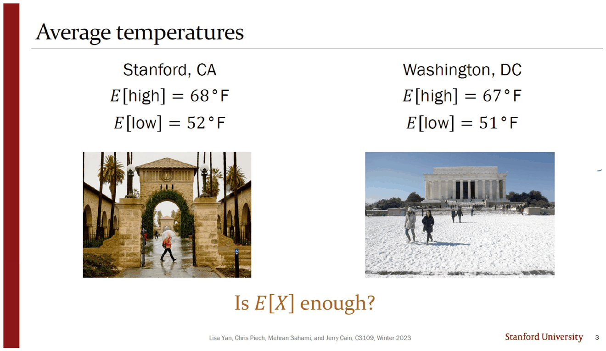
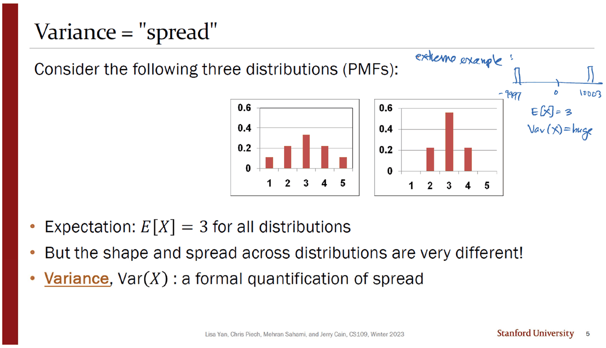
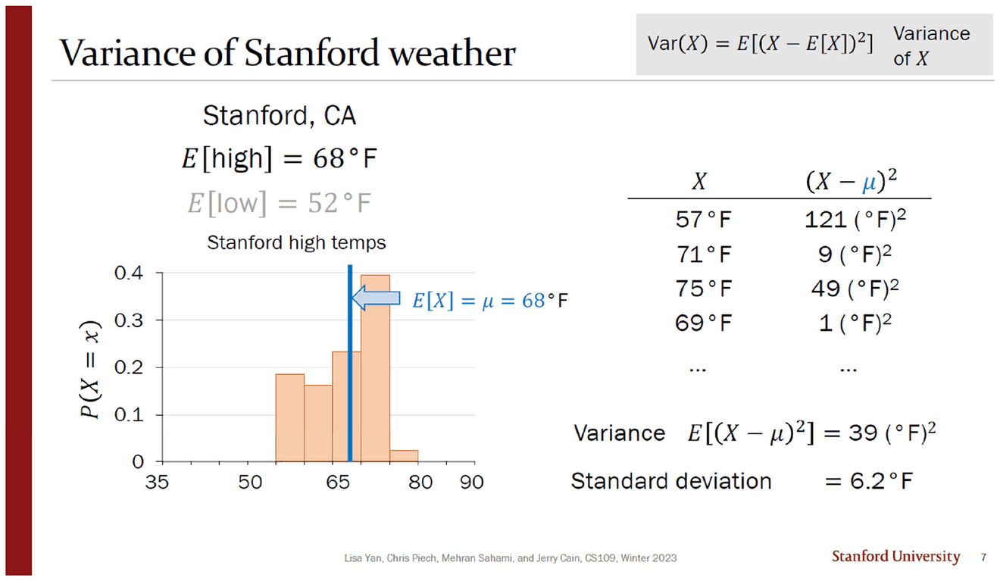
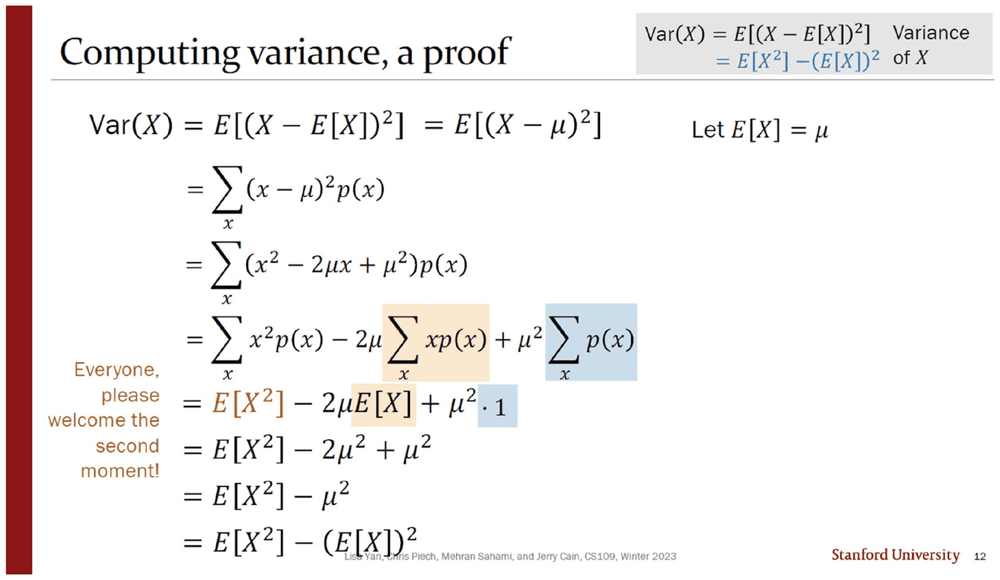
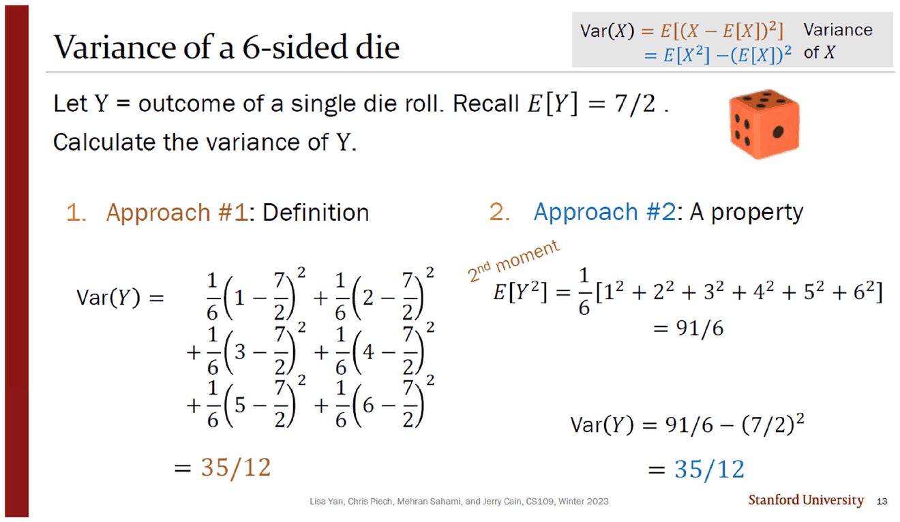
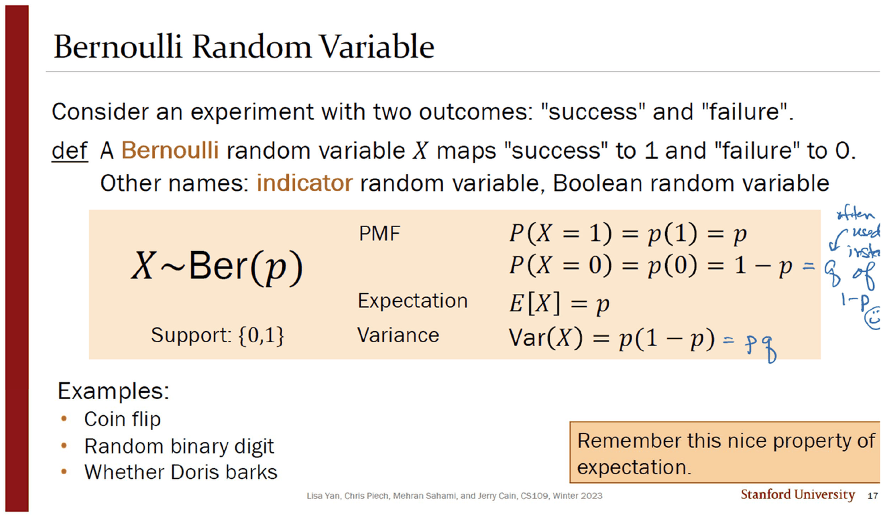
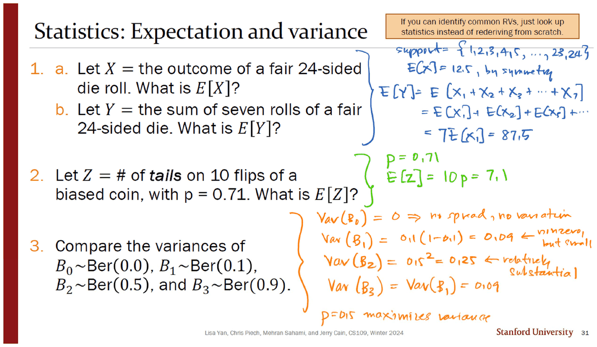

> [!abstract] 평균이 같다는 것이 무엇을 감추는가
> 07번 덱(42쪽 · Jerry Cain · 2024년 1월 24일)의 제목은 `07: Variance, Bernoulli, Binomial` 이고 목차는 다섯 토막이다 — `2 Variance` · `9 Properties of Variance` · `16 Bernoulli RV` · `19 Binomial RV` · `29 Exercises`. 이 문서는 앞 세 토막(슬라이드 1~19)을 다룬다.
>
> 덱은 정의로 시작하지 않는다. **사진 두 장으로 시작한다.** 스탠퍼드의 평균 최고기온 68°F, 워싱턴 DC의 평균 최고기온 67°F — 1도 차이인데 한쪽 사진에는 야자수가, 다른 쪽에는 눈이 쌓여 있다. 그 아래 한 줄이 이 덱 전체의 물음이다. **Is $E[X]$ enough?**

---

## 1도 차이가 감추는 것



| | 스탠퍼드 | 워싱턴 DC |
| --- | --- | --- |
| $E[\text{high}]$ | 68 °F | 67 °F |
| $E[\text{low}]$ | 52 °F | 51 °F |

네 수치 모두 1도 안쪽으로 붙어 있다. [06. 기댓값은 누가 재느냐에 따라 달라진다](<./06. 기댓값은 누가 재느냐에 따라 달라진다.md>)에서 본 도구 — 기댓값 — 만으로는 두 도시를 구별할 수 없다. 사진이 그 실패를 대신 보여 준다.

5번이 같은 실패를 그림으로 형식화한다.



> Consider the following **three** distributions (PMFs):

그런데 **인쇄된 히스토그램은 둘뿐이다.** 왼쪽은 1~5에 퍼진 종 모양, 오른쪽은 2~4에 몰린 뾰족한 모양. 둘 다 $E[X]=3$ 이다.

빠진 셋째를 **잉크가 직접 그려 넣었다.** 오른쪽 여백에 수직선 두 개를 세우고 `−9997`, `0`, `10003` 이라 적은 다음 옆에 두 줄을 쓴다.

> extreme example: &nbsp; $E[X]=3$, &nbsp; $\mathrm{Var}(X)=$ huge

$-9997$ 과 $10003$ 에 각각 절반씩 확률을 두면 평균은 정확히 3이고 분산은 $10^8$ 이다. 인쇄된 두 그림이 「퍼짐이 다르다」를 보여 준다면, 잉크의 셋째 그림은 **「평균은 퍼짐에 대해 아무것도 말하지 않는다」를 극단까지 밀어붙인다.** 본문이 약속한 세 번째 분포가 어떤 것이었는지는 알 수 없지만, 잉크가 그 자리를 자기 예로 메운 것은 분명하다.

---

## 정의, 그리고 단위라는 문제



6번의 정의는 짧다.

$$\mathrm{Var}(X)=E\!\left[(X-\mu)^2\right],\qquad \mu=E[X]$$

슬라이드가 덧붙이는 세 줄이 이 정의의 성격을 정한다.

- $\mathrm{Var}(X)\ge 0$ — 제곱의 기댓값이므로 음수가 될 수 없다
- 다른 이름: **2차 중심적률**(2nd **central** moment), 또는 표준편차의 제곱
- $\mathrm{SD}(X)=\sqrt{\mathrm{Var}(X)}$

오른쪽에 파란 글씨로 적힌 두 줄이 표준편차가 왜 따로 필요한지를 말한다 — $\mathrm{Var}(X)$ 는 **$X^2$ 의 단위**, $\mathrm{SD}(X)$ 는 **$X$ 의 단위**다.

7번이 그것을 실제 수로 보인다. 스탠퍼드 최고기온의 분산은 $39\ (^\circ\mathrm{F})^2$ 이고 표준편차는 $6.2\ ^\circ\mathrm{F}$ 다. $(^\circ\mathrm{F})^2$ 라는 단위는 해석할 수 없는 물건이지만, 제곱근을 취한 6.2°F는 그대로 온도계 눈금 위의 거리다. 슬라이드는 $\sqrt{39}=6.2449\ldots$ 를 소수 한 자리로 줄여 적었다.

같은 슬라이드의 표가 계산 과정을 네 줄만 보여 준다 — $57^\circ$ 는 $\mu=68$ 에서 $121$, $71^\circ$ 는 $9$, $75^\circ$ 는 $49$, $69^\circ$ 는 $1$ 만큼 떨어져 있다. 제곱이 먼 값에 얼마나 큰 가중치를 주는지가 이 네 줄에 들어 있다 — **11도 떨어진 관측 하나가 1도 떨어진 관측 121개와 같은 무게**다.

---

## 두 성질, 그리고 2차 적률의 등장

11번이 성질 두 개를 나란히 놓고 하나씩 밝힌다.

| | 성질 | 쓰임 |
| --- | --- | --- |
| **1** | $\mathrm{Var}(X)=E[X^2]-(E[X])^2$ | 계산을 짧게 만든다 |
| **2** | $\mathrm{Var}(aX+b)=a^2\mathrm{Var}(X)$ | 선형변환에 어떻게 반응하는지 정한다 |



12번이 성질 1을 여덟 줄로 증명한다. $(x-\mu)^2$ 를 전개하고 합을 셋으로 쪼갠 뒤 $\sum xp(x)=E[X]$ 와 $\sum p(x)=1$ 을 대입하는 구조가 [06](<./06. 기댓값은 누가 재느냐에 따라 달라진다.md>)의 선형성 증명과 똑같다. 슬라이드 왼쪽 여백에 이 증명의 부산물을 알리는 한 줄이 세로로 적혀 있다.

> Everyone, please welcome the **second moment**!

$E[X^2]$ 는 「$X$ 의 제곱의 평균」이고, 1차 적률 $E[X]$ 와 함께 분산을 만든다. 성질 1이 하는 일은 **분산을 두 적률의 차로 바꾸는 것**이다.

15번이 성질 2를 증명한다. 여기서 잉크는 계산에 참여하지 않고 **표시만 한다** — 하늘색과 연두색 형광펜으로 좌우에서 상쇄되는 두 쌍($2abE[X]$ 와 $b^2$)을 짝지어 칠하고 오른쪽에 「terms cancel / terms cancel」이라 적었다. 여덟 항 중 넷이 사라지고 $a^2(E[X^2]-(E[X])^2)$ 만 남는다.

$b$ 가 사라진다는 것이 성질 2의 내용이다 — **평행이동은 퍼짐을 바꾸지 않는다.** 기댓값에서는 $b$ 가 그대로 살아남았던 것($E[aX+b]=aE[X]+b$)과 대비된다.

---

## 같은 문제, 두 번 계산



13번은 주사위 한 개의 분산을 **두 방법으로** 구한다. [02. 확률 — 두 번 세어 같은 답이 나오는지 확인한다](<./02. 확률 — 두 번 세어 같은 답이 나오는지 확인한다.md>)에서 본 형식이 여기서도 반복된다.

**접근 #1 — 정의.** 여섯 항을 직접 더한다.

$$\mathrm{Var}(Y)=\tfrac16\left(1-\tfrac72\right)^2+\cdots+\tfrac16\left(6-\tfrac72\right)^2=\frac{35}{12}$$

**접근 #2 — 성질 1.** 2차 적률을 먼저 구한다.

$$E[Y^2]=\tfrac16\left(1^2+2^2+\cdots+6^2\right)=\frac{91}{6},\qquad
\mathrm{Var}(Y)=\frac{91}{6}-\left(\frac72\right)^2=\frac{35}{12}$$

슬라이드가 `2nd moment` 라는 손글씨 스타일 라벨을 $E[Y^2]$ 위에 붙여 두었다. 두 계산의 차이는 **분수 뺄셈을 여섯 번 하느냐 두 번 하느냐**다. 아래에서 면 수를 바꿔 가며 두 경로가 언제나 같은 값에 닿는 것을 볼 수 있다.

```html preview
<div id="dv-root">
  <style>
    #dv-root{font-family:system-ui,-apple-system,"Segoe UI",sans-serif;color:var(--foreground);padding:4px}
    #dv-root .panel{background:var(--card);border:1px solid var(--border);border-radius:10px;padding:14px}
    #dv-root .row{display:flex;align-items:center;gap:10px;margin:8px 0;font-size:13px;flex-wrap:wrap}
    #dv-root input[type=range]{flex:1;min-width:130px;accent-color:var(--chart-1)}
    #dv-root .cols{display:flex;gap:12px;flex-wrap:wrap;margin-top:10px}
    #dv-root .col{flex:1 1 250px;border:1px solid var(--border);border-radius:8px;padding:11px 13px;font-size:13.5px;line-height:1.85}
    #dv-root .col h4{margin:0 0 6px;font-size:13px}
    #dv-root .v{margin-top:10px;padding:10px 12px;border:1px solid var(--chart-2);border-radius:8px;background:color-mix(in srgb,var(--chart-2) 12%,transparent);font-size:14px}
    #dv-root code{font-family:ui-monospace,SFMono-Regular,Menlo,monospace}
  </style>
  <div class="panel">
    <div class="row"><span style="opacity:.7;width:96px">면 수 n</span><input type="range" id="dv-n" min="2" max="24" value="6"><b id="dv-nv" style="width:26px;text-align:right">6</b></div>
    <div class="cols">
      <div class="col" id="dv-a"></div>
      <div class="col" id="dv-b"></div>
    </div>
    <div class="v" id="dv-v"></div>
  </div>
</div>
<script>
(function(){
  var R=document.getElementById('dv-root');
  function g(a,b){return b?g(b,a%b):a;}
  function fr(num,den){var k=g(Math.abs(num),den)||1;var n=num/k,d=den/k;return d===1?(''+n):(n+'/'+d);}
  function draw(){
    var n=+R.querySelector('#dv-n').value;
    R.querySelector('#dv-nv').textContent=n;
    // E[X] = (n+1)/2, E[X^2] = (n+1)(2n+1)/6, Var = (n^2-1)/12
    var eNum=(n+1), eDen=2;
    var e2Num=(n+1)*(2*n+1), e2Den=6;
    var vNum=n*n-1, vDen=12;
    var terms=[];
    for(var k=1;k<=Math.min(n,6);k++) terms.push('(1/'+n+')('+k+' − '+fr(eNum,eDen)+')²');
    var defStr=terms.join(' + ')+(n>6?' + …':'');
    R.querySelector('#dv-a').innerHTML='<h4 style="color:var(--chart-1)">접근 #1 — 정의</h4>'
      +'<code style="font-size:12.5px">Var = '+defStr+'</code><br>'
      +'<span style="opacity:.75">'+n+' 개 항을 각각 제곱해 더한다.</span>';
    R.querySelector('#dv-b').innerHTML='<h4 style="color:var(--chart-4)">접근 #2 — 성질 1</h4>'
      +'<code>E[X²] = '+fr(e2Num,e2Den)+'</code><br><code>E[X] = '+fr(eNum,eDen)+'</code><br>'
      +'<code>Var = '+fr(e2Num,e2Den)+' − ('+fr(eNum,eDen)+')²</code><br>'
      +'<span style="opacity:.75">뺄셈 한 번으로 끝난다.</span>';
    var note='';
    if(n===6) note='<div style="margin-top:6px">원본 13쪽의 설정이다 — 두 접근 모두 <b>35/12</b>.</div>';
    if(n===24) note='<div style="margin-top:6px">원본 31쪽 연습문제 1-a의 24면 주사위다. 잉크가 적은 <code>E[X] = 12.5</code> 와 일치한다(분산은 원본이 묻지 않는다).</div>';
    R.querySelector('#dv-v').innerHTML='<code>Var(X) = <b>'+fr(vNum,vDen)+'</b> = '+(vNum/vDen).toFixed(4)+'</code>  ·  <code>SD = '+Math.sqrt(vNum/vDen).toFixed(4)+'</code>'+note;
  }
  R.addEventListener('input',draw); draw();
})();
</script>
```

---

## 분산이 가장 단순해지는 자리

16~19번이 이 문서의 마지막 절이고, 덱의 나머지 전부가 여기서 출발한다.



> **def** A Bernoulli random variable $X$ maps "success" to 1 and "failure" to 0.
> Other names: **indicator** random variable, Boolean random variable

주황 상자 하나에 네 가지가 들어간다.

| | 값 |
| --- | --- |
| 표기 | $X\sim\mathrm{Ber}(p)$ |
| 지지집합 | $\{0,1\}$ |
| PMF | $p(1)=p$, $p(0)=1-p$ |
| 기댓값 | $E[X]=p$ |
| 분산 | $\mathrm{Var}(X)=p(1-p)$ |

$E[X]=p$ 라는 한 줄이 이 분포의 전부다. 값이 0과 1뿐이므로 $X^2=X$ 이고, 따라서 $E[X^2]=E[X]=p$, 성질 1을 쓰면 $\mathrm{Var}(X)=p-p^2=p(1-p)$. 슬라이드는 이 유도를 적지 않고 결과만 상자에 넣은 뒤 오른쪽 아래에 한 줄을 붙인다 — *"Remember this nice property of expectation."* *(위 유도는 원본에 없는 보충이다.)*

잉크가 상자 오른쪽에 표기법을 하나 보탠다 — $1-p$ 옆에 「often used instead of $1-p$」라 쓰고 $q$ 를 적으며, 분산 줄 끝에 $= pq$ 를 덧붙인다. 웃는 얼굴까지 그려 놓았다. **덱은 끝까지 $1-p$ 를 쓰고 $q$ 를 쓰지 않는다** — $q$ 는 잉크에만 있고, 다음 문서에서 다룰 proofwiki 스크린샷에만 다시 나타난다.

19번이 이 정의를 세 상황에 적용한다.

| 상황 | 성공의 정의 | 잉크가 채운 값 |
| --- | --- | --- |
| 프로그램을 돌린다 | 크래시 | $X\sim\mathrm{Ber}(p)$ (그대로) |
| 광고를 띄운다 | 클릭 | $X\sim\mathrm{Ber}(0.2)$, $P(X{=}0)=0.8$ |
| 주사위 두 개를 굴린다 | 둘 다 6 | $X\sim\mathrm{Ber}\!\left(\tfrac1{36}\right)$, $E[X]=\tfrac1{36}$ |

세 번째가 눈에 띈다. 앞 덱들에서 $1/36$ 은 **두 사건의 교집합의 확률**이었는데([03. 독립](<./03. 독립 — 정의는 한 줄이고 직관은 매번 틀린다.md>)의 $P(EF)$), 여기서는 **하나의 확률변수의 매개변수**가 된다. 같은 수가 역할을 바꾸는 자리다.

31번 연습문제(이 덱의 `Exercises` 절에 있지만 내용은 이 문서의 범위다)가 $p$ 를 네 값으로 바꿔 가며 분산을 비교한다.



잉크가 주황색으로 네 줄을 적고 결론을 하나 남긴다.

| | $\mathrm{Var}$ | 잉크의 주석 |
| --- | --- | --- |
| $B_0\sim\mathrm{Ber}(0.0)$ | $0$ | no spread, no variation |
| $B_1\sim\mathrm{Ber}(0.1)$ | $0.1(1-0.1)=0.09$ | nonzero, but small |
| $B_2\sim\mathrm{Ber}(0.5)$ | $0.5^2=0.25$ | relatively substantial |
| $B_3\sim\mathrm{Ber}(0.9)$ | $\mathrm{Var}(B_1)=0.09$ | — |
| | | **$p=0.5$ maximizes variance** |

$B_3$ 의 분산을 계산하지 않고 **「$B_1$ 과 같다」로 처리한 것**이 잉크의 요령이다. $p(1-p)$ 가 $p=0.5$ 를 축으로 대칭이므로 $0.9$ 와 $0.1$ 은 같은 값을 준다.

```html preview
<div id="bv-root">
  <style>
    #bv-root{font-family:system-ui,-apple-system,"Segoe UI",sans-serif;color:var(--foreground);padding:4px}
    #bv-root .panel{background:var(--card);border:1px solid var(--border);border-radius:10px;padding:14px}
    #bv-root .row{display:flex;align-items:center;gap:10px;margin:8px 0;font-size:13px;flex-wrap:wrap}
    #bv-root input[type=range]{flex:1;min-width:140px;accent-color:var(--chart-1)}
    #bv-root button{background:var(--card);color:var(--foreground);border:1px solid var(--border);border-radius:6px;padding:4px 10px;font:inherit;font-size:12.5px;cursor:pointer}
    #bv-root .out{margin-top:9px;padding:10px 12px;border:1px solid var(--border);border-radius:8px;font-size:13.5px;line-height:1.8}
    #bv-root code{font-family:ui-monospace,SFMono-Regular,Menlo,monospace}
  </style>
  <div class="panel">
    <div class="row"><span style="opacity:.7;width:34px">p</span><input type="range" id="bv-p" min="0" max="1000" value="500"><b id="bv-pv" style="width:46px;text-align:right">0.500</b></div>
    <div class="row">
      <button data-p="0">B₀ = 0.0</button><button data-p="100">B₁ = 0.1</button>
      <button data-p="500">B₂ = 0.5</button><button data-p="900">B₃ = 0.9</button>
    </div>
    <svg id="bv-svg" width="100%" height="170" viewBox="0 0 600 170" role="img" aria-label="p에 따른 베르누이 분산 곡선"></svg>
    <div class="out" id="bv-out"></div>
  </div>
</div>
<script>
(function(){
  var R=document.getElementById('bv-root');
  var MARK={0:'B₀',100:'B₁',500:'B₂',900:'B₃'};
  function draw(){
    var p=+R.querySelector('#bv-p').value/1000;
    R.querySelector('#bv-pv').textContent=p.toFixed(3);
    var X0=34,Y0=12,W=540,H=120, maxv=0.25;
    var g='<line x1="'+X0+'" y1="'+(Y0+H)+'" x2="'+(X0+W)+'" y2="'+(Y0+H)+'" stroke="var(--border)"/>'
         +'<line x1="'+X0+'" y1="'+Y0+'" x2="'+X0+'" y2="'+(Y0+H)+'" stroke="var(--border)"/>'
         +'<text x="4" y="'+(Y0+6)+'" font-size="10.5" fill="var(--foreground)" opacity=".7">0.25</text>'
         +'<text x="16" y="'+(Y0+H)+'" font-size="10.5" fill="var(--foreground)" opacity=".7">0</text>';
    var d='';
    for(var i=0;i<=100;i++){ var t=i/100, v=t*(1-t);
      d+=(i?'L':'M')+(X0+W*t).toFixed(1)+','+(Y0+H*(1-v/maxv)).toFixed(1)+' '; }
    g+='<path d="'+d+'" fill="none" stroke="var(--chart-1)" stroke-width="2"/>';
    Object.keys(MARK).forEach(function(k){
      var t=+k/1000, v=t*(1-t);
      g+='<circle cx="'+(X0+W*t)+'" cy="'+(Y0+H*(1-v/maxv))+'" r="4" fill="var(--chart-4)"/>';
      g+='<text x="'+(X0+W*t)+'" y="'+(Y0+H*(1-v/maxv)-9)+'" font-size="10.5" text-anchor="middle" fill="var(--chart-4)">'+MARK[k]+'</text>';
    });
    var v=p*(1-p);
    g+='<line x1="'+(X0+W*p)+'" y1="'+Y0+'" x2="'+(X0+W*p)+'" y2="'+(Y0+H)+'" stroke="var(--chart-2)" stroke-dasharray="3 3"/>';
    g+='<circle cx="'+(X0+W*p)+'" cy="'+(Y0+H*(1-v/maxv))+'" r="5" fill="var(--chart-2)"/>';
    g+='<text x="'+X0+'" y="'+(Y0+H+17)+'" font-size="10.5" fill="var(--foreground)" opacity=".7">p = 0</text>';
    g+='<text x="'+(X0+W-26)+'" y="'+(Y0+H+17)+'" font-size="10.5" fill="var(--foreground)" opacity=".7">p = 1</text>';
    R.querySelector('#bv-svg').innerHTML=g;
    var mirror=(1-p);
    R.querySelector('#bv-out').innerHTML=
      '<code>Var = p(1 − p) = '+p.toFixed(3)+' × '+mirror.toFixed(3)+' = <b style="color:var(--chart-1)">'+v.toFixed(4)+'</b></code>'
      +'<div style="opacity:.82;margin-top:6px">곡선은 <b>p = 0.5</b> 를 축으로 대칭이다 — 그래서 원본 31쪽의 잉크가 <code>Var(B₃) = Var(B₁)</code> 이라 적고 계산을 생략할 수 있었다. 양 끝(p = 0, p = 1)에서는 결과가 하나뿐이므로 퍼짐이 0이다.</div>';
  }
  R.addEventListener('input',draw);
  R.addEventListener('click',function(e){ if(e.target.dataset.p){R.querySelector('#bv-p').value=e.target.dataset.p;draw();} });
  draw();
})();
</script>
```

---

## 원본에서 확인한 것

> [!caution] 「세 분포」라고 말하고 둘만 인쇄되어 있다
> 5번 본문은 *"Consider the following **three** distributions (PMFs)"* 인데 히스토그램은 두 개뿐이다. 잉크가 오른쪽 여백에 세 번째를 직접 그려 넣고 `extreme example` 이라 적었다 — $-9997$ 과 $10003$ 에 확률을 반씩 둔 분포로, 평균은 3, 분산은 $10^8$ 이다(직접 계산해 확인). 인쇄가 비워 둔 자리를 잉크가 메운 사례다.

<!-- -->
> [!caution] 목차의 쪽 번호가 실제 슬라이드 번호와 어긋난다
> 표지의 자동 목차는 `2 Variance` · `9 Properties of Variance` · `16 Bernoulli RV` · `19 Binomial RV` · `29 Exercises` 인데, 실제로 인쇄된 구분 슬라이드는 Variance 2 · Properties 9 · Bernoulli 16까지는 맞고 **Binomial 은 20번, Exercises 는 31번**이다. 앞 세 개는 맞고 뒤 두 개만 각각 1·2씩 밀렸다. 바로 아래에서 보듯 그 구간에 **인쇄 번호가 겹치는 쪽이 두 쌍** 있으므로, 목차를 만든 뒤 슬라이드가 끼워 넣어졌고 목차가 갱신되지 않은 것으로 읽힌다.

<!-- -->
> [!caution] 연속한 두 쪽이 모두 31번으로 인쇄되어 있다
> PDF 31쪽(`Exercises` 구분 슬라이드)과 32쪽(`Statistics: Expectation and variance`)의 오른쪽 아래 번호가 **둘 다 31** 이다. 뒤에서 다룰 29·30쪽도 마찬가지로 둘 다 30번이다([08. 이항, 그리고 인쇄되지 않은 증명](<./08. 이항, 그리고 인쇄되지 않은 증명.md>) 참고).

<!-- -->
> [!caution] 이 덱도 두 해의 자료가 섞여 있다
> 본문 슬라이드(3 · 5 · 6 · 7 · 11 · 12 · 13 · 15 · 17 · 19)는 전부 `CS109, Winter 2023`, 연습문제 31번은 `CS109, Winter 2024` 다. [05. 확률변수 — 표본공간을 숫자 하나로 접는다](<./05. 확률변수 — 표본공간을 숫자 하나로 접는다.md>)에서 확인한 06번 덱의 연도 섞임과 같은 현상이 이 덱에서도 일어난다.

<!-- -->
> [!note] 유인물 두 편이 이 덱의 재인쇄다
> `0.Variance 문제.pdf`(1쪽)는 이 덱의 **13번과 31번**을, `Bernoulli RV 문제.pdf`(1쪽)는 **19번 한 장**을 2-up으로 옮겨 놓은 것이다(아래 반쪽은 백지). 잉크까지 그대로여서, [03. 독립](<./03. 독립 — 정의는 한 줄이고 직관은 매번 틀린다.md>)에서 확인한 `Independence 문제` 와 같은 방식으로 만들어졌다. 덧붙여 유인물 파일명이 `0.Variance`·`2.Binomial RV` 로 번호가 붙어 있는데 **1번이 없다.**

<!-- -->
> [!note] $q$ 는 잉크에만 있다
> 17번 잉크가 $1-p$ 를 $q$ 로 줄여 쓰는 관례를 소개하지만, 덱의 인쇄된 본문은 처음부터 끝까지 $1-p$ 를 쓴다. 덱 안에서 $q$ 가 인쇄물로 나타나는 곳은 29·30번의 외부 스크린샷 두 장뿐이다.

이 문서의 값 — $35/12$, $91/6$, $39\ (^\circ\mathrm{F})^2$ 과 $\sqrt{39}=6.2449\ldots$, $p(1-p)$ 의 네 값 $0/0.09/0.25/0.09$, 잉크가 그린 극단 예의 평균 3과 분산 $10^8$ — 는 전부 파이썬 분수·부동소수 연산으로 다시 계산해 슬라이드·잉크와 대조했다. 어긋난 값은 없었다.

---

## 다음 문서로

베르누이는 시행 **한 번**이다. 다음 덱의 나머지(슬라이드 20~42)는 그것을 $n$ 번 쌓아 이항분포를 만들고, 그 평균과 분산을 구한다 — 그런데 분산의 증명만은 슬라이드가 하지 않는다.

- [08. 이항, 그리고 인쇄되지 않은 증명](<./08. 이항, 그리고 인쇄되지 않은 증명.md>)
- [06. 기댓값은 누가 재느냐에 따라 달라진다](<./06. 기댓값은 누가 재느냐에 따라 달라진다.md>)

## 근거 자료

| 원본 쪽(슬라이드) | 제목 | 이 문서에서 쓴 곳 |
| --- | --- | --- |
| 1 (1) | 목차 · 2024년 1월 24일 | 덱의 구성 |
| 3 (3) | Average temperatures | 1도 차이가 감추는 것 |
| 5 (5) | Variance = "spread" | 셋이라 말하고 둘만 · 잉크의 극단 예 |
| 6 (6) | Variance | 정의 · 단위 · 표준편차 |
| 7 (7) | Variance of Stanford weather | $39\,(^\circ\mathrm{F})^2$ · $6.2\,^\circ\mathrm{F}$ |
| 9 (9) | Properties of Variance (구분) | — |
| 11 (11) | Properties of variance | 두 성질 |
| 12 (12) | Computing variance, a proof | 2차 적률의 등장 |
| 13 (13) | Variance of a 6-sided die | 두 계산, 한 답 |
| 15 (15) | Property 2: A proof | 형광펜이 짝지은 상쇄 항 |
| 16·17 (16·17) | Bernoulli RV | 정의 상자 · 잉크의 $q$ |
| 18 (19) | Defining Bernoulli RVs | 세 상황 |
| 32 (31) | Statistics: Expectation and variance | $p=0.5$ 가 분산을 최대로 |
| `0.Variance 문제.pdf` 1 | (13·31 재인쇄) | 유인물의 정체 |
| `Bernoulli RV 문제.pdf` 1 | (19 재인쇄, 아래 반쪽 백지) | 유인물의 정체 |

원본 18쪽, 슬라이드 19장(18번은 PDF에 없음). 인용 이미지 7장은 200 dpi 렌더다.
