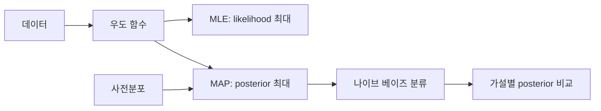

추정 자료는 데이터가 주어졌을 때 모델 파라미터를 선택하는 MLE에서 시작해 사전분포를 결합한 MAP, 조건부 독립을 가정하는 나이브 베이즈로 이어진다.



<Tabs>
  <Tab label="MLE">관측 데이터가 가장 그럴듯해지는 파라미터를 선택한다.</Tab>
  <Tab label="MAP">우도와 사전분포를 곱한 posterior의 최대점을 선택한다.</Tab>
  <Tab label="Naive Bayes">특징들이 클래스에 조건부 독립이라는 가정으로 posterior를 계산한다.</Tab>
</Tabs>

| 방법 | 필요한 정보 |
| --- | --- |
| MLE | 데이터와 likelihood |
| MAP | likelihood와 prior |
| 나이브 베이즈 | 클래스 prior와 특징별 조건부 likelihood |

```html preview
<div style="font-family:system-ui,sans-serif;padding:20px;color:var(--foreground)">
<label for="amt" style="font-size:14px;font-weight:600">추정 단계</label>
<div id="out" style="font-size:30px;font-weight:700;color:var(--chart-1);margin:6px 0">1단계</div>
<input id="amt" type="range" min="1" max="3" step="1" value="1" style="width:100%;accent-color:var(--primary)" />
<p style="font-size:13px;color:var(--muted-foreground)">원본 강의 번호와 연습문제 묶음의 순서를 움직인다.</p>
<script>
var amt=document.getElementById('amt'); var out=document.getElementById('out');
amt.addEventListener('input',function(){out.textContent=Number(amt.value).toLocaleString()+'단계';});
</script>
</div>
```

> [!WARNING]
> MAP은 prior가 결과에 영향을 준다. 나이브 베이즈의 독립 가정도 실제 데이터에서 맞는지 별도로 검증한다.

<details>
<summary>계산 흐름</summary>

모델과 파라미터 정의 → likelihood 작성 → 로그 변환으로 곱을 합으로 바꿈 → 최적화 → posterior 또는 클래스 비교 순서로 진행한다.

</details>

<!-- source: MLE, MAP, naive Bayes and Bayes/Poisson problem decks; estimation flow preserved -->