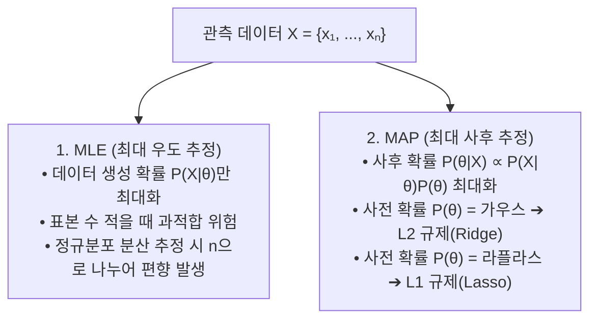

> [!abstract] 핵심 요약
> **모수 추정(Parameter Estimation)**은 관측된 데이터로부터 기저 확률 모델의 매개변수 $\theta$를 결정하는 과정이다.
> 데이터 우도만을 극대화하는 **최대 우도 추정(MLE)**과, 도메인 지식인 사전분포(Prior)를 반영하는 **최대 사후 확률 추정(MAP)**은 머신러닝 손실 함수와 정규화(Regularization)의 본질이다. 또한 특성 간 조건부 독립을 가정한 **나이브 베이즈(Naive Bayes)**는 텍스트 분류와 스팸 필터링의 고속 기준선 알고리즘이다.

---

## 1. MLE vs MAP 추정 수식 비교

$$\hat{\theta}_{\text{MLE}} = \arg\max_\theta \sum_{i=1}^n \ln f(x_i \mid \theta)$$

$$\hat{\theta}_{\text{MAP}} = \arg\max_\theta \left( \sum_{i=1}^n \ln f(x_i \mid \theta) + \ln g(\theta) \right)$$



---

## 2. 나이브 베이즈(Naive Bayes) 분류기와 라플라스 스무딩

$$P(Y = c \mid \mathbf{x}) \propto P(Y = c) \prod_{j=1}^d P(x_j \mid Y = c)$$

### 1) 0 확률 문제 해결: 라플라스 스무딩 (Laplace Smoothing)
$$P(w_j \mid Y = c) = \frac{\text{count}(w_j, c) + 1}{\sum_{w} \text{count}(w, c) + |V|} \quad (|V|: \text{전체 어휘 사전 크기})$$

---

## 3. 실시간 동전 던지기 모수(θ) MLE vs MAP 추정기

```html preview
<div style="font-family:system-ui,-apple-system,sans-serif;padding:20px;background:var(--card);color:var(--card-foreground);border:1px solid var(--border);border-radius:var(--radius)">
  <div style="font-size:16px;font-weight:700;margin-bottom:14px;color:var(--primary);display:flex;align-items:center;gap:8px">
    <span>🪙 베르누이 모수(θ: 앞면 확률) MLE vs MAP(베타 사전분포) 실시간 비교기</span>
  </div>

  <div style="display:grid;grid-template-columns:1fr 1fr;gap:12px;margin-bottom:14px">
    <div style="padding:10px;background:var(--background);border:1px solid var(--border);border-radius:var(--radius)">
      <div style="font-size:12px;font-weight:700;color:var(--chart-1);margin-bottom:6px">실제 관측 데이터:</div>
      <div style="display:flex;gap:6px">
        <div>
          <label style="font-size:10px;color:var(--muted-foreground)">앞면 (H):</label>
          <input id="inHeads" type="number" value="7" min="0" style="width:100%;padding:4px;background:var(--card);color:var(--foreground);border:1px solid var(--border);border-radius:var(--radius);text-align:center;font-weight:700" />
        </div>
        <div>
          <label style="font-size:10px;color:var(--muted-foreground)">뒷면 (T):</label>
          <input id="inTails" type="number" value="3" min="0" style="width:100%;padding:4px;background:var(--card);color:var(--foreground);border:1px solid var(--border);border-radius:var(--radius);text-align:center;font-weight:700" />
        </div>
      </div>
    </div>

    <div style="padding:10px;background:var(--background);border:1px solid var(--border);border-radius:var(--radius)">
      <div style="font-size:12px;font-weight:700;color:var(--chart-2);margin-bottom:6px">베타 사전분포 Beta(α, β):</div>
      <div style="display:flex;gap:6px">
        <div>
          <label style="font-size:10px;color:var(--muted-foreground)">가상 앞면 α:</label>
          <input id="inAlpha" type="number" value="5" min="1" style="width:100%;padding:4px;background:var(--card);color:var(--foreground);border:1px solid var(--border);border-radius:var(--radius);text-align:center;font-weight:700" />
        </div>
        <div>
          <label style="font-size:10px;color:var(--muted-foreground)">가상 뒷면 β:</label>
          <input id="inBeta" type="number" value="5" min="1" style="width:100%;padding:4px;background:var(--card);color:var(--foreground);border:1px solid var(--border);border-radius:var(--radius);text-align:center;font-weight:700" />
        </div>
      </div>
    </div>
  </div>

  <div style="display:grid;grid-template-columns:1fr 1fr;gap:10px;margin-bottom:12px">
    <div style="padding:10px;background:var(--background);border:1px solid var(--border);border-radius:var(--radius);text-align:center">
      <div style="font-size:10px;color:var(--muted-foreground)">최대 우도 추정량 (θ_MLE = H / (H+T))</div>
      <div id="mleResultOut" style="font-size:16px;font-weight:800;color:var(--chart-1);margin-top:2px"></div>
    </div>
    <div style="padding:10px;background:var(--background);border:1px solid var(--border);border-radius:var(--radius);text-align:center">
      <div style="font-size:10px;color:var(--muted-foreground)">최대 사후 추정량 (θ_MAP = (H+α-1)/(N+α+β-2))</div>
      <div id="mapResultOut" style="font-size:16px;font-weight:800;color:var(--chart-2);margin-top:2px"></div>
    </div>
  </div>

  <script>
    function updateEstimates() {
      var h = parseInt(document.getElementById('inHeads').value) || 0;
      var t = parseInt(document.getElementById('inTails').value) || 0;
      var a = parseInt(document.getElementById('inAlpha').value) || 1;
      var b = parseInt(document.getElementById('inBeta').value) || 1;

      var total = h + t;
      var mle = (total > 0) ? (h / total) : 0.5;

      var mapNum = h + a - 1;
      var mapDenom = total + a + b - 2;
      var map = (mapDenom > 0) ? (mapNum / mapDenom) : 0.5;

      document.getElementById('mleResultOut').textContent = (mle * 100).toFixed(1) + " %";
      document.getElementById('mapResultOut').textContent = (map * 100).toFixed(1) + " %";
    }

    ['inHeads', 'inTails', 'inAlpha', 'inBeta'].forEach(function(id) {
      document.getElementById(id).addEventListener('input', updateEstimates);
    });
    updateEstimates();
  </script>
</div>
```
