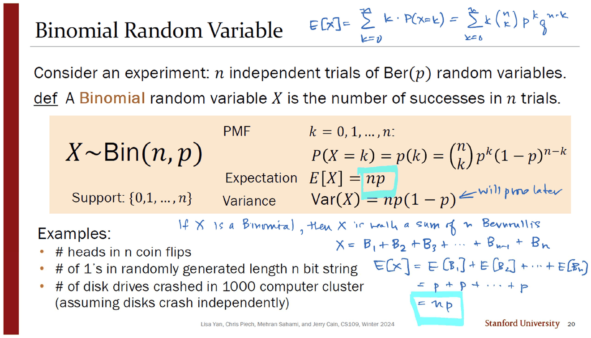
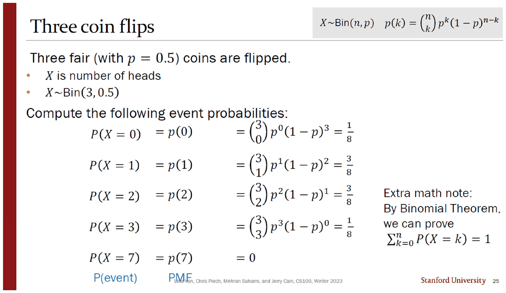
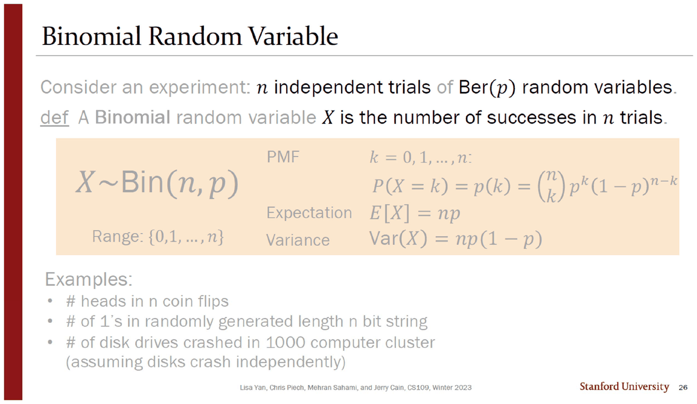
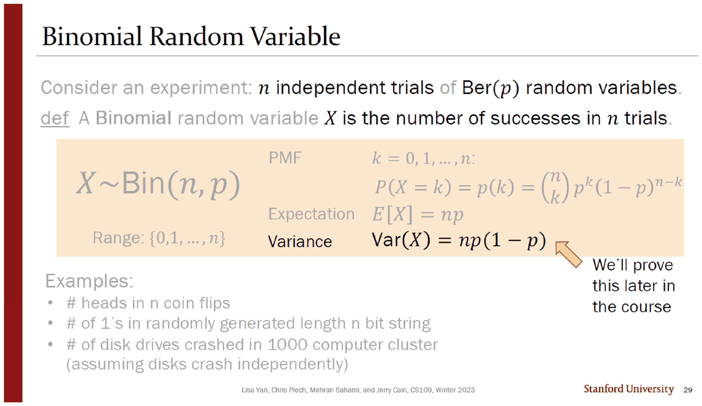
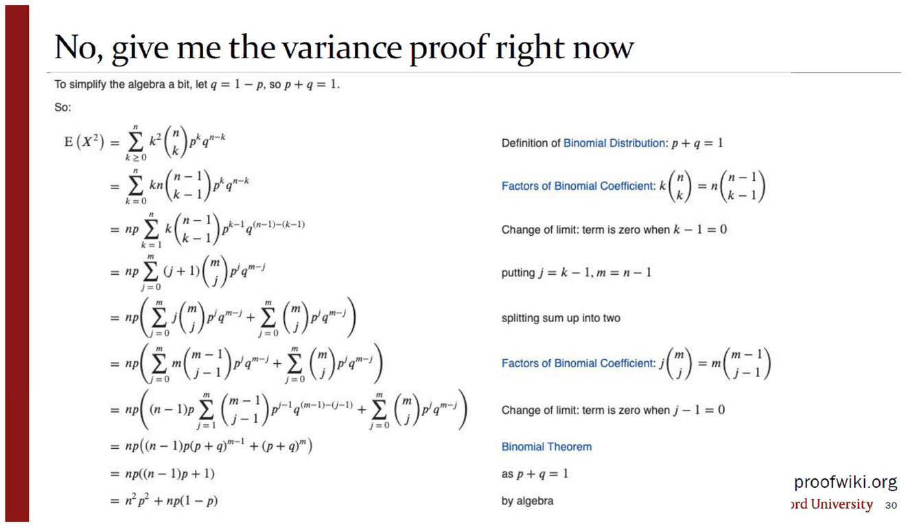
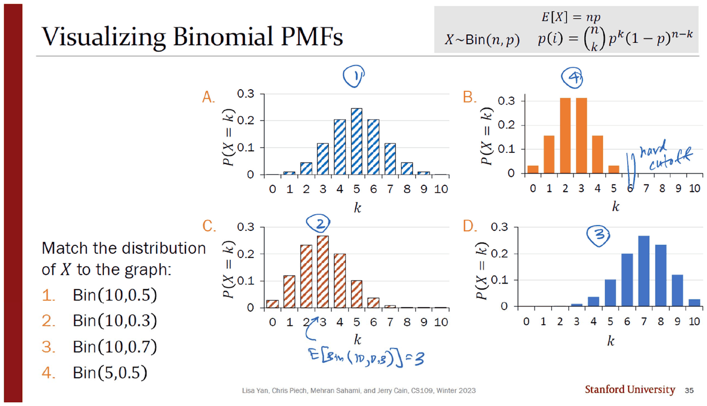
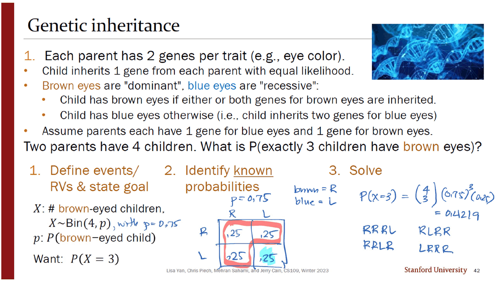
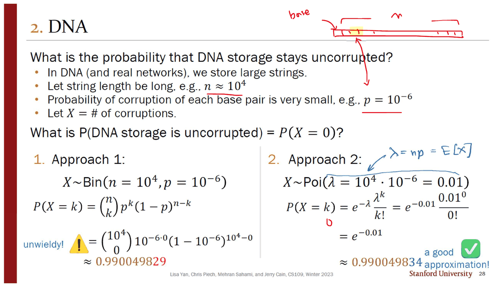

> [!abstract] 같은 상자가 네 번 나오고, 그때마다 무언가가 달라진다
> 이항분포의 정의 상자 — $X\sim\mathrm{Bin}(n,p)$ · PMF · 기댓값 · 분산 — 는 이 덱에 **네 번** 인쇄되어 있다(슬라이드 20 · 26 · 28 · 29). 내용은 같은데 매번 조금씩 다르다.
>
> | 등장 | 강조된 줄 | 달라진 것 |
> | --- | --- | --- |
> | 20번 | 기댓값 $E[X]=np$ | `Support: {0,…,n}` · 잉크가 증명을 직접 쓴다 |
> | 26번 | (강조 없음) | `Support` → **`Range`** |
> | 28번 | 기댓값 | 오른쪽에 `Proof:` 만 있고 **아래가 비어 있다** |
> | 29번 | 분산 | 화살표와 함께 *"We'll prove this later in the course"* |
>
> 그리고 30번에서 그 「나중」이 온다 — **proofwiki.org 스크린샷 두 장**. 이 문서의 척추는 그 네 번의 반복과 마지막 외주다.

---

## 이항은 베르누이의 합이다

20번이 정의를 놓는다.

> **def** A **Binomial** random variable $X$ is the number of successes in $n$ trials.



상자 안의 $E[X]=np$ 에는 아무 근거가 붙어 있지 않다. 잉크가 **슬라이드 아래 빈 자리에 직접 증명을 쓴다.**

> If $X$ is a Binomial, then $X$ is really a sum of $n$ Bernoullis
> $X = B_1+B_2+B_3+\cdots+B_{n-1}+B_n$
> $E[X] = E[B_1]+E[B_2]+\cdots+E[B_n] = p+p+\cdots+p = \boxed{np}$

세 줄이고, 쓰인 도구는 [06. 기댓값은 누가 재느냐에 따라 달라진다](<./06. 기댓값은 누가 재느냐에 따라 달라진다.md>)의 성질 2($E[X+Y]=E[X]+E[Y]$)와 [07. 분산](<./07. 분산 — 같은 평균을 가진 분포를 가르는 수.md>)의 $E[\mathrm{Ber}(p)]=p$ 뿐이다. 잉크는 하늘색 형광펜으로 상자 안의 $np$ 와 자기 결론의 $np$ 두 곳을 칠해 연결해 둔다. 그리고 분산 줄 옆에는 **「will prove later」** 라고만 적는다 — 기댓값은 지금 증명하고 분산은 미룬다는 표시다.

같은 슬라이드 맨 위 여백에는 다른 경로도 적혀 있다.

$$E[X]=\sum_{k=0}^{n}k\cdot P(X=k)=\sum_{k=0}^{n}k\binom{n}{k}p^kq^{n-k}$$

정의대로 가는 길이다. 잉크는 이 식을 **써 놓고 계산하지 않는다.** 베르누이 분해로 세 줄에 끝낸 뒤 이 합을 버린다 — 두 경로의 길이 차이가 그 자체로 논거다.

27번이 그 분해를 그림으로 못 박는다. 캠핑카 한 대와 네 대가 그려져 있고, 주황 상자에 한 줄 — $\mathrm{Ber}(p)=\mathrm{Bin}(1,p)$. **베르누이는 별개의 분포가 아니라 $n=1$ 인 이항이다.**

---

## 표기를 두 번 다시 읽는다

23번의 제목은 `Reiterating notation` 이고, 화면에 식 하나와 중괄호 두 개뿐이다.

$$\underbrace{P(X=k)}_{\text{Probability that }X\text{ takes on the value }k}=\underbrace{\binom{n}{k}p^k(1-p)^{n-k}}_{\text{Probability Mass Function for a Binomial}}$$

좌변은 **하나의 사건의 확률**, 우변은 **함수**다. [05. 확률변수 — 표본공간을 숫자 하나로 접는다](<./05. 확률변수 — 표본공간을 숫자 하나로 접는다.md>)에서 「확률변수는 사건이 아니다」로 경고했던 표기 충돌이, 여기서는 등호 하나를 사이에 두고 양쪽에 이름표를 붙이는 방식으로 다시 다뤄진다.



25번이 그 함수를 $\mathrm{Bin}(3,0.5)$ 에 적용해 다섯 값을 계산한다.

| $k$ | 식 | 값 |
| --- | --- | --- |
| 0 | $\binom30 p^0(1-p)^3$ | $1/8$ |
| 1 | $\binom31 p^1(1-p)^2$ | $3/8$ |
| 2 | $\binom32 p^2(1-p)^1$ | $3/8$ |
| 3 | $\binom33 p^3(1-p)^0$ | $1/8$ |
| **7** | $p(7)$ | **0** |

다섯째 줄이 요점이다. $k=7$ 은 지지집합 밖이므로 확률이 0이고, **함수는 거기서도 정의되어 있다.** 앞의 네 줄이 [05](<./05. 확률변수 — 표본공간을 숫자 하나로 접는다.md>)에서 동전 세 개를 손으로 세어 얻은 값과 정확히 같다는 것도 이 슬라이드의 숨은 확인이다 — 그때는 결과 여덟 가지를 나열했고, 지금은 공식 한 줄이 같은 답을 준다.

오른쪽에 붙은 `Extra math note` 는 이항정리로 $\sum_{k=0}^{n}P(X=k)=1$ 을 증명할 수 있다고만 하고 증명은 하지 않는다.

---

## Support에서 Range로



26번은 20번과 **글자 하나까지 같은 상자**인데 왼쪽 아래만 다르다.

| 20번 | 26번 |
| --- | --- |
| `Support: {0,1,…,n}` | `Range: {0,1,…,n}` |

「지지집합(support)」은 [05](<./05. 확률변수 — 표본공간을 숫자 하나로 접는다.md>)에서 *"values that $Y$ can take on with non-zero probability"* 로 정의된 이 과목의 용어이고, [06](<./06. 기댓값은 누가 재느냐에 따라 달라진다.md>)의 기댓값 정의($\sum_{x:p(x)>0}$)도 그 위에 서 있다. 「치역(range)」은 함수론의 용어다. 두 낱말이 같은 집합을 가리키는 것은 맞지만, **한 덱 안에서 같은 상자의 같은 칸이 두 이름으로 인쇄되어 있다.** 26 · 28 · 29번은 모두 `Range` 이고 20번만 `Support` 다.

이 상자가 반복되는 동안 슬라이드는 한 줄씩만 검게 남기고 나머지를 회색으로 죽인다. 28번에서는 기댓값 줄만 검고 오른쪽에 `Proof:` 라는 단어가 떠 있는데 **그 아래는 끝까지 비어 있다.**



29번에서는 분산 줄만 검고, 주황 화살표가 $np(1-p)$ 를 가리키며 세 줄을 적는다.

> We'll prove this later in the course

---

## 증명을 외주한 자리



30번의 제목은 앞 슬라이드에 대한 대답이다 — **No, give me the variance proof right now.** 그리고 화면 전체가 **proofwiki.org 의 스크린샷**이다. 두 쪽에 걸쳐 열두 줄이 넘는 유도가 이어진다.

$$E(X^2)=\sum_{k\ge0}k^2\binom{n}{k}p^kq^{n-k}\ \longrightarrow\ \cdots\ \longrightarrow\ np\big((n-1)p+1\big)=n^2p^2+np(1-p)$$
$$\mathrm{var}(X)=E(X^2)-(E(X))^2=np(1-p)$$

이 두 장이 덱의 나머지와 **표기·서체·조판이 전부 다르다.**

| | 덱의 본문 | 스크린샷 |
| --- | --- | --- |
| 분산 | $\mathrm{Var}(X)$ | $\mathrm{var}\,(X)$ |
| 기댓값 | $E[X]$ (대괄호) | $\mathrm{E}\,(X)$ (소괄호) |
| 실패 확률 | $1-p$ | $q$ |
| 근거 표기 | 오른쪽 여백에 문장 | 파란 링크 문구(`Factors of Binomial Coefficient` 등) |

세 번째 줄이 특히 눈에 띈다. [07. 분산](<./07. 분산 — 같은 평균을 가진 분포를 가르는 수.md>)에서 봤듯 $q=1-p$ 라는 표기는 **잉크만 쓰던 것**이었는데, 여기서 인쇄물로 처음 나타난다 — 그것도 강의가 쓴 것이 아니라 **빌려 온 페이지가 쓴 것**이다. 스크린샷 첫 줄이 그 약속을 스스로 선언한다. *"To simplify the algebra a bit, let $q=1-p$, so $p+q=1$."*

> [!important] 이 자리가 덱에서 가장 많은 것을 말한다
> 덱은 기댓값을 세 줄(잉크)로 증명했고, 분산은 세 번 미룬 뒤 열두 줄짜리 외부 문서로 대체했다. **그 길이 차이가 곧 이 강의가 어디까지 자기 도구로 갈 수 있는지를 표시한다.** $E[X]=np$ 는 선형성만으로 되지만 $\mathrm{Var}(X)=np(1-p)$ 는 「독립인 확률변수들의 분산의 합」이 필요한데, 그 정리는 이 과목의 뒤쪽 덱(`12_independent_rvs`·`13_joint_statistics`)에 있다. 29번의 *"later in the course"* 는 정확한 예고이고, 30번의 스크린샷은 **그 예고를 기다리지 않으려는 학생을 위한 우회로**다.

---

## 그림으로 매개변수를 읽는다



34·35번은 같은 화면의 문제와 답이다. 네 개의 이항 PMF 그래프에 $\mathrm{Bin}(10,0.5)$ · $\mathrm{Bin}(10,0.3)$ · $\mathrm{Bin}(10,0.7)$ · $\mathrm{Bin}(5,0.5)$ 를 짝짓는다.

| 그래프 | 잉크의 답 | 근거 |
| --- | --- | --- |
| A — 5를 중심으로 대칭, 10까지 퍼짐 | **1.** $\mathrm{Bin}(10,0.5)$ | 중심 $np=5$ |
| B — 2·3이 가장 높고 5에서 끊김 | **4.** $\mathrm{Bin}(5,0.5)$ | 잉크: 「hard cutoff」 |
| C — 3이 가장 높고 왼쪽으로 치우침 | **2.** $\mathrm{Bin}(10,0.3)$ | 잉크: $E[\mathrm{Bin}(10,0.3)]=3$ |
| D — 7이 가장 높고 오른쪽으로 치우침 | **3.** $\mathrm{Bin}(10,0.7)$ | 중심 $np=7$ |

잉크가 남긴 두 메모가 판정 기준을 정확히 요약한다 — **$n$ 은 그래프가 끊기는 자리**(B의 「hard cutoff」), **$p$ 는 봉우리의 위치**($np$). 두 매개변수가 그림의 서로 다른 특징에 대응한다는 것이 이 문제의 요지다.

```html preview
<div id="bn-root">
  <style>
    #bn-root{font-family:system-ui,-apple-system,"Segoe UI",sans-serif;color:var(--foreground);padding:4px}
    #bn-root .panel{background:var(--card);border:1px solid var(--border);border-radius:10px;padding:14px}
    #bn-root .row{display:flex;align-items:center;gap:10px;margin:7px 0;font-size:13px;flex-wrap:wrap}
    #bn-root input[type=range]{flex:1;min-width:130px;accent-color:var(--chart-1)}
    #bn-root button{background:var(--card);color:var(--foreground);border:1px solid var(--border);border-radius:6px;padding:4px 10px;font:inherit;font-size:12.5px;cursor:pointer}
    #bn-root .out{margin-top:9px;padding:10px 12px;border:1px solid var(--border);border-radius:8px;font-size:13.5px;line-height:1.8}
    #bn-root code{font-family:ui-monospace,SFMono-Regular,Menlo,monospace}
  </style>
  <div class="panel">
    <div class="row">
      <button data-np="10,50">A · Bin(10, 0.5)</button><button data-np="10,30">C · Bin(10, 0.3)</button>
      <button data-np="10,70">D · Bin(10, 0.7)</button><button data-np="5,50">B · Bin(5, 0.5)</button>
    </div>
    <div class="row"><span style="opacity:.7;width:34px">n</span><input type="range" id="bn-n" min="1" max="20" value="10"><b id="bn-nv" style="width:26px;text-align:right">10</b></div>
    <div class="row"><span style="opacity:.7;width:34px">p</span><input type="range" id="bn-p" min="1" max="99" value="50"><b id="bn-pv" style="width:40px;text-align:right">0.50</b></div>
    <svg id="bn-svg" width="100%" height="180" viewBox="0 0 620 180" role="img" aria-label="이항분포 PMF 막대그래프"></svg>
    <div class="out" id="bn-out"></div>
  </div>
</div>
<script>
(function(){
  var R=document.getElementById('bn-root');
  function comb(n,k){var r=1;for(var i=1;i<=k;i++) r=r*(n-i+1)/i;return r;}
  function draw(){
    var n=+R.querySelector('#bn-n').value, p=+R.querySelector('#bn-p').value/100;
    R.querySelector('#bn-nv').textContent=n; R.querySelector('#bn-pv').textContent=p.toFixed(2);
    var pm=[],max=0;
    for(var k=0;k<=20;k++){ var v=(k<=n)?comb(n,k)*Math.pow(p,k)*Math.pow(1-p,n-k):0; pm.push(v); if(v>max)max=v; }
    var X0=30,Y0=10,W=570,H=125, bw=W/21;
    var g='<line x1="'+X0+'" y1="'+(Y0+H)+'" x2="'+(X0+W)+'" y2="'+(Y0+H)+'" stroke="var(--border)"/>';
    for(var k2=0;k2<=20;k2++){
      var h=H*pm[k2]/(max||1);
      if(pm[k2]>0) g+='<rect x="'+(X0+k2*bw+2)+'" y="'+(Y0+H-h)+'" width="'+(bw-4)+'" height="'+h+'" rx="2" fill="var(--chart-1)" opacity="'+(k2<=n?'.8':'.15')+'"/>';
      if(k2%2===0) g+='<text x="'+(X0+k2*bw+bw/2)+'" y="'+(Y0+H+15)+'" font-size="10" text-anchor="middle" fill="var(--foreground)" opacity=".7">'+k2+'</text>';
    }
    var mu=n*p;
    g+='<line x1="'+(X0+mu*bw+bw/2)+'" y1="'+Y0+'" x2="'+(X0+mu*bw+bw/2)+'" y2="'+(Y0+H)+'" stroke="var(--chart-2)" stroke-dasharray="4 3"/>';
    g+='<text x="'+(X0+mu*bw+bw/2+5)+'" y="'+(Y0+12)+'" font-size="11" fill="var(--chart-2)">E[X] = np = '+mu.toFixed(1)+'</text>';
    g+='<line x1="'+(X0+(n+1)*bw)+'" y1="'+Y0+'" x2="'+(X0+(n+1)*bw)+'" y2="'+(Y0+H)+'" stroke="var(--chart-4)" stroke-width="1.4"/>';
    g+='<text x="'+(X0+(n+1)*bw+4)+'" y="'+(Y0+H-4)+'" font-size="10.5" fill="var(--chart-4)">n = '+n+' 에서 끊긴다</text>';
    R.querySelector('#bn-svg').innerHTML=g;
    var name={'10,0.50':'A','10,0.30':'C','10,0.70':'D','5,0.50':'B'}[n+','+p.toFixed(2)];
    R.querySelector('#bn-out').innerHTML=
      '<code>E[X] = np = '+(n*p).toFixed(3)+'</code>  ·  <code>Var(X) = np(1−p) = '+(n*p*(1-p)).toFixed(4)+'</code>'
      +(name? '<div style="margin-top:6px">원본 34쪽의 그래프 <b>'+name+'</b> 다.</div>'
            : '<div style="margin-top:6px;opacity:.78">원본에 없는 설정이다 — 공식에 값만 바꿔 넣었다.</div>');
  }
  R.addEventListener('input',draw);
  R.addEventListener('click',function(e){ if(e.target.dataset.np){var a=e.target.dataset.np.split(',');
    R.querySelector('#bn-n').value=a[0]; R.querySelector('#bn-p').value=a[1]; draw();} });
  draw();
})();
</script>
```

36 · 38 · 39번의 갈톤 보드는 이 두 매개변수가 물리적 장치에 어떻게 대응하는지를 보인다. 핀의 단 수가 $n=5$, 왼쪽·오른쪽이 반반이라 $p=0.5$, 공이 떨어지는 칸 번호 $B$ 가 「오른쪽으로 간 횟수」이므로 $B\sim\mathrm{Bin}(5,0.5)$ 다. 39번이 세 값을 계산한다 — $P(B{=}0)\approx0.03$, $P(B{=}1)\approx0.16$, $P(B{=}2)\approx0.31$. 정확한 값은 $1/32$, $5/32$, $10/32$ 이고 슬라이드의 소수 두 자리와 일치한다(직접 계산해 확인).



42번의 유전 문제는 이항계수가 **무엇을 세는지** 보여 준다. 부모가 각각 갈색·파랑 유전자를 하나씩 가지면 자녀의 눈이 갈색일 확률은 $3/4$ 이고(잉크가 2×2 표를 그려 네 칸 중 셋을 빨간 테두리로 묶는다), 자녀 넷 중 정확히 셋이 갈색일 확률은

$$P(X=3)=\binom43(0.75)^3(0.25)^1=0.421875$$

잉크가 $0.4219$ 라 적고, **그 아래에 네 배열을 전부 손으로 나열한다** — `RRRL`, `RRLR`, `RLRR`, `LRRR`. $\binom43=4$ 가 그 네 줄이라는 것을 눈으로 확인시키는 것이다. 이항분포의 구조가 여기서 완전히 드러난다 — **곱셈 $p^k(1-p)^{n-k}$ 는 배열 하나의 확률이고, 이항계수는 그런 배열이 몇 개인지다.** 모든 배열의 확률이 같기 때문에 곱한 뒤 개수를 곱할 수 있다.

44번의 NBA 문제는 그 공식을 합으로 확장한다 — $X\sim\mathrm{Bin}(7,0.58)$ 일 때 $P(X\ge4)=\sum_{k=4}^{7}\binom7k 0.58^k 0.42^{7-k}$. 잉크가 $\approx 0.6706$ 이라 적었고, 파이썬으로 다시 계산한 값은 $0.67058839\ldots$ 로 일치한다.

---

## 그리고 08번 강의는 없다

`sources/` 에 `07_bernoulli_binomial.pdf` 다음은 `09_continuous_rv.pdf` 다. **08번 덱이 없다.** 그런데 그 덱의 흔적이 유인물 한 편으로 남아 있다 — `Poisson 문제.pdf`, 2쪽에 슬라이드 넷.

| 유인물 쪽 | 슬라이드 | 내용 |
| --- | --- | --- |
| 1 위 | (번호 잘림) | Algorithmic ride sharing — $\lambda=5$, 포아송 PMF 첫 등장 |
| 1 아래 | 12 | Earthquakes — $\lambda=2.79$, $P(X{=}3)\approx0.22$ |
| 2 위 | 25 | Web server load — $\lambda=2$, $P(X<5)=0.9473$ |
| 2 아래 | 28 | DNA — 이항과 포아송의 비교 |

번호가 12 · 25 · 28까지 가므로 **잃어버린 08번 덱도 30장 안팎이었을 것**이다. [01. 없는 강의를 세는 법](<./01. 없는 강의를 세는 법 — 곱하고 나서 나눈다.md>)에서 01~04번 덱의 크기를 슬라이드 번호로 역산했던 것과 같은 방식이다.



28번이 이 유인물의 결론이고, 이 문서와도 직접 이어진다. 길이 $n\approx10^4$ 인 DNA 문자열의 각 염기쌍이 확률 $p=10^{-6}$ 로 손상될 때 **하나도 손상되지 않을 확률**을 두 가지로 구한다.

| | 접근 1 — 이항 | 접근 2 — 포아송 |
| --- | --- | --- |
| 모형 | $X\sim\mathrm{Bin}(10^4,10^{-6})$ | $X\sim\mathrm{Poi}(\lambda=10^4\cdot10^{-6}=0.01)$ |
| 식 | $\binom{10^4}{0}(10^{-6})^0(1-10^{-6})^{10^4}$ | $e^{-0.01}\dfrac{0.01^0}{0!}=e^{-0.01}$ |
| 값 | $\approx 0.990049829$ | $\approx 0.9900498\mathbf{34}$ |
| 슬라이드의 평가 | ⚠️ *unwieldy!* | ✅ *a good approximation!* |

```html preview
<div id="po-root">
  <style>
    #po-root{font-family:system-ui,-apple-system,"Segoe UI",sans-serif;color:var(--foreground);padding:4px}
    #po-root .panel{background:var(--card);border:1px solid var(--border);border-radius:10px;padding:14px}
    #po-root .row{display:flex;align-items:center;gap:10px;margin:7px 0;font-size:13px;flex-wrap:wrap}
    #po-root input[type=range]{flex:1;min-width:130px;accent-color:var(--chart-1)}
    #po-root button{background:var(--card);color:var(--foreground);border:1px solid var(--border);border-radius:6px;padding:4px 10px;font:inherit;font-size:12.5px;cursor:pointer}
    #po-root .cols{display:flex;gap:12px;flex-wrap:wrap;margin-top:10px}
    #po-root .col{flex:1 1 240px;border:1px solid var(--border);border-radius:8px;padding:11px 13px;font-size:13.5px;line-height:1.85}
    #po-root .col h4{margin:0 0 6px;font-size:13px}
    #po-root .out{margin-top:10px;padding:10px 12px;border:1px solid var(--chart-2);border-radius:8px;background:color-mix(in srgb,var(--chart-2) 12%,transparent);font-size:13.5px;line-height:1.8}
    #po-root code{font-family:ui-monospace,SFMono-Regular,Menlo,monospace;word-break:break-all}
  </style>
  <div class="panel">
    <div class="row"><button id="po-reset">원본 설정으로 (n = 10⁴, p = 10⁻⁶)</button></div>
    <div class="row"><span style="opacity:.7;width:118px">log₁₀ n</span><input type="range" id="po-n" min="1" max="7" step="1" value="4"><b id="po-nv" style="width:58px;text-align:right">10⁴</b></div>
    <div class="row"><span style="opacity:.7;width:118px">log₁₀ p</span><input type="range" id="po-p" min="-7" max="-1" step="1" value="-6"><b id="po-pv" style="width:58px;text-align:right">10⁻⁶</b></div>
    <div class="cols">
      <div class="col" id="po-a"></div>
      <div class="col" id="po-b"></div>
    </div>
    <div class="out" id="po-o"></div>
  </div>
</div>
<script>
(function(){
  var R=document.getElementById('po-root');
  var SUP={'-7':'10⁻⁷','-6':'10⁻⁶','-5':'10⁻⁵','-4':'10⁻⁴','-3':'10⁻³','-2':'10⁻²','-1':'10⁻¹',
           '1':'10¹','2':'10²','3':'10³','4':'10⁴','5':'10⁵','6':'10⁶','7':'10⁷'};
  function draw(){
    var ln=+R.querySelector('#po-n').value, lp=+R.querySelector('#po-p').value;
    R.querySelector('#po-nv').textContent=SUP[ln];
    R.querySelector('#po-pv').textContent=SUP[lp];
    var n=Math.pow(10,ln), p=Math.pow(10,lp), lam=n*p;
    var bin=Math.pow(1-p,n), poi=Math.exp(-lam);
    R.querySelector('#po-a').innerHTML='<h4 style="color:var(--chart-1)">접근 1 — 이항</h4>'
      +'<code>(1 − '+SUP[lp]+')<sup>'+SUP[ln]+'</sup></code><br><code><b>'+bin.toFixed(9)+'</b></code>';
    R.querySelector('#po-b').innerHTML='<h4 style="color:var(--chart-4)">접근 2 — 포아송</h4>'
      +'<code>λ = np = '+lam.toPrecision(4)+'</code><br><code>e<sup>−λ</sup> = <b>'+poi.toFixed(9)+'</b></code>';
    var d=Math.abs(bin-poi);
    var digits = d===0 ? 15 : Math.max(0, Math.floor(-Math.log10(d)));
    var msg='두 값이 <b>소수점 아래 '+digits+'자리</b>까지 일치한다. 차이는 '+d.toExponential(2)+'.';
    if(ln===4&&lp===-6) msg+='<br><b>원본 28번의 설정이다</b> — 슬라이드가 적은 0.990049829 와 0.990049834 가 여기 그대로 나온다.';
    else if(lam>1) msg+='<br>λ 가 1을 넘어가면 근사가 눈에 띄게 벌어진다 — 포아송 근사는 <b>n 이 크고 p 가 작아 λ 가 보통 크기일 때</b>의 도구다.';
    R.querySelector('#po-o').innerHTML=msg;
  }
  R.addEventListener('input',draw);
  R.querySelector('#po-reset').addEventListener('click',function(){
    R.querySelector('#po-n').value=4; R.querySelector('#po-p').value=-6; draw(); });
  draw();
})();
</script>
```

**소수점 아래 일곱 자리까지 같다.** 잉크가 접근 2 위에 화살표를 그어 $\lambda=np=E[X]$ 라 적었다 — 두 모형을 잇는 다리가 그 한 줄이다. 이항의 매개변수 두 개$(n,p)$ 가 곱 하나$(\lambda)$ 로 접히고, 대신 $\binom{10^4}{0}$ 같은 다루기 힘든 수가 사라진다. 이 문서의 두 값은 파이썬 부동소수 연산으로 다시 계산해 슬라이드의 아홉 자리와 대조했다.

25번 슬라이드의 잉크 한 줄도 옮겨 둘 만하다. $P(X<5)$ 를 구한 뒤 이렇게 적었다.

> Alternatively, you could compute $P(X\ge5)$, but no good reason to do that!!

[02. 확률 — 두 번 세어 같은 답이 나오는지 확인한다](<./02. 확률 — 두 번 세어 같은 답이 나오는지 확인한다.md>)와 [04. 해시 테이블에서 끝나지 않는 질문](<./04. 해시 테이블에서 끝나지 않는 질문.md>)에서 여집합이 늘 지름길이었던 것과 **정반대**다. 여기서는 직접 세는 쪽이 항 다섯 개, 여집합 쪽이 무한 합이다. 여집합은 규칙이 아니라 선택지라는 것을, 잉크가 느낌표 두 개로 말한다.

---

## 원본에서 확인한 것

> [!caution] 같은 상자에서 `Support` 가 `Range` 로 바뀐다
> 이항 정의 상자의 왼쪽 아래 칸이 20번에서는 `Support: {0,1,…,n}`, 26 · 28 · 29번에서는 `Range: {0,1,…,n}` 이다. 「지지집합」은 이 과목이 [05](<./05. 확률변수 — 표본공간을 숫자 하나로 접는다.md>)·[06](<./06. 기댓값은 누가 재느냐에 따라 달라진다.md>)에서 정의하고 기댓값 정의에까지 쓰는 용어여서, 같은 칸의 이름이 바뀌면 두 개념이 같은 것인지가 흐려진다.

<!-- -->
> [!caution] 번호가 겹치는 쪽이 세 쌍이다
> PDF 19·20쪽이 모두 **20**, 29·30쪽이 모두 **30**, 31·32쪽이 모두 **31** 로 인쇄되어 있다. 42쪽짜리 PDF인데 마지막 인쇄 번호는 44다. 겹치는 쪽 중 20쪽(잉크가 증명을 쓴 상자)과 32쪽(연습문제)은 하단이 `Winter 2024`, 나머지 본문은 `Winter 2023` 이다 — **2023년 덱에 2024년 슬라이드와 외부 스크린샷을 끼워 넣으면서 번호가 앞 장 것을 따라간 것**으로 읽힌다. 표지 목차의 `19 Binomial RV`·`29 Exercises` 가 실제 20번·31번과 어긋나는 것도 같은 원인으로 설명된다.

<!-- -->
> [!caution] 「Proof:」 라고 써 놓고 아무것도 없다
> 28번 오른쪽에 `Proof:` 한 단어가 떠 있고 그 아래는 비어 있다. 발표 중에 손으로 채우려던 자리로 보이지만 이 PDF에는 잉크도 없다. 기댓값의 증명은 **여덟 장 앞(20번) 여백에 이미 잉크로 적혀 있다.**

<!-- -->
> [!note] 분산 증명이 외부 사이트에서 온다
> 30번 두 장은 proofwiki.org 화면을 그대로 붙인 것이고, 오른쪽 아래의 `proofwiki.org` 글상자가 **스탠퍼드 저작권 줄을 일부 가린다**(29쪽에서 `Stanford University` 의 앞부분이 잘려 `ord University` 로 보인다). 표기도 덱과 다르다 — $\mathrm{var}(X)$·$\mathrm{E}(X)$·$q$.

<!-- -->
> [!note] 08번 덱이 통째로 없다
> `sources/` 는 07 다음이 09다. 포아송을 다룬 08번 덱은 `Poisson 문제.pdf` 2쪽(슬라이드 4장)으로만 남아 있고, 그중 하나는 번호가 12번, 다른 하나는 28번이다. 07번 이후로 번호가 빠진 덱은 **08 · 18 · 21** 셋이다(그 앞의 01~04번도 없다 — [01. 없는 강의를 세는 법](<./01. 없는 강의를 세는 법 — 곱하고 나서 나눈다.md>) 참고).

---

## 다음 문서로

여기까지 확률변수는 전부 **셀 수 있는 값**을 가졌다. 다음 덱(`09_continuous_rv`)은 값이 실수 전체에 퍼지는 경우로 넘어가고, 그 순간 $P(X=x)$ 가 전부 0이 된다.

- [09. 연속으로 넘어가기 — 확률 0인 사건이 매일 일어난다](<./09. 연속으로 넘어가기 — 확률 0인 사건이 매일 일어난다.md>)
- [07. 분산 — 같은 평균을 가진 분포를 가르는 수](<./07. 분산 — 같은 평균을 가진 분포를 가르는 수.md>)

## 근거 자료

| 원본 쪽(슬라이드) | 제목 | 이 문서에서 쓴 곳 |
| --- | --- | --- |
| 19·20 (20·20) | Binomial RV (구분) / Binomial Random Variable | 정의와 잉크의 증명 |
| 22 (23) | Reiterating notation | 좌변과 우변의 이름표 |
| 24 (25) | Three coin flips | 다섯 값 · $p(7)=0$ |
| 25 (26) | Binomial Random Variable | `Range` 로 바뀐 칸 |
| 26 (27) | Binomial RV is sum of Bernoulli RVs | $\mathrm{Ber}(p)=\mathrm{Bin}(1,p)$ |
| 27·28 (28·29) | Binomial Random Variable | 빈 `Proof:` · 「나중에 증명」 |
| 29·30 (30·30) | No, give me the variance proof right now | proofwiki 스크린샷 |
| 33·34 (34·35) | Visualizing Binomial PMFs | 네 그래프 맞추기 |
| 35·37·38 (36·38·39) | Galton Board | $n$ 과 $p$ 의 물리적 대응 |
| 40 (42) | Genetic inheritance | $\binom43$ 이 세는 네 배열 |
| 42 (44) | NBA Finals | $P(X\ge4)\approx0.6706$ |
| `2.Binomial RV 문제.pdf` 1~3 | (35·38·39·41·42 재인쇄) | 유인물의 정체 |
| `Poisson 문제.pdf` 1~2 | 사라진 08번 덱 (12·25·28 등) | 포아송과 이항 근사 |

원본 26쪽(덱 19~42쪽) + 유인물 5쪽. 인용 이미지 8장은 200 dpi 렌더다.
