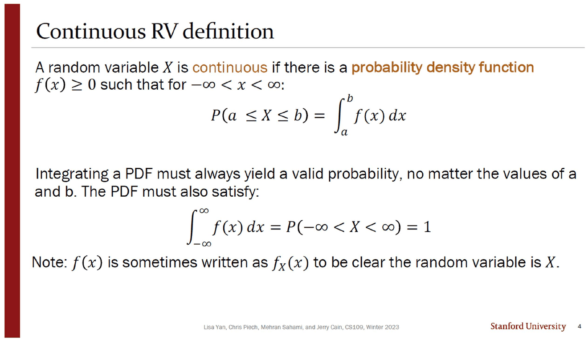
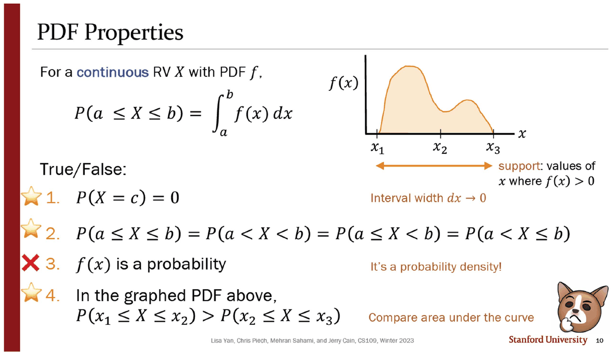
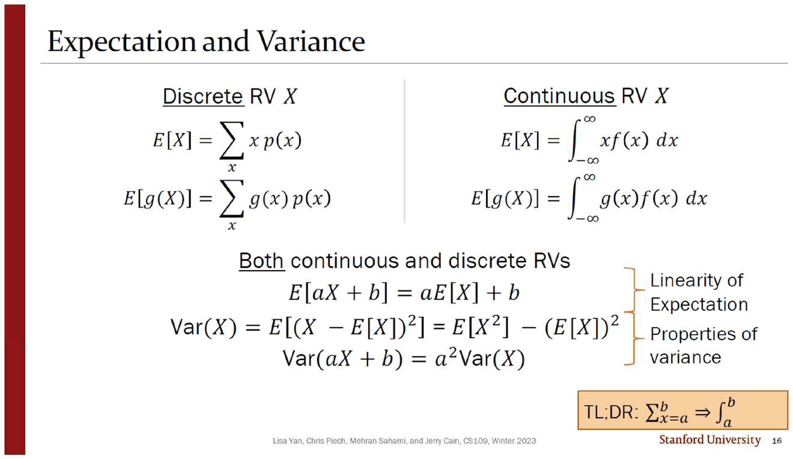
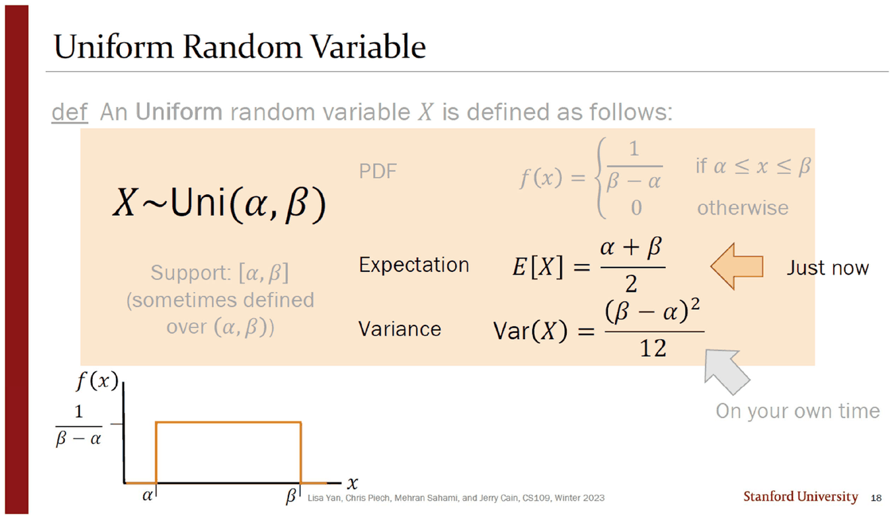
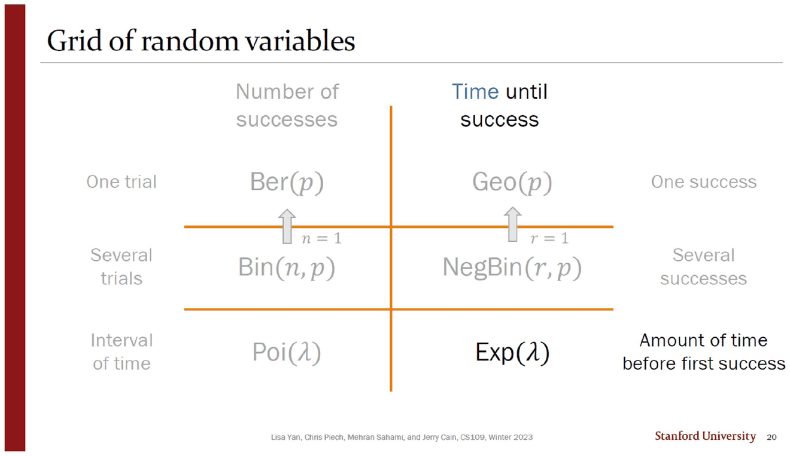
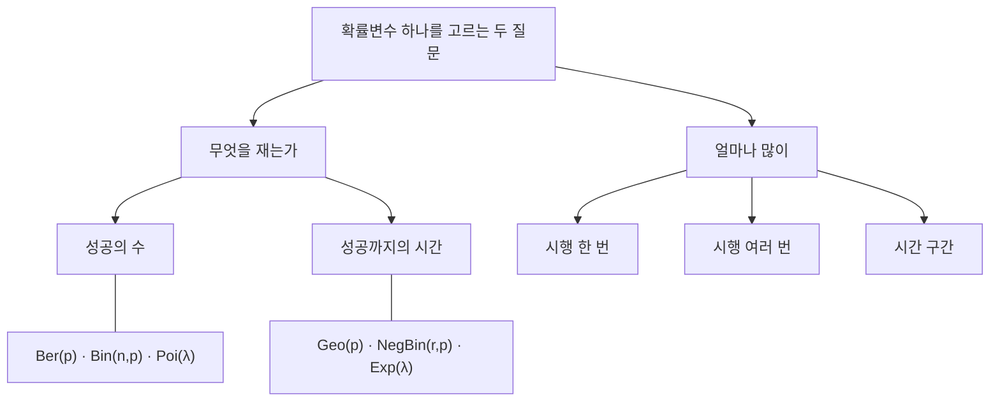
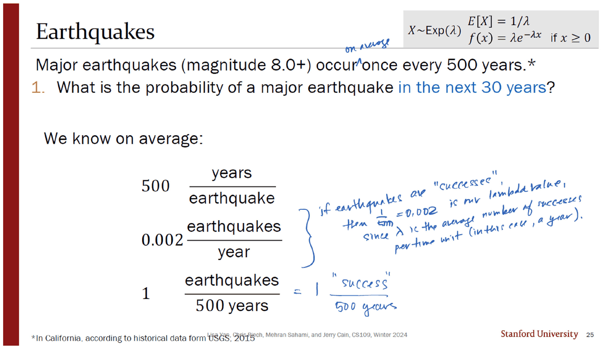
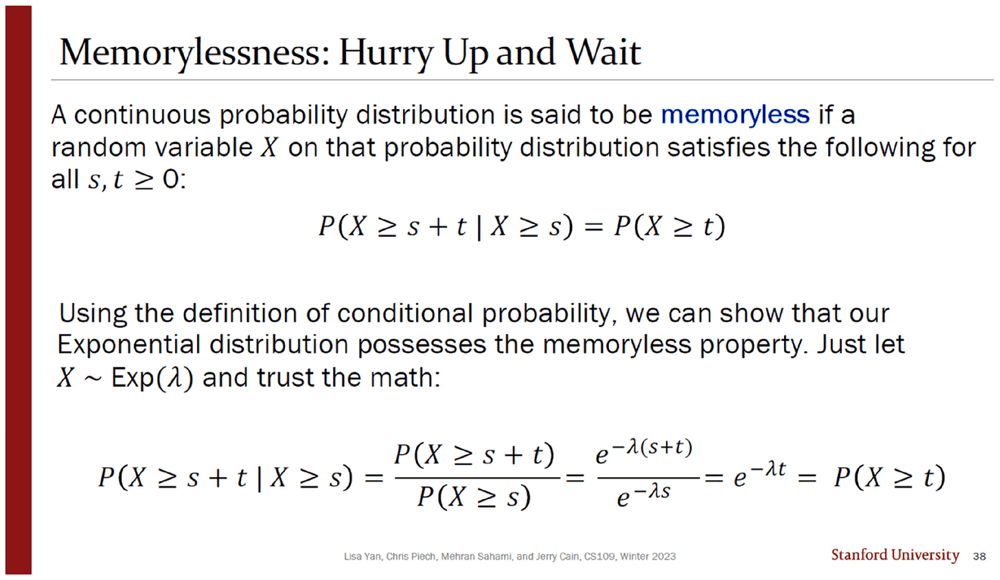

> [!abstract] 바뀌는 것은 기호 하나뿐이라고 말하는 덱
> 09번 덱(42쪽 · Jerry Cain · 2024년 1월 29일)의 목차는 여섯 토막이다 — `2 Continuous RVs` · `12 Uniform RV` · `19 Exponential RV` · `28 CDFs` · `36 Memoryless Property` · `39 Exercises`.
>
> 덱 한가운데(16번)에 주황 상자가 하나 있고, 그 안에 이 전환의 요약이 다섯 글자로 들어 있다.
>
> $$\textbf{TL;DR:}\quad \sum_{x=a}^{b}\ \Longrightarrow\ \int_a^b$$
>
> 실제로 기댓값·LOTUS·선형성·분산의 성질이 모두 그대로 살아남는다. 그런데 **딱 한 문장이 무너진다** — 지금까지 모든 계산의 출발점이었던 $P(X=k)$ 가, 연속 확률변수에서는 **모든 $k$ 에 대해 0**이 된다. 이 문서는 그 한 문장이 무너진 자리에 무엇이 들어서는지를 따라간다.

---

## 막대를 무한히 얇게 하면

3번 슬라이드는 사람 키의 히스토그램을 보여 준다. 구간 $(52,56]$ 의 막대 하나가 그 구간에 속할 확률이다. 막대를 더 좁게 잡으면 더 정밀해지고, 「$\infty$-ly small bars」로 가면 곡선이 된다.



4번의 정의가 그 극한을 형식화한다.

> A random variable $X$ is **continuous** if there is a **probability density function** $f(x)\ge 0$ such that for $-\infty<x<\infty$:
> $$P(a\le X\le b)=\int_a^b f(x)\,dx,\qquad \int_{-\infty}^{\infty}f(x)\,dx=1$$

핵심은 **확률이 $f$ 의 값이 아니라 $f$ 의 적분으로 정의된다**는 것이다. 이 한 줄에서 세 가지가 따라 나오고, 10번이 그것을 참·거짓 문제로 만든다.



| | 문항 | 판정 | 슬라이드의 근거 |
| --- | --- | --- | --- |
| 1 | $P(X=c)=0$ | ⭐ 참 | *Interval width $dx\to 0$* |
| 2 | $P(a\le X\le b)=P(a<X<b)=P(a\le X<b)=P(a<X\le b)$ | ⭐ 참 | (1의 따름) |
| 3 | **$f(x)$ 는 확률이다** | ❌ **거짓** | *It's a probability **density**!* |
| 4 | 그림에서 $P(x_1\le X\le x_2)>P(x_2\le X\le x_3)$ | ⭐ 참 | *Compare area under the curve* |

3번이 이 절의 전부다. 밀도는 확률이 아니므로 **1을 넘어도 된다.** 15번(「Quick check」)의 두 번째 그래프가 바로 그 예다 — 구간 $[1,\tfrac32]$ 에서 밀도가 **2**까지 올라간다. 폭이 $\tfrac12$ 이므로 넓이는 여전히 1이다.

같은 슬라이드 오른쪽이 **지지집합**을 다시 정의한다 — *support: values of $x$ where $f(x)>0$*. [05. 확률변수 — 표본공간을 숫자 하나로 접는다](<./05. 확률변수 — 표본공간을 숫자 하나로 접는다.md>)에서 이산 확률변수에 대해 「확률이 0이 아닌 값들」이라 했던 것이, 여기서는 「밀도가 0이 아닌 값들」로 바뀐다. **확률로는 더 이상 지지집합을 정의할 수 없다** — 전부 0이기 때문이다.

```html preview
<div id="pd-root">
  <style>
    #pd-root{font-family:system-ui,-apple-system,"Segoe UI",sans-serif;color:var(--foreground);padding:4px}
    #pd-root .panel{background:var(--card);border:1px solid var(--border);border-radius:10px;padding:14px}
    #pd-root .row{display:flex;align-items:center;gap:10px;margin:7px 0;font-size:13px;flex-wrap:wrap}
    #pd-root input[type=range]{flex:1;min-width:120px;accent-color:var(--chart-1)}
    #pd-root button{background:var(--card);color:var(--foreground);border:1px solid var(--border);border-radius:6px;padding:4px 10px;font:inherit;font-size:12.5px;cursor:pointer}
    #pd-root .out{margin-top:9px;padding:10px 12px;border:1px solid var(--border);border-radius:8px;font-size:13.5px;line-height:1.8}
    #pd-root code{font-family:ui-monospace,SFMono-Regular,Menlo,monospace}
  </style>
  <div class="panel">
    <div class="row">
      <button data-ab="0,25">0 ~ 25</button><button data-ab="1,1.5">1 ~ 1.5</button><button data-ab="-5,5">−5 ~ 5</button>
    </div>
    <div class="row"><span style="opacity:.7;width:22px">α</span><input type="range" id="pd-a" min="-10" max="9" step="0.5" value="1"><b id="pd-av" style="width:44px;text-align:right">1</b></div>
    <div class="row"><span style="opacity:.7;width:22px">β</span><input type="range" id="pd-b" min="-9" max="26" step="0.5" value="1.5"><b id="pd-bv" style="width:44px;text-align:right">1.5</b></div>
    <svg id="pd-svg" width="100%" height="170" viewBox="0 0 620 170" role="img" aria-label="균등분포의 밀도 높이와 넓이"></svg>
    <div class="out" id="pd-out"></div>
  </div>
</div>
<script>
(function(){
  var R=document.getElementById('pd-root');
  function draw(){
    var a=+R.querySelector('#pd-a').value, b=+R.querySelector('#pd-b').value;
    if(b<=a) b=a+0.5;
    R.querySelector('#pd-av').textContent=a; R.querySelector('#pd-bv').textContent=b;
    var h=1/(b-a);
    var lo=-11, hi=27, X0=34, Y0=14, W=560, H=118;
    function X(v){return X0+(v-lo)/(hi-lo)*W;}
    var hmax=Math.max(2.2,h*1.15);
    function Y(v){return Y0+H*(1-v/hmax);}
    var g='<line x1="'+X0+'" y1="'+(Y0+H)+'" x2="'+(X0+W)+'" y2="'+(Y0+H)+'" stroke="var(--border)"/>';
    g+='<line x1="'+X0+'" y1="'+Y0+'" x2="'+X0+'" y2="'+(Y0+H)+'" stroke="var(--border)"/>';
    g+='<line x1="'+X0+'" y1="'+Y(1)+'" x2="'+(X0+W)+'" y2="'+Y(1)+'" stroke="var(--chart-4)" stroke-dasharray="4 4"/>';
    g+='<text x="'+(X0+W-52)+'" y="'+(Y(1)-4)+'" font-size="10.5" fill="var(--chart-4)">높이 1</text>';
    g+='<rect x="'+X(a)+'" y="'+Y(h)+'" width="'+(X(b)-X(a))+'" height="'+(Y0+H-Y(h))+'" fill="var(--chart-1)" opacity=".42" stroke="var(--chart-1)"/>';
    g+='<text x="'+X(a)+'" y="'+(Y0+H+15)+'" font-size="10.5" text-anchor="middle" fill="var(--foreground)" opacity=".8">α='+a+'</text>';
    g+='<text x="'+X(b)+'" y="'+(Y0+H+15)+'" font-size="10.5" text-anchor="middle" fill="var(--foreground)" opacity=".8">β='+b+'</text>';
    g+='<text x="'+((X(a)+X(b))/2)+'" y="'+((Y(h)+Y0+H)/2+4)+'" font-size="12" text-anchor="middle" fill="var(--foreground)">넓이 = 1</text>';
    R.querySelector('#pd-svg').innerHTML=g;
    var orig = (a===0&&b===25)||(a===1&&b===1.5)||(a===-5&&b===5);
    R.querySelector('#pd-out').innerHTML=
      '<code>f(x) = 1/(β − α) = 1/'+(b-a)+' = <b>'+h.toFixed(4)+'</b></code>  ·  <code>넓이 = '+h.toFixed(4)+' × '+(b-a)+' = 1</code>'
      +'<div style="margin-top:6px">'+(h>1
        ? '<b>높이가 1을 넘는다.</b> 그래도 모순이 아니다 — 확률은 높이가 아니라 넓이이고, 넓이는 언제나 1이다. 10번 슬라이드의 3번 문항이 가리키는 바로 그 지점이다.'
        : '높이가 1 이하다. 이 경우에는 밀도를 확률로 착각해도 겉으로 티가 나지 않는다.')
      +(orig? ' <span style="opacity:.75">(원본 14쪽 = 슬라이드 15번 「Quick check」의 세 설정이다.)</span>':'')
      +'</div>';
  }
  R.addEventListener('input',draw);
  R.addEventListener('click',function(e){ if(e.target.dataset.ab){var s=e.target.dataset.ab.split(',');
    R.querySelector('#pd-a').value=s[0]; R.querySelector('#pd-b').value=s[1]; draw();} });
  draw();
})();
</script>
```

---

## 무엇이 살아남는가



16번이 이산과 연속을 나란히 놓는다.

| | 이산 | 연속 |
| --- | --- | --- |
| 기댓값 | $E[X]=\sum_x x\,p(x)$ | $E[X]=\displaystyle\int_{-\infty}^{\infty} x f(x)\,dx$ |
| LOTUS | $E[g(X)]=\sum_x g(x)p(x)$ | $E[g(X)]=\displaystyle\int_{-\infty}^{\infty} g(x)f(x)\,dx$ |

그리고 아래쪽은 **`Both`** 로 묶인다.

$$E[aX+b]=aE[X]+b,\qquad \mathrm{Var}(X)=E[X^2]-(E[X])^2,\qquad \mathrm{Var}(aX+b)=a^2\mathrm{Var}(X)$$

[06. 기댓값은 누가 재느냐에 따라 달라진다](<./06. 기댓값은 누가 재느냐에 따라 달라진다.md>)와 [07. 분산 — 같은 평균을 가진 분포를 가르는 수](<./07. 분산 — 같은 평균을 가진 분포를 가르는 수.md>)에서 증명한 것이 **하나도 버려지지 않는다.** 저 세 줄의 증명은 전부 $\sum$ 의 선형성만 썼고, $\int$ 도 선형이기 때문이다. 슬라이드는 그 이유를 말하지 않고 `TL;DR` 상자 하나로 넘어간다.

---

## 균등분포 — 같은 상자가 두 번, 관사가 바뀐다

13번이 균등분포의 정의 상자를 놓는다. PDF만 검게 남기고 기댓값·분산은 회색이다.

$$X\sim\mathrm{Uni}(\alpha,\beta),\qquad f(x)=\begin{cases}\dfrac{1}{\beta-\alpha} & \alpha\le x\le\beta\\[2pt] 0 & \text{otherwise}\end{cases}$$

지지집합 칸에 괄호로 단서가 붙어 있다 — *Support: $[\alpha,\beta]$ (sometimes defined over $(\alpha,\beta)$)*. 열린 구간이든 닫힌 구간이든 **적분값이 같기 때문에** 상관없다는 뜻인데, 그 이유는 10번의 2번 문항($P(a\le X\le b)=P(a<X<b)$)에 이미 있다. 두 슬라이드가 같은 사실의 두 얼굴이지만 서로를 가리키지 않는다.



18번은 같은 상자의 재등장이고, 이번에는 기댓값 줄이 검게 살아나며 `Just now` 화살표가 붙는다. 분산 줄에는 회색 화살표와 `On your own time` — [08. 이항, 그리고 인쇄되지 않은 증명](<./08. 이항, 그리고 인쇄되지 않은 증명.md>)에서 본 「미루기」가 여기서도 반복된다.

그런데 제목 아래 정의문의 관사가 바뀌었다.

| 13번 | 18번 |
| --- | --- |
| **A** Uniform random variable $X$ is defined as follows: | **An** Uniform random variable $X$ is defined as follows: |

같은 문장을 복사해 붙이면서 첫 낱말만 달라졌다. `Uniform` 은 자음 발음(/juː/)으로 시작하므로 `A` 가 맞다.

---

## 격자 한 장이 지금까지를 정리한다



20번은 이 덱에서 가장 밀도 높은 슬라이드이고, 새 내용이 하나도 없다. **지금까지 배운 분포 전부를 2×3 격자에 넣는다.**



| | 성공의 수 | 성공까지의 시간 | 오른쪽 라벨 |
| --- | --- | --- | --- |
| 시행 한 번 | $\mathrm{Ber}(p)$ | $\mathrm{Geo}(p)$ | One success |
| 시행 여러 번 | $\mathrm{Bin}(n,p)$ | $\mathrm{NegBin}(r,p)$ | Several successes |
| 시간 구간 | $\mathrm{Poi}(\lambda)$ | $\mathbf{\mathrm{Exp}(\lambda)}$ | Amount of time before first success |

두 개의 회색 화살표가 위로 향한다 — $\mathrm{Bin}(n,p)$ 에서 $n=1$ 이면 $\mathrm{Ber}(p)$, $\mathrm{NegBin}(r,p)$ 에서 $r=1$ 이면 $\mathrm{Geo}(p)$. [08](<./08. 이항, 그리고 인쇄되지 않은 증명.md>)에서 본 $\mathrm{Ber}(p)=\mathrm{Bin}(1,p)$ 가 여기서 격자의 구조적 성질이 된다.

이 격자에서 **검게 칠해진 칸은 $\mathrm{Exp}(\lambda)$ 하나**다. 나머지 다섯은 회색 — 이미 배웠거나(Ber · Bin · Poi) 이 과목이 다루지 않는(Geo · NegBin) 칸이다. 그리고 여섯 칸 중 **연속인 것도 $\mathrm{Exp}$ 뿐이다.** 앞의 열아홉 장이 PDF를 세운 이유가 이 한 칸에 있다.

> [!note] 격자가 말하지 않는 것
> $\mathrm{Poi}(\lambda)$ 와 $\mathrm{Exp}(\lambda)$ 가 같은 줄에 있고 같은 $\lambda$ 를 쓴다. 같은 현상의 두 측면 — 「한 해에 몇 번 일어나는가」와 「다음까지 얼마나 걸리는가」 — 이라는 뜻인데, 격자는 그것을 **배치로만** 말한다. 그리고 포아송을 다룬 08번 덱은 `sources/` 에 없다([08](<./08. 이항, 그리고 인쇄되지 않은 증명.md>) 참고).

---

## 지수분포 — $\lambda$ 의 단위가 전부다

21번의 정의는 짧다.

$$X\sim\mathrm{Exp}(\lambda),\qquad f(x)=\lambda e^{-\lambda x}\ (x\ge0),\qquad E[X]=\frac1\lambda,\qquad \mathrm{Var}(X)=\frac{1}{\lambda^2}$$



25번의 지진 문제에서 실제로 하는 일은 **단위 변환**뿐이다. 슬라이드가 같은 사실을 세 가지 형태로 적는다.

$$500\ \frac{\text{years}}{\text{earthquake}}\qquad
0.002\ \frac{\text{earthquakes}}{\text{year}}\qquad
1\ \frac{\text{earthquake}}{500\ \text{years}}$$

잉크가 가운데 것을 골라 이유를 쓴다.

> if earthquakes are "successes", then $\tfrac{1}{500}=0.002$ is our lambda value, since $\lambda$ is the average number of successes per time unit (in this case, a year).

$\lambda$ 는 **비율**이므로 시간 단위를 정해야 값이 정해진다. 「500년에 한 번」과 「연 0.002회」는 같은 말이지만, 지수분포의 매개변수 자리에 들어갈 수 있는 것은 뒤쪽뿐이다. 잉크가 제목 옆 여백에 `on average` 를 끼워 넣은 것도 같은 이유다 — 인쇄된 문장 *"Major earthquakes occur once every 500 years"* 는 **결정적 주기처럼** 읽힌다.

26번이 답을 낸다. 30년 안에 일어날 확률은

$$P(X\le 30)=1-e^{-0.002\times 30}=1-e^{-0.06}\approx \mathbf{0.0582}$$

```html preview
<div id="ex-root">
  <style>
    #ex-root{font-family:system-ui,-apple-system,"Segoe UI",sans-serif;color:var(--foreground);padding:4px}
    #ex-root .panel{background:var(--card);border:1px solid var(--border);border-radius:10px;padding:14px}
    #ex-root .row{display:flex;align-items:center;gap:10px;margin:7px 0;font-size:13px;flex-wrap:wrap}
    #ex-root input[type=range]{flex:1;min-width:130px;accent-color:var(--chart-1)}
    #ex-root button{background:var(--card);color:var(--foreground);border:1px solid var(--border);border-radius:6px;padding:4px 10px;font:inherit;font-size:12.5px;cursor:pointer}
    #ex-root button.on{border-color:var(--chart-2);background:color-mix(in srgb,var(--chart-2) 16%,transparent)}
    #ex-root .out{margin-top:9px;padding:10px 12px;border:1px solid var(--border);border-radius:8px;font-size:13.5px;line-height:1.8}
    #ex-root code{font-family:ui-monospace,SFMono-Regular,Menlo,monospace}
  </style>
  <div class="panel">
    <div class="row">
      <button data-s="quake" class="on">26번 · 지진 (λ = 0.002 / 년)</button>
      <button data-s="laptop">문제지 · 노트북 (평균 5000시간)</button>
    </div>
    <div class="row"><span style="opacity:.7;width:60px" id="ex-lbl">기간</span><input type="range" id="ex-t" min="1" max="120" value="30"><b id="ex-tv" style="width:80px;text-align:right">30</b></div>
    <svg id="ex-svg" width="100%" height="140" viewBox="0 0 620 140" role="img" aria-label="지수분포 밀도와 누적 확률"></svg>
    <div class="out" id="ex-out"></div>
  </div>
</div>
<script>
(function(){
  var R=document.getElementById('ex-root'), scen='quake';
  var S={quake:{lam:0.002,unit:'년',max:120,def:30,label:'기간(년)'},
         laptop:{lam:1/5000,unit:'시간',max:120,def:48,label:'사용 개월(5시간/일)'}};
  function tval(){
    var t=+R.querySelector('#ex-t').value;
    return scen==='quake'? t : t*30.4167*5; // 개월 → 시간(하루 5시간)
  }
  function draw(){
    var s=S[scen], raw=+R.querySelector('#ex-t').value, t=tval(), lam=s.lam;
    R.querySelector('#ex-lbl').textContent = scen==='quake'?'년':'개월';
    R.querySelector('#ex-tv').textContent = scen==='quake'? raw+' 년' : raw+' 개월';
    var p=1-Math.exp(-lam*t);
    var X0=30,Y0=12,W=570,H=100, tmax = scen==='quake'? 120 : 120*30.4167*5;
    function X(v){return X0+v/tmax*W;}
    var fmax=lam;
    var d='';
    for(var i=0;i<=200;i++){ var x=tmax*i/200, y=lam*Math.exp(-lam*x);
      d+=(i?'L':'M')+X(x).toFixed(1)+','+(Y0+H*(1-y/fmax)).toFixed(1)+' '; }
    var g='<path d="'+d+'" fill="none" stroke="var(--chart-1)" stroke-width="2"/>';
    var fill='M'+X(0)+','+(Y0+H)+' ';
    for(var j=0;j<=120;j++){ var x2=t*j/120, y2=lam*Math.exp(-lam*x2);
      fill+='L'+X(x2).toFixed(1)+','+(Y0+H*(1-y2/fmax)).toFixed(1)+' '; }
    fill+='L'+X(t)+','+(Y0+H)+' Z';
    g='<path d="'+fill+'" fill="var(--chart-2)" opacity=".35"/>'+g;
    g+='<line x1="'+X0+'" y1="'+(Y0+H)+'" x2="'+(X0+W)+'" y2="'+(Y0+H)+'" stroke="var(--border)"/>';
    g+='<line x1="'+X(t)+'" y1="'+Y0+'" x2="'+X(t)+'" y2="'+(Y0+H)+'" stroke="var(--chart-2)" stroke-dasharray="3 3"/>';
    g+='<text x="'+X0+'" y="'+(Y0+H+18)+'" font-size="10.5" fill="var(--foreground)" opacity=".7">0</text>';
    R.querySelector('#ex-svg').innerHTML=g;
    var html;
    if(scen==='quake'){
      html='<code>P(X ≤ '+raw+') = 1 − e<sup>−0.002 × '+raw+'</sup> = <b>'+p.toFixed(4)+'</b></code>';
      if(raw===30) html+='<div style="margin-top:6px">원본 26번의 답 <b>0.0582</b> 와 일치한다.</div>';
      if(raw===500) html+='<div style="margin-top:6px">「평균 500년에 한 번」인데 500년 안에 일어날 확률은 1이 아니라 <b>'+p.toFixed(4)+'</b> 다.</div>';
    } else {
      html='<code>P(X > '+Math.round(t)+'시간) = e<sup>−'+(lam*t).toFixed(4)+'</sup> = <b>'+(1-p).toFixed(4)+'</b></code>';
      var m={48:'0.2322 (4년)',60:'0.1612 (5년)',72:'0.1119 (6년)'}[raw];
      if(m) html+='<div style="margin-top:6px">문제지의 값 <b>'+m+'</b> 과 일치한다 — 하루 5시간씩 쓰면 '+Math.round(t)+'시간이다.</div>';
    }
    R.querySelector('#ex-out').innerHTML=html;
    R.querySelectorAll('.row button').forEach(function(b){b.className=(b.dataset.s===scen?'on':'');});
  }
  R.addEventListener('input',draw);
  R.addEventListener('click',function(e){ if(e.target.dataset.s){scen=e.target.dataset.s;
    R.querySelector('#ex-t').value=S[scen].def; draw();} });
  draw();
})();
</script>
```

`Continuous RVs 문제` 유인물이 같은 지수분포를 다른 문제로 한 번 더 묻는다 — 노트북의 **사용 시간** 수명이 평균 5,000시간인 지수분포를 따를 때, 하루 5시간씩 쓰면 4년(7,300시간) 넘게 버틸 확률은 $e^{-1.46}\approx0.2322$, 5년(9,125시간)이면 $0.1612$, 6년(10,950시간)이면 $0.1119$ 다. 세 값 모두 파이썬으로 다시 계산해 잉크와 대조했다.

**「시간」의 단위가 달력이 아니라 사용 시간**이라는 점이 이 문제의 함정이고, 잉크가 `5 hrs/day` 를 먼저 적어 그 변환을 못 박는다. 지진에서 $\lambda$ 의 단위를 정하던 일이 여기서는 $x$ 의 단위를 정하는 일로 되풀이된다.

---

## CDF가 두 세계를 잇는다

28~35번이 CDF를 다시 꺼낸다. 정의는 [05](<./05. 확률변수 — 표본공간을 숫자 하나로 접는다.md>)에서 이산 확률변수에 대해 본 것과 **글자 그대로 같다** — $F(a)=P(X\le a)$. 바뀌는 것은 계산 방법뿐이다.

$$\text{이산: } F(a)=\sum_{x\le a}p(x)\qquad\Longrightarrow\qquad \text{연속: } F(a)=\int_{-\infty}^{a}f(x)\,dx$$

31번의 짝짓기 문제가 CDF의 쓸모를 정리한다.

| 물음 | 답 | 이유 |
| --- | --- | --- |
| $P(X<a)$ | $F(a)$ | $P(X=a)=0$ 이므로 $<$ 와 $\le$ 가 같다 |
| $P(X>a)$ | $1-F(a)$ | 여집합 |
| $P(X\ge a)$ | $1-F(a)$ | 같은 이유로 $>$ 와 $\ge$ 가 같다 |
| $P(a\le X\le b)$ | $F(b)-F(a)$ | (다음 슬라이드) |

슬라이드가 *"choices are used 0/1/2 times"* 라고 미리 알린 것이 요령이다 — **$B$ 가 두 번 쓰이고 $D$ 는 한 번도 쓰이지 않는다.** 1번과 3번이 같은 답을 갖는다는 사실 자체가 「연속에서는 등호가 무의미하다」는 10번 문항 2의 재확인이고, $D$($F(a)-F(b)$)는 순서가 뒤집힌 함정이다.

---

## 무기억성 — 기다린 시간이 버려진다



38번이 이 덱의 마지막 개념을 정의한다.

$$P(X\ge s+t\mid X\ge s)=P(X\ge t)\qquad \text{for all } s,t\ge 0$$

증명은 세 줄이고 지수함수의 성질 하나만 쓴다.

$$\frac{P(X\ge s+t)}{P(X\ge s)}=\frac{e^{-\lambda(s+t)}}{e^{-\lambda s}}=e^{-\lambda t}=P(X\ge t)$$

슬라이드 제목이 이 성질의 체감을 요약한다 — **Hurry Up and Wait.** 이미 $s$ 만큼 기다렸다는 사실이 남은 대기 시간의 분포를 **전혀** 바꾸지 않는다. 지진을 300년 기다렸어도 앞으로 30년 안에 일어날 확률은 여전히 0.0582다.

본문의 *"Just let $X\sim\mathrm{Exp}(\lambda)$ and trust the math"* 가 이 덱의 마지막 어조다 — 계산은 세 줄인데 직관은 계속 저항한다는 것을 슬라이드가 알고 있다.

---

## 원본에서 확인한 것

> [!caution] 같은 정의문의 관사가 두 슬라이드에서 다르다
> 13번은 *"**A** Uniform random variable $X$ is defined as follows"*, 18번은 *"**An** Uniform random variable…"* 이다. 같은 상자를 복사해 붙이면서 관사만 바뀌었고, `Uniform` 은 반모음으로 시작하므로 `A` 가 맞다.

<!-- -->
> [!caution] 각주에 `form USGS` 오타가 있다
> 25번 각주는 *"In California, according to historical data **form** USGS, 2015"* 다(`from` 의 오타). 같은 각주가 지진 문제 슬라이드 여러 장에 반복되므로 오타도 함께 반복된다. 덧붙여 본문은 *"Major earthquakes occur once every 500 years"* 로 평균이라는 말이 빠져 있고, 잉크가 여백에 `on average` 를 끼워 넣어 보충한다.

<!-- -->
> [!caution] 이 덱도 두 해가 섞여 있다
> 본문 대부분(4 · 10 · 13 · 16 · 18 · 20 · 31 · 38번)은 `CS109, Winter 2023` 인데 지진 슬라이드(25번)는 `Winter 2024` 다. [05](<./05. 확률변수 — 표본공간을 숫자 하나로 접는다.md>)·[07](<./07. 분산 — 같은 평균을 가진 분포를 가르는 수.md>)에서 확인한 것과 같은 패턴이다.

<!-- -->
> [!caution] 슬라이드 넉 장이 PDF에 없다
> 42쪽짜리 PDF인데 마지막 인쇄 번호는 46이다. 쪽 번호와 슬라이드 번호의 어긋남을 처음부터 끝까지 따라가면 빠진 것은 **14 · 22 · 40 · 43번** 넉 장이고, 46 − 4 = 42 로 쪽수와 정확히 맞는다. 목차의 여섯 구간(2 · 12 · 19 · 28 · 36 · 39)은 인쇄 번호와 모두 일치하므로, [08](<./08. 이항, 그리고 인쇄되지 않은 증명.md>)에서 본 07번 덱과 달리 이 덱은 **번호가 겹치지 않고 빠지기만** 한다.

<!-- -->
> [!note] 잉크의 「$f(x)>0$」 은 정의보다 조금 강하다
> 11번의 잉크가 *"no! $f(x)>0$ for valid pdfs"* 라고 적었는데, 4번의 인쇄된 정의는 $f(x)\ge 0$ 이다. 10번이 지지집합을 *"values of $x$ where $f(x)>0$"* 로 정의하므로 잉크는 그쪽 문장을 옮긴 것으로 보이지만, 「유효한 PDF라면 모든 $x$ 에서 $f(x)>0$」으로 읽으면 균등분포부터 어긋난다(구간 밖에서 $f=0$).

이 문서의 수치 — $0.0582$ · $0.2322$ · $0.1612$ · $0.1119$ · $e^{-2}=0.1353$ — 는 전부 파이썬으로 다시 계산해 슬라이드·잉크와 대조했다. 어긋난 값은 없었다.

---

## 다음 문서로

격자의 여섯 칸에 없던 분포가 하나 남아 있다. 다음 덱은 그것을 꺼내면서 **왜 하필 그 분포인지**를 네 가지 이유로 설명하고, 바로 다음 장에서 그중 셋을 취소한다.

- [10. 정규분포 — 이유 넷을 대고 다음 장에서 셋을 취소한다](<./10. 정규분포 — 이유 넷을 대고 다음 장에서 셋을 취소한다.md>)
- [08. 이항, 그리고 인쇄되지 않은 증명](<./08. 이항, 그리고 인쇄되지 않은 증명.md>)

## 근거 자료

| 원본 쪽(슬라이드) | 제목 | 이 문서에서 쓴 곳 |
| --- | --- | --- |
| 1 (1) | 목차 · 2024년 1월 29일 | 덱의 구성 |
| 3 (3) | People heights | 막대를 무한히 얇게 |
| 4 (4) | Continuous RV definition | 확률은 면적 |
| 10 (10) | PDF Properties | 네 문항 · 지지집합 |
| 11 (11) | (확인 문제) | 잉크의 $f(x)>0$ |
| 14 (15) | Quick check | 높이가 2인 균등 밀도 |
| 13 (13) | Uniform Random Variable | 정의 상자 · `A` |
| 15 (16) | Expectation and Variance | $\sum\Rightarrow\int$ |
| 17 (18) | Uniform Random Variable | 같은 상자 · `An` |
| 19 (20) | Grid of random variables | 2×3 격자 |
| 20 (21) | Exponential RV | 정의 |
| 23·24 (25·26) | Earthquakes | $\lambda$ 의 단위 · $0.0582$ |
| 29·31 (31·33) | Using the CDF for continuous RVs | 짝짓기 · 등호의 무의미 |
| 36 (38) | Memorylessness: Hurry Up and Wait | 세 줄 증명 |
| `Continuous RVs 문제.pdf` 1~4 | (25·26·41·42 등 재인쇄) | 노트북 수명 |

원본 42쪽 + 유인물 4쪽. 슬라이드 45장 중 14 · 22 · 40 · 43번은 PDF에 없다. 인용 이미지 7장은 200 dpi 렌더다.
