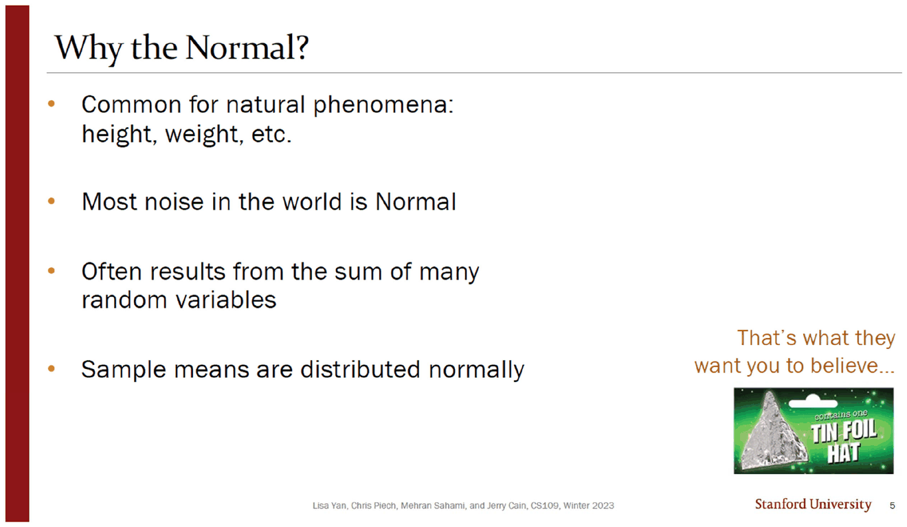
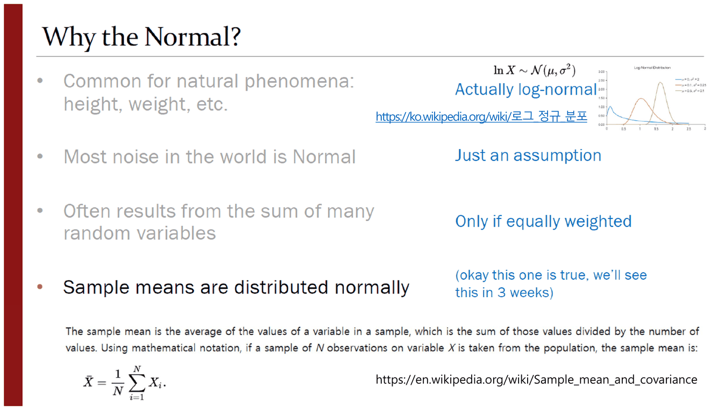
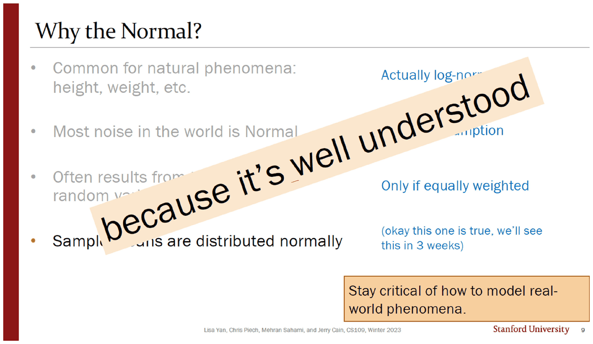
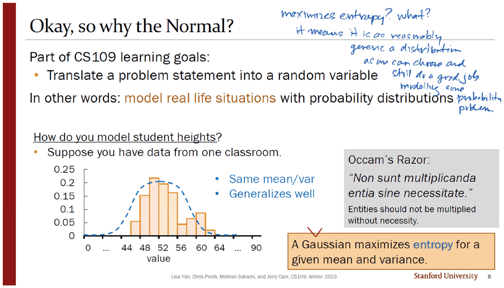
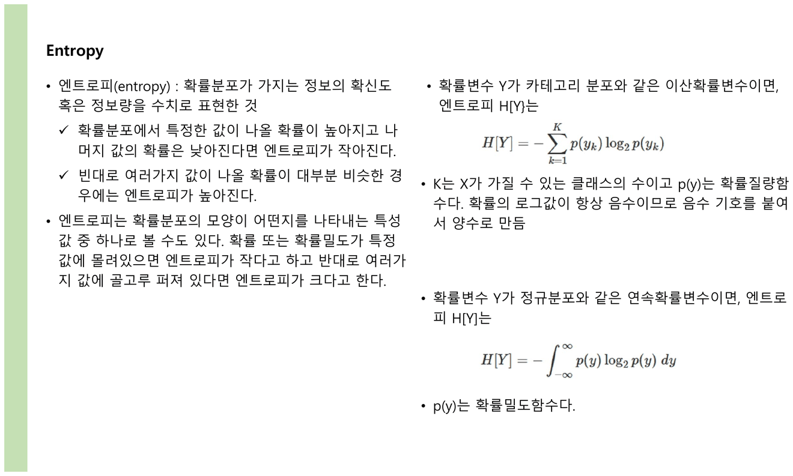
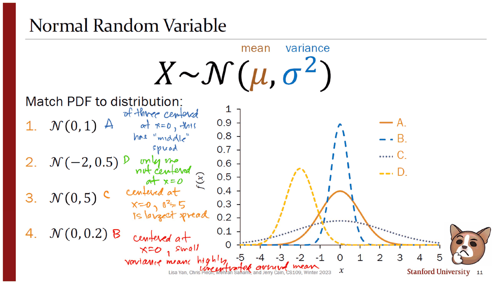
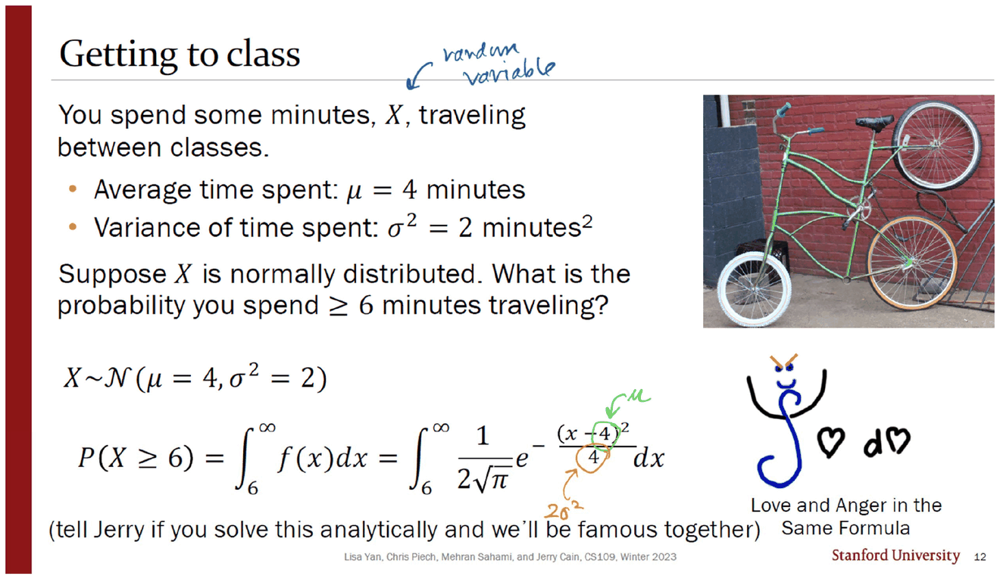
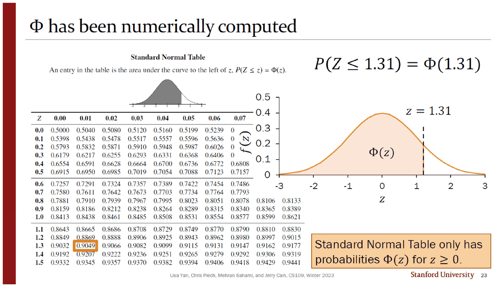
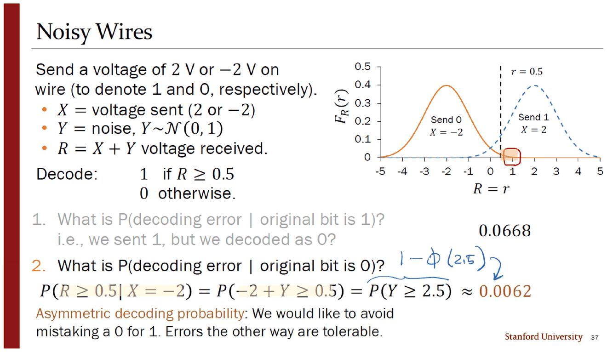

> [!abstract] 자기 근거를 스스로 취소하는 강의
> 10번 덱(40쪽)은 정규분포를 도입하면서 **「왜 하필 정규분포인가」에 네 가지 이유**를 댄다(슬라이드 5). 그리고 네 장 뒤(슬라이드 9), 같은 화면 위에 대각선으로 도장이 찍힌다 — **because it's well understood.** 그 아래에서 앞의 이유 셋이 파란 글씨로 하나씩 취소된다.
>
> 이 덱에는 그 취소를 보충하려고 **교수가 직접 끼워 넣은 슬라이드가 두 장** 있다. 둘 다 스탠퍼드 저작권 줄도 슬라이드 번호도 없고, 한국어 위키백과 링크가 붙어 있다. 인쇄된 강의와 그것을 다시 가르치는 사람의 손이 이 덱에서 가장 선명하게 갈린다.

---

## 네 가지 이유



5번의 목록은 이렇다.

1. 자연 현상에서 흔하다 — 키, 몸무게 등
2. 세상의 잡음은 대개 정규분포다
3. 많은 확률변수의 **합**에서 자주 나온다
4. **표본평균**이 정규분포를 따른다

그리고 오른쪽 아래에 은박 모자(tin foil hat) 그림과 함께 한 줄 — *"That's what they want you to believe…"*. 이 농담이 예고편이다.



바로 다음 쪽이 **원본 덱의 슬라이드가 아니다.** 하단에 `Lisa Yan, Chris Piech, Mehran Sahami, and Jerry Cain, CS109, Winter 2023` 도, 오른쪽 아래 번호도 없다. 대신 이 쪽에만 있는 것이 둘이다.

- 로그정규분포의 PDF 그래프와 $\ln X\sim\mathcal N(\mu,\sigma^2)$, 그리고 **한국어 위키백과 링크**(`ko.wikipedia.org/wiki/로그 정규 분포`)
- 화면 아래를 가로지르는 **영문 위키백과의 「표본평균」 정의**와 그 출처 URL

취소문 자체(`Actually log-normal` · `Just an assumption` · `Only if equally weighted` · `okay this one is true, we'll see this in 3 weeks`)는 원본 9번에도 그대로 있으므로 CS109의 것이다. 이 쪽이 하는 일은 그 취소에 **읽을거리를 붙이는 것**이다 — 「실은 로그정규분포다」라는 한 줄을 받아 그 분포가 무엇인지 볼 곳을 알려 주고, 「표본평균」이라는 낱말에 정의를 붙인다.



9번이 결론이다. 네 이유 위로 큼직하게 **because it's well understood** 가 대각선으로 지나가고, 오른쪽 아래 주황 상자가 교훈을 적는다.

> Stay critical of how to model real-world phenomena.

| 5번의 이유 | 9번의 판정 |
| --- | --- |
| 자연 현상에서 흔하다 | ❌ *Actually log-normal* |
| 세상의 잡음은 정규분포다 | ❌ *Just an assumption* |
| 많은 확률변수의 합 | ❌ *Only if equally weighted* |
| 표본평균이 정규분포 | ⭕ *okay this one is true, we'll see this in 3 weeks* |

**넷 중 셋이 취소되고 하나만 남는다.** 그리고 그 하나는 3주 뒤로 미뤄진다. 지금 이 분포를 쓰는 진짜 이유는 도장에 적힌 것 — **잘 알려져 있어서** — 하나뿐이다.

---

## 정의 없이 들어온 낱말, 그리고 그 자리를 메운 장



8번은 모형 선택의 문제로 다시 묻는다. 한 교실의 키 데이터에 곡선을 얹으면서 두 가지 근거를 든다 — *Same mean/var* · *Generalizes well*. 오른쪽에 오컴의 면도날 인용이 라틴어로 놓이고, 아래 주황 상자에 한 줄이 떠 있다.

> A Gaussian maximizes **entropy** for a given mean and variance.

**「엔트로피」는 이 덱에서 정의된 적이 없다.** 잉크가 슬라이드 위쪽 여백에 그 공백을 스스로 메운다.

> maximizes entropy? what? it means it is as reasonably generic a distribution as we can choose and still do a good job modelling some probability problem.



그리고 바로 다음 쪽이 **두 번째 삽입 슬라이드**다. 왼쪽 세로 띠가 덱의 진홍색이 아니라 연두색이고, 저작권 줄도 번호도 없으며, 전체가 한국어다. 제목은 `Entropy`.

| 내용 | 요지 |
| --- | --- |
| 정의 | 「확률분포가 가지는 정보의 확신도 혹은 정보량을 수치로 표현한 것」 |
| 직관 | 한 값에 몰리면 엔트로피가 작고, 여러 값에 고르게 퍼지면 크다 |
| 이산 | $H[Y]=-\sum_{k=1}^{K}p(y_k)\log_2 p(y_k)$ |
| 연속 | $H[Y]=-\displaystyle\int_{-\infty}^{\infty}p(y)\log_2 p(y)\,dy$ |
| 부호 | 「확률의 로그값이 항상 음수이므로 음수 기호를 붙여서 양수로 만듦」 |

인쇄된 슬라이드가 정의 없이 쓴 낱말에, 다시 가르치는 사람이 한 장을 붙여 정의를 넣은 것이다. 이 덱의 삽입 두 장이 **정확히 원본이 비워 둔 두 자리**(로그정규분포가 무엇인가 · 엔트로피가 무엇인가)에 들어가 있다.

> [!caution] 삽입된 엔트로피 슬라이드의 기호가 어긋난다
> 본문은 확률변수를 $Y$ 로 쓰고 식도 $H[Y]$, $p(y_k)$ 인데, 설명 문장 하나가 **「$K$는 $X$가 가질 수 있는 클래스의 수이고」** 로 $X$ 를 쓴다. 같은 문단에서 두 이름이 섞인다. 또 첫 문단의 「엔트로피 H[Y}는」 은 대괄호와 중괄호가 짝이 맞지 않는다. 그리고 **연속 확률변수의 엔트로피는 「정보량」이라는 이산적 해석이 그대로 통하지 않는데**(밀도의 로그는 양수가 될 수 있어 값이 음수일 수 있다), 슬라이드는 「음수 기호를 붙여서 양수로 만듦」이라는 설명을 두 경우에 공통으로 적용한다. *(이 마지막 지적은 원본에 없는 보충이다.)*

---

## 두 매개변수가 그림의 무엇을 정하는가



11번은 $X\sim\mathcal N(\mu,\sigma^2)$ 의 두 자리에 이름표를 붙이고 — `mean` · `variance` — 네 PDF 곡선을 맞추게 한다. 잉크가 파랑·초록·주황·빨강 네 색으로 각각의 근거를 쓴다.

| 분포 | 답 | 잉크의 근거 |
| --- | --- | --- |
| $\mathcal N(0,1)$ | A | *of three centered at $x=0$, this has "middle" spread* |
| $\mathcal N(-2,0.5)$ | D | *only one not centered at $x=0$* |
| $\mathcal N(0,5)$ | C | *centered at $x=0$, $\sigma^2=5$ is largest spread* |
| $\mathcal N(0,0.2)$ | B | *centered at $x=0$, small variance means highly concentrated around mean* |

**판정 순서가 요령이다.** 먼저 $\mu$ 로 하나를 골라내고($-2$ 인 것은 하나뿐), 남은 셋을 $\sigma^2$ 의 크기순으로 줄 세운다. 두 매개변수가 각각 **위치**와 **폭**을 정하고 그 둘이 서로 간섭하지 않기 때문에 가능한 절차다.

```html preview
<div id="nm-root">
  <style>
    #nm-root{font-family:system-ui,-apple-system,"Segoe UI",sans-serif;color:var(--foreground);padding:4px}
    #nm-root .panel{background:var(--card);border:1px solid var(--border);border-radius:10px;padding:14px}
    #nm-root .row{display:flex;align-items:center;gap:10px;margin:7px 0;font-size:13px;flex-wrap:wrap}
    #nm-root input[type=range]{flex:1;min-width:130px;accent-color:var(--chart-1)}
    #nm-root button{background:var(--card);color:var(--foreground);border:1px solid var(--border);border-radius:6px;padding:4px 10px;font:inherit;font-size:12.5px;cursor:pointer}
    #nm-root .out{margin-top:9px;padding:10px 12px;border:1px solid var(--border);border-radius:8px;font-size:13.5px;line-height:1.8}
    #nm-root code{font-family:ui-monospace,SFMono-Regular,Menlo,monospace}
  </style>
  <div class="panel">
    <div class="row">
      <button data-ms="0,1">1 · N(0, 1) → A</button><button data-ms="-2,0.5">2 · N(−2, 0.5) → D</button>
      <button data-ms="0,5">3 · N(0, 5) → C</button><button data-ms="0,0.2">4 · N(0, 0.2) → B</button>
    </div>
    <div class="row"><span style="opacity:.7;width:26px">μ</span><input type="range" id="nm-m" min="-40" max="40" step="1" value="0"><b id="nm-mv" style="width:42px;text-align:right">0</b></div>
    <div class="row"><span style="opacity:.7;width:26px">σ²</span><input type="range" id="nm-v" min="1" max="60" step="1" value="10"><b id="nm-vv" style="width:42px;text-align:right">1.0</b></div>
    <svg id="nm-svg" width="100%" height="180" viewBox="0 0 620 180" role="img" aria-label="정규분포 밀도 곡선"></svg>
    <div class="out" id="nm-out"></div>
  </div>
</div>
<script>
(function(){
  var R=document.getElementById('nm-root');
  var REF=[[0,1,'A'],[-2,0.5,'D'],[0,5,'C'],[0,0.2,'B']];
  function pdf(x,m,v){return Math.exp(-(x-m)*(x-m)/(2*v))/Math.sqrt(2*Math.PI*v);}
  function draw(){
    var m=+R.querySelector('#nm-m').value/10, v=+R.querySelector('#nm-v').value/10;
    R.querySelector('#nm-mv').textContent=m.toFixed(1);
    R.querySelector('#nm-vv').textContent=v.toFixed(1);
    var X0=34,Y0=12,W=570,H=130, lo=-5, hi=5, ymax=1.0;
    function X(x){return X0+(x-lo)/(hi-lo)*W;}
    function Y(y){return Y0+H*(1-Math.min(y,ymax)/ymax);}
    var g='<line x1="'+X0+'" y1="'+(Y0+H)+'" x2="'+(X0+W)+'" y2="'+(Y0+H)+'" stroke="var(--border)"/>';
    g+='<line x1="'+X0+'" y1="'+Y0+'" x2="'+X0+'" y2="'+(Y0+H)+'" stroke="var(--border)"/>';
    g+='<text x="6" y="'+(Y0+6)+'" font-size="10" fill="var(--foreground)" opacity=".7">1.0</text>';
    REF.forEach(function(r,i){
      var d='';
      for(var k=0;k<=160;k++){ var x=lo+(hi-lo)*k/160; d+=(k?'L':'M')+X(x).toFixed(1)+','+Y(pdf(x,r[0],r[1])).toFixed(1)+' '; }
      g+='<path d="'+d+'" fill="none" stroke="var(--chart-'+((i%5)+1)+')" stroke-width="1.1" opacity=".38" stroke-dasharray="4 3"/>';
    });
    var d2='';
    for(var k2=0;k2<=200;k2++){ var x2=lo+(hi-lo)*k2/200; d2+=(k2?'L':'M')+X(x2).toFixed(1)+','+Y(pdf(x2,m,v)).toFixed(1)+' '; }
    g+='<path d="'+d2+'" fill="none" stroke="var(--chart-1)" stroke-width="2.4"/>';
    g+='<line x1="'+X(m)+'" y1="'+Y0+'" x2="'+X(m)+'" y2="'+(Y0+H)+'" stroke="var(--chart-2)" stroke-dasharray="3 3"/>';
    for(var t=-5;t<=5;t++) g+='<text x="'+X(t)+'" y="'+(Y0+H+16)+'" font-size="10" text-anchor="middle" fill="var(--foreground)" opacity=".65">'+t+'</text>';
    R.querySelector('#nm-svg').innerHTML=g;
    var peak=1/Math.sqrt(2*Math.PI*v);
    var hit=REF.filter(function(r){return Math.abs(r[0]-m)<1e-9 && Math.abs(r[1]-v)<1e-9;})[0];
    R.querySelector('#nm-out').innerHTML=
      '<code>최고점 f(μ) = 1/√(2πσ²) = <b>'+peak.toFixed(4)+'</b></code>  ·  <code>SD = '+Math.sqrt(v).toFixed(4)+'</code>'
      +'<div style="margin-top:6px">'+(hit
        ? '원본 11번의 <b>'+hit[2]+'</b> 곡선이다. μ 가 위치를, σ² 가 폭을 정하고 둘은 서로 간섭하지 않는다.'
        : '원본에 없는 설정이다 — 점선 네 개가 11번의 네 곡선이다.')+'</div>';
  }
  R.addEventListener('input',draw);
  R.addEventListener('click',function(e){ if(e.target.dataset.ms){var s=e.target.dataset.ms.split(',');
    R.querySelector('#nm-m').value=Math.round(+s[0]*10); R.querySelector('#nm-v').value=Math.round(+s[1]*10); draw();} });
  draw();
})();
</script>
```

---

## 풀리지 않는 적분, 그리고 표 한 장



12번이 첫 문제를 던진다. 교실 사이 이동 시간이 $X\sim\mathcal N(\mu=4,\sigma^2=2)$ 일 때 6분 이상 걸릴 확률은?

$$P(X\ge6)=\int_6^{\infty}\frac{1}{2\sqrt{\pi}}e^{-\frac{(x-4)^2}{4}}\,dx$$

잉크가 인쇄된 식의 $4$ 두 개에 동그라미를 치고 각각 $\mu$, $2\sigma^2$ 라고 이름을 붙인다 — $\sigma^2=2$ 이므로 분모의 4는 $2\sigma^2$ 이고, 계수 $\frac{1}{2\sqrt\pi}$ 는 $\frac{1}{\sqrt{2\pi\sigma^2}}$ 를 정리한 것이다. **일반형이 특정 수로 바뀐 자리를 되짚는 작업**이다.

그리고 슬라이드가 괄호 안에 항복 선언을 한다.

> (tell Jerry if you solve this analytically and we'll be famous together)

오른쪽에는 적분 기호와 $d\heartsuit$ 로 얼굴을 그려 놓고 `Love and Anger in the Same Formula` 라고 적었다. **이 적분에는 닫힌 형태의 해가 없다.** 그래서 남은 길은 두 가지뿐이고, 덱은 둘 다 보여 준다 — **표준화 후 표를 찾기**(23번)와 **수치 계산**(28번).



23번의 표준정규표에서 $\Phi(1.31)$ 을 찾는다 — 행 `1.3`, 열 `0.01` 의 칸 **0.9049** 에 주황 테두리가 쳐져 있다. 표 아래 주황 상자가 이 표의 제약을 적는다.

> Standard Normal Table only has probabilities $\Phi(z)$ for $z\ge0$.

그 제약 때문에 30번의 상자 $\Phi(-z)=1-\Phi(z)$ 가 필요해진다. 잉크가 30번 여백에 그 출처를 자문자답으로 적어 두었다 — *"how? where did this come from? — I looked it up in the table!"*

28번은 아예 표를 버린다. `from scipy import stats` 세 줄과 CS109 웹사이트의 계산기 화면을 나란히 놓고, 잉크가 그 위에 한 줄 — *"much more accurate!"*. **표는 계산 도구가 아니라 시험장에서 쓰는 물건**이라는 것이 이 두 장의 대비다.

---

## 마지막 세 장의 라벨



덱의 마지막 문제는 통신이다. 2 V와 −2 V로 비트 1과 0을 보내고, 잡음 $Y\sim\mathcal N(0,1)$ 이 더해진 $R=X+Y$ 를 받아 $R\ge0.5$ 면 1로 판독한다.

| 물음 | 계산 | 값 |
| --- | --- | --- |
| 1을 보냈는데 0으로 읽을 확률 | $P(2+Y<0.5)=P(Y<-1.5)=\Phi(-1.5)$ | **0.0668** |
| 0을 보냈는데 1로 읽을 확률 | $P(-2+Y\ge0.5)=P(Y\ge2.5)=1-\Phi(2.5)$ | **0.0062** |

두 확률이 **10배 넘게 차이 난다.** 판독 기준을 0이 아니라 0.5로 잡았기 때문이고, 슬라이드가 그 의도를 적는다 — *"Asymmetric decoding probability: We would like to avoid mistaking a 0 for 1. Errors the other way are tolerable."* 기준선을 오른쪽으로 옮기면 「0을 1로 읽는 사고」가 줄고 반대 사고가 늘어난다. **비용이 비대칭이면 기준도 비대칭이어야 한다**는 것이 이 문제의 요지다.

그런데 이 세 장(35 · 36 · 37번)의 **$y$ 축 라벨이 전부 $F_R(r)$** 이다. 그려진 곡선은 종 모양이고 최고점이 0.4 근처 — 표준정규 **밀도**의 최댓값 $\frac{1}{\sqrt{2\pi}}=0.3989$ 다. CDF라면 0에서 1로 단조 증가하는 계단 모양이어야 한다. **밀도 곡선에 CDF의 이름이 붙어 있다.**

```html preview
<div id="nw-root">
  <style>
    #nw-root{font-family:system-ui,-apple-system,"Segoe UI",sans-serif;color:var(--foreground);padding:4px}
    #nw-root .panel{background:var(--card);border:1px solid var(--border);border-radius:10px;padding:14px}
    #nw-root .row{display:flex;align-items:center;gap:10px;margin:7px 0;font-size:13px;flex-wrap:wrap}
    #nw-root input[type=range]{flex:1;min-width:140px;accent-color:var(--chart-1)}
    #nw-root button{background:var(--card);color:var(--foreground);border:1px solid var(--border);border-radius:6px;padding:4px 10px;font:inherit;font-size:12.5px;cursor:pointer}
    #nw-root .out{margin-top:9px;padding:10px 12px;border:1px solid var(--border);border-radius:8px;font-size:13.5px;line-height:1.8}
    #nw-root code{font-family:ui-monospace,SFMono-Regular,Menlo,monospace}
  </style>
  <div class="panel">
    <div class="row"><span style="opacity:.7;width:88px">판독 기준 r</span><input type="range" id="nw-t" min="-200" max="200" step="5" value="50"><b id="nw-tv" style="width:46px;text-align:right">0.50</b></div>
    <div class="row"><button id="nw-reset">원본 설정 (r = 0.5)</button><button id="nw-zero">대칭 기준 (r = 0)</button></div>
    <svg id="nw-svg" width="100%" height="180" viewBox="0 0 620 180" role="img" aria-label="두 정규 밀도와 판독 기준선"></svg>
    <div class="out" id="nw-out"></div>
  </div>
</div>
<script>
(function(){
  var R=document.getElementById('nw-root');
  function pdf(x,m){return Math.exp(-(x-m)*(x-m)/2)/Math.sqrt(2*Math.PI);}
  function Phi(z){ // Abramowitz-Stegun 7.1.26 기반 근사
    var s=z<0?-1:1; z=Math.abs(z)/Math.SQRT2;
    var t=1/(1+0.3275911*z);
    var y=1-(((((1.061405429*t-1.453152027)*t)+1.421413741)*t-0.284496736)*t+0.254829592)*t*Math.exp(-z*z);
    return 0.5*(1+s*y);
  }
  function draw(){
    var thr=+R.querySelector('#nw-t').value/100;
    R.querySelector('#nw-tv').textContent=thr.toFixed(2);
    var X0=34,Y0=12,W=570,H=128, lo=-5,hi=5;
    function X(x){return X0+(x-lo)/(hi-lo)*W;}
    function Y(y){return Y0+H*(1-y/0.45);}
    var g='<line x1="'+X0+'" y1="'+(Y0+H)+'" x2="'+(X0+W)+'" y2="'+(Y0+H)+'" stroke="var(--border)"/>';
    [[-2,'chart-1','0을 보냈다 (X = −2)'],[2,'chart-4','1을 보냈다 (X = 2)']].forEach(function(c){
      var d='';
      for(var k=0;k<=200;k++){ var x=lo+(hi-lo)*k/200; d+=(k?'L':'M')+X(x).toFixed(1)+','+Y(pdf(x,c[0])).toFixed(1)+' '; }
      g+='<path d="'+d+'" fill="none" stroke="var(--'+c[1]+')" stroke-width="2"/>';
    });
    g+='<line x1="'+X(thr)+'" y1="'+Y0+'" x2="'+X(thr)+'" y2="'+(Y0+H)+'" stroke="var(--chart-2)" stroke-width="1.6" stroke-dasharray="4 3"/>';
    g+='<text x="'+(X(thr)+5)+'" y="'+(Y0+12)+'" font-size="11" fill="var(--chart-2)">r = '+thr.toFixed(2)+'</text>';
    g+='<text x="'+X(-2)+'" y="'+(Y0+H+16)+'" font-size="10.5" text-anchor="middle" fill="var(--chart-1)">−2</text>';
    g+='<text x="'+X(2)+'" y="'+(Y0+H+16)+'" font-size="10.5" text-anchor="middle" fill="var(--chart-4)">2</text>';
    g+='<text x="'+X0+'" y="'+(Y0+8)+'" font-size="10.5" fill="var(--foreground)" opacity=".7">밀도 f(r)</text>';
    R.querySelector('#nw-svg').innerHTML=g;
    var e1=Phi(thr-2);      // 1을 보냈는데 0으로 읽음
    var e0=1-Phi(thr+2);    // 0을 보냈는데 1로 읽음
    var html='<code>P(1 → 0) = Φ('+(thr-2).toFixed(2)+') = <b>'+e1.toFixed(4)+'</b></code><br>'
      +'<code>P(0 → 1) = 1 − Φ('+(thr+2).toFixed(2)+') = <b>'+e0.toFixed(4)+'</b></code>';
    if(Math.abs(thr-0.5)<1e-9) html+='<div style="margin-top:6px">원본 36·37번의 값 <b>0.0668</b> 과 <b>0.0062</b> 와 일치한다 — 「0을 1로 읽는 사고」가 <b>'+(e1/e0).toFixed(1)+'배</b> 드물다.</div>';
    else if(Math.abs(thr)<1e-9) html+='<div style="margin-top:6px">기준을 0으로 두면 두 오류가 <b>같아진다</b>(각 '+e1.toFixed(4)+'). 원본이 0.5를 고른 것은 한쪽 오류를 더 싫어하기 때문이다.</div>';
    else html+='<div style="margin-top:6px;opacity:.78">원본에 없는 기준이다 — 같은 식에 r 만 바꿔 넣었다. Φ 는 수치 근사로 계산한다.</div>';
    R.querySelector('#nw-out').innerHTML=html;
  }
  R.addEventListener('input',draw);
  R.querySelector('#nw-reset').addEventListener('click',function(){R.querySelector('#nw-t').value=50;draw();});
  R.querySelector('#nw-zero').addEventListener('click',function(){R.querySelector('#nw-t').value=0;draw();});
  draw();
})();
</script>
```

---

## 원본에서 확인한 것

> [!caution] 밀도 곡선에 CDF 라벨이 붙어 있다
> 35 · 36 · 37번 세 장의 세로축이 전부 **$F_R(r)$** 로 적혀 있는데, 그려진 두 곡선은 $\mathcal N(-2,1)$ 과 $\mathcal N(2,1)$ 의 **밀도**다(최고점 0.4 ≈ $1/\sqrt{2\pi}$, 좌우 대칭의 종 모양). CDF라면 0에서 1로 단조 증가해야 한다. 라벨은 $f_R(r)$ 이어야 하고, 세 장에서 같은 오식이 반복된다.

<!-- -->
> [!caution] 표준정규표 이미지가 오른쪽에서 잘려 있다
> 23번에 붙은 표는 열 머리가 `0.00`부터 **`0.07`까지 여덟 개**인데, 0.8행 아래로는 숫자가 **열 개씩** 인쇄되어 있다. 위쪽 행(0.0~0.3)은 여덟 번째 값이 `0` 한 글자로 잘려 있다. 표 이미지가 오른쪽에서 잘린 채 붙었다는 뜻이고, 그래서 `0.08`·`0.09` 열의 값을 쓸 때 어느 열인지 확인할 방법이 없다.

<!-- -->
> [!caution] 같은 문제가 제목을 바꿔 두 번 나온다
> 12번 「Getting to class」와 27번 「Campus bikes」가 **같은 설정**($\mu=4$, $\sigma^2=2$, $P(X\ge6)$)이다. 12번은 적분을 세워 놓고 「풀 수 없다」로 끝내고, 27번은 표준화해서 답을 낸다. 같은 문제라는 표시가 어느 쪽에도 없어서, 두 문제가 우연히 같은 수치를 쓰는 것처럼 읽힌다.

<!-- -->
> [!caution] $\Phi$ 의 대칭 공식이 두 문자로 쓰인다
> 30·31번의 상자는 $\Phi(-z)=1-\Phi(z)$, 33·34번의 상자는 $\Phi(-x)=1-\Phi(x)$ 다. 같은 항등식인데 변수 문자가 덱 중간에서 바뀐다. 표준정규 확률변수를 가리키는 문자로 $Z$ 를 써 온 덱이므로 $z$ 쪽이 일관된다.

<!-- -->
> [!note] 저작권 줄 없는 슬라이드 두 장은 이 덱에만 있다
> PDF 5쪽(로그정규분포·표본평균)과 8쪽(엔트로피)에는 스탠퍼드 저작권 줄도 슬라이드 번호도 없고, 8쪽은 왼쪽 띠 색까지 다르다(진홍 → 연두). 두 장 모두 한국어 또는 한국어 위키백과 링크를 담고 있다. [05. 확률변수 — 표본공간을 숫자 하나로 접는다](<./05. 확률변수 — 표본공간을 숫자 하나로 접는다.md>)에서 본 06번 덱의 주석 상자(PMF·CDF 한국어 설명)와 같은 손인데, 거기서는 기존 슬라이드 위에 상자를 얹었고 여기서는 **슬라이드 자체를 새로 만들어 끼웠다.**

<!-- -->
> [!note] 마지막 문제는 답을 미룬다
> 덱의 끝(39·40번)은 체스·게임 순위에 쓰이는 ELO 모형을 소개하고, 두 선수의 실력 차가 정규분포일 때 누가 이길 확률을 **표본추출로** 0.7488이라 보고한다. 그리고 *"we'll solve this analytically in two weeks"* 라고 적는다 — [08. 이항, 그리고 인쇄되지 않은 증명](<./08. 이항, 그리고 인쇄되지 않은 증명.md>)에서 본 「미루기」가 이 덱의 마지막 장에서도 반복된다. 해석적 답은 이 회차 범위 밖인 `11_joint_rvs` 이후 덱에 있다.

이 문서의 값 — $\Phi(1.31)=0.9049$ · $\Phi(-1.5)=0.0668$ · $1-\Phi(2.5)=0.0062$ · $1-\Phi(1.41)=0.0793$ · 네 정규분포의 최고점 — 은 파이썬 `statistics.NormalDist` 로 다시 계산해 슬라이드·잉크와 대조했다. 어긋난 값은 없었다(위 인터랙티브의 $\Phi$ 는 브라우저에서 계산하기 위한 수치 근사이므로 소수 넷째 자리에서 표와 다를 수 있다).

---

## 여기까지, 그리고 다음 회차로

이 회차는 `sources/` 의 05 · 06 · 07 · 09 · 10번 덱과 유인물 13편을 다뤘다. 남은 것은 결합확률변수부터다 — `11_joint_rvs` · `12_independent_rvs` · `13_joint_statistics` · `14_conditional_expectation` · `15_general_inference` · `16`·`17_continous_joint_probability` · `19_sampling_bootstrap` · `20_mle` · `22_map` · `23_naive_bayes`.

그 덱들이 이 회차에서 미뤄진 것 세 가지를 갚는다 — 이항분포 분산의 증명([08](<./08. 이항, 그리고 인쇄되지 않은 증명.md>)), 표본평균이 정규분포를 따른다는 유일하게 살아남은 이유(이 문서), 그리고 넷플릭스의 $K$ 를 데이터에서 정하는 법([05](<./05. 확률변수 — 표본공간을 숫자 하나로 접는다.md>)).

- [09. 연속으로 넘어가기 — 확률 0인 사건이 매일 일어난다](<./09. 연속으로 넘어가기 — 확률 0인 사건이 매일 일어난다.md>)
- [01. 없는 강의를 세는 법 — 곱하고 나서 나눈다](<./01. 없는 강의를 세는 법 — 곱하고 나서 나눈다.md>)

## 근거 자료

| 원본 쪽(슬라이드) | 제목 | 이 문서에서 쓴 곳 |
| --- | --- | --- |
| 4 (5) | Why the Normal? | 네 가지 이유 |
| 5 (번호 없음) | Why the Normal? | **삽입** — 로그정규분포·표본평균 |
| 7 (8) | Okay, so why the Normal? | 오컴의 면도날 · 엔트로피 |
| 8 (번호 없음) | Entropy | **삽입** — 한국어 보충 |
| 9 (9) | Why the Normal? | `because it's well understood` |
| 11 (11) | Normal Random Variable | 네 곡선 맞추기 |
| 12 (12) | Getting to class | 풀리지 않는 적분 |
| 22 (23) | Φ has been numerically computed | 표준정규표 · $\Phi(1.31)$ |
| 26 (28) | Is there an easier way? (yes) | scipy · 웹 계산기 |
| 33·35 (35·37) | Noisy Wires | 비대칭 판독 · $F_R(r)$ 라벨 |
| 38·39 (40·41) | (ELO) | 표본추출 0.7488 |
| `Normal RV 문제.pdf` 1~5 | (11 · 33 · 34 · 36 · 37 등 재인쇄) | 유인물의 정체 |

원본 40쪽 + 유인물 5쪽. 인용 이미지 9장은 200 dpi 렌더다.
