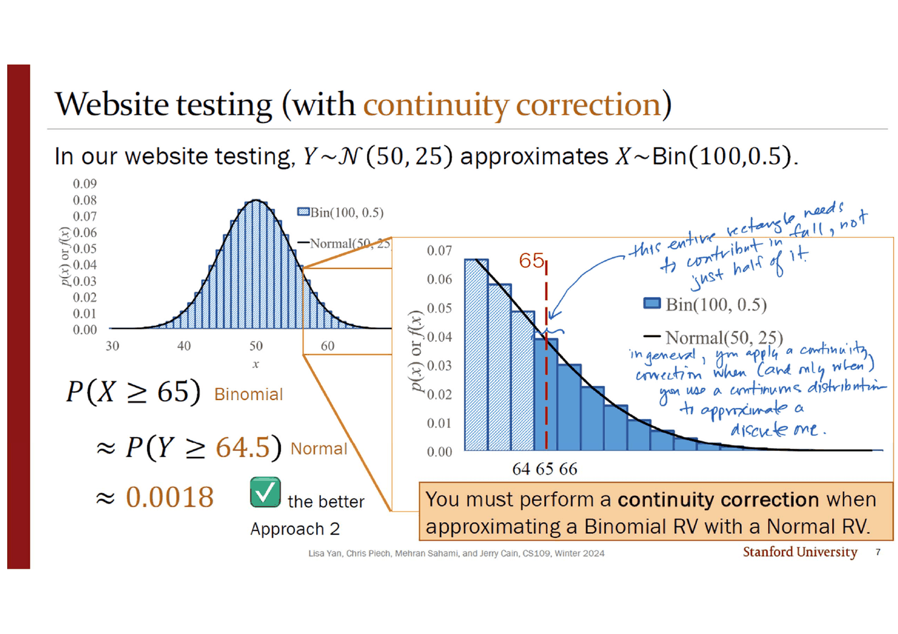
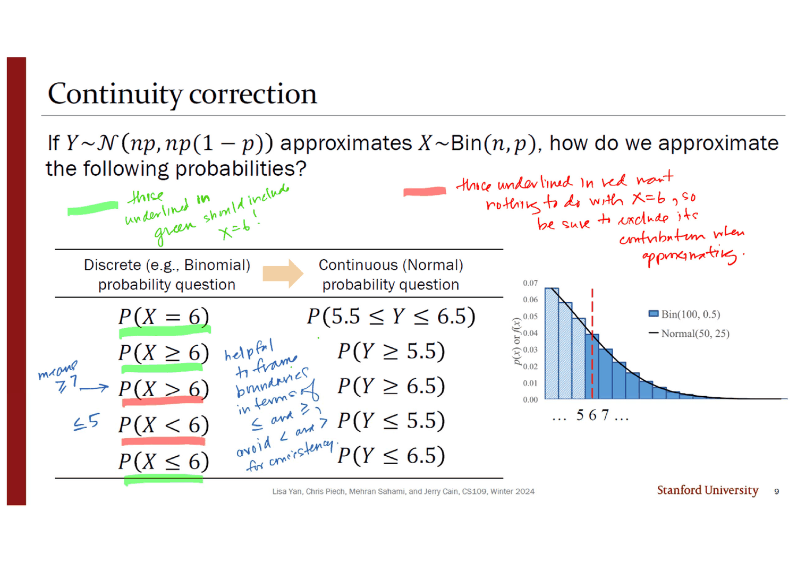
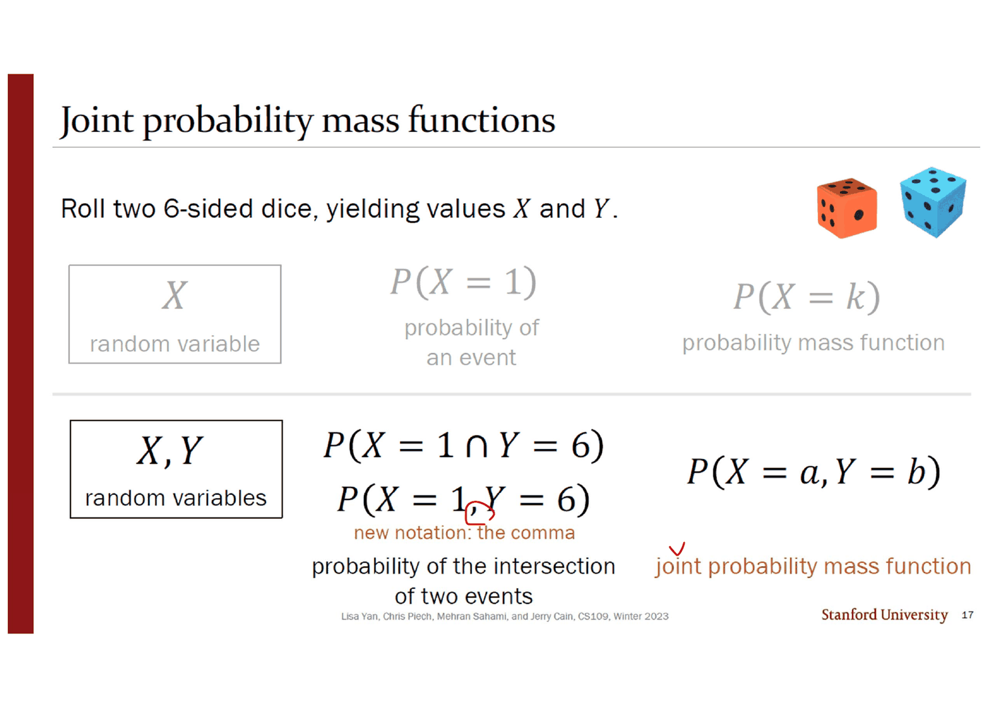
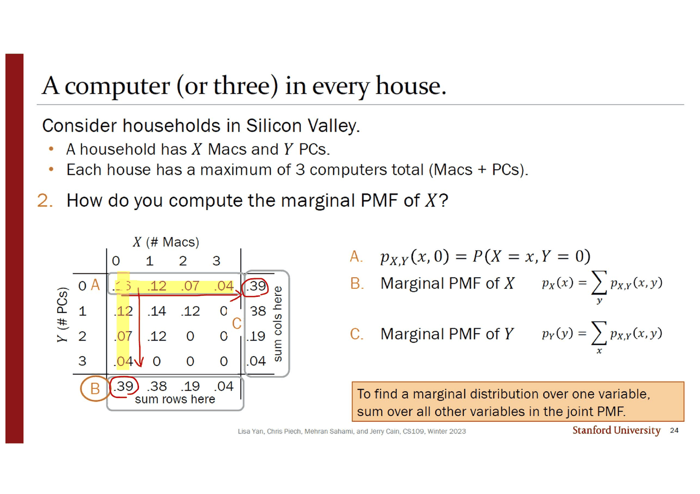
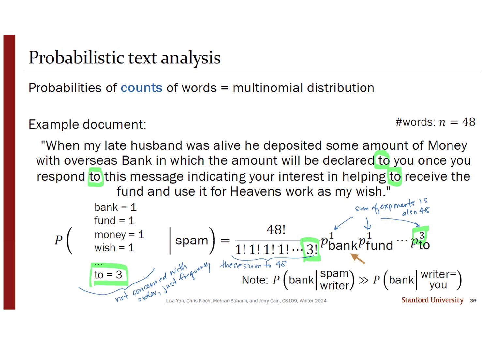
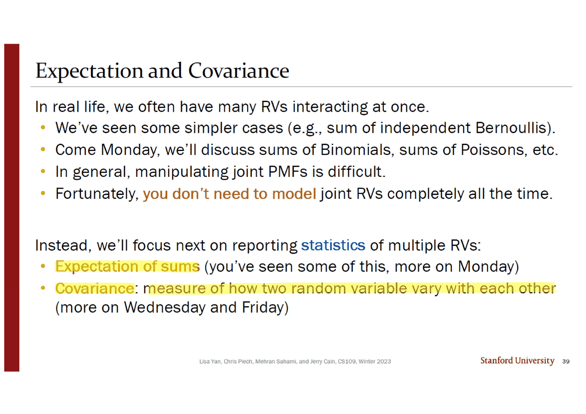

> [!abstract] 제목이 말하지 않는 것
> 덱의 제목은 **Joint (Multivariate) Distributions** 다. 그런데 표지의 목차를 그대로 읽으면 이렇다 — `2 Normal Approximation`, `14 Discrete Joint RVs`, `27 Multinomial RVs`, `38 Statistics of Two RVs`. **첫 절은 제목과 아무 상관이 없다.** 확률변수 하나를 다른 확률변수 하나로 바꾸는 이야기이고, 결합분포라는 말은 한 번도 나오지 않는다.
>
> 그 절을 「지난 시간 잔여물」로 읽으면 열두 장이 버려진다. 그러지 않는 읽기가 하나 있다. 이 덱은 **「정확히 모형화하지 않는 법」을 두 번 가르친다.** 앞의 열두 장은 다루기 힘든 분포를 다루기 쉬운 분포로 바꾸고(근사), 뒤의 여덟 장은 결합분포 전체를 숫자 두어 개로 바꾼다(통계량). 두 절은 같은 동작의 두 규모다.
>
> 그리고 그 사이, 14번부터 26번까지 열세 장 동안 **확률표**가 세워진다. 정확하게, 칸 하나하나. 덱이 이 자료에서 유일하게 「완전히」 적어 보이는 대상이고, **가장 빨리 무너지는 대상**이기도 하다. 35번 슬라이드에서 영어 단어 988,968개짜리 표를 들이밀 때 이미 끝났고, 39번은 그것을 문장으로 확인한다 — *"you don't need to model joint RVs completely all the time."*

---

## 덱의 실제 골격

목차가 네 절을 약속하고 네 절이 모두 약속한 번호에 정확히 나타난다(2·14·27·38번). 앞선 07·09번 덱이 번호를 어긋나게 인쇄했던 것과 다르다. 그런데 **네 절을 일렬로 읽으면 흐름이 끊긴다.** 대신 두 갈래로 접으면 하나로 읽힌다.

```mermaid
flowchart TB
    Q["다루기 힘든 확률 대상"]
    Q --> A["① 분포 하나를 통째로 바꾼다<br/>슬라이드 2~13"]
    Q --> B["② 결합분포를 안 만든다<br/>슬라이드 38~41"]

    A --> A1["Bin(100, 0.5) → N(50, 25)"]
    A1 --> A2["대가: 이산이 연속이 된다<br/>→ 연속성 보정 ±0.5"]
    A2 --> A3["자격 심사: n>20, np(1−p)>10"]

    B --> B1["E[X+Y] = E[X] + E[Y]<br/>(41번에서 증명)"]
    B --> B2["Cov(X, Y)<br/>(수·금요일로 미룸)"]

    M["그 사이: 확률표를 정확히 세운다<br/>슬라이드 14~37"]
    Q -.-> M
    M --> M1["4×4 격자 · 질문 셋"]
    M1 --> M2["차원이 늘면 칸이 폭발한다<br/>988,968개 단어"]
    M2 --> B

    style Q fill:transparent,stroke:var(--border)
    style M fill:transparent,stroke:var(--chart-1),stroke-width:2px
    style M2 fill:transparent,stroke:var(--chart-1),stroke-width:2px
    style B fill:transparent,stroke:var(--chart-2),stroke-width:2px
```

아래는 이 순서를 따라간다. 근사 → 표 → 표의 붕괴 → 통계량.

---

## 첫 번째 포기 — 이산을 연속으로 바꾸고 0.5를 낸다

### 문제는 계산 가능한데도 근사한다

4번 슬라이드의 설정은 이렇다. 새 웹사이트 디자인을 100명에게 보여 주고, 체류 시간이 늘어난 사람 수를 $X$ 라 한다. PM은 디자인에 효과가 없다고 보아 각 사람이 독립적으로 $P(\text{stickier}) = 0.5$ 라 가정한다. CEO는 $X \ge 65$ 여야 디자인을 승인한다.

$$X \sim \text{Bin}(n = 100,\ p = 0.5), \qquad P(X \ge 65) = \sum_{i=65}^{100}\binom{100}{i}0.5^{\,i}(1-0.5)^{100-i}$$

주목할 점은 **이 합이 계산 불가능하지 않다는 것**이다. 항이 36개뿐이다. 6번 슬라이드 오른쪽 위에 붙은 파이썬 세션이 그 값을 그대로 보여 준다.

```text
jerry$ python
>>> from scipy.stats import binom, norm
>>> binom.pmf(range(65, 101), n, p).sum()
0.001758820861485058
>>> 1 - norm(50, 5).cdf(65)
0.0013498980316301035
```

그런데 문제는 *"Give a numerical approximation"* 을 이탤릭으로 요구한다. 즉 **정확한 값을 얻을 수 있는 자리에서 근사를 시킨다.** 근사가 계산의 마지막 수단이 아니라 별도의 기술이라는 선언이고, 덱 전체의 태도이기도 하다.

### 「뭔가 중요한 걸 빠뜨렸다」

6번 슬라이드는 두 접근을 나란히 놓고 끝에 노란 경고 표시 둘과 함께 이렇게 적는다 — *"(this approach is missing something important)"*. 정규 근사가 내놓은 0.0013과 이항의 0.0018은 **1.3배 차이**다.

빠뜨린 것은 7번 슬라이드에 있다.



확대된 그림에서 빨간 점선이 $x = 65$ 를 지나는데, **65번 직사각형의 한가운데를 지난다.** 이산 확률변수의 막대는 정수 위에 중심을 두고 폭 1로 서 있으므로, $x=65$ 에서 자르면 65의 확률 절반이 잘려 나간다. 여백의 잉크가 그 화살표 끝에 정확히 이렇게 적어 두었다.

> *this entire rectangle needs to contribute in full, not just half of it.*

그래서 $P(X \ge 65) \approx P(Y \ge 64.5)$ 가 된다. 잉크는 한 칸 아래에 적용 조건도 남겼다 — *"in general, you apply a continuity correction when (and only when) you use a continuous distribution to approximate a discrete one."* 괄호 안의 **and only when** 이 이 문장의 값이다. 연속끼리의 근사에는 보정이 없다.

### 보정이 실제로 얼마나 버는가

아래는 원본의 $\text{Bin}(100, 0.5)$ 와 $\mathcal N(50, 25)$ 를 그대로 쓴다. 막대와 곡선의 값, 세 가지 꼬리확률은 전부 파이썬으로 미리 계산해 6번 슬라이드의 인쇄값(0.0018 / 0.0013)과 대조한 것이다.

```html preview
<div id="cc-app" style="font-family:system-ui,-apple-system,sans-serif;color:var(--foreground);background:var(--card);border:1px solid var(--border);border-radius:12px;padding:18px 16px;">
  <div style="display:flex;flex-wrap:wrap;gap:12px;align-items:center;margin-bottom:12px;">
    <label style="font-size:13px;font-weight:600;">기준값 k</label>
    <input id="cc-k" type="range" min="52" max="70" value="65" step="1" style="flex:1;min-width:180px;accent-color:var(--chart-1);">
    <output id="cc-kv" style="font-variant-numeric:tabular-nums;font-weight:700;font-size:15px;min-width:2.2em;">65</output>
  </div>
  <svg id="cc-svg" viewBox="0 0 620 260" style="width:100%;height:auto;display:block;"></svg>
  <div id="cc-rows" style="margin-top:12px;display:grid;grid-template-columns:1fr auto auto;gap:6px 12px;font-size:13px;font-variant-numeric:tabular-nums;"></div>
  <p id="cc-note" style="margin:12px 0 0;font-size:12px;line-height:1.6;color:var(--muted-foreground);"></p>
</div>
<script>
(function(){
  const PMF=[0.000023,0.000052,0.000113,0.000232,0.000458,0.000864,0.001560,0.002698,0.004473,0.007111,0.010844,0.015869,0.022292,0.030069,0.038953,0.048474,0.057958,0.066590,0.073527,0.078029,0.079589,0.078029,0.073527,0.066590,0.057958,0.048474,0.038953,0.030069,0.022292,0.015869,0.010844,0.007111,0.004473,0.002698,0.001560,0.000864,0.000458,0.000232,0.000113,0.000052,0.000023];
  const PDF=[0.000027,0.000058,0.000122,0.000246,0.000477,0.000886,0.001583,0.002717,0.004479,0.007095,0.010798,0.015790,0.022184,0.029945,0.038837,0.048394,0.057938,0.066645,0.073654,0.078209,0.079788,0.078209,0.073654,0.066645,0.057938,0.048394,0.038837,0.029945,0.022184,0.015790,0.010798,0.007095,0.004479,0.002717,0.001583,0.000886,0.000477,0.000246,0.000122,0.000058,0.000027];
  // [k, 이항 정확값, 보정 없는 정규, 보정한 정규] — 파이썬으로 계산해 검증
  const T=[[52,0.382177,0.344578,0.382089],[53,0.308650,0.274253,0.308538],[54,0.242059,0.211855,0.241964],[55,0.184101,0.158655,0.184060],[56,0.135627,0.115070,0.135666],[57,0.096674,0.080757,0.096800],[58,0.066605,0.054799,0.066807],[59,0.044313,0.035930,0.044565],[60,0.028444,0.022750,0.028717],[61,0.017600,0.013903,0.017864],[62,0.010489,0.008198,0.010724],[63,0.006016,0.004661,0.006210],[64,0.003319,0.002555,0.003467],[65,0.001759,0.001350,0.001866],[66,0.000895,0.000687,0.000968],[67,0.000437,0.000337,0.000483],[68,0.000204,0.000159,0.000233],[69,0.000092,0.000072,0.000108],[70,0.000039,0.000032,0.000048]];
  const K0=30,L=52,R=76,B=214,TOP=16,ymax=0.085;
  const svg=document.getElementById('cc-svg');
  const X=k=>L+(k-K0+0.5)*(R-L===0?0:1)*0;
  const sx=k=>L+(k-K0)*(556/40), sy=v=>B-(v/ymax)*(B-TOP);
  const NS='http://www.w3.org/2000/svg';
  function el(n,a){const e=document.createElementNS(NS,n);for(const k in a)e.setAttribute(k,a[k]);return e;}
  function draw(k){
    svg.textContent='';
    svg.appendChild(el('line',{x1:L,y1:B,x2:592,y2:B,stroke:'var(--border)','stroke-width':1}));
    const bw=556/40*0.86;
    for(let i=0;i<PMF.length;i++){
      const kk=K0+i, inTail=kk>=k;
      svg.appendChild(el('rect',{x:sx(kk)-bw/2,y:sy(PMF[i]),width:bw,height:B-sy(PMF[i]),
        fill:inTail?'var(--chart-1)':'var(--muted-foreground)',opacity:inTail?0.85:0.22}));
    }
    let d='';
    for(let i=0;i<PDF.length;i++) d+=(i?'L':'M')+sx(K0+i).toFixed(1)+','+sy(PDF[i]).toFixed(1);
    svg.appendChild(el('path',{d:d,fill:'none',stroke:'var(--foreground)','stroke-width':1.6,opacity:0.75}));
    svg.appendChild(el('line',{x1:sx(k),y1:TOP,x2:sx(k),y2:B,stroke:'var(--chart-1)','stroke-width':1.8}));
    svg.appendChild(el('line',{x1:sx(k-0.5),y1:TOP,x2:sx(k-0.5),y2:B,stroke:'var(--chart-2)','stroke-width':1.8,'stroke-dasharray':'5 4'}));
    for(const t of [30,40,50,60,70]){
      const tx=el('text',{x:sx(t),y:B+18,'text-anchor':'middle','font-size':11,fill:'var(--muted-foreground)'});
      tx.textContent=t; svg.appendChild(tx);
    }
    const l1=el('text',{x:sx(k)+5,y:TOP+12,'font-size':11,fill:'var(--chart-1)','font-weight':600});
    l1.textContent='k='+k; svg.appendChild(l1);
    const l2=el('text',{x:sx(k-0.5)-5,y:TOP+28,'font-size':11,fill:'var(--chart-2)','text-anchor':'end','font-weight':600});
    l2.textContent='k−0.5'; svg.appendChild(l2);
  }
  const fmt=v=>v<0.001?v.toExponential(2):v.toFixed(5);
  function rows(r){
    const [k,ex,no,cc]=r;
    const eNo=100*(no-ex)/ex, eCc=100*(cc-ex)/ex;
    const cell=(t,c)=>'<div style="color:'+(c||'var(--foreground)')+'">'+t+'</div>';
    document.getElementById('cc-rows').innerHTML=
      cell('<b>이항 정확값</b>  P(X ≥ '+k+')')+cell('<b>'+fmt(ex)+'</b>')+cell('—','var(--muted-foreground)')+
      cell('정규 근사, 보정 없음  P(Y ≥ '+k+')')+cell(fmt(no))+cell((eNo>0?'+':'')+eNo.toFixed(1)+'%','var(--muted-foreground)')+
      cell('정규 근사, <b>보정</b>  P(Y ≥ '+(k-0.5)+')','var(--chart-2)')+cell(fmt(cc),'var(--chart-2)')+cell((eCc>0?'+':'')+eCc.toFixed(1)+'%','var(--chart-2)');
    const win=Math.abs(eCc)<Math.abs(eNo);
    document.getElementById('cc-note').innerHTML= k===65
      ? '원본 6·7번 슬라이드의 자리다. 보정 없이는 오차 −23.2%, 보정하면 +6.1%.'
      : (win? '이 자리에서는 보정이 유리하다 (상대오차 '+Math.abs(eCc).toFixed(1)+'% 대 '+Math.abs(eNo).toFixed(1)+'%).'
            : '⚠ 이 자리에서는 <b>보정하지 않은 쪽이 상대오차가 작다</b> ('+Math.abs(eNo).toFixed(1)+'% 대 '+Math.abs(eCc).toFixed(1)+'%). 원본에는 없는 관찰이다.');
  }
  function upd(){
    const k=+document.getElementById('cc-k').value;
    document.getElementById('cc-kv').textContent=k;
    draw(k); rows(T[k-52]);
  }
  document.getElementById('cc-k').addEventListener('input',upd); upd();
})();
</script>
```

슬라이더를 오른쪽으로 끝까지 밀면 원본이 말하지 않는 것이 하나 보인다. $k = 69$ 까지는 보정한 쪽의 상대오차가 작지만 **$k = 70$ 에서 뒤집힌다**(보정 없음 19.3% 대 보정 22.5%). 꼬리로 갈수록 정규 근사 자체가 확률을 과소평가하고 보정이 그 과소평가를 과보정하기 때문이다. 원본은 「보정하라」만 말하고 이 교차점은 다루지 않는다.

> [!note] 이 문단은 원본에 없는 보충이다
> 교차점 계산은 이 정리를 쓰면서 직접 한 것이다. 원본 11번 슬라이드가 제시하는 **적용 자격**($np(1-p) > 10$)은 분포 전체에 대한 조건이지 「꼬리의 어디까지」에 대한 조건이 아니다. 원본을 그대로 따르면 $k=70$ 에서도 보정이 지시된다.

### 여덟 줄에 담긴 번역표

9번 슬라이드는 이산의 질문을 연속의 질문으로 옮기는 다섯 줄짜리 대응표다. 인쇄물은 다섯 줄을 그냥 나열하지만 **잉크가 그것을 두 색으로 갈라 놓았다.**



| 이산 질문 | 연속 질문 | 잉크의 색 | 잉크가 붙인 이유 |
| --- | --- | --- | --- |
| $P(X = 6)$ | $P(5.5 \le Y \le 6.5)$ | 초록 | $X=6$ 을 **포함**해야 한다 |
| $P(X \ge 6)$ | $P(Y \ge 5.5)$ | 초록 | 같음 |
| $P(X > 6)$ | $P(Y \ge 6.5)$ | 빨강 | $X=6$ 과 **무관**하므로 그 기여를 빼야 한다 |
| $P(X < 6)$ | $P(Y \le 5.5)$ | 빨강 | 같음 |
| $P(X \le 6)$ | $P(Y \le 6.5)$ | 초록 | $X=6$ 을 포함 |

잉크의 주석 두 줄이 규칙 전체를 두 문장으로 줄인다 — 초록은 *"should include X=6!"*, 빨강은 *"want nothing to do with X=6, so be sure to exclude its contribution when approximating."* **6.5로 갈지 5.5로 갈지는 부등호 모양이 아니라 「6이 들어오느냐」가 정한다.** 왼쪽 여백에는 그것을 정수로 다시 쓴 메모가 있다 — $P(X>6)$ 옆에 `means ≥7`, $P(X<6)$ 옆에 `≤5`. 그리고 가운데에 실무 조언 하나 — *"helpful to frame boundaries in terms of ≤ and ≥, avoid < and > for consistency."*

### 누가 근사할 자격이 있는가

10번 슬라이드는 $\text{Bin}(n,p)$ 에서 화살표 두 개를 내리고 그 사이에 물음표 하나만 찍고 끝난다. 답은 11번에 있고, 잉크가 조건마다 빨간 밑줄을 그었다.

| | 포아송 근사 | 정규 근사 |
| --- | --- | --- |
| 모수 | $\lambda = np$ | $\mu = np$, $\sigma^2 = np(1-p)$ |
| $n$ | 크다 ($> 20$) | 크다 ($> 20$) |
| $p$ | **작다** ($< 0.05$) | **중간** ($np(1-p) > 10$) |
| 독립성 | 약한 종속 허용 | 독립 필요 |

그림의 예시가 조건을 그대로 보여 준다. 왼쪽은 $\text{Bin}(100, 0.04)$ — $np(1-p) = 3.84$ 라 정규 근사의 자격 미달이고 실제로 주황 막대(정규)가 파랑(이항)과 어긋난다. 오른쪽은 $\text{Bin}(100, 0.5)$ — $np(1-p) = 25$ 로 정규는 맞아떨어지고 회색 막대(포아송)가 크게 벌어진다. 슬라이드 아래 주황 상자가 결론 둘을 못 박는다.

1. 선택지가 있으면 **정규**를 쓴다.
2. 정규로 이산을 근사하면 **연속성 보정**을 한다.

### 인쇄된 숫자만 따라가면 답이 다르다

13번 슬라이드가 첫 절을 실전 문제로 닫는다. 스탠퍼드가 2,480명을 합격시키고, 각자 독립적으로 $p = 0.68$ 로 등록하며, $X$ 는 실제 등록자 수다. $P(X > 1745)$ 를 구한다.

전략 선택지 네 개 중 A(그냥 이항)는 *"computationally expensive (also not an approximation)"*, B(포아송)는 *"p = 0.68, not small enough"*, C(정규)는 $np(1-p) = 540 > 10$ 으로 통과한다. 그리고 $P(X > 1745)$ 는 **엄격 부등호**이므로 9번 표의 세 번째 줄 — $P(Y \ge 1745.5)$ 다.

여기서 인쇄된 수를 그대로 따라가면 걸린다.

> [!warning] 원본 오류 — 13번 슬라이드의 중간값이 최종값과 맞지 않는다
> 슬라이드는 $E[X] = np = \mathbf{1686}$, $\sigma = \mathbf{23.3}$ 으로 인쇄하고, 다음 줄에서 $1 - \Phi\!\left(\frac{1745.5 - 1686}{23.3}\right) = 1 - \Phi(\mathbf{2.54}) \approx 0.0055$ 라고 쓴다. 그런데
> $$\frac{1745.5 - 1686}{23.3} = 2.5536\ldots \;\to\; \mathbf{2.55}$$
> 이고 $1 - \Phi(2.55) = 0.005386 \to \mathbf{0.0054}$ 다. 인쇄된 2.54는 **반올림하지 않은 값**으로 계산한 것이다 — $np = 2480 \times 0.68 = 1686.4$, $\sigma = \sqrt{539.648} = 23.2303$ 을 쓰면 $z = 2.5441 \to 2.54$, $1 - \Phi = 0.005477 \to 0.0055$ 로 최종값이 맞는다.
>
> 즉 **최종 답 0.0055는 옳고 중간에 보이는 숫자만 손실된 것**인데, 슬라이드는 반올림한 값으로 나눗셈을 적어 놓아 학생이 따라가면 한 자리가 달라진다. 이항의 정확값은 $P(X > 1745) = 0.005249$ 이다(직접 계산).

---

## 두 번째 대상 — 쉼표 하나

14번 슬라이드에서 절이 바뀌고, 15번이 지난 덱의 농구 사진을 다시 꺼낸다. $P(A_W > A_B)$ — 워리어스의 득점이 레이커스보다 클 확률. 오른쪽에 한 줄 — *"This is a probability of an event involving **two** random variables!"* 지난 덱이 답을 내지 못하고 남긴 자리다.

그리고 16·17번이 그 자리를 채우는데, **새로 도입하는 것이 쉼표 하나뿐이다.**



16번은 위 칸만 인쇄하고(확률변수 하나 · 사건의 확률 · PMF), 17번이 아래 칸을 켠다. 그리고 두 줄을 나란히 놓는다.

$$P(X = 1 \cap Y = 6) \qquad\qquad P(X = 1,\, Y = 6)$$

슬라이드가 쉼표에 직접 주석을 단다 — *"new notation: the comma"*. 잉크도 그 쉼표에 빨간 동그라미를 쳤다. **교집합 기호가 쉼표로 바뀐 것뿐이고 의미는 전혀 새롭지 않다.** 결합 PMF는 정의상

$$p_{X,Y}(a, b) = P(X = a,\, Y = b)$$

이고, 18번이 여기서 **주변분포(marginal distribution)** 를 꺼낸다. 잉크가 이 단어에만 별표와 밑줄을 쳤다.

$$p_X(a) = P(X = a) = \sum_y p_{X,Y}(a, y), \qquad p_Y(b) = P(Y = b) = \sum_x p_{X,Y}(x, b)$$

주황 상자의 한 줄이 이 연산의 용도를 정리한다 — *"Use marginal distributions to extract a 1D RV from a joint PMF."* **결합에서 하나를 빼내려면 나머지를 전부 더한다.** 이 한 문장이 남은 절 전체를 지배한다.

19·20번의 주사위 두 개는 그 정의를 가장 단순한 자리에서 확인한다. $p_{X,Y}(a,b) = 1/36$ 이고, 주변분포는

$$p_X(a) = \sum_{y=1}^{6}\frac{1}{36} = \frac{6}{36} = \frac16$$

으로 원래의 주사위 하나가 되돌아온다. 19번 오른쪽의 주황 상자가 자료형의 이름을 붙인다 — **확률표(probability table)**: 여러 이산 확률변수의 모든 가능한 결과를 적은 것이고, $\text{Ber}(p)$ 의 $p$ 같은 **모수가 없다**(*not parametric*).

---

## 표를 만든다 — 실리콘밸리의 네 칸 × 네 칸

21번부터 26번까지가 이 덱에서 가장 오래 머무는 자리다. 설정은 한 줄이다.

- 실리콘밸리의 가구를 생각한다. 어떤 가구는 맥 $X$ 대, PC $Y$ 대를 가진다.
- 각 가구의 컴퓨터는 **최대 3대**(맥 + PC)다.

### 질문 1 — 빈칸 하나

21번은 $(X{=}1, Y{=}0)$ 칸을 `?` 로 비우고 묻는다. 22번이 답을 주는데, 방법은 **결합 PMF의 합이 1이라는 것 하나뿐**이다.

$$\sum_x\sum_y p_{X,Y}(x, y) = 1 \;\Longrightarrow\; p_{X,Y}(1, 0) = 1 - 0.88 = \mathbf{0.12}$$

21번 여백의 잉크가 이 표에 대해 중요한 경고를 남긴다.

> *the symmetry about the diagonal here is a coincidence, not a requirement.*

실제로 이 표는 대각선 대칭이다. 그래서 $X$ 의 주변분포와 $Y$ 의 주변분포가 **숫자까지 똑같이** $(0.39, 0.38, 0.19, 0.04)$ 로 나온다. 24번 슬라이드가 두 주변분포를 나란히 인쇄하는데, 값이 같으니 한쪽을 다른 쪽으로 착각하기 딱 좋다. 잉크는 그 함정을 미리 막았다.

### 질문 2·3 — 주변분포와 합

아래에서 직접 눌러 볼 수 있다. 표의 값은 22번 슬라이드 그대로이고, 주변분포와 $P(C=3)$ 은 그 값에서 계산해 24·26번의 인쇄값과 대조했다.

```html preview
<div id="jt-app" style="font-family:system-ui,-apple-system,sans-serif;color:var(--foreground);background:var(--card);border:1px solid var(--border);border-radius:12px;padding:18px 16px;">
  <div style="display:flex;flex-wrap:wrap;gap:8px;margin-bottom:14px;">
    <button class="jt-b" data-m="none">표만 보기</button>
    <button class="jt-b" data-m="px">주변분포 p<sub>X</sub> (열을 세로로 더한다)</button>
    <button class="jt-b" data-m="py">주변분포 p<sub>Y</sub> (행을 가로로 더한다)</button>
    <button class="jt-b" data-m="sum">C = X + Y = 3</button>
  </div>
  <div style="overflow-x:auto;"><table id="jt-t" style="border-collapse:collapse;font-variant-numeric:tabular-nums;font-size:14px;min-width:340px;"></table></div>
  <p id="jt-msg" style="margin:14px 0 0;font-size:13px;line-height:1.7;min-height:3.4em;"></p>
</div>
<style>
#jt-app .jt-b{font:inherit;font-size:12.5px;padding:6px 11px;border-radius:7px;cursor:pointer;
  border:1px solid var(--border);background:transparent;color:var(--muted-foreground);}
#jt-app .jt-b[aria-pressed="true"]{border-color:var(--chart-1);color:var(--chart-1);font-weight:600;}
#jt-app td,#jt-app th{border:1px solid var(--border);padding:7px 12px;text-align:center;}
#jt-app th{font-weight:600;color:var(--muted-foreground);font-size:12.5px;border:none;}
</style>
<script>
(function(){
  // 22번 슬라이드의 결합 PMF. 행 = Y(PC 수), 열 = X(맥 수)
  const P=[[0.16,0.12,0.07,0.04],[0.12,0.14,0.12,0],[0.07,0.12,0,0],[0.04,0,0,0]];
  const pX=[0,1,2,3].map(x=>P.reduce((s,r)=>s+r[x],0));
  const pY=P.map(r=>r.reduce((s,v)=>s+v,0));
  const tbl=document.getElementById('jt-t'), msg=document.getElementById('jt-msg');
  let mode='none';
  const f=v=>v===0?'0':v.toFixed(2).replace(/^0/,'');
  function render(){
    let h='<tr><th></th><th></th><th colspan="4" style="padding-bottom:2px;">X (맥 수)</th><th></th></tr>';
    h+='<tr><th></th><th></th>'+[0,1,2,3].map(x=>'<th>'+x+'</th>').join('')+'<th style="padding-left:14px;">p<sub>Y</sub>(y)</th></tr>';
    for(let y=0;y<4;y++){
      h+='<tr>'+(y===0?'<th rowspan="4" style="writing-mode:vertical-rl;transform:rotate(180deg);">Y (PC 수)</th>':'')+'<th>'+y+'</th>';
      for(let x=0;x<4;x++){
        let bg='transparent',fg='var(--foreground)',w='400';
        if(mode==='px'){ bg='color-mix(in srgb, var(--chart-1) 14%, transparent)'; }
        if(mode==='py'){ bg='color-mix(in srgb, var(--chart-2) 14%, transparent)'; }
        if(mode==='sum'){ if(x+y===3){bg='color-mix(in srgb, var(--chart-1) 26%, transparent)';w='700';} else {fg='var(--muted-foreground)';} }
        h+='<td style="background:'+bg+';color:'+fg+';font-weight:'+w+'">'+f(P[y][x])+'</td>';
      }
      h+='<td style="border:none;padding-left:14px;color:'+(mode==='py'?'var(--chart-2)':'var(--muted-foreground)')+';font-weight:'+(mode==='py'?'700':'400')+'">'+f(pY[y])+'</td></tr>';
    }
    h+='<tr><th></th><th style="padding-top:12px;">p<sub>X</sub>(x)</th>'+
       [0,1,2,3].map(x=>'<td style="border:none;padding-top:12px;color:'+(mode==='px'?'var(--chart-1)':'var(--muted-foreground)')+';font-weight:'+(mode==='px'?'700':'400')+'">'+f(pX[x])+'</td>').join('')+'<td style="border:none;"></td></tr>';
    tbl.innerHTML=h;
    const M={
      none:'표의 열여섯 칸이 모두 더해 1이 된다 — 그 사실 하나로 21번 슬라이드의 빈칸 <b>.12</b> 가 정해진다. 0이 여섯 칸인 것은 「최대 3대」 제약 때문이다(예: X=2, Y=2 는 4대라 불가능).',
      px:'<b>p<sub>X</sub>(x) = Σ<sub>y</sub> p<sub>X,Y</sub>(x,y)</b> — 한 열을 세로로 더한다. 결과는 (.39, .38, .19, .04) 이고, 24번 슬라이드가 표 아래에 「sum rows here」로 적어 둔 줄이다.',
      py:'<b>p<sub>Y</sub>(y) = Σ<sub>x</sub> p<sub>X,Y</sub>(x,y)</b> — 한 행을 가로로 더한다. 결과가 p<sub>X</sub> 와 숫자까지 같은 것은 <b>표가 대각선 대칭이기 때문이며 우연이다</b>(21번 여백의 잉크). 24번 슬라이드에서 이 열의 두 번째 값은 소수점이 빠진 채 <code>38</code> 로 인쇄되어 있다.',
      sum:'<b>P(C = 3) = .04 + .12 + .12 + .04 = .32</b> — 26번 슬라이드가 「전확률의 법칙」이라 부르며 네 칸을 짚는다. 실제로는 X+Y=3 인 반대각선의 칸을 모으는 것이고, 조건부확률들은 전부 0 아니면 1이다.'
    };
    msg.innerHTML=M[mode];
    document.querySelectorAll('#jt-app .jt-b').forEach(b=>b.setAttribute('aria-pressed', b.dataset.m===mode));
  }
  document.querySelectorAll('#jt-app .jt-b').forEach(b=>b.addEventListener('click',()=>{mode=b.dataset.m;render();}));
  render();
})();
</script>
```

24번 슬라이드는 주변분포를 구하는 방법을 세 선택지로 묻고, 주황 상자가 답을 요약한다 — *"To find a marginal distribution over one variable, sum over all other variables in the joint PMF."*



> [!warning] 원본 오류 — 24번 슬라이드의 `38`
> 표 오른쪽 `sum cols here` 열의 네 값은 위에서부터 `.39`, **`38`**, `.19`, `.04` 로 인쇄되어 있다. 두 번째 값만 **소수점이 빠졌다.** 300 dpi로 다시 렌더해 확인했다. 아래쪽 `sum rows here` 줄의 대응값은 `.38` 로 제대로 찍혀 있어, 같은 수가 한 슬라이드 안에서 두 가지로 인쇄된 셈이다.

26번의 세 번째 질문은 $C = X + Y$ 를 정의하고 $P(C = 3)$ 을 묻는다. 계산은 반대각선 네 칸의 합 $0.04 + 0.12 + 0.12 + 0.04 = 0.32$ 인데, 슬라이드는 이것을 전확률의 법칙으로 유도한다.

$$P(C=3) = \sum_x\sum_y P(X+Y=3 \mid X=x, Y=y)\,P(X=x, Y=y)$$

조건부확률이 전부 0 또는 1이라 결국 네 칸만 남는다. 그리고 주황 상자가 넘긴다 — *"We'll come back to sums of RVs next lecture!"* **이 덱은 두 확률변수의 합을 정의만 하고 계산법은 다음 덱으로 미룬다.**

---

## 표가 부서지는 자리

27번에서 절이 바뀌고 28~34번이 다항분포를 세운다. 구조가 깔끔하다 — **세기(counting)를 한 번, 확률을 한 번, 같은 자리에서 일반화한다.**

| | 두 무리 | $r$ 무리 |
| --- | --- | --- |
| **세기** (29번) | $\dbinom{n}{k} = \dfrac{n!}{k!\,(n-k)!}$ | $\dbinom{n}{n_1, n_2, \ldots, n_r} = \dfrac{n!}{n_1!\,n_2!\cdots n_r!}$ |
| **확률** (30번) | $P(X=k) = \dbinom{n}{k}p^k(1-p)^{n-k}$ | $P(X_1{=}c_1, \ldots, X_m{=}c_m) = \dbinom{n}{c_1, \ldots, c_m}p_1^{c_1}\cdots p_m^{c_m}$ |

29번 위쪽에 잉크가 그림을 그려 넣었다 — 왼쪽에는 동그라미 둘에 $k$, $n{-}k$, 오른쪽에는 동그라미 셋에 $n_1$, $n_2$, $\cdots$, $n_r$. **이항계수가 「두 칸짜리 다항계수」임을 그림 하나로 보인다.** 29번 아래의 농담(*"Called the binomial coefficient because of something from aLgEbRa"*)이 그 관계를 한 번 더 짚는다.

31번의 다항 확률변수 정의는 제약을 두 개 달고 있다.

$$\sum_{i=1}^{m} c_i = n \quad\text{(관측된 횟수의 합)}, \qquad \sum_{i=1}^{m} p_i = 1 \quad\text{(확률의 합)}$$

**두 제약이 서로 다른 대상에 걸린다는 점**이 중요하다. 앞의 것은 표본에, 뒤의 것은 모형에 걸린다.

33·34번의 주사위가 이것을 확인한다. 공정한 6면체를 7번 굴려 1이 한 번, 2가 한 번, 3이 0번, 4가 두 번, 5가 0번, 6이 세 번 나올 확률은

$$\binom{7}{1,1,0,2,0,3}\left(\frac16\right)^{7} = \frac{5040}{1!\,1!\,0!\,2!\,0!\,3!}\left(\frac16\right)^{7} = \frac{5040}{12}\left(\frac16\right)^{7} = 420\left(\frac16\right)^{7} = \frac{35}{23328} \approx 0.0015$$

34번이 각 조각에 이름표를 붙인다 — 다항계수는 *"choose where the sixes appear"*, 거듭제곱의 밑은 *"probability of rolling a six"*, 지수는 *"this many times"*. $0! = 1$ 이라 나오지 않은 눈은 곱에 아무 영향을 주지 않는다.

### 988,968

35번이 규모를 바꾼다.

> 단어의 순서를 무시하면, 영어로 쓴 글에서 각 단어가 나올 확률은? … **단어 개수의 확률 = 다항분포.** 문서 하나가 커다란 다항분포다. (Global Language Monitor에 따르면 인터넷에서 쓰이는 영어 단어는 988,968개다.)

**여기서 확률표가 끝난다.** 19번 슬라이드가 정의한 확률표는 「모든 가능한 결과를 적은 것」이고, 21~26번의 표는 $4 \times 4 = 16$ 칸이었다. 같은 정의를 988,968개 단어에 적용하면 칸의 수는 적을 수도 셀 수도 없다. 그런데 **다항분포는 표를 만들지 않고도 확률을 준다** — 모수 $p_1, \ldots, p_m$ 과 공식 하나면 된다. 19번이 확률표를 두고 「모수적이지 않다(*not parametric*)」고 굳이 밝혀 둔 이유가 여기서 드러난다.



36번은 실제 스팸 메일 한 통을 붙여 놓고 그것을 다항분포로 쓴다. 문서의 단어 수 $n = 48$ 이고,

$$P\!\left(\begin{matrix}\text{bank}=1\\ \text{fund}=1\\ \text{money}=1\\ \text{wish}=1\\ \cdots\\ \text{to}=3\end{matrix}\,\middle|\,\text{spam}\right) = \frac{48!}{1!\,1!\,1!\,1!\cdots 3!}\;p_{\text{bank}}^{1}\,p_{\text{fund}}^{1}\cdots p_{\text{to}}^{3}$$

잉크가 본문에서 `to` 세 개를 초록으로 칠해 세어 보이고, 분모의 `3!` 과 지수의 `3` 에도 같은 초록을 칠해 **세 자리가 같은 수임을 잇는다.** 오른쪽 위에는 검산 두 줄 — *"sum of exponents is also 48"*, 분모 쪽에 *"these sum to 48"*. 31번의 제약 $\sum c_i = n$ 을 실제 문서에서 확인한 것이다. 왼쪽 아래에는 모형의 전제 — *"not concerned with order, just frequency."*

슬라이드 아래 `Note:` 한 줄이 이 모형이 왜 쓸모 있는지를 말한다.

$$P(\text{bank} \mid \text{spam/writer}) \;\gg\; P(\text{bank} \mid \text{writer=you})$$

**같은 단어가 조건에 따라 다른 확률을 갖기 때문에 분류가 가능해진다.** 37번이 이것을 역사 문제로 한 번 더 보인다 — 페더럴리스트 페이퍼스 85편이 「푸블리우스」라는 필명으로 나왔고(실제로는 해밀턴·매디슨·제이), 어느 글을 누가 썼는지를 각 글의 단어 분포와 세 저자의 기존 글의 단어 분포를 비교해 정한다. 그리고 *"You'll love Problem Set 4!"* 로 넘긴다.

---

## 두 번째 포기 — 결합분포를 안 만든다

38번에서 마지막 절이 열리고, 39번이 덱 전체에서 가장 솔직한 슬라이드다.



> - 실제로는 여러 확률변수가 한꺼번에 상호작용한다.
> - 더 간단한 경우는 이미 봤다(독립 베르누이의 합).
> - 월요일에 이항의 합·포아송의 합 등을 다룬다.
> - **일반적으로 결합 PMF를 다루는 일은 어렵다.**
> - 다행히, **결합 확률변수를 항상 완전히 모형화할 필요는 없다.**
>
> 대신 여러 확률변수의 **통계량**을 보고하는 데 집중한다 —
>
> - **합의 기댓값** (일부는 봤고, 월요일에 더)
> - **공분산**: 두 확률변수가 서로 어떻게 함께 변하는지를 재는 값 (수·금요일에 더)

스물다섯 장 동안 세운 표를, 표를 다루는 일이 어렵다는 이유로 내려놓는다. **그리고 대신 무엇을 볼지는 세 줄로만 적고 다음 주로 넘긴다.** 이 덱이 실제로 인쇄해 둔 것은 그중 첫 줄의 절반뿐이다.

40번이 기댓값의 성질 셋을 두 변수로 확장한다.

$$E[aX + bY + c] = aE[X] + bE[Y] + c$$
$$E[X+Y] = E[X] + E[Y]$$
$$E[g(X,Y)] = \sum_x\sum_y g(x,y)\,p_{X,Y}(x,y) \quad \text{(무의식적 통계학자의 법칙)}$$

주황 상자가 결정적인 단서를 붙인다 — *"True for both independent and dependent random variables!"* 그리고 41번이 그중 둘째 줄을 증명한다. 네 줄짜리 증명인데, **주변분포가 증명의 전부**다.

$$
\begin{aligned}
E[X+Y] &= \sum_x\sum_y (x+y)\,p_{X,Y}(x,y) &&\text{LOTUS, } g(X,Y) = X+Y\\
&= \sum_x\sum_y x\,p_{X,Y}(x,y) + \sum_x\sum_y y\,p_{X,Y}(x,y) &&\text{합의 선형성}\\
&= \sum_x x\underbrace{\sum_y p_{X,Y}(x,y)}_{p_X(x)} + \sum_y y\underbrace{\sum_x p_{X,Y}(x,y)}_{p_Y(y)} &&\text{주변 PMF}\\
&= E[X] + E[Y]
\end{aligned}
$$

독립 가정이 **어디에도 들어가지 않는다.** 18번에서 「결합에서 하나를 빼내는 연산」으로 소개된 주변분포가, 스물세 장 뒤에 「결합을 몰라도 되는 이유」로 되돌아온다. 이 덱이 스스로 닫는 유일한 고리다.

> [!tip] 이 덱이 다음으로 넘긴 세 가지
>
> - **확률변수의 합의 분포** — 26번이 「다음 강의」로 명시. → `12_independent_rvs`
> - **공분산의 정의와 계산** — 39번이 「수요일과 금요일」로 명시. → `13_joint_statistics`
> - **페더럴리스트 페이퍼스 저자 판별의 실제 절차** — 37번이 Problem Set 4로 넘김. 단어 분포를 조건부로 비교하는 이 문제는 결국 `23_naive_bayes` 의 형식과 같다.

---

## 원본 오류·불일치

이번 덱에서 확인한 것은 넷이다. 수치는 모두 파이썬으로 재계산했고, 인쇄가 애매한 자리는 300 dpi로 다시 렌더해 판정했다.

`계산·표기`

- **24번 슬라이드 `sum cols here` 열** — 네 값 중 둘째만 소수점이 빠진 `38` 로 인쇄되어 있다(`.39` · `38` · `.19` · `.04`). 같은 수가 같은 슬라이드 아래쪽 `sum rows here` 줄에서는 `.38` 로 제대로 찍혀 있다
- **13번 슬라이드** — 인쇄된 $E[X] = 1686$, $\sigma = 23.3$ 을 그대로 나누면 $z = 2.5536 \to 2.55$ 인데 슬라이드는 $\Phi(2.54)$ 로 넘어간다. 실제 계산은 반올림 전 값($np = 1686.4$, $\sigma = 23.2303$)으로 이뤄졌다. 최종 답 0.0055는 옳지만 **인쇄된 중간값만 따라가면 0.0054가 나온다**
- **7번 슬라이드** — 연속성 보정 결과를 $\approx 0.0018$ 로 적는데, $1 - \Phi\!\left(\frac{64.5-50}{5}\right) = 0.0018658$ 이라 유효숫자 둘로는 **0.0019**다. 인쇄된 0.0018은 이항의 정확값(0.0017588)에 맞춘 반올림으로 보인다. 6번에서 보정 없는 값을 `0.0013` 으로 적은 것은 0.00134990의 반올림으로 정확하다

`덱 구성`

- **다섯 장이 빠졌다** — 인쇄된 마지막 번호는 41인데 PDF는 36쪽이고, 실제로 **8 · 12 · 23 · 25 · 32번**이 없다($41 - 5 = 36$ 으로 정확히 맞는다). 빠진 자리 중 둘은 짝의 한쪽이다 — 21번(`?`)과 22번(답)이 남아 있는 것과 달리 23·25번은 21~26번 문제 묶음 사이에서 사라졌다
- **한 덱 안에 두 해가 섞여 있다** — 21번은 `Winter 2024`, 바로 다음 장인 22번은 `Winter 2023` 이다. 두 장은 **같은 슬라이드의 질문본과 정답본**인데 연도가 다르다. 2024인 것은 3 · 7 · 9 · 21 · 36번 다섯 장이고 나머지는 2023이다. 06·07·09번 덱에서 관찰된 것과 같은 패턴이다
- **5번 슬라이드의 저작권 줄이 왼쪽에서 잘려 있다** — `Sahami, and Jerry Cain, CS109, Winter 2023` 으로 시작해 앞의 `Lisa Yan, Chris Piech, Mehran` 이 없다. 그 자리에 갈턴 보드 아래의 히스토그램 그림이 겹쳐 놓여 있다. 07번 덱에서 proofwiki 캡처가 `ord University` 만 남기고 저작권 줄을 가렸던 것과 같은 종류의 사고다
- **표지에 등사체 목차가 붙어 있다** — 표지 왼쪽 위에 `Table of Contents` 와 네 줄(`2 Normal Approximation` / `14 Discrete Joint RVs` / `27 Multinomial RVs` / `38 Statistics of Two RVs`)이 **덱의 다른 어디에서도 쓰이지 않는 고정폭 글꼴**로 인쇄되어 있다. 슬라이드 디자인의 일부가 아니라 PDF를 만들 때 얹힌 것으로 보인다. 번호는 네 개 모두 실제 절 시작과 일치한다

---

## 근거 자료

- **원본**: `sources/11_joint_rvs.pdf` — 36쪽, 인쇄 번호 1~41(8·12·23·25·32 결번). 표지에 `Jerry Cain, February 2, 2024` 와 `Lecture Discussion on Ed` 링크. 하단 저작권 줄은 `Lisa Yan, Chris Piech, Mehran Sahami, and Jerry Cain, CS109, Winter 2023/2024`
- **본문에 인용한 슬라이드**: 7 · 9 · 17 · 24 · 36 · 39번 (PDF 7 · 8 · 15 · 21 · 31 · 34쪽)
- **재계산한 값**: 이항 꼬리확률 전부(`math.comb` 정확 계산), 정규 꼬리확률(`math.erf`), 다항계수 $\binom{7}{1,1,0,2,0,3} = 420$, 결합표의 총합·두 주변분포·$P(C{=}3)$, 스탠퍼드 입학 문제의 $z$ 값 세 가지와 이항 정확값 0.005249

`직전 덱` → [[10. 정규분포 — 이유 넷을 대고 다음 장에서 셋을 취소한다]] · `다음` → 확률변수의 합(12번 덱)과 공분산(13번 덱)

이 덱의 3번 슬라이드는 앞 덱에 없던 정규분포의 쓸모를 하나 덧붙인다. 10번 덱의 `Why the Normal?`(5번 슬라이드)이 든 이유는 넷 — 자연 현상에 흔하다 · 세상의 잡음은 대개 정규다 · 여러 확률변수의 합에서 자주 나온다 · 표본평균이 정규를 따른다 — 이고 **그중 「이항분포를 근사한다」는 없다.** 이번 덱 3번이 그 다섯째를 꺼내며 *"Also useful for approximating the Binomial random variable!"* 이라 적고, 잉크가 그 줄에 화살표를 그어 *"focus on this for a few slides!"* 라고 예고한다. 같은 슬라이드 위쪽의 「최대 엔트로피」 문장에도 잉크가 붙어 있다 — *"colloquially, this means it commits to the least amount of structure for the given mean and variance."* **두 덱을 잇는 이음매와 그 해설이 모두 인쇄물이 아니라 잉크에 있다.**
