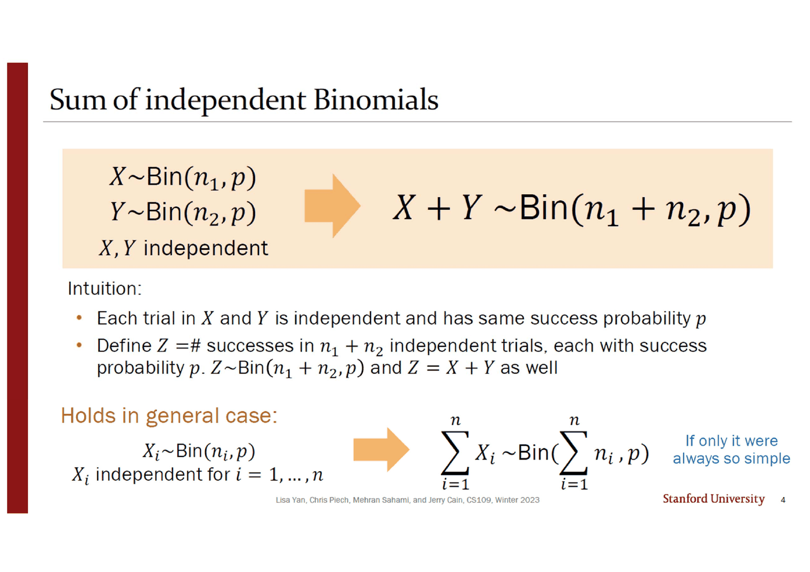
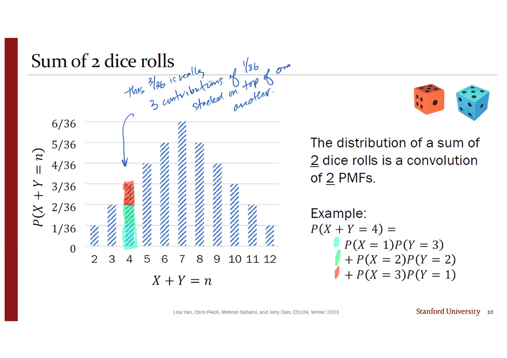
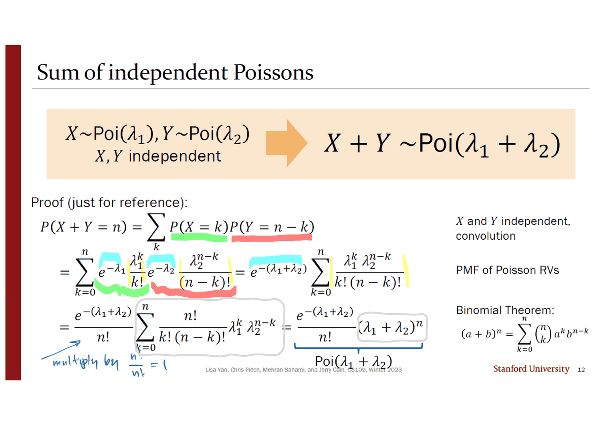
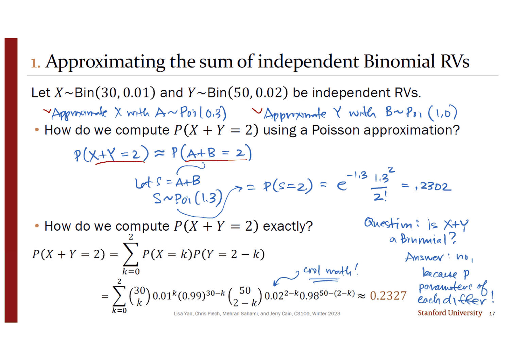
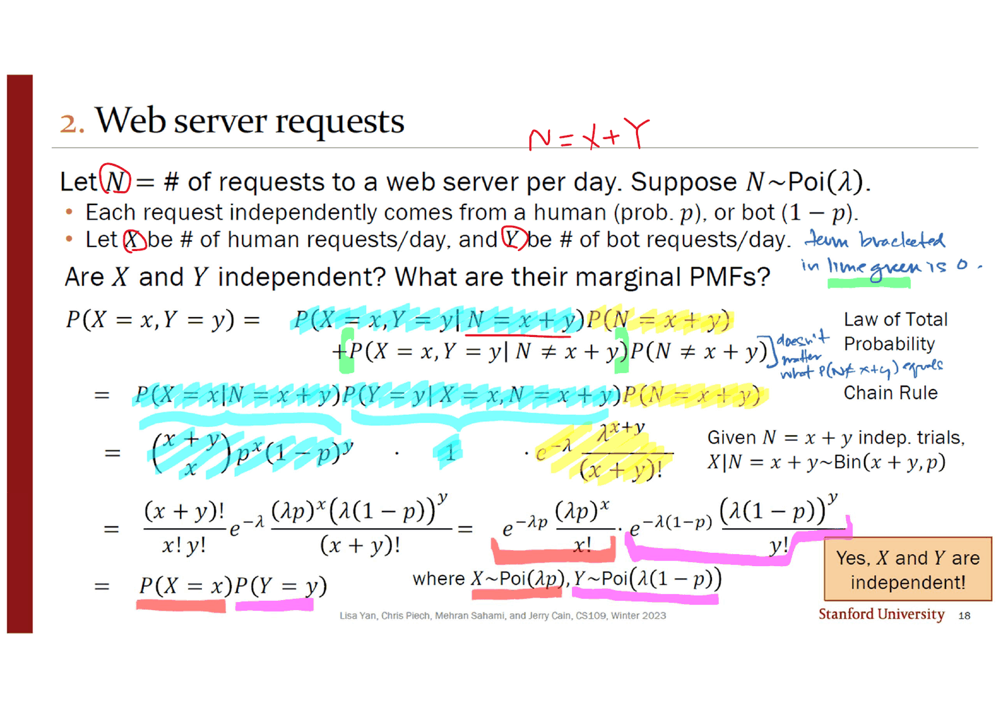
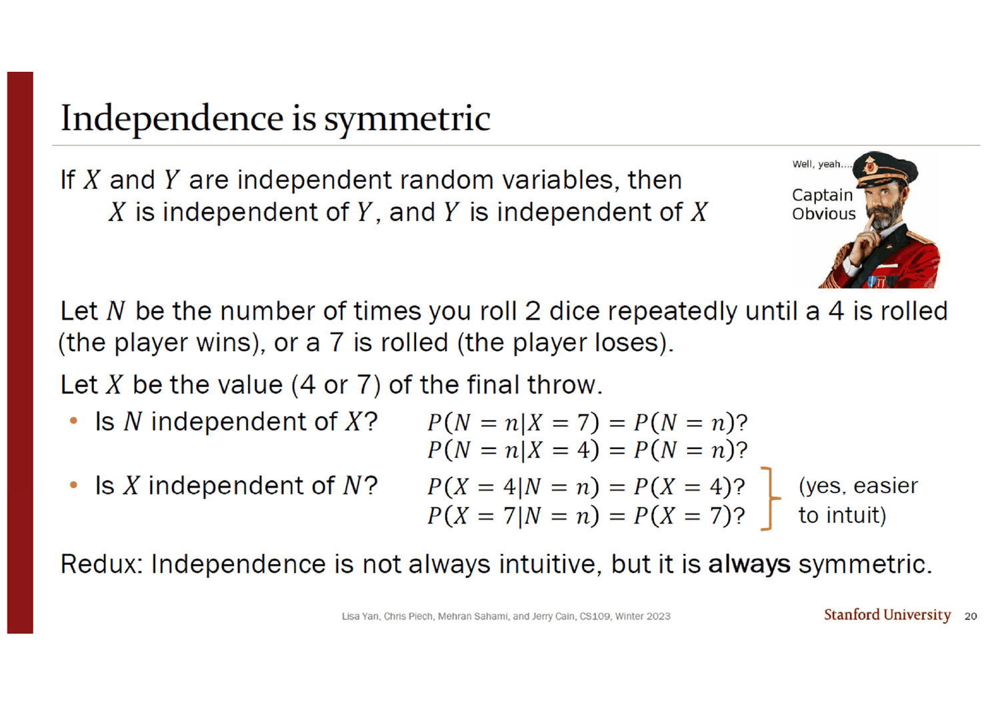

> [!abstract] 덱이 스스로 붙인 단서
> 4번 슬라이드는 $X \sim \text{Bin}(n_1, p)$, $Y \sim \text{Bin}(n_2, p)$ 가 독립이면 $X + Y \sim \text{Bin}(n_1 + n_2, p)$ 라는 결과를 주황 상자에 넣어 보인 뒤, 오른쪽 아래에 파란 글씨로 한 줄을 덧붙인다.
>
> > *If only it were always so simple*
>
> **이 여섯 단어가 덱 전체의 목차다.** 나머지 스물한 장은 「언제나 그렇지는 않다」를 세 번 확인한다 — 포아송도 닫히고(12번), $p$ 가 다른 이항 둘은 닫히지 않으며(17번, 그것도 **잉크에만** 적혀 있다), 그 닫히지 않음을 우회하는 방법이 바로 **포아송 근사**다.
>
> 그래서 이 덱의 포아송 근사는 11번 덱의 정규 근사와 쓰임이 다르다. 11번 덱은 계산이 버거워서 근사했다. 여기서는 **정확한 값이 한 줄로 계산되는데도**(17번이 0.2327을 인쇄한다) 근사한다. 사는 것은 계산량이 아니라 **닫힘**이다. 그리고 마지막 네 장은 그 모든 것을 우회한다 — 기댓값만 원한다면 분포도, 독립성도, 닫힘도 필요 없다.

---

## 이 덱을 읽는 순서

표지 목차는 `2 Sums of Binomials`, `7 Convolutions and Poisson`, `15 Exercises`, `21 Expectation of Common RVs` 네 줄이고 네 절 모두 약속한 번호에 정확히 있다. 그런데 이 순서대로 읽으면 3번 절(연습문제)이 왜 거기 있는지가 보이지 않는다. **닫힘을 기준으로 다시 세우면 하나로 읽힌다.**

```mermaid
flowchart TB
    Q["X + Y 의 분포를 알고 싶다"]
    Q --> D{"두 분포가<br/>같은 가족인가?"}

    D -->|"이항 · p 가 같다"| C1["X+Y ~ Bin(n₁+n₂, p)<br/>슬라이드 4 · 6"]
    D -->|"포아송"| C2["X+Y ~ Poi(λ₁+λ₂)<br/>슬라이드 12 · 13"]
    D -->|"이항 · p 가 다르다"| C3["닫히지 않는다<br/>슬라이드 17 — 잉크에만 있다"]

    C3 --> W1["우회 ①: 합성곱을 직접 돈다<br/>정확값 0.2327"]
    C3 --> W2["우회 ②: 둘 다 포아송으로 근사한다<br/>→ 닫힘을 산다 · 0.2302"]

    C1 --> R["합성곱<br/>P(X+Y=n) = Σₖ P(X=k)P(Y=n−k)<br/>슬라이드 8 · 9"]
    C2 --> R
    W1 --> R

    Q --> E["기댓값만 필요하다면?"]
    E --> E1["E[ΣXᵢ] = ΣE[Xᵢ]<br/>분포도 · 독립도 · 닫힘도 필요 없다<br/>슬라이드 22~25"]

    style Q fill:transparent,stroke:var(--border)
    style C3 fill:transparent,stroke:var(--chart-1),stroke-width:2px
    style W2 fill:transparent,stroke:var(--chart-1),stroke-width:2px
    style E1 fill:transparent,stroke:var(--chart-2),stroke-width:2px
```

---

## 정의부터 — 쉼표가 곱으로 바뀐다

3번 슬라이드는 지난 덱이 도입한 쉼표를 이어받아 딱 한 줄을 바꾼다.

$$\text{사건: } P(EF) = P(E)P(F) \quad\Longrightarrow\quad \text{확률변수: } p_{X,Y}(x,y) = p_X(x)\,p_Y(y) \ \ \text{(모든 } x, y \text{에 대해)}$$

슬라이드가 왼쪽에 *"Different notation, same idea"* 라고 못 박는다. **11번 덱에서 쉼표는 교집합의 다른 이름이었고, 여기서 그 쉼표가 곱으로 분해된다.** 직관은 한 줄 — *"knowing value of $X$ tells us nothing about the distribution of $Y$ (and vice versa)"* — 이고, 독립이 아니면 **종속(dependent)** 이라 부른다.

오른쪽 여백의 잉크가 정의를 한 단계 더 일반화해 적어 두었다.

$$P(X = x,\, Y = y) = P(X = x \mid Y = y)\,P(Y = y)$$

그리고 *"restated definition of conditional probability for two random variables"* 라는 설명이 붙어 있다. **이 줄은 독립이든 아니든 언제나 참이고, 독립일 때만 $P(X=x \mid Y=y)$ 가 $P(X=x)$ 로 무너진다.** 인쇄물은 독립인 경우만 적었고, 잉크가 그 바깥을 채웠다.

「모든 $x, y$에 대해」라는 한정사도 가볍지 않다. 19번 슬라이드가 $n$ 개로 확장할 때 사건의 독립 정의(모든 부분집합에 대해 곱이 성립)와 나란히 놓고 보면, 확률변수 쪽은 부분집합을 따로 요구하지 않는다.

$$P(X_1 = x_1, \ldots, X_n = x_n) = \prod_{i=1}^{n} P(X_i = x_i)$$

**한 등식이 모든 $x_1, \ldots, x_n$ 에 대해 성립하면 부분집합 조건은 자동으로 따라온다**(원하지 않는 변수를 모든 값에 대해 합하면 된다). 덱은 두 정의를 나란히 인쇄만 하고 그 차이를 언급하지 않는다.

---

## 닫히는 경우 ① — 이항, 단 $p$ 가 같을 때



4번 슬라이드가 대는 직관은 증명이 아니라 **재해석**이다.

> - $X$ 의 각 시행과 $Y$ 의 각 시행은 독립이고 **성공확률이 같은 $p$** 다.
> - $Z =$ 성공확률 $p$ 인 $n_1 + n_2$ 번의 독립 시행에서의 성공 횟수라 하자. 그러면 $Z \sim \text{Bin}(n_1+n_2, p)$ 이고 **동시에** $Z = X + Y$ 다.

새로 계산한 것이 없다. 같은 동전 던지기 묶음을 두 조각으로 나눠 보느냐 한 덩어리로 보느냐의 차이뿐이다. **그래서 $p$ 가 같아야 한다는 조건이 본질적이다** — $p$ 가 다르면 「성공확률 $p$ 인 $n_1+n_2$ 번의 시행」이라는 문장 자체가 성립하지 않는다.

6번 슬라이드가 이 논리를 검산한다. 동전을 $n + m$ 번 던져 앞 $n$ 번의 앞면 수를 $X$, 뒤 $m$ 번의 앞면 수를 $Y$, 전체를 $Z$ 라 할 때

- $X$ 와 $Z$ 는 **독립이 아니다.** 반례가 한 줄 — *"What if $Z = 0$?"* ($Z=0$ 이면 $X$ 는 0으로 확정된다)
- $X$ 와 $Y$ 는 **독립이다.** 그리고 그 증명은 세기(counting)만으로 끝난다.

$$P(X = x, Y = y) = \underbrace{\binom{n}{x}p^x(1-p)^{n-x}}_{\text{앞 } n \text{번에 관한 것 전부}} \cdot \underbrace{\binom{m}{y}p^y(1-p)^{m-y}}_{\text{뒤 } m \text{번에 관한 것 전부}} = P(X=x)P(Y=y)$$

잉크가 두 덩이에 각각 하늘색·연두색을 칠하고 *"all things $n, x$"*, *"all things $m, y$"* 라고 이름 붙였다. 주황 상자의 문장이 핵심이다 — *"This probability (found through counting) is the product of the marginal PMFs."* **세어 보니 곱이 되더라**가 독립의 증명이다.

---

## 합성곱 — 전체 절차는 반대각선을 훑는 것

8번 슬라이드가 두 줄을 위아래로 놓는다. 위는 **임의의** 이산 확률변수에 대해, 아래는 **독립인** 경우에 대해.

$$P(X + Y = n) = \sum_k P(X = k,\, Y = n-k) \qquad\xrightarrow{\ \text{독립}\ }\qquad \boxed{\;P(X+Y=n) = \sum_k P(X=k)\,P(Y=n-k)\;}$$

아래 줄에만 이름이 붙는다 — **$p_X$ 와 $p_Y$ 의 합성곱(convolution)**. 독립이 하는 일은 결합 PMF를 두 주변 PMF의 곱으로 쪼개는 것뿐이고, 위 줄은 독립 없이도 늘 참이다.

9번 슬라이드가 이 합을 격자 위에 그린다. 가로축이 $X$, 세로축이 $Y$ 인 표에서 $X + Y = n$ 인 칸들은 **왼쪽 아래에서 오른쪽 위로 가는 반대각선**이고, 체크 표시가 $(0, n)$, $(1, n-1)$, $(2, n-2)$, …, $(n, 0)$ 에 찍혀 있다. 슬라이드가 두 가지를 짚는다 — 각 칸의 확률이 독립 덕에 곱으로 쪼개지고, 칸들이 **서로 배반**이라 그냥 더하면 된다는 것.

> [!note] 11번 덱과 같은 그림이다
> 11번 덱 26번 슬라이드가 $P(C=3)$ 을 구할 때 4×4 표의 반대각선 네 칸을 색칠했다. 그 덱은 그것을 「전확률의 법칙」이라 불렀고 계산법은 다음 강의로 미뤘다. **이 덱 9번이 그 그림에 이름을 붙인 것이 합성곱이다.** 달라진 것은 독립 가정이 추가되어 각 칸이 곱으로 쪼개진다는 점뿐이다.

### 주사위 두 개로 확인한다



10번 슬라이드는 주사위 두 개의 합 분포를 그리고 $n = 4$ 막대만 세 색으로 쪼개 보인다.

$$P(X+Y=4) = \underbrace{P(X{=}1)P(Y{=}3)}_{\text{하늘색}} + \underbrace{P(X{=}2)P(Y{=}2)}_{\text{연두색}} + \underbrace{P(X{=}3)P(Y{=}1)}_{\text{분홍색}}$$

잉크가 그 막대로 화살표를 그어 한 줄을 적었다 — *"this 3/36 is really 3 contributions of 1/36 stacked on top of one another."* **삼각형 모양의 분포는 「합이 가운데로 몰린다」가 아니라 「가운데일수록 반대각선이 길다」에서 나온다.** 아래에서 직접 확인할 수 있다.

```html preview
<div id="cv-app" style="font-family:system-ui,-apple-system,sans-serif;color:var(--foreground);background:var(--card);border:1px solid var(--border);border-radius:12px;padding:18px 16px;">
  <div style="display:flex;flex-wrap:wrap;gap:12px;align-items:center;margin-bottom:14px;">
    <label style="font-size:13px;font-weight:600;">합 n</label>
    <input id="cv-n" type="range" min="2" max="12" value="4" step="1" style="flex:1;min-width:180px;accent-color:var(--chart-1);">
    <output id="cv-nv" style="font-variant-numeric:tabular-nums;font-weight:700;font-size:15px;min-width:1.6em;">4</output>
  </div>
  <svg id="cv-svg" viewBox="0 0 620 250" style="width:100%;height:auto;display:block;"></svg>
  <div id="cv-terms" style="margin-top:12px;font-size:13px;line-height:1.9;font-variant-numeric:tabular-nums;"></div>
</div>
<script>
(function(){
  const svg=document.getElementById('cv-svg'), NS='http://www.w3.org/2000/svg';
  function el(n,a){const e=document.createElementNS(NS,n);for(const k in a)e.setAttribute(k,a[k]);return e;}
  const L=56,B=206,TOP=14,W=540;
  const cnt=n=>6-Math.abs(7-n);                // 합이 n 이 되는 (x,y) 쌍의 수
  const sx=n=>L+(n-2)*(W/11)+ (W/11)/2, bw=(W/11)*0.7;
  const sy=c=>B-(c/6)*(B-TOP);
  function draw(n){
    svg.textContent='';
    svg.appendChild(el('line',{x1:L,y1:B,x2:L+W,y2:B,stroke:'var(--border)'}));
    for(let m=2;m<=12;m++){
      const c=cnt(m), sel=(m===n);
      // 막대를 1/36 조각으로 쌓아 그린다
      for(let j=0;j<c;j++){
        const y0=B-((j+1)/6)*(B-TOP), y1=B-(j/6)*(B-TOP);
        svg.appendChild(el('rect',{x:sx(m)-bw/2,y:y0,width:bw,height:y1-y0-1.5,
          fill:sel?'var(--chart-1)':'var(--muted-foreground)',opacity:sel?(0.45+0.55*(j+1)/c):0.22}));
      }
      const t=el('text',{x:sx(m),y:B+18,'text-anchor':'middle','font-size':11,
        fill:sel?'var(--chart-1)':'var(--muted-foreground)','font-weight':sel?700:400});
      t.textContent=m; svg.appendChild(t);
      const v=el('text',{x:sx(m),y:sy(c)-6,'text-anchor':'middle','font-size':10.5,
        fill:sel?'var(--chart-1)':'var(--muted-foreground)','font-weight':sel?700:400});
      v.textContent=c+'/36'; svg.appendChild(v);
    }
    const yl=el('text',{x:6,y:TOP+30,'font-size':11,fill:'var(--muted-foreground)'});
    yl.textContent='P(X+Y=n)'; svg.appendChild(yl);
  }
  function terms(n){
    let out='<b>P(X + Y = '+n+')</b> &nbsp;=&nbsp; ';
    const parts=[];
    for(let k=1;k<=6;k++){ const j=n-k; if(j>=1&&j<=6) parts.push('P(X='+k+')P(Y='+j+')'); }
    out+=parts.join(' + ');
    out+='<br><span style="color:var(--muted-foreground)">&nbsp;=&nbsp; '+parts.length+' × (1/6)(1/6) &nbsp;=&nbsp; </span>'+
         '<b style="color:var(--chart-1)">'+parts.length+'/36</b>'+
         '<span style="color:var(--muted-foreground)"> &nbsp;≈ '+(parts.length/36).toFixed(4)+'</span>';
    out+='<p style="margin:10px 0 0;font-size:12.5px;color:var(--muted-foreground);line-height:1.6;">'+
      (n===7?'반대각선이 가장 긴 자리다 — 여섯 칸. 최빈값이 7인 이유는 이것뿐이다.'
            :'격자에서 X+Y='+n+' 인 칸은 '+parts.length+'개다. 1/36 조각이 그만큼 쌓인다.')+'</p>';
    document.getElementById('cv-terms').innerHTML=out;
  }
  function upd(){const n=+document.getElementById('cv-n').value;
    document.getElementById('cv-nv').textContent=n; draw(n); terms(n);}
  document.getElementById('cv-n').addEventListener('input',upd); upd();
})();
</script>
```

11번 슬라이드는 같은 것을 주사위 열 개로 돌리고(합성곱 열 번) 오른쪽에 *"Looks kinda Normal…??? (more on this in Week 7)"* 라고만 적는다. **7주 뒤로 미룬 그 답이 중심극한정리다.** 11번 덱이 갈턴 보드를 두고 *"We'll explain why in 2 weeks"* 라고 적은 것과 같은 약속인데, **주차 계산이 서로 맞지 않는다**(2월 2일의 「2주 뒤」와 2월 5일의 「7주차」).

---

## 닫히는 경우 ② — 포아송, 그리고 이항정리 한 줄



12번 슬라이드는 $X \sim \text{Poi}(\lambda_1)$, $Y \sim \text{Poi}(\lambda_2)$ 가 독립이면 $X + Y \sim \text{Poi}(\lambda_1 + \lambda_2)$ 임을 **네 줄로 증명한다.** *"Proof (just for reference)"* 라고 겸손하게 적어 두었지만, 이 덱에서 처음부터 끝까지 완결된 유일한 증명이다.

$$
\begin{aligned}
P(X+Y=n) &= \sum_k P(X=k)P(Y=n-k) &&\text{독립 · 합성곱}\\
&= \sum_{k=0}^{n} e^{-\lambda_1}\frac{\lambda_1^k}{k!}\,e^{-\lambda_2}\frac{\lambda_2^{n-k}}{(n-k)!}
 \;=\; e^{-(\lambda_1+\lambda_2)}\sum_{k=0}^{n}\frac{\lambda_1^k\,\lambda_2^{n-k}}{k!\,(n-k)!} &&\text{포아송 PMF}\\
&= \frac{e^{-(\lambda_1+\lambda_2)}}{n!}\sum_{k=0}^{n}\frac{n!}{k!\,(n-k)!}\lambda_1^k\lambda_2^{n-k}
 \;=\; \frac{e^{-(\lambda_1+\lambda_2)}}{n!}(\lambda_1+\lambda_2)^n &&\text{이항정리}
\end{aligned}
$$

증명의 **유일한 기교는 셋째 줄**인데, 슬라이드는 그 기교를 인쇄하지 않았다. 잉크가 왼쪽 아래에 화살표와 함께 채워 넣었다 — *"multiply by $\frac{n!}{n!} = 1$"*. 그 곱셈이 $\frac{1}{k!(n-k)!}$ 를 $\binom{n}{k}$ 로 만들고, 그 순간 오른쪽 여백의 이항정리 $(a+b)^n = \sum_k \binom{n}{k}a^k b^{n-k}$ 가 적용된다.

> [!warning] 원본 오류 — 12번 슬라이드의 `:=`
> 셋째 줄에서 합 기호와 $\frac{e^{-(\lambda_1+\lambda_2)}}{n!}(\lambda_1+\lambda_2)^n$ 사이의 등호가 **`:=`(콜론 등호)로 인쇄되어 있다.** 300 dpi 재렌더로 확인했다. 이 자리는 정의가 아니라 이항정리를 적용한 등식이고, 같은 증명의 다른 등호 다섯 개는 전부 평범한 `=` 다.

13번은 같은 결과를 $n$ 개로 확장하고 — $\sum X_i \sim \text{Poi}(\sum \lambda_i)$ — 그 아래에 장바구니 가득한 상어 인형 사진을 붙인다. 14번이 이것을 실전으로 옮긴다. 서버 $n$ 대의 분당 요청 수가 각각 독립인 $X_i \sim \text{Poi}(\lambda_i)$ 일 때 전체 요청이 10건을 넘을 확률. **인쇄된 슬라이드에는 문제만 있고 풀이가 없으며, 아래쪽은 전부 잉크다.**

$$\lambda = \sum_{i=1}^{n}\lambda_i, \qquad P(X > 10) = 1 - P(X \le 10) = 1 - \sum_{k=0}^{10} e^{-\lambda}\frac{\lambda^k}{k!} = 1 - e^{-\lambda}\sum_{k=0}^{10}\frac{\lambda^k}{k!}$$

잉크가 $\lambda$ 의 정의에 초록 밑줄을 긋고, 마지막 변형에서 $e^{-\lambda}$ 를 합 바깥으로 빼는 자리에도 초록을 칠했다. **$n$ 대의 서버가 $\lambda$ 하나로 접히는 것**이 13번 결과의 전부이고, 그 뒤는 포아송 하나를 다루는 평범한 계산이다.

---

## 닫히지 않는 경우 — 그리고 그 답은 잉크에만 있다



16번 슬라이드가 두 문제를 던지고 17·18번이 각각 답한다. 첫 문제는 $X \sim \text{Bin}(30, 0.01)$, $Y \sim \text{Bin}(50, 0.02)$ 가 독립일 때 $P(X+Y=2)$ 를 (ㄱ) 포아송 근사로, (ㄴ) 정확히 구하는 것이다.

인쇄된 부분은 (ㄴ)뿐이다.

$$P(X+Y=2) = \sum_{k=0}^{2}\binom{30}{k}0.01^k(0.99)^{30-k}\binom{50}{2-k}0.02^{2-k}0.98^{50-(2-k)} \approx 0.2327$$

(ㄱ)은 전부 잉크다 — $X$ 를 $A \sim \text{Poi}(0.3)$ 으로, $Y$ 를 $B \sim \text{Poi}(1.0)$ 으로 근사하고, $S = A + B \sim \text{Poi}(1.3)$ 이므로

$$P(X+Y=2) \approx P(S=2) = e^{-1.3}\frac{1.3^2}{2!} = 0.2303$$

두 값을 직접 재계산해 대조했다 — 정확값 $0.232688$, 포아송 근사 $0.230289$. **여기서 근사가 아낀 것은 계산이 아니다.** 인쇄된 정확 계산은 항이 셋뿐이고 한 줄로 끝난다. 근사가 아낀 것은 **「$X+Y$ 가 무슨 분포인가」라는 질문 자체**다. 포아송으로 갈아타면 13번 결과가 그 질문에 즉답한다.

그리고 오른쪽 여백에 이 덱에서 가장 중요한 잉크가 있다.

> *Question: Is $X + Y$ a Binomial?*
> *Answer: no, because $p$ parameters of each differ!*

**인쇄된 슬라이드 어디에도 이 문답이 없다.** 4번 슬라이드가 *"If only it were always so simple"* 이라고 흘린 단서의 실제 내용이 열세 장 뒤 여백에서야 문장이 된다.

### 세 가지 합을 나란히 놓고 본다

아래 값은 전부 파이썬으로 계산해 17번의 인쇄값(0.2327)·잉크값(0.2302)과 대조한 것이다.

```html preview
<div id="cl-app" style="font-family:system-ui,-apple-system,sans-serif;color:var(--foreground);background:var(--card);border:1px solid var(--border);border-radius:12px;padding:18px 16px;">
  <div style="display:flex;flex-wrap:wrap;gap:8px;margin-bottom:14px;">
    <button class="cl-b" data-i="0">Bin(3, .5) + Bin(5, .5)</button>
    <button class="cl-b" data-i="1">Poi(0.3) + Poi(1.0)</button>
    <button class="cl-b" data-i="2">Bin(30, .01) + Bin(50, .02)</button>
  </div>
  <div style="overflow-x:auto;"><table id="cl-t" style="border-collapse:collapse;font-size:13px;font-variant-numeric:tabular-nums;min-width:420px;"></table></div>
  <p id="cl-msg" style="margin:14px 0 0;font-size:13px;line-height:1.75;min-height:5.5em;"></p>
</div>
<style>
#cl-app .cl-b{font:inherit;font-size:12.5px;padding:6px 11px;border-radius:7px;cursor:pointer;
  border:1px solid var(--border);background:transparent;color:var(--muted-foreground);}
#cl-app .cl-b[aria-pressed="true"]{border-color:var(--chart-1);color:var(--chart-1);font-weight:600;}
#cl-app td,#cl-app th{border-bottom:1px solid var(--border);padding:7px 10px;text-align:right;}
#cl-app th{color:var(--muted-foreground);font-weight:600;font-size:12px;text-align:right;}
#cl-app td:first-child,#cl-app th:first-child{text-align:left;}
</style>
<script>
(function(){
  // 전부 파이썬으로 계산해 검증한 값
  const D=[
   {lab:'Bin(3, 0.5) + Bin(5, 0.5)', cand:'Bin(8, 0.5)', ok:true, ks:[0,1,2,3,4,5,6,7,8],
    conv:[0.003906,0.031250,0.109375,0.218750,0.273438,0.218750,0.109375,0.031250,0.003906],
    fam: [0.003906,0.031250,0.109375,0.218750,0.273438,0.218750,0.109375,0.031250,0.003906],
    msg:'<b>닫힌다.</b> 모든 칸이 소수점 여섯 자리까지 일치한다 — 근사가 아니라 <b>정확히 같은 분포</b>다. 4번 슬라이드의 직관 그대로, 같은 동전 8번 던지기를 3번과 5번으로 나눠 본 것뿐이기 때문이다.'},
   {lab:'Poi(0.3) + Poi(1.0)', cand:'Poi(1.3)', ok:true, ks:[0,1,2,3,4,5,6],
    conv:[0.272532,0.354291,0.230289,0.099792,0.032432,0.008432,0.001827],
    fam: [0.272532,0.354291,0.230289,0.099792,0.032432,0.008432,0.001827],
    msg:'<b>닫힌다.</b> 12번 슬라이드가 증명한 결과다. 이번에는 재해석이 아니라 <b>이항정리 한 줄</b>이 근거다.'},
   {lab:'Bin(30, 0.01) + Bin(50, 0.02)', cand:'Bin(80, 0.01625)', ok:false, ks:[0,1,2,3,4,5,6],
    conv:[0.269376,0.356503,0.232688,0.099852,0.031688,0.007931,0.001630],
    fam: [0.269637,0.356318,0.232490,0.099850,0.031750,0.007972,0.001646],
    msg:'<b>닫히지 않는다.</b> 후보는 「평균을 맞춘 가장 그럴듯한 이항」인 Bin(80, 1.3/80)인데 셋째 자리부터 어긋난다. 눈으로는 아슬아슬하지만 <b>분산이 결론을 낸다</b> — 아래 참조. 17번 슬라이드의 잉크가 적은 <i>“no, because p parameters of each differ!”</i> 가 이것이다.'}
  ];
  let i=0;
  const t=document.getElementById('cl-t'), m=document.getElementById('cl-msg');
  function render(){
    const d=D[i];
    let h='<tr><th>n</th>'+d.ks.map(k=>'<th>'+k+'</th>').join('')+'</tr>';
    h+='<tr><td>합성곱 P(X+Y=n)</td>'+d.conv.map(v=>'<td>'+v.toFixed(6)+'</td>').join('')+'</tr>';
    h+='<tr><td style="color:'+(d.ok?'var(--chart-2)':'var(--chart-1)')+'">'+d.cand+'</td>'+
       d.fam.map((v,j)=>{const same=Math.abs(v-d.conv[j])<5e-7;
         return '<td style="color:'+(same?'var(--chart-2)':'var(--chart-1)')+';font-weight:'+(same?400:700)+'">'+v.toFixed(6)+'</td>';}).join('')+'</tr>';
    t.innerHTML=h; m.innerHTML=d.msg;
    document.querySelectorAll('#cl-app .cl-b').forEach(b=>b.setAttribute('aria-pressed', (+b.dataset.i)===i));
  }
  document.querySelectorAll('#cl-app .cl-b').forEach(b=>b.addEventListener('click',()=>{i=+b.dataset.i;render();}));
  render();
})();
</script>
```

> [!note] 잉크의 답을 분산으로 확정한다 (원본에 없는 보충)
> 잉크는 이유만 말하고 증명하지 않는다. 두 줄이면 끝난다.
>
> $X+Y$ 의 지지집합이 $\{0, \ldots, 80\}$ 이므로 만약 이것이 $\text{Bin}(n, p)$ 라면 $n = 80$ 이어야 한다. 그러면 평균에서 $p$ 가 정해진다 — $80p = 30(0.01) + 50(0.02) = 1.3$ 이므로 $p = 0.01625$. 그런데 실제 분산은
> $$\text{Var}(X+Y) = 30(0.01)(0.99) + 50(0.02)(0.98) = 0.297 + 0.98 = \mathbf{1.277}$$
> 이고 $\text{Bin}(80, 0.01625)$ 의 분산은 $1.3 \times 0.98375 = \mathbf{1.278875}$ 다. **같지 않으므로 이항이 아니다.**
>
> 굳이 $n = 80$ 을 고집하지 않아도 된다. 평균 1.3과 분산 1.277을 동시에 맞추려면 $1 - p = 1.277/1.3$, 즉 $p = 0.0176923\ldots$ 이고 $n = 1.3/p = 73.478\ldots$ 로 **정수가 아니다.** 어떤 이항분포도 이 두 모멘트를 동시에 가질 수 없다.
>
> 참고로 $\text{Poi}(1.3)$ 의 분산은 정확히 1.3이다. 세 값(1.277 · 1.278875 · 1.3)이 모두 붙어 있어 근사가 잘 듣는 것이고, **잘 듣는 것과 같은 것은 다르다.**

---

## 포아송은 반대 방향으로도 닫힌다



18번이 16번의 두 번째 문제에 답하는데, 결과가 12번의 정반대다. 하루 요청 수 $N \sim \text{Poi}(\lambda)$ 이고 각 요청이 독립적으로 확률 $p$ 로 사람, $1-p$ 로 봇에서 온다. $X$ 를 사람 요청 수, $Y$ 를 봇 요청 수라 할 때 — **$X$ 와 $Y$ 는 독립이고, 각각 $\text{Poi}(\lambda p)$ 와 $\text{Poi}(\lambda(1-p))$ 다.**

이것이 놀라운 이유는 $X + Y = N$ 으로 **묶여 있기 때문**이다. 11번 덱 6번 슬라이드가 보인 반례($X$ 와 $Z = X+Y$ 는 종속)가 여기서는 통하지 않는다. 총합이 포아송이면 쪼갠 두 조각이 서로를 전혀 구속하지 않는다.

유도는 다섯 줄이고, 잉크가 각 단계에 색을 칠했다.

1. **전확률의 법칙** — $N = x+y$ 인 경우와 아닌 경우로 나눈다. 잉크가 둘째 항을 연두로 감싸고 *"term bracketed in lime green is 0"* 이라 적었다. $N \ne x+y$ 인데 $X=x, Y=y$ 일 수는 없기 때문이고, 그래서 *"doesn't matter what $P(N \ne x+y)$ equals"* 다
2. **연쇄법칙** — $P(X=x \mid N=x+y)\,P(Y=y \mid X=x, N=x+y)\,P(N=x+y)$
3. 가운데 인자가 **1** 이다. $N$ 과 $X$ 가 정해지면 $Y$ 는 뺄셈으로 확정된다
4. 첫 인자는 **이항** 이다 — $N = x+y$ 번의 독립 시행이 주어졌으므로 $X \mid N \sim \text{Bin}(x+y,\, p)$
5. 남은 것은 대수다 — $(x+y)!$ 가 약분되고 $e^{-\lambda} = e^{-\lambda p}e^{-\lambda(1-p)}$ 로 쪼개지면서 두 포아송 PMF의 곱이 남는다

$$\frac{(x+y)!}{x!\,y!}\,e^{-\lambda}\frac{(\lambda p)^x\big(\lambda(1-p)\big)^y}{(x+y)!}
= \underbrace{e^{-\lambda p}\frac{(\lambda p)^x}{x!}}_{\text{Poi}(\lambda p)}\cdot\underbrace{e^{-\lambda(1-p)}\frac{\big(\lambda(1-p)\big)^y}{y!}}_{\text{Poi}(\lambda(1-p))}$$

잉크가 마지막 두 덩이에 각각 빨강·분홍을 칠하고 그 색을 다음 줄의 $P(X=x)$, $P(Y=y)$ 에도 그대로 옮겼다. 주황 상자가 결론을 외친다 — *"Yes, $X$ and $Y$ are independent!"*

---

## 대칭성 — 답이 방향을 바꿔야만 보인다



20번 슬라이드의 형식이 특이하다. 위쪽 절반은 「캡틴 오비어스」 사진과 함께 *"$X$ is independent of $Y$, and $Y$ is independent of $X$"* 라는 당연한 말을 적는다. 그리고 아래쪽에서 그 당연한 말이 실제로 쓰이는 자리를 보인다.

주사위 두 개를 4 또는 7이 나올 때까지 굴린다. $N$ 은 굴린 횟수, $X$ 는 마지막에 나온 값(4 또는 7)이다.

| 방향 | 물어야 할 것 | 슬라이드의 평 |
| --- | --- | --- |
| $N$ 이 $X$ 와 독립인가? | $P(N=n \mid X=7) = P(N=n)$? · $P(N=n \mid X=4) = P(N=n)$? | (없음) |
| $X$ 가 $N$ 과 독립인가? | $P(X=4 \mid N=n) = P(X=4)$? · $P(X=7 \mid N=n) = P(X=7)$? | **(yes, easier to intuit)** |

**슬라이드는 첫 줄에 답을 달지 않는다.** 답은 둘째 줄에만 붙어 있고, 마지막 한 줄이 그것을 첫 줄로 옮기는 규칙이다 — *"Redux: Independence is not always intuitive, but it is **always** symmetric."*

직접 확인해 보면 정말 독립이다. 한 번 굴려 멈출 확률은 $P(4) + P(7) = \tfrac{3}{36} + \tfrac{6}{36} = \tfrac14$ 이고, 멈췄을 때 그것이 4일 확률은 $\tfrac{3/36}{9/36} = \tfrac13$ 이다. 그러면

$$P(N=n,\, X=4) = \left(\tfrac34\right)^{n-1}\cdot\tfrac{3}{36} = \underbrace{\left(\tfrac34\right)^{n-1}\tfrac14}_{P(N=n)}\cdot\underbrace{\tfrac13}_{P(X=4)}$$

으로 모든 $n$ 에서 정확히 곱으로 갈라진다(유리수 연산으로 확인). $N \sim \text{Geo}(1/4)$ 이고 $X$ 는 그것과 무관한 $1/3$-$2/3$ 동전이다.

> [!tip] 이 슬라이드의 쓸모
> 「$N$ 이 $X$ 와 독립인가」는 *언제 멈췄는지가 무엇으로 멈췄는지를 알려 주는가* 라는 어려운 질문이다. 「$X$ 가 $N$ 과 독립인가」는 *몇 번째인지를 알면 4일 확률이 달라지는가* 라는 쉬운 질문이고, 매 시행이 같으므로 답이 바로 보인다. **대칭성은 두 질문 중 쉬운 쪽을 고를 자유를 준다.**

---

## 그리고 닫힘이 필요 없는 길

21번에서 마지막 절이 열리고, 22번이 이 덱의 결말이다.

$$X = \sum_{i=1}^{n} X_i \;\Longrightarrow\; E[X] = E\!\left[\sum_{i=1}^{n}X_i\right] = \sum_{i=1}^{n}E[X_i]$$

> - $X$ 의 **분포**를 몰라도(예: $(X_1, \ldots, X_n)$ 의 결합분포를 모르기 때문에) **기댓값은 계산할 수 있다.**
> - 문제 풀이의 열쇠: $X = \sum X_i$ 가 되도록 $X_i$ 를 **정의하는 것**
>
> 주요 용례: $E[X_i]$ 가 계산하기 쉬울 때 · **종속인 확률변수들의 합**

**이 덱이 20장 동안 따져 온 닫힘도, 그 전제인 독립도 여기서는 필요 없다.** 앞 절 전체가 「$X+Y$ 가 무슨 분포인가」를 물었다면, 여기서는 그 질문을 던지지 않는 대신 답도 하나(평균)만 받는다. 11번 덱 41번의 증명이 독립을 한 번도 쓰지 않았던 이유가 여기서 값을 한다.

23·25번이 같은 도구를 두 번 쓴다. 형식이 똑같아서 나란히 놓으면 방법이 드러난다.

| | 이항 (23번) | 음이항 (25번) |
| --- | --- | --- |
| 목표 | $X \sim \text{Bin}(n,p)$, $E[X] = np$ | $Y \sim \text{NegBin}(r,p)$, $E[Y] = r/p$ |
| 한 조각으로 되돌리면 | $\text{Bin}(1,p) = \text{Ber}(p)$ | $\text{NegBin}(1,p) = \text{Geo}(p)$ |
| 조각의 정의 | $X_i =$ $i$번째 시행이 앞면 | $Y_i =$ $(i{-}1)$번째 성공 이후 $i$번째 성공까지 걸린 시행 수 |
| 조각의 분포 | $X_i \sim \text{Ber}(p)$, $E[X_i] = p$ | $Y_i \sim \text{Geo}(p)$, $E[Y_i] = 1/p$ |
| 조각의 개수 | $n$ | $r$ |
| 합 | $\sum_{i=1}^{n} p = np$ | $\sum_{i=1}^{r} \tfrac1p = \tfrac rp$ |

24번은 25번의 **문제본**이다. 합 기호의 위 첨자가 `?` 로 비어 있고 두 질문만 인쇄되어 있다 — *"How should we define $Y_i$?"*, *"How many terms are in our summation?"* 그리고 답은 잉크에 있다.

> *$Y_i$ counts # of trials needed to produce $i$th success since $(i-1)$th success*
> *$r$, since we need $r$ successes*

**두 번째 질문이 이 방법의 핵심이다.** 이항에서는 조각의 개수 $n$ 이 처음부터 주어져 있지만, 음이항에서는 $Y$ 자체가 「몇 번 던지는가」라 조각의 개수를 시행 수로 잡고 싶어진다. 그런데 그 수는 확률변수다. 옳은 답은 **고정된 $r$** — 쪼개는 축을 「시행」이 아니라 「성공」으로 잡아야 개수가 상수가 된다. 24번의 `?` 가 붙은 자리가 정확히 그 함정이고, 슬라이드는 그것을 인쇄하지 않았다.

---

## 원본 오류·불일치

`계산·표기`

- **12번 슬라이드 셋째 줄** — 이항정리를 적용하는 등호가 **`:=` 로 인쇄**되어 있다. 정의가 아니라 등식이고, 같은 증명의 나머지 등호는 모두 `=` 다 (300 dpi 확인)
- **17번 슬라이드의 잉크 `.2302`** — $e^{-1.3}\frac{1.3^2}{2!} = 0.2302894$ 라 넷째 자리에서 반올림하면 `.2303` 이다. 손글씨가 잘라 적은 것으로 보인다. 같은 슬라이드 인쇄값 `0.2327` 은 정확값 $0.2326879$ 의 올바른 반올림이다
- **9번 슬라이드의 저작권 줄이 가려져 있다** — `6109, Winter 2023` 으로 읽히고 앞의 `Lisa Yan, Chris Piech, Mehran Sahami, and Jerry Cain, CS` 가 격자 그림에 덮여 있다. 11번 덱 5번 슬라이드와 같은 종류다

`설명의 공백 — 답이 인쇄되지 않은 자리`

- **17번 슬라이드** — *"Is $X+Y$ a Binomial?"* 과 그 답(`no, because p parameters of each differ!`)이 **여백의 잉크에만** 있다. 4번 슬라이드의 *"If only it were always so simple"* 이 가리키는 내용이 이것인데, 인쇄물만 읽으면 $p$ 가 달라도 되는 줄 알기 쉽다
- **14번 슬라이드** — 문제만 인쇄되어 있고 **풀이 전체가 잉크**다. $\lambda = \sum\lambda_i$ 로 접는 한 줄이 13번 결과의 실제 쓸모인데 인쇄물에는 없다
- **24번 슬라이드** — 합 기호 위 첨자가 `?` 이고 두 질문만 인쇄되어 있다. 답(조각을 「성공」으로 세어 개수를 $r$ 로 고정한다)은 잉크에만 있고, 25번은 그 답을 이미 전제한 완성본이다
- **20번 슬라이드** — 두 방향의 질문 중 **둘째 줄에만 답(`yes, easier to intuit`)이 달려 있다.** 첫 줄의 답은 마지막 한 줄(「독립은 언제나 대칭이다」)을 거쳐야 나온다

`덱 구성`

- **한 장이 빠졌다** — 인쇄된 마지막 번호는 25인데 PDF는 24쪽이고, **5번**이 없다($25 - 1 = 24$). 4번(이항 합 정리)과 6번(동전 던지기 검산) 사이라 예제나 연습 한 장으로 보인다
- **연도가 섞여 있다** — 14번만 `Winter 2024` 이고 나머지 전부 `Winter 2023` 이다. 14번은 풀이가 통째로 잉크인 슬라이드이기도 하다
- **표지에 등사체 목차** — 11번 덱과 같은 형식으로 `Table of Contents` 네 줄(`2 Sums of Binomials` / `7 Convolutions and Poisson` / `15 Exercises` / `21 Expectation of Common RVs`)이 고정폭 글꼴로 인쇄되어 있고, 네 번호 모두 실제 절 시작과 일치한다

---

## 근거 자료

- **원본**: `sources/12_independent_rvs.pdf` — 24쪽, 인쇄 번호 1~25(5번 결번). 표지에 `Jerry Cain, February 5, 2024` 와 `Lecture Discussion on Ed` 링크
- **본문에 인용한 슬라이드**: 4 · 10 · 12 · 17 · 18 · 20번 (PDF 4 · 9 · 11 · 16 · 17 · 19쪽)
- **재계산한 값**: $\text{Bin}(30,0.01) + \text{Bin}(50,0.02)$ 의 합성곱 전체(정확값 $P(X{+}Y{=}2) = 0.2326879$), $\text{Poi}(1.3)$ 의 PMF($P(S{=}2) = 0.2302894$), 세 합의 PMF 대조표, 분산 논증($1.277$ 대 $1.278875$, 두 모멘트를 맞추는 $n = 73.478\ldots$), 20번 슬라이드의 독립성(유리수 연산으로 $n = 1{\sim}4$ 확인)

`직전` → [[11. 두 번 포기한다 — 분포를 근사하고, 결합분포를 버린다]] · `다음` → 공분산(13번 덱)

11번 덱 39번이 예고한 세 가지 중 **「합의 기댓값」이 여기서 끝났고**(22~25번), **「확률변수의 합의 분포」는 닫히는 두 가족에 대해서만 끝났다.** 남은 것은 공분산이다. 그리고 이 덱이 새로 남긴 빚이 둘 있다 — 11번 슬라이드의 *"Looks kinda Normal…??? (more on this in Week 7)"* 와, 17번이 포아송 근사를 꺼내면서도 근사의 **오차**를 한 번도 말하지 않은 것. 앞의 것은 `19_sampling_bootstrap` 근처, 뒤의 것은 이 과목 어디에서도 다루지 않는다.
